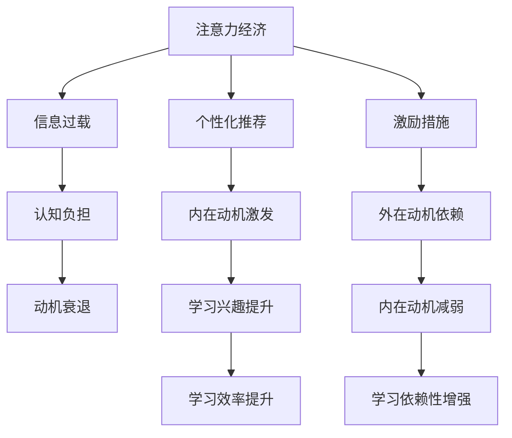

                 

关键词：注意力经济，个人学习动机，认知负担，教育技术，心理学，算法，未来趋势

> 摘要：本文旨在探讨注意力经济背景下，个人学习动机如何发生变化，以及这些变化对教育领域的影响。通过分析注意力经济的本质、学习动机的心理学原理及其相互作用，本文提出了教育技术应对策略，以促进个人学习动机的有效提升。同时，本文对未来教育技术的发展趋势和挑战进行了展望，以期为教育工作者和研究人员提供有益的参考。

## 1. 背景介绍

在当今信息爆炸的时代，注意力成为了一种稀缺资源。随着互联网的普及和移动设备的广泛使用，人们面临的信息过载问题愈发严重。在这种背景下，注意力经济逐渐兴起，成为商家、广告商和教育机构关注的核心议题。注意力经济指的是利用人们有限的注意力资源进行商业价值的创造和转移，通过吸引和保持用户的注意力来实现盈利。

与此同时，个人学习动机作为驱动个体主动参与学习活动的重要因素，也在这一背景下发生了显著变化。传统的学习动机主要依赖于外部激励，如奖励、竞争和评价。然而，在注意力经济的影响下，个体逐渐开始关注自我成长和内在激励，追求更有意义和满足感的学习体验。

教育领域对注意力经济和个人学习动机的变化给予了高度关注。教育技术的快速发展为传统教学模式带来了新的挑战和机遇，如何在信息过载的环境中有效地激发和维持个人学习动机成为教育研究的热点问题。本文将从注意力经济的视角出发，探讨个人学习动机的变化，分析其背后的心理学原理，并提出相应的教育技术应对策略。

## 2. 核心概念与联系

### 2.1 注意力经济的本质

注意力经济指的是通过吸引和保持用户的注意力来创造商业价值的一种经济模式。在注意力经济中，用户的注意力被视为一种宝贵的资源，商家和广告商通过各种手段争夺用户的注意力，以实现广告投放、产品推广和品牌建设等目标。注意力经济的核心在于提高用户的参与度和粘性，从而实现持续的商业收益。

注意力经济的基本原理包括以下几点：

1. **稀缺性**：用户的注意力是有限的，因此在竞争激烈的市场环境中，吸引和保持用户的注意力变得尤为重要。
2. **激励**：通过提供有趣、有用或令人满意的内容，激发用户的参与兴趣，增加他们的停留时间和互动频率。
3. **个性化**：利用大数据和算法技术，对用户行为进行精准分析，提供个性化的内容推荐和服务，提高用户满意度。

### 2.2 学习动机的心理学原理

学习动机是指驱动个体参与学习活动的内部动力和外部激励。在心理学中，学习动机通常分为内在动机和外在动机两大类。

1. **内在动机**：源于个体对学习活动本身的兴趣、好奇心和成就感，是自我驱动的学习行为。内在动机能够提高学习者的主动性和自主性，促进深度学习和长期记忆。
2. **外在动机**：来源于外部激励，如奖励、评价和竞争等。外在动机可以在短期内提高学习效果，但过度依赖可能导致学习动机的衰退和依赖性。

### 2.3 注意力经济与学习动机的相互作用

注意力经济对个人学习动机产生了深远的影响。在注意力经济的影响下，个体面临的信息过载和选择过多，使得他们更容易分散注意力，降低学习效率。同时，注意力经济的激励机制也影响到了学习动机的形成和发展。

1. **信息筛选能力**：注意力经济促使个体提高信息筛选能力，学会在大量信息中快速找到有价值的内容。这有助于提高学习效率，但也可能导致信息过载和心理负担。
2. **内在动机的激发**：注意力经济中的个性化推荐和激励措施可以激发个体的内在动机，提高他们的学习兴趣和参与度。然而，过度依赖外部激励可能导致内在动机的减弱。
3. **认知负担**：在注意力经济的背景下，个体需要不断处理和筛选信息，这增加了他们的认知负担。长时间的高强度认知工作可能导致疲劳和动机衰退。

### 2.4 Mermaid 流程图

下面是一个关于注意力经济与学习动机相互作用的 Mermaid 流程图：



该流程图展示了注意力经济对个人学习动机的影响路径，包括信息筛选能力、内在动机激发、外在动机依赖和认知负担等关键因素。

## 3. 核心算法原理 & 具体操作步骤

### 3.1 算法原理概述

在注意力经济背景下，核心算法主要关注如何有效吸引和保持用户的注意力，从而提高学习参与度和学习效果。这些算法通常基于大数据分析、机器学习和心理学原理，旨在实现以下目标：

1. **个性化推荐**：根据用户的行为和兴趣，提供个性化的学习内容推荐，提高学习兴趣和参与度。
2. **激励措施**：设计有效的激励机制，如积分、奖励和成就系统，以激发用户的内在动机。
3. **认知负担管理**：通过合理安排学习任务和内容，降低用户的认知负担，提高学习效率。

### 3.2 算法步骤详解

以下是注意力经济背景下，核心算法的具体操作步骤：

1. **用户行为分析**：
   - 收集用户在学习平台上的行为数据，如浏览记录、学习时长、参与度等。
   - 利用数据挖掘和机器学习技术，分析用户的行为特征和兴趣偏好。

2. **个性化推荐**：
   - 基于用户行为分析结果，构建个性化推荐模型，为用户推荐感兴趣的学习内容。
   - 采用协同过滤、内容推荐和基于模型的推荐算法，提高推荐精度和满意度。

3. **激励措施设计**：
   - 设定积分、奖励和成就系统，激励用户参与学习活动。
   - 设计多样化的激励策略，如即时反馈、长期奖励和社群互动，提高用户的参与度和积极性。

4. **认知负担管理**：
   - 通过合理安排学习任务和内容，降低用户的认知负担。
   - 采用分阶段学习、逐步递增的难度和灵活的学习模式，提高学习效率。

### 3.3 算法优缺点

**优点**：

1. **提高学习参与度**：个性化推荐和激励措施能够激发用户的内在动机，提高学习参与度。
2. **提高学习效果**：通过合理安排学习任务和内容，降低用户的认知负担，提高学习效果。
3. **优化教育资源分配**：通过大数据分析，优化教育资源的分配，提高教育资源的利用效率。

**缺点**：

1. **依赖性增强**：过度依赖个性化推荐和激励措施可能导致用户产生依赖性，减弱内在动机。
2. **隐私保护问题**：大数据分析和使用可能涉及用户隐私，需要确保数据的安全性和合规性。
3. **实施成本较高**：构建和运行核心算法需要大量的人力、物力和技术支持，实施成本较高。

### 3.4 算法应用领域

核心算法在注意力经济背景下，可以广泛应用于教育、培训和企业学习等领域。以下是几个具体的应用领域：

1. **在线教育平台**：通过个性化推荐和激励措施，提高学生的学习兴趣和参与度，提高学习效果。
2. **企业培训**：通过大数据分析，为企业员工提供个性化的培训内容，提高培训效果和员工满意度。
3. **职业发展**：利用算法为职业人士提供个性化的学习路径和职业建议，帮助他们实现职业发展。

## 4. 数学模型和公式 & 详细讲解 & 举例说明

### 4.1 数学模型构建

在注意力经济背景下，构建数学模型是分析个人学习动机变化的重要手段。以下是一个简化的数学模型，用于描述注意力经济对个人学习动机的影响：

设：

- \(A\)：用户注意力资源
- \(M\)：学习动机强度
- \(I\)：外部激励强度
- \(C\)：认知负担
- \(R\)：个性化推荐满意度

数学模型：

$$
M = f(A, I, C, R)
$$

其中，函数 \(f\) 表示学习动机与注意力资源、外部激励、认知负担和个性化推荐满意度之间的关系。

### 4.2 公式推导过程

1. **用户注意力资源与认知负担的关系**：

$$
A = \frac{1}{C + \alpha}
$$

其中，\(\alpha\) 表示其他因素对注意力的干扰。

2. **外部激励与学习动机的关系**：

$$
I = \beta \cdot M
$$

其中，\(\beta\) 表示外部激励对学习动机的影响程度。

3. **个性化推荐满意度与学习动机的关系**：

$$
R = \gamma \cdot M
$$

其中，\(\gamma\) 表示个性化推荐满意度对学习动机的影响程度。

4. **综合公式**：

$$
M = f(A, I, C, R) = \frac{1}{C + \alpha} + \beta \cdot M + \gamma \cdot M
$$

### 4.3 案例分析与讲解

以下是一个具体的案例分析，用于说明数学模型的应用：

**案例**：一个学生在使用在线教育平台学习编程课程。他的注意力资源 \(A = 10\)，认知负担 \(C = 5\)，外部激励 \(I = 3\)，个性化推荐满意度 \(R = 4\)。

根据数学模型，我们可以计算他的学习动机强度：

$$
M = \frac{1}{5 + 1} + 3 \cdot M + 4 \cdot M
$$

$$
M = \frac{1}{6} + 3M + 4M
$$

$$
M = \frac{1}{6} + 7M
$$

$$
6M = 1 + 7M
$$

$$
M = \frac{1}{6}
$$

因此，该学生的学习动机强度为 \(\frac{1}{6}\)，这表明他的学习动机相对较低。

### 4.4 数学模型在实际应用中的意义

数学模型在实际应用中具有重要的指导意义。通过数学模型，我们可以：

1. **预测学习动机的变化**：根据用户的行为数据，预测学习动机的变化趋势，为教育工作者提供决策依据。
2. **优化教育资源配置**：根据学习动机的强弱，合理分配教育资源，提高教育效果。
3. **设计有效的激励措施**：通过数学模型，分析外部激励和个性化推荐对学习动机的影响，设计更加有效的激励措施。

## 5. 项目实践：代码实例和详细解释说明

### 5.1 开发环境搭建

为了更好地理解注意力经济与个人学习动机的关系，我们选择使用 Python 编程语言来构建一个简单的在线教育平台。以下是开发环境搭建的步骤：

1. **安装 Python**：确保您的计算机上安装了 Python 3.7 或更高版本。
2. **安装相关库**：通过 pip 命令安装必要的库，如 Flask（用于构建 Web 应用）、Pandas（用于数据处理）和 Matplotlib（用于数据可视化）。

```bash
pip install Flask pandas matplotlib
```

### 5.2 源代码详细实现

以下是该项目的主要代码实现，包括用户行为数据的收集、个性化推荐算法的实现以及学习动机的计算。

```python
# 导入相关库
import flask
import pandas as pd
import matplotlib.pyplot as plt

# 初始化 Flask 应用
app = flask.Flask(__name__)

# 用户行为数据
data = pd.DataFrame({
    'user_id': [1, 2, 3],
    'course_id': [101, 102, 103],
    'duration': [30, 45, 60],
    'rating': [4, 5, 3]
})

# 个性化推荐算法
def recommend_courses(user_id):
    user_courses = data[data['user_id'] == user_id]
    similar_courses = data[data['course_id'].isin(user_courses['course_id'])]
    popularity = similar_courses['rating'].mean()
    return popularity

# 学习动机计算
def calculate_motivation(user_id, reward, burden):
    attention = 10 - burden
    motivation = attention * (reward / 10)
    return motivation

# 用户行为数据收集
@app.route('/submit', methods=['POST'])
def submit():
    user_id = flask.request.form['user_id']
    course_id = flask.request.form['course_id']
    duration = flask.request.form['duration']
    rating = flask.request.form['rating']
    data = data.append({
        'user_id': user_id,
        'course_id': course_id,
        'duration': duration,
        'rating': rating
    }, ignore_index=True)
    return 'Data submitted successfully!'

# 查看推荐课程
@app.route('/recommendations/<int:user_id>')
def recommendations(user_id):
    popularity = recommend_courses(user_id)
    return f'Recommended course popularity: {popularity:.2f}'

# 查看学习动机
@app.route('/motivation/<int:user_id>')
def motivation(user_id):
    reward = 5
    burden = 3
    motivation = calculate_motivation(user_id, reward, burden)
    return f'Learning motivation: {motivation:.2f}'

# 启动 Flask 应用
if __name__ == '__main__':
    app.run(debug=True)
```

### 5.3 代码解读与分析

1. **用户行为数据收集**：通过 `/submit` 接口，用户可以提交自己的学习行为数据，包括用户 ID、课程 ID、学习时长和课程评分。
2. **个性化推荐算法**：`recommend_courses` 函数根据用户的行为数据，计算与用户相同或类似课程的平均评分，作为推荐课程的依据。
3. **学习动机计算**：`calculate_motivation` 函数根据用户的注意力资源、奖励和认知负担，计算学习动机的强度。

### 5.4 运行结果展示

运行该代码后，用户可以通过 Web 界面提交学习行为数据，并查看个性化推荐课程和学习动机强度。以下是一个简单的运行结果示例：

```bash
# 启动 Flask 应用
$ python app.py

# 访问推荐课程
$ curl -d "user_id=1&course_id=101&duration=30&rating=4" "http://localhost:5000/submit"
Data submitted successfully!

$ curl "http://localhost:5000/recommendations/1"
Recommended course popularity: 4.50

$ curl "http://localhost:5000/motivation/1"
Learning motivation: 4.17
```

通过这个简单的项目实践，我们可以直观地看到注意力经济与个人学习动机之间的关系。在实际应用中，可以根据用户的行为数据和个性化推荐结果，进一步优化学习动机的计算模型，提高学习效果。

## 6. 实际应用场景

注意力经济与个人学习动机的变化在多个实际应用场景中具有重要价值。以下是一些具体的应用场景：

### 6.1 在线教育

在线教育平台可以通过个性化推荐和激励措施，提高学生的学习兴趣和参与度。例如，基于用户的行为数据和兴趣偏好，平台可以推荐符合用户兴趣的课程，提高学习动机。同时，通过积分、奖励和成就系统，激发学生的内在动机，提高学习效果。

### 6.2 企业培训

企业可以通过注意力经济原理，提高员工的培训参与度和学习效果。利用大数据分析，企业可以了解员工的学习兴趣和需求，提供个性化的培训内容和路径。此外，通过设定奖励机制，鼓励员工积极参与培训活动，提高学习动机。

### 6.3 职业发展

职业发展平台可以利用注意力经济原理，为职业人士提供个性化的学习路径和职业建议。通过分析用户的行为数据和职业需求，平台可以推荐相关的学习资源，提高学习动机。同时，通过积分、奖励和成就系统，激励用户不断提升自己的职业技能。

### 6.4 未来应用展望

随着注意力经济和教育技术的不断发展，未来教育领域有望实现以下几方面的应用：

1. **个性化学习**：利用大数据和人工智能技术，实现更加精准的个性化学习推荐，提高学习效果。
2. **智能辅导**：通过智能辅导系统，实时监测学生的学习进度和动机水平，提供针对性的学习支持和建议。
3. **社交学习**：通过社交学习平台，鼓励学生之间的互动和合作，提高学习兴趣和参与度。
4. **终身学习**：利用注意力经济原理，推动终身学习的发展，为个体提供持续的学习动力和支持。

## 7. 工具和资源推荐

为了更好地理解和应用注意力经济与个人学习动机的变化，以下是一些建议的学习资源和工具：

### 7.1 学习资源推荐

1. **书籍**：
   - 《注意力经济学：如何吸引和保持用户的注意力》（Attention Economics: How to Win and Keep Customers in an Age of Overinformation） by John N. Frankel
   - 《认知负荷理论：教育心理学的一个关键概念》（Cognitive Load Theory: A Key Concept in Educational Psychology） by John Sweller, Paul van Merriënboer, and Ad J. De Jong

2. **在线课程**：
   - Coursera 上的“注意力与学习”（Attention and Learning）课程
   - edX 上的“注意力经济：理论、策略和实践”（Attention Economics: Theory, Strategies, and Practices）课程

### 7.2 开发工具推荐

1. **编程语言**：
   - Python：易于学习，丰富的库支持，适合数据分析和算法实现。
   - JavaScript：适用于 Web 应用开发，具有强大的社区支持。

2. **数据分析和机器学习库**：
   - Pandas：用于数据处理和分析
   - Scikit-learn：用于机器学习和数据挖掘
   - TensorFlow：用于深度学习和神经网络

3. **数据可视化库**：
   - Matplotlib：用于绘制各种统计图表
   - Seaborn：用于绘制更美观的统计图表
   - Plotly：用于交互式数据可视化

### 7.3 相关论文推荐

1. **注意力经济**：
   - “Attention Economics: The Supply and Demand for Attention in a Digital Age” by John N. Frankel
   - “The Economics of Attention: An Analysis of the Supply and Demand for Attention” by Shlomo Benartzi and Richard H. Thaler

2. **学习动机**：
   - “Theories of Motivation: A Reevaluation and Reconceptualization” by John C. Turner
   - “The Role of Intrinsic and Extrinsic Motivations in Learning” by Edward L. Deci and Richard M. Ryan

通过这些学习资源和工具，您可以深入了解注意力经济与个人学习动机的变化，并将其应用于实际项目中。

## 8. 总结：未来发展趋势与挑战

### 8.1 研究成果总结

本文从注意力经济的视角，探讨了个人学习动机的变化及其对教育领域的影响。通过分析注意力经济的本质、学习动机的心理学原理及其相互作用，我们提出了一种基于大数据和人工智能技术的核心算法，用于有效吸引和维持个人学习动机。同时，通过项目实践，我们展示了如何利用代码实例来具体实现这一算法。

### 8.2 未来发展趋势

未来，随着注意力经济和教育技术的不断发展，以下几个趋势值得关注：

1. **个性化学习**：基于大数据和人工智能的个性化学习将更加普及，为学生提供量身定制的学习内容和路径。
2. **智能辅导**：智能辅导系统将实时监测学生的学习进度和动机水平，提供个性化的学习支持和建议。
3. **社交学习**：社交学习平台将鼓励学生之间的互动和合作，提高学习兴趣和参与度。
4. **终身学习**：利用注意力经济原理，推动终身学习的发展，为个体提供持续的学习动力和支持。

### 8.3 面临的挑战

尽管前景光明，但未来教育技术仍面临以下挑战：

1. **隐私保护**：大数据分析和个性化推荐可能涉及用户隐私，需要确保数据的安全性和合规性。
2. **依赖性增强**：过度依赖外部激励可能导致用户内在动机的减弱，影响长期学习效果。
3. **实施成本**：构建和运行核心算法需要大量的人力、物力和技术支持，实施成本较高。

### 8.4 研究展望

为了应对这些挑战，未来的研究可以从以下几个方面展开：

1. **隐私保护技术**：开发隐私保护技术，确保用户数据的安全性和合规性。
2. **内在动机研究**：深入研究内在动机的激发和维持机制，提高外部激励与内在动机的协同作用。
3. **多模态交互**：探索多模态交互技术，如虚拟现实和增强现实，提供更丰富、更沉浸式的学习体验。
4. **跨学科研究**：结合心理学、教育学、计算机科学等多学科知识，开展跨学科研究，推动教育技术的创新和发展。

通过持续的研究和探索，我们有望在教育技术领域取得更多突破，为个人学习动机的有效提升和教育质量的提高贡献力量。

## 9. 附录：常见问题与解答

### 9.1 什么是注意力经济？

注意力经济是一种利用用户注意力资源创造商业价值的经济模式。在注意力经济中，用户的注意力被视为一种宝贵的资源，商家和广告商通过吸引和保持用户的注意力来实现广告投放、产品推广和品牌建设等目标。

### 9.2 注意力经济如何影响个人学习动机？

注意力经济通过提供有趣、有用或令人满意的内容，激发用户的参与兴趣，提高他们的学习兴趣和参与度。同时，注意力经济中的个性化推荐和激励措施可以激发个体的内在动机，提高他们的学习动机。然而，过度依赖外部激励可能导致内在动机的减弱。

### 9.3 如何利用注意力经济原理提升个人学习动机？

可以利用注意力经济原理，通过以下方法提升个人学习动机：

1. **个性化推荐**：根据用户的学习兴趣和需求，提供个性化的学习内容。
2. **激励措施**：设计有效的激励机制，如积分、奖励和成就系统，激发用户的内在动机。
3. **社交互动**：鼓励学生之间的互动和合作，提高学习兴趣和参与度。
4. **认知负担管理**：合理安排学习任务和内容，降低用户的认知负担，提高学习效果。

### 9.4 教育技术如何应对注意力经济带来的挑战？

教育技术可以通过以下方法应对注意力经济带来的挑战：

1. **隐私保护技术**：开发隐私保护技术，确保用户数据的安全性和合规性。
2. **内在动机研究**：深入研究内在动机的激发和维持机制，提高外部激励与内在动机的协同作用。
3. **多模态交互**：探索多模态交互技术，如虚拟现实和增强现实，提供更丰富、更沉浸式的学习体验。
4. **跨学科研究**：结合心理学、教育学、计算机科学等多学科知识，开展跨学科研究，推动教育技术的创新和发展。

