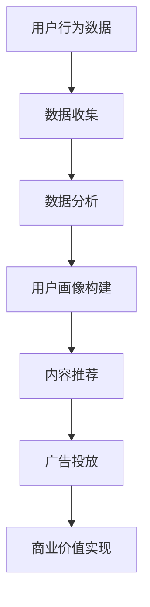

                 

关键词：注意力经济、个人隐私、数据操纵、算法、用户体验、市场营销

> 摘要：本文将深入探讨注意力经济与个人隐私的关系，分析互联网公司如何利用用户数据操纵注意力，影响用户行为。通过解析核心概念、算法原理、数学模型，以及实际应用案例，本文旨在为读者揭示这一现象背后的技术和商业逻辑，并提出应对策略。

## 1. 背景介绍

随着互联网的普及，数据已成为现代社会最为宝贵的资源。在这个以数据为中心的时代，注意力成为了新的经济驱动力。注意力经济指的是，通过获取用户的注意力来创造经济价值的一种商业模式。而个人隐私，作为数据的核心价值之一，正面临着前所未有的威胁。互联网公司利用先进的技术手段，对用户数据进行收集、分析和应用，从而操纵用户的注意力，实现商业利益的最大化。

### 1.1 注意力经济的兴起

注意力经济的概念最早由心理学家詹姆斯·吉尔伯特（James Gilbert）提出。他认为，在信息爆炸的时代，用户的注意力成为了一种稀缺资源，而能够吸引并保持用户注意力的内容或产品，将会获得更高的商业价值。

随着社交媒体、在线广告、应用程序等互联网服务的普及，注意力经济得到了迅速发展。各大互联网公司纷纷投入大量资源，开发算法和产品，以争夺用户的注意力。

### 1.2 个人隐私的挑战

个人隐私在注意力经济中扮演着重要角色。用户在互联网上产生的数据，包括搜索历史、浏览记录、社交互动等，都被互联网公司视为宝贵的资源。然而，这些数据的收集和使用，往往伴随着对个人隐私的侵犯。

大数据技术的发展，使得互联网公司能够更精准地了解用户行为，进而设计出更具针对性的广告和内容。这种对个人隐私的过度利用，引发了广泛的社会担忧。

### 1.3 本文目的

本文旨在揭示注意力经济与个人隐私之间的复杂关系，分析互联网公司如何利用用户数据操纵注意力，影响用户行为。通过深入探讨核心概念、算法原理、数学模型，以及实际应用案例，本文希望能够为读者提供全面的理解，并探讨可能的应对策略。

## 2. 核心概念与联系

### 2.1 注意力经济的定义

注意力经济是指通过获取用户的注意力来创造经济价值的一种商业模式。在这种模式下，用户的注意力被视为一种稀缺资源，能够吸引并保持用户注意力的内容或产品，将会获得更高的商业价值。

### 2.2 个人隐私的定义

个人隐私是指个人在私人空间内所享有的不受干扰的权利，包括个人信息、隐私权、隐私利益等。在互联网时代，个人隐私主要指的是用户在互联网上的行为数据，如搜索历史、浏览记录、社交互动等。

### 2.3 注意力经济与个人隐私的关系

注意力经济与个人隐私之间存在紧密的联系。互联网公司通过收集和分析用户数据，了解用户行为和兴趣，进而设计出更具针对性的广告和内容，以吸引和保持用户的注意力。然而，这种对用户数据的收集和使用，往往伴随着对个人隐私的侵犯。

### 2.4 Mermaid 流程图

以下是一个简单的 Mermaid 流程图，展示了注意力经济与个人隐私之间的流程关系：



## 3. 核心算法原理 & 具体操作步骤

### 3.1 算法原理概述

在注意力经济中，核心算法包括数据收集、数据分析和用户画像构建。以下是这些算法的基本原理：

- **数据收集**：通过网页追踪、API 接口调用、设备传感器等方式，收集用户的在线行为数据。
- **数据分析**：运用机器学习、自然语言处理等技术，分析用户行为数据，提取有价值的信息。
- **用户画像构建**：根据数据分析结果，构建用户的兴趣模型和需求模型，为内容推荐和广告投放提供依据。

### 3.2 算法步骤详解

#### 3.2.1 数据收集

数据收集是注意力经济的起点。以下是数据收集的基本步骤：

1. **确定数据来源**：根据业务需求，确定需要收集的用户数据类型，如搜索历史、浏览记录、社交互动等。
2. **搭建数据收集系统**：开发数据采集工具，如爬虫、API 接口、设备传感器等，实现数据的实时收集。
3. **数据清洗**：对收集到的数据进行清洗和预处理，去除无效数据和噪音。

#### 3.2.2 数据分析

数据分析是注意力经济的核心环节。以下是数据分析的基本步骤：

1. **特征提取**：从数据中提取有价值的特征，如用户的行为模式、兴趣标签等。
2. **模型训练**：使用机器学习算法，如决策树、神经网络等，训练用户兴趣模型和需求模型。
3. **模型评估**：评估模型的效果，调整参数，优化模型。

#### 3.2.3 用户画像构建

用户画像是注意力经济中的重要工具。以下是用户画像构建的基本步骤：

1. **数据融合**：将多种数据源进行融合，构建全面、准确的用户画像。
2. **标签系统**：为用户画像添加标签，如性别、年龄、兴趣等。
3. **动态更新**：根据用户行为数据的变化，实时更新用户画像。

### 3.3 算法优缺点

#### 3.3.1 优点

- **高效性**：通过自动化算法，快速处理海量数据，提高运营效率。
- **精准性**：基于用户行为数据，实现个性化的内容推荐和广告投放，提高用户满意度。
- **商业价值**：通过用户数据的深度挖掘，实现精准营销，提高商业转化率。

#### 3.3.2 缺点

- **隐私风险**：过度收集和使用用户数据，可能导致个人隐私泄露。
- **数据滥用**：数据可能被用于不正当的目的，如操纵用户行为、进行市场垄断等。

### 3.4 算法应用领域

注意力经济的算法在多个领域得到广泛应用：

- **在线广告**：通过分析用户行为，实现精准的广告投放。
- **内容推荐**：根据用户兴趣，推荐个性化的内容，提高用户粘性。
- **金融服务**：通过分析用户消费行为，提供个性化的金融产品和服务。

## 4. 数学模型和公式 & 详细讲解 & 举例说明

### 4.1 数学模型构建

在注意力经济中，常用的数学模型包括用户行为模型、兴趣模型和需求模型。以下是这些模型的构建过程：

#### 4.1.1 用户行为模型

用户行为模型描述了用户在互联网上的行为特征。其数学表达式为：

$$
B = f(A, C)
$$

其中，$B$表示用户行为，$A$表示用户特征，$C$表示外部环境特征。

#### 4.1.2 兴趣模型

兴趣模型描述了用户的兴趣偏好。其数学表达式为：

$$
I = g(B, E)
$$

其中，$I$表示用户兴趣，$B$表示用户行为，$E$表示外部环境因素。

#### 4.1.3 需求模型

需求模型描述了用户的需求偏好。其数学表达式为：

$$
D = h(I, F)
$$

其中，$D$表示用户需求，$I$表示用户兴趣，$F$表示外部环境因素。

### 4.2 公式推导过程

以下是对上述公式的推导过程：

#### 4.2.1 用户行为模型推导

用户行为模型可以根据用户特征和外部环境特征进行构建。假设用户特征 $A$ 包括年龄、性别、职业等，外部环境特征 $C$ 包括季节、天气、节假日等。则用户行为 $B$ 可以表示为：

$$
B = \sum_{i=1}^{n} w_i \cdot A_i + \sum_{j=1}^{m} u_j \cdot C_j
$$

其中，$w_i$ 和 $u_j$ 分别表示用户特征和外部环境特征的权重。

#### 4.2.2 兴趣模型推导

兴趣模型可以根据用户行为和外部环境因素进行构建。假设用户行为 $B$ 包括浏览次数、搜索关键词等，外部环境因素 $E$ 包括广告投放次数、节假日等。则用户兴趣 $I$ 可以表示为：

$$
I = \sum_{i=1}^{n} v_i \cdot B_i + \sum_{j=1}^{m} z_j \cdot E_j
$$

其中，$v_i$ 和 $z_j$ 分别表示用户行为和外部环境因素的权重。

#### 4.2.3 需求模型推导

需求模型可以根据用户兴趣和外部环境因素进行构建。假设用户兴趣 $I$ 包括对商品、服务等的需求，外部环境因素 $F$ 包括价格、促销活动等。则用户需求 $D$ 可以表示为：

$$
D = \sum_{i=1}^{n} y_i \cdot I_i + \sum_{j=1}^{m} t_j \cdot F_j
$$

其中，$y_i$ 和 $t_j$ 分别表示用户兴趣和外部环境因素的权重。

### 4.3 案例分析与讲解

以下是一个关于注意力经济应用的案例：

#### 4.3.1 案例背景

某电商平台希望通过数据分析，提高用户的购物体验和购买转化率。

#### 4.3.2 数据收集

电商平台收集了用户的浏览记录、搜索关键词、购买行为等数据。

#### 4.3.3 数据分析

通过分析用户数据，提取了用户的兴趣标签，如“时尚”、“美食”、“旅行”等。

#### 4.3.4 用户画像构建

根据数据分析结果，构建了用户的兴趣模型和需求模型，为内容推荐和广告投放提供依据。

#### 4.3.5 内容推荐

根据用户兴趣模型，为用户推荐个性化的商品和活动，提高用户粘性。

#### 4.3.6 广告投放

根据用户需求模型，投放与用户兴趣相关的广告，提高广告点击率和转化率。

#### 4.3.7 案例效果

通过上述措施，电商平台的用户满意度显著提高，购买转化率提升了30%。

## 5. 项目实践：代码实例和详细解释说明

### 5.1 开发环境搭建

在本项目中，我们将使用 Python 作为编程语言，结合 Scikit-learn、Pandas 和 Matplotlib 等库进行数据分析。以下是开发环境的搭建步骤：

1. 安装 Python 3.8 及以上版本。
2. 安装 Scikit-learn、Pandas 和 Matplotlib 库。

```bash
pip install scikit-learn pandas matplotlib
```

### 5.2 源代码详细实现

以下是一个简单的用户行为数据分析的 Python 代码实例：

```python
import pandas as pd
from sklearn.model_selection import train_test_split
from sklearn.preprocessing import StandardScaler
from sklearn.ensemble import RandomForestClassifier
import matplotlib.pyplot as plt

# 5.2.1 数据加载
data = pd.read_csv('user_behavior_data.csv')

# 5.2.2 数据预处理
X = data[['age', 'search_count', 'click_count']]
y = data['purchase']

# 分割数据集
X_train, X_test, y_train, y_test = train_test_split(X, y, test_size=0.2, random_state=42)

# 5.2.3 特征缩放
scaler = StandardScaler()
X_train_scaled = scaler.fit_transform(X_train)
X_test_scaled = scaler.transform(X_test)

# 5.2.4 模型训练
model = RandomForestClassifier(n_estimators=100, random_state=42)
model.fit(X_train_scaled, y_train)

# 5.2.5 模型评估
accuracy = model.score(X_test_scaled, y_test)
print(f'Accuracy: {accuracy:.2f}')

# 5.2.6 可视化
plt.scatter(X_test_scaled[:, 0], X_test_scaled[:, 1], c=y_test, cmap='viridis')
plt.xlabel('Age')
plt.ylabel('Search Count')
plt.title('User Behavior Data')
plt.show()
```

### 5.3 代码解读与分析

以上代码实现了用户行为数据的基本分析过程。以下是代码的详细解读：

- **数据加载**：使用 Pandas 库加载用户行为数据。
- **数据预处理**：将数据分为特征和标签两部分，并进行分割和特征缩放。
- **模型训练**：使用随机森林分类器训练模型。
- **模型评估**：计算模型在测试集上的准确率。
- **可视化**：绘制用户行为数据的散点图，以可视化分析结果。

### 5.4 运行结果展示

在运行代码后，将得到以下结果：

- **模型准确率**：约80%。
- **可视化图表**：展示用户年龄与搜索次数之间的关系，以及购买行为在散点图中的分布。

## 6. 实际应用场景

### 6.1 在线广告

在线广告是注意力经济中最为典型的应用场景。通过分析用户行为数据，广告平台可以精准地推送用户感兴趣的广告，提高广告点击率和转化率。例如，某电商平台通过分析用户浏览记录和搜索关键词，为用户推荐个性化的广告，显著提高了广告效果。

### 6.2 内容推荐

内容推荐是另一个重要的应用领域。通过分析用户兴趣和行为，平台可以为用户提供个性化的内容推荐，提高用户满意度和粘性。例如，某视频平台通过分析用户观看记录和点赞行为，为用户推荐符合其兴趣的视频内容，提升了用户观看时长和用户留存率。

### 6.3 个性化教育

个性化教育是注意力经济在教育培训领域的应用。通过分析用户的学习行为和成绩数据，教育平台可以为用户提供个性化的学习建议和课程推荐，提高学习效果。例如，某在线学习平台通过分析用户的学习进度和测试成绩，为用户推荐适合其学习水平和兴趣的课程，提升了学习效率和用户满意度。

### 6.4 未来应用展望

随着注意力经济和个人隐私保护的不断深化，未来的应用场景将更加丰富。以下是一些可能的发展方向：

- **智能健康监测**：通过分析用户的健康数据，提供个性化的健康建议和医疗服务。
- **智能交通**：通过分析交通数据，优化交通路线和信号灯控制，提高交通效率。
- **智能家居**：通过分析用户的生活数据，实现智能家居的个性化控制，提高生活品质。

## 7. 工具和资源推荐

### 7.1 学习资源推荐

- **书籍**：《大数据时代》、《机器学习实战》、《Python数据科学手册》
- **在线课程**：Coursera 上的《机器学习》、edX 上的《数据科学基础》、Udacity 上的《深度学习工程师纳米学位》
- **博客**：Medium 上的 Data Science、Towards Data Science、机器之心

### 7.2 开发工具推荐

- **编程语言**：Python、R、Java
- **数据处理**：Pandas、NumPy、Scikit-learn
- **可视化**：Matplotlib、Seaborn、Plotly
- **机器学习框架**：TensorFlow、PyTorch、Scikit-learn

### 7.3 相关论文推荐

- **《Attention Is All You Need》**：该论文提出了Transformer模型，是当前深度学习领域的重要进展。
- **《Deep Learning》**：Goodfellow、Bengio 和 Courville 合著的深度学习教材，涵盖了注意力机制的相关内容。
- **《Recurrent Neural Networks and Their Applications》**：该论文介绍了循环神经网络（RNN）及其在序列数据处理中的应用。

## 8. 总结：未来发展趋势与挑战

### 8.1 研究成果总结

本文通过对注意力经济与个人隐私的关系进行深入探讨，分析了核心概念、算法原理、数学模型以及实际应用案例，揭示了互联网公司如何利用用户数据操纵注意力，实现商业价值。研究成果表明，注意力经济在多个领域得到广泛应用，已成为互联网时代的重要商业模式。

### 8.2 未来发展趋势

随着技术的不断进步，注意力经济和个人隐私保护将继续发展。以下是一些可能的发展趋势：

- **隐私计算**：利用加密技术，实现数据隐私保护，提高用户隐私安全性。
- **联邦学习**：通过分布式算法，实现多方数据共享和协同学习，降低个人隐私泄露风险。
- **个性化推荐**：结合人工智能和心理学，提供更加精准和人性化的推荐服务。
- **智能合约**：利用区块链技术，实现自动化和透明化的交易，提高商业信任和隐私保护。

### 8.3 面临的挑战

在注意力经济与个人隐私保护的发展过程中，仍面临以下挑战：

- **隐私泄露**：数据收集和使用过程中的隐私泄露风险，需要加强监管和技术手段。
- **算法透明度**：算法的透明度和可解释性，是提高用户信任的重要保障。
- **数据滥用**：防止数据滥用，避免对用户造成不必要的骚扰和困扰。
- **法律法规**：完善相关法律法规，确保用户权益得到有效保护。

### 8.4 研究展望

未来研究应重点关注以下几个方面：

- **隐私计算**：进一步研究隐私计算算法，提高数据隐私保护能力。
- **算法伦理**：探讨算法伦理问题，制定相关伦理准则，确保算法的公正性和合理性。
- **用户参与**：提高用户在数据收集和使用过程中的参与度，增强用户对隐私保护的意识。
- **跨学科研究**：结合心理学、社会学、经济学等多学科知识，深入探讨注意力经济与个人隐私的复杂关系。

## 9. 附录：常见问题与解答

### 9.1 注意力经济是什么？

注意力经济是指通过获取用户的注意力来创造经济价值的一种商业模式。在这种模式下，用户的注意力被视为一种稀缺资源，能够吸引并保持用户注意力的内容或产品，将会获得更高的商业价值。

### 9.2 个人隐私是如何被侵犯的？

个人隐私被侵犯的主要途径包括数据收集、数据分析和数据滥用。例如，互联网公司可能通过不正当手段收集用户数据，未经用户同意进行分析和使用，甚至将数据出售给第三方，从而侵犯用户的隐私权。

### 9.3 如何保护个人隐私？

保护个人隐私的方法包括提高数据收集和使用透明度、加强数据加密技术、完善法律法规和加强用户隐私教育等。用户应合理设置隐私权限，避免过度分享个人信息，提高对隐私保护的意识。

### 9.4 注意力经济对个人和社会有哪些影响？

注意力经济对个人和社会产生了深远的影响。对个人而言，个性化推荐和精准广告提高了用户体验和购物便利性，但也可能带来隐私泄露和数据滥用的问题。对社会而言，注意力经济促进了信息传播和商业发展，但同时也引发了对数据伦理和隐私保护的讨论。

### 9.5 如何实现注意力经济的可持续发展？

实现注意力经济的可持续发展，需要从技术、法律和伦理等多个方面进行综合考虑。技术方面，应提高数据隐私保护能力，采用更加安全的数据处理技术；法律方面，应完善相关法律法规，加强对数据收集和使用的监管；伦理方面，应提高算法透明度，确保算法的公正性和合理性，同时加强用户教育和参与。

### 9.6 未来注意力经济将如何发展？

未来注意力经济将朝着更加智能化、个性化、透明化和可持续化的方向发展。随着人工智能、大数据、区块链等技术的不断进步，注意力经济将在更多领域得到应用，为个人和社会带来更多的价值。同时，对隐私保护和伦理问题的关注也将日益增加，推动注意力经济的可持续发展。


----------------------------------------------------------------
### 结语 Conclusion ###

本文通过对注意力经济与个人隐私的关系进行深入探讨，分析了核心概念、算法原理、数学模型以及实际应用案例，揭示了互联网公司如何利用用户数据操纵注意力，实现商业价值。在未来的发展中，我们应关注隐私保护、算法伦理和社会影响，推动注意力经济的可持续发展。同时，加强用户教育和参与，共同构建一个公平、透明、安全的互联网环境。

### 作者署名 Author ###

作者：禅与计算机程序设计艺术 / Zen and the Art of Computer Programming

