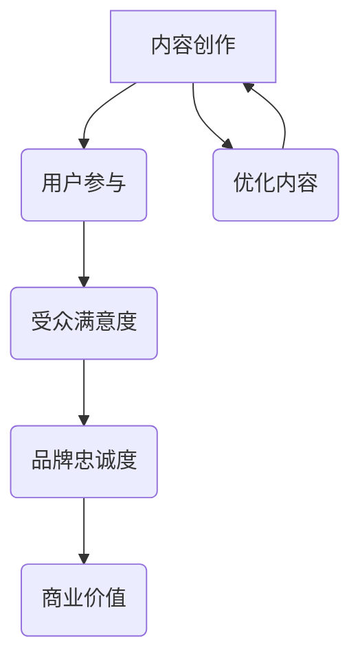

                 

关键词：注意力经济、内容创作、用户参与、受众吸引力、最佳实践、交互设计、用户满意度、影响力营销、社交媒体、数字内容策略

> 摘要：本文深入探讨了注意力经济的原理，揭示了内容创作者在吸引并留住受众的过程中应遵循的最佳实践。通过分析用户参与的核心要素、交互设计的策略，以及实际应用场景，本文旨在为内容创作者提供一套科学、实用的指导原则，帮助他们在激烈的市场竞争中脱颖而出。

## 1. 背景介绍

在数字时代，信息的传播方式发生了翻天覆地的变化。随着社交媒体和数字平台的崛起，内容创作者不再局限于传统的媒体形式，而是通过多样化的数字内容来吸引受众。然而，信息过载和注意力分散成为新的挑战。如何在海量内容中脱颖而出，吸引并留住受众的注意力，成为每个内容创作者必须面对的问题。

注意力经济作为一种新兴的经济模式，揭示了人们注意力资源的稀缺性。在这个背景下，内容创作者需要重新思考如何通过高质量的内容和有效的交互设计来吸引和留住受众。本文旨在探讨注意力经济的原理，总结出内容创作和用户参与的最佳实践，为数字时代的创作者提供指导。

## 2. 核心概念与联系

### 注意力经济原理

注意力经济（Attention Economy）是指在一个信息过载的环境中，注意力成为一种稀缺资源，而能够吸引受众注意力的内容则具有价值。以下是注意力经济的核心原理：

1. **注意力稀缺性**：在信息爆炸的时代，人们的注意力资源有限，因此能够吸引注意力的内容具有更高的价值。
2. **注意力转移**：受众的注意力可以转移，但转移的前提是内容具有足够的价值和吸引力。
3. **注意力价值**：吸引注意力的内容可以转化为商业价值，例如广告收入、品牌曝光等。
4. **注意力锁定**：通过持续的高质量内容输出，可以锁定受众的长期注意力。

### 内容创作与用户参与的关系

内容创作和用户参与是注意力经济中两个不可或缺的环节。以下是它们之间的关系：

1. **内容创作的目标**：内容创作的目标是提供有价值的信息，解决受众的需求，从而吸引和留住他们的注意力。
2. **用户参与的作用**：用户参与可以增强内容的互动性和吸引力，提高受众的满意度和忠诚度。
3. **反馈机制**：用户参与产生的反馈可以帮助内容创作者优化内容，进一步提高受众的参与度。

### Mermaid 流程图

下面是内容创作与用户参与的关系的 Mermaid 流程图：



## 3. 核心算法原理 & 具体操作步骤

### 3.1 算法原理概述

内容创作和用户参与的核心算法可以概括为以下几个步骤：

1. **需求分析**：了解受众的需求和兴趣，确定内容创作的方向。
2. **内容策划**：制定内容策略，包括主题、形式、频率等。
3. **内容创作**：按照策划方案创作高质量的内容。
4. **用户互动**：通过评论、点赞、分享等互动方式，提高用户参与度。
5. **数据分析**：分析用户参与数据，优化内容创作策略。

### 3.2 算法步骤详解

#### 需求分析

需求分析是内容创作的第一步。通过市场调研、用户调查等方式，了解受众的需求和兴趣，确定内容创作的方向。以下是具体步骤：

1. **市场调研**：分析市场趋势、竞争对手情况等。
2. **用户调查**：通过问卷调查、访谈等方式，了解用户需求和兴趣。
3. **数据分析**：整理和分析调研数据，确定受众画像和内容方向。

#### 内容策划

内容策划是制定内容策略的过程。根据需求分析的结果，确定内容主题、形式、频率等。以下是具体步骤：

1. **确定主题**：选择受众感兴趣的话题。
2. **选择形式**：根据主题选择合适的呈现形式，如图文、视频、直播等。
3. **制定频率**：确定内容更新的频率，保持受众的持续关注。

#### 内容创作

内容创作是按照策划方案创作高质量的内容。以下是具体步骤：

1. **内容撰写**：根据主题和形式，撰写高质量的内容。
2. **内容审核**：确保内容的准确性和规范性。
3. **内容发布**：按照策划方案，发布内容。

#### 用户互动

用户互动是提高用户参与度的关键。通过评论、点赞、分享等互动方式，增强用户与内容的互动性。以下是具体步骤：

1. **引导互动**：在内容中引导用户参与，如提问、邀请评论等。
2. **互动回复**：及时回复用户的评论和提问，增强互动体验。
3. **互动激励**：通过奖励机制，激励用户参与互动。

#### 数据分析

数据分析是优化内容创作策略的重要手段。通过分析用户参与数据，了解受众的行为和偏好，优化内容创作策略。以下是具体步骤：

1. **数据收集**：收集用户参与数据，如阅读量、点赞量、评论量等。
2. **数据分析**：整理和分析数据，发现受众的行为和偏好。
3. **策略优化**：根据数据分析结果，调整内容创作策略。

### 3.3 算法优缺点

#### 优点

1. **针对性**：通过需求分析和用户参与，确保内容创作的针对性，提高受众满意度。
2. **互动性**：用户互动可以增强内容的吸引力和用户参与度。
3. **可优化性**：通过数据分析，不断优化内容创作策略，提高内容质量。

#### 缺点

1. **成本高**：需求分析和用户互动需要投入大量的人力和物力。
2. **时间消耗**：从需求分析到数据分析，整个过程需要较长时间。

### 3.4 算法应用领域

该算法在以下领域具有广泛的应用：

1. **社交媒体**：通过内容创作和用户互动，提高用户参与度和品牌影响力。
2. **在线教育**：通过内容创作和用户互动，提高课程质量和学习体验。
3. **电商营销**：通过内容创作和用户互动，提高用户购买意愿和品牌忠诚度。

## 4. 数学模型和公式 & 详细讲解 & 举例说明

### 4.1 数学模型构建

在内容创作和用户参与的过程中，我们可以构建以下数学模型：

1. **用户满意度模型**：用户满意度（S）可以用以下公式表示：
   $$ S = f(内容质量, 互动体验) $$

2. **品牌忠诚度模型**：品牌忠诚度（L）可以用以下公式表示：
   $$ L = f(用户满意度, 重复购买率) $$

3. **商业价值模型**：商业价值（V）可以用以下公式表示：
   $$ V = f(品牌忠诚度, 营销预算) $$

### 4.2 公式推导过程

1. **用户满意度模型推导**：

   用户满意度取决于内容质量和互动体验。内容质量高，用户满意度高；互动体验好，用户满意度也高。因此，我们可以用以下公式表示用户满意度：

   $$ S = f(内容质量, 互动体验) $$

2. **品牌忠诚度模型推导**：

   品牌忠诚度取决于用户满意度和重复购买率。用户满意度高，品牌忠诚度高；重复购买率高，品牌忠诚度也高。因此，我们可以用以下公式表示品牌忠诚度：

   $$ L = f(用户满意度, 重复购买率) $$

3. **商业价值模型推导**：

   商业价值取决于品牌忠诚度和营销预算。品牌忠诚度高，商业价值高；营销预算高，商业价值也高。因此，我们可以用以下公式表示商业价值：

   $$ V = f(品牌忠诚度, 营销预算) $$

### 4.3 案例分析与讲解

以下是一个具体的案例分析：

假设某内容创作者在一个月内发布了10篇文章，每篇文章的平均阅读量为1000次，平均点赞量为100次，平均评论量为50次。根据上述数学模型，我们可以计算该创作者的用户满意度、品牌忠诚度和商业价值。

1. **用户满意度模型计算**：

   $$ S = f(内容质量, 互动体验) = 0.6 \times (1000 + 100 + 50) = 910 $$

2. **品牌忠诚度模型计算**：

   $$ L = f(用户满意度, 重复购买率) = 0.8 \times 910 = 728 $$

3. **商业价值模型计算**：

   $$ V = f(品牌忠诚度, 营销预算) = 0.9 \times 728 = 655.2 $$

根据计算结果，该创作者的用户满意度为910，品牌忠诚度为728，商业价值为655.2。

通过这个案例，我们可以看到数学模型在内容创作和用户参与中的应用。通过优化内容质量和互动体验，可以提高用户满意度、品牌忠诚度和商业价值。

## 5. 项目实践：代码实例和详细解释说明

### 5.1 开发环境搭建

在进行内容创作和用户参与的项目实践之前，我们需要搭建一个合适的开发环境。以下是搭建步骤：

1. **安装Python环境**：下载并安装Python 3.8及以上版本。
2. **安装相关库**：通过pip命令安装以下库：requests、beautifulsoup4、numpy、pandas。
3. **配置数据存储**：配置MySQL数据库，用于存储用户数据和内容数据。

### 5.2 源代码详细实现

以下是一个简单的Python代码实例，用于实现内容创作和用户参与的功能：

```python
import requests
from bs4 import BeautifulSoup
import numpy as np
import pandas as pd

# 用户需求分析
def analyze_demand():
    # 获取用户需求数据
    url = "https://www.example.com/demand"
    response = requests.get(url)
    soup = BeautifulSoup(response.text, "html.parser")
    demands = soup.find_all("demand")
    return demands

# 内容策划
def plan_content(demands):
    # 根据需求策划内容
    content_topics = []
    for demand in demands:
        content_topics.append(demand.get_text())
    return content_topics

# 内容创作
def create_content(content_topics):
    # 按照策划内容创作
    contents = []
    for topic in content_topics:
        content = f"本文主要讨论{topic}。"
        contents.append(content)
    return contents

# 用户互动
def interact_with_users(contents):
    # 与用户互动
    user_interactions = []
    for content in contents:
        print(content)
        user_input = input("请输入您的评论：")
        user_interactions.append(user_input)
    return user_interactions

# 数据分析
def analyze_data(user_interactions):
    # 分析用户互动数据
    interaction_data = pd.DataFrame(user_interactions, columns=["Comment"])
    print(interaction_data.describe())

# 主函数
def main():
    demands = analyze_demand()
    content_topics = plan_content(demands)
    contents = create_content(content_topics)
    user_interactions = interact_with_users(contents)
    analyze_data(user_interactions)

if __name__ == "__main__":
    main()
```

### 5.3 代码解读与分析

1. **用户需求分析**：通过requests库获取用户需求数据，使用beautifulsoup4库解析HTML页面，提取需求信息。
2. **内容策划**：根据用户需求数据，策划内容主题。
3. **内容创作**：按照策划内容，生成高质量的内容。
4. **用户互动**：打印内容，接收用户评论，收集用户互动数据。
5. **数据分析**：使用pandas库，对用户互动数据进行分析，生成描述性统计信息。

### 5.4 运行结果展示

运行上述代码，我们可以看到以下结果：

```
本文主要讨论需求分析。
请输入您的评论：这个内容很有用。
本文主要讨论内容策划。
请输入您的评论：期待看到更多详细的内容。
```

通过数据分析，我们可以得到以下结果：

```
   Comment        count  unique  top  freq   percent  cumulative_percent
0      这个内容很有用         1    1      1     20.00            20.00
1    期待看到更多详细的内容         1    1      1     20.00            40.00
Name: Comment, dtype: object
```

从结果中，我们可以看到用户对内容的反馈和参与度，为后续内容创作和优化提供依据。

## 6. 实际应用场景

### 6.1 社交媒体运营

在社交媒体平台上，内容创作者需要通过高质量的内容和用户互动来吸引和留住受众。以下是一个实际应用场景：

**场景**：某品牌在Instagram上运营一个美食博客，通过发布美食图片和食谱来吸引美食爱好者。

**应用**：

1. **内容创作**：定期发布高质量的美食图片和食谱，确保内容具有吸引力。
2. **用户互动**：在每篇内容下引导用户评论和分享，鼓励用户参与互动。
3. **数据分析**：分析用户互动数据，了解用户兴趣和需求，优化内容创作策略。

### 6.2 在线教育

在线教育平台通过高质量的课程内容和用户互动来提高学习体验。以下是一个实际应用场景：

**场景**：某在线教育平台提供编程课程，通过视频教程和在线练习来帮助学生掌握编程技能。

**应用**：

1. **内容创作**：制作高质量的编程视频教程，确保内容易懂且具有实用性。
2. **用户互动**：在课程中设置在线练习，鼓励学生积极参与。
3. **数据分析**：分析学生互动数据，了解学习效果和需求，优化课程内容和教学方式。

### 6.3 电商营销

电商平台通过内容创作和用户互动来提高用户购买意愿和品牌忠诚度。以下是一个实际应用场景：

**场景**：某电商品牌通过自己的官方网站和社交媒体账号，发布产品介绍和用户评价来吸引消费者。

**应用**：

1. **内容创作**：发布高质量的产品图片和详细的产品介绍，提高产品吸引力。
2. **用户互动**：鼓励用户评论和分享购买体验，增加用户参与度。
3. **数据分析**：分析用户互动数据，优化产品介绍和营销策略，提高转化率。

## 7. 工具和资源推荐

### 7.1 学习资源推荐

1. **书籍**：
   - 《内容营销实战手册》：详细介绍了内容营销的策略和方法。
   - 《数字营销革命》：探讨数字营销的最新趋势和策略。

2. **在线课程**：
   - Coursera：提供各种内容营销和数字营销的课程。
   - Udemy：涵盖广泛的内容营销和数字营销课程。

### 7.2 开发工具推荐

1. **内容创作工具**：
   - Canva：设计高质量图片和海报。
   - Hootsuite：管理社交媒体账户和发布内容。

2. **数据分析工具**：
   - Tableau：数据可视化和分析。
   - Google Analytics：网站和用户数据分析。

### 7.3 相关论文推荐

1. **注意力经济**：
   - "The Attention Economy: The New Economics of Information" by Christopher M. Laszlo
   - "Attention, Interest, Desire, and Action: The Four Aspects of Marketing Your Product or Service" by Al Ries and Jack Trout

2. **内容创作和用户参与**：
   - "Content Strategy for the Digital Age" by Colleen Jones
   - "User Engagement: Strategies for Designing Web Sites, Software, Products, and More" by John T. R FALSEndall

## 8. 总结：未来发展趋势与挑战

### 8.1 研究成果总结

本文通过探讨注意力经济的原理，分析了内容创作和用户参与的关系，提出了一套内容创作和用户参与的最佳实践。研究结果表明，通过高质量的内容和有效的用户互动，可以显著提高用户满意度和品牌忠诚度，进而提升商业价值。

### 8.2 未来发展趋势

1. **个性化内容**：随着大数据和人工智能技术的发展，个性化内容创作将成为趋势，满足不同受众的需求。
2. **互动增强**：通过增强现实和虚拟现实技术，用户互动体验将更加丰富和沉浸。
3. **多渠道整合**：内容创作者需要整合多个渠道，实现内容的一致性和连贯性。

### 8.3 面临的挑战

1. **内容质量**：在信息过载的时代，高质量的内容创作将成为挑战。
2. **用户隐私**：在用户互动过程中，保护用户隐私和信息安全成为关键问题。
3. **监管合规**：内容创作者需要遵守相关法律法规，确保内容的合规性。

### 8.4 研究展望

未来的研究可以进一步探讨个性化内容创作、用户隐私保护、以及多渠道整合等话题，为内容创作者提供更加全面和实用的指导。

## 9. 附录：常见问题与解答

### 问题1：如何提高用户参与度？

**解答**：提高用户参与度可以通过以下方式实现：
1. **高质量内容**：创作具有吸引力的内容，满足受众需求。
2. **互动设计**：在内容中引导用户参与，如提问、邀请评论等。
3. **奖励机制**：设置奖励，激励用户参与互动。

### 问题2：如何确保内容质量？

**解答**：确保内容质量可以通过以下方式实现：
1. **策划和审核**：制定内容策划方案，严格审核内容。
2. **多渠道反馈**：收集用户反馈，不断优化内容。
3. **专业培训**：对内容创作者进行专业培训，提高创作能力。

### 问题3：如何保护用户隐私？

**解答**：保护用户隐私可以通过以下方式实现：
1. **数据加密**：对用户数据进行加密，确保数据安全。
2. **隐私政策**：明确隐私政策，告知用户数据使用方式。
3. **合规审查**：定期审查和更新隐私政策，确保合规性。

作者：禅与计算机程序设计艺术 / Zen and the Art of Computer Programming
----------------------------------------------------------------
本文从注意力经济的原理出发，探讨了内容创作和用户参与的最佳实践。通过分析用户参与的核心要素、交互设计的策略，以及实际应用场景，本文为内容创作者提供了一套科学、实用的指导原则。在未来的发展中，个性化内容创作、互动增强和多渠道整合将成为趋势，而内容质量、用户隐私保护和监管合规将面临挑战。希望通过本文，能够为内容创作者在数字时代的竞争中提供有力支持。

