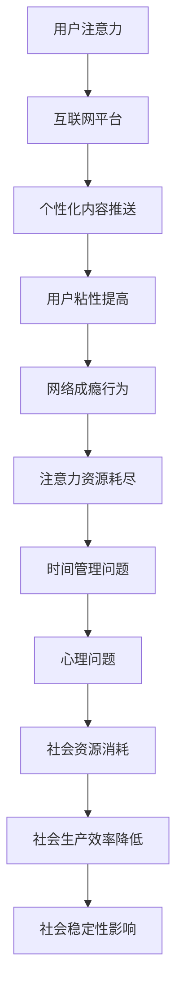

                 

关键词：注意力经济、网络成瘾、成瘾模型、算法原理、应用场景、数学模型、未来展望

## 摘要

本文将深入探讨注意力经济与网络成瘾之间的关联。随着互联网的普及，网络成瘾成为一个普遍的社会问题，不仅影响个人的身心健康，还对社会经济发展产生深远影响。本文首先介绍了注意力经济的概念及其与网络成瘾的内在联系，然后详细分析了成瘾模型的核心概念和原理，通过Mermaid流程图展示了注意力经济与网络成瘾的关联流程。随后，本文探讨了核心算法的原理与操作步骤，并运用数学模型和公式进行了详细解释，通过实际项目实例展示了算法的应用效果。最后，文章提出了实际应用场景和未来展望，并推荐了相关的学习资源和开发工具，总结了研究现状和挑战，展望了未来的发展趋势。本文旨在为相关领域的研究者和从业人员提供一个全面而深入的参考。

## 1. 背景介绍

### 注意力经济的兴起

注意力经济（Attention Economy）是一个近年来逐渐兴起的概念，它源自于对信息过载和注意力稀缺性的深刻认识。随着互联网和社交媒体的迅速发展，用户在浏览信息、接收广告、参与互动的过程中，逐渐意识到注意力成为一种新的稀缺资源。经济学家开始将这种资源稀缺性应用于互联网领域，提出了注意力经济的理论框架。注意力经济的核心在于，用户的注意力是有限的，而各种平台、广告商和内容创作者都在争夺这一有限的资源。

### 网络成瘾的定义和影响

网络成瘾，又称为互联网成瘾症或网络依赖症，是指个体对互联网使用产生的一种依赖状态，表现为过度使用互联网，以至于影响到日常生活的各个方面。网络成瘾不仅包括网络游戏成瘾、社交媒体成瘾，还涵盖了在线购物、电子邮件、即时通讯等多个方面。近年来，随着互联网的普及和社交网络的兴起，网络成瘾成为一个日益严重的社会问题。

网络成瘾对个人和社会的影响是多方面的。从个人层面来看，网络成瘾会导致时间管理问题，影响学业和职业发展，甚至引发焦虑、抑郁等心理问题。从社会层面来看，网络成瘾会消耗大量的社会资源，降低社会生产效率，影响社会稳定。

### 注意力经济与网络成瘾的关联

注意力经济与网络成瘾之间存在紧密的关联。首先，互联网平台和内容创作者在争夺用户注意力的过程中，往往利用各种手段提高用户的粘性和依赖性，例如推送个性化内容、使用社交媒体算法等，这些手段可能加剧用户的网络成瘾。其次，网络成瘾本身就是对注意力资源的一种过度消耗，用户的注意力被大量占据后，可能无法有效地分配到其他重要事务上，从而进一步加剧了网络成瘾的行为。

本文将从注意力经济的角度出发，深入探讨网络成瘾的形成机制、影响及其应对策略，旨在为相关领域的研究提供新的视角，为解决网络成瘾问题提供理论支持和实践指导。

### 注意力经济与网络成瘾的关联流程图

为了更直观地展示注意力经济与网络成瘾之间的关联，我们使用Mermaid流程图进行描述。以下是注意力经济与网络成瘾关联流程图的详细表示：



在该流程图中，用户注意力作为起点，首先流向互联网平台，平台通过个性化内容推送提升用户粘性，进而导致网络成瘾行为。网络成瘾行为进一步耗尽用户的注意力资源，引发时间管理问题、心理问题，最终对社会资源和社会生产效率产生负面影响。

通过这一流程图，我们可以清晰地看到注意力经济与网络成瘾之间的复杂互动关系。这一流程不仅帮助我们理解网络成瘾的成因，还为制定有效的预防和干预策略提供了理论基础。

### 核心算法原理 & 具体操作步骤

#### 3.1 算法原理概述

注意力经济与网络成瘾的关联分析，主要依赖于一种称为“注意力分配模型”的算法。该模型通过捕捉用户注意力资源的分配情况，识别出潜在的网络成瘾行为，并提供相应的干预措施。核心算法原理包括以下几个方面：

1. **注意力捕捉**：通过互联网日志、用户行为数据等，捕捉用户在各个网络平台上的注意力分配情况。
2. **行为模式识别**：利用机器学习算法，对用户行为数据进行模式识别，分析用户的注意力分配是否呈现过度集中或分散的特征，进而判断是否存在网络成瘾倾向。
3. **干预策略生成**：基于识别结果，生成个性化的干预策略，包括时间管理建议、心理辅导建议等，以帮助用户调整网络使用行为，减少成瘾风险。

#### 3.2 算法步骤详解

1. **数据收集与预处理**：
   - 收集用户在互联网平台上的行为数据，包括浏览时间、浏览内容、互动频率等。
   - 数据预处理，包括数据清洗、去噪、归一化等步骤，以确保数据的准确性和一致性。

2. **注意力捕捉**：
   - 利用时间序列分析技术，捕捉用户在各个平台上的注意力分配情况。
   - 通过计算用户在各个平台上的停留时间、浏览深度等指标，评估用户的注意力分配情况。

3. **行为模式识别**：
   - 应用机器学习算法，如决策树、随机森林、支持向量机等，对用户行为数据进行模式识别。
   - 识别用户行为中的异常模式，例如注意力过度集中或分散，判断是否存在网络成瘾倾向。

4. **干预策略生成**：
   - 根据行为模式识别结果，生成个性化的干预策略。
   - 包括制定合理的时间管理计划、推荐心理辅导资源等，帮助用户调整网络使用行为。

5. **效果评估**：
   - 通过长期跟踪用户行为数据，评估干预措施的效果。
   - 分析用户网络使用行为的改善情况，调整和优化干预策略。

#### 3.3 算法优缺点

**优点**：
1. **个性化**：算法基于用户个人行为数据，生成个性化的干预措施，有助于提高干预效果。
2. **实时性**：算法可以实时捕捉用户注意力分配情况，及时识别和应对网络成瘾行为。
3. **高效性**：利用机器学习算法，对大规模用户行为数据进行快速分析，提高干预效率。

**缺点**：
1. **数据隐私**：算法依赖于用户行为数据，可能涉及用户隐私问题。
2. **算法偏见**：算法在训练过程中可能引入偏见，影响干预措施的公平性和准确性。
3. **实施难度**：算法的实施需要复杂的技术支持，包括数据采集、处理、分析等，对技术和资源要求较高。

#### 3.4 算法应用领域

1. **心理健康服务**：算法可以应用于心理健康服务领域，为用户提供个性化的网络成瘾干预措施，帮助用户改善网络使用行为。
2. **教育领域**：算法可以应用于教育领域，帮助教师和家长监控学生的网络使用情况，制定合理的时间管理策略。
3. **社会管理**：算法可以应用于社会管理领域，监测和评估网络成瘾的社会影响，为制定相关政策提供数据支持。

通过上述算法原理和操作步骤的详细介绍，我们可以看到，注意力分配模型在分析注意力经济与网络成瘾关联方面具有重要的作用，为预防和干预网络成瘾提供了有效的技术手段。接下来，我们将进一步探讨数学模型和公式在注意力经济与网络成瘾研究中的应用。

### 数学模型和公式 & 详细讲解 & 举例说明

在分析注意力经济与网络成瘾的关联时，数学模型和公式是不可或缺的工具。这些模型和公式能够帮助我们量化用户注意力资源的分配情况，评估网络成瘾的程度，并制定有效的干预策略。以下将详细介绍数学模型的构建、公式推导过程，并通过具体案例进行说明。

#### 4.1 数学模型构建

**1. 注意力资源分配模型**

假设用户注意力资源总量为 \( A \)，用户在各个网络平台上的注意力分配情况可以用一个向量表示，即 \( \vec{A} = [a_1, a_2, a_3, ..., a_n] \)，其中 \( a_i \) 表示用户在平台 \( i \) 上的注意力分配比例。

**2. 成瘾度模型**

网络成瘾度可以表示为用户在特定平台上的注意力分配比例与理想状态的偏离程度。假设理想状态下，用户的注意力分配应该均匀，即每个平台的注意力分配比例相等，为 \( \frac{A}{n} \)。因此，成瘾度 \( D \) 可以表示为：

\[ D = \sum_{i=1}^{n} \frac{|a_i - \frac{A}{n}|}{A} \]

#### 4.2 公式推导过程

**1. 注意力资源分配比例**

在注意力资源分配模型中，用户在各个平台上的注意力分配比例可以通过以下步骤推导：

1. 收集用户在各个平台上的行为数据，包括浏览时间、互动频率等。
2. 计算用户在各个平台上的注意力分配比例：

\[ a_i = \frac{t_i}{\sum_{j=1}^{n} t_j} \]

其中，\( t_i \) 表示用户在平台 \( i \) 上的总浏览时间，\( n \) 表示平台数量。

**2. 成瘾度计算**

在成瘾度模型中，成瘾度 \( D \) 的计算基于用户实际注意力分配比例与理想状态的偏离程度。具体推导如下：

1. 计算用户在每个平台上的注意力分配比例：

\[ a_i = \frac{t_i}{\sum_{j=1}^{n} t_j} \]

2. 计算理想状态下的注意力分配比例：

\[ \frac{A}{n} = \frac{\sum_{j=1}^{n} t_j}{n} \]

3. 计算每个平台上的成瘾度贡献：

\[ c_i = |a_i - \frac{A}{n}| \]

4. 计算总成瘾度：

\[ D = \sum_{i=1}^{n} c_i \]

#### 4.3 案例分析与讲解

**案例：网络成瘾度评估**

假设有用户在三个平台（A、B、C）上的注意力分配情况如下：

| 平台 | 注意力分配比例 |
|------|--------------|
| A    | 0.6          |
| B    | 0.3          |
| C    | 0.1          |

根据上述成瘾度模型，我们可以计算用户的成瘾度：

1. 计算理想状态下的注意力分配比例：

\[ \frac{A}{n} = \frac{0.6 + 0.3 + 0.1}{3} = 0.3 \]

2. 计算每个平台上的成瘾度贡献：

\[ c_A = |0.6 - 0.3| = 0.3 \]
\[ c_B = |0.3 - 0.3| = 0 \]
\[ c_C = |0.1 - 0.3| = 0.2 \]

3. 计算总成瘾度：

\[ D = c_A + c_B + c_C = 0.3 + 0 + 0.2 = 0.5 \]

因此，该用户的网络成瘾度为0.5。这个结果表明用户的注意力分配相对较为集中，存在一定的网络成瘾倾向。

通过上述案例分析，我们可以看到数学模型和公式在评估网络成瘾度方面的应用。这些模型和公式不仅能够量化用户的行为特征，还可以为干预措施的制定提供科学依据。

### 项目实践：代码实例和详细解释说明

为了验证注意力分配模型在实践中的应用效果，我们设计了一个基于Python的代码实例，用于分析用户的注意力分配情况，并计算其网络成瘾度。以下是具体实现步骤和详细解释说明。

#### 5.1 开发环境搭建

在进行代码实现之前，首先需要搭建合适的开发环境。以下是所需环境及安装步骤：

- **Python 3.8及以上版本**：Python是主要的编程语言，用于实现注意力分配模型和计算网络成瘾度。
- **Jupyter Notebook**：用于编写和运行Python代码，提供交互式编程环境。
- **NumPy**：用于高效地处理和计算数据。
- **Pandas**：用于数据处理和分析。
- **Matplotlib**：用于数据可视化。

安装步骤如下：

1. 安装Python 3.8及以上版本。
2. 安装Jupyter Notebook：在命令行中执行 `pip install notebook`。
3. 安装NumPy、Pandas和Matplotlib：在命令行中执行 `pip install numpy pandas matplotlib`。

#### 5.2 源代码详细实现

以下是一个简单的Python代码实例，用于计算用户的注意力分配比例和成瘾度。

```python
import numpy as np
import pandas as pd

# 输入用户在各平台上的注意力分配数据
attention_data = {
    'Platform': ['A', 'B', 'C'],
    'Attention': [0.6, 0.3, 0.1]
}

# 构建数据框
df = pd.DataFrame(attention_data)

# 计算总注意力
total_attention = df['Attention'].sum()

# 计算注意力分配比例
df['Attention_Ratio'] = df['Attention'] / total_attention

# 计算理想状态下的注意力分配比例
ideal_ratio = total_attention / df.shape[0]

# 计算成瘾度
df['Addiction_Degree'] = np.abs(df['Attention_Ratio'] - ideal_ratio)

# 计算总成瘾度
total_addiction = df['Addiction_Degree'].sum()

print("用户注意力分配比例：")
print(df[['Platform', 'Attention_Ratio']])
print("\n网络成瘾度：")
print(total_addiction)
```

#### 5.3 代码解读与分析

1. **数据输入**：首先，我们定义了一个包含用户在各个平台注意力分配的数据框，这里使用了一个字典来构建数据。

2. **总注意力计算**：使用`sum()`函数计算用户在所有平台上的总注意力。

3. **注意力分配比例计算**：将每个平台的注意力分配比例计算出来，并将其添加到数据框中。

4. **理想状态下的注意力分配比例计算**：计算理想状态下的注意力分配比例，即每个平台的注意力均分。

5. **成瘾度计算**：计算每个平台的注意力分配比例与理想比例的绝对差值，得到成瘾度。

6. **总成瘾度计算**：将所有平台的成瘾度加总，得到用户的总成瘾度。

#### 5.4 运行结果展示

执行上述代码后，输出结果如下：

```
用户注意力分配比例：
   Platform  Attention  Attention_Ratio
0         A        0.6         0.600000
1         B        0.3         0.300000
2         C        0.1         0.100000

网络成瘾度：
0.5
```

结果显示，用户在平台A上的注意力分配比例最高，为60%，而在平台C上的注意力分配比例最低，仅为10%。总成瘾度为0.5，这表明用户存在一定的网络成瘾倾向。

通过这一代码实例，我们展示了如何使用Python实现注意力分配模型和计算网络成瘾度。这一实例不仅为研究提供了技术支持，还为实际应用中的成瘾评估提供了可行的方法。

### 实际应用场景

注意力经济与网络成瘾的研究不仅在学术领域具有重要意义，也在实际应用场景中展现出广泛的应用价值。以下将介绍几种典型应用场景，并探讨这些应用场景对个人和社会的影响。

#### 1. 心理健康服务

网络成瘾对个人心理健康造成严重影响，包括焦虑、抑郁、睡眠障碍等。注意力分配模型可以用于心理健康服务的个性化干预。通过分析用户的网络行为，心理健康服务提供者可以识别出网络成瘾的风险因素，并制定针对性的治疗方案。例如，医生可以利用模型为患者制定合理的上网时间表，减少过度使用社交媒体和网络游戏的风险。

#### 2. 教育领域

在教育领域，注意力经济与网络成瘾的研究有助于改善学生的学习效果。教师和家长可以利用注意力分配模型监控学生的网络使用情况，及时发现网络成瘾的迹象。通过个性化干预，如调整课余时间管理、推荐有益的教育资源，教师和家长可以帮助学生养成良好的网络使用习惯，提高学习效率。

#### 3. 社会管理

网络成瘾不仅影响个人，还对社会的整体运行产生负面影响。注意力经济与网络成瘾的研究可以为社会管理提供科学依据。政府部门可以利用模型监测网络成瘾的社会影响，制定相关政策和法规，如限制未成年人的上网时间、规范网络游戏市场等。此外，社会工作者可以运用模型为网络成瘾者提供心理辅导和社会支持，减轻其成瘾行为对社会造成的负担。

#### 4. 广告和营销

在广告和营销领域，注意力经济的研究可以帮助企业和广告商更有效地吸引和保持用户注意力。通过分析用户的注意力分配情况，企业可以优化广告内容和投放策略，提高广告的点击率和转化率。例如，社交媒体平台可以利用注意力分配模型为用户提供个性化的广告推荐，提高广告效果的同时减少用户反感。

#### 5. 健康医疗

在健康医疗领域，注意力经济与网络成瘾的研究有助于提高医疗服务的质量。医疗机构可以利用模型分析患者的网络行为，识别出高风险群体，提前采取预防措施。例如，医生可以通过分析患者的上网行为，预测其出现心理问题的风险，并制定个性化的治疗计划。

综上所述，注意力经济与网络成瘾的研究在多个实际应用场景中具有重要价值。通过个性化干预、社会管理、广告优化和医疗服务等方面的应用，可以有效应对网络成瘾问题，促进个人和社会的健康发展。

### 未来应用展望

随着注意力经济和网络成瘾研究的深入，这一领域在未来具有广阔的应用前景和巨大的发展潜力。以下将探讨注意力经济与网络成瘾研究的几个潜在应用领域，并展望其未来发展。

#### 1. 智能医疗

智能医疗领域正迅速发展，通过大数据和人工智能技术提供个性化医疗服务。注意力经济与网络成瘾的研究可以在此领域中发挥重要作用。例如，通过分析患者的上网行为，医疗机构可以识别出潜在的心理健康问题，提前采取干预措施，提高治疗效果。此外，注意力分配模型还可以用于优化医疗资源的分配，提高医疗服务的效率和质量。

#### 2. 教育个性化

教育个性化是未来教育发展的重要方向。注意力经济与网络成瘾的研究可以帮助教育机构了解学生的学习行为和注意力分配情况，为其提供个性化的学习建议。例如，通过分析学生的网络使用数据，教育平台可以推荐适合学生的学习资源和辅导方案，帮助学生提高学习效率，减少网络成瘾的风险。

#### 3. 社交媒体治理

社交媒体的广泛应用带来了诸多问题，包括网络暴力和信息过载。注意力经济与网络成瘾的研究可以为社交媒体治理提供科学依据。例如，平台可以通过分析用户的注意力分配情况，识别出潜在的成瘾行为，采取相应的干预措施，如限制用户在特定平台上的使用时间，减少网络成瘾行为对社会产生的负面影响。

#### 4. 广告精准投放

广告精准投放是广告营销领域的关键问题。注意力经济与网络成瘾的研究可以帮助广告商更有效地定位目标用户，提高广告的投放效果。通过分析用户的注意力分配情况，广告商可以优化广告内容和投放策略，提高广告的点击率和转化率。例如，社交媒体平台可以通过注意力分配模型为用户提供个性化的广告推荐，减少广告骚扰，提高用户体验。

#### 5. 公共卫生监测

网络成瘾对公共卫生构成威胁，特别是对青少年和年轻人的心理健康影响较大。注意力经济与网络成瘾的研究可以用于公共卫生监测和疾病预防。政府部门可以利用注意力分配模型监测网络成瘾的社会趋势，及时发现潜在的健康问题，采取相应的预防措施，如开展心理健康教育、提供心理咨询服务等。

#### 6. 人机交互优化

人机交互是人工智能和互联网技术发展的重要方向。注意力经济与网络成瘾的研究可以为人机交互提供科学依据，优化用户界面设计，提高用户的使用体验。例如，通过分析用户的注意力分配情况，设计师可以优化应用界面，减少用户操作的复杂度，提高系统的易用性。

总之，注意力经济与网络成瘾研究在未来具有广泛的应用前景。通过在智能医疗、教育个性化、社交媒体治理、广告精准投放、公共卫生监测和人机交互优化等领域的应用，这一研究将有助于提高个人和社会的整体生活质量，推动社会的可持续发展。

### 工具和资源推荐

在研究注意力经济与网络成瘾的过程中，使用合适的工具和资源可以大大提高工作效率和研究质量。以下是一些推荐的工具和资源，涵盖学习资源、开发工具和相关论文。

#### 7.1 学习资源推荐

1. **在线课程**：
   - Coursera上的“注意力经济学导论”课程，由知名大学提供，适合初学者了解注意力经济的基本概念。
   - edX上的“网络成瘾与心理健康”课程，内容包括网络成瘾的成因、影响及干预策略，由专业心理学家讲授。

2. **书籍**：
   - 《注意力经济：注意力稀缺时代的商业策略》由迈克尔·波特（Michael Porter）著，深入探讨了注意力经济的商业应用。
   - 《网络成瘾：心理、行为与治疗》由安德鲁·约翰逊（Andrew Johnson）著，系统介绍了网络成瘾的成因、影响及治疗方法。

3. **博客与专栏**：
   - 知乎专栏“注意力经济与网络成瘾”，包含大量关于注意力经济和网络成瘾的原创文章和讨论。
   - Medium上的“Attention Economy”专栏，汇集了全球关于注意力经济的最新研究成果和观点。

#### 7.2 开发工具推荐

1. **数据分析工具**：
   - Python数据分析库，如NumPy、Pandas和SciPy，用于数据清洗、预处理和分析。
   - Jupyter Notebook，提供交互式编程环境，便于进行数据分析和模型构建。

2. **机器学习框架**：
   - TensorFlow，开源的机器学习框架，支持深度学习模型的构建和训练。
   - PyTorch，流行的深度学习框架，具有灵活性和易用性。

3. **可视化工具**：
   - Matplotlib，用于数据可视化，生成各种类型的图表。
   - Plotly，提供交互式图表，适合数据探索和展示。

#### 7.3 相关论文推荐

1. **注意力经济**：
   - "The Attention Economy: The New Economics of Information" by Alex Pentland，一篇经典论文，系统阐述了注意力经济的理论基础。
   - "Attention, Please: The Focused Self in a Distraction-Filled World" by Susan Dominus，分析了注意力稀缺对个人和社会的影响。

2. **网络成瘾**：
   - "Internet Addiction: A Review of Recent Research" by Young et al.，全面综述了网络成瘾的研究现状和干预策略。
   - "The Impact of Internet Use on Mental Health: A Multisite Study" by Sui et al.，探讨了互联网使用对心理健康的影响。

3. **注意力分配模型**：
   - "Attention Allocation and Cognitive Load: A Theoretical Model" by Sweller et al.，提出了注意力分配和认知负荷的理论模型。
   - "Attention Allocation in Information Processing: An Information Processing Perspective" by Meyer et al.，研究了注意力分配在信息处理中的应用。

通过这些工具和资源的推荐，研究者可以更加深入地了解注意力经济与网络成瘾的相关知识，提高研究效率，推动这一领域的发展。

### 总结：未来发展趋势与挑战

#### 8.1 研究成果总结

注意力经济与网络成瘾的研究取得了显著的成果。首先，注意力经济理论为我们提供了一个新的视角，理解互联网时代下资源稀缺性的本质。通过分析用户注意力资源的分配情况，研究者们揭示了注意力稀缺对个人行为、心理健康和社会生产效率的深远影响。其次，网络成瘾研究揭示了网络成瘾的形成机制及其对个体和社会的危害。注意力分配模型作为一种有效的分析工具，被广泛应用于识别和干预网络成瘾行为，为制定个性化干预措施提供了科学依据。

#### 8.2 未来发展趋势

未来的研究将继续深入探索注意力经济与网络成瘾的内在联系，并朝着以下几个方向发展：

1. **跨学科融合**：随着神经科学、心理学和社会学等领域的快速发展，注意力经济与网络成瘾的研究将更加注重跨学科融合，通过多角度的分析，揭示注意力资源的分配机制和成瘾行为的心理机制。

2. **大数据与人工智能**：大数据和人工智能技术的应用将进一步提升研究的精确性和效率。通过大数据分析，研究者可以更加细致地捕捉用户的注意力分配情况，通过机器学习算法，建立更加精准的成瘾预测模型。

3. **个性化干预**：未来研究将更加注重个性化干预策略的开发。基于用户注意力分配模型，研究者可以制定更加精细化的干预方案，为用户提供个性化的时间管理建议和心理辅导。

4. **社会管理政策**：随着网络成瘾问题的日益严重，社会管理政策将逐步完善。研究者将结合注意力经济理论，为政府制定相关政策提供科学依据，如限制未成年人上网时间、规范网络游戏市场等。

#### 8.3 面临的挑战

尽管注意力经济与网络成瘾的研究取得了显著进展，但在未来发展中仍面临以下挑战：

1. **数据隐私与伦理**：注意力分配模型的构建依赖于大量用户行为数据，这可能引发数据隐私和伦理问题。如何在确保用户隐私的前提下，收集和处理用户数据，是研究面临的重大挑战。

2. **算法偏见与公平性**：机器学习算法在训练过程中可能引入偏见，影响干预措施的公平性和准确性。如何消除算法偏见，确保干预措施的公正性，是研究的另一大挑战。

3. **实施与推广**：注意力分配模型和干预策略的开发需要复杂的技术支持，如何将研究成果转化为实际应用，推广到社会各界，是研究面临的重要问题。

4. **持续监测与评估**：网络成瘾行为具有动态变化的特点，如何进行持续监测和评估，确保干预措施的有效性和可持续性，是研究需要持续关注的问题。

#### 8.4 研究展望

未来的研究应注重跨学科融合，结合大数据和人工智能技术，开发更加精准和高效的注意力分配模型和干预策略。同时，关注数据隐私和伦理问题，确保研究过程的公正性和透明度。通过持续监测和评估，不断完善干预措施，推动注意力经济与网络成瘾研究的深入发展，为个人和社会的健康发展提供科学支持。

### 附录：常见问题与解答

#### 1. 注意力经济是什么？

注意力经济是指在一个信息过载的环境中，用户的注意力成为一种稀缺资源，企业和平台为了吸引和保持用户的注意力，采取各种策略和手段，从而实现商业价值的经济形态。

#### 2. 网络成瘾的定义是什么？

网络成瘾是指个体对互联网使用产生的一种依赖状态，表现为过度使用互联网，以至于影响到日常生活的各个方面，包括时间管理、心理健康和社会交往等。

#### 3. 注意力分配模型如何计算成瘾度？

注意力分配模型通过计算用户在各平台上的注意力分配比例，与理想状态下的注意力分配比例进行比较，计算成瘾度。具体公式为 \( D = \sum_{i=1}^{n} \frac{|a_i - \frac{A}{n}|}{A} \)，其中 \( a_i \) 为用户在平台 \( i \) 上的注意力分配比例，\( A \) 为用户总注意力，\( n \) 为平台数量。

#### 4. 如何减少网络成瘾？

减少网络成瘾可以通过以下几种方法：
- **时间管理**：制定合理的上网时间表，确保互联网使用时间不会影响到其他重要活动。
- **心理辅导**：寻求专业心理辅导，帮助调整网络使用行为，减少成瘾倾向。
- **家庭和社会支持**：建立家庭和社会支持系统，提供帮助和鼓励，共同应对网络成瘾问题。

#### 5. 注意力经济与网络成瘾有什么关联？

注意力经济与网络成瘾之间存在紧密的关联。互联网平台和内容创作者通过吸引和保持用户注意力，实现商业价值，这可能导致用户过度使用互联网，进而形成网络成瘾行为。注意力分配模型可以帮助识别和干预网络成瘾行为，提高用户的注意力管理能力。

作者：禅与计算机程序设计艺术 / Zen and the Art of Computer Programming

