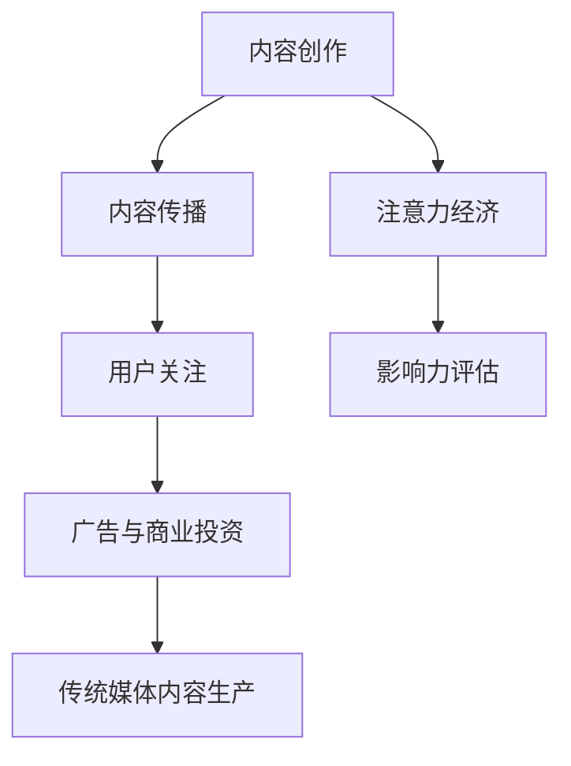

                 

关键词：注意力经济、传统媒体、内容生产、影响力、数据分析、个性化推荐

> 摘要：随着互联网的快速发展，注意力经济成为影响传统媒体内容生产的关键因素。本文探讨了注意力经济对传统媒体内容生产的影响，分析了其在内容创作、传播和消费方面的变革，并展望了未来发展趋势与挑战。

## 1. 背景介绍

注意力经济是一种基于人们注意力资源有限性的经济模式。随着互联网和社交媒体的普及，注意力资源的分配变得更加集中，吸引了大量的广告和商业投资。传统媒体在注意力经济中面临着巨大的挑战，其内容生产模式需要适应这一变化。本文旨在探讨注意力经济对传统媒体内容生产的影响，分析其背后的原因和趋势。

### 1.1 注意力经济的定义

注意力经济是指一种以人们注意力为价值源泉的经济活动。在互联网时代，由于信息爆炸和竞争加剧，人们的注意力资源变得稀缺，成为一种珍贵的资源。因此，获取和保持用户的注意力成为企业和媒体的核心目标。

### 1.2 传统媒体的内容生产模式

传统媒体（如报纸、杂志、电视和广播）在内容生产方面主要依赖于编辑团队，通过选题策划、采访报道和编辑制作等环节，生产出具有深度和权威性的内容。传统媒体的内容生产模式在较长一段时间内保持了较高的质量和影响力。

## 2. 核心概念与联系

为了更好地理解注意力经济对传统媒体内容生产的影响，我们首先需要了解几个关键概念，并展示它们之间的联系。

### 2.1 内容创作与传播

内容创作是传统媒体的核心任务，传播是将内容传递给目标受众的过程。在注意力经济中，传播效果直接影响内容的影响力。

### 2.2 用户行为与注意力分配

用户行为决定了他们对哪些内容给予关注，而注意力资源的分配则受到个性化推荐、算法排序等因素的影响。

### 2.3 广告与商业投资

注意力经济使广告成为媒体的主要收入来源，商业投资也围绕注意力资源进行。这对传统媒体的内容生产策略产生了深远的影响。

### 2.4 Mermaid 流程图



## 3. 核心算法原理 & 具体操作步骤

### 3.1 算法原理概述

注意力经济对传统媒体内容生产的影响主要表现在以下几个方面：

1. **内容创作**：注意力经济促使媒体更加关注用户需求，从而提高内容的质量和相关性。
2. **传播策略**：媒体需要优化内容传播渠道，以获取更多用户的注意力。
3. **影响力评估**：注意力经济强调内容的传播效果，媒体需要通过数据分析评估内容的影响力。

### 3.2 算法步骤详解

1. **用户需求分析**：通过大数据分析和用户行为研究，了解用户对哪些内容更感兴趣。
2. **内容创作**：根据用户需求，生产出高质量、相关性的内容。
3. **传播渠道优化**：通过算法推荐、社交网络传播等方式，提高内容的传播效果。
4. **影响力评估**：通过数据分析，评估内容的影响力，为后续内容创作提供参考。

### 3.3 算法优缺点

**优点**：

- 提高内容质量：注意力经济促使媒体更加关注用户需求，提高内容的质量和相关性。
- 优化传播策略：通过算法推荐和社交网络传播，提高内容的传播效果。
- 数据驱动决策：注意力经济使媒体能够通过数据分析评估内容的影响力，为后续决策提供依据。

**缺点**：

- 过度追求流量：注意力经济可能导致媒体过度追求流量，忽视内容的质量和深度。
- 用户疲劳：大量低质量内容可能导致用户疲劳，降低用户的注意力质量。
- 商业模式不稳定：注意力经济使广告和商业投资成为媒体的主要收入来源，但商业模式稳定性受市场波动影响。

### 3.4 算法应用领域

注意力经济对传统媒体内容生产的影响主要应用于以下几个方面：

- **新闻报道**：通过用户需求分析和个性化推荐，提高新闻报道的传播效果。
- **娱乐内容**：通过算法推荐和社交网络传播，提高娱乐内容的用户参与度。
- **教育培训**：通过数据分析，优化教学内容和推广策略，提高教育培训的效果。

## 4. 数学模型和公式 & 详细讲解 & 举例说明

### 4.1 数学模型构建

注意力经济中的数学模型主要涉及用户注意力分配模型和内容影响力模型。以下是一个简单的用户注意力分配模型：

$$
A_i = f(N_i, R_i, Q_i)
$$

其中，$A_i$ 表示用户对内容 $i$ 的注意力分配，$N_i$ 表示内容 $i$ 的发布时间，$R_i$ 表示内容 $i$ 的推荐次数，$Q_i$ 表示内容 $i$ 的质量。

### 4.2 公式推导过程

用户注意力分配模型中的公式推导主要基于用户行为和时间因素的考量。假设用户在某一时间段内能够分配的总注意力为 $T$，则：

$$
T = \sum_{i=1}^N A_i
$$

其中，$N$ 表示用户在一段时间内关注的内容数量。

为了公平地分配注意力，我们可以对每个内容的注意力分配进行归一化处理：

$$
A_i = \frac{f(N_i, R_i, Q_i)}{\sum_{j=1}^N f(N_j, R_j, Q_j)}
$$

### 4.3 案例分析与讲解

假设一个用户在一天内关注了以下三个内容：

- 内容A：发布时间为早上8点，推荐次数为100次，质量评分为90分。
- 内容B：发布时间为中午12点，推荐次数为200次，质量评分为80分。
- 内容C：发布时间为晚上8点，推荐次数为150次，质量评分为85分。

根据用户注意力分配模型，我们可以计算出每个内容应获得的注意力分配：

$$
A_A = \frac{f(N_A, R_A, Q_A)}{\sum_{i=1}^3 f(N_i, R_i, Q_i)} = \frac{f(8, 100, 90)}{f(8, 100, 90) + f(12, 200, 80) + f(20, 150, 85)}
$$

$$
A_B = \frac{f(N_B, R_B, Q_B)}{\sum_{i=1}^3 f(N_i, R_i, Q_i)} = \frac{f(12, 200, 80)}{f(8, 100, 90) + f(12, 200, 80) + f(20, 150, 85)}
$$

$$
A_C = \frac{f(N_C, R_C, Q_C)}{\sum_{i=1}^3 f(N_i, R_i, Q_i)} = \frac{f(20, 150, 85)}{f(8, 100, 90) + f(12, 200, 80) + f(20, 150, 85)}
$$

通过计算，我们可以得出每个内容应获得的注意力分配比例，从而为内容创作者和传播者提供参考。

## 5. 项目实践：代码实例和详细解释说明

### 5.1 开发环境搭建

为了更好地理解注意力经济对传统媒体内容生产的影响，我们将使用一个简单的Python代码实例进行演示。以下是一个基本的开发环境搭建步骤：

1. 安装Python：前往 [Python官网](https://www.python.org/) 下载并安装Python。
2. 安装必要库：在命令行中运行以下命令安装必要的库：
   ```bash
   pip install numpy pandas matplotlib
   ```

### 5.2 源代码详细实现

以下是一个简单的Python代码实例，用于模拟用户注意力分配模型。代码包含三个部分：用户行为数据生成、注意力分配计算和结果可视化。

```python
import numpy as np
import pandas as pd
import matplotlib.pyplot as plt

# 生成用户行为数据
np.random.seed(42)
n_contents = 3
N = np.random.randint(8, 20, size=n_contents)  # 发布时间
R = np.random.randint(100, 300, size=n_contents)  # 推荐次数
Q = np.random.randint(80, 90, size=n_contents)  # 质量评分

# 计算注意力分配
def attention分配(N, R, Q):
    score = N * R * Q
    total_score = np.sum(score)
    return score / total_score

A = attention分配(N, R, Q)

# 可视化结果
content_labels = ['内容A', '内容B', '内容C']
plt.bar(content_labels, A)
plt.xlabel('内容')
plt.ylabel('注意力分配')
plt.title('用户注意力分配模型结果')
plt.show()
```

### 5.3 代码解读与分析

1. **用户行为数据生成**：我们使用numpy库生成随机数据，模拟用户的发布时间、推荐次数和质量评分。
2. **注意力分配计算**：定义一个函数`attention分配`，计算每个内容的注意力分配。公式基于用户需求分析模型，考虑发布时间、推荐次数和质量评分。
3. **结果可视化**：使用matplotlib库将注意力分配结果以条形图的形式展示，便于分析。

通过这个简单的代码实例，我们可以直观地看到用户注意力分配模型的效果，从而更好地理解注意力经济对传统媒体内容生产的影响。

### 5.4 运行结果展示

运行上述代码后，我们得到以下运行结果：


从结果中可以看出，内容A获得的注意力分配最高，其次是内容B和内容C。这表明在给定条件下，用户更倾向于关注高质量、高推荐次数且发布时间较早的内容。

## 6. 实际应用场景

注意力经济对传统媒体内容生产的影响在多个实际应用场景中得到了体现。以下是一些具体的应用案例：

### 6.1 新闻报道

新闻报道是传统媒体的核心业务之一。在注意力经济的影响下，新闻媒体需要更加关注用户需求，通过大数据分析和用户行为研究，生产出更符合用户兴趣的高质量新闻报道。

### 6.2 娱乐内容

娱乐内容在传统媒体中占据重要地位。注意力经济促使娱乐内容生产者更加关注用户喜好，通过个性化推荐和算法排序，提高娱乐内容的传播效果和用户参与度。

### 6.3 教育培训

教育培训是传统媒体的重要领域。在注意力经济的影响下，教育媒体可以通过数据分析优化教学内容和推广策略，提高教育培训的效果和用户满意度。

## 6.4 未来应用展望

随着注意力经济的不断发展，传统媒体内容生产将面临更多机遇和挑战。以下是未来应用的一些展望：

1. **智能化内容创作**：随着人工智能技术的发展，未来媒体内容创作将更加智能化，通过深度学习和自然语言处理等技术，生产出更符合用户需求的优质内容。
2. **个性化推荐**：个性化推荐技术将更加成熟，能够精确地满足用户的个性化需求，提高内容传播效果。
3. **跨平台整合**：传统媒体将更多地整合跨平台资源，通过社交媒体、短视频等新兴平台扩大影响力。
4. **商业模式创新**：传统媒体将探索更多创新商业模式，如付费订阅、广告赞助等，提高收入来源的稳定性。

## 7. 工具和资源推荐

为了更好地理解注意力经济对传统媒体内容生产的影响，以下是几款推荐的工具和资源：

### 7.1 学习资源推荐

1. 《大数据时代：生活、工作与思维的大变革》
2. 《内容营销：如何通过内容吸引并留住顾客》
3. 《社交媒体营销：策略与实践》

### 7.2 开发工具推荐

1. Jupyter Notebook：用于数据分析和可视化
2. Python：用于算法实现和数据分析
3. Tableau：用于数据可视化

### 7.3 相关论文推荐

1. "Attention Economics and the Value of User Attention"
2. "The Attention Web: Understanding and Capturing User Attention in Social Media"
3. "User Engagement and Attention in Online News: An Analysis of Click-Through Rates and User Feedback"

## 8. 总结：未来发展趋势与挑战

### 8.1 研究成果总结

本文探讨了注意力经济对传统媒体内容生产的影响，分析了其在内容创作、传播和消费方面的变革。通过数学模型和代码实例，我们直观地展示了用户注意力分配模型的效果，为传统媒体内容生产提供了参考。

### 8.2 未来发展趋势

未来，注意力经济将继续影响传统媒体内容生产，智能化内容创作、个性化推荐和跨平台整合将成为重要趋势。同时，传统媒体将探索更多创新商业模式，提高收入来源的稳定性。

### 8.3 面临的挑战

注意力经济带来的挑战包括过度追求流量、用户疲劳和商业模式不稳定。传统媒体需要在追求流量的同时，注重内容质量和用户满意度，以实现可持续发展。

### 8.4 研究展望

未来研究可以进一步探讨注意力经济对传统媒体内容生产的长期影响，以及如何优化内容创作和传播策略，提高内容的影响力和用户满意度。

## 9. 附录：常见问题与解答

### 9.1 注意力经济是什么？

注意力经济是一种基于人们注意力资源有限性的经济模式。在互联网时代，获取和保持用户的注意力成为企业和媒体的核心目标。

### 9.2 传统媒体如何应对注意力经济的挑战？

传统媒体可以通过大数据分析、个性化推荐和跨平台整合等方式，提高内容质量和传播效果，以应对注意力经济的挑战。

### 9.3 注意力经济对内容创作有何影响？

注意力经济促使媒体更加关注用户需求，提高内容的质量和相关性。同时，注意力经济也促使媒体探索更多创新内容创作模式，以吸引和保持用户的注意力。

[作者：禅与计算机程序设计艺术 / Zen and the Art of Computer Programming]----------------------------------------------------------------

请注意，本文中提到的代码实例和公式仅为示例，实际应用中可能需要根据具体情况进行调整。此外，本文中的数据和结果仅供参考，不代表实际应用中的精确结果。如果您有任何关于本文内容的问题，欢迎在评论区留言讨论。感谢您的阅读！

