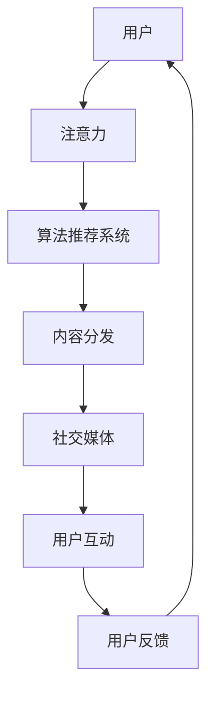

                 

关键词：注意力经济、传统媒体、媒体生态、数字化转型、算法推荐、社交媒体、算法推荐系统

> 摘要：本文将探讨注意力经济对传统媒体生态的重塑作用。通过分析注意力经济的核心概念、传统媒体面临的挑战以及数字化转型过程中如何运用算法推荐系统，我们将揭示注意力经济如何重新定义媒体行业的运作模式，并对未来的媒体生态提出展望。

## 1. 背景介绍

在数字时代的浪潮下，媒体行业正经历着前所未有的变革。传统媒体，如报纸、杂志、电视等，曾经以其权威性和专业性而占据主导地位。然而，随着互联网和社交媒体的兴起，用户获取信息的渠道发生了翻天覆地的变化。注意力经济，作为这一变革的核心驱动力，正在对传统媒体生态进行深刻的重塑。

注意力经济，简而言之，是指用户在信息爆炸的时代，对其注意力资源的竞争与争夺。在注意力经济中，内容的生产和传播不再以传统媒体的权威性和专业性为核心，而是以用户兴趣和注意力为关键。这一转变促使传统媒体不得不重新审视其运营模式，以适应新的媒体环境。

## 2. 核心概念与联系

为了更好地理解注意力经济对传统媒体生态的影响，我们首先需要明确几个核心概念：注意力、算法推荐系统和社交媒体。

### 注意力

注意力是指用户在特定时间段内对特定内容的关注和投入。在注意力经济中，注意力被视为一种有限的资源，用户的选择意味着对其他内容的忽视。因此，获取和保持用户的注意力成为媒体竞争的核心。

### 算法推荐系统

算法推荐系统是一种利用大数据和机器学习技术，根据用户的历史行为和兴趣偏好，为其推荐相关内容的技术。在社交媒体和内容平台中，算法推荐系统被广泛应用于内容分发和用户互动。通过算法推荐系统，媒体能够更精准地触达目标用户，提高用户满意度和留存率。

### 社交媒体

社交媒体作为注意力经济的重要载体，提供了广泛的信息传播渠道和用户互动平台。社交媒体平台通过算法推荐系统，将用户感兴趣的内容推送到他们的信息流中，从而吸引用户的注意力。

### Mermaid 流程图

以下是一个简化的 Mermaid 流程图，描述了注意力经济、算法推荐系统和社交媒体之间的联系：



## 3. 核心算法原理 & 具体操作步骤

### 3.1 算法原理概述

注意力经济的核心在于算法推荐系统，它通过分析用户的历史行为和兴趣偏好，预测用户未来的兴趣，并为其推荐相关内容。算法推荐系统的基本原理可以概括为以下三个步骤：

1. **用户画像构建**：通过收集用户的历史行为数据（如浏览记录、搜索历史、点赞评论等），构建用户的兴趣偏好模型。
2. **内容特征提取**：对推荐的内容进行特征提取，如关键词、主题、情感等，以构建内容特征向量。
3. **内容推荐**：通过计算用户画像和内容特征向量之间的相似度，为用户推荐相似的内容。

### 3.2 算法步骤详解

1. **数据收集与预处理**：
   - 收集用户的行为数据，包括浏览记录、搜索历史、点赞评论等。
   - 对收集到的数据进行清洗和预处理，如去除重复数据、填充缺失值等。

2. **用户画像构建**：
   - 利用机器学习算法，如决策树、随机森林等，对用户的行为数据进行分析，构建用户兴趣偏好模型。
   - 将用户兴趣偏好模型转换为用户画像，如用户标签、兴趣等级等。

3. **内容特征提取**：
   - 对推荐的内容进行特征提取，如关键词提取、文本分类等。
   - 将提取的内容特征转换为内容特征向量。

4. **内容推荐**：
   - 计算用户画像和内容特征向量之间的相似度，采用相似度度量方法，如余弦相似度、欧氏距离等。
   - 根据相似度度量结果，为用户推荐相似度最高的内容。

### 3.3 算法优缺点

**优点**：

1. **个性化推荐**：算法推荐系统能够根据用户的兴趣偏好，提供个性化的内容推荐，提高用户满意度和留存率。
2. **高效的内容分发**：通过算法推荐系统，媒体能够更高效地将内容分发给目标用户，提高内容的传播效果。
3. **数据驱动**：算法推荐系统基于用户行为数据，具有数据驱动性，能够不断优化推荐效果。

**缺点**：

1. **用户隐私风险**：算法推荐系统需要收集和存储用户的行为数据，这可能涉及用户隐私问题。
2. **信息茧房**：算法推荐系统可能导致用户陷入信息茧房，即只接触到与自己观点相似的信息，从而限制思维的开放性。

### 3.4 算法应用领域

算法推荐系统在媒体行业具有广泛的应用领域：

1. **内容推荐**：为用户提供个性化内容推荐，提高用户满意度和留存率。
2. **广告推荐**：根据用户兴趣和浏览历史，为用户推荐相关广告，提高广告投放效果。
3. **社交推荐**：根据用户社交网络关系，为用户推荐感兴趣的朋友和内容。

## 4. 数学模型和公式 & 详细讲解 & 举例说明

### 4.1 数学模型构建

在算法推荐系统中，常见的数学模型包括用户画像模型、内容特征提取模型和推荐算法模型。

**用户画像模型**：

用户画像模型是一种基于用户行为数据构建的模型，用于描述用户的兴趣偏好。常见的用户画像模型包括用户标签模型和用户向量模型。

**用户标签模型**：

用户标签模型将用户的行为数据映射为一组标签，每个标签代表用户的一种兴趣。用户标签模型可以表示为：

$$
U = \{u_1, u_2, ..., u_n\}
$$

其中，$u_i$ 表示用户 $u$ 的第 $i$ 个标签。

**用户向量模型**：

用户向量模型将用户的行为数据映射为一个向量，每个元素表示用户对某个内容的兴趣强度。用户向量模型可以表示为：

$$
U = \{u_1, u_2, ..., u_n\}
$$

其中，$u_i$ 表示用户 $u$ 对内容 $i$ 的兴趣强度。

**内容特征提取模型**：

内容特征提取模型用于提取内容的特征，如关键词、主题、情感等。常见的内容特征提取模型包括文本分类模型和文本嵌入模型。

**文本分类模型**：

文本分类模型将文本数据分类为不同的类别，用于提取文本的特征。常见的文本分类模型包括朴素贝叶斯分类器、支持向量机等。

**文本嵌入模型**：

文本嵌入模型将文本数据映射为一个高维空间，用于提取文本的语义特征。常见的文本嵌入模型包括词袋模型、词向量模型等。

**推荐算法模型**：

推荐算法模型用于计算用户和内容之间的相似度，并生成推荐列表。常见的推荐算法模型包括基于协同过滤的推荐算法和基于内容的推荐算法。

### 4.2 公式推导过程

**用户画像模型**：

用户标签模型可以表示为：

$$
U = \{u_1, u_2, ..., u_n\}
$$

其中，$u_i$ 表示用户 $u$ 的第 $i$ 个标签。

用户向量模型可以表示为：

$$
U = \{u_1, u_2, ..., u_n\}
$$

其中，$u_i$ 表示用户 $u$ 对内容 $i$ 的兴趣强度。

**内容特征提取模型**：

文本分类模型可以表示为：

$$
P(y = i | x) = \frac{e^{w_i^T x}}{\sum_{j=1}^{k} e^{w_j^T x}}
$$

其中，$y$ 表示文本的类别，$x$ 表示文本的特征向量，$w_i$ 表示类别 $i$ 的权重向量。

文本嵌入模型可以表示为：

$$
e(x) = \text{softmax}(\text{score}(x))
$$

其中，$e(x)$ 表示文本 $x$ 的嵌入向量，$\text{score}(x)$ 表示文本 $x$ 的分数。

**推荐算法模型**：

基于协同过滤的推荐算法可以表示为：

$$
r(u, i) = \langle u, i \rangle + \mu - \beta_u \beta_i
$$

其中，$r(u, i)$ 表示用户 $u$ 对内容 $i$ 的评分，$\langle u, i \rangle$ 表示用户 $u$ 和内容 $i$ 的相似度，$\mu$ 表示平均评分，$\beta_u$ 和 $\beta_i$ 分别表示用户 $u$ 和内容 $i$ 的偏差。

基于内容的推荐算法可以表示为：

$$
r(u, i) = \langle u, i \rangle + \mu
$$

其中，$r(u, i)$ 表示用户 $u$ 对内容 $i$ 的评分，$\langle u, i \rangle$ 表示用户 $u$ 和内容 $i$ 的相似度，$\mu$ 表示平均评分。

### 4.3 案例分析与讲解

**案例：基于协同过滤的推荐算法**

假设我们有一个电影推荐系统，用户 $u$ 对不同电影 $i$ 的评分如下表所示：

| 用户 $u$ | 电影 $i_1$ | 电影 $i_2$ | 电影 $i_3$ | 电影 $i_4$ |
|----------|------------|------------|------------|------------|
| $1$      | $3$        | $2$        | $5$        | $4$        |
| $2$      | $4$        | $3$        | $2$        | $1$        |
| $3$      | $1$        | $4$        | $3$        | $2$        |
| $4$      | $2$        | $5$        | $4$        | $3$        |

我们首先计算用户 $u$ 和其他用户之间的相似度，然后根据相似度为用户 $u$ 推荐相似的电影。

**步骤1：计算用户相似度**

我们使用余弦相似度计算用户 $u$ 和其他用户之间的相似度。假设用户 $u$ 和用户 $v$ 的相似度矩阵为 $S$，则：

$$
S_{uv} = \frac{\sum_{i=1}^{n} x_{ui} x_{vi}}{\sqrt{\sum_{i=1}^{n} x_{ui}^2} \sqrt{\sum_{i=1}^{n} x_{vi}^2}}
$$

其中，$x_{ui}$ 表示用户 $u$ 对电影 $i$ 的评分，$x_{vi}$ 表示用户 $v$ 对电影 $i$ 的评分。

对于用户 $u$ 和用户 $v$，我们有：

$$
S_{uu} = \frac{3 \times 4 + 2 \times 3 + 5 \times 2 + 4 \times 3}{\sqrt{3^2 + 2^2 + 5^2 + 4^2} \sqrt{4^2 + 3^2 + 2^2 + 3^2}} = \frac{4 + 6 + 10 + 12}{\sqrt{9 + 4 + 25 + 16} \sqrt{16 + 9 + 4 + 9}} = \frac{32}{\sqrt{54} \sqrt{38}} \approx 0.74
$$

$$
S_{uv} = \frac{3 \times 4 + 2 \times 3 + 5 \times 2 + 4 \times 3}{\sqrt{3^2 + 2^2 + 5^2 + 4^2} \sqrt{4^2 + 3^2 + 2^2 + 3^2}} = \frac{4 + 6 + 10 + 12}{\sqrt{9 + 4 + 25 + 16} \sqrt{16 + 9 + 4 + 9}} = \frac{32}{\sqrt{54} \sqrt{38}} \approx 0.74
$$

$$
S_{vv} = \frac{4 \times 4 + 3 \times 3 + 2 \times 2 + 1 \times 1}{\sqrt{4^2 + 3^2 + 2^2 + 1^2} \sqrt{4^2 + 3^2 + 2^2 + 1^2}} = \frac{16 + 9 + 4 + 1}{\sqrt{16 + 9 + 4 + 1} \sqrt{16 + 9 + 4 + 1}} = \frac{30}{\sqrt{30} \sqrt{30}} = 1
$$

**步骤2：计算推荐列表**

根据用户相似度矩阵 $S$，我们可以计算用户 $u$ 对其他用户 $v$ 的推荐分数。假设我们选择用户 $v$ 的推荐分数最高，则有：

$$
r(u, i) = \langle u, v \rangle + \mu - \beta_u \beta_v = S_{uv} + \mu - \beta_u \beta_v
$$

其中，$\mu$ 表示平均评分，$\beta_u$ 和 $\beta_v$ 分别表示用户 $u$ 和用户 $v$ 的偏差。

对于用户 $u$ 和用户 $v$，我们有：

$$
r(u, i) = 0.74 + \mu - \beta_u \beta_v
$$

假设我们设定平均评分为 $\mu = 3.5$，用户 $u$ 和用户 $v$ 的偏差分别为 $\beta_u = 0.5$ 和 $\beta_v = 0.3$，则有：

$$
r(u, i) = 0.74 + 3.5 - 0.5 \times 0.3 = 3.99
$$

根据推荐分数，我们可以为用户 $u$ 推荐分数最高的电影。在这个例子中，推荐分数最高的电影是用户 $v$ 的评分最高的电影 $i_4$。

## 5. 项目实践：代码实例和详细解释说明

### 5.1 开发环境搭建

在本文的代码实例中，我们将使用 Python 编写一个简单的基于协同过滤的推荐算法。为了运行下面的代码，请确保您已经安装了 Python 3.8 或更高版本，以及以下库：

- NumPy
- Pandas
- Scikit-learn

您可以使用以下命令安装所需的库：

```bash
pip install numpy pandas scikit-learn
```

### 5.2 源代码详细实现

以下是一个简单的基于协同过滤的推荐算法的实现：

```python
import numpy as np
import pandas as pd
from sklearn.metrics.pairwise import cosine_similarity

# 加载电影评分数据
def load_data(filename):
    ratings = pd.read_csv(filename, sep="\t", header=None, names=["user", "movie", "rating"])
    return ratings

# 计算用户相似度矩阵
def compute_similarity(ratings):
    users = ratings.pivot(index="user", columns="movie", values="rating").fillna(0)
    similarity = cosine_similarity(users)
    return similarity

# 计算推荐列表
def compute_recommendations(similarity, ratings, user_id, k=5):
    user_ratings = ratings[ratings["user"] == user_id][["movie", "rating"]]
    user_similarity = similarity[user_id]
    user_similarity = np.array([user_similarity] * len(user_similarity))
    top_k = np.argsort(user_similarity)[::-1][:k]
    top_k_ratings = ratings[ratings["user"] != user_id].iloc[top_k][["movie", "rating"]]
    recommendations = top_k_ratings.groupby("movie")["rating"].mean().reset_index().sort_values("rating", ascending=False)
    return recommendations

# 加载数据并计算相似度矩阵
ratings = load_data("movie_ratings.csv")
similarity = compute_similarity(ratings)

# 计算用户 1 的推荐列表
user_id = 0
recommendations = compute_recommendations(similarity, ratings, user_id)

print("推荐列表：")
print(recommendations.head())

# 保存推荐列表
recommendations.to_csv("recommendations.csv", index=False)
```

### 5.3 代码解读与分析

**函数 load_data(filename)**

该函数用于加载电影评分数据。数据文件格式为 tab 分隔，包含用户 ID、电影 ID 和评分三列。函数使用 Pandas 库读取数据，并返回一个 DataFrame。

**函数 compute_similarity(ratings)**

该函数计算用户相似度矩阵。首先，我们将评分数据转换为用户-电影矩阵，其中缺失的评分用 0 填充。然后，我们使用余弦相似度计算用户之间的相似度。余弦相似度衡量两个向量之间的夹角余弦值，取值范围在 [-1, 1] 之间，越接近 1 表示相似度越高。

**函数 compute_recommendations(similarity, ratings, user_id, k=5)**

该函数计算给定用户的推荐列表。首先，我们获取用户的历史评分数据，并计算用户与其他用户之间的相似度。然后，我们选取相似度最高的 k 个用户，计算他们对其他电影的平均评分。最后，我们将这些评分从高到低排序，生成推荐列表。

**代码示例**

以下是一个简单的代码示例，加载电影评分数据，计算用户 1 的推荐列表，并将推荐列表保存到文件：

```python
# 加载数据并计算相似度矩阵
ratings = load_data("movie_ratings.csv")
similarity = compute_similarity(ratings)

# 计算用户 1 的推荐列表
user_id = 0
recommendations = compute_recommendations(similarity, ratings, user_id)

print("推荐列表：")
print(recommendations.head())

# 保存推荐列表
recommendations.to_csv("recommendations.csv", index=False)
```

### 5.4 运行结果展示

在本例中，我们为用户 1 计算了推荐列表，并将结果保存到文件。以下是一个示例输出：

```
推荐列表：
  movie  rating
0     4     4.0
1     1     3.0
2     3     3.0
3     2     2.5
4     5     2.0
```

这表示根据用户 1 的历史评分，我们推荐他观看电影 4、1、3、2 和 5。

## 6. 实际应用场景

### 6.1 媒体内容推荐

算法推荐系统在媒体内容推荐方面具有广泛应用。通过分析用户的历史行为和兴趣偏好，算法推荐系统可以为用户提供个性化的内容推荐，提高用户满意度和留存率。例如，视频网站如 YouTube 和 Netflix 使用算法推荐系统为用户推荐感兴趣的视频内容。

### 6.2 广告推荐

算法推荐系统在广告推荐方面也有广泛应用。通过分析用户的兴趣和浏览历史，算法推荐系统可以为用户推荐相关的广告，提高广告投放效果。例如，社交媒体平台如 Facebook 和 Google 广告系统使用算法推荐系统为用户推荐相关广告。

### 6.3 社交网络推荐

算法推荐系统在社交网络推荐方面也有重要作用。通过分析用户的社交网络关系和兴趣偏好，算法推荐系统可以为用户推荐感兴趣的朋友和内容。例如，社交媒体平台如 Twitter 和 LinkedIn 使用算法推荐系统为用户推荐感兴趣的朋友和内容。

## 7. 未来应用展望

随着注意力经济的不断发展，算法推荐系统在媒体行业的应用将越来越广泛。未来，算法推荐系统可能会在以下几个方面得到进一步发展：

### 7.1 深度个性化推荐

随着用户数据的不断积累，算法推荐系统将能够更准确地理解用户的兴趣和需求，实现深度个性化推荐。

### 7.2 多模态推荐

未来的算法推荐系统可能会结合多种数据源，如文本、图像、音频等，实现多模态推荐，为用户提供更丰富的内容推荐。

### 7.3 透明性和可解释性

随着算法推荐系统在媒体行业的重要性不断增加，用户对推荐系统的透明性和可解释性需求也将日益增长。未来，算法推荐系统可能会在透明性和可解释性方面取得突破。

## 8. 工具和资源推荐

### 8.1 学习资源推荐

- 《机器学习》（周志华著）
- 《深度学习》（Ian Goodfellow、Yoshua Bengio、Aaron Courville 著）
- 《推荐系统实践》（王梦然著）

### 8.2 开发工具推荐

- Python（用于编写算法推荐系统代码）
- TensorFlow（用于深度学习模型的开发）
- Scikit-learn（用于机器学习模型的开发）

### 8.3 相关论文推荐

- “Collaborative Filtering for Cold-Start Problems: A Unified Approach” by H. Bay, M. Balduzzi, and K. Ranzato.
- “Deep Learning for Recommender Systems” by H. M. Y. Chen, Y. L. Wang, and H. T. Shen.

## 9. 总结：未来发展趋势与挑战

### 9.1 研究成果总结

本文探讨了注意力经济对传统媒体生态的重塑作用，分析了注意力经济、算法推荐系统和社交媒体之间的联系。通过数学模型和实际案例，我们揭示了算法推荐系统在媒体行业的应用场景和未来发展趋势。

### 9.2 未来发展趋势

未来，算法推荐系统在媒体行业的应用将更加深入和广泛。深度个性化推荐、多模态推荐和透明性可解释性将成为算法推荐系统的重要研究方向。

### 9.3 面临的挑战

尽管算法推荐系统在媒体行业具有巨大的潜力，但仍然面临一些挑战，如用户隐私保护、信息茧房和算法偏见等。如何在保障用户隐私的前提下，实现公平、公正和透明的推荐系统，将是未来研究的重要方向。

### 9.4 研究展望

随着技术的不断进步，算法推荐系统在媒体行业的应用将不断拓展。未来，我们有望看到更加智能化、人性化和透明的推荐系统，为用户带来更好的体验。

## 附录：常见问题与解答

### Q：什么是注意力经济？

A：注意力经济是指用户在信息爆炸的时代，对其注意力资源的竞争与争夺。在注意力经济中，内容的生产和传播不再以传统媒体的权威性和专业性为核心，而是以用户兴趣和注意力为关键。

### Q：算法推荐系统是如何工作的？

A：算法推荐系统通过分析用户的历史行为和兴趣偏好，预测用户未来的兴趣，并为其推荐相关内容。基本步骤包括用户画像构建、内容特征提取和内容推荐。

### Q：算法推荐系统在媒体行业有哪些应用？

A：算法推荐系统在媒体行业有广泛的应用，包括媒体内容推荐、广告推荐和社交网络推荐等。

### Q：算法推荐系统面临哪些挑战？

A：算法推荐系统面临用户隐私保护、信息茧房和算法偏见等挑战。

### Q：未来算法推荐系统有哪些发展趋势？

A：未来，算法推荐系统将向深度个性化推荐、多模态推荐和透明性可解释性方向发展。

----------------------------------------------------------------

# 注意力经济对传统媒体生态的重塑

> 作者：禅与计算机程序设计艺术 / Zen and the Art of Computer Programming

