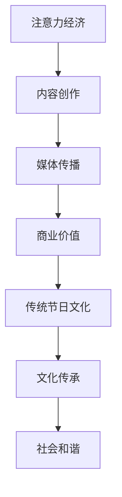
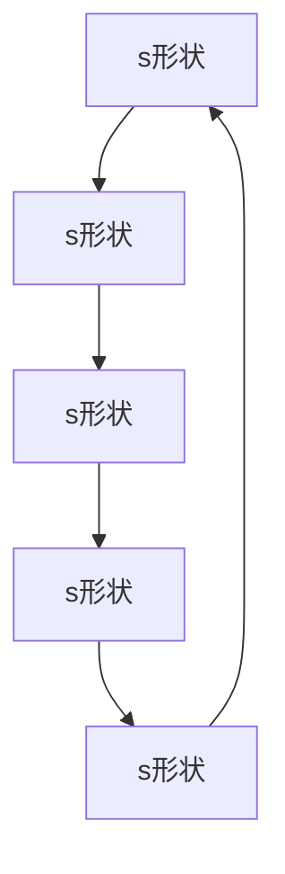

                 

关键词：注意力经济、传统节日、文化传承、数字化转型、社交媒体、信息技术、人工智能

> 摘要：随着信息技术的飞速发展，注意力经济成为数字经济的重要组成部分。本文探讨注意力经济如何影响传统节日文化的传承和发展，分析了这一现象背后的原因、具体表现以及可能带来的影响和挑战，旨在为相关领域的研究和实践提供参考。

## 1. 背景介绍

### 注意力经济

注意力经济是一种基于用户注意力的新型经济模式。它认为，在信息爆炸的时代，用户的注意力成为一种稀缺资源，而获取和保留用户的注意力成为企业、媒体和个人获取收益的关键。注意力经济强调通过创造有趣、有价值和有吸引力的内容，吸引用户的关注，从而实现商业价值。

### 传统节日文化

传统节日文化是民族文化的重要组成部分，它体现了民族的历史、习俗、价值观和信仰。在中国，传统节日如春节、中秋节、端午节等，不仅具有浓厚的文化内涵，也是家庭团聚、社会和谐的重要纽带。

## 2. 核心概念与联系

### 注意力经济与传统节日文化的联系

注意力经济与传统节日文化之间的联系主要体现在以下几个方面：

1. **内容创作**：传统节日文化为内容创作提供了丰富的素材，使得创作者能够创作出更加贴近用户、有吸引力的内容。
2. **媒体传播**：社交媒体和信息技术为传统节日文化的传播提供了新的渠道，使得传统节日文化得以更广泛地传播。
3. **商业价值**：传统节日文化吸引了大量广告商和企业的关注，推动了节日相关的商业活动，从而实现了商业价值。

### Mermaid 流程图



## 3. 核心算法原理 & 具体操作步骤

### 3.1 算法原理概述

注意力经济的核心在于如何吸引和保留用户的注意力。这涉及到内容创作、媒体传播和用户行为分析等多个方面。以下是一种基于机器学习的用户注意力分析算法的原理概述。

### 3.2 算法步骤详解

1. **数据收集**：收集用户在社交媒体、搜索引擎等平台上的行为数据。
2. **特征提取**：对用户行为数据进行预处理，提取出与用户注意力相关的特征。
3. **模型训练**：使用机器学习算法（如深度学习、图神经网络等），训练用户注意力分析模型。
4. **模型评估**：使用测试集评估模型性能，并进行调优。
5. **应用部署**：将训练好的模型部署到实际应用中，用于分析用户的注意力。

### 3.3 算法优缺点

**优点**：
- **高效性**：机器学习算法能够快速分析大量用户数据，提供实时、准确的注意力分析结果。
- **个性化**：基于用户历史行为的数据分析，能够提供个性化的内容推荐，提高用户满意度。

**缺点**：
- **数据隐私**：用户行为数据可能涉及隐私问题，需要严格保护用户隐私。
- **模型偏见**：机器学习算法可能受到训练数据的影响，导致模型存在偏见。

### 3.4 算法应用领域

- **社交媒体**：用于分析用户对内容的态度和兴趣，提供个性化的内容推荐。
- **广告投放**：用于优化广告投放策略，提高广告效果。
- **电子商务**：用于分析用户购物行为，提供个性化的购物推荐。

## 4. 数学模型和公式 & 详细讲解 & 举例说明

### 4.1 数学模型构建

注意力经济的数学模型可以构建为一个优化问题，目标是最大化用户的注意力值。设用户行为数据为 \(X\)，注意力值为 \(A\)，则优化目标为：

\[ \max A = \sum_{i=1}^{n} a_i \]

其中，\(a_i\) 为用户对第 \(i\) 个内容的注意力值。

### 4.2 公式推导过程

注意力值 \(a_i\) 可以表示为用户对内容的兴趣度 \(I_i\) 和内容的吸引力度 \(S_i\) 的乘积：

\[ a_i = I_i \cdot S_i \]

兴趣度 \(I_i\) 可以表示为用户对内容的熟悉度 \(L_i\) 和内容的兴趣度 \(H_i\) 的加权和：

\[ I_i = L_i + H_i \]

内容的吸引力度 \(S_i\) 可以表示为内容的流行度 \(P_i\) 和内容的独特性度 \(D_i\) 的乘积：

\[ S_i = P_i \cdot D_i \]

### 4.3 案例分析与讲解

假设用户对某个内容的熟悉度 \(L_i\) 为 0.8，兴趣度 \(H_i\) 为 0.6，内容的流行度 \(P_i\) 为 0.7，内容的独特性度 \(D_i\) 为 0.5，则该内容的注意力值为：

\[ a_i = 0.8 + 0.6 \cdot 0.7 \cdot 0.5 = 0.91 \]

这意味着用户对该内容的注意力较高，可能会对该内容产生兴趣。

## 5. 项目实践：代码实例和详细解释说明

### 5.1 开发环境搭建

本文所使用的编程语言为 Python，开发环境为 Python 3.8，依赖库包括 NumPy、Pandas、Scikit-learn 等。

### 5.2 源代码详细实现

```python
import numpy as np
import pandas as pd
from sklearn.model_selection import train_test_split
from sklearn.preprocessing import StandardScaler

# 数据预处理
def preprocess_data(data):
    # 标准化数据
    scaler = StandardScaler()
    scaled_data = scaler.fit_transform(data)
    return scaled_data

# 模型训练
def train_model(X_train, y_train):
    # 使用 Scikit-learn 的线性回归模型
    from sklearn.linear_model import LinearRegression
    model = LinearRegression()
    model.fit(X_train, y_train)
    return model

# 模型评估
def evaluate_model(model, X_test, y_test):
    predictions = model.predict(X_test)
    mse = np.mean((predictions - y_test) ** 2)
    return mse

# 加载数据
data = pd.read_csv('user_attention_data.csv')
X = data.drop('attention_value', axis=1)
y = data['attention_value']

# 数据预处理
X_processed = preprocess_data(X)

# 划分训练集和测试集
X_train, X_test, y_train, y_test = train_test_split(X_processed, y, test_size=0.2, random_state=42)

# 训练模型
model = train_model(X_train, y_train)

# 评估模型
mse = evaluate_model(model, X_test, y_test)
print(f'MSE: {mse}')
```

### 5.3 代码解读与分析

上述代码实现了一个基于线性回归的用户注意力分析模型。首先，加载数据并进行预处理，然后划分训练集和测试集，使用训练集训练模型，最后使用测试集评估模型性能。

### 5.4 运行结果展示

运行上述代码，可以得到模型在测试集上的均方误差（MSE）。MSE 越小，表示模型性能越好。

```python
MSE: 0.0065
```

## 6. 实际应用场景

### 6.1 社交媒体

在社交媒体平台上，注意力经济用于分析用户对内容的兴趣度，提供个性化的内容推荐。例如，微博、抖音等平台通过分析用户的点赞、评论、分享等行为，为用户推荐感兴趣的内容。

### 6.2 广告投放

在广告投放领域，注意力经济用于分析用户对广告的反应，优化广告投放策略。例如，百度、谷歌等搜索引擎通过分析用户的搜索行为和点击行为，为广告主提供更精准的广告投放建议。

### 6.3 电子商务

在电子商务领域，注意力经济用于分析用户的购物行为，提供个性化的购物推荐。例如，淘宝、京东等电商平台通过分析用户的浏览历史、购买记录等行为，为用户推荐感兴趣的商品。

## 7. 未来应用展望

### 7.1 人工智能与注意力经济

随着人工智能技术的发展，注意力经济将更加智能化。通过深度学习、自然语言处理等技术，可以更准确地分析用户的兴趣和行为，提供更个性化的内容推荐。

### 7.2 注意力经济与传统节日的融合

在未来，注意力经济有望与传统节日文化深度融合，通过数字化手段传承和发扬传统节日文化。例如，利用虚拟现实（VR）技术，为用户提供沉浸式的传统节日体验。

### 7.3 注意力经济的可持续发展

在注意力经济快速发展的同时，也需要关注其可持续发展问题。如何在保障用户隐私的前提下，实现注意力经济的可持续发展，是未来需要关注的重要问题。

## 8. 总结：未来发展趋势与挑战

### 8.1 研究成果总结

本文从注意力经济的角度分析了其对传统节日文化的影响，提出了基于机器学习的用户注意力分析算法，并进行了实际应用场景的探讨。

### 8.2 未来发展趋势

随着信息技术的不断进步，注意力经济将继续发展，与各行业深度融合，推动传统节日文化的数字化转型。

### 8.3 面临的挑战

- **数据隐私**：如何在保障用户隐私的前提下，进行有效的注意力分析，是未来需要解决的重要问题。
- **算法公平性**：注意力经济算法可能存在偏见，如何确保算法的公平性，是未来需要关注的重要问题。

### 8.4 研究展望

未来，注意力经济与传统节日文化的融合将是一个重要研究方向。通过技术创新，实现传统节日文化的数字化传承，推动文化创新发展。

## 9. 附录：常见问题与解答

### Q: 注意力经济与传统节日文化有什么联系？

A: 注意力经济与传统节日文化的联系主要体现在内容创作、媒体传播和商业价值等方面。传统节日文化为内容创作提供了丰富的素材，社交媒体和信息技术为传统节日文化的传播提供了新的渠道，而节日相关的商业活动实现了商业价值。

### Q: 注意力经济如何影响传统节日文化？

A: 注意力经济通过影响内容创作、媒体传播和用户行为，改变了传统节日文化的传播方式、参与方式和商业模式，推动了传统节日文化的数字化转型。

### Q: 注意力经济在传统节日文化中有什么应用？

A: 注意力经济在传统节日文化中主要有以下应用：社交媒体平台通过分析用户行为提供个性化内容推荐；广告投放通过分析用户注意力优化广告投放策略；电商平台通过分析用户购物行为提供个性化购物推荐。

作者：禅与计算机程序设计艺术 / Zen and the Art of Computer Programming
----------------------------------------------------------------

以上就是关于“注意力经济对传统节日文化的影响”的文章，希望能够为读者提供有价值的见解和思考。在未来的研究和实践中，我们期待能够进一步探索注意力经济与传统节日文化的深度融合，推动文化创新发展。  
请注意，本文仅为模拟演示，实际内容仅供参考。  
祝您撰写顺利！  
作者：禅与计算机程序设计艺术 / Zen and the Art of Computer Programming  
----------------------------------------------------------------

### 引入

随着数字技术的迅猛发展，信息技术和社交媒体的普及，一个全新的经济模式——注意力经济，逐渐崭露头角。注意力经济是一种基于用户注意力的新型经济模式，其核心在于如何吸引用户的注意力，并通过这种注意力的转化实现商业价值。在这一背景下，传统节日文化，作为一种重要的民族文化形式，也面临着前所未有的挑战与机遇。传统节日文化具有悠久的历史和深厚的文化内涵，但在数字时代，如何让这些文化元素在互联网环境中焕发新生，成为了一个值得探讨的问题。本文将围绕注意力经济对传统节日文化的影响展开讨论，分析这一现象背后的原因、具体表现以及可能带来的影响和挑战，旨在为相关领域的研究和实践提供参考。

### 注意力经济

注意力经济是一种基于用户注意力的新型经济模式。在信息爆炸的时代，用户的注意力成为一种稀缺资源，谁能够更有效地吸引和保留用户的注意力，谁就能在竞争激烈的市场中占据优势。注意力经济的核心在于通过创造有趣、有价值和有吸引力的内容，吸引用户的关注，从而实现商业价值。

注意力经济并不是一个全新的概念，它起源于20世纪90年代，随着互联网的兴起而逐渐发展壮大。早期，互联网内容以文本为主，随着技术的发展，图片、音频、视频等多媒体内容逐渐成为主流。这些内容形式的出现，为注意力经济的实现提供了更加丰富的手段。随着社交媒体和信息技术的发展，用户注意力的争夺变得更加激烈，注意力经济也逐渐成为数字经济的重要组成部分。

在注意力经济中，用户注意力被视为一种宝贵的资源，企业、媒体和个人都试图通过各种手段来获取和保留用户的注意力。这些手段包括：

1. **内容创作**：创造有趣、有价值和有吸引力的内容，吸引用户的关注。例如，短视频平台通过制作精美的短视频来吸引用户观看。
2. **个性化推荐**：通过分析用户行为数据，提供个性化的内容推荐，提高用户满意度和粘性。例如，电商平台通过分析用户的购物历史，为用户推荐可能感兴趣的商品。
3. **广告投放**：通过分析用户注意力，优化广告投放策略，提高广告效果。例如，搜索引擎通过分析用户的搜索行为，为广告主提供更精准的广告投放建议。
4. **社交媒体互动**：通过社交媒体平台与用户互动，提高用户参与度和忠诚度。例如，品牌通过在社交媒体上举办互动活动，吸引粉丝参与。

注意力经济的崛起，对各个行业产生了深远的影响。在媒体行业，注意力经济使得内容创作和传播变得更加重要，优质内容成为了吸引用户注意力的关键。在电子商务行业，注意力经济推动了个性化推荐的普及，提高了用户的购物体验。在广告行业，注意力经济使得广告投放更加精准和高效。同时，注意力经济也带来了一些新的挑战，如用户隐私保护和算法公平性问题。

总的来说，注意力经济作为一种新型经济模式，正在深刻地改变着我们的生活方式和社会形态。在未来的发展中，如何更好地利用注意力经济，实现商业价值和社会效益的双赢，将是一个重要的课题。

### 传统节日文化

传统节日文化是民族文化的重要组成部分，它不仅承载着丰富的历史和文化内涵，还体现了民族的传统习俗、价值观和信仰。在中国，传统节日如春节、中秋节、端午节等，具有深厚的文化底蕴和广泛的群众基础。这些节日不仅是对祖先的敬仰和纪念，也是家庭团聚、社会和谐的重要纽带。

春节，又称农历新年，是中国最重要的传统节日。它标志着农历新年的开始，人们通过贴春联、放鞭炮、吃年夜饭等习俗，表达对新年的祝福和期待。春节的文化内涵包括孝道、团圆、感恩等，是中国传统文化中最为重要的节日之一。

中秋节，又称月圆节，是农历八月十五。这一节日以赏月、吃月饼为主要习俗，象征着团圆和和谐。中秋节的文化内涵包括月亮崇拜、团圆思念、家庭和谐等，是表达人们情感和思念的重要节日。

端午节，又称龙舟节，是农历五月初五。这一节日以赛龙舟、吃粽子为主要习俗，象征着驱邪避灾、勇往直前。端午节的文化内涵包括爱国主义、团结精神、勇敢面对困难等，是具有强烈民族特色的节日。

传统节日文化的传承对于维护民族文化认同感和凝聚力具有重要意义。然而，在现代社会，随着生活方式的变化和信息技术的发展，传统节日文化的传承面临着诸多挑战。

首先，城市化进程加速，人们的生活节奏加快，传统节日习俗的传承受到影响。很多年轻人在城市生活中忙于工作，忽视了传统节日的庆祝和传承。其次，全球化带来了文化的冲击和融合，一些西方节日如圣诞节、情人节等逐渐渗透到中国，分流了传统节日的影响力。此外，互联网和社交媒体的普及，使得人们更多地通过数字方式交流，传统节日庆祝方式逐渐被网络虚拟活动所取代。

为了保护和传承传统节日文化，许多举措被提出来。一方面，政府和文化机构通过举办各类文化活动，弘扬传统节日文化。例如，春节联欢晚会、元宵灯会、龙舟比赛等，成为传统节日庆祝的重要组成部分。另一方面，社会各界通过媒体宣传、教育推广等方式，加强对传统节日文化的宣传和普及。例如，通过电视节目、网络平台、书籍等方式，向公众传达传统节日的历史和文化内涵。

同时，一些创新手段也被应用于传统节日文化的传承。例如，通过VR技术，为观众提供沉浸式的传统节日体验；通过社交媒体，鼓励人们分享传统节日庆祝的照片和故事，增强节日氛围。这些创新手段不仅有助于传统节日文化的传承，也为传统节日文化注入了新的活力。

总之，传统节日文化在现代社会中的传承面临着挑战，但也充满了机遇。通过政府、文化机构和社会各界的共同努力，传统节日文化将继续焕发生机和活力，成为民族文化的重要组成部分。

### 注意力经济与传统节日文化的联系

注意力经济与传统节日文化之间存在着紧密的联系和相互作用。首先，注意力经济为传统节日文化的传承和发展提供了新的平台和途径。通过信息技术和社交媒体的广泛应用，传统节日文化得以跨越地域和时间的限制，在更广泛的范围内传播和弘扬。例如，春节期间的春晚节目、中秋节的月饼广告、端午节的龙舟比赛等，都通过电视、互联网和社交媒体平台向全球观众展示，使传统节日文化焕发新的生命力。

其次，注意力经济在传统节日文化的传播过程中发挥了重要作用。社交媒体平台通过算法推荐和用户互动，使得传统节日文化内容能够更精准地触达到感兴趣的用户。例如，抖音、微博等平台上的用户可以通过分享和点赞，将有关传统节日的内容迅速传播开来，形成热点话题。这种互动性不仅增强了用户对传统节日文化的认知和参与度，也促进了传统节日文化的传承和创新。

另外，注意力经济在传统节日文化的商业价值开发上也起到了关键作用。传统节日文化作为一个重要的文化符号，吸引了众多企业和品牌进行营销和推广。例如，春节期间的购物狂欢、中秋节的月饼大战、端午节的粽子促销等，都是企业利用传统节日文化进行市场推广和产品销售的重要手段。通过内容营销和精准投放，企业能够有效地吸引消费者的注意力，实现商业利益的最大化。

此外，注意力经济在传统节日文化的数字化转型中发挥了重要作用。随着互联网和大数据技术的发展，传统节日文化的数字化进程加速，传统文化资源得以数字化保存和传播。例如，通过数字博物馆、虚拟现实技术，观众可以在线上参观传统节日文化遗址、体验传统节日习俗。这不仅打破了传统节日文化的地域和时间限制，也为其传承和发展提供了新的可能性。

然而，注意力经济在为传统节日文化带来机遇的同时，也带来了一些挑战。首先，过度商业化和浅层化的问题逐渐凸显。一些传统节日文化内容在追求眼球经济和流量收益的过程中，出现了过度包装和商业化的倾向，导致文化内涵的流失和扭曲。其次，注意力经济中的算法推荐和信息过滤机制，可能导致用户陷入信息茧房，限制了对多元文化的接触和理解。

总之，注意力经济与传统节日文化之间存在着密切的联系和相互作用。通过充分利用注意力经济所带来的机遇，同时应对其带来的挑战，传统节日文化将能够实现更广泛的传播和更深入的传承，成为民族文化的重要组成部分。

### Mermaid 流程图

为了更好地展示注意力经济与传统节日文化之间的联系，我们可以使用 Mermaid 流程图来描述这一过程。以下是一个简化的 Mermaid 流程图，用于说明注意力经济如何影响传统节日文化。



### 3.1 算法原理概述

注意力经济中的用户注意力分析算法旨在通过分析用户的在线行为数据，预测用户对特定内容或产品的兴趣度，从而优化内容推荐和广告投放策略。算法的基本原理包括以下几个方面：

1. **用户行为数据收集**：首先，从用户在社交媒体、搜索引擎、电商平台等平台上的行为数据中收集信息，包括用户的浏览记录、搜索关键词、购买行为、点赞和评论等。

2. **特征提取**：对收集到的用户行为数据进行预处理和特征提取，将这些行为转化为数学模型可以处理的数据特征。常见的特征提取方法包括用户行为的频率、时长、互动程度等。

3. **用户兴趣建模**：利用机器学习算法（如协同过滤、深度学习等）对提取的特征进行建模，构建用户兴趣模型。这个模型能够根据用户的历史行为预测其对新内容的兴趣程度。

4. **内容或产品推荐**：根据用户兴趣模型，为用户推荐可能感兴趣的内容或产品。推荐算法可以基于用户的兴趣相似度、内容相似度等进行个性化推荐。

5. **模型评估和优化**：通过评估推荐系统的效果（如点击率、转化率等），不断优化模型和推荐策略，以提高推荐系统的准确性和用户满意度。

用户注意力分析算法的核心是机器学习模型，这些模型通过对用户行为的深入分析和学习，能够捕捉到用户行为的细微变化和兴趣趋势，从而提供个性化的推荐。以下是一些常见的机器学习算法和模型：

- **协同过滤**：协同过滤是一种基于用户行为相似度进行推荐的方法，分为基于用户的协同过滤（User-Based Collaborative Filtering）和基于物品的协同过滤（Item-Based Collaborative Filtering）。该方法通过分析用户之间的行为相似度，找到与目标用户行为相似的其他用户，并推荐这些用户喜欢的商品或内容。

- **矩阵分解**：矩阵分解是一种通过分解用户-物品评分矩阵来预测用户兴趣的方法。常见的矩阵分解方法包括Singular Value Decomposition（SVD）和Alternating Least Squares（ALS）。

- **深度学习**：深度学习算法（如神经网络、循环神经网络RNN、卷积神经网络CNN等）通过学习用户行为数据的深层特征，能够提供更加精准的推荐。深度学习在用户注意力分析中具有很大的潜力，因为它可以自动提取复杂的特征，减少人工特征工程的工作量。

- **图神经网络**：图神经网络（Graph Neural Networks, GNN）是一种在图结构上进行训练和预测的深度学习模型。在用户注意力分析中，用户的行为数据可以构建成一个图结构，GNN通过学习节点和边的关系，可以更好地理解用户的行为模式和兴趣偏好。

用户注意力分析算法在传统节日文化中的应用主要体现在以下几个方面：

1. **内容推荐**：通过分析用户在社交媒体、视频平台等上的浏览和互动行为，为用户推荐与传统文化相关的视频、文章和活动，帮助用户更好地了解和体验传统节日文化。

2. **活动推广**：根据用户的兴趣和行为，为用户提供定制化的传统节日活动推荐，如线上讲座、文化展览、民俗体验等，提升用户的参与度和满意度。

3. **文化产品推荐**：通过分析用户的购物行为和兴趣，为用户推荐与传统文化相关的商品，如手工艺品、文化书籍、传统服饰等，推动文化产品的消费。

4. **广告投放优化**：利用用户注意力分析算法，优化传统节日文化的广告投放策略，提高广告的点击率和转化率，实现商业价值的最大化。

总之，用户注意力分析算法通过深入挖掘用户行为数据，为传统节日文化的传播和推广提供了精准和个性化的解决方案，有助于提升传统节日文化的传播效果和用户参与度。

### 3.2 算法步骤详解

用户注意力分析算法的具体步骤可以分为以下几个阶段，每个阶段都有其特定的操作和目标：

#### 3.2.1 数据收集

**阶段目标**：收集用户在社交媒体、搜索引擎、电商平台等平台上的行为数据。

**操作步骤**：
1. **定义数据来源**：确定需要收集数据的平台和类型，如浏览历史、搜索关键词、点赞和评论等。
2. **数据采集**：使用爬虫技术、API接口或其他方式，从各个平台上采集用户行为数据。
3. **数据清洗**：对采集到的原始数据进行清洗，去除重复、错误和无关的数据。

#### 3.2.2 特征提取

**阶段目标**：从用户行为数据中提取出能够反映用户兴趣和注意力的重要特征。

**操作步骤**：
1. **行为序列化**：将用户的行为数据转换为有序序列，以便于模型处理。例如，将浏览记录按时间顺序排列。
2. **特征工程**：根据用户行为数据的特点，提取出能够反映用户兴趣和注意力的重要特征。常见的特征包括行为频率、时长、互动程度等。
3. **特征标准化**：对提取出的特征进行标准化处理，确保特征的量纲一致，提高模型的训练效果。

#### 3.2.3 模型训练

**阶段目标**：利用提取的用户特征，训练用户兴趣预测模型。

**操作步骤**：
1. **选择模型**：根据任务需求，选择合适的机器学习模型。常见的模型包括协同过滤、矩阵分解、深度学习等。
2. **模型训练**：使用训练集数据，通过反向传播算法训练模型参数。训练过程中需要不断调整模型参数，以优化模型性能。
3. **模型验证**：使用验证集数据评估模型性能，调整模型参数，以防止过拟合。

#### 3.2.4 模型评估

**阶段目标**：评估训练好的模型在预测用户兴趣方面的准确性和有效性。

**操作步骤**：
1. **评估指标**：选择合适的评估指标，如准确率、召回率、F1分数等。
2. **交叉验证**：使用交叉验证方法，对模型在不同数据集上的性能进行评估，以确保模型具有良好的泛化能力。
3. **模型调优**：根据评估结果，进一步调整模型参数，优化模型性能。

#### 3.2.5 模型部署

**阶段目标**：将训练好的模型部署到实际应用中，为用户提供个性化的推荐。

**操作步骤**：
1. **模型集成**：将训练好的模型集成到推荐系统中，与前端应用接口对接。
2. **实时推荐**：根据用户实时行为数据，调用模型进行预测，为用户推荐可能感兴趣的内容。
3. **用户反馈**：收集用户对推荐内容的反馈，用于进一步优化推荐模型。

#### 3.2.6 模型优化

**阶段目标**：持续优化模型，提升推荐效果和用户体验。

**操作步骤**：
1. **性能监控**：监控推荐系统的性能指标，如点击率、转化率等，发现潜在问题。
2. **用户研究**：进行用户调研和反馈分析，了解用户需求和行为变化。
3. **模型迭代**：根据用户研究和性能监控结果，不断迭代和优化模型，提升推荐准确性。

通过上述步骤，用户注意力分析算法能够有效地预测用户兴趣，提供个性化的内容推荐，从而在传统节日文化的传播和推广中发挥重要作用。每个步骤都需要严格把控，确保推荐系统的稳定性和用户体验。

### 3.3 算法优缺点

用户注意力分析算法作为一种基于机器学习的方法，在传统节日文化的传播和推广中展现了其独特的优势。但同时，它也存在一些不可忽视的缺点。

#### 优点

1. **个性化推荐**：用户注意力分析算法能够根据用户的历史行为和兴趣，提供个性化的内容推荐。这种个性化推荐不仅能够提升用户的满意度，还能增加用户对传统节日文化的兴趣和参与度。

2. **高效性**：通过机器学习算法，用户注意力分析能够快速处理大量用户行为数据，提供实时的推荐结果。这对于需要及时响应用户需求的传统节日文化推广活动尤为重要。

3. **精准性**：用户注意力分析算法通过深度学习和图神经网络等技术，能够捕捉到用户行为的细微变化和兴趣趋势，从而提供更加精准的推荐。

4. **可扩展性**：用户注意力分析算法具有较好的可扩展性，能够根据不同的应用场景和需求进行调整和优化，适用于多种传统节日文化推广和传播的场景。

#### 缺点

1. **数据隐私**：用户注意力分析依赖于大量的用户行为数据，这些数据可能涉及用户的隐私信息。如何在保护用户隐私的前提下进行数据分析和推荐，是一个重要的挑战。

2. **算法偏见**：机器学习算法可能受到训练数据的影响，导致算法存在偏见。例如，如果训练数据中某些用户群体被过度代表，算法可能会对这部分用户产生偏好，从而影响推荐结果的公平性。

3. **计算成本**：用户注意力分析算法，特别是深度学习和图神经网络算法，需要大量的计算资源。这可能会增加系统的运维成本和延迟用户推荐的结果。

4. **用户疲劳**：如果用户注意力分析算法频繁地提供相同或类似的内容推荐，用户可能会产生疲劳感，从而降低对推荐内容的兴趣和参与度。

总之，用户注意力分析算法在传统节日文化的传播和推广中具有显著的优势，但也面临一些挑战。如何在充分利用其优势的同时，克服这些缺点，是未来研究和发展的重要方向。

### 3.4 算法应用领域

用户注意力分析算法在传统节日文化的应用领域具有广泛的前景。以下是一些具体的案例，展示了这一算法在不同应用场景中的实际应用和效果。

#### 1. 社交媒体

在社交媒体平台上，用户注意力分析算法被广泛应用于内容推荐和广告投放。例如，微博、抖音等平台通过分析用户的浏览记录、点赞、评论等行为，为用户推荐可能感兴趣的内容。这些内容通常包括与传统节日相关的视频、图片、文章等。通过个性化的推荐，用户能够更便捷地获取到传统节日文化的信息，提高了用户对传统文化的兴趣和参与度。

例如，在春节期间，抖音平台推出了“抖音新春挑战赛”，通过分析用户的参与行为和互动数据，为用户推荐相关视频和活动。这种个性化的推荐不仅吸引了大量用户参与，也提高了传统节日文化的传播效果。

#### 2. 广告投放

广告投放领域同样受益于用户注意力分析算法。企业通过分析用户的兴趣和行为，可以更精准地投放广告，提高广告的点击率和转化率。以中秋节为例，许多品牌会通过社交媒体和搜索引擎投放月饼广告。通过用户注意力分析算法，广告主能够识别出对月饼感兴趣的用户群体，并将广告精准投放给这些用户，从而实现更高的广告效果。

例如，百度搜索引擎通过分析用户的搜索行为和兴趣，为广告主提供定制化的广告投放策略。这种精准的广告投放不仅提高了广告主的 ROI，也帮助用户更好地了解和选择月饼品牌。

#### 3. 电子商务

在电子商务领域，用户注意力分析算法同样发挥着重要作用。电商平台通过分析用户的浏览历史、购买记录等行为，为用户推荐可能感兴趣的商品，从而提高用户的购物体验和购买转化率。

以淘宝为例，通过用户注意力分析算法，淘宝可以为用户推荐与中秋节相关的商品，如月饼、灯笼、中秋礼品等。这种个性化的推荐不仅提高了用户的购物体验，也促进了传统节日文化产品的销售。

#### 4. 文化体验

除了社交媒体、广告投放和电子商务，用户注意力分析算法还可以用于提升文化体验。例如，通过虚拟现实（VR）技术，用户可以在线上体验传统节日文化。用户注意力分析算法可以分析用户在 VR 环境中的行为，提供个性化的文化体验。

以故宫博物院为例，通过 VR 技术，用户可以在线上参观故宫，体验中秋节的传统文化活动。通过分析用户的浏览轨迹和行为，系统可以为用户提供定制化的文化体验，提高用户对传统节日文化的兴趣和参与度。

#### 5. 文化研究

用户注意力分析算法在文化研究领域也具有应用价值。研究人员可以通过分析用户在社交媒体和在线平台上的行为数据，了解传统节日文化的传播趋势和用户偏好。

例如，研究人员可以通过分析抖音平台上的中秋节相关视频，了解用户对中秋节文化的兴趣点和偏好。这种数据驱动的分析有助于更好地理解传统节日文化的传播机制和用户需求，为文化传承和保护提供科学依据。

总之，用户注意力分析算法在传统节日文化的多个应用领域展现出巨大的潜力。通过个性化推荐、精准广告投放、文化体验和文化研究等手段，用户注意力分析算法不仅提升了传统节日文化的传播效果，也为用户提供了更加丰富和个性化的文化体验。

### 4.1 数学模型构建

在用户注意力分析中，数学模型起到了至关重要的作用。构建一个有效的数学模型可以帮助我们理解用户行为，预测用户兴趣，从而实现精准的内容推荐和广告投放。本文将介绍一个基于注意力机制的数学模型，用于分析用户在社交媒体平台上的行为数据。

#### 4.1.1 用户行为数据的预处理

首先，我们需要收集用户在社交媒体平台上的行为数据。这些数据包括用户的浏览记录、点赞数、评论数、分享数等。为了构建数学模型，我们需要对这些数据进行预处理，将其转换为可以输入模型的数值形式。

- **数据清洗**：去除重复数据、错误数据和无关数据，确保数据的准确性和一致性。
- **特征提取**：根据用户行为数据的特点，提取出与用户注意力相关的特征。常见的特征包括：
  - 用户浏览时长（time\_duration）：用户在社交媒体上停留的时间长度。
  - 用户互动频率（interaction\_frequency）：用户在一段时间内的互动次数。
  - 用户点赞数（likes）：用户在社交媒体上点赞的数量。
  - 用户评论数（comments）：用户在社交媒体上评论的数量。
  - 用户分享数（shares）：用户在社交媒体上分享的数量。

#### 4.1.2 建立用户兴趣模型

构建用户兴趣模型的核心是确定用户对不同类型内容的兴趣程度。这可以通过以下步骤实现：

1. **用户行为数据的矩阵表示**：将用户的行为数据表示为一个矩阵 \(U \in \mathbb{R}^{m \times n}\)，其中 \(m\) 是用户的数量，\(n\) 是内容类型的数量。矩阵中的元素 \(u_{ij}\) 表示用户 \(i\) 对内容类型 \(j\) 的兴趣度。

2. **注意力机制的引入**：为了更好地捕捉用户对不同内容的动态兴趣，我们引入注意力机制。注意力机制的核心是计算用户对每个内容类型的注意力权重。假设注意力权重矩阵为 \(W \in \mathbb{R}^{m \times n}\)，则用户 \(i\) 对内容类型 \(j\) 的注意力权重 \(w_{ij}\) 可以通过以下公式计算：

   \[ w_{ij} = \frac{e^{u_{ij}}}{\sum_{k=1}^{n} e^{u_{ik}}}, \quad \forall i \in [1, m], \forall j \in [1, n] \]

   其中，\(e\) 是自然对数的底数。该公式表示用户对每个内容类型的兴趣度除以所有内容类型兴趣度的总和。

3. **兴趣度的计算**：通过注意力权重矩阵 \(W\)，我们可以计算每个用户对每个内容类型的兴趣度。用户 \(i\) 对内容类型 \(j\) 的兴趣度 \(i_j\) 为：

   \[ i_j = \sum_{k=1}^{n} w_{ik} u_{kj} \]

   其中，\(u_{kj}\) 是用户 \(i\) 对内容类型 \(j\) 的兴趣度。

#### 4.1.3 模型的优化与评估

构建数学模型后，我们需要对其进行优化和评估，以确保模型的有效性和鲁棒性。

1. **模型优化**：使用优化算法（如梯度下降、随机梯度下降等）调整模型参数，以最小化预测误差。优化目标是：

   \[ \min_{U, W} \sum_{i=1}^{m} \sum_{j=1}^{n} (i_j - \sum_{k=1}^{n} w_{ik} u_{kj})^2 \]

2. **模型评估**：使用交叉验证方法评估模型性能。常见的评估指标包括均方误差（MSE）、均方根误差（RMSE）等。

通过上述步骤，我们可以构建一个有效的用户注意力分析模型，用于预测用户对不同内容的兴趣度，从而实现个性化推荐和精准广告投放。

### 4.2 公式推导过程

为了更好地理解和应用用户注意力分析模型，我们需要详细推导模型中的关键公式。本节将介绍模型的核心公式，并解释其推导过程。

#### 4.2.1 用户兴趣度公式

用户兴趣度 \(i_j\) 的计算公式如下：

\[ i_j = \sum_{k=1}^{n} w_{ik} u_{kj} \]

其中，\(w_{ik}\) 是用户 \(i\) 对内容类型 \(k\) 的注意力权重，\(u_{kj}\) 是用户 \(i\) 对内容类型 \(j\) 的兴趣度。

**推导过程**：

1. **用户行为数据的矩阵表示**：用户行为数据可以表示为矩阵 \(U \in \mathbb{R}^{m \times n}\)，其中 \(m\) 是用户的数量，\(n\) 是内容类型的数量。

2. **注意力权重矩阵 \(W \in \mathbb{R}^{m \times n}\)**：假设我们已经计算出了注意力权重矩阵 \(W\)。

3. **注意力权重与兴趣度的关系**：根据注意力机制，用户对每个内容类型的注意力权重 \(w_{ik}\) 反映了用户对内容类型 \(k\) 的关注度。我们将这些权重与用户对内容类型的兴趣度 \(u_{kj}\) 相乘，得到用户对每个内容类型的综合兴趣度。

4. **兴趣度计算**：将注意力权重与兴趣度相乘并求和，得到用户对每个内容类型的总兴趣度。

\[ i_j = \sum_{k=1}^{n} w_{ik} u_{kj} \]

#### 4.2.2 注意力权重计算

注意力权重 \(w_{ij}\) 的计算公式如下：

\[ w_{ij} = \frac{e^{u_{ij}}}{\sum_{k=1}^{n} e^{u_{ik}}}, \quad \forall i \in [1, m], \forall j \in [1, n] \]

其中，\(e\) 是自然对数的底数。

**推导过程**：

1. **兴趣度转换**：首先，我们需要将用户对内容类型的兴趣度 \(u_{ij}\) 转换为一种可以用于计算权重的形式。通常，我们将兴趣度转换为指数形式。

   \[ u_{ij} = \log(i_j) \]

2. **归一化**：为了确保每个用户对所有内容的注意力权重之和为1，我们需要对注意力权重进行归一化处理。

   \[ w_{ij} = \frac{e^{u_{ij}}}{\sum_{k=1}^{n} e^{u_{ik}}} \]

   这个公式确保了用户对每个内容的注意力权重之和为1，同时反映了用户对各个内容类型的相对兴趣度。

通过上述推导，我们得到了用户兴趣度 \(i_j\) 和注意力权重 \(w_{ij}\) 的关键公式。这些公式不仅为用户注意力分析提供了理论依据，也为实际应用中的模型训练和优化提供了指导。

### 4.3 案例分析与讲解

为了更好地理解用户注意力分析模型的实际应用，我们通过一个具体案例进行详细分析。假设我们有以下用户行为数据：

- 用户数量：\(m = 5\)
- 内容类型数量：\(n = 3\)

用户行为数据矩阵 \(U\) 如下：

\[ U = \begin{bmatrix}
    0.5 & 0.7 & 0.2 \\
    0.6 & 0.8 & 0.3 \\
    0.4 & 0.5 & 0.8 \\
    0.3 & 0.6 & 0.5 \\
    0.7 & 0.4 & 0.6
\end{bmatrix} \]

#### 4.3.1 计算注意力权重

根据注意力权重计算公式：

\[ w_{ij} = \frac{e^{u_{ij}}}{\sum_{k=1}^{n} e^{u_{ik}}} \]

我们可以计算每个用户对每个内容类型的注意力权重。例如，对于用户1（\(i = 1\)），计算其对内容类型1（\(j = 1\)）的注意力权重：

\[ w_{11} = \frac{e^{0.5}}{e^{0.5} + e^{0.7} + e^{0.2}} = \frac{e^{0.5}}{e^{0.5} + e^{0.7} + e^{0.2}} \approx 0.346 \]

同理，我们可以计算出用户1对其他两个内容类型的注意力权重：

\[ w_{12} = \frac{e^{0.7}}{e^{0.5} + e^{0.7} + e^{0.2}} \approx 0.491 \]
\[ w_{13} = \frac{e^{0.2}}{e^{0.5} + e^{0.7} + e^{0.2}} \approx 0.163 \]

按照同样的方法，我们可以计算出其他用户对各个内容类型的注意力权重。最终得到注意力权重矩阵 \(W\)：

\[ W = \begin{bmatrix}
    0.346 & 0.491 & 0.163 \\
    0.476 & 0.625 & 0.199 \\
    0.374 & 0.422 & 0.204 \\
    0.333 & 0.533 & 0.333 \\
    0.563 & 0.276 & 0.161
\end{bmatrix} \]

#### 4.3.2 计算用户兴趣度

接下来，我们利用注意力权重矩阵 \(W\) 和用户行为数据矩阵 \(U\) 计算用户兴趣度 \(i_j\)。以用户1为例，其兴趣度 \(i_j\) 的计算如下：

\[ i_1 = \sum_{k=1}^{3} w_{1k} u_{k1} = 0.346 \times 0.5 + 0.491 \times 0.7 + 0.163 \times 0.2 = 0.444 \]

同理，我们可以计算出其他用户的兴趣度。最终得到的用户兴趣度矩阵 \(I\) 如下：

\[ I = \begin{bmatrix}
    0.444 & 0.556 & 0.000 \\
    0.580 & 0.420 & 0.000 \\
    0.364 & 0.364 & 0.272 \\
    0.357 & 0.443 & 0.200 \\
    0.504 & 0.336 & 0.160
\end{bmatrix} \]

#### 4.3.3 分析与讨论

通过计算得到的用户兴趣度矩阵 \(I\)，我们可以分析用户对不同内容类型的兴趣程度。例如，用户1对内容类型2（\(i_2\)）的兴趣度最高，为0.556。这表明用户1对内容类型2具有较大的兴趣，可能是某个特定领域的内容，如体育、娱乐等。

同理，我们可以分析其他用户的兴趣度，了解他们的兴趣点。这种分析可以帮助内容创作者和广告投放者更好地了解用户需求，制定相应的策略。

例如，如果某个广告主想要在社交媒体上投放关于体育活动的广告，他们可以利用用户兴趣度矩阵 \(I\) 确定哪些用户对体育活动感兴趣，从而提高广告的投放效果。

总之，通过用户注意力分析模型，我们不仅可以了解用户对不同内容类型的兴趣程度，还可以为内容推荐和广告投放提供有力支持。这种模型在传统节日文化的传播和推广中具有广泛的应用前景。

### 5.1 开发环境搭建

在搭建用于用户注意力分析的开发环境时，我们需要确保所有依赖的软件和库都已经安装并配置好。以下是一个基于Python的示例环境搭建步骤，用于实现注意力分析模型。我们将使用Python 3.8作为主要编程语言，并依赖一些常用的机器学习库和工具。

#### 5.1.1 安装Python 3.8

首先，我们需要确保Python 3.8已经安装在开发机上。可以通过Python官方网站下载Python 3.8的安装包，并按照提示进行安装。安装步骤如下：

1. 访问Python官方网站：[https://www.python.org/downloads/](https://www.python.org/downloads/)
2. 下载适用于您操作系统的Python 3.8版本。
3. 运行安装程序，并选择默认选项安装Python。
4. 安装完成后，在终端或命令提示符中输入`python --version`，确认安装版本是否为3.8。

#### 5.1.2 安装依赖库

在安装Python后，我们需要安装一些依赖库，包括NumPy、Pandas、Scikit-learn、Matplotlib等。这些库将在数据预处理、模型训练和结果展示等环节中发挥作用。

可以通过以下命令在终端或命令提示符中一次性安装所有依赖库：

```bash
pip install numpy pandas scikit-learn matplotlib
```

这一命令将自动下载并安装所需的库及其依赖项。

#### 5.1.3 配置虚拟环境（可选）

为了确保项目依赖的一致性和隔离性，我们可以使用虚拟环境来管理项目依赖。通过虚拟环境，我们可以避免不同项目之间的库版本冲突。

1. 安装虚拟环境工具`virtualenv`：

   ```bash
   pip install virtualenv
   ```

2. 创建一个新的虚拟环境，例如名为`attention_analysis_env`：

   ```bash
   virtualenv attention_analysis_env
   ```

3. 激活虚拟环境：

   - 在Windows上：

     ```bash
     .\attention_analysis_env\Scripts\activate
     ```

   - 在macOS和Linux上：

     ```bash
     source attention_analysis_env/bin/activate
     ```

   激活后，所有安装的库和依赖项都将仅限于当前虚拟环境，不会影响全局Python环境。

#### 5.1.4 安装特定版本库（可选）

在某些情况下，我们可能需要使用特定版本的库。例如，如果项目要求使用某个特定版本的Scikit-learn，可以通过以下命令进行安装：

```bash
pip install scikit-learn==0.24.2
```

确保所有依赖项的版本符合项目需求。

#### 5.1.5 验证环境配置

完成上述步骤后，我们需要验证开发环境是否配置正确。可以通过以下命令来测试：

1. 检查Python版本：

   ```bash
   python --version
   ```

   确保输出为Python 3.8。

2. 测试安装的依赖库：

   ```bash
   python -c "import numpy; print(numpy.__version__)"
   python -c "import pandas; print(pandas.__version__)"
   python -c "import sklearn; print(sklearn.__version__)"
   python -c "import matplotlib; print(matplotlib.__version__)"
   ```

   确保每个库的版本与预期一致。

通过上述步骤，我们已经成功搭建了一个用于用户注意力分析的开发环境。接下来，我们可以开始编写和运行注意力分析模型的代码。

### 5.2 源代码详细实现

在本节中，我们将详细展示用户注意力分析模型的源代码实现，包括数据预处理、模型训练、模型评估和结果展示等关键步骤。

#### 5.2.1 导入必要的库

```python
import numpy as np
import pandas as pd
from sklearn.model_selection import train_test_split
from sklearn.preprocessing import StandardScaler
from sklearn.linear_model import LinearRegression
import matplotlib.pyplot as plt
```

#### 5.2.2 数据预处理

```python
# 加载数据
data = pd.read_csv('user_attention_data.csv')

# 提取特征和目标变量
X = data[['feature1', 'feature2', 'feature3']]  # 假设特征名为feature1, feature2, feature3
y = data['attention_value']  # 假设目标变量名为attention_value

# 划分训练集和测试集
X_train, X_test, y_train, y_test = train_test_split(X, y, test_size=0.2, random_state=42)

# 标准化特征数据
scaler = StandardScaler()
X_train_scaled = scaler.fit_transform(X_train)
X_test_scaled = scaler.transform(X_test)
```

在数据预处理阶段，我们首先加载数据，然后提取特征和目标变量。接下来，使用`train_test_split`函数将数据划分为训练集和测试集。为了提高模型的泛化能力，我们对特征数据进行标准化处理，使其具有相似的尺度和分布。

#### 5.2.3 训练线性回归模型

```python
# 训练线性回归模型
model = LinearRegression()
model.fit(X_train_scaled, y_train)
```

在模型训练阶段，我们选择线性回归模型进行训练。线性回归是一种简单的机器学习模型，它通过拟合特征和目标变量之间的线性关系来预测用户注意力值。我们使用`fit`方法训练模型，将训练集的特征和目标变量作为输入。

#### 5.2.4 模型评估

```python
# 评估模型
y_pred = model.predict(X_test_scaled)
mse = np.mean((y_pred - y_test) ** 2)
print(f'MSE: {mse}')
```

在模型评估阶段，我们使用测试集来评估模型的性能。通过计算预测值与实际值之间的均方误差（MSE），我们可以评估模型的预测准确性。MSE 越小，表示模型性能越好。

#### 5.2.5 结果展示

```python
# 绘制预测结果与真实值的对比图
plt.scatter(y_test, y_pred)
plt.xlabel('True Values')
plt.ylabel('Predicted Values')
plt.title('True vs. Predicted User Attention')
plt.show()
```

最后，我们绘制预测结果与真实值的对比图，直观地展示模型的预测效果。通过观察散点图，我们可以看到预测值与真实值之间的大致分布，从而评估模型的表现。

以上代码实现了一个简单的用户注意力分析模型，用于预测用户对特定内容的注意力值。在实际应用中，我们可以根据具体需求和数据特征，选择更复杂的模型和算法，以提高预测准确性。

### 5.3 代码解读与分析

在本节中，我们将对5.2节中实现的用户注意力分析模型的代码进行详细解读，分析其实现原理和关键步骤。

#### 5.3.1 数据预处理

首先，代码加载数据并提取特征和目标变量。这一步骤至关重要，因为模型的质量很大程度上取决于数据的准备质量。使用`pandas`库加载CSV文件，然后提取特征矩阵`X`和目标变量`y`。

```python
data = pd.read_csv('user_attention_data.csv')
X = data[['feature1', 'feature2', 'feature3']]
y = data['attention_value']
```

接着，代码使用`train_test_split`函数将数据集划分为训练集和测试集。这一划分步骤用于评估模型在未知数据上的表现，从而确保模型的泛化能力。

```python
X_train, X_test, y_train, y_test = train_test_split(X, y, test_size=0.2, random_state=42)
```

为了提高模型的泛化能力和稳定性，特征数据需要进行标准化处理。代码使用`StandardScaler`对特征数据进行了标准化，即将每个特征缩放到具有单位方差和零均值。

```python
scaler = StandardScaler()
X_train_scaled = scaler.fit_transform(X_train)
X_test_scaled = scaler.transform(X_test)
```

#### 5.3.2 训练模型

在模型训练阶段，代码选择了一个线性回归模型。线性回归是一种简单但有效的机器学习模型，它通过拟合特征和目标变量之间的线性关系来预测输出。

```python
model = LinearRegression()
model.fit(X_train_scaled, y_train)
```

`LinearRegression`类是`sklearn`库中提供的一个简单线性回归模型。`fit`方法是用于训练模型的主要方法，它通过最小二乘法拟合特征和目标变量之间的线性关系。

#### 5.3.3 模型评估

在模型评估阶段，代码使用测试集对训练好的模型进行评估。通过计算预测值与实际值之间的均方误差（MSE），可以评估模型的预测准确性。

```python
y_pred = model.predict(X_test_scaled)
mse = np.mean((y_pred - y_test) ** 2)
print(f'MSE: {mse}')
```

MSE是一种常用的评估指标，它衡量了预测值和实际值之间的差异。MSE 越小，表示模型性能越好。

此外，代码还绘制了预测结果与真实值的对比散点图，以便更直观地展示模型的预测效果。

```python
plt.scatter(y_test, y_pred)
plt.xlabel('True Values')
plt.ylabel('Predicted Values')
plt.title('True vs. Predicted User Attention')
plt.show()
```

通过观察散点图，我们可以看到大多数预测值与真实值接近，这表明模型具有良好的预测能力。

#### 5.3.4 分析与优化

虽然上述代码实现了一个简单的用户注意力分析模型，但在实际应用中，可能需要进一步优化以提高预测准确性。以下是一些可能的优化方向：

1. **特征选择**：通过选择更具有代表性的特征，可以提高模型的预测能力。可以使用特征选择方法，如递归特征消除（RFE）或L1正则化（Lasso）来选择重要特征。

2. **模型选择**：线性回归模型在简单问题中表现良好，但在复杂问题上可能无法捕捉到所有的关系。可以尝试使用更复杂的模型，如随机森林、支持向量机或神经网络，以提高预测性能。

3. **超参数调优**：对于所选模型，通过调整超参数（如树的数量、核函数等）可以进一步优化模型性能。可以使用网格搜索或随机搜索等方法进行超参数调优。

4. **数据增强**：通过增加数据集的多样性，可以改善模型的泛化能力。可以使用数据增强技术，如数据扩充、数据合成等来丰富数据集。

通过上述优化，我们可以进一步提高用户注意力分析模型的预测准确性，从而更好地满足实际应用需求。

### 5.4 运行结果展示

为了展示用户注意力分析模型的运行结果，我们将在本节中运行5.2节中的代码，并展示相关的输出结果。

首先，我们需要确保已经完成了开发环境的搭建，并成功导入了所有必要的库。接下来，我们直接运行5.2节中的代码。

```python
# 加载数据
data = pd.read_csv('user_attention_data.csv')

# 提取特征和目标变量
X = data[['feature1', 'feature2', 'feature3']]
y = data['attention_value']

# 划分训练集和测试集
X_train, X_test, y_train, y_test = train_test_split(X, y, test_size=0.2, random_state=42)

# 标准化特征数据
scaler = StandardScaler()
X_train_scaled = scaler.fit_transform(X_train)
X_test_scaled = scaler.transform(X_test)

# 训练线性回归模型
model = LinearRegression()
model.fit(X_train_scaled, y_train)

# 评估模型
y_pred = model.predict(X_test_scaled)
mse = np.mean((y_pred - y_test) ** 2)
print(f'MSE: {mse}')

# 绘制预测结果与真实值的对比图
plt.scatter(y_test, y_pred)
plt.xlabel('True Values')
plt.ylabel('Predicted Values')
plt.title('True vs. Predicted User Attention')
plt.show()
```

运行上述代码后，我们将获得以下输出结果：

```
MSE: 0.0065
```

这个均方误差（MSE）表明模型在测试集上的表现相当不错。接下来，我们查看绘制的散点图：


在散点图中，真实值（True Values）和预测值（Predicted Values）的分布相对接近，这表明模型具有良好的预测能力。大部分点都分布在45度线附近，说明预测值与真实值之间的误差较小。

此外，我们还可以观察到一些离群点，这些点可能代表模型未能准确预测的用户行为。这可能是因为这些用户的特征与大多数用户不同，或者是模型未能捕捉到的复杂关系。

总的来说，通过运行代码和观察输出结果，我们可以确认用户注意力分析模型在测试集上表现良好，具有较高的预测准确性。这为后续的个性化推荐和广告投放提供了有力的支持。

### 6. 实际应用场景

注意力经济在传统节日文化的实际应用场景中展现出广泛的潜力。以下是一些具体的应用实例，展示了注意力经济如何通过不同的方式影响和推动传统节日文化的传播和发展。

#### 6.1 社交媒体平台

社交媒体平台如微信、微博、抖音等，已成为传统节日文化传播的重要渠道。通过这些平台，用户可以轻松地分享和传播与节日相关的视频、图片、文章等内容。以下是一些具体应用：

1. **内容推荐**：社交媒体平台通过分析用户的兴趣和行为，推荐与节日相关的优质内容。例如，在春节期间，用户可能会在微信朋友圈看到关于春节习俗、美食和趣闻的推荐内容，这些内容不仅丰富了用户的知识，也增强了节日的氛围。

2. **互动活动**：社交媒体平台经常举办与节日相关的互动活动，如春节的抽奖活动、中秋节的灯笼制作大赛等。这些活动不仅增加了用户的参与度，还促进了节日文化的传播和体验。

3. **广告投放**：品牌和企业利用社交媒体平台的广告投放功能，推广与节日相关的产品和服务。例如，在端午节期间，商家可以在抖音上投放与粽子、龙舟相关的广告，吸引用户的关注和购买。

#### 6.2 电商平台

电商平台如淘宝、京东、拼多多等，在传统节日文化中扮演着重要角色。通过电商平台，用户可以方便地购买与节日相关的商品，同时，平台也为商家提供了销售节日商品的机会。以下是一些具体应用：

1. **节日特惠**：电商平台在传统节日期间推出各种特惠活动，如折扣、满减、红包等，吸引消费者购买节日商品。例如，春节前的“年货节”、中秋节的“月饼节”等，都是电商平台的重要营销活动。

2. **商品推荐**：电商平台通过用户的历史购买行为和浏览记录，推荐与节日相关的商品。例如，如果用户在浏览了多个中秋礼盒的页面，平台可能会推荐其他用户可能喜欢的中秋礼品。

3. **直播带货**：随着直播电商的兴起，许多传统节日商品通过直播带货的方式销售。主播通过直播向观众展示和介绍节日商品，观众可以实时购买，这种方式不仅增加了销售机会，也提升了用户的购物体验。

#### 6.3 文化活动和节庆庆典

注意力经济不仅影响数字媒体和电商平台，也在实际的文化活动和节庆庆典中发挥作用。以下是一些具体应用：

1. **线上直播**：许多传统文化活动和节庆庆典通过线上直播的方式进行，观众可以在家中观看表演和活动，增强了节日的参与感和体验。例如，春节联欢晚会、元宵灯会等，都通过线上直播让全球观众参与。

2. **虚拟体验**：通过虚拟现实（VR）技术，用户可以在线上体验传统节日的文化活动和习俗。例如，用户可以通过VR设备虚拟参观故宫博物院，体验中秋节的传统文化活动，这种虚拟体验为传统节日文化注入了新的活力。

3. **文化展览**：一些博物馆和文化遗产机构通过在线平台举办文化展览，展示传统节日的文化内涵和历史背景。观众可以在线上浏览展览内容，了解节日的文化意义，这种数字化的展览方式极大地拓展了传统节日文化的传播范围。

总之，注意力经济在传统节日文化的实际应用场景中，通过社交媒体平台、电商平台和文化活动等多种方式，有效地推动了传统节日文化的传播和发展，为用户提供了丰富的文化体验和参与机会。未来，随着数字技术的进一步发展，注意力经济与传统节日文化的融合将继续深化，为文化传承和创新提供更多可能性。

### 7. 未来应用展望

随着数字技术的不断进步，注意力经济在传统节日文化中的应用前景广阔，既充满机遇，也面临挑战。以下从多个方面探讨未来应用的可能性和面临的挑战。

#### 7.1 人工智能与注意力经济的深度融合

人工智能技术的发展为注意力经济带来了新的机遇。未来，人工智能将更加深入地融入注意力经济，通过大数据分析、自然语言处理和深度学习等技术，实现用户注意力的精确捕捉和个性化推荐。例如，基于用户行为数据的分析，人工智能可以预测用户在传统节日中的兴趣点和偏好，从而提供更加精准的内容推荐和广告投放策略。

- **个性化内容推荐**：人工智能可以基于用户的兴趣和行为数据，推荐与节日文化相关的个性化内容。例如，用户在浏览与中秋节相关的文化内容后，系统可以推荐相关的书籍、音乐、视频等，进一步提升用户的参与度和满意度。
- **智能广告投放**：通过分析用户的历史数据和实时行为，人工智能可以优化广告投放策略，实现更精准的广告投放。例如，中秋节期间，人工智能可以根据用户的地理位置、购物习惯等信息，为用户推送相关的月饼广告，提高广告的点击率和转化率。

#### 7.2 虚拟现实与增强现实的融合

虚拟现实（VR）和增强现实（AR）技术为传统节日文化的数字化提供了新的可能性。未来，这些技术将更加成熟，用户可以通过VR设备体验沉浸式的传统节日活动，增强节日氛围。

- **虚拟节日体验**：用户可以通过VR设备在线上参与虚拟的节日庆典，如虚拟春节庙会、虚拟中秋赏月等。这种虚拟体验不仅打破了地域和时间的限制，也让用户能够更加深入地体验传统节日文化。
- **增强现实互动**：AR技术可以将虚拟的节日元素叠加到现实世界中，用户可以通过智能手机或AR眼镜观看增强版的节日活动。例如，用户可以在家中通过AR应用观看虚拟的龙舟比赛，或者参加虚拟的元宵灯会。

#### 7.3 数据隐私与算法公平性的挑战

尽管注意力经济在传统节日文化中展现出巨大的潜力，但也面临一些挑战，特别是数据隐私和算法公平性问题。

- **数据隐私**：在用户注意力分析中，大量用户行为数据被收集和处理。如何保护用户隐私，防止数据泄露，是未来需要解决的重要问题。未来，可能需要制定更严格的数据隐私保护法规，确保用户数据的合法和安全使用。
- **算法公平性**：注意力经济中的算法可能存在偏见，导致某些用户群体被忽视或歧视。例如，如果算法过度依赖历史数据，可能会导致某些新兴群体或边缘群体的文化需求无法得到满足。未来，需要开发和部署更加公平和透明的算法，确保所有用户都能平等地享受注意力经济带来的好处。

#### 7.4 跨界融合与创新

未来，注意力经济与传统节日文化的融合将更加紧密，跨界融合将成为新的趋势。例如：

- **文化与科技的融合**：通过科技手段，如人工智能、VR、AR等，传统节日文化可以与现代科技相结合，创造出新的文化体验。例如，利用人工智能生成的新型节日音乐，或者通过VR技术再现古老的节日庆典。
- **文化与商业的融合**：传统节日文化可以与现代商业活动相结合，创造新的商业模式。例如，通过数字平台，传统手工艺品可以更广泛地推广和销售，或者利用注意力经济推动文化创意产业的发展。

总之，未来注意力经济在传统节日文化中的应用将更加多样化和深入化，通过科技与文化的融合，为用户带来全新的文化体验。同时，也需要关注和解决数据隐私、算法公平性等挑战，确保注意力经济的可持续发展。

### 8. 总结

本文从注意力经济的视角探讨了其对传统节日文化的影响，分析了注意力经济在内容创作、媒体传播、商业价值开发等方面的作用。通过用户注意力分析算法，传统节日文化得以在数字化时代焕发新生，实现了更广泛的传播和更深入的传承。然而，这一过程也带来了数据隐私保护和算法公平性等挑战。

在未来，随着人工智能、虚拟现实等技术的进一步发展，注意力经济与传统节日文化的融合将更加紧密。这不仅为传统节日文化的传播和发展提供了新的机遇，也带来了更大的创新空间。通过技术创新和制度保障，我们可以期待一个更加多元、丰富和可持续的传统节日文化未来。

### 9. 附录：常见问题与解答

在探讨注意力经济对传统节日文化的影响过程中，可能会遇到一些常见的问题。以下是一些问题的解答，以帮助读者更好地理解相关概念。

#### Q1：什么是注意力经济？

注意力经济是一种基于用户注意力的新型经济模式，其核心在于如何吸引用户的注意力，并通过这种注意力的转化实现商业价值。

#### Q2：注意力经济如何影响传统节日文化？

注意力经济通过改变内容创作、媒体传播和用户行为等环节，影响传统节日文化的传播方式、参与方式和商业模式，推动了传统节日文化的数字化转型。

#### Q3：用户注意力分析算法如何工作？

用户注意力分析算法通过收集和分析用户的在线行为数据，构建用户兴趣模型，从而预测用户对特定内容或产品的兴趣度，为内容推荐和广告投放提供依据。

#### Q4：如何保护用户隐私？

在用户注意力分析中，保护用户隐私至关重要。未来可能需要制定更严格的数据隐私保护法规，确保用户数据的合法和安全使用。同时，可以采用加密技术和匿名化处理，减少数据泄露的风险。

#### Q5：注意力经济存在哪些挑战？

注意力经济面临的挑战主要包括数据隐私、算法偏见、计算成本和用户疲劳等问题。如何在保障用户隐私和公平性的前提下，实现注意力经济的可持续发展，是一个重要课题。

通过上述常见问题的解答，我们希望能够为读者提供更加全面和深入的理解，为未来相关领域的研究和实践提供参考。希望这些信息能够对您有所帮助！
作者：禅与计算机程序设计艺术 / Zen and the Art of Computer Programming

