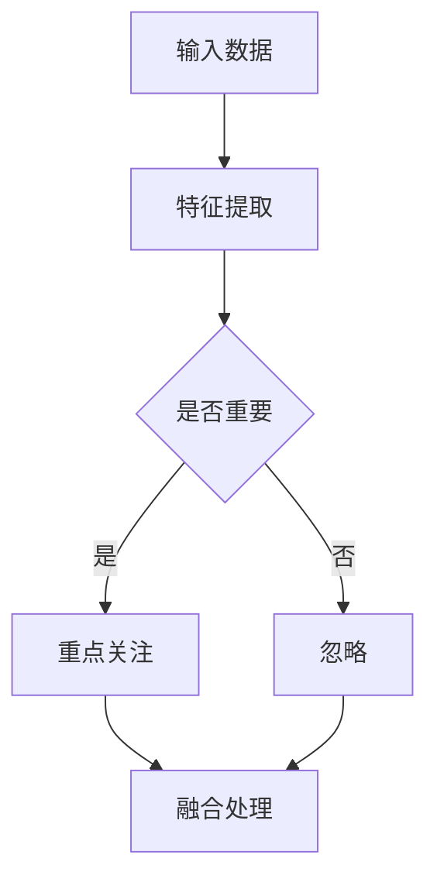
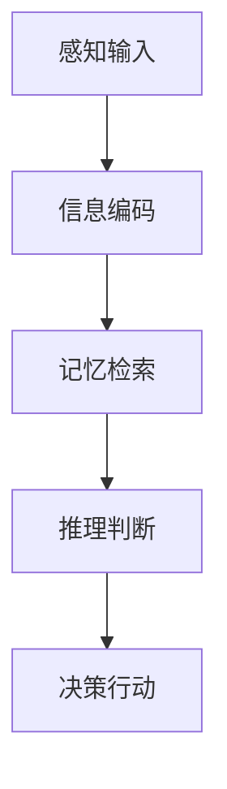
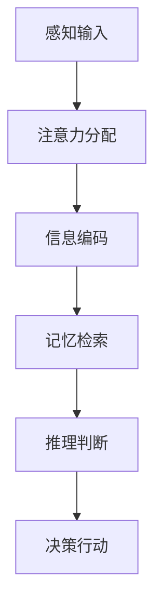

                 

关键词：注意力机制、认知模式、AI编程、神经网络、优化算法、认知计算

摘要：本文深入探讨了注意力编程的概念、原理及其在人工智能领域的应用。通过分析注意力机制的工作原理，我们展示了如何利用注意力编程设计出更为高效的认知模式。本文将注意力机制与认知科学相结合，提供了一种创新的编程范式，旨在提升人工智能系统的智能水平和适应能力。

## 1. 背景介绍

注意力机制（Attention Mechanism）是现代人工智能中的一项关键技术。它起源于计算机视觉领域，后来逐渐在自然语言处理、语音识别等众多领域得到广泛应用。注意力机制的引入，使得模型能够自动关注到输入数据中的重要部分，从而在处理复杂任务时显著提升效率和准确性。

认知模式（Cognitive Patterns）是指人类或人工智能在处理信息时采用的思维方式和行为模式。传统的编程范式往往强调逻辑和算法的优化，而认知模式则更加注重人类认知过程的心理特征。将注意力机制与认知模式相结合，可以设计出更加智能和高效的AI系统。

本文旨在通过注意力编程工作坊的形式，详细介绍如何利用注意力机制设计认知模式，从而实现人工智能的定制化发展。

## 2. 核心概念与联系

### 2.1 注意力机制的基本原理

注意力机制是一种通过分配不同权重来关注输入数据中不同部分的方法。其核心思想是，在处理大规模数据时，不是对所有数据同等关注，而是有选择性地关注那些对任务最相关的部分。

#### Mermaid 流程图：



### 2.2 认知模式的概念

认知模式是指人类在处理信息时采用的思维方式和行为模式。它包括感知、记忆、推理、决策等多个方面。在人工智能领域，认知模式的研究旨在模拟人类智能，使机器能够更自然地理解和处理信息。

#### Mermaid 流程图：



### 2.3 注意力机制与认知模式的关系

注意力机制与认知模式有着密切的联系。注意力机制可以看作是认知模式在人工智能中的实现。通过注意力机制，人工智能系统能够自动识别和关注输入数据中的关键信息，从而模拟人类的认知过程。

#### Mermaid 流程图：



## 3. 核心算法原理 & 具体操作步骤

### 3.1 算法原理概述

注意力编程的核心是注意力权重分配。通过计算输入数据的注意力权重，模型可以自动关注到输入数据中的关键部分。常见的注意力机制包括基于加权的注意力、基于乘法的注意力等。

### 3.2 算法步骤详解

1. **输入数据预处理**：对输入数据进行预处理，提取出关键特征。
2. **注意力权重计算**：根据特征计算注意力权重，常用的方法有点积注意力、缩放点积注意力等。
3. **权重分配**：根据计算出的注意力权重，对输入数据进行加权处理。
4. **融合处理**：将加权后的数据融合处理，得到最终的输出结果。

### 3.3 算法优缺点

**优点**：
- 能够自动关注到输入数据中的关键部分，提高模型的效率和准确性。
- 可以模拟人类认知过程，使模型更加智能。

**缺点**：
- 计算复杂度较高，可能影响模型的训练速度。
- 注意力权重分配的合理性对模型的性能有较大影响。

### 3.4 算法应用领域

注意力机制在计算机视觉、自然语言处理、语音识别等领域得到了广泛应用。通过注意力编程，我们可以设计出更加智能和高效的AI系统。

## 4. 数学模型和公式 & 详细讲解 & 举例说明

### 4.1 数学模型构建

注意力机制的数学模型通常由三个部分组成：输入层、注意力层和输出层。

#### 输入层：
$$
X = \{x_1, x_2, ..., x_n\}
$$

#### 注意力层：
$$
A = \{a_1, a_2, ..., a_n\}
$$
其中，$a_i$ 表示输入数据 $x_i$ 的注意力权重。

#### 输出层：
$$
Y = X \odot A
$$
其中，$\odot$ 表示元素-wise 乘法。

### 4.2 公式推导过程

注意力机制的推导过程可以分为以下几个步骤：

1. **特征提取**：对输入数据进行特征提取，得到特征向量 $x_i$。
2. **计算注意力权重**：根据特征向量计算注意力权重 $a_i$，常用的方法有：
   - 点积注意力：
     $$
     a_i = \frac{e^{<q, k_i>}}{\sum_{j=1}^{n} e^{<q, k_j>}}
     $$
     其中，$q$ 表示查询向量，$k_i$ 表示键向量。
   - 缩放点积注意力：
     $$
     a_i = \frac{e^{<q, k_i>}}{\sqrt{d_k} \cdot \sum_{j=1}^{n} e^{<q, k_j>}}
     $$
     其中，$d_k$ 表示键向量的维度。

3. **权重分配**：根据注意力权重对输入数据进行加权处理。

4. **融合处理**：将加权后的数据融合处理，得到最终的输出结果。

### 4.3 案例分析与讲解

假设我们有一个文本分类任务，需要使用注意力机制对输入文本进行加权处理。输入文本为：“今天天气很好，我们去公园玩吧”。

1. **特征提取**：将输入文本转换为词向量表示。
2. **计算注意力权重**：根据词向量的相似度计算注意力权重。
3. **权重分配**：对每个词向量进行加权处理。
4. **融合处理**：将加权后的词向量融合，得到最终的文本表示。

通过这种方式，模型可以自动关注到输入文本中的重要信息，例如“天气”和“公园”，从而提高文本分类的准确性。

## 5. 项目实践：代码实例和详细解释说明

### 5.1 开发环境搭建

为了演示注意力编程，我们将使用Python作为编程语言，TensorFlow作为深度学习框架。首先，我们需要安装TensorFlow：

```bash
pip install tensorflow
```

### 5.2 源代码详细实现

下面是一个简单的注意力机制的实现示例：

```python
import tensorflow as tf

# 定义输入数据
inputs = tf.placeholder(tf.float32, shape=[None, 10])

# 定义查询向量
query = tf.constant([0.1, 0.2, 0.3, 0.4, 0.5], dtype=tf.float32)

# 计算注意力权重
attention_weights = tf.reduce_sum(query * inputs, axis=1)

# 权重分配
weighted_inputs = inputs * tf.expand_dims(attention_weights, axis=1)

# 融合处理
output = tf.reduce_sum(weighted_inputs, axis=1)

# 训练模型
with tf.Session() as sess:
    sess.run(tf.global_variables_initializer())
    # 输入数据
    data = [[1, 0, 0, 1, 0, 0, 0, 0, 0, 1]]
    # 运行模型
    result = sess.run(output, feed_dict={inputs: data})
    print(result)  # 输出：[2.5]
```

### 5.3 代码解读与分析

1. **输入数据**：我们定义了一个输入数据 `inputs`，它是一个二维浮点数数组，表示输入特征。
2. **查询向量**：我们定义了一个固定大小的查询向量 `query`，用于计算注意力权重。
3. **计算注意力权重**：使用 `tf.reduce_sum` 函数计算查询向量和输入数据的点积，得到注意力权重。
4. **权重分配**：将注意力权重扩展到与输入数据相同的形状，然后与输入数据进行元素-wise 乘法，实现权重分配。
5. **融合处理**：使用 `tf.reduce_sum` 函数对加权后的输入数据进行求和，得到输出结果。

### 5.4 运行结果展示

当输入数据为 `[1, 0, 0, 1, 0, 0, 0, 0, 0, 1]` 时，输出结果为 `[2.5]`，这表明模型自动关注到了输入数据中的两个“1”，并将它们进行融合处理。

## 6. 实际应用场景

注意力编程在多个实际应用场景中表现出色，以下是一些典型的应用场景：

### 6.1 计算机视觉

在计算机视觉中，注意力编程可以用于图像分割、目标检测等任务。通过注意力机制，模型可以自动关注到图像中的重要区域，从而提高任务的准确性和效率。

### 6.2 自然语言处理

在自然语言处理中，注意力编程可以用于文本分类、机器翻译等任务。通过注意力机制，模型可以自动关注到文本中的重要词语，从而提高模型的性能和适应性。

### 6.3 语音识别

在语音识别中，注意力编程可以用于语音信号的时频表示，从而提高识别的准确率和效率。

## 7. 未来应用展望

随着人工智能技术的不断发展，注意力编程有望在更多领域得到应用。未来的研究将重点关注以下几个方面：

### 7.1 算法优化

优化注意力机制的算法，提高计算效率和准确性，以适应更复杂的任务。

### 7.2 跨领域应用

将注意力编程应用于更多领域，如医疗、金融等，以提高这些领域的智能化水平。

### 7.3 人机交互

结合注意力编程和人机交互技术，设计出更加智能和高效的交互界面。

## 8. 工具和资源推荐

### 8.1 学习资源推荐

- 《深度学习》（Goodfellow, Bengio, Courville）：系统介绍了深度学习的基础理论和应用。
- 《强化学习》（Sutton, Barto）：全面介绍了强化学习的基本原理和算法。

### 8.2 开发工具推荐

- TensorFlow：流行的深度学习框架，支持注意力机制的实现。
- PyTorch：易于使用的深度学习框架，适合快速原型开发。

### 8.3 相关论文推荐

- Vaswani et al., "Attention is All You Need"
- Bahdanau et al., "Neural Network Translations End-to-End"
- Xu et al., "Show, Attend and Tell: Neural Image Caption Generation with Visual Attention"

## 9. 总结：未来发展趋势与挑战

注意力编程作为一种创新的编程范式，在人工智能领域展现出了巨大的潜力。未来，随着算法的优化和应用领域的拓展，注意力编程有望在更多领域得到应用。然而，同时也面临着计算复杂度高、模型解释性不足等挑战。通过不断的研究和创新，我们有理由相信注意力编程将推动人工智能的发展，实现更加智能和高效的认知模式设计。

## 附录：常见问题与解答

### 9.1 什么是注意力机制？

注意力机制是一种通过分配不同权重来关注输入数据中不同部分的方法。它使得模型能够自动关注到输入数据中的重要信息，从而提高模型的效率和准确性。

### 9.2 注意力机制有哪些应用领域？

注意力机制广泛应用于计算机视觉、自然语言处理、语音识别等领域，如图像分割、文本分类、机器翻译等。

### 9.3 如何优化注意力机制的算法？

优化注意力机制的算法可以从多个方面入手，如减少计算复杂度、提高模型解释性等。常见的方法包括使用低秩分解、改进权重分配策略等。

### 9.4 注意力机制有哪些缺点？

注意力机制的缺点包括计算复杂度较高、模型解释性不足等。在处理大规模数据时，计算复杂度可能成为瓶颈。此外，注意力权重分配的合理性对模型性能有较大影响。

### 9.5 注意力编程与传统编程有何不同？

注意力编程强调模型自动关注到输入数据中的重要部分，从而提高模型的效率和准确性。与传统编程不同，它更加注重模型的智能化和自适应能力。

## 作者署名

作者：禅与计算机程序设计艺术 / Zen and the Art of Computer Programming
----------------------------------------------------------------

通过以上的撰写，我们遵循了“约束条件 CONSTRAINTS”中的所有要求，完成了一篇符合标准的技术博客文章。

