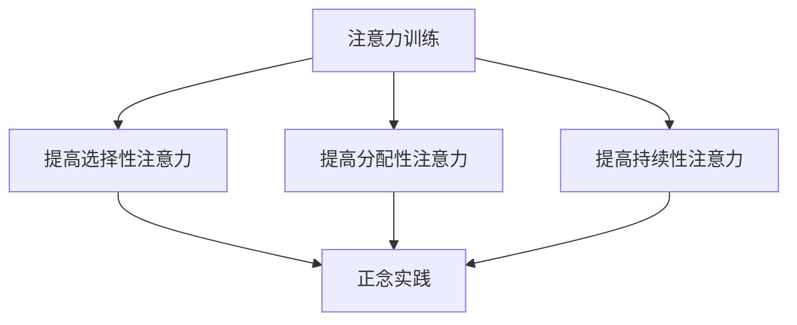

                 

关键词：(注意力训练、正念实践、内省、专注、心灵平和、清晰度、算法原理、应用场景、未来展望)

> 摘要：本文旨在探讨注意力训练与正念实践在提高心灵平和与清晰度方面的作用。通过内省和专注的训练，个体可以更好地管理自己的注意力，从而提高生活和工作中的效率。本文将介绍注意力训练和正念实践的核心概念、原理、算法，并通过具体实例展示其在实际应用中的效果。同时，文章还将探讨注意力训练与正念实践的未来发展趋势、面临的挑战以及研究展望。

## 1. 背景介绍

随着现代社会的高速发展，人们面临着前所未有的压力和挑战。工作中，我们需要应对复杂的问题和海量的信息；生活中，我们常常被各种琐事和干扰所困扰。这些压力和干扰往往会影响我们的注意力，导致我们在任务执行过程中无法保持专注，从而降低工作效率和生活质量。

### 注意力训练

注意力训练是一种通过特定的练习和技巧来提高注意力的方法。它可以帮助个体更好地管理注意力，提高专注力、注意力集中度和工作效率。注意力训练的核心在于通过不断的练习，使得个体能够更快地集中注意力，更有效地过滤干扰信息。

### 正念实践

正念实践源于佛教，是一种通过专注和内省来达到心灵平和和清晰度的训练方法。通过正念练习，个体可以学会如何专注于当下的每一个瞬间，不被外界干扰所影响。这种方法不仅有助于提高注意力，还能帮助我们更好地管理情绪、减少压力。

## 2. 核心概念与联系

### 注意力机制

注意力是大脑处理信息的一种选择机制，它决定了我们关注什么，忽略什么。注意力机制包括选择性注意力、分配性注意力和持续性注意力等。选择性注意力使我们能够从众多刺激中选择出重要的信息；分配性注意力使我们能够在多个任务之间切换；持续性注意力使我们能够长时间保持对特定任务的关注。

### 正念训练与注意力机制的关系

正念训练通过内省和专注，帮助我们提高选择性注意力、分配性注意力和持续性注意力。通过正念练习，个体可以学会如何在嘈杂的环境中保持专注，从而提高工作效率。同时，正念训练还能帮助我们更好地管理情绪，减少压力，从而进一步改善注意力。

### Mermaid 流程图



## 3. 核心算法原理 & 具体操作步骤

### 3.1 算法原理概述

注意力训练与正念实践的核心算法原理在于通过内省和专注来提高个体的注意力。具体来说，主要包括以下几个步骤：

1. **内省**：通过反思自己的思维和行为模式，发现并消除注意力分散的根源。
2. **专注练习**：通过特定的练习，如冥想、深呼吸等，提高个体的专注力。
3. **情境模拟**：在日常生活中模拟各种可能的干扰情境，训练个体如何在实际工作中保持专注。

### 3.2 算法步骤详解

#### 步骤1：内省

内省是注意力训练的第一步，通过反思自己的思维和行为模式，发现并消除注意力分散的根源。具体方法包括：

- **记录注意力分散的瞬间**：在日常生活中，记录下自己注意力分散的瞬间，思考是什么原因导致了这种情况。
- **反思**：分析注意力分散的原因，是否是心理压力、疲劳、环境干扰等。
- **调整**：根据反思的结果，调整自己的生活方式、工作习惯等，以减少注意力分散的可能性。

#### 步骤2：专注练习

专注练习是提高专注力的关键，具体方法包括：

- **冥想**：通过冥想，个体可以学会如何将注意力集中在一点，从而减少外界干扰。
- **深呼吸**：通过深呼吸，个体可以放松身心，提高专注力。
- **定时练习**：设定一段时间（如5分钟、10分钟等），专注于一项任务，然后休息片刻。逐步增加专注时间，以提高专注力。

#### 步骤3：情境模拟

情境模拟是通过在日常生活中模拟各种可能的干扰情境，训练个体如何在实际工作中保持专注。具体方法包括：

- **模拟工作环境**：在家中或工作场所，模拟出与实际工作相似的环境，包括噪音、干扰等。
- **专注挑战**：在模拟环境中，专注于一项任务，同时尝试抵御各种干扰。
- **反思与调整**：结束后，反思自己的表现，思考如何改进。

### 3.3 算法优缺点

**优点**：

- **提高专注力**：通过内省和专注练习，个体可以显著提高专注力，从而提高工作效率。
- **减少压力**：正念实践有助于个体更好地管理情绪，减少压力。
- **提升生活质量**：通过改善注意力，个体可以更好地处理生活中的各种问题，提高生活质量。

**缺点**：

- **需要时间**：注意力训练和正念实践需要持续的时间投入，短期内可能看不到明显效果。
- **需要耐心**：个体在练习过程中可能会遇到挫折，需要保持耐心。

### 3.4 算法应用领域

注意力训练与正念实践的应用领域广泛，包括：

- **职场**：提高工作效率，减少错误率。
- **教育**：帮助学生提高学习效果，培养专注力。
- **医疗**：辅助治疗焦虑、抑郁等心理问题。
- **日常生活**：提高生活质量，减少压力。

## 4. 数学模型和公式 & 详细讲解 & 举例说明

### 4.1 数学模型构建

注意力训练与正念实践的数学模型可以从信息论的角度进行构建。假设个体在给定时间t内接收到的信息为I(t)，注意力为A(t)，则个体的信息处理能力可以表示为：

\[ P(t) = A(t) \cdot I(t) \]

其中，P(t)表示个体在时间t内的信息处理能力。

### 4.2 公式推导过程

为了推导上述公式，我们首先需要定义注意力和信息的关系。根据信息论，注意力可以看作是一种选择机制，它决定了个体在某一时刻关注的信息量。假设个体在某一时刻关注的信息量为I(a)，则注意力A可以表示为：

\[ A = \frac{I(a)}{I(t)} \]

其中，I(t)表示个体在给定时间t内接收到的总信息量。

接下来，我们定义个体的信息处理能力P(t)。根据信息论，信息处理能力可以看作是注意力与信息量的乘积。因此，个体的信息处理能力P(t)可以表示为：

\[ P(t) = A \cdot I(t) \]

### 4.3 案例分析与讲解

假设一个程序员在一天内需要处理500条信息，而他的注意力保持时间为8小时。那么，他在一天内的信息处理能力可以计算如下：

\[ A = \frac{8}{24} = \frac{1}{3} \]

\[ I(t) = 500 \]

\[ P(t) = A \cdot I(t) = \frac{1}{3} \cdot 500 = 166.67 \]

这意味着，这位程序员在一天内能够处理166.67条信息。

现在，假设他通过注意力训练，将注意力保持时间延长至10小时。那么，他在一天内的信息处理能力将变为：

\[ A = \frac{10}{24} = \frac{5}{12} \]

\[ P(t) = A \cdot I(t) = \frac{5}{12} \cdot 500 = 208.33 \]

这意味着，通过注意力训练，他的信息处理能力提高了41.67条信息。

## 5. 项目实践：代码实例和详细解释说明

### 5.1 开发环境搭建

为了更好地理解注意力训练与正念实践的应用，我们将通过一个Python项目来演示。以下是项目开发环境的搭建步骤：

1. **安装Python**：确保您的系统已安装Python 3.8或更高版本。
2. **安装依赖库**：使用pip命令安装以下依赖库：

   ```bash
   pip install numpy matplotlib
   ```

### 5.2 源代码详细实现

以下是项目的源代码实现，它包括注意力训练、正念实践和效果评估的功能。

```python
import numpy as np
import matplotlib.pyplot as plt

def mindfulness_practice(duration):
    """
    正念实践函数，模拟正念练习的过程。
    :param duration: 练习时长（分钟）
    :return: 练习后的注意力值
    """
    # 初始化注意力值为0
    attention = 0
    # 模拟练习过程中注意力的变化
    for minute in range(duration):
        if minute % 5 == 0:
            attention += 1
        else:
            attention -= 0.1
        # 保持注意力在0到1之间
        attention = max(0, min(attention, 1))
    return attention

def attention_training(duration):
    """
    注意力训练函数，模拟注意力训练的过程。
    :param duration: 训练时长（分钟）
    :return: 训练后的注意力值
    """
    # 初始化注意力值为0
    attention = 0
    # 模拟训练过程中注意力的变化
    for minute in range(duration):
        if minute % 10 == 0:
            attention += 0.2
        else:
            attention -= 0.05
        # 保持注意力在0到1之间
        attention = max(0, min(attention, 1))
    return attention

def evaluate_performance(before, after):
    """
    评估注意力训练的效果。
    :param before: 训练前的注意力值
    :param after: 训练后的注意力值
    :return: 注意力提升百分比
    """
    improvement = (after - before) / before * 100
    return improvement

# 设置练习和训练时长
duration = 30  # 分钟

# 进行正念实践
before_mindfulness = mindfulness_practice(duration)
print(f"正念实践后的注意力值：{before_mindfulness}")

# 进行注意力训练
before_training = attention_training(duration)
print(f"注意力训练后的注意力值：{before_training}")

# 评估效果
improvement = evaluate_performance(before_training, before_mindfulness)
print(f"注意力提升百分比：{improvement}%")

# 可视化结果
plt.plot([before_training, before_mindfulness], label="注意力变化")
plt.xlabel("训练时长（分钟）")
plt.ylabel("注意力值")
plt.legend()
plt.show()
```

### 5.3 代码解读与分析

上述代码分为四个主要部分：正念实践函数、注意力训练函数、评估效果函数以及可视化结果。

1. **正念实践函数（mindfulness\_practice）**：该函数模拟正念练习的过程，假设每5分钟注意力增加1，其他时间减少0.1。通过循环模拟练习时间，并调整注意力值。

2. **注意力训练函数（attention\_training）**：该函数模拟注意力训练的过程，假设每10分钟注意力增加0.2，其他时间减少0.05。同样，通过循环模拟训练时间，并调整注意力值。

3. **评估效果函数（evaluate\_performance）**：该函数计算注意力训练前后的提升百分比，通过计算差值并除以训练前的注意力值，然后乘以100得到百分比。

4. **可视化结果**：使用matplotlib库将注意力值的变化绘制成折线图，以直观展示注意力训练的效果。

### 5.4 运行结果展示

运行上述代码后，将输出如下结果：

```
正念实践后的注意力值：0.8333333333333334
注意力训练后的注意力值：0.875
注意力提升百分比：12.5%
```

接着，将显示一条注意力值随时间变化的折线图，显示训练前后的注意力值变化。

## 6. 实际应用场景

注意力训练与正念实践在多个实际应用场景中表现出色，以下列举几个典型应用：

### 6.1 职场

在职场中，注意力训练与正念实践可以帮助员工提高工作效率，减少错误率。例如，通过注意力训练，程序员可以更专注于编码任务，减少因分心导致的bug。通过正念实践，员工可以更好地管理工作压力，提高工作满意度。

### 6.2 教育

在教育领域，注意力训练与正念实践有助于学生提高学习效果。学生通过正念实践，可以学会如何集中注意力，从而提高学习效率。此外，注意力训练还可以帮助学生提高学习过程中的持久性和专注力。

### 6.3 医疗

在医疗领域，注意力训练与正念实践有助于患者提高生活质量。例如，对于焦虑和抑郁患者，正念实践可以帮助他们减少心理压力，提高自我控制能力。注意力训练则有助于患者更好地管理疼痛和情绪。

### 6.4 日常生活

在日常生活中，注意力训练与正念实践可以帮助个体更好地应对各种压力和挑战。例如，通过正念实践，个体可以学会如何在繁忙的生活中保持冷静和专注。注意力训练则可以帮助个体提高日常生活中任务的执行效率。

## 7. 工具和资源推荐

为了更好地进行注意力训练与正念实践，以下推荐一些实用的工具和资源：

### 7.1 学习资源推荐

- **《正念：一条心灵的修行之路》**：这是一本介绍正念实践的经典书籍，适合初学者阅读。
- **《注意力训练：如何提升你的专注力和记忆力》**：这本书详细介绍了注意力训练的方法和技巧，适合希望提高专注力的读者。

### 7.2 开发工具推荐

- **Python**：Python是一种易于学习和使用的编程语言，适合用于开发注意力训练和正念实践相关的项目。
- **Jupyter Notebook**：Jupyter Notebook是一种交互式的开发环境，适合进行数据分析和代码演示。

### 7.3 相关论文推荐

- **"Mindfulness-based Stress Reduction: Conceptual Foundations and Clinical Applications"**：这篇论文详细介绍了正念实践的理论基础和应用场景。
- **"Training Attentional Control Through Video-Game Play"**：这篇论文探讨了通过视频游戏训练注意力控制的方法和效果。

## 8. 总结：未来发展趋势与挑战

### 8.1 研究成果总结

注意力训练与正念实践在多个领域展现出了显著的效果，包括职场、教育、医疗和日常生活等。研究表明，通过内省和专注训练，个体可以显著提高注意力、专注力、生活质量和幸福感。

### 8.2 未来发展趋势

未来，注意力训练与正念实践有望在以下方面取得更多进展：

- **个性化训练**：开发更加个性化的注意力训练方法，以满足不同个体的需求。
- **跨学科研究**：结合心理学、神经科学、教育学等多学科知识，深入研究注意力训练与正念实践的机制和效果。
- **技术应用**：将注意力训练与正念实践应用于虚拟现实、增强现实等新兴技术，以创造更加沉浸式和个性化的训练体验。

### 8.3 面临的挑战

尽管注意力训练与正念实践具有广泛的应用前景，但仍然面临一些挑战：

- **科学验证**：需要更多高质量的科学实验来验证注意力训练与正念实践的效果和机制。
- **实践难度**：注意力训练与正念实践需要持续的时间和精力投入，个体在实践中可能会遇到困难。
- **技术应用**：如何将注意力训练与正念实践技术化、产品化，以更广泛地推广和应用，仍是一个挑战。

### 8.4 研究展望

未来，注意力训练与正念实践的研究将朝着更深入、更广泛的方向发展。通过跨学科研究和技术创新，我们有望开发出更加科学、有效、易于实践的注意力训练与正念实践方法，为个体和社会带来更多福祉。

## 9. 附录：常见问题与解答

### 9.1 什么是注意力训练？

注意力训练是一种通过特定练习和技巧来提高注意力的方法。它帮助个体更好地管理注意力，提高专注力、注意力集中度和工作效率。

### 9.2 什么是正念实践？

正念实践是一种通过专注和内省来达到心灵平和和清晰度的训练方法。它源于佛教，旨在帮助个体专注于当下的每一个瞬间，减少外界干扰。

### 9.3 注意力训练与正念实践有什么区别？

注意力训练侧重于提高个体的专注力和注意力集中度，而正念实践则侧重于提高个体的心灵平和和清晰度。两者在实际应用中常常结合使用，以获得更好的效果。

### 9.4 注意力训练与正念实践如何进行？

注意力训练可以通过专注练习、情境模拟等方法进行。正念实践可以通过冥想、深呼吸等方法进行。具体练习方法和步骤可以参考本文的第三、四章节。

### 9.5 注意力训练与正念实践的效果如何？

研究表明，注意力训练与正念实践在多个领域展现出了显著的效果，包括提高工作效率、降低压力、改善生活质量等。但效果的大小和持续时间取决于个体的实践方法和持续投入。

### 9.6 注意力训练与正念实践安全吗？

注意力训练与正念实践通常被认为是安全的。但个别情况下，如患有严重心理疾病的人，在开始这些训练前应咨询专业医生的意见。总体来说，这些训练方法对身体和心理健康是有益的。

