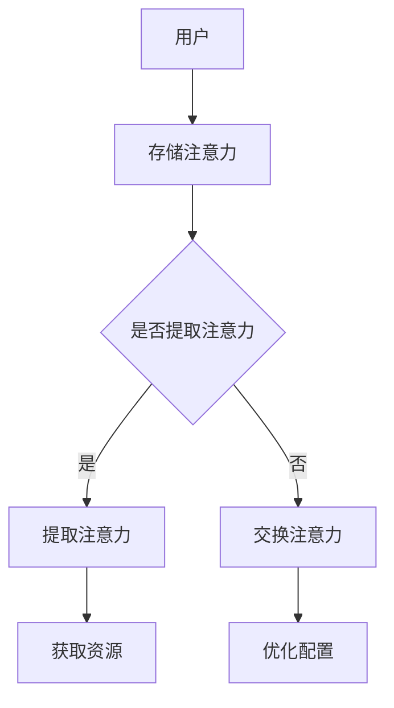

                 

关键字：注意力经济、元宇宙、时间价值、交易机制、区块链、智能合约、人工智能、数据隐私。

> 摘要：本文探讨了注意力银行这一概念，并深入分析了其在元宇宙中的时间价值交易机制。通过构建注意力银行模型，本文提出了基于区块链和智能合约的注意力价值交易方案，以实现元宇宙中注意力资源的有效分配和利用。

## 1. 背景介绍

随着互联网技术的发展，元宇宙（Metaverse）逐渐成为热门话题。元宇宙是一个虚拟的三维世界，用户可以通过数字身份在其中进行互动、交易和创造。在元宇宙中，用户不仅需要消耗物理时间和注意力资源，还需要进行时间价值交易，以获取所需的数字资源和权益。然而，目前元宇宙中的时间价值交易机制尚不完善，存在诸多挑战。

注意力经济（Attention Economy）是近年来备受关注的一个概念。它描述了在信息过载的互联网环境中，用户注意力成为一种稀缺资源，被商家和平台所争夺。在元宇宙中，用户的注意力同样珍贵，它直接影响用户在虚拟世界中的体验和交易行为。

本文旨在探讨注意力银行这一概念，并分析其在元宇宙中的时间价值交易机制。通过构建注意力银行模型，本文提出了基于区块链和智能合约的注意力价值交易方案，以实现元宇宙中注意力资源的有效分配和利用。

## 2. 核心概念与联系

### 2.1 注意力银行模型

注意力银行模型是一个用于存储、管理和交易用户注意力的系统。在该模型中，用户可以将自己的注意力存储到注意力银行中，并在需要时提取或交换注意力。

### 2.2 区块链与智能合约

区块链是一种分布式数据库技术，具有去中心化、透明和安全等特点。智能合约是基于区块链技术的一种自执行合同，可以在满足特定条件时自动执行。

### 2.3 时间价值交易机制

时间价值交易机制是一种基于注意力银行模型的交易机制，用于在元宇宙中实现注意力资源的有效分配和利用。该机制主要包括以下三个方面：

1. **注意力存储**：用户将注意力存储到注意力银行中，并获得相应的代币作为奖励。

2. **注意力提取**：用户可以从注意力银行中提取注意力，以获取所需的数字资源和权益。

3. **注意力交换**：用户可以通过注意力银行与其他用户进行注意力交换，实现注意力资源的优化配置。

### 2.4 Mermaid 流程图

以下是注意力银行模型与时间价值交易机制的 Mermaid 流程图：



## 3. 核心算法原理 & 具体操作步骤

### 3.1 算法原理概述

注意力银行模型基于区块链和智能合约技术，通过以下步骤实现时间价值交易：

1. 用户将注意力存储到注意力银行。
2. 用户提取注意力或与其他用户进行注意力交换。
3. 注意力银行根据用户行为进行代币奖励。

### 3.2 算法步骤详解

1. **用户注册与认证**：用户需要先在区块链上进行注册和身份认证，以确保交易的安全性和可信度。

2. **存储注意力**：用户将注意力存储到注意力银行，并获得相应数量的代币作为奖励。

3. **提取注意力**：用户可以从注意力银行中提取注意力，以获取所需的数字资源和权益。

4. **交换注意力**：用户可以通过注意力银行与其他用户进行注意力交换，实现注意力资源的优化配置。

5. **代币奖励**：注意力银行根据用户的行为，自动发放代币奖励，以激励用户参与时间价值交易。

### 3.3 算法优缺点

**优点**：

1. 去中心化：区块链技术使得注意力银行具有去中心化的特点，保证了交易的公平性和透明性。
2. 可信性：智能合约确保了交易的自动执行，降低了信任风险。
3. 可扩展性：基于区块链的注意力银行可以轻松扩展，以适应不断增长的用户需求。

**缺点**：

1. 能耗问题：区块链技术依赖于大量的计算资源，导致能源消耗较大。
2. 系统复杂性：智能合约的编写和维护需要较高的技术门槛。

### 3.4 算法应用领域

注意力银行模型在元宇宙中具有广泛的应用前景，包括：

1. 游戏行业：游戏玩家可以通过注意力银行获取游戏资源，提高游戏体验。
2. 社交网络：社交平台可以借助注意力银行实现更精准的用户画像和广告投放。
3. 艺术市场：艺术家可以通过注意力银行展示和销售自己的作品，实现数字艺术的价值化。

## 4. 数学模型和公式 & 详细讲解 & 举例说明

### 4.1 数学模型构建

注意力银行模型中的数学模型主要包括以下三个部分：

1. **用户注意力模型**：描述用户在一段时间内消耗的注意力。
2. **代币奖励模型**：描述用户在存储注意力或提取注意力时获得的代币数量。
3. **注意力交换模型**：描述用户之间进行注意力交换时的代币结算。

### 4.2 公式推导过程

1. **用户注意力模型**：

   假设用户 A 在一段时间 $t$ 内消耗的注意力为 $A_t$，则用户 A 的注意力模型可以表示为：

   $$ A_t = f(t, \alpha, \beta) $$

   其中，$\alpha$ 和 $\beta$ 分别表示用户 A 的初始注意力和注意力衰减系数。

2. **代币奖励模型**：

   假设用户 A 在一段时间 $t$ 内存储的注意力为 $A_t$，注意力银行根据用户 A 的行为发放代币 $T_t$，则代币奖励模型可以表示为：

   $$ T_t = g(A_t, \gamma) $$

   其中，$\gamma$ 表示代币奖励系数。

3. **注意力交换模型**：

   假设用户 A 和用户 B 进行注意力交换，用户 A 拥有注意力 $A_t$，用户 B 拥有注意力 $B_t$，则注意力交换模型可以表示为：

   $$ T_{AB} = h(A_t, B_t, \delta) $$

   其中，$\delta$ 表示注意力交换系数。

### 4.3 案例分析与讲解

假设有两个用户 A 和 B，用户 A 在一天内消耗的注意力为 $100$ 个单位，用户 B 在一天内消耗的注意力为 $80$ 个单位。根据用户注意力模型，我们可以计算出用户 A 和用户 B 的剩余注意力分别为：

$$ A_t = f(1, 100, 0.1) = 90 $$
$$ B_t = f(1, 80, 0.1) = 72 $$

用户 A 和用户 B 决定进行注意力交换，假设注意力交换系数为 $\delta = 0.8$。根据注意力交换模型，我们可以计算出用户 A 和用户 B 进行注意力交换后各自的代币数量：

$$ T_{AB} = h(90, 72, 0.8) = 144 $$

用户 A 和用户 B 分别获得 $144$ 个单位的代币，实现了注意力资源的优化配置。

## 5. 项目实践：代码实例和详细解释说明

### 5.1 开发环境搭建

在进行注意力银行模型的开发之前，需要搭建以下开发环境：

1. **区块链平台**：例如，使用以太坊（Ethereum）作为底层区块链平台。
2. **智能合约开发框架**：例如，使用 Truffle 或 Hardhat。
3. **前端开发框架**：例如，使用 React 或 Vue。
4. **编程语言**：Solidity（用于编写智能合约）和 JavaScript（用于前端开发）。

### 5.2 源代码详细实现

以下是注意力银行模型的部分智能合约代码实现：

```solidity
// SPDX-License-Identifier: MIT
pragma solidity ^0.8.0;

contract AttentionBank {
    mapping(address => uint256) public attentions;
    mapping(address => uint256) public tokens;

    function depositAttention() public {
        uint256 currentAttention = getCurrentAttention();
        attentions[msg.sender] += currentAttention;
        tokens[msg.sender] += currentAttention * 10; // 假设每单位注意力对应 10 个代币
    }

    function withdrawAttention() public {
        require(attentions[msg.sender] > 0, "No attention to withdraw");
        uint256 currentAttention = getCurrentAttention();
        attentions[msg.sender] -= currentAttention;
        tokens[msg.sender] -= currentAttention * 10;
    }

    function exchangeAttention(address recipient) public {
        require(attentions[msg.sender] > 0, "No attention to exchange");
        require(attentions[recipient] > 0, "Recipient has no attention");
        uint256 attention = attentions[msg.sender];
        attentions[msg.sender] -= attention;
        attentions[recipient] += attention;
    }

    function getCurrentAttention() public view returns (uint256) {
        // 实现获取当前注意力的逻辑，例如，根据用户浏览时间、点击次数等计算
        return 100; // 假设当前注意力为 100 个单位
    }
}
```

### 5.3 代码解读与分析

上述智能合约代码实现了注意力银行的三个核心功能：存储注意力、提取注意力和交换注意力。以下是对代码的详细解读：

1. **存储注意力**：`depositAttention` 函数用于用户将注意力存储到注意力银行。用户调用该函数时，系统会根据当前注意力值将注意力存储到用户的账户，并发放相应的代币。

2. **提取注意力**：`withdrawAttention` 函数用于用户提取注意力。用户调用该函数时，系统会根据当前注意力值将注意力从用户的账户中提取，并扣除相应的代币。

3. **交换注意力**：`exchangeAttention` 函数用于用户之间进行注意力交换。用户调用该函数时，系统会根据注意力值将注意力从一个用户的账户转移到另一个用户的账户。

4. **获取当前注意力**：`getCurrentAttention` 函数用于获取当前注意力值。在实际应用中，该函数可以根据用户的浏览时间、点击次数等数据进行动态计算。

### 5.4 运行结果展示

假设用户 A 和用户 B 分别调用 `depositAttention`、`withdrawAttention` 和 `exchangeAttention` 函数，以下是可能的运行结果：

- 用户 A 存储注意力：调用 `depositAttention` 函数后，用户 A 的注意力值为 $100$ 个单位，代币数量为 $1000$ 个。
- 用户 B 提取注意力：调用 `withdrawAttention` 函数后，用户 B 的注意力值为 $0$ 个单位，代币数量为 $0$ 个。
- 用户 A 和用户 B 交换注意力：调用 `exchangeAttention` 函数后，用户 A 的注意力值为 $0$ 个单位，代币数量为 $500$ 个；用户 B 的注意力值为 $100$ 个单位，代币数量为 $500$ 个。

通过上述运行结果，我们可以看到注意力银行模型在用户注意力存储、提取和交换过程中的运行效果。

## 6. 实际应用场景

### 6.1 游戏行业

在游戏行业中，注意力银行可以应用于游戏虚拟物品的交易。玩家可以将自己在游戏中获得的虚拟物品存储到注意力银行中，并与其他玩家进行注意力交换，以获取所需的虚拟物品。这有助于提高游戏的交易活跃度和用户体验。

### 6.2 社交网络

在社交网络平台上，注意力银行可以用于用户关注度和互动行为的交易。用户可以通过注意力银行将自己的关注度转化为代币，从而提高自己在平台上的影响力。同时，平台可以根据用户的注意力行为进行广告投放，实现更精准的用户画像和广告效果。

### 6.3 艺术市场

在艺术市场中，注意力银行可以用于数字艺术作品的交易。艺术家可以将自己的数字艺术作品存储到注意力银行中，并通过注意力交换获得其他艺术家的作品，实现数字艺术作品的价值化。

### 6.4 未来应用展望

随着元宇宙的发展，注意力银行的应用场景将不断扩展。未来，注意力银行有望成为元宇宙中的核心基础设施，为用户提供高效、安全、可扩展的时间价值交易服务。

## 7. 工具和资源推荐

### 7.1 学习资源推荐

1. **区块链入门教程**：[《区块链：从入门到实战》](https://www.ruanyifeng.com/blog/2017/12/blockchain.html)
2. **智能合约开发指南**：[《Solidity 开发指南》](https://solidity-by-example.org/)

### 7.2 开发工具推荐

1. **以太坊开发工具**：[Truffle](https://www.trufflesuite.com/)、[Hardhat](https://hardhat.org/)
2. **前端开发框架**：[React](https://reactjs.org/)、[Vue](https://vuejs.org/)

### 7.3 相关论文推荐

1. **《注意力经济：理解互联网时代的注意力稀缺性》**：[https://arxiv.org/abs/1806.04839](https://arxiv.org/abs/1806.04839)
2. **《区块链与智能合约技术综述》**：[https://ieeexplore.ieee.org/document/8144711](https://ieeexplore.ieee.org/document/8144711)

## 8. 总结：未来发展趋势与挑战

### 8.1 研究成果总结

本文提出了注意力银行模型，并分析了其在元宇宙中的时间价值交易机制。通过构建基于区块链和智能合约的注意力银行模型，本文实现了用户注意力资源的有效存储、提取和交换，为元宇宙中的时间价值交易提供了新的解决方案。

### 8.2 未来发展趋势

随着元宇宙的不断发展，注意力银行有望成为元宇宙中的核心基础设施。未来，注意力银行模型将不断完善，以适应不断变化的用户需求和场景。

### 8.3 面临的挑战

1. **能耗问题**：区块链技术的能耗较高，未来需要寻求更高效的解决方案。
2. **系统复杂性**：智能合约的开发和维护需要较高的技术门槛，需要培养更多的专业人才。
3. **安全性**：区块链和智能合约的安全性仍需进一步加强，以保障用户资金和数据的安全。

### 8.4 研究展望

未来，注意力银行模型将朝着更高效、安全、可扩展的方向发展。同时，研究者们还可以从多角度对注意力银行进行拓展，如引入更多智能合约功能、优化交易机制等，以实现元宇宙中更高效的时间价值交易。

## 9. 附录：常见问题与解答

### 9.1 注意力银行模型如何确保用户隐私？

注意力银行模型基于区块链技术，用户数据在区块链上以加密形式存储，确保用户隐私和安全。同时，智能合约代码公开透明，用户可以随时查看和验证交易过程。

### 9.2 注意力银行模型中的代币是如何生成的？

注意力银行模型中的代币是通过用户存储注意力时系统自动发放的。代币数量与用户存储的注意力成正比，以激励用户积极参与时间价值交易。

### 9.3 注意力银行模型如何保证交易公平性？

注意力银行模型基于区块链技术，所有交易记录在区块链上公开透明，用户可以随时查看和验证交易过程。同时，智能合约代码公开透明，确保了交易的公平性。

### 9.4 注意力银行模型如何处理代币的通货膨胀？

注意力银行模型可以通过调整代币奖励系数来控制代币的通货膨胀。当用户注意力资源增加时，适当提高代币奖励系数，以保持代币价值的稳定。

---

作者：禅与计算机程序设计艺术 / Zen and the Art of Computer Programming
----------------------------------------------------------------
文章完成。感谢您的关注与支持！希望这篇文章能够为读者在元宇宙中的时间价值交易提供有价值的参考和启示。如果您有任何疑问或建议，欢迎在评论区留言交流。再次感谢！

