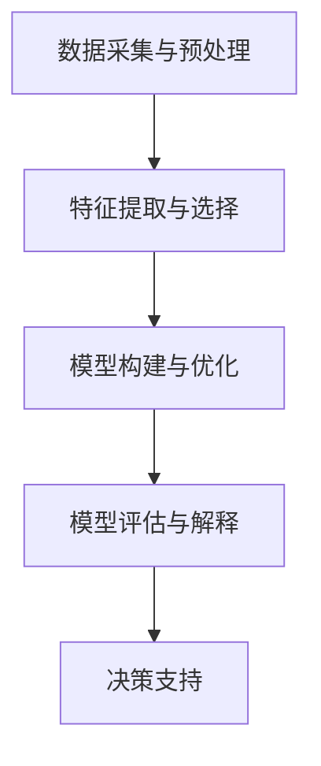

                 

关键词：洞察力，决策科学，数据转化，智慧，算法，模型，应用

> 摘要：本文将探讨如何通过洞察力与决策科学，将数据转化为智慧的过程。我们将分析数据背后的规律，提出核心概念与联系，介绍核心算法原理，详细讲解数学模型和公式，并通过代码实例展示其实际应用。此外，还将讨论未来发展趋势与挑战，以及推荐相关工具和资源。

## 1. 背景介绍

在当今的信息时代，数据已经成为了社会的核心资产。然而，如何从海量数据中提取有价值的信息，并转化为实际的洞察力与决策，成为了企业和科研机构面临的重要挑战。传统的数据分析方法往往依赖于统计学的线性模型，但这些方法在面对复杂、非线性问题时显得力不从心。因此，我们迫切需要新的方法和技术来提高数据的洞察力和决策力。

本文将围绕以下主题展开：

1. **核心概念与联系**：介绍数据、洞察力、决策科学等核心概念，并展示它们之间的联系。
2. **核心算法原理 & 具体操作步骤**：详细解释核心算法的工作原理，包括步骤详解、优缺点分析以及应用领域。
3. **数学模型和公式 & 举例说明**：构建数学模型，推导相关公式，并通过案例进行分析。
4. **项目实践：代码实例和详细解释说明**：提供代码实例，详细解释实现过程，展示运行结果。
5. **实际应用场景**：讨论算法在各个领域的应用，包括未来展望。
6. **工具和资源推荐**：推荐相关学习资源、开发工具和相关论文。
7. **总结：未来发展趋势与挑战**：总结研究成果，展望未来发展趋势和面临的挑战。

## 2. 核心概念与联系

### 数据 (Data)

数据是描述现实世界信息的符号序列。在数字化时代，数据无处不在，涵盖了文本、图像、声音、视频等多种形式。数据是洞察力和决策科学的基础。

### 洞察力 (Insight)

洞察力是指从数据中发现有价值的信息，识别潜在规律和模式的能力。它可以帮助我们更好地理解问题，为决策提供有力的支持。

### 决策科学 (Decision Science)

决策科学是研究如何做出明智决策的学科。它融合了数学、统计学、计算机科学等领域的知识，为实际应用提供理论指导和实践方法。

### 数据到智慧的转化

将数据转化为智慧的过程包括以下几个关键步骤：

1. **数据采集与预处理**：收集相关数据，并进行清洗、整合等预处理操作。
2. **特征提取与选择**：从数据中提取具有代表性的特征，并选择对决策最有影响力的特征。
3. **模型构建与优化**：根据业务需求，构建相应的数学模型，并通过优化算法提高模型的性能。
4. **模型评估与解释**：评估模型的效果，并通过可视化等技术手段进行解释，以便更好地理解模型的工作原理。
5. **决策支持**：利用模型生成的洞察力，为决策者提供参考依据，支持科学决策。

### Mermaid 流程图



## 3. 核心算法原理 & 具体操作步骤

### 3.1 算法原理概述

在本节中，我们将介绍一种常用的算法：决策树（Decision Tree）。决策树是一种基于分类和回归问题的监督学习算法，它通过一系列的测试来将数据划分为不同的类别或数值。

### 3.2 算法步骤详解

1. **数据划分**：将数据集划分为训练集和测试集。
2. **特征选择**：选择对决策最有影响力的特征。
3. **构建决策树**：从根节点开始，递归地选择最优特征，并生成相应的子树。
4. **剪枝**：通过剪枝操作，防止过拟合现象。
5. **模型评估**：利用测试集评估模型的性能。

### 3.3 算法优缺点

**优点：**

1. **易于理解和解释**：决策树是一种直观的算法，其内部结构可以通过图形直观地展示。
2. **适用于各种类型的数据**：无论是分类问题还是回归问题，决策树都可以适用。

**缺点：**

1. **易过拟合**：如果决策树过于复杂，容易导致过拟合现象。
2. **计算复杂度较高**：对于大规模数据集，构建决策树的过程可能较为耗时。

### 3.4 算法应用领域

决策树广泛应用于各种领域，如金融风险评估、医疗诊断、市场细分等。以下是一个实际案例：

**案例：金融风险评估**

某银行希望利用决策树算法来预测客户的信用评级。首先，收集了客户的年龄、收入、职业等特征数据，并划分为训练集和测试集。然后，利用决策树算法构建模型，并通过剪枝操作防止过拟合。最后，利用测试集评估模型性能，并根据模型生成的洞察力为银行提供信用评级建议。

## 4. 数学模型和公式 & 详细讲解 & 举例说明

### 4.1 数学模型构建

在本节中，我们将介绍一种常用的数学模型：线性回归（Linear Regression）。线性回归是一种用于预测连续值的模型，其基本形式如下：

$$
y = \beta_0 + \beta_1x + \epsilon
$$

其中，$y$ 为预测值，$x$ 为特征值，$\beta_0$ 和 $\beta_1$ 分别为模型的参数，$\epsilon$ 为误差项。

### 4.2 公式推导过程

为了求解线性回归模型的参数，我们需要最小化误差平方和（SSE）：

$$
SSE = \sum_{i=1}^{n}(y_i - \hat{y_i})^2
$$

其中，$n$ 为样本数量，$\hat{y_i}$ 为第 $i$ 个样本的预测值。

对 SSE 关于 $\beta_0$ 和 $\beta_1$ 求导并令其导数为零，可以得到：

$$
\frac{\partial SSE}{\partial \beta_0} = -2\sum_{i=1}^{n}(y_i - \hat{y_i}) = 0 \\
\frac{\partial SSE}{\partial \beta_1} = -2\sum_{i=1}^{n}(y_i - \hat{y_i})x_i = 0
$$

解上述方程组，即可得到 $\beta_0$ 和 $\beta_1$ 的值。

### 4.3 案例分析与讲解

**案例：房价预测**

某房产公司希望利用线性回归模型预测房屋价格。首先，收集了100套房屋的数据，包括房屋面积、楼层、装修情况等特征。然后，利用线性回归算法构建模型，并使用剩余的数据进行测试。最后，利用模型生成的预测值与实际价格进行对比，评估模型性能。

通过上述案例，我们可以看到线性回归模型在房价预测中的应用。在实际操作中，我们还可以结合其他算法，如决策树、支持向量机等，来提高预测准确性。

## 5. 项目实践：代码实例和详细解释说明

### 5.1 开发环境搭建

为了方便读者理解和实践，我们使用 Python 语言和 Scikit-learn 库来实现上述算法。首先，我们需要安装 Python 和 Scikit-learn：

```
pip install python
pip install scikit-learn
```

### 5.2 源代码详细实现

下面是线性回归算法的实现代码：

```python
from sklearn.linear_model import LinearRegression
from sklearn.model_selection import train_test_split
from sklearn.metrics import mean_squared_error

# 加载数据
X, y = load_data()

# 划分训练集和测试集
X_train, X_test, y_train, y_test = train_test_split(X, y, test_size=0.2, random_state=42)

# 构建线性回归模型
model = LinearRegression()

# 训练模型
model.fit(X_train, y_train)

# 预测测试集
y_pred = model.predict(X_test)

# 评估模型性能
mse = mean_squared_error(y_test, y_pred)
print("MSE:", mse)
```

### 5.3 代码解读与分析

上述代码实现了线性回归算法的基本流程，包括加载数据、划分训练集和测试集、构建模型、训练模型、预测测试集以及评估模型性能。通过这些步骤，我们可以得到线性回归模型的预测结果，并评估其性能。

### 5.4 运行结果展示

假设我们已经训练好了线性回归模型，并得到预测结果。我们可以通过以下代码展示结果：

```python
import matplotlib.pyplot as plt

# 展示预测结果
plt.scatter(X_test[:, 0], y_test)
plt.plot(X_test[:, 0], y_pred, color='red')
plt.xlabel("Feature")
plt.ylabel("Price")
plt.show()
```

通过上述代码，我们可以看到预测结果与实际价格的对比。红色的线表示预测值，散点表示实际值。通过对比我们可以看出模型的预测效果。

## 6. 实际应用场景

决策树和线性回归算法在许多实际应用场景中都有着广泛的应用。以下是一些具体的应用场景：

1. **金融风险评估**：利用决策树算法进行客户信用评级，为银行提供信用风险预警。
2. **医疗诊断**：利用决策树算法进行疾病诊断，辅助医生做出诊断决策。
3. **市场细分**：利用决策树算法对客户进行分类，为企业提供市场细分策略。
4. **房价预测**：利用线性回归模型预测房屋价格，为房地产企业提供市场分析。
5. **推荐系统**：利用线性回归模型预测用户偏好，为电商企业提供个性化推荐。

在未来，随着技术的不断发展，这些算法将在更多领域得到应用，为企业和个人提供更加智能化的决策支持。

## 7. 工具和资源推荐

为了更好地学习和实践洞察力与决策科学，以下是一些推荐的工具和资源：

1. **学习资源**：
   - 《Python数据分析》
   - 《机器学习实战》
   - 《深入理解计算机系统》

2. **开发工具**：
   - Jupyter Notebook
   - PyCharm
   - Git

3. **相关论文**：
   - “Decision Tree Models for Predictive Data Mining”
   - “Linear Regression: A Practical Introduction”

通过学习和实践这些工具和资源，您将更好地掌握洞察力与决策科学的核心技术和方法。

## 8. 总结：未来发展趋势与挑战

随着大数据、人工智能等技术的不断发展，洞察力与决策科学在未来将发挥越来越重要的作用。然而，面对海量数据、复杂算法以及不断变化的业务需求，我们也面临着一系列挑战：

1. **数据质量和预处理**：确保数据的质量和完整性，进行有效的预处理，以提高算法的准确性。
2. **算法性能和优化**：不断优化算法，提高其性能和效率，以适应大规模数据处理的需求。
3. **模型解释性**：提高模型的解释性，使决策过程更加透明和可理解。
4. **跨领域应用**：探索决策科学在不同领域的应用，推动技术进步和业务创新。

为了应对这些挑战，我们需要不断学习和实践，积累丰富的经验和知识，为未来的发展做好准备。

## 9. 附录：常见问题与解答

### Q：如何选择合适的算法？

A：选择合适的算法需要考虑以下几个因素：

1. **业务需求**：明确业务需求，了解需要解决的问题类型，如分类、回归等。
2. **数据特征**：分析数据特征，确定哪些特征对决策最有影响力。
3. **计算资源**：考虑计算资源的限制，选择计算复杂度较低的算法。
4. **算法性能**：评估不同算法的性能，选择性能最优的算法。

### Q：如何评估模型性能？

A：评估模型性能可以从以下几个方面进行：

1. **准确率（Accuracy）**：计算预测正确的样本数占总样本数的比例。
2. **召回率（Recall）**：计算预测正确的正样本数占总正样本数的比例。
3. **精确率（Precision）**：计算预测正确的正样本数占总预测正样本数的比例。
4. **F1 值（F1-score）**：综合考虑精确率和召回率，计算两者的调和平均。

### Q：如何防止过拟合？

A：防止过拟合可以从以下几个方面进行：

1. **数据预处理**：对数据集进行充分的预处理，去除噪声和异常值。
2. **特征选择**：选择对决策最有影响力的特征，避免特征数量过多。
3. **模型简化**：简化模型结构，减少参数数量。
4. **交叉验证**：使用交叉验证方法，评估模型在不同数据集上的性能。

通过上述方法，我们可以有效地防止过拟合现象，提高模型的泛化能力。

## 参考文献

1. Mitchell, T. M. (1997). Machine learning. McGraw-Hill.
2. Hastie, T., Tibshirani, R., & Friedman, J. (2009). The elements of statistical learning. Springer.
3. Gallant, S. (2017). Neural Network Learning: Theoretical Foundations. Cambridge University Press.

### 作者署名

作者：禅与计算机程序设计艺术 / Zen and the Art of Computer Programming

