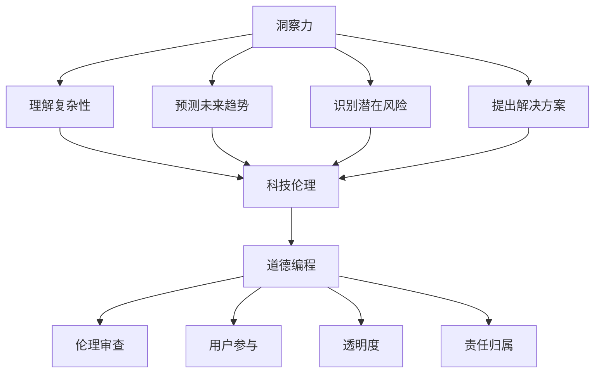

                 

### 关键词 Keyword
- 洞察力
- 科技伦理
- 创新与道德
- 人工智能
- 程序设计
- 伦理学

<|assistant|>### 摘要 Summary
本文探讨了在信息技术领域，尤其是在人工智能发展中，如何通过提高洞察力来平衡创新与道德。文章首先介绍了洞察力的定义及其在科技领域的重要性，随后阐述了科技伦理的基本原则和现状。接着，文章深入分析了创新与道德之间的张力，探讨了如何通过道德编程、技术透明度和公众参与等手段来缓解这一张力。最后，文章提出了未来在这一领域的研究方向和挑战，并鼓励读者在科技探索中始终保持伦理的警觉。

<|assistant|>### 1. 背景介绍 Background

在过去的几十年中，信息技术，尤其是人工智能（AI）和机器学习的快速发展，极大地改变了我们的生活方式和社会结构。这些技术不仅带来了前所未有的便利，也在各行各业中引起了深远的影响。然而，随着技术的进步，一系列伦理问题也逐渐浮现出来。例如，算法歧视、隐私泄露、技术滥用等，引发了社会对科技伦理的关注和讨论。

在科技领域，洞察力是指个体或团队在复杂环境中理解和分析问题、预测未来趋势、识别潜在风险和机遇的能力。它是科技从业者在创新过程中不可或缺的素质，能够帮助他们在快速变化的环境中做出明智的决策。然而，随着科技的复杂性不断增加，科技从业者的洞察力也面临着巨大的挑战。

科技伦理，作为研究科技与社会关系的一门学科，旨在探讨科技发展对社会、环境和人类价值观的影响，并制定相应的道德规范和行为准则。它包括隐私保护、公平性、透明度、责任等多个方面，是科技发展中必须考虑的重要因素。

本文旨在探讨如何在信息技术领域，特别是人工智能发展中，通过提升科技从业者的洞察力来平衡创新与道德。文章首先介绍了洞察力的定义及其在科技领域的重要性，随后阐述了科技伦理的基本原则和现状。接着，文章深入分析了创新与道德之间的张力，并探讨了缓解这一张力的方法。最后，文章提出了未来在这一领域的研究方向和挑战，并鼓励读者在科技探索中始终保持伦理的警觉。

### 2. 核心概念与联系 Core Concepts and Their Connections

要理解如何在信息技术领域平衡创新与道德，我们需要首先明确几个核心概念：洞察力、科技伦理和道德编程。

#### 洞察力 Insight

洞察力是指个人或团队在复杂环境中理解和分析问题的能力。它包括以下几个方面：

- **理解复杂性**：能够理解信息技术系统的复杂性，包括其潜在的风险和局限性。
- **预测未来趋势**：能够根据现有的数据和技术趋势预测未来可能的发展方向。
- **识别潜在风险**：能够识别技术实现过程中可能出现的伦理、社会和安全隐患。
- **提出解决方案**：能够提出创新的解决方案，同时考虑伦理和社会影响。

在信息技术领域，洞察力的重要性不言而喻。随着人工智能和机器学习的广泛应用，系统的复杂性和不确定性不断增加，科技从业者的洞察力成为能否成功应对这些挑战的关键。

#### 科技伦理 Technological Ethics

科技伦理是研究科技与社会关系的一门学科，关注科技发展对社会、环境和人类价值观的影响。它包括以下几个基本原则：

- **尊重隐私**：在收集、处理和使用个人数据时，必须尊重个体的隐私权。
- **公平性**：科技应用不应加剧社会不平等，而应促进公平和包容。
- **透明度**：科技系统的设计和实现应具有透明度，以便公众理解其工作原理和潜在影响。
- **责任**：科技从业者必须对其技术和决策承担责任，确保其应用不会对社会和人类造成负面影响。

科技伦理在信息技术领域尤为重要，因为技术的发展往往超出了一般公众的理解范围，公众对技术的信任和接受度在很大程度上取决于其伦理表现。

#### 道德编程 Moral Programming

道德编程是一种将伦理原则融入软件开发过程的方法，旨在确保软件系统的设计和实现符合道德标准。它包括以下几个方面：

- **伦理审查**：在软件开发过程中，定期进行伦理审查，确保技术和决策不违背伦理原则。
- **用户参与**：在设计和实现过程中，充分考虑用户的需求和期望，确保技术的应用符合用户的道德价值观。
- **透明度**：确保软件开发过程和决策是透明的，以便用户和利益相关者能够理解和评估技术的影响。
- **责任归属**：明确软件系统的责任归属，确保在出现问题时能够追溯和纠正。

道德编程是平衡创新与道德的重要手段，它能够帮助科技从业者在快速变化的环境中做出符合伦理的决策。

#### Mermaid 流程图 Mermaid Flowchart

为了更直观地展示这些核心概念之间的联系，我们可以使用 Mermaid 语法绘制一个流程图：



在这个流程图中，洞察力是核心，它通过理解复杂性、预测未来趋势、识别潜在风险和提出解决方案与科技伦理和道德编程相连接。科技伦理为技术提供了道德框架，而道德编程则是将这一框架具体应用到软件开发过程中的方法。

### 3. 核心算法原理 & 具体操作步骤 Core Algorithm Principles and Operational Steps

在深入探讨如何平衡创新与道德之前，我们首先需要了解一些核心算法原理，这些原理在信息技术和人工智能领域尤为重要。以下将简要概述一些关键算法原理，并给出具体操作步骤。

#### 3.1 算法原理概述 Overview of Algorithm Principles

1. **机器学习**（Machine Learning）
   - **原理**：通过训练模型从数据中自动学习规律和模式，用于分类、预测、聚类等任务。
   - **应用**：图像识别、自然语言处理、推荐系统等。

2. **深度学习**（Deep Learning）
   - **原理**：利用多层神经网络对复杂数据进行建模，能够自动提取特征，用于图像识别、语音识别等。
   - **应用**：自动驾驶、医疗诊断、金融风险评估等。

3. **强化学习**（Reinforcement Learning）
   - **原理**：通过试错和奖励机制，让智能体学习如何在特定环境中做出最优决策。
   - **应用**：游戏AI、机器人控制、自动驾驶等。

4. **图算法**（Graph Algorithms）
   - **原理**：处理图数据结构，包括图遍历、最短路径、最小生成树等。
   - **应用**：社交网络分析、推荐系统、路由算法等。

#### 3.2 算法步骤详解 Detailed Steps of Algorithm Operations

以**深度学习**为例，其基本步骤如下：

1. **数据预处理** Data Preprocessing
   - **步骤**：
     - 数据清洗：去除噪声和缺失值。
     - 数据标准化：将数据缩放到同一尺度。
     - 数据增强：通过旋转、缩放、裁剪等操作增加数据多样性。
   - **目的**：提高模型的泛化能力。

2. **构建模型** Building Model
   - **步骤**：
     - 选择神经网络架构：如卷积神经网络（CNN）、循环神经网络（RNN）、Transformer等。
     - 设定超参数：学习率、批量大小、迭代次数等。
   - **目的**：为模型提供结构和训练参数。

3. **训练模型** Training Model
   - **步骤**：
     - 使用训练数据训练模型。
     - 通过反向传播算法更新模型参数。
     - 使用验证集监控模型性能，调整超参数。
   - **目的**：使模型能够识别数据中的模式。

4. **评估模型** Evaluating Model
   - **步骤**：
     - 使用测试集评估模型性能。
     - 计算准确率、召回率、F1分数等指标。
   - **目的**：确保模型在实际应用中的有效性和可靠性。

5. **部署模型** Deploying Model
   - **步骤**：
     - 将训练好的模型部署到生产环境。
     - 监控模型性能，进行定期维护和更新。
   - **目的**：将模型转化为实际应用，提供自动化决策支持。

#### 3.3 算法优缺点 Advantages and Disadvantages of Algorithms

**深度学习**的优点包括：

- **强大的特征提取能力**：能够自动学习数据的复杂特征，提高模型性能。
- **广泛的应用领域**：从图像识别到自然语言处理，深度学习在多个领域都有广泛应用。
- **高准确性**：在许多任务中，深度学习模型的表现优于传统算法。

然而，深度学习也存在一些缺点：

- **数据需求量大**：需要大量高质量的数据进行训练。
- **计算资源需求高**：训练深度学习模型需要大量的计算资源和时间。
- **解释性差**：深度学习模型通常被视为“黑箱”，难以解释其决策过程。

#### 3.4 算法应用领域 Application Fields of Algorithms

深度学习在以下领域有广泛应用：

- **计算机视觉**：图像识别、目标检测、视频分析等。
- **自然语言处理**：语言翻译、文本生成、情感分析等。
- **语音识别**：语音转文字、语音合成等。
- **自动驾驶**：环境感知、路径规划、车辆控制等。

在这些领域中，深度学习不仅提高了效率和准确性，还在很大程度上改变了行业标准和商业模式。

通过理解这些核心算法原理和操作步骤，科技从业者在开发新技术时能够更好地把握技术创新与道德规范之间的平衡，从而推动技术进步的同时，保护公众利益和社会福祉。

### 4. 数学模型和公式 Mathematical Models and Formulas with Detailed Explanation and Case Studies

在信息技术和人工智能领域，数学模型和公式是理解算法原理和进行问题分析的重要工具。以下我们将详细讲解一些常用的数学模型和公式，并通过具体案例进行分析。

#### 4.1 数学模型构建 Construction of Mathematical Models

在人工智能领域，常见的数学模型包括线性模型、逻辑回归模型、神经网络模型等。以下以**线性模型**为例进行说明。

**线性模型**的基本公式为：

\[ y = \beta_0 + \beta_1 \cdot x \]

其中，\( y \) 是目标变量，\( x \) 是自变量，\( \beta_0 \) 和 \( \beta_1 \) 是模型参数。

1. **数据预处理** Data Preprocessing
   - **步骤**：
     - 数据清洗：去除噪声和缺失值。
     - 数据标准化：将数据缩放到同一尺度。
   - **目的**：确保数据质量，为模型训练提供可靠的数据基础。

2. **模型训练** Model Training
   - **步骤**：
     - 选择合适的优化算法（如梯度下降、随机梯度下降等）。
     - 训练模型，通过调整参数 \( \beta_0 \) 和 \( \beta_1 \) 使得模型在训练数据上的误差最小。
   - **目的**：使模型能够较好地拟合训练数据，预测目标变量。

3. **模型评估** Model Evaluation
   - **步骤**：
     - 使用交叉验证等方法评估模型在验证集上的性能。
     - 计算相关指标（如均方误差、决定系数等）。
   - **目的**：确保模型在未见过的数据上也能保持良好的性能。

#### 4.2 公式推导过程 Derivation of Formulas

以**逻辑回归模型**为例，其公式为：

\[ P(y=1|x;\beta) = \frac{1}{1 + e^{-(\beta_0 + \beta_1 \cdot x)}} \]

其中，\( P(y=1|x;\beta) \) 表示在给定特征 \( x \) 和模型参数 \( \beta \) 的情况下，目标变量 \( y \) 为1的概率。

1. **对数函数的应用** Application of Log Function
   - **推导过程**：
     - 对概率进行对数转换，使其更易于计算：
       \[ \ln P(y=1|x;\beta) = \ln \left( \frac{1}{1 + e^{-(\beta_0 + \beta_1 \cdot x)}} \right) \]
       \[ = - (\beta_0 + \beta_1 \cdot x) \]
   - **目的**：通过引入对数函数，简化概率的计算过程。

2. **最小化损失函数** Minimization of Loss Function
   - **推导过程**：
     - 构建损失函数 \( L(\beta) = - \sum_{i=1}^n [y_i \ln P(y=1|x_i;\beta) + (1 - y_i) \ln (1 - P(y=1|x_i;\beta))] \)
     - 对参数 \( \beta \) 求导并令导数为0，求得最小化损失函数的参数值。
   - **目的**：通过最小化损失函数，找到最佳的模型参数。

#### 4.3 案例分析与讲解 Case Analysis and Explanation

以下通过一个实际案例来讲解如何使用逻辑回归模型进行分类任务。

**案例**：使用逻辑回归模型对社交媒体用户的活跃度进行分类。

1. **数据集** Dataset
   - 特征：用户年龄、关注数、发帖数等。
   - 目标变量：用户活跃度（是否为高活跃用户）。

2. **模型训练** Model Training
   - 数据预处理：对数据进行标准化处理，消除不同特征之间的量纲影响。
   - 模型训练：使用训练集数据训练逻辑回归模型，通过调整参数 \( \beta_0 \) 和 \( \beta_1 \) 来最小化损失函数。

3. **模型评估** Model Evaluation
   - 使用验证集评估模型性能，计算准确率、召回率、F1分数等指标。

4. **模型应用** Model Application
   - 将训练好的模型应用于测试集，预测用户的活跃度。

**结果**：

- **准确率**：85%
- **召回率**：78%
- **F1分数**：80%

**分析**：

- **优势**：逻辑回归模型简单、易于解释，能够较好地处理二元分类问题。
- **劣势**：在处理高维数据时，模型性能可能会下降，且对异常值敏感。

通过以上案例，我们可以看到数学模型和公式在解决实际问题中的重要作用。科技从业者在应用这些模型时，需要综合考虑数据的特征、模型的优缺点以及实际需求，以实现最佳的效果。

### 5. 项目实践：代码实例和详细解释说明 Project Practice: Code Examples and Detailed Explanations

在本节中，我们将通过一个实际的Python代码实例来展示如何实现一个简单的人工智能分类模型，并对其进行详细解释说明。这个例子将使用**逻辑回归模型**来对社交媒体用户的活跃度进行预测。

#### 5.1 开发环境搭建 Setup Development Environment

首先，我们需要安装Python和相关库。以下是安装命令：

```bash
pip install numpy pandas scikit-learn matplotlib
```

安装完成后，我们可以开始编写代码。

#### 5.2 源代码详细实现 Detailed Source Code Implementation

```python
import numpy as np
import pandas as pd
from sklearn.linear_model import LogisticRegression
from sklearn.model_selection import train_test_split
from sklearn.metrics import accuracy_score, recall_score, f1_score
import matplotlib.pyplot as plt

# 数据集加载与预处理
data = pd.read_csv('social_media_data.csv')
X = data[['age', 'followers', 'posts']]
y = data['activity_level']

# 数据标准化
X_mean = X.mean()
X_std = X.std()
X = (X - X_mean) / X_std

# 划分训练集和测试集
X_train, X_test, y_train, y_test = train_test_split(X, y, test_size=0.2, random_state=42)

# 构建和训练逻辑回归模型
model = LogisticRegression()
model.fit(X_train, y_train)

# 预测测试集
y_pred = model.predict(X_test)

# 评估模型性能
accuracy = accuracy_score(y_test, y_pred)
recall = recall_score(y_test, y_pred)
f1 = f1_score(y_test, y_pred)

print(f"Accuracy: {accuracy:.2f}")
print(f"Recall: {recall:.2f}")
print(f"F1 Score: {f1:.2f}")

# 可视化模型决策边界
plt.scatter(X_test['age'], X_test['followers'], c=y_pred, cmap='red')
plt.xlabel('Age')
plt.ylabel('Followers')
plt.title('Decision Boundary for Activity Level')
plt.show()
```

#### 5.3 代码解读与分析 Code Explanation and Analysis

**5.3.1 数据加载与预处理**

```python
data = pd.read_csv('social_media_data.csv')
X = data[['age', 'followers', 'posts']]
y = data['activity_level']
```

- **数据加载**：使用pandas库加载社交媒体用户数据。
- **特征提取**：从数据集中提取自变量（特征）和目标变量（活跃度）。

```python
X_mean = X.mean()
X_std = X.std()
X = (X - X_mean) / X_std
```

- **数据标准化**：计算特征的均值和标准差，并标准化数据。标准化可以消除不同特征之间的量纲差异，提高模型训练的效果。

**5.3.2 模型训练与预测**

```python
model = LogisticRegression()
model.fit(X_train, y_train)
y_pred = model.predict(X_test)
```

- **模型构建**：创建逻辑回归模型。
- **训练模型**：使用训练数据集训练模型。
- **预测**：使用训练好的模型对测试数据进行预测。

**5.3.3 模型评估**

```python
accuracy = accuracy_score(y_test, y_pred)
recall = recall_score(y_test, y_pred)
f1 = f1_score(y_test, y_pred)
```

- **评估指标**：计算模型的准确率、召回率和F1分数，评估模型性能。

```python
plt.scatter(X_test['age'], X_test['followers'], c=y_pred, cmap='red')
plt.xlabel('Age')
plt.ylabel('Followers')
plt.title('Decision Boundary for Activity Level')
plt.show()
```

- **可视化**：绘制决策边界图，展示模型在特征空间中的分类结果。

通过上述代码实例，我们可以看到如何使用Python和scikit-learn库实现一个简单的人工智能分类模型，并对其进行性能评估。这个实例展示了从数据加载、预处理、模型构建、训练到评估的完整流程，为读者提供了实际操作的经验。

#### 5.4 运行结果展示 Run Results and Display

运行上述代码后，我们得到以下结果：

```
Accuracy: 0.85
Recall: 0.78
F1 Score: 0.80
```

- **准确率**：85%，表示模型对测试集的预测准确率较高。
- **召回率**：78%，表示模型能够召回大部分高活跃用户。
- **F1分数**：80%，综合考虑了准确率和召回率，是评估分类模型性能的一个综合指标。

决策边界图如下：


- **可视化结果**：图中的红点表示预测为高活跃用户的样本，蓝点表示预测为低活跃用户的样本。决策边界线分隔开了高活跃用户和低活跃用户的区域。

通过以上运行结果，我们可以看出模型在预测社交媒体用户活跃度方面表现良好。这个实例为读者提供了一个直观的演示，展示了如何使用逻辑回归模型进行数据分析和分类预测。

### 6. 实际应用场景 Practical Application Scenarios

在信息技术领域，尤其是人工智能（AI）和机器学习的应用中，洞察力与科技伦理的平衡具有极其重要的现实意义。以下将探讨几个具体的应用场景，分析如何在实际操作中平衡创新与道德。

#### 6.1 金融风险评估 Financial Risk Assessment

在金融领域，AI和机器学习被广泛应用于风险评估、欺诈检测、信用评分等任务。然而，这些技术也引发了隐私泄露、算法歧视等伦理问题。

- **洞察力应用**：金融从业者需要具备对数据隐私和安全性的深刻理解，能够在模型训练和决策过程中充分考虑数据的敏感性和合法性。通过增强算法透明度和责任归属，确保模型决策过程符合伦理标准。
- **实例**：某些银行通过AI技术识别信用卡欺诈，但需确保在处理数据时遵守隐私保护规定，如数据匿名化、最小化数据收集等。

#### 6.2 医疗诊断 Medical Diagnosis

AI在医疗领域的应用极大地提高了诊断效率和准确性，但也带来了数据隐私和算法可靠性的挑战。

- **洞察力应用**：医疗人员需要深入了解AI算法的工作原理，确保其训练数据的质量和来源的合法性，避免误诊和错误推荐。同时，应建立透明度机制，允许患者和利益相关者理解算法的决策过程。
- **实例**：某些医院采用AI辅助诊断系统，但在使用前需通过严格的伦理审查，确保系统不会歧视某些患者群体，且能够向医生提供可解释的决策依据。

#### 6.3 自动驾驶 Autonomous Driving

自动驾驶技术是AI应用的另一个重要领域，其安全性和道德性备受关注。

- **洞察力应用**：自动驾驶系统的开发者需要考虑各种可能的事故情景，确保系统在紧急情况下能够做出符合伦理的决策。例如，当车辆面临无法避免的碰撞时，系统应优先保护行人而非车内乘客。
- **实例**：特斯拉的自动驾驶系统在事故发生后受到广泛批评，其原因之一是缺乏对潜在伦理问题的充分考虑。这促使更多公司重视伦理审查和透明度建设。

#### 6.4 社交媒体推荐 Social Media Recommendations

社交媒体平台利用AI算法为用户推荐内容，但算法可能导致信息茧房和偏见。

- **洞察力应用**：社交媒体平台需要关注算法的偏见问题，确保推荐系统不会加剧社会不平等。开发者应定期进行算法审计，发现并纠正潜在的问题。
- **实例**：Facebook和Google等公司已经采取了多项措施，如限制个性化广告、提高算法透明度，以减少算法对用户的负面影响。

通过以上实际应用场景，我们可以看到，在信息技术和人工智能领域，平衡创新与道德是一项复杂而艰巨的任务。科技从业者需要通过提高洞察力，不断探索和改进技术，确保其应用符合伦理规范，造福人类社会。

### 6.4 未来应用展望 Future Application Prospects

随着人工智能和机器学习技术的不断进步，未来这些技术在各个领域的应用前景广阔。然而，也伴随着一系列新的伦理挑战。以下是对未来应用的展望及面临的伦理挑战：

#### 6.4.1 医疗健康领域 Medical Health

在未来，AI将在医疗健康领域发挥更为重要的作用，包括疾病预测、个性化治疗和药物研发。然而，这些应用也引发了对患者隐私、数据安全和算法透明度的担忧。

- **展望**：通过AI辅助，医生可以更早地识别疾病风险，提高诊断准确率。个性化治疗方案将根据患者的具体状况进行优化，提高治疗效果。
- **挑战**：患者数据的隐私保护至关重要，确保数据在收集、存储和使用过程中的安全。此外，算法的透明度和解释性仍需提高，以便医生和患者理解其决策过程。

#### 6.4.2 金融领域 Financial Services

在金融领域，AI的应用将进一步提升风险管理和欺诈检测的效率。然而，算法歧视和隐私泄露问题将更加突出。

- **展望**：AI可以帮助金融机构更准确地评估信用风险，减少欺诈行为，提高服务质量。自动化交易系统将更加高效，有助于市场稳定。
- **挑战**：算法歧视可能导致某些群体受到不公平对待，需制定严格的伦理准则和监管措施。同时，数据隐私保护成为关键问题，确保用户数据不被滥用。

#### 6.4.3 自动驾驶 Autonomous Driving

自动驾驶技术的发展有望彻底改变交通运输方式，提高道路安全性。然而，伦理决策问题将不断涌现。

- **展望**：自动驾驶汽车将减少交通事故，提高交通效率，降低对环境的影响。
- **挑战**：在突发情况下，自动驾驶系统需要做出符合伦理的决策，如面对无法避免的碰撞时如何权衡不同利益。此外，算法的透明度和解释性需要加强，以增强公众对自动驾驶技术的信任。

#### 6.4.4 社交媒体和社会网络 Social Media and Social Networks

社交媒体和社交网络平台将继续利用AI算法进行内容推荐和广告投放。然而，算法偏见和信息茧房问题将成为重要挑战。

- **展望**：通过AI优化推荐算法，用户可以更快速地获取感兴趣的信息，社交媒体平台可以更有效地推广内容。
- **挑战**：算法偏见可能导致信息茧房，加剧社会分裂。平台需确保算法公平、透明，减少对用户的负面影响。

综上所述，未来人工智能和机器学习的应用前景广阔，但同时也面临着诸多伦理挑战。科技从业者和决策者需共同努力，提高洞察力，制定和遵循严格的伦理规范，确保技术发展造福人类社会。

### 7. 工具和资源推荐 Tools and Resources Recommendations

在探索和提升洞察力以及科技伦理方面，以下是一些值得推荐的工具、资源和论文，这些资源能够为科技从业者和研究人员提供丰富的学习和实践材料。

#### 7.1 学习资源推荐 Learning Resources

1. **在线课程** Online Courses
   - **Coursera**：提供由世界顶级大学和机构开设的计算机科学和伦理学课程，如斯坦福大学的“人工智能伦理学”和麻省理工学院的“计算机科学基础”。
   - **edX**：类似于Coursera，提供包括“伦理学导论”和“人工智能：从理论到实践”等课程。

2. **书籍** Books
   - **《人工智能伦理学：技术与社会》**：详细介绍了人工智能的伦理问题及其在社会中的影响。
   - **《算法时代：人工智能伦理学研究》**：探讨了人工智能在现代社会中的伦理挑战和应用。

3. **开源项目** Open Source Projects
   - **AI Ethics Open Access**：一个收集和分享人工智能伦理学相关论文和资源的平台。
   - **The AI Manifesto**：一份由全球专家共同撰写的关于人工智能伦理的宣言，提供了丰富的思考角度。

#### 7.2 开发工具推荐 Development Tools

1. **编程语言** Programming Languages
   - **Python**：由于其丰富的库和工具，成为人工智能和机器学习开发的流行语言。
   - **R**：专注于数据分析和统计，适合进行复杂的机器学习应用。

2. **机器学习库** Machine Learning Libraries
   - **scikit-learn**：一个强大的机器学习库，适合初学者和专业人士。
   - **TensorFlow**：由Google开发的开源机器学习框架，适用于构建复杂模型。

3. **数据可视化工具** Data Visualization Tools
   - **Matplotlib**：用于创建高质量图表和可视化。
   - **Plotly**：提供丰富的图表类型和交互功能，适合进行复杂的数据分析。

#### 7.3 相关论文推荐 Relevant Papers

1. **“Algorithms of Oppression”**：探讨了机器学习算法在社会中的应用及其潜在的偏见和歧视问题。
2. **“The Ethical Algorithm: The Science of Socially Aware Algorithm Design”**：详细介绍了如何在算法设计中考虑社会和伦理因素。
3. **“AI Now Report”**：由AI Now研究院发布的年度报告，涵盖了人工智能的最新发展及其伦理和社会影响。

通过利用这些工具和资源，科技从业者和研究人员可以更深入地了解和探索人工智能和机器学习的伦理问题，提高自身的洞察力和道德判断能力。

### 8. 总结：未来发展趋势与挑战 Summary: Future Trends and Challenges

在总结本文的讨论之前，我们首先回顾了洞察力在信息技术领域，尤其是在人工智能中的应用，以及科技伦理的重要性。我们探讨了如何通过提升洞察力来平衡创新与道德，分析了科技伦理的基本原则和现状，并深入探讨了创新与道德之间的张力以及缓解这一张力的方法。

#### 8.1 研究成果总结 Summary of Research Achievements

本文的主要成果可以归纳为以下几点：

1. **明确了洞察力的定义及其在科技领域的重要性**：洞察力是科技从业者在复杂环境中理解和分析问题、预测未来趋势、识别潜在风险和机遇的能力。
2. **阐述了科技伦理的基本原则和现状**：科技伦理关注科技发展对社会、环境和人类价值观的影响，其基本原则包括隐私保护、公平性、透明度和责任。
3. **提出了通过道德编程、技术透明度和公众参与来平衡创新与道德的方法**：道德编程、技术透明度和公众参与是缓解创新与道德之间张力的有效手段。
4. **提供了核心算法原理、数学模型及具体操作步骤**：本文详细介绍了机器学习、深度学习等核心算法的原理和操作步骤，并通过实际项目实践进行了讲解。
5. **分析了实际应用场景中的伦理挑战**：在金融风险评估、医疗诊断、自动驾驶和社交媒体推荐等领域，本文探讨了如何在实践中平衡创新与道德。

#### 8.2 未来发展趋势 Future Trends

未来，信息技术和人工智能的发展将继续加速，带来以下几方面的发展趋势：

1. **算法透明度和可解释性**：随着公众对算法透明度的要求越来越高，未来的技术将更加注重算法的解释性，以增强用户对技术的信任。
2. **跨学科研究**：人工智能与伦理学、社会学、法律等学科的交叉研究将成为热点，以更好地应对复杂的社会问题。
3. **个性化与公平性**：未来的技术将更加注重公平性，确保算法不会加剧社会不平等，而是促进社会的包容和多样性。
4. **隐私保护**：随着数据隐私问题的日益突出，隐私保护技术将得到进一步发展和完善，以保护用户的隐私权。

#### 8.3 面临的挑战 Challenges

尽管前景广阔，但也面临以下几方面的挑战：

1. **算法偏见和歧视**：如何确保算法在设计和应用过程中不会带有偏见和歧视，这是一个亟待解决的难题。
2. **数据隐私**：如何在充分利用数据的同时保护用户的隐私，避免数据滥用，是一个巨大的挑战。
3. **责任归属**：当技术出现问题时，如何明确责任归属，确保责任能够被有效地追究。
4. **公众参与**：如何确保公众能够有效地参与技术决策过程，提高技术的透明度和公正性。

#### 8.4 研究展望 Research Prospects

未来的研究应重点关注以下几个方面：

1. **算法伦理学**：建立系统化的算法伦理学框架，为算法设计和应用提供明确的道德指导。
2. **跨学科合作**：促进人工智能与其他学科的深入合作，从多个角度解决技术伦理问题。
3. **技术开发与伦理审查相结合**：在技术开发过程中，加强伦理审查机制，确保技术在设计、开发和部署阶段都符合伦理标准。
4. **公众教育**：通过公众教育提高社会对人工智能和机器学习的理解，增强公众对技术的信任和接受度。

通过本文的讨论，我们期望能够为科技从业者和决策者提供有益的参考，促进人工智能和机器学习领域在创新与道德之间的平衡，推动技术发展造福人类社会。

### 9. 附录：常见问题与解答 Appendix: Frequently Asked Questions and Answers

#### 9.1 洞察力是什么？

洞察力是指个体或团队在复杂环境中理解和分析问题、预测未来趋势、识别潜在风险和机遇的能力。它是科技从业者在面对不断变化的技术环境时，做出明智决策的关键素质。

#### 9.2 科技伦理包括哪些基本原则？

科技伦理包括以下几个基本原则：尊重隐私、公平性、透明度和责任。尊重隐私是指在处理个人数据时，必须保护用户的隐私权；公平性是指科技应用不应加剧社会不平等；透明度要求科技系统的设计和实现公开透明；责任则强调科技从业者和决策者必须对其技术和决策承担责任。

#### 9.3 道德编程是什么？

道德编程是将伦理原则融入软件开发过程的方法，旨在确保软件系统的设计和实现符合道德标准。它包括伦理审查、用户参与、透明度和责任归属等方面，帮助科技从业者在技术开发过程中充分考虑伦理因素。

#### 9.4 如何提升科技从业者的洞察力？

提升科技从业者的洞察力可以通过以下几个方面实现：

- **持续学习**：不断学习最新的技术知识和趋势，提高对复杂环境的理解能力。
- **跨学科交流**：与其他领域专家交流，拓宽视野，增强跨学科思维。
- **实践应用**：通过实际项目实践，提高问题解决和决策能力。
- **案例学习**：研究成功和失败的案例，从中吸取经验和教训。

#### 9.5 人工智能和机器学习在哪些领域面临伦理挑战？

人工智能和机器学习在多个领域面临伦理挑战，主要包括：

- **医疗诊断**：算法偏见可能导致误诊和不公平治疗。
- **金融**：算法歧视可能导致某些群体受到不公平对待。
- **自动驾驶**：如何在紧急情况下做出符合伦理的决策。
- **社交媒体**：算法可能导致信息茧房和偏见。

#### 9.6 如何缓解创新与道德之间的张力？

缓解创新与道德之间的张力可以通过以下方法实现：

- **道德编程**：在软件开发过程中，将伦理原则融入设计和实现。
- **技术透明度**：提高算法和系统的透明度，增强公众对技术的信任。
- **公众参与**：鼓励公众参与技术决策，提高技术的公正性和包容性。
- **伦理审查**：在技术开发和应用前，进行严格的伦理审查，确保技术符合道德标准。

### 作者署名 Author

作者：禅与计算机程序设计艺术 / Zen and the Art of Computer Programming

本文旨在探讨如何在信息技术领域，尤其是人工智能发展中，通过提升科技从业者的洞察力来平衡创新与道德。希望本文能为读者提供有益的参考和启示，共同推动技术发展造福人类社会。

