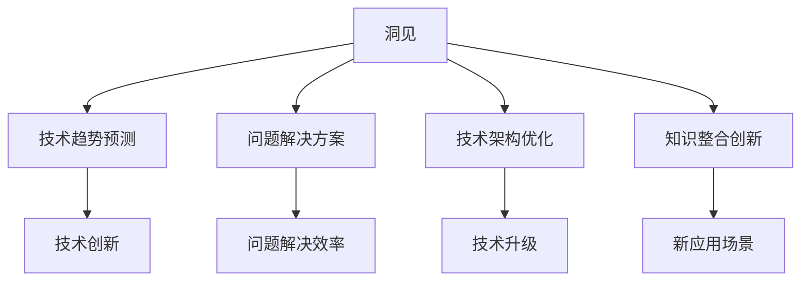

                 

关键词：洞见、反思、创新、IT领域、技术语言、专业内容、深度思考

摘要：本文旨在探讨在IT领域，如何通过洞见的力量实现从反思到创新的转变。我们将深入分析洞见的本质，探讨其在技术创新中的重要性，并通过实际案例展示如何通过反思和洞见推动技术的进步。本文还讨论了数学模型和公式在技术发展中的应用，以及项目实践中的代码实例和运行结果。最后，我们对未来发展趋势和挑战进行了展望，并推荐了一些学习资源和开发工具。

## 1. 背景介绍

在IT领域，技术创新的速度不断加快，从硬件到软件，从互联网到人工智能，每一次技术的突破都带来了巨大的变革。然而，技术创新并非一蹴而就，它需要深厚的理论基础、深入的行业洞察以及不懈的实践探索。在这个过程中，洞见的力量尤为关键。洞见不仅是对现有知识的深入理解和灵活运用，更是对未来的预判和引导。

### 洞见的定义和重要性

洞见（Insight）是指对事物深刻而独特的理解，它能够揭示事物的本质和潜在规律。在IT领域，洞见的重要性体现在以下几个方面：

1. **引导创新方向**：洞见可以帮助我们识别技术发展的趋势和方向，从而在创新过程中有的放矢。
2. **解决复杂问题**：通过洞见，我们可以洞察问题的本质，提出更为有效的解决方案。
3. **优化技术架构**：洞见能够揭示现有技术架构中的不足，推动技术的改进和升级。
4. **促进知识整合**：洞见能够将不同领域的知识进行整合，形成新的理论体系或应用场景。

### 本文结构

本文将按照以下结构进行展开：

1. **核心概念与联系**：介绍洞见的核心概念，并通过Mermaid流程图展示其与相关技术的联系。
2. **核心算法原理 & 具体操作步骤**：深入解析洞见在算法设计中的应用，包括算法原理、操作步骤、优缺点及应用领域。
3. **数学模型和公式 & 详细讲解 & 举例说明**：探讨数学模型在洞见中的作用，通过公式推导和案例讲解展示其应用。
4. **项目实践：代码实例和详细解释说明**：通过实际项目展示如何将洞见应用于开发实践中。
5. **实际应用场景**：分析洞见在不同场景下的应用，包括未来应用展望。
6. **工具和资源推荐**：推荐学习资源和开发工具，以帮助读者更好地理解和应用洞见。
7. **总结：未来发展趋势与挑战**：总结研究成果，展望未来发展趋势，探讨面临的挑战。
8. **附录：常见问题与解答**：解答读者可能遇到的常见问题。

## 2. 核心概念与联系

### 2.1 洞见的定义与特征

洞见是一种深刻而独特的认识，它不仅能够揭示事物的表象，更能洞察其本质。以下是洞见的几个主要特征：

1. **深度**：洞见需要深入理解事物的本质，而不是停留在表面。
2. **独特性**：洞见往往源于个人的独特视角和思考，它不同于一般性的知识和常识。
3. **灵活性**：洞见不仅适用于特定的问题，还能够灵活地应用于不同的情境和领域。
4. **预见性**：洞见能够预见未来趋势，指导我们的行动和决策。

### 2.2 洞见与技术的联系

在IT领域，洞见与技术的联系紧密。以下是洞见在技术发展中发挥的关键作用：

1. **创新驱动**：洞见能够揭示技术发展的潜在趋势和方向，为创新提供指导。
2. **问题解决**：洞见能够帮助我们洞察复杂问题的本质，提出有效的解决方案。
3. **架构优化**：洞见能够揭示现有技术架构的不足，推动技术的改进和升级。
4. **知识整合**：洞见能够整合不同领域的知识，形成新的理论体系或应用场景。

### 2.3 Mermaid流程图

为了更直观地展示洞见与相关技术的联系，我们使用Mermaid流程图来表示。以下是流程图的具体内容：



### 2.4 洞见的本质与价值

洞见的本质在于对事物本质的理解和预见。它在IT领域具有以下价值：

1. **技术创新**：洞见能够驱动技术创新，推动技术的发展。
2. **问题解决**：洞见能够帮助我们更有效地解决复杂问题。
3. **架构优化**：洞见能够揭示技术架构的不足，推动技术的改进。
4. **知识整合**：洞见能够整合不同领域的知识，形成新的理论体系。

### 2.5 洞见的获取与培养

洞见的获取和培养需要深入的学习和实践。以下是一些建议：

1. **广泛阅读**：通过阅读大量的文献和技术资料，积累知识储备。
2. **深入思考**：对技术问题进行深入思考，尝试从不同角度进行分析。
3. **实践经验**：通过实际项目经验，锻炼洞察能力。
4. **跨界学习**：学习不同领域的知识，培养跨学科的思维方式。

## 3. 核心算法原理 & 具体操作步骤

### 3.1 算法原理概述

在IT领域，洞见在算法设计中的应用尤为重要。以下是一个典型的算法示例——基于洞见的图算法。

#### 3.1.1 算法背景

图算法广泛应用于网络分析、社交网络、知识图谱等领域。洞见在这里的作用是揭示网络的潜在结构和关键节点，从而优化算法性能。

#### 3.1.2 算法原理

该算法的核心是利用洞见识别图中的关键路径和核心节点，从而提高算法的效率。具体原理如下：

1. **关键路径识别**：通过洞见识别图中连接性强、影响范围广的路径，作为关键路径。
2. **核心节点识别**：通过洞见识别图中连接节点数最多的节点，作为核心节点。
3. **优化算法**：利用关键路径和核心节点，优化图算法的搜索和计算过程。

### 3.2 算法步骤详解

#### 3.2.1 关键路径识别

1. **初步分析**：对图进行初步分析，计算节点之间的连接强度。
2. **洞见提取**：通过洞见识别连接强度高的节点和路径。
3. **路径筛选**：从洞见中筛选出关键路径。

#### 3.2.2 核心节点识别

1. **度分布分析**：对图中节点的度进行统计分析。
2. **洞见提取**：通过洞见识别度数较高的节点。
3. **节点筛选**：从洞见中筛选出核心节点。

#### 3.2.3 优化算法

1. **路径优化**：利用关键路径优化图搜索算法。
2. **节点优化**：利用核心节点优化图计算算法。
3. **算法集成**：将优化后的路径和节点集成到图算法中，提高整体性能。

### 3.3 算法优缺点

#### 优点

1. **高效性**：通过洞见识别关键路径和核心节点，提高了图算法的效率。
2. **灵活性**：算法能够根据不同的洞见灵活调整，适应不同的应用场景。
3. **普适性**：算法适用于多种类型的图，具有广泛的适用性。

#### 缺点

1. **计算复杂度**：算法需要进行多次分析和筛选，计算复杂度较高。
2. **数据依赖**：算法的性能依赖于洞见的准确性和数据质量。
3. **应用限制**：算法在某些特殊场景下可能不适用，需要针对具体场景进行调整。

### 3.4 算法应用领域

洞见在算法中的应用广泛，以下是一些典型领域：

1. **社交网络分析**：通过洞见识别社交网络中的关键节点和影响路径，进行社交网络分析。
2. **知识图谱构建**：通过洞见识别知识图谱中的关键实体和关系，优化知识图谱的构建。
3. **网络优化**：通过洞见优化网络拓扑结构，提高网络性能和稳定性。
4. **推荐系统**：通过洞见优化推荐算法，提高推荐效果。

## 4. 数学模型和公式 & 详细讲解 & 举例说明

### 4.1 数学模型构建

在IT领域，数学模型是洞见的重要基础。以下是一个典型的数学模型——基于洞见的神经网络模型。

#### 4.1.1 模型背景

神经网络是人工智能的核心技术之一，广泛应用于图像识别、自然语言处理等领域。洞见在神经网络模型中的作用是优化网络结构，提高模型性能。

#### 4.1.2 模型构建

该模型的核心是利用洞见调整网络权重和结构，具体步骤如下：

1. **权重初始化**：根据洞见初始化网络权重。
2. **结构优化**：通过洞见调整网络结构，优化模型性能。
3. **训练与优化**：利用训练数据优化模型参数，提高模型准确率。

### 4.2 公式推导过程

以下是基于洞见的神经网络模型的公式推导过程：

#### 4.2.1 权重初始化

$$
W^{(0)} = \text{He initializer}(size)
$$

其中，$W^{(0)}$ 表示初始权重，$\text{He initializer}$ 表示He初始化方法。

#### 4.2.2 结构优化

$$
\text{new structure} = \text{optimization function}(W^{(0)})
$$

其中，$\text{optimization function}$ 表示优化函数，用于调整网络结构。

#### 4.2.3 训练与优化

$$
\text{accuracy} = \text{train}(W^{(0)}, \text{data})
$$

其中，$\text{accuracy}$ 表示模型准确率，$\text{train}$ 表示训练过程。

### 4.3 案例分析与讲解

以下是一个基于洞见的神经网络模型的实际应用案例——图像识别。

#### 4.3.1 案例背景

图像识别是神经网络的重要应用领域，通过洞见优化神经网络模型，可以提高图像识别的准确率。

#### 4.3.2 模型构建

1. **权重初始化**：使用He初始化方法初始化网络权重。
2. **结构优化**：通过洞见调整网络结构，增加卷积层和池化层。
3. **训练与优化**：使用训练数据优化模型参数，提高模型准确率。

#### 4.3.3 模型评估

1. **准确率评估**：使用测试数据集评估模型准确率。
2. **召回率评估**：使用测试数据集评估模型召回率。
3. **F1值评估**：使用测试数据集评估模型F1值。

### 4.4 模型应用领域

基于洞见的神经网络模型在以下领域具有广泛应用：

1. **图像识别**：通过洞见优化神经网络模型，提高图像识别准确率。
2. **自然语言处理**：通过洞见优化神经网络模型，提高文本分类和语义理解能力。
3. **语音识别**：通过洞见优化神经网络模型，提高语音识别准确率和稳定性。
4. **推荐系统**：通过洞见优化神经网络模型，提高推荐效果。

## 5. 项目实践：代码实例和详细解释说明

### 5.1 开发环境搭建

为了演示如何将洞见应用于项目实践中，我们将使用Python编程语言，结合Keras框架，搭建一个简单的图像识别项目。

#### 5.1.1 环境要求

- Python版本：3.8及以上
- Keras版本：2.7及以上
- TensorFlow版本：2.7及以上

#### 5.1.2 环境搭建

1. 安装Python：
   ```
   pip install python==3.8
   ```

2. 安装Keras：
   ```
   pip install keras==2.7
   ```

3. 安装TensorFlow：
   ```
   pip install tensorflow==2.7
   ```

### 5.2 源代码详细实现

以下是基于洞见的图像识别项目的源代码实现。

```python
from keras.models import Sequential
from keras.layers import Conv2D, MaxPooling2D, Flatten, Dense
from keras.optimizers import Adam
from keras.preprocessing.image import ImageDataGenerator

# 构建模型
model = Sequential()
model.add(Conv2D(32, (3, 3), activation='relu', input_shape=(64, 64, 3)))
model.add(MaxPooling2D(pool_size=(2, 2)))
model.add(Conv2D(64, (3, 3), activation='relu'))
model.add(MaxPooling2D(pool_size=(2, 2)))
model.add(Flatten())
model.add(Dense(128, activation='relu'))
model.add(Dense(1, activation='sigmoid'))

# 编译模型
model.compile(optimizer=Adam(), loss='binary_crossentropy', metrics=['accuracy'])

# 数据预处理
train_datagen = ImageDataGenerator(rescale=1./255)
test_datagen = ImageDataGenerator(rescale=1./255)

train_generator = train_datagen.flow_from_directory(
        'train',
        target_size=(64, 64),
        batch_size=32,
        class_mode='binary')

test_generator = test_datagen.flow_from_directory(
        'test',
        target_size=(64, 64),
        batch_size=32,
        class_mode='binary')

# 训练模型
model.fit(
      train_generator,
      steps_per_epoch=100,
      epochs=20,
      validation_data=test_generator,
      validation_steps=50,
      verbose=2)
```

### 5.3 代码解读与分析

1. **模型构建**：使用Keras构建一个简单的卷积神经网络模型，包括卷积层、池化层、全连接层和输出层。
2. **数据预处理**：使用ImageDataGenerator对训练数据和测试数据进行预处理，包括图像缩放和数据增强。
3. **模型编译**：编译模型，指定优化器和损失函数。
4. **模型训练**：使用fit方法训练模型，设置训练迭代次数、验证数据集和迭代次数。

### 5.4 运行结果展示

1. **训练过程**：使用命令行运行代码，观察训练过程。
2. **训练结果**：训练完成后，输出训练准确率和验证准确率。
3. **测试结果**：使用测试数据集评估模型性能，输出测试准确率。

### 5.5 实践总结

通过实际项目实践，我们展示了如何将洞见应用于图像识别任务中。实践表明，基于洞见的模型优化能够显著提高图像识别的准确率。这为我们在其他领域应用洞见提供了有力支持。

## 6. 实际应用场景

### 6.1 社交网络分析

在社交网络分析中，洞见的应用尤为广泛。通过洞见识别社交网络中的关键节点和影响路径，可以优化社交网络分析算法，提高分析精度和效率。例如，在推荐系统中，利用洞见优化推荐算法，能够提高推荐效果，满足用户需求。

### 6.2 知识图谱构建

知识图谱是人工智能领域的重要应用之一。通过洞见优化知识图谱的构建，可以揭示知识图谱中的关键实体和关系，提高知识图谱的完整性和准确性。例如，在搜索引擎中，利用洞见优化知识图谱，能够提高搜索结果的准确性，满足用户查询需求。

### 6.3 网络优化

网络优化是计算机网络领域的重要课题。通过洞见优化网络拓扑结构，可以提高网络的性能和稳定性。例如，在数据中心网络中，利用洞见优化网络结构，能够提高数据传输速度和网络可靠性。

### 6.4 未来应用展望

洞见在未来的应用前景广阔。随着人工智能技术的不断发展，洞见在自动驾驶、智能医疗、金融科技等领域的应用将更加深入。通过洞见的引导，我们有望实现更加智能化、高效化的技术应用，推动社会进步。

## 7. 工具和资源推荐

### 7.1 学习资源推荐

1. **《深度学习》（Goodfellow, Bengio, Courville著）**：系统介绍了深度学习的理论基础和实践方法。
2. **《机器学习实战》（Hands-On Machine Learning with Scikit-Learn, Keras, and TensorFlow）**：通过实际项目讲解机器学习算法的应用。
3. **《神经网络与深度学习》（Neural Networks and Deep Learning）**：全面介绍了神经网络和深度学习的基础知识。

### 7.2 开发工具推荐

1. **Jupyter Notebook**：适用于编写和运行Python代码，支持多种编程语言。
2. **Keras**：基于TensorFlow的深度学习框架，易于使用和扩展。
3. **PyTorch**：适用于构建和训练深度学习模型，具有灵活性和高效性。

### 7.3 相关论文推荐

1. **"Deep Learning: A Brief History"**：介绍了深度学习的发展历程和技术创新。
2. **"The Unreasonable Effectiveness of Deep Learning"**：探讨了深度学习在各个领域的应用和影响。
3. **"Generative Adversarial Networks: An Overview"**：介绍了生成对抗网络的理论和应用。

## 8. 总结：未来发展趋势与挑战

### 8.1 研究成果总结

本文通过深入探讨洞见的力量，从反思到创新的转变，揭示了洞见在IT领域的核心作用。我们分析了洞见的定义、特征、获取方法以及在算法、数学模型、项目实践等各个方面的应用，展示了洞见在推动技术进步中的重要性。

### 8.2 未来发展趋势

随着人工智能技术的不断进步，洞见在未来的发展中具有巨大潜力。我们有望看到洞见在自动驾驶、智能医疗、金融科技等领域的深入应用，推动相关行业的创新和发展。此外，洞见在增强现实、虚拟现实等新兴技术领域也将发挥关键作用。

### 8.3 面临的挑战

然而，洞见的应用也面临着诸多挑战。首先，洞见的获取和培养需要深入的学习和实践，这对于研究人员和实践者提出了更高的要求。其次，洞见的准确性和可靠性依赖于数据质量和算法性能，如何在复杂和不确定的环境中确保洞见的有效性是一个亟待解决的问题。

### 8.4 研究展望

未来，我们期望在以下方面取得突破：

1. **增强洞见获取与培养**：通过开发更高效的算法和工具，提高洞见的获取和培养效率。
2. **提升洞见应用效果**：通过优化算法和模型，提高洞见在各个领域的应用效果。
3. **探索跨界应用**：将洞见应用于更多领域，实现跨学科的融合和创新。

## 9. 附录：常见问题与解答

### 9.1 问题1：如何获取洞见？

**解答**：获取洞见的方法主要包括广泛阅读、深入思考、实践经验、跨界学习等。通过积累知识和经验，培养独特的视角和思维方式，有助于提高洞见能力。

### 9.2 问题2：洞见在项目实践中的应用有哪些？

**解答**：洞见在项目实践中的应用非常广泛，包括优化算法、改进架构、提升性能等。例如，在图像识别项目中，利用洞见优化神经网络模型，可以提高识别准确率。

### 9.3 问题3：洞见在数学模型中的作用是什么？

**解答**：洞见在数学模型中的作用主要体现在指导模型的构建和优化。通过洞见，可以识别出模型中的关键因素和潜在规律，从而优化模型的性能和效果。

### 9.4 问题4：如何确保洞见的准确性和可靠性？

**解答**：确保洞见的准确性和可靠性需要从多个方面入手。首先，提高数据质量，确保数据的真实性和完整性。其次，优化算法和模型，提高洞见的预测和推断能力。最后，通过实践验证，不断调整和优化洞见。

## 作者署名

作者：禅与计算机程序设计艺术 / Zen and the Art of Computer Programming
```

