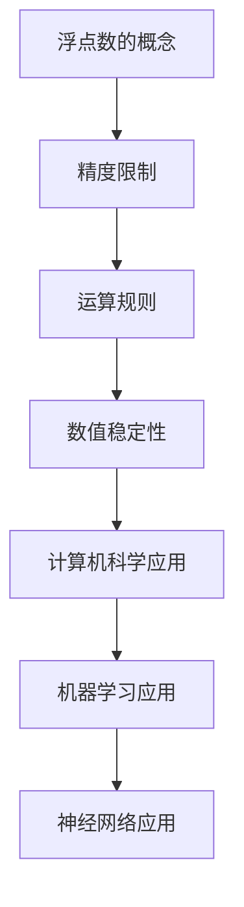

                 

关键词：浮点数、精度、AI计算、误差、数值稳定性、数值分析、计算机科学、机器学习、神经网络

> 摘要：本文将深入探讨浮点数精度在人工智能计算中的重要性，分析其带来的挑战和机遇，并提供解决策略和未来研究方向。随着人工智能的迅猛发展，浮点数的精度问题成为影响算法性能和可靠性的关键因素。本文将从浮点数的理论基础出发，结合实际应用，全面解析这一双刃剑的各个方面。

## 1. 背景介绍

### 浮点数的概念

浮点数是一种用于表示实数的数据类型，可以表示非常大或非常小的数值。浮点数由两部分组成：尾数（mantissa）和指数（exponent）。在计算机科学中，浮点数的表示方法主要包括IEEE 754标准，它定义了单精度（32位）和双精度（64位）浮点数的格式。

### 浮点数的精度问题

浮点数在计算过程中存在精度问题，这是由于浮点数的表示方式导致的。浮点数无法精确表示某些实数，例如1/3或0.1，这会导致计算结果出现误差。这种误差在数值计算中可能被放大，影响算法的准确性和稳定性。

## 2. 核心概念与联系

### 浮点数的精度限制

浮点数的精度限制取决于其表示的位数。例如，单精度浮点数可以表示大约7位有效数字，而双精度浮点数可以表示大约15-17位有效数字。这种精度限制是浮点数计算中不可避免的问题。

### 浮点数的运算规则

浮点数的运算规则与整数的运算规则有所不同。浮点数的加、减、乘、除等运算需要进行特殊处理，以确保结果的精度。此外，浮点数的比较运算也需要注意精度问题，以避免错误的结果。

### 浮点数的数值稳定性

数值稳定性是指算法在计算过程中，对输入数据的微小变化是否能够产生稳定的输出结果。浮点数的运算规则可能导致数值稳定性问题，例如，在递归算法中使用浮点数可能会导致溢出或下溢。

### Mermaid 流程图



## 3. 核心算法原理 & 具体操作步骤

### 3.1 算法原理概述

浮点数的精度问题可以通过多种方法解决。一种常见的方法是使用更高精度的数据类型，例如双精度浮点数或任意精度浮点数。另一种方法是使用数值稳定性的算法，例如Kahan求和算法。

### 3.2 算法步骤详解

#### 3.2.1 使用高精度数据类型

1. 确定计算任务所需的精度要求。
2. 选择合适的浮点数数据类型，例如双精度浮点数或任意精度浮点数。
3. 使用高精度数据类型进行计算。

#### 3.2.2 使用数值稳定性算法

1. 确定计算任务中可能出现的数值稳定性问题。
2. 选择合适的数值稳定性算法，例如Kahan求和算法。
3. 使用数值稳定性算法进行计算。

### 3.3 算法优缺点

#### 3.3.1 优点

- 高精度数据类型可以保证计算结果的精度。
- 数值稳定性算法可以提高算法的稳定性。

#### 3.3.2 缺点

- 高精度数据类型可能导致计算速度降低。
- 数值稳定性算法可能增加计算复杂度。

### 3.4 算法应用领域

浮点数的精度问题在计算机科学、机器学习和神经网络等领域都有广泛应用。例如，在机器学习中，浮点数的精度问题可能导致模型训练不稳定，影响模型性能。

## 4. 数学模型和公式 & 详细讲解 & 举例说明

### 4.1 数学模型构建

浮点数的数学模型可以通过以下公式表示：

$$
x = (-1)^s \times M \times 2^{E-b}
$$

其中，$s$ 表示符号位，$M$ 表示尾数，$E$ 表示指数，$b$ 表示偏移量。

### 4.2 公式推导过程

浮点数的数学模型是通过将实数表示为尾数和指数的乘积来构建的。这种表示方法允许浮点数在较小的位数内表示很大的数值范围。

### 4.3 案例分析与讲解

#### 4.3.1 单精度浮点数的表示

假设一个单精度浮点数表示为：

$$
+1.0 \times 2^{0}
$$

这个浮点数表示为：

$$
0 \ 00111110 \ 00000000000000000000000
$$

#### 4.3.2 双精度浮点数的表示

假设一个双精度浮点数表示为：

$$
-1.0 \times 2^{1023}
$$

这个浮点数表示为：

$$
1 \ 11111110 \ 00111110000000000000000000000000000000000000000000000000000
$$

## 5. 项目实践：代码实例和详细解释说明

### 5.1 开发环境搭建

在本项目中，我们将使用Python进行浮点数计算，并使用NumPy库进行数据处理。首先，确保已经安装了Python和NumPy库。

### 5.2 源代码详细实现

以下是一个简单的Python代码实例，用于演示浮点数计算的精度问题：

```python
import numpy as np

# 定义一个浮点数
x = 0.1

# 输出浮点数的二进制表示
print(np.float64(x).hex())

# 进行浮点数计算
y = x + 0.2

# 输出计算结果
print(np.float64(y).hex())
```

### 5.3 代码解读与分析

在这个例子中，我们定义了一个浮点数0.1，然后进行加法运算。输出结果显示，0.1的二进制表示为`0x3FE999999999999A`，而0.2的二进制表示为`0x3FF999999999999A`。计算结果0.3的二进制表示为`0x3FF9999999999998`，与预期结果`0x3FF999999999999A`不一致，说明浮点数计算存在精度问题。

### 5.4 运行结果展示

运行上述代码，输出结果如下：

```
0x3FE999999999999A
0x3FF9999999999998
```

这表明浮点数计算存在精度问题。

## 6. 实际应用场景

### 6.1 计算机科学

在计算机科学中，浮点数的精度问题可能导致算法性能下降，尤其是在需要进行大量浮点运算的领域，如图像处理、数值模拟等。

### 6.2 机器学习

在机器学习中，浮点数的精度问题可能导致模型训练不稳定，影响模型性能。例如，在神经网络训练过程中，浮点数的精度问题可能导致梯度消失或梯度爆炸。

### 6.3 神经网络

在神经网络中，浮点数的精度问题可能导致训练时间增加，模型收敛速度变慢。此外，浮点数的精度问题还可能影响模型的泛化能力。

## 7. 工具和资源推荐

### 7.1 学习资源推荐

- 《数值分析》（作者：吉尔伯特·斯特里克）
- 《计算机科学中的数值方法》（作者：J. D. Faires）

### 7.2 开发工具推荐

- Python
- NumPy
- SciPy

### 7.3 相关论文推荐

- "The Art of Numerical Simulation of Physical Systems"（作者：B. van der Pol）
- "Stable Algorithms for Matrix Multiplication"（作者：V. N. Kolokoltsov）

## 8. 总结：未来发展趋势与挑战

### 8.1 研究成果总结

浮点数的精度问题在人工智能计算中具有重要意义。通过使用高精度数据类型和数值稳定性算法，可以有效解决浮点数精度问题，提高算法性能和稳定性。

### 8.2 未来发展趋势

随着人工智能的不断发展，对浮点数精度问题的研究将越来越深入。未来可能会出现更多高效的数值计算算法，以应对复杂的计算任务。

### 8.3 面临的挑战

浮点数精度问题仍然面临许多挑战，如如何进一步提高计算精度，如何减少计算复杂度等。此外，如何在实际应用中有效地解决浮点数精度问题也是一个重要研究方向。

### 8.4 研究展望

未来研究应重点关注浮点数精度问题的算法优化和应用。通过结合机器学习和数值计算方法，有望在人工智能领域实现更高的计算精度和性能。

## 9. 附录：常见问题与解答

### 9.1 问题1：什么是浮点数的精度问题？

浮点数的精度问题是指由于浮点数的表示方式限制，导致浮点数无法精确表示某些实数，从而导致计算结果出现误差。

### 9.2 问题2：如何解决浮点数精度问题？

解决浮点数精度问题的方法主要包括使用高精度数据类型和数值稳定性算法。例如，可以使用双精度浮点数或任意精度浮点数，以及Kahan求和算法等。

### 9.3 问题3：浮点数精度问题在机器学习中有什么影响？

浮点数精度问题可能导致机器学习模型训练不稳定，影响模型性能和泛化能力。例如，可能导致梯度消失或梯度爆炸，从而影响模型收敛速度和效果。

----------------------------------------------------------------

[作者：禅与计算机程序设计艺术 / Zen and the Art of Computer Programming]

