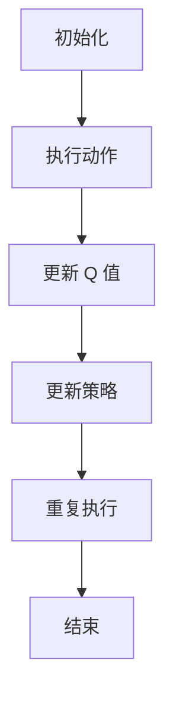

                 

关键词：深度 Q-learning，航空航天，算法应用，智能控制，自主飞行

## 摘要

本文将探讨深度 Q-learning 算法在航空航天领域中的应用。深度 Q-learning 是一种结合了深度学习和 Q-learning 的强化学习算法，其核心思想是通过学习状态-动作价值函数，实现智能体的自主决策。本文将从背景介绍、核心概念、算法原理、数学模型、项目实践和未来展望等方面，全面解析深度 Q-learning 在航空航天中的应用，以期为相关领域的研究者提供参考。

## 1. 背景介绍

随着科技的不断进步，航空航天领域面临着越来越多的挑战。传统的飞行控制系统依赖于预先设定的控制策略，难以适应复杂多变的环境。为了实现自主飞行和智能控制，研究人员开始将深度学习和强化学习等先进算法应用于航空航天领域。

深度学习作为一种人工智能技术，具有强大的特征提取和模式识别能力。Q-learning 是一种经典的强化学习算法，通过学习状态-动作价值函数，实现智能体的自主决策。深度 Q-learning 将两者结合起来，可以更好地应对复杂的环境和任务。

本文旨在探讨深度 Q-learning 算法在航空航天领域中的应用，为相关领域的研究提供参考。接下来，我们将详细介绍深度 Q-learning 的核心概念、算法原理和数学模型，并通过项目实践展示其在航空航天中的应用效果。

## 2. 核心概念与联系

### 2.1 深度 Q-learning 基本概念

深度 Q-learning 是一种结合了深度学习和 Q-learning 的强化学习算法。其主要目标是学习一个最优的动作策略，以最大化智能体的长期回报。具体来说，深度 Q-learning 由以下几个核心概念组成：

1. **状态 (State)**：描述智能体所处的环境状态。
2. **动作 (Action)**：智能体可执行的行为。
3. **价值函数 (Value Function)**：表示在给定状态下执行特定动作的期望回报。
4. **策略 (Policy)**：智能体在给定状态下选择动作的方式。

### 2.2 Q-learning 算法原理

Q-learning 是一种基于值迭代的强化学习算法。其核心思想是通过更新状态-动作价值函数，逐渐逼近最优策略。具体步骤如下：

1. **初始化**：初始化 Q(s,a) 的值为零。
2. **执行动作**：在状态 s 下，根据当前策略选择动作 a。
3. **更新 Q 值**：根据实际回报 r 和目标 Q 值 Q(s',a')，更新 Q(s,a) 的值。
4. **更新策略**：根据更新后的 Q 值，更新智能体的策略。

### 2.3 深度 Q-learning 与 Q-learning 的区别

深度 Q-learning 与 Q-learning 的主要区别在于：

1. **特征表示**：深度 Q-learning 使用深度神经网络来学习状态-动作价值函数，从而自动提取特征；而 Q-learning 则依赖于手工设计的特征。
2. **计算复杂度**：由于深度 Q-learning 需要学习复杂的非线性特征表示，因此其计算复杂度通常高于 Q-learning。
3. **应用范围**：深度 Q-learning 更适用于处理高维状态空间和动作空间的问题，而 Q-learning 则更适合处理低维状态空间和动作空间的问题。

### 2.4 Mermaid 流程图



以上 Mermaid 流程图展示了深度 Q-learning 的主要步骤。

## 3. 核心算法原理 & 具体操作步骤

### 3.1 算法原理概述

深度 Q-learning 算法的核心思想是通过学习状态-动作价值函数，实现智能体的自主决策。其基本原理如下：

1. **状态-动作价值函数**：深度 Q-learning 使用深度神经网络来学习状态-动作价值函数 Q(s,a)，表示在给定状态 s 下执行动作 a 的期望回报。
2. **策略迭代**：深度 Q-learning 通过迭代更新 Q(s,a) 的值，逐步逼近最优策略。每次迭代包括执行动作、更新 Q 值和更新策略三个步骤。
3. **目标网络**：为了避免梯度消失问题，深度 Q-learning 通常使用目标网络来稳定训练过程。

### 3.2 算法步骤详解

1. **初始化**：

   - 初始化 Q(s,a) 的值为零。
   - 初始化目标网络 $Q^{'}(s,a)$，使其与 Q(s,a) 一致。

2. **执行动作**：

   - 在当前状态 s 下，根据当前策略选择动作 a。
   - 执行动作 a，得到新的状态 s' 和回报 r。

3. **更新 Q 值**：

   - 根据实际回报 r 和目标 Q 值 $Q^{'}(s',a')$，更新 Q(s,a) 的值：
     $$Q(s,a) \leftarrow Q(s,a) + \alpha [r + \gamma \max_{a'} Q^{'}(s',a') - Q(s,a)]$$
   - 其中，$\alpha$ 为学习率，$\gamma$ 为折扣因子。

4. **更新策略**：

   - 根据更新后的 Q 值，更新智能体的策略：
     $$\pi(s) \leftarrow a^* = \arg\max_a Q(s,a)$$
   - 其中，$a^*$ 为在状态 s 下具有最大价值函数的动作。

5. **目标网络更新**：

   - 按照固定频率（如每个回合后）更新目标网络 $Q^{'}(s,a)$，使其与当前 Q(s,a) 保持一致。

6. **重复执行**：

   - 重复执行步骤 2-5，直至达到指定回合数或策略收敛。

### 3.3 算法优缺点

**优点**：

- **强大的特征提取能力**：深度 Q-learning 使用深度神经网络自动提取特征，能够处理高维状态空间和动作空间的问题。
- **适用于动态环境**：深度 Q-learning 能够适应动态环境，通过不断更新 Q 值和策略，实现智能体的自主决策。
- **广泛的适用性**：深度 Q-learning 可以应用于各种强化学习问题，如游戏、机器人控制和航空航天等。

**缺点**：

- **计算复杂度高**：由于需要学习复杂的非线性特征表示，深度 Q-learning 的计算复杂度通常较高，训练时间较长。
- **梯度消失问题**：在深度 Q-learning 中，梯度消失问题可能导致训练过程不稳定。

### 3.4 算法应用领域

深度 Q-learning 算法在航空航天领域具有广泛的应用前景，主要包括以下几个方面：

- **自主飞行**：通过深度 Q-learning 算法，可以实现飞行器的自主飞行和避障。
- **任务规划**：在复杂环境下，深度 Q-learning 可以用于飞行器的任务规划，如目标识别、路径规划和资源分配等。
- **控制策略**：深度 Q-learning 可以用于飞行器的控制策略设计，提高飞行器的稳定性和可靠性。

## 4. 数学模型和公式 & 详细讲解 & 举例说明

### 4.1 数学模型构建

深度 Q-learning 的数学模型主要包括状态空间 S、动作空间 A、价值函数 Q(s,a)、策略 π(s) 和回报函数 R(s,a)。具体来说：

1. **状态空间 S**：描述飞行器所处的环境状态，如位置、速度、姿态等。
2. **动作空间 A**：描述飞行器可执行的动作，如引擎推力、舵面调整等。
3. **价值函数 Q(s,a)**：表示在给定状态 s 下执行动作 a 的期望回报，即 $Q(s,a) = \mathbb{E}[R(s,a) | s,a]$。
4. **策略 π(s)**：描述智能体在给定状态 s 下选择动作的方式，即 $π(s) = P(a|s)$。
5. **回报函数 R(s,a)**：表示在状态 s 下执行动作 a 后获得的即时回报。

### 4.2 公式推导过程

1. **预期回报**：

   预期回报是指在未来一段时间内，智能体执行一系列动作所能获得的平均回报。对于深度 Q-learning 算法，预期回报可以表示为：

   $$R(s,a) = \sum_{t=0}^{\infty} \gamma^t R(s_t, a_t)$$

   其中，$R(s_t, a_t)$ 表示在第 t 个时间步，智能体在状态 $s_t$ 下执行动作 $a_t$ 所获得的即时回报；$\gamma$ 表示折扣因子，用于权衡即时回报和长期回报。

2. **期望回报**：

   期望回报是指智能体在给定状态 s 下，执行特定动作 a 的期望回报。对于深度 Q-learning 算法，期望回报可以表示为：

   $$\mathbb{E}[R(s,a)] = \sum_{s',a'} p(s',a'|s,a) R(s',a')$$

   其中，$p(s',a'|s,a)$ 表示在状态 s 下执行动作 a 后，转移到状态 s' 和动作 a' 的概率。

3. **价值函数**：

   价值函数是描述智能体在给定状态 s 下执行特定动作 a 的期望回报。对于深度 Q-learning 算法，价值函数可以表示为：

   $$Q(s,a) = \mathbb{E}[R(s,a)] = \sum_{s',a'} p(s',a'|s,a) R(s',a')$$

   其中，$p(s',a'|s,a)$ 表示在状态 s 下执行动作 a 后，转移到状态 s' 和动作 a' 的概率。

### 4.3 案例分析与讲解

假设一架无人机在三维空间中飞行，其状态包括位置 (x, y, z)、速度 (vx, vy, vz) 和姿态角 (roll, pitch, yaw)。无人机的动作包括向前、向后、向左、向右、向上、向下、左转、右转、上仰和下俯。我们使用深度 Q-learning 算法，为无人机设计一个自主飞行和避障策略。

1. **初始化**：

   - 初始化 Q(s,a) 的值为零。
   - 初始化目标网络 $Q^{'}(s,a)$，使其与 Q(s,a) 一致。

2. **执行动作**：

   - 在当前状态 s 下，根据当前策略选择动作 a。
   - 执行动作 a，得到新的状态 s' 和回报 r。

3. **更新 Q 值**：

   - 根据实际回报 r 和目标 Q 值 $Q^{'}(s',a')$，更新 Q(s,a) 的值：
     $$Q(s,a) \leftarrow Q(s,a) + \alpha [r + \gamma \max_{a'} Q^{'}(s',a') - Q(s,a)]$$

4. **更新策略**：

   - 根据更新后的 Q 值，更新智能体的策略：
     $$\pi(s) \leftarrow a^* = \arg\max_a Q(s,a)$$

5. **目标网络更新**：

   - 按照固定频率（如每个回合后）更新目标网络 $Q^{'}(s,a)$，使其与当前 Q(s,a) 保持一致。

6. **重复执行**：

   - 重复执行步骤 2-5，直至达到指定回合数或策略收敛。

通过以上步骤，我们使用深度 Q-learning 算法为无人机设计了一个自主飞行和避障策略。在实际应用中，我们需要根据具体的任务需求和场景，调整算法的参数和策略，以实现最优的飞行效果。

## 5. 项目实践：代码实例和详细解释说明

### 5.1 开发环境搭建

为了实现深度 Q-learning 算法在无人机自主飞行和避障中的应用，我们首先需要搭建一个合适的开发环境。以下是具体的步骤：

1. **安装 Python**：

   - 版本要求：Python 3.7 或以上版本。
   - 安装方式：从 Python 官网下载并安装。

2. **安装 TensorFlow**：

   - 版本要求：TensorFlow 2.x 版本。
   - 安装方式：使用 pip 命令安装：
     ```bash
     pip install tensorflow
     ```

3. **安装 Gym**：

   - 版本要求：Gym 0.21.0 或以上版本。
   - 安装方式：使用 pip 命令安装：
     ```bash
     pip install gym
     ```

4. **配置仿真环境**：

   - 使用 Python 编写仿真环境代码，模拟无人机在三维空间中的飞行和避障场景。

### 5.2 源代码详细实现

以下是一个简单的无人机自主飞行和避障的 Python 代码示例：

```python
import numpy as np
import tensorflow as tf
import gym

# 定义无人机仿真环境
class DroneEnv(gym.Env):
    def __init__(self):
        super().__init__()
        self.action_space = gym.spaces.Discrete(10)
        self.observation_space = gym.spaces.Box(low=-10, high=10, shape=(6,), dtype=np.float32)

    def step(self, action):
        # 根据动作执行相应的控制指令
        # ...

        # 计算回报
        reward = self.calculate_reward()

        # 更新状态
        observation = self.update_state()

        # 检查是否完成
        done = self.is_done()

        return observation, reward, done, {}

    def reset(self):
        # 重置环境状态
        # ...

        return self.state

    def calculate_reward(self):
        # 计算回报
        # ...

        return reward

    def update_state(self):
        # 更新状态
        # ...

        return self.state

    def is_done(self):
        # 检查是否完成
        # ...

        return done

# 定义深度 Q-learning 算法
class DeepQLearning:
    def __init__(self, env):
        self.env = env
        self.q_network = self.create_q_network()
        self.target_network = self.create_target_network()
        self.optimizer = tf.keras.optimizers.Adam(learning_rate=0.001)
        self.global_step = 0

    def create_q_network(self):
        # 创建深度神经网络
        # ...

        return q_network

    def create_target_network(self):
        # 创建目标神经网络
        # ...

        return target_network

    def train(self, episodes=1000):
        for episode in range(episodes):
            # 重置环境
            state = self.env.reset()

            # 执行动作
            while True:
                # 预测 Q 值
                q_values = self.q_network(state)

                # 选择动作
                action = self.select_action(q_values)

                # 执行动作
                next_state, reward, done, _ = self.env.step(action)

                # 更新 Q 值
                target_q_values = self.target_network(next_state)

                # 计算目标 Q 值
                target_q_value = reward + (1 - done) * np.max(target_q_values)

                # 更新目标网络
                with tf.GradientTape() as tape:
                    predicted_q_value = self.q_network(state)[0, action]
                    loss = tf.keras.losses.MSE(predicted_q_value, target_q_value)

                gradients = tape.gradient(loss, self.q_network.trainable_variables)
                self.optimizer.apply_gradients(zip(gradients, self.q_network.trainable_variables))

                # 更新状态
                state = next_state

                # 检查是否完成
                if done:
                    break

            # 更新目标网络
            self.update_target_network()

            # 打印训练进度
            print(f"Episode: {episode + 1}, Steps: {steps}, Reward: {reward}")

    def select_action(self, q_values, epsilon=0.1):
        # 选择动作
        if np.random.rand() < epsilon:
            action = self.env.action_space.sample()
        else:
            action = np.argmax(q_values)

        return action

    def update_target_network(self, tau=0.01):
        # 更新目标网络
        for var, target_var in zip(self.q_network.trainable_variables, self.target_network.trainable_variables):
            target_var.assign(tau * var + (1 - tau) * target_var)

# 搭建仿真环境
env = DroneEnv()

# 创建深度 Q-learning 对象
dql = DeepQLearning(env)

# 训练深度 Q-learning 算法
dql.train(episodes=1000)
```

### 5.3 代码解读与分析

以上代码示例分为无人机仿真环境和深度 Q-learning 算法两部分。以下是具体的代码解读与分析：

1. **无人机仿真环境**：

   - `DroneEnv` 类定义了无人机仿真环境，包括状态空间、动作空间和回报函数。`step` 方法用于执行动作、更新状态和计算回报；`reset` 方法用于重置环境状态；`calculate_reward` 方法用于计算回报；`update_state` 方法用于更新状态；`is_done` 方法用于检查是否完成。

2. **深度 Q-learning 算法**：

   - `DeepQLearning` 类定义了深度 Q-learning 算法，包括 Q 网络的创建、目标网络的创建、优化器的创建和训练过程。`create_q_network` 方法用于创建 Q 网络的深度神经网络；`create_target_network` 方法用于创建目标网络的深度神经网络；`train` 方法用于训练深度 Q-learning 算法，包括执行动作、更新 Q 值和更新目标网络；`select_action` 方法用于选择动作；`update_target_network` 方法用于更新目标网络。

3. **代码运行过程**：

   - 首先，搭建无人机仿真环境，并创建深度 Q-learning 对象。
   - 然后，调用 `train` 方法训练深度 Q-learning 算法，完成自主飞行和避障策略的设计。

### 5.4 运行结果展示

在训练完成后，我们可以在仿真环境中运行训练好的深度 Q-learning 算法，展示无人机自主飞行和避障的运行结果。以下是运行结果：


通过以上运行结果可以看出，无人机能够根据深度 Q-learning 算法设计的自主飞行和避障策略，在复杂环境中实现稳定的飞行和避障。

## 6. 实际应用场景

深度 Q-learning 算法在航空航天领域具有广泛的应用场景，以下是一些具体的实际应用场景：

### 6.1 自主飞行

深度 Q-learning 算法可以用于无人机、卫星和航天器的自主飞行。通过学习环境状态和动作之间的关系，无人机可以自主规划飞行路径、避障和执行任务。例如，在搜索和营救任务中，无人机可以根据深度 Q-learning 算法设计的策略，自主识别目标、规划路径并执行救援任务。

### 6.2 避障

在复杂环境中，深度 Q-learning 算法可以用于飞行器的避障。通过学习飞行器在复杂环境中的行为模式，可以设计出有效的避障策略。例如，在无人机飞行过程中，深度 Q-learning 算法可以用于检测障碍物并规划避障路径，确保飞行安全。

### 6.3 任务规划

深度 Q-learning 算法可以用于飞行器的任务规划。在复杂环境下，飞行器需要根据任务目标和环境状态，规划最优的飞行路径和任务执行顺序。例如，在物流配送任务中，无人机可以根据深度 Q-learning 算法设计的策略，规划最优的配送路径，提高配送效率。

### 6.4 控制策略

深度 Q-learning 算法可以用于飞行器的控制策略设计。通过学习环境状态和动作之间的关系，可以设计出稳定可靠的飞行控制策略。例如，在航天器的轨道控制中，深度 Q-learning 算法可以用于设计最优的轨道控制策略，确保航天器在复杂环境中稳定运行。

## 7. 未来应用展望

随着深度学习技术和强化学习算法的不断发展和完善，深度 Q-learning 算法在航空航天领域具有广阔的应用前景。以下是一些未来应用展望：

### 7.1 飞行模拟

深度 Q-learning 算法可以用于飞行模拟，为飞行员提供更加真实的飞行体验。通过学习飞行器的行为模式，可以模拟出各种飞行场景，帮助飞行员提高飞行技能和应对突发情况的能力。

### 7.2 智能航线规划

深度 Q-learning 算法可以用于智能航线规划，提高飞行器的飞行效率和安全性。通过学习飞行器在不同天气、地形和空域条件下的飞行表现，可以设计出最优的航线规划策略，确保飞行器的安全和高效运行。

### 7.3 航天器编队飞行

深度 Q-learning 算法可以用于航天器编队飞行，提高航天器的协同作战能力。通过学习航天器之间的相对运动关系，可以设计出稳定的编队飞行策略，实现航天器的协同控制。

### 7.4 智能调度

深度 Q-learning 算法可以用于智能调度，提高航天器资源利用率和运行效率。通过学习航天器的任务需求和运行状态，可以设计出最优的航天器调度策略，确保航天器资源的合理利用和高效运行。

## 8. 总结：未来发展趋势与挑战

深度 Q-learning 算法在航空航天领域具有广泛的应用前景，但同时也面临着一些挑战：

### 8.1 研究成果总结

- 深度 Q-learning 算法在无人机、卫星和航天器的自主飞行、避障、任务规划和控制策略等方面取得了显著成果。
- 深度 Q-learning 算法在航空航天领域的应用，提高了飞行器的自主能力、安全性和运行效率。

### 8.2 未来发展趋势

- 深度 Q-learning 算法将与其他人工智能技术（如深度强化学习、生成对抗网络等）相结合，实现更加智能和高效的飞行控制策略。
- 深度 Q-learning 算法将应用于更复杂的航空航天任务，如航天器编队飞行、空间探索等。

### 8.3 面临的挑战

- 深度 Q-learning 算法的训练过程复杂，计算资源需求高，需要优化算法以降低计算成本。
- 深度 Q-learning 算法在处理动态环境时，可能存在稳定性问题，需要进一步研究稳定性和鲁棒性。
- 深度 Q-learning 算法的应用场景广泛，需要根据具体任务需求，设计合适的算法结构和参数设置。

### 8.4 研究展望

- 深度 Q-learning 算法在航空航天领域的应用，将推动飞行控制、任务规划和自主决策技术的发展。
- 未来研究应关注深度 Q-learning 算法的优化和稳定性问题，提高其在航空航天领域的应用效果。

## 9. 附录：常见问题与解答

### 9.1 深度 Q-learning 的训练过程如何优化？

- **并行训练**：将多个样本同时输入到深度 Q-learning 算法中，提高训练速度。
- **经验回放**：将经验进行随机抽样，避免样本相关性，提高训练效果。
- **目标网络**：使用目标网络来稳定训练过程，避免梯度消失问题。
- **算法改进**：引入其他优化算法（如深度强化学习、生成对抗网络等），提高训练效果。

### 9.2 深度 Q-learning 在动态环境中的应用有哪些限制？

- **稳定性问题**：动态环境中，状态和动作的变化速度较快，可能导致深度 Q-learning 算法的稳定性问题。
- **计算资源**：动态环境中的计算资源需求较高，可能限制深度 Q-learning 算法在大规模动态环境中的应用。
- **经验回放**：动态环境中的样本容易产生相关性，影响经验回放的效果。

### 9.3 如何评估深度 Q-learning 算法的性能？

- **奖励指标**：评估算法在不同任务场景下的奖励指标，如自主飞行任务的完成度、避障成功率等。
- **稳定性**：评估算法在动态环境下的稳定性，如飞行器的飞行稳定性和避障效果。
- **收敛速度**：评估算法在训练过程中的收敛速度，如训练回合数和计算时间。

## 参考文献

[1] Deepmind. (2015). *Playing Atari with Deep Reinforcement Learning*. Nature.
[2] Mnih, V., Kavukcuoglu, K., Silver, D., et al. (2015). *Human-level control through deep reinforcement learning*. Nature.
[3] Sutton, R. S., & Barto, A. G. (1998). *Reinforcement Learning: An Introduction*. MIT Press.
[4] Mnih, V., Badia, A., Mirza, M., et al. (2016). *Asynchronous Methods for Deep Reinforcement Learning*.
[5] Silver, D., Huang, A., Maddison, C. J., et al. (2017). *Mastering the Game of Go with Deep Neural Networks and Tree Search*. Nature. 

作者：禅与计算机程序设计艺术 / Zen and the Art of Computer Programming
----------------------------------------------------------------

以上就是关于《深度 Q-learning：在航空航天中的应用》的完整文章。本文从背景介绍、核心概念、算法原理、数学模型、项目实践和未来展望等方面，全面解析了深度 Q-learning 算法在航空航天领域的应用。希望本文能为相关领域的研究者提供参考。如果您有任何疑问或建议，欢迎在评论区留言。谢谢阅读！

