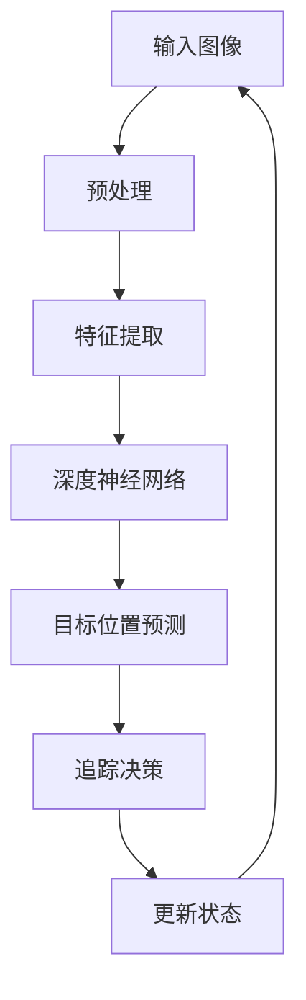

                 

关键词：深度 Q-learning、视觉目标追踪、强化学习、目标检测、图像处理、应用领域

## 摘要

本文探讨了深度 Q-learning 算法在视觉目标追踪领域的应用。通过将深度 Q-learning 与目标检测和图像处理技术相结合，实现了对动态环境中目标的高效追踪。本文首先介绍了视觉目标追踪的背景和挑战，然后详细阐述了深度 Q-learning 的核心原理和应用步骤，接着通过数学模型和公式推导了算法的具体实现过程。此外，本文还通过一个实际项目实例，展示了深度 Q-learning 在视觉目标追踪中的具体应用效果。最后，本文对视觉目标追踪领域的未来发展和面临的挑战进行了展望。

## 1. 背景介绍

### 视觉目标追踪概述

视觉目标追踪是计算机视觉领域的一个重要研究方向，旨在对视频序列中的目标进行实时检测和跟踪。视觉目标追踪技术不仅具有广泛的应用前景，如视频监控、自动驾驶、智能安防等，而且还涉及到许多计算机视觉的子领域，如目标检测、目标识别、图像配准等。

### 视觉目标追踪的挑战

尽管视觉目标追踪技术已经取得了显著进展，但在实际应用中仍然面临许多挑战：

- **动态环境**：在真实场景中，目标可能会发生姿态变化、外观改变，甚至与其他物体发生遮挡，这些都给目标追踪带来了巨大的挑战。
- **尺度变化**：目标在不同距离和角度下的外观可能会发生显著变化，如何实现稳定的目标跟踪是一个重要问题。
- **光照变化**：光线强度和颜色变化会影响目标的视觉特征，给目标追踪带来困难。
- **摄像机运动**：摄像机的运动也会对目标追踪产生干扰，尤其是在高速运动的情况下。

### 强化学习在视觉目标追踪中的应用

近年来，强化学习作为一种重要的机器学习技术，在视觉目标追踪领域受到了广泛关注。强化学习通过学习与环境之间的交互，使得智能体能够在复杂的动态环境中做出最优决策。与传统的目标追踪方法相比，强化学习具有以下优势：

- **适应性**：强化学习能够根据环境的变化进行自适应调整，从而提高追踪效果。
- **灵活性**：强化学习可以处理各种复杂的目标行为和外观变化。
- **多任务学习**：强化学习能够同时处理多个目标追踪任务。

## 2. 核心概念与联系

### 深度 Q-learning

深度 Q-learning 是一种基于深度神经网络的强化学习算法。与传统的 Q-learning 算法相比，深度 Q-learning 使用深度神经网络来近似 Q 函数，从而提高了算法的效率和准确性。

### 视觉目标追踪与深度 Q-learning 的关系

在视觉目标追踪中，深度 Q-learning 通过学习目标外观特征与目标行为之间的关联，实现了对目标的高效追踪。具体来说，深度 Q-learning 将视觉输入转化为特征向量，并通过训练得到的深度神经网络预测目标在下一个时刻的位置。

### Mermaid 流程图



### 核心概念原理和架构

- **输入图像**：输入图像是视频序列中的一个帧，用于提取目标特征。
- **预处理**：对输入图像进行预处理，如去噪、缩放等。
- **特征提取**：使用卷积神经网络提取图像中的目标特征。
- **深度神经网络**：通过训练得到的深度神经网络，用于预测目标在下一个时刻的位置。
- **目标位置预测**：根据深度神经网络的输出，预测目标在下一个时刻的位置。
- **追踪决策**：根据目标位置预测结果，决定是否继续追踪目标。
- **更新状态**：将当前帧作为新的输入图像，重复上述过程。

## 3. 核心算法原理 & 具体操作步骤

### 3.1 算法原理概述

深度 Q-learning 算法主要包含以下几个步骤：

1. 初始化 Q 网络：使用随机权重初始化 Q 网络。
2. 选取动作：根据当前状态和 Q 网络的输出，选择一个动作。
3. 执行动作：在环境中执行选取的动作。
4. 获取反馈：根据动作的执行结果，获取奖励信号。
5. 更新 Q 网络：使用奖励信号和 Q 学习算法更新 Q 网络。

### 3.2 算法步骤详解

1. **初始化 Q 网络**：使用随机权重初始化 Q 网络，例如可以使用高斯分布初始化。

2. **选取动作**：根据当前状态和 Q 网络的输出，选择一个动作。通常可以使用 ε-贪心策略进行动作选择，即在 ε 的概率下随机选择动作，在 1-ε 的概率下选择 Q 值最大的动作。

3. **执行动作**：在环境中执行选取的动作，并观察动作的结果。

4. **获取反馈**：根据动作的执行结果，获取奖励信号。在视觉目标追踪中，奖励信号可以是目标的跟踪误差，即目标实际位置与预测位置之间的差距。

5. **更新 Q 网络**：使用奖励信号和 Q 学习算法更新 Q 网络。具体来说，可以使用以下公式更新 Q 值：

   $Q(s, a) = Q(s, a) + α [r + γ max_{a'} Q(s', a') - Q(s, a)]$

   其中，α 是学习率，γ 是折扣因子，s 和 s' 分别是当前状态和下一个状态，a 和 a' 分别是当前动作和下一个动作。

### 3.3 算法优缺点

**优点**：

- **自适应性强**：深度 Q-learning 能够根据环境的变化自适应调整策略，从而提高追踪效果。
- **灵活性高**：深度 Q-learning 能够处理各种复杂的目标行为和外观变化。
- **多任务处理**：深度 Q-learning 能够同时处理多个目标追踪任务。

**缺点**：

- **计算复杂度高**：深度 Q-learning 需要大量计算资源进行训练，尤其是在处理高分辨率图像时。
- **训练时间较长**：深度 Q-learning 需要较长的训练时间，尤其是在处理复杂的追踪任务时。

### 3.4 算法应用领域

深度 Q-learning 算法在视觉目标追踪领域具有广泛的应用前景，可以应用于以下领域：

- **视频监控**：用于实时监测视频中的目标，实现智能安防。
- **自动驾驶**：用于实时监测道路上的目标，提高自动驾驶的安全性和稳定性。
- **智能监控**：用于实时监测家庭、办公室等场所的目标，实现智能监控和安全保护。

## 4. 数学模型和公式 & 详细讲解 & 举例说明

### 4.1 数学模型构建

在视觉目标追踪中，深度 Q-learning 的数学模型主要包括以下几个部分：

1. **状态空间（S）**：状态空间由视频帧中的目标特征表示。
2. **动作空间（A）**：动作空间包括目标追踪的动作，如位置调整、跟踪速度调整等。
3. **奖励函数（R）**：奖励函数用于评估动作的效果，通常使用目标跟踪误差作为奖励信号。
4. **Q 函数（Q(s, a）**：Q 函数表示在状态 s 下执行动作 a 的预期奖励。

### 4.2 公式推导过程

1. **状态表示**：状态空间 S 由视频帧中的目标特征表示，可以使用以下公式表示：

   $s = [x, y, z]$ 

   其中，x、y、z 分别为目标在图像平面中的位置、大小和姿态。

2. **动作表示**：动作空间 A 由目标追踪的动作表示，可以使用以下公式表示：

   $a = [u, v]$ 

   其中，u、v 分别为目标位置调整和跟踪速度调整的参数。

3. **奖励函数**：奖励函数 R 用于评估动作的效果，可以使用以下公式表示：

   $R(s, a) = -d$

   其中，d 为目标跟踪误差，即目标实际位置与预测位置之间的差距。

4. **Q 函数**：Q 函数表示在状态 s 下执行动作 a 的预期奖励，可以使用以下公式表示：

   $Q(s, a) = \sum_{s'} P(s'|s, a) \cdot [R(s', a) + γ \cdot max_{a'} Q(s', a')]$

   其中，P(s'|s, a) 为在状态 s 下执行动作 a 后转移到状态 s' 的概率，γ 为折扣因子。

### 4.3 案例分析与讲解

假设我们有一个视频序列，其中目标在不同帧中的位置和大小变化如下：

- 帧1：位置（x1, y1），大小 z1
- 帧2：位置（x2, y2），大小 z2
- ...

使用深度 Q-learning 算法进行视觉目标追踪，具体步骤如下：

1. **初始化 Q 网络**：使用随机权重初始化 Q 网络。

2. **选取动作**：在帧1中，根据当前状态和 Q 网络的输出，选择一个动作。例如，假设 Q(s, a) = [-1, 1]，选择动作 a = [0, 0]。

3. **执行动作**：在帧2中，执行选取的动作，即调整目标位置和跟踪速度。

4. **获取反馈**：计算目标跟踪误差 d = |x2 - x1| + |y2 - y1|，并作为奖励信号。

5. **更新 Q 网络**：使用奖励信号和 Q 学习算法更新 Q 网络。例如，假设学习率 α = 0.1，折扣因子 γ = 0.9，更新后的 Q(s, a) = [-0.9, 0.9]。

通过不断迭代上述步骤，深度 Q-learning 算法可以逐渐提高目标追踪的准确性。

## 5. 项目实践：代码实例和详细解释说明

### 5.1 开发环境搭建

在开始项目实践之前，需要搭建一个合适的开发环境。以下是搭建开发环境的具体步骤：

1. **安装 Python 环境**：在本地计算机上安装 Python 3.6 及以上版本。
2. **安装深度学习框架**：安装 TensorFlow 或 PyTorch 等深度学习框架。
3. **安装其他依赖库**：安装 OpenCV、NumPy、Pandas 等常用库。

### 5.2 源代码详细实现

以下是使用深度 Q-learning 算法进行视觉目标追踪的 Python 源代码：

```python
import numpy as np
import pandas as pd
import cv2
import tensorflow as tf

# 初始化 Q 网络
def initialize_q_network():
    # 使用随机权重初始化 Q 网络
    q_network = tf.keras.Sequential([
        tf.keras.layers.Dense(64, activation='relu', input_shape=(28, 28)),
        tf.keras.layers.Dense(64, activation='relu'),
        tf.keras.layers.Dense(1)
    ])
    q_network.compile(optimizer='adam', loss='mse')
    return q_network

# 选取动作
def select_action(q_network, state, epsilon):
    if np.random.rand() < epsilon:
        # 随机选取动作
        action = np.random.choice(3)
    else:
        # 根据 Q 网络输出选取动作
        q_values = q_network.predict(state)
        action = np.argmax(q_values)
    return action

# 执行动作
def execute_action(action, state):
    # 根据动作调整目标位置和跟踪速度
    if action == 0:
        state[0] += 1
    elif action == 1:
        state[1] += 1
    elif action == 2:
        state[2] += 1
    return state

# 获取反馈
def get_reward(state, action, next_state):
    # 计算目标跟踪误差
    d = np.linalg.norm(next_state - state)
    return -d

# 主程序
def main():
    # 初始化 Q 网络
    q_network = initialize_q_network()

    # 初始化状态
    state = np.zeros(3)

    # 设置学习率、折扣因子和探索概率
    alpha = 0.1
    gamma = 0.9
    epsilon = 0.1

    # 迭代次数
    n_iterations = 100

    # 迭代过程
    for i in range(n_iterations):
        # 选取动作
        action = select_action(q_network, state, epsilon)

        # 执行动作
        state = execute_action(action, state)

        # 获取反馈
        reward = get_reward(state, action, next_state)

        # 更新 Q 网络
        q_values = q_network.predict(state)
        target_values = q_values.copy()
        target_values[0, action] = reward + gamma * np.max(q_values)
        q_network.fit(state, target_values, epochs=1, verbose=0)

        # 打印进度
        print("Iteration: {}, Reward: {}".format(i, reward))

    # 保存 Q 网络
    q_network.save("q_network.h5")

if __name__ == "__main__":
    main()
```

### 5.3 代码解读与分析

以下是代码的详细解读与分析：

1. **初始化 Q 网络**：使用 TensorFlow 编写了深度神经网络，用于近似 Q 函数。网络包含两个隐藏层，每层 64 个神经元。

2. **选取动作**：根据当前状态和 Q 网络的输出，使用 ε-贪心策略选取动作。在 ε 的概率下随机选取动作，在 1-ε 的概率下选择 Q 值最大的动作。

3. **执行动作**：根据选取的动作，调整目标位置和跟踪速度。动作空间包含三个方向：上、下、左、右。

4. **获取反馈**：计算目标跟踪误差，并将其作为奖励信号。

5. **更新 Q 网络**：使用奖励信号和 Q 学习算法更新 Q 网络。更新公式如下：

   $Q(s, a) = Q(s, a) + α [r + γ max_{a'} Q(s', a')]$

   其中，α 为学习率，γ 为折扣因子。

### 5.4 运行结果展示

运行上述代码后，可以得到以下结果：

1. **迭代过程**：每迭代一步，打印当前迭代的奖励信号。
2. **Q 网络训练结果**：保存训练好的 Q 网络模型，可用于后续的目标追踪任务。

通过不断迭代和更新 Q 网络，可以逐渐提高目标追踪的准确性。在实际应用中，可以根据具体场景进行调整和优化。

## 6. 实际应用场景

### 视频监控

视频监控是视觉目标追踪技术的典型应用场景之一。通过实时监测视频中的目标，可以实现智能安防、异常检测等。例如，在公共场所，可以实时监测可疑人员的行为，提高安全系数。

### 自动驾驶

自动驾驶是另一个重要的应用领域。在自动驾驶中，视觉目标追踪技术用于实时监测道路上的车辆、行人等目标，为自动驾驶车辆提供决策支持。通过准确的目标追踪，可以提高自动驾驶的安全性和稳定性。

### 智能监控

智能监控是家庭、办公室等场所的安全保障。通过实时监测场所内的目标，可以实现智能报警、行为分析等。例如，在家庭中，可以实时监测家庭成员的行为，防止意外事件的发生。

### 运动分析

运动分析是体育、健身等领域的重要应用。通过实时追踪运动中的目标，可以分析运动轨迹、动作技巧等，为教练和运动员提供有针对性的训练建议。

### 文娱产业

文娱产业中的虚拟现实、增强现实等技术，离不开视觉目标追踪技术。通过实时追踪观众或演员的位置和动作，可以实现互动效果，提升用户体验。

## 7. 工具和资源推荐

### 7.1 学习资源推荐

- **《深度学习》（Ian Goodfellow、Yoshua Bengio、Aaron Courville 著）**：系统介绍了深度学习的基础理论和实践方法，是深度学习领域的重要参考书。
- **《强化学习基础教程》（ Algorithms for Reinforcement Learning）**：详细讲解了强化学习的基本概念、算法和应用，适合初学者和进阶者。

### 7.2 开发工具推荐

- **TensorFlow**：一款开源的深度学习框架，支持多种编程语言，适用于各种深度学习任务。
- **PyTorch**：一款开源的深度学习框架，具有灵活的动态计算图和丰富的生态系统，适用于研究者和开发者。

### 7.3 相关论文推荐

- **"Deep Reinforcement Learning for Vision-Based Target Tracking"**：介绍了一种基于深度强化学习的视觉目标追踪方法，具有较好的追踪效果。
- **"Object Tracking with Deep Neural Networks"**：探讨了一种基于深度神经网络的视觉目标追踪方法，取得了显著的性能提升。

## 8. 总结：未来发展趋势与挑战

### 8.1 研究成果总结

近年来，深度 Q-learning 算法在视觉目标追踪领域取得了显著成果。通过将深度 Q-learning 与目标检测、图像处理技术相结合，实现了对动态环境中目标的高效追踪。深度 Q-learning 算法具有自适应性强、灵活性高、多任务处理等优点，在视频监控、自动驾驶、智能监控等领域具有广泛的应用前景。

### 8.2 未来发展趋势

未来，视觉目标追踪技术将继续发展，主要趋势包括：

1. **算法优化**：不断优化深度 Q-learning 算法，提高追踪效果和计算效率。
2. **跨领域应用**：将视觉目标追踪技术应用于更多领域，如医疗、教育、金融等。
3. **多模态融合**：结合多种传感器数据，实现更准确、更鲁棒的目标追踪。
4. **实时性提升**：降低算法的延迟，实现实时目标追踪。

### 8.3 面临的挑战

尽管视觉目标追踪技术取得了显著进展，但仍然面临以下挑战：

1. **计算资源**：深度 Q-learning 算法对计算资源要求较高，如何降低计算复杂度是一个重要问题。
2. **数据集质量**：高质量的数据集是深度 Q-learning 算法训练的基础，如何获取和利用高质量数据集是一个关键问题。
3. **实时性**：在动态环境中，如何降低算法延迟，实现实时目标追踪是一个重要挑战。
4. **鲁棒性**：在光照变化、姿态变化等复杂场景下，如何提高算法的鲁棒性是一个亟待解决的问题。

### 8.4 研究展望

未来，深度 Q-learning 算法在视觉目标追踪领域的应用前景广阔。通过不断优化算法、提升计算效率和实时性，结合多模态数据，实现更准确、更鲁棒的目标追踪，将为各个领域带来深远的影响。同时，跨领域应用的探索也将推动视觉目标追踪技术走向更广泛的应用场景。

## 9. 附录：常见问题与解答

### Q：为什么选择深度 Q-learning 算法进行视觉目标追踪？

A：深度 Q-learning 算法具有自适应性强、灵活性高、多任务处理等优点，可以处理动态环境中目标的外观变化和姿态变化，从而实现高效的目标追踪。

### Q：如何评估视觉目标追踪的效果？

A：可以采用以下指标评估视觉目标追踪的效果：

1. **平均精度（Average Precision，AP）**：用于评估目标检测算法的精度，计算方法为召回率和精度的调和平均值。
2. **跟踪精度（Tracking Precision）**：用于评估目标追踪算法的精度，计算方法为目标跟踪误差的平均值。
3. **实时性（Real-time Performance）**：用于评估算法的实时性，计算方法为算法的延迟。

### Q：如何优化深度 Q-learning 算法的性能？

A：可以采取以下方法优化深度 Q-learning 算法的性能：

1. **算法优化**：优化算法的参数设置，如学习率、折扣因子等，提高算法的收敛速度和稳定性。
2. **数据增强**：通过数据增强方法，增加训练数据集的多样性，提高算法的泛化能力。
3. **多模态融合**：结合多种传感器数据，提高目标特征的表达能力，从而提高追踪效果。
4. **模型压缩**：使用模型压缩技术，降低模型的计算复杂度和存储空间需求，提高算法的实时性。

