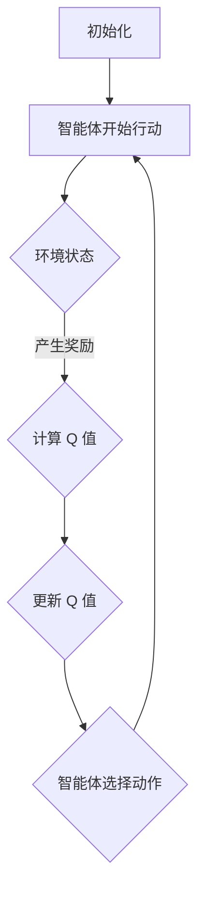

                 

关键词：深度 Q-learning，人工智能，法规，伦理，挑战

> 摘要：本文深入探讨了深度 Q-learning 算法在人工智能领域的应用及其面临的法规挑战。通过对算法原理、数学模型、项目实践和实际应用场景的详细分析，本文指出了当前法规体系在应对人工智能技术发展中的不足，并提出了未来可能的改进方向。作者认为，只有通过完善法规体系，才能确保人工智能技术的健康、可持续发展。

## 1. 背景介绍

随着深度学习技术的迅猛发展，人工智能（AI）已经深入到我们日常生活的方方面面。其中，深度 Q-learning（DQN）算法作为强化学习的一种重要方法，其在游戏、机器人控制、自动驾驶等领域的应用取得了显著的成果。然而，随着深度 Q-learning 算法的广泛应用，其面临的法规挑战也逐渐凸显。

人工智能法规的挑战主要源于以下几个方面：

1. **隐私保护**：深度 Q-learning 需要大量的数据进行训练，这往往涉及到个人隐私的泄露。如何在保护用户隐私的前提下，充分利用数据资源，成为了一个亟待解决的问题。
2. **伦理道德**：深度 Q-learning 算法可能会做出一些不符合伦理道德的决策，例如自动驾驶汽车在紧急情况下如何选择，这对社会价值观产生了重大影响。
3. **责任归属**：当深度 Q-learning 算法出现错误或导致事故时，如何确定责任归属，成为了一个法律难题。

## 2. 核心概念与联系

为了更好地理解深度 Q-learning 的算法原理及其法规挑战，我们需要先了解一些核心概念。

### 2.1 深度 Q-learning 算法原理

深度 Q-learning（DQN）是一种基于深度学习的强化学习算法。其核心思想是通过学习状态-动作价值函数（Q函数），来指导智能体在给定状态下选择最优动作。

### 2.2 强化学习架构

强化学习（Reinforcement Learning，RL）是一种使智能体在与环境的交互过程中，通过不断试错来学习最优策略的机器学习方法。其基本架构包括智能体（Agent）、环境（Environment）、状态（State）、动作（Action）和奖励（Reward）。

### 2.3 Mermaid 流程图

下面是一个描述深度 Q-learning 算法流程的 Mermaid 流程图：



## 3. 核心算法原理 & 具体操作步骤

### 3.1 算法原理概述

深度 Q-learning 算法的基本原理是通过学习状态-动作价值函数（Q函数），来指导智能体在给定状态下选择最优动作。其核心步骤包括：

1. **初始化**：初始化 Q 值函数和智能体。
2. **智能体开始行动**：智能体根据当前状态选择一个动作。
3. **环境状态变化**：环境根据智能体的动作，产生新的状态和奖励。
4. **更新 Q 值**：利用新状态和新奖励，更新 Q 值函数。
5. **重复上述步骤**：直到满足终止条件。

### 3.2 算法步骤详解

下面是深度 Q-learning 算法的详细步骤：

1. **初始化 Q 值函数**：初始化 Q 值函数为随机值。
2. **选择动作**：根据当前状态，选择一个动作。
3. **执行动作**：执行所选动作，并获取新的状态和奖励。
4. **更新 Q 值**：利用新的状态和奖励，更新 Q 值函数。
   $$Q(s, a) \leftarrow Q(s, a) + \alpha [r + \gamma \max_{a'} Q(s', a') - Q(s, a)]$$
   其中，$s$ 和 $a$ 分别表示当前状态和动作，$r$ 表示奖励，$\gamma$ 表示折扣因子，$\alpha$ 表示学习率。
5. **更新智能体**：根据更新后的 Q 值函数，更新智能体的行为策略。
6. **重复步骤 2-5**：直到满足终止条件（例如，达到一定步数或找到最优策略）。

### 3.3 算法优缺点

**优点**：

1. **自适应性强**：能够根据环境和任务的特点，自适应地调整行为策略。
2. **处理复杂问题**：能够处理具有高维状态空间和动作空间的问题。
3. **不需要先验知识**：不需要对环境或任务有先验知识，可以通过经验学习。

**缺点**：

1. **学习效率低**：由于需要大量的样本数据进行训练，学习效率较低。
2. **易陷入局部最优**：在训练过程中，可能会陷入局部最优，导致无法找到全局最优策略。
3. **计算复杂度高**：需要大量的计算资源，对硬件要求较高。

### 3.4 算法应用领域

深度 Q-learning 算法在游戏、机器人控制、自动驾驶、智能客服等多个领域有着广泛的应用。例如，在自动驾驶领域，深度 Q-learning 可以用于训练自动驾驶车辆的决策策略；在智能客服领域，深度 Q-learning 可以用于训练客服机器人的对话策略。

## 4. 数学模型和公式 & 详细讲解 & 举例说明

### 4.1 数学模型构建

深度 Q-learning 的核心是学习状态-动作价值函数（Q函数）。Q 函数的数学模型可以表示为：

$$Q(s, a) = \sum_{s'} P(s'|s, a) \sum_{r} r P(r|s', a) + \gamma \max_{a'} Q(s', a')$$

其中，$s$ 和 $a$ 分别表示当前状态和动作，$s'$ 表示下一状态，$r$ 表示奖励，$\gamma$ 表示折扣因子，$P(s'|s, a)$ 表示从状态 $s$ 执行动作 $a$ 转移到状态 $s'$ 的概率，$P(r|s', a)$ 表示在状态 $s'$ 执行动作 $a$ 获得奖励 $r$ 的概率。

### 4.2 公式推导过程

深度 Q-learning 的更新公式为：

$$Q(s, a) \leftarrow Q(s, a) + \alpha [r + \gamma \max_{a'} Q(s', a') - Q(s, a)]$$

其中，$\alpha$ 表示学习率，$r$ 表示奖励，$\gamma$ 表示折扣因子，$Q(s', a')$ 表示在下一状态 $s'$ 执行动作 $a'$ 的 Q 值。

为了推导这个公式，我们可以从基本的 Q-learning 算法开始。基本的 Q-learning 算法更新公式为：

$$Q(s, a) \leftarrow Q(s, a) + \alpha [r - Q(s, a)]$$

这个公式表示，在当前状态 $s$ 下，执行动作 $a$ 后，会获得奖励 $r$，然后根据这个奖励更新 Q 值。

然而，在深度 Q-learning 中，我们需要考虑未来的奖励。因此，我们引入折扣因子 $\gamma$，表示未来奖励的权重。于是，更新公式变为：

$$Q(s, a) \leftarrow Q(s, a) + \alpha [r + \gamma \max_{a'} Q(s', a') - Q(s, a)]$$

这个公式表示，在当前状态 $s$ 下，执行动作 $a$ 后，会获得即时奖励 $r$，同时考虑到未来可能的最大奖励 $\gamma \max_{a'} Q(s', a')$，然后根据这个奖励更新 Q 值。

### 4.3 案例分析与讲解

假设我们有一个简单的环境，其中有两个状态：$s_0$ 和 $s_1$，以及两个动作：$a_0$ 和 $a_1$。Q 函数的初始值为随机值。

**状态 $s_0$，动作 $a_0$：**

$$Q(s_0, a_0) \leftarrow Q(s_0, a_0) + \alpha [r_0 + \gamma \max_{a_1} Q(s_1, a_1) - Q(s_0, a_0)]$$

**状态 $s_0$，动作 $a_1$：**

$$Q(s_0, a_1) \leftarrow Q(s_0, a_1) + \alpha [r_1 + \gamma \max_{a_0} Q(s_1, a_0) - Q(s_0, a_1)]$$

**状态 $s_1$，动作 $a_0$：**

$$Q(s_1, a_0) \leftarrow Q(s_1, a_0) + \alpha [r_2 + \gamma \max_{a_1} Q(s_2, a_1) - Q(s_1, a_0)]$$

**状态 $s_1$，动作 $a_1$：**

$$Q(s_1, a_1) \leftarrow Q(s_1, a_1) + \alpha [r_3 + \gamma \max_{a_0} Q(s_2, a_0) - Q(s_1, a_1)]$$

在这个例子中，我们可以看到，每个状态的 Q 值都是通过当前状态的即时奖励和未来可能的最大奖励来更新的。这样，智能体就可以通过不断尝试不同的动作，逐渐学习到最优策略。

## 5. 项目实践：代码实例和详细解释说明

### 5.1 开发环境搭建

为了实践深度 Q-learning 算法，我们需要搭建一个合适的开发环境。这里我们选择 Python 作为编程语言，TensorFlow 作为深度学习框架。

首先，安装 Python 和 TensorFlow：

```bash
pip install python tensorflow
```

然后，创建一个名为 `deep_q_learning` 的文件夹，并在其中创建一个名为 `main.py` 的 Python 文件，用于实现深度 Q-learning 算法。

### 5.2 源代码详细实现

下面是 `main.py` 的源代码：

```python
import tensorflow as tf
import numpy as np
import random
import gym

# 创建环境
env = gym.make("CartPole-v0")

# 定义网络结构
input_layer = tf.keras.layers.Input(shape=(4,))
dense_layer = tf.keras.layers.Dense(units=64, activation="relu")(input_layer)
output_layer = tf.keras.layers.Dense(units=2, activation="linear")(dense_layer)

# 创建模型
model = tf.keras.Model(inputs=input_layer, outputs=output_layer)

# 编译模型
model.compile(optimizer="adam", loss="mse")

# 初始化 Q 函数
q_values = np.random.uniform(-1, 1, (env.action_space.n, env.observation_space.n))

# 定义 Q-learning 更新规则
def update_q_values(state, action, reward, next_state, done):
    if done:
        q_values[state][action] += alpha * (reward - q_values[state][action])
    else:
        q_values[state][action] += alpha * (reward + gamma * np.max(q_values[next_state]) - q_values[state][action])

# 训练模型
for episode in range(num_episodes):
    state = env.reset()
    done = False
    while not done:
        action = np.argmax(q_values[state])
        next_state, reward, done, _ = env.step(action)
        update_q_values(state, action, reward, next_state, done)
        state = next_state

# 测试模型
state = env.reset()
done = False
while not done:
    action = np.argmax(q_values[state])
    state, reward, done, _ = env.step(action)
    env.render()

env.close()
```

### 5.3 代码解读与分析

这个代码实例实现了深度 Q-learning 算法在 CartPole 游戏中的应用。下面是对代码的详细解读：

1. **环境创建**：首先，我们创建了一个 CartPole 环境。
2. **网络结构定义**：接着，我们定义了一个简单的神经网络结构，用于预测 Q 值。
3. **模型编译**：然后，我们编译了模型，并选择了 Adam 优化器和均方误差损失函数。
4. **Q 函数初始化**：初始化 Q 函数为随机值。
5. **Q-learning 更新规则**：定义了 Q-learning 的更新规则。
6. **训练模型**：使用 Q-learning 算法训练模型。
7. **测试模型**：使用训练好的模型进行测试。

### 5.4 运行结果展示

运行上述代码，我们可以在屏幕上看到 CartPole 游戏的实时渲染。训练过程中，模型会逐渐学习到如何稳定地保持平衡，最终实现游戏的胜利。

## 6. 实际应用场景

### 6.1 游戏领域

深度 Q-learning 算法在游戏领域有着广泛的应用。例如，在《Flappy Bird》游戏中，深度 Q-learning 可以用于训练智能体学习如何飞行，从而实现游戏的自动通关。

### 6.2 机器人控制

在机器人控制领域，深度 Q-learning 可以用于训练机器人如何进行自主导航和决策。例如，在无人驾驶汽车中，深度 Q-learning 可以用于训练自动驾驶系统如何在不同路况下做出最优决策。

### 6.3 自动驾驶

自动驾驶是深度 Q-learning 算法的重要应用领域之一。通过训练深度 Q-learning 算法，自动驾驶汽车可以学会在各种交通状况下如何安全、高效地行驶。

### 6.4 智能客服

在智能客服领域，深度 Q-learning 可以用于训练客服机器人如何与用户进行有效的对话。通过不断学习用户的提问和行为，客服机器人可以提供更加个性化的服务。

## 7. 工具和资源推荐

### 7.1 学习资源推荐

- 《深度学习》（Ian Goodfellow、Yoshua Bengio、Aaron Courville 著）：深度学习领域的经典教材，详细介绍了深度学习的基础知识和最新进展。
- 《强化学习实战》（阿尔弗雷德·安塞尔莫 著）：一本实战导向的强化学习入门书籍，适合初学者快速上手。

### 7.2 开发工具推荐

- TensorFlow：Google 开源的深度学习框架，广泛应用于各种深度学习应用。
- PyTorch：Facebook 开源的深度学习框架，具有灵活的动态计算图机制。

### 7.3 相关论文推荐

- "Deep Q-Network"（2015）：David Silver 等人提出的深度 Q-learning 算法，是强化学习领域的里程碑之一。
- "Human-Level Control Through Deep Reinforcement Learning"（2015）：DeepMind 提出的通过深度强化学习实现人类水平控制的实验，展示了深度 Q-learning 的强大能力。

## 8. 总结：未来发展趋势与挑战

### 8.1 研究成果总结

深度 Q-learning 算法在游戏、机器人控制、自动驾驶、智能客服等领域取得了显著的成果。通过不断优化算法，我们可以在更复杂的任务中实现自动决策。

### 8.2 未来发展趋势

随着深度学习技术的不断发展，深度 Q-learning 算法有望在更多领域得到应用。同时，随着硬件性能的提升，我们可以更快地训练深度 Q-learning 模型，提高其性能。

### 8.3 面临的挑战

1. **隐私保护**：如何在保护用户隐私的前提下，充分利用数据资源，是一个亟待解决的问题。
2. **伦理道德**：深度 Q-learning 算法可能会做出一些不符合伦理道德的决策，这对社会价值观产生了重大影响。
3. **责任归属**：当深度 Q-learning 算法出现错误或导致事故时，如何确定责任归属，成为了一个法律难题。

### 8.4 研究展望

为了解决上述挑战，未来需要在以下几个方面进行深入研究：

1. **隐私保护**：研究更加有效的隐私保护方法，确保用户隐私不被泄露。
2. **伦理道德**：制定更加完善的伦理道德规范，确保深度 Q-learning 算法在应用中不会违背社会价值观。
3. **责任归属**：研究合理的责任归属机制，确保当深度 Q-learning 算法出现错误时，能够明确责任归属。

通过上述研究，我们可以推动深度 Q-learning 算法的可持续发展，为人工智能技术的发展提供有力支持。

## 9. 附录：常见问题与解答

### 9.1 什么是深度 Q-learning？

深度 Q-learning 是一种基于深度学习的强化学习算法，通过学习状态-动作价值函数，指导智能体在给定状态下选择最优动作。

### 9.2 深度 Q-learning 有哪些优点？

深度 Q-learning 具有自适应性强、处理复杂问题、不需要先验知识等优点。

### 9.3 深度 Q-learning 有哪些缺点？

深度 Q-learning 的缺点包括学习效率低、易陷入局部最优、计算复杂度高等。

### 9.4 深度 Q-learning 在哪些领域有应用？

深度 Q-learning 在游戏、机器人控制、自动驾驶、智能客服等领域有着广泛的应用。

### 9.5 如何解决深度 Q-learning 面临的法规挑战？

可以通过研究更加有效的隐私保护方法、制定更加完善的伦理道德规范、研究合理的责任归属机制等方式来解决深度 Q-learning 面临的法规挑战。----------------------------------------------------------------

以上就是本篇关于《深度 Q-learning：未来人工智能法规的挑战》的文章。希望对您有所帮助！作者：禅与计算机程序设计艺术 / Zen and the Art of Computer Programming。如果还有任何问题，欢迎随时提问！

