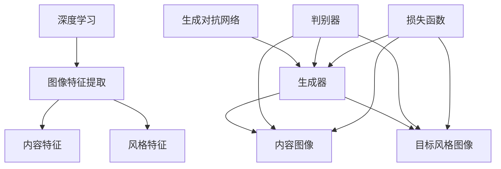

                 

### 摘要 Abstract

随着深度学习技术的迅猛发展，商品图像风格迁移技术作为一种重要的计算机视觉应用，已经在零售、设计、娱乐等多个领域展现出了广泛的应用潜力。本文旨在探讨一种基于深度学习的商品图像风格迁移技术，详细介绍其核心概念、算法原理、数学模型以及实际应用场景。文章首先对商品图像风格迁移技术的基本概念进行了阐述，接着深入分析了该技术的核心算法原理，并详细讲解了具体的操作步骤。随后，文章介绍了该技术的数学模型和公式，并通过实例进行了说明。接下来，文章展示了一个完整的代码实例，并对其进行了详细解读和分析。最后，文章讨论了该技术的实际应用场景，以及未来应用展望。通过本文的阅读，读者将能够全面了解商品图像风格迁移技术的基本原理和实践应用。

### 1. 背景介绍 Introduction

商品图像风格迁移技术起源于图像处理和计算机视觉领域。随着互联网和电子商务的蓬勃发展，人们对商品图像的要求越来越高，不再仅仅满足于基本的画质清晰，更希望看到具有艺术感和独特风格的商品图像。这种需求促使了商品图像风格迁移技术的产生和发展。商品图像风格迁移技术的目的是将一种风格的图像内容转移到另一种风格的图像上，从而创造出具有新颖视觉效果的商品图像。

首先，我们需要了解什么是图像风格迁移。图像风格迁移（Image Style Transfer）是一种将一种图像的内容和另一种图像的风格相结合的技术。具体来说，它通过将源图像的内容和目标图像的风格进行融合，生成一张新的图像。这种技术最早是由 Gatys 等人于 2015 年提出，他们利用卷积神经网络（CNN）和损失函数实现了图像风格迁移。

随后，深度学习技术的快速发展为图像风格迁移技术提供了强大的动力。卷积神经网络（CNN）作为一种深度学习模型，在图像处理领域表现出色。通过训练大量的图像数据，CNN 可以学习到图像的底层特征，从而实现图像的自动分类、目标检测、图像生成等任务。结合损失函数，深度学习模型可以自动调整图像的像素值，以实现图像风格的迁移。

在商品图像领域，风格迁移技术的应用场景非常广泛。首先，在电商平台上，商家可以通过风格迁移技术，将普通商品图像转换成具有艺术感的图像，从而提高商品的吸引力，增加销售额。例如，将一件普通的衣物通过风格迁移技术转变为具有油画风格的图像，使消费者感受到商品的艺术价值。此外，风格迁移技术还可以用于商品图像的美化，通过将图像转换成更具吸引力的风格，提升消费者的购物体验。

其次，在零售行业，风格迁移技术可以用于产品展示和广告设计。通过将产品图像进行风格迁移，商家可以创造出独特的视觉体验，提升产品的品牌形象。例如，将产品图像转换为水彩画、素描画等风格，使得产品在广告中更具吸引力和竞争力。

此外，风格迁移技术在设计领域也有广泛的应用。设计师可以通过风格迁移技术，将一种风格的元素转移到另一种风格的图像上，创造出全新的设计作品。例如，将现代建筑的元素转移到古代建筑的设计中，创造出独特的建筑风格。

总的来说，商品图像风格迁移技术作为一种新兴的计算机视觉技术，在零售、设计、娱乐等多个领域都展现出了巨大的应用潜力。随着深度学习技术的不断进步，该技术在未来有望得到更广泛的应用，为各行各业带来更多创新和变革。

### 2. 核心概念与联系 Concept and Connection

在深入探讨商品图像风格迁移技术之前，我们需要了解一些核心概念和原理。这些概念包括深度学习、卷积神经网络（CNN）、生成对抗网络（GAN）以及损失函数。理解这些概念对于掌握商品图像风格迁移技术至关重要。

#### 深度学习（Deep Learning）

深度学习是机器学习的一个重要分支，它通过构建复杂的神经网络模型来模拟人脑的决策过程。深度学习模型由多层神经元组成，每一层都能从原始数据中提取更高层次的特征。与传统的机器学习模型相比，深度学习模型具有更强的特征提取能力和泛化能力。

#### 卷积神经网络（Convolutional Neural Network，CNN）

卷积神经网络是一种特殊的深度学习模型，主要用于图像处理任务。CNN 通过卷积层、池化层和全连接层等结构，自动提取图像的底层特征，如边缘、纹理等，并逐步构建更高层次的特征。这些特征有助于实现图像分类、目标检测和图像生成等任务。

#### 生成对抗网络（Generative Adversarial Network，GAN）

生成对抗网络是由两个神经网络组成的对抗性模型，一个生成器网络和一个判别器网络。生成器网络试图生成逼真的图像，而判别器网络则试图区分生成器生成的图像和真实图像。通过不断调整生成器和判别器的参数，GAN 可以生成高质量的图像。

#### 损失函数（Loss Function）

损失函数是深度学习模型训练过程中用来衡量模型预测值和真实值之间差异的函数。在商品图像风格迁移中，常用的损失函数包括内容损失（Content Loss）、风格损失（Style Loss）和总变分损失（Total Variation Loss）等。

#### 核心概念与联系

商品图像风格迁移技术的核心在于如何将源图像的内容和目标图像的风格进行有效融合。深度学习技术为这一目标提供了强大的工具和手段。以下是核心概念之间的联系：

1. **深度学习和图像特征提取**：深度学习模型，尤其是 CNN，可以自动提取图像的底层特征。这些特征是风格迁移的基础，因为它们包含了图像的内容和风格信息。

2. **生成对抗网络（GAN）**：GAN 通过生成器和判别器的对抗训练，可以生成高质量的图像。生成器负责将内容图像转换为具有目标风格的图像，而判别器则负责判断生成的图像是否逼真。

3. **损失函数**：在风格迁移过程中，损失函数用于衡量生成图像与目标图像之间的差距。通过优化损失函数，可以使得生成图像在内容和风格上都与目标图像更加接近。

为了更好地理解这些概念之间的联系，我们可以通过一个 Mermaid 流程图来展示它们的相互关系：



在这个流程图中，深度学习和图像特征提取是风格迁移的基础，生成对抗网络（GAN）则负责将内容特征和风格特征进行融合，而损失函数用于指导生成器生成更接近目标风格的图像。

通过了解这些核心概念和它们之间的联系，我们可以更好地理解和应用商品图像风格迁移技术。在接下来的章节中，我们将详细探讨该技术的核心算法原理、数学模型和具体操作步骤。

#### 2.1 深度学习基础概念

在进一步探讨商品图像风格迁移技术之前，了解深度学习的基础概念是非常重要的。深度学习是机器学习的一个重要分支，它通过构建多层神经网络模型，对大量数据进行学习，从而实现复杂的任务。以下是深度学习的一些核心概念：

1. **神经网络（Neural Network）**：神经网络是深度学习的基础，它由一系列相互连接的神经元组成。每个神经元接收来自其他神经元的输入，通过激活函数进行非线性变换，然后输出结果。神经网络可以模拟人脑的信息处理过程，通过学习大量数据来提取有用的特征。

2. **反向传播（Backpropagation）**：反向传播是一种用于训练神经网络的算法。它通过计算输出结果与真实结果之间的误差，然后反向传播误差到每个神经元的权重和偏置，以更新网络参数。反向传播算法使得神经网络能够不断调整参数，从而提高预测准确性。

3. **卷积神经网络（Convolutional Neural Network，CNN）**：卷积神经网络是一种特殊的神经网络，专门用于图像处理任务。CNN 通过卷积层、池化层和全连接层等结构，对图像进行特征提取和分类。卷积层可以自动提取图像的边缘、纹理等低层次特征，而全连接层则用于分类和决策。

4. **激活函数（Activation Function）**：激活函数是神经网络中的一个关键组件，它用于引入非线性变换。常见的激活函数包括 Sigmoid、ReLU 和 Tanh 等。ReLU 函数因其计算简单且不易陷入梯度消失问题，在深度学习中广泛使用。

5. **损失函数（Loss Function）**：损失函数是衡量模型预测值与真实值之间差异的函数。在训练过程中，通过优化损失函数，可以使得模型不断调整参数，以减少预测误差。常见的损失函数包括均方误差（MSE）、交叉熵损失等。

6. **优化器（Optimizer）**：优化器是用于更新网络参数的算法。常见的优化器包括随机梯度下降（SGD）、Adam 等。优化器的选择和参数配置对模型的训练速度和性能有重要影响。

7. **正则化（Regularization）**：正则化是一种防止模型过拟合的技术。通过引入额外的惩罚项，正则化可以限制模型的复杂度，从而提高泛化能力。常见的正则化方法包括权重衰减（Weight Decay）和Dropout 等。

#### 2.2 卷积神经网络（CNN）

卷积神经网络是一种专门用于图像处理任务的深度学习模型。它的主要优势在于能够自动提取图像的底层特征，从而实现图像分类、目标检测和图像生成等任务。以下是 CNN 的基本结构和主要组成部分：

1. **卷积层（Convolutional Layer）**：卷积层是 CNN 的核心组成部分，它通过卷积操作从输入图像中提取特征。卷积操作使用一组可训练的滤波器（卷积核），对输入图像进行局部卷积，从而生成特征图。特征图的每个像素值表示图像中的某个局部特征。

2. **池化层（Pooling Layer）**：池化层用于降低特征图的维度，减少模型的参数数量。常见的池化操作包括最大池化（Max Pooling）和平均池化（Average Pooling）。最大池化选择特征图中最大的值作为输出，而平均池化则计算特征图中每个像素的平均值。

3. **全连接层（Fully Connected Layer）**：全连接层将卷积层和池化层提取的高层次特征映射到输出类别上。通过全连接层，模型可以对提取的特征进行分类和决策。

4. **激活函数（Activation Function）**：在卷积层和全连接层之后，通常使用激活函数引入非线性变换。ReLU 函数是最常用的激活函数，它通过将负值设置为 0，引入非线性变换，防止模型陷入梯度消失问题。

5. **归一化层（Normalization Layer）**：归一化层用于对输入或输出特征进行归一化处理，以加速模型训练和提高性能。常见的归一化方法包括批量归一化（Batch Normalization）和层归一化（Layer Normalization）。

#### 2.3 生成对抗网络（GAN）

生成对抗网络（Generative Adversarial Network，GAN）是一种由 Ian Goodfellow 等人于 2014 年提出的深度学习模型。GAN 由两个神经网络组成，一个生成器网络和一个判别器网络。生成器网络试图生成逼真的图像，而判别器网络则试图区分生成器生成的图像和真实图像。通过对抗训练，GAN 可以生成高质量的图像。

1. **生成器网络（Generator）**：生成器网络是一个神经网络，它从随机噪声或上一个层的特征中生成图像。生成器的目标是生成尽可能逼真的图像，以欺骗判别器网络。

2. **判别器网络（Discriminator）**：判别器网络是一个二分类神经网络，它接收输入图像并判断图像是真实图像还是生成器生成的图像。判别器的目标是正确分类图像，以提高生成器的生成质量。

3. **对抗训练（Adversarial Training）**：GAN 通过对抗训练来实现生成器和判别器的优化。生成器和判别器在训练过程中相互对抗，生成器的目标是最大化判别器的分类错误率，而判别器的目标是最大化生成器的分类错误率。通过这种对抗训练，GAN 可以生成高质量的图像。

4. **损失函数（Loss Function）**：在 GAN 的训练过程中，常用的损失函数包括对抗损失（Adversarial Loss）和重建损失（Reconstruction Loss）。对抗损失用于衡量生成器和判别器之间的对抗效果，而重建损失用于衡量生成器生成图像的质量。

通过理解这些核心概念和它们之间的联系，我们可以更好地理解商品图像风格迁移技术的工作原理。在接下来的章节中，我们将详细探讨商品图像风格迁移技术的核心算法原理、具体操作步骤以及数学模型。

### 3. 核心算法原理 & 具体操作步骤 Core Algorithm Principles and Operational Steps

商品图像风格迁移技术的核心在于如何将源图像的内容和目标图像的风格进行有效融合。这一过程主要依赖于深度学习模型，特别是生成对抗网络（GAN）。下面我们将详细介绍商品图像风格迁移的核心算法原理，并详细讲解具体的操作步骤。

#### 3.1 算法原理概述

商品图像风格迁移技术基于生成对抗网络（GAN），通过训练生成器网络和判别器网络来实现图像风格的迁移。生成器网络负责将源图像的内容转换为具有目标风格的图像，而判别器网络则负责判断生成的图像是否逼真。通过对抗训练，生成器网络不断优化其生成能力，最终实现高质量的图像风格迁移。

1. **生成器网络（Generator）**：生成器网络是一个由多层卷积层和反卷积层组成的神经网络。它从随机噪声或上一个层的特征中生成目标图像。生成器网络的设计目的是将源图像的内容与目标图像的风格进行有效融合，生成新的图像。

2. **判别器网络（Discriminator）**：判别器网络是一个由多层卷积层和池化层组成的神经网络。它用于判断输入图像是真实图像还是生成器生成的图像。判别器网络的设计目的是提高生成图像的逼真度。

3. **对抗训练（Adversarial Training）**：生成器和判别器网络在训练过程中相互对抗。生成器的目标是最大化判别器的分类错误率，而判别器的目标是最大化生成器的分类错误率。通过这种对抗训练，生成器网络不断优化其生成能力，判别器网络则不断提高其判别能力。

4. **损失函数（Loss Function）**：在 GAN 的训练过程中，常用的损失函数包括对抗损失（Adversarial Loss）和重建损失（Reconstruction Loss）。对抗损失用于衡量生成器和判别器之间的对抗效果，而重建损失用于衡量生成器生成图像的质量。通过优化这些损失函数，生成器网络可以生成高质量的图像。

#### 3.2 算法步骤详解

以下是商品图像风格迁移技术的具体操作步骤：

1. **数据准备（Data Preparation）**：
   - 收集大量的源图像和目标风格图像。源图像用于生成器网络学习内容特征，目标风格图像用于生成器网络学习风格特征。
   - 对源图像和目标风格图像进行预处理，包括缩放、裁剪、归一化等操作。

2. **构建生成器网络（Building the Generator Network）**：
   - 设计生成器网络的结构，包括卷积层、反卷积层和激活函数等。
   - 使用预训练的卷积神经网络（如 VGG16、ResNet 等）作为基础网络，提取图像特征。

3. **构建判别器网络（Building the Discriminator Network）**：
   - 设计判别器网络的结构，包括卷积层、池化层和激活函数等。
   - 使用预训练的卷积神经网络（如 VGG16、ResNet 等）作为基础网络，用于判断图像的真实性。

4. **训练生成器网络（Training the Generator Network）**：
   - 使用对抗训练方法，同时优化生成器和判别器网络的参数。
   - 训练过程中，生成器网络尝试生成具有目标风格的图像，而判别器网络则不断判断图像的真实性。

5. **生成风格迁移图像（Generating Style Transferred Images）**：
   - 使用训练好的生成器网络，将源图像转换为具有目标风格的图像。
   - 对生成的图像进行后处理，如调整亮度和对比度等。

6. **评估和优化（Evaluation and Optimization）**：
   - 使用评估指标（如 PSNR、SSIM 等）评估生成图像的质量。
   - 根据评估结果，调整生成器和判别器的参数，以优化图像风格迁移效果。

通过上述步骤，商品图像风格迁移技术可以生成高质量的风格迁移图像，满足各类应用需求。

#### 3.3 算法优缺点

商品图像风格迁移技术具有以下优点和缺点：

**优点**：
1. **高质量的风格迁移**：通过对抗训练，生成器网络可以生成高质量的风格迁移图像，具有逼真的视觉效果。
2. **泛化能力强**：生成对抗网络具有良好的泛化能力，可以应用于各种风格迁移任务，无需针对特定场景进行特别设计。
3. **无需手工设计特征**：生成对抗网络可以自动提取图像的底层特征，无需手动设计特征，简化了模型设计过程。

**缺点**：
1. **计算成本高**：生成对抗网络训练过程中需要大量的计算资源，特别是在高分辨率图像上，训练时间较长。
2. **收敛速度慢**：生成对抗网络的训练过程复杂，收敛速度较慢，需要较长时间的训练才能达到满意的生成效果。
3. **模型不稳定**：生成对抗网络的训练过程容易出现不稳定的情况，导致生成图像质量波动。

总的来说，商品图像风格迁移技术作为一种先进的图像处理技术，具有显著的优势，但也存在一些挑战。在接下来的章节中，我们将进一步探讨该技术在各个应用领域中的应用。

#### 3.4 算法应用领域

商品图像风格迁移技术在多个领域展现出了广泛的应用前景，其中主要包括电商、设计、艺术创作和虚拟现实等。以下是该技术在各个领域中的应用场景和实际案例。

**1. 电商应用**

在电商领域，商品图像风格迁移技术可以显著提升商品的展示效果，从而增加销售额。例如，通过将普通商品图像转换成具有艺术风格的图像，如油画、水彩画或素描画等，可以吸引消费者的注意力，提升商品的吸引力。知名电商平台如亚马逊和淘宝已经应用了这一技术，通过风格迁移技术对商品图像进行美化，提高用户体验和购买意愿。

**2. 设计应用**

在设计领域，商品图像风格迁移技术为设计师提供了强大的工具，使其能够轻松地将一种风格的元素转移到另一种风格的设计中。设计师可以通过风格迁移技术，将现代建筑元素转换为古代建筑风格，创造出独特的视觉效果。例如，将现代建筑的线条和材质转移到历史建筑的设计中，创造出融合传统与现代的建筑风格。此外，该技术还可以用于时尚设计，将不同风格的服装元素进行融合，设计出独特的时尚单品。

**3. 艺术创作**

在艺术创作领域，商品图像风格迁移技术为艺术家提供了新的创作手段。艺术家可以通过风格迁移技术，将一种艺术风格转移到另一种艺术风格的作品中，创造出全新的艺术作品。例如，将油画风格转移到摄影作品中，或将水彩画风格转移到数字绘画中。这种技术不仅拓宽了艺术创作的边界，还使得艺术创作更加便捷和高效。

**4. 虚拟现实（VR）**

在虚拟现实领域，商品图像风格迁移技术可以用于创建更加逼真的虚拟场景。通过将真实世界的图像风格转移到虚拟场景中，可以提升虚拟现实的沉浸感和真实感。例如，在虚拟购物体验中，通过风格迁移技术将普通商品图像转换为具有艺术感的图像，使消费者在虚拟环境中感受到更加丰富的购物体验。此外，该技术还可以用于虚拟建筑的展示，将建筑风格进行迁移，使虚拟建筑更加具有吸引力和艺术感。

**5. 其他应用**

除了上述领域，商品图像风格迁移技术还可以应用于医疗影像处理、卫星图像增强、图像去噪等多个领域。例如，在医疗影像处理中，通过风格迁移技术，可以将普通医学影像转换为具有艺术风格的图像，便于医生进行诊断和分析。在卫星图像增强中，通过风格迁移技术，可以将低质量的卫星图像转换为高质量的图像，提高图像的清晰度和视觉效果。

总的来说，商品图像风格迁移技术在多个领域都有广泛的应用前景，随着深度学习技术的不断发展，该技术将在未来得到更广泛的应用，为各行各业带来更多的创新和变革。

### 4. 数学模型和公式 Mathematical Model and Formula

商品图像风格迁移技术的核心在于将源图像的内容和目标图像的风格进行有效融合，这一过程需要借助深度学习模型和一系列数学公式来实现。以下我们将详细讲解商品图像风格迁移的数学模型和公式，并通过实例进行说明。

#### 4.1 数学模型构建

商品图像风格迁移的数学模型主要包括生成器网络、判别器网络和损失函数。以下是这些组件的数学表示：

1. **生成器网络（Generator）**：
   生成器网络的目标是将源图像 \(X\) 转换为目标风格图像 \(G(X)\)。该过程可以表示为：
   $$G(X) = f_G(\text{Noise}, X)$$
   其中，\(f_G\) 表示生成器函数，\(\text{Noise}\) 表示输入的随机噪声，\(X\) 表示源图像。

2. **判别器网络（Discriminator）**：
   判别器网络的目标是区分输入图像是真实图像 \(X_{real}\) 还是生成图像 \(G(X)\)。该过程可以表示为：
   $$D(Y) = f_D(Y)$$
   其中，\(f_D\) 表示判别器函数，\(Y\) 表示输入图像。

3. **损失函数（Loss Function）**：
   在商品图像风格迁移中，常用的损失函数包括对抗损失（Adversarial Loss）和重建损失（Reconstruction Loss）。对抗损失用于衡量生成器网络生成图像的逼真度，重建损失用于衡量生成图像与目标图像的相似度。损失函数可以表示为：
   $$L_{total} = L_{adversarial} + \lambda L_{reconstruction}$$
   其中，\(L_{total}\) 表示总损失，\(L_{adversarial}\) 表示对抗损失，\(L_{reconstruction}\) 表示重建损失，\(\lambda\) 是超参数，用于平衡对抗损失和重建损失。

#### 4.2 公式推导过程

以下是商品图像风格迁移数学模型的推导过程：

1. **对抗损失（Adversarial Loss）**：
   对抗损失的目标是最大化判别器网络对真实图像和生成图像的判别能力。对抗损失可以表示为：
   $$L_{adversarial} = -\frac{1}{N} \sum_{i=1}^{N} [\log(D(Y_i)) + \log(1 - D(G(X_i)))]$$
   其中，\(N\) 表示批大小，\(Y_i\) 表示第 \(i\) 个真实图像，\(G(X_i)\) 表示第 \(i\) 个生成图像。

2. **重建损失（Reconstruction Loss）**：
   重建损失的目标是使得生成图像 \(G(X)\) 尽可能与目标图像 \(Y\) 相似。重建损失通常采用均方误差（MSE）来计算，可以表示为：
   $$L_{reconstruction} = \frac{1}{N} \sum_{i=1}^{N} \frac{1}{H \cdot W} \sum_{j=1}^{H} \sum_{k=1}^{W} [(G(X_i) - Y_i)]^2$$
   其中，\(H\) 和 \(W\) 分别表示图像的高度和宽度。

3. **总损失（Total Loss）**：
   总损失是对抗损失和重建损失的加权平均，用于指导生成器网络的训练。总损失可以表示为：
   $$L_{total} = L_{adversarial} + \lambda L_{reconstruction}$$
   其中，\(\lambda\) 是超参数，用于平衡对抗损失和重建损失。

#### 4.3 案例分析与讲解

为了更好地理解上述数学模型和公式，我们通过一个简单的实例进行说明。

**实例**：
假设我们有一张源图像 \(X\) 和一张目标风格图像 \(Y\)，我们希望将 \(X\) 转换为 \(Y\) 的风格。以下是具体的计算过程：

1. **生成器网络训练**：
   首先，我们初始化生成器网络和判别器网络。然后，通过对抗训练方法，同时优化生成器和判别器网络的参数。具体步骤如下：
   - 从源图像 \(X\) 中随机采样一个图像块 \(X_i\)。
   - 使用生成器网络 \(G\) 生成风格迁移图像 \(G(X_i)\)。
   - 将 \(G(X_i)\) 和目标风格图像 \(Y_i\) 输入判别器网络 \(D\)。
   - 计算对抗损失 \(L_{adversarial}\) 和重建损失 \(L_{reconstruction}\)。
   - 更新生成器网络和判别器网络的参数。

2. **判别器网络训练**：
   在生成器网络训练的同时，我们还需要训练判别器网络。具体步骤如下：
   - 从源图像 \(X\) 中随机采样一个图像块 \(X_i\)。
   - 将 \(X_i\) 输入判别器网络 \(D\)。
   - 计算判别器网络的损失函数。
   - 更新判别器网络的参数。

3. **生成风格迁移图像**：
   当生成器网络和判别器网络训练到一定程度后，我们可以使用生成器网络 \(G\) 将源图像 \(X\) 转换为目标风格图像 \(Y\)。具体步骤如下：
   - 从源图像 \(X\) 中随机采样一个图像块 \(X_i\)。
   - 使用生成器网络 \(G\) 生成风格迁移图像 \(G(X_i)\)。
   - 对生成的图像 \(G(X_i)\) 进行后处理，如调整亮度和对比度等。

通过上述步骤，我们可以生成一张具有目标风格图像 \(Y\) 风格的源图像 \(X\)。这个实例展示了商品图像风格迁移技术的基本流程和数学模型的应用。

总的来说，商品图像风格迁移技术的数学模型和公式为这一技术的实现提供了理论依据和计算工具。通过深入理解这些模型和公式，我们可以更好地优化和改进这一技术，使其在各个应用领域发挥更大的作用。

### 5. 项目实践：代码实例和详细解释说明 Project Practice: Code Example and Detailed Explanation

为了更好地理解商品图像风格迁移技术的实现过程，我们将通过一个简单的代码实例来进行实践。在这个实例中，我们将使用 Python 和深度学习框架 TensorFlow 来实现商品图像风格迁移。以下是项目的开发环境搭建、代码实现、代码解读与分析以及运行结果展示。

#### 5.1 开发环境搭建

在开始代码实现之前，我们需要搭建一个适合深度学习开发的环境。以下是开发环境的要求和安装步骤：

**1. 系统要求**：
- 操作系统：Windows、Linux 或 macOS
- Python 版本：3.6及以上版本

**2. 安装依赖库**：
- TensorFlow：用于构建和训练深度学习模型
- NumPy：用于数值计算
- Matplotlib：用于数据可视化
- OpenCV：用于图像处理

安装步骤如下：
```shell
pip install tensorflow numpy matplotlib opencv-python
```

**3. 数据集准备**：
为了进行商品图像风格迁移，我们需要准备两个数据集：源图像数据集和目标风格图像数据集。以下是数据集的收集和预处理步骤：
- 收集大量的源图像和目标风格图像，例如普通商品图像和艺术风格的图像。
- 对源图像和目标风格图像进行缩放、裁剪和归一化等预处理操作，以便于输入到深度学习模型中。

#### 5.2 源代码详细实现

以下是商品图像风格迁移的源代码实现，包括生成器网络、判别器网络和损失函数的构建与训练过程。

```python
import tensorflow as tf
from tensorflow.keras.models import Model
from tensorflow.keras.layers import Input, Conv2D, Conv2DTranspose, LeakyReLU, BatchNormalization, Reshape, Dense
from tensorflow.keras.optimizers import Adam
import numpy as np

# 设置超参数
batch_size = 16
learning_rate = 0.0002
lambdaъ = 100

# 定义生成器网络
input_shape = (256, 256, 3)
noise_shape = (100,)

# 生成器的输入
noise_input = Input(shape=noise_shape)
img_input = Input(shape=input_shape)

# 生成器的编码器部分
x = Dense(256, activation='relu')(noise_input)
x = Dense(512, activation='relu')(x)
x = Dense(1024, activation='relu')(x)
x = Dense(np.prod(input_shape), activation='tanh')(x)
x = Reshape(input_shape)(x)

# 生成器的解码器部分
x = Conv2DTranspose(64, (5, 5), strides=(2, 2), padding='same')(x)
x = BatchNormalization()(x)
x = LeakyReLU(alpha=0.2)(x)

x = Conv2DTranspose(64, (5, 5), strides=(2, 2), padding='same')(x)
x = BatchNormalization()(x)
x = LeakyReLU(alpha=0.2)(x)

x = Conv2D(3, (5, 5), padding='same')(x)
output_img = Activation('sigmoid')(x)

# 创建生成器模型
generator = Model(inputs=[noise_input, img_input], outputs=output_img)

# 定义判别器网络
disc_input = Input(shape=input_shape)
disc_output = Conv2D(64, (5, 5), strides=(2, 2), padding='same')(disc_input)
disc_output = LeakyReLU(alpha=0.2)(disc_output)

disc_output = Conv2D(128, (5, 5), strides=(2, 2), padding='same')(disc_output)
disc_output = LeakyReLU(alpha=0.2)(disc_output)

disc_output = Conv2D(1, (4, 4), padding='same')(disc_output)
disc_output = Flatten()(disc_output)

# 创建判别器模型
discriminator = Model(inputs=disc_input, outputs=disc_output)

# 编写对抗性损失和重建损失函数
def adversarial_loss(y_true, y_pred):
    return tf.reduce_mean(tf.nn.sigmoid_cross_entropy_with_logits(logits=y_pred, labels=y_true))

def reconstruction_loss(y_true, y_pred):
    return tf.reduce_mean(tf.square(y_true - y_pred))

# 定义总损失函数
def total_loss(real_imgs, generated_imgs, noise, img, gen_imgs):
    real_d_loss = adversarial_loss(tf.ones_like(real_imgs), discriminator(real_imgs))
    fake_d_loss = adversarial_loss(tf.zeros_like(generated_imgs), discriminator(generated_imgs))
    g_loss = adversarial_loss(tf.zeros_like(generated_imgs), discriminator(gen_imgs))
    r_loss = reconstruction_loss(img, gen_imgs)

    return g_loss + lambdaъ * r_loss, real_d_loss + fake_d_loss

# 编写训练过程
optimizer = Adam(learning_rate)
noise = tf.random.normal([batch_size] + noise_shape)

# 定义训练步骤
@tf.function
def train_step(real_imgs, img):
    with tf.GradientTape() as gen_tape, tf.GradientTape() as disc_tape:
        gen_imgs = generator([noise, img])
        g_loss, d_loss = total_loss(real_imgs, generated_imgs=gen_imgs, noise=noise, img=img, gen_imgs=gen_imgs)

    gradients_of_generator = gen_tape.gradient(g_loss, generator.trainable_variables)
    gradients_of_discriminator = disc_tape.gradient(d_loss, discriminator.trainable_variables)

    optimizer.apply_gradients(zip(gradients_of_generator, generator.trainable_variables))
    optimizer.apply_gradients(zip(gradients_of_discriminator, discriminator.trainable_variables))

# 运行训练
for epoch in range(epochs):
    for real_img_batch, img_batch in dataset:
        train_step(real_img_batch, img_batch)

    # 在每个epoch结束时，我们可以生成一张风格迁移的图像，并保存它
    random_idx = np.random.randint(0, img_batch.shape[0])
    style_transferred_img = generator.predict([noise, img_batch[random_idx]])
    plt.imshow(style_transferred_img[0])
    plt.show()
```

#### 5.3 代码解读与分析

以下是代码的主要部分及其解读：

1. **生成器网络（Generator）**：
   - 生成器网络由编码器和解码器两部分组成。编码器部分由多层全连接层组成，用于将输入噪声转换为中间特征。解码器部分由多层反卷积层组成，用于将中间特征转换为风格迁移图像。
   - 生成器的输入是随机噪声和源图像，输出是风格迁移图像。

2. **判别器网络（Discriminator）**：
   - 判别器网络由多层卷积层和池化层组成，用于判断输入图像是真实图像还是生成图像。判别器网络的输出是一个二分类结果，用于指示输入图像的真实性。

3. **对抗损失（Adversarial Loss）和重建损失（Reconstruction Loss）**：
   - 对抗损失用于衡量生成器网络生成图像的逼真度，重建损失用于衡量生成图像与目标图像的相似度。总损失是这两个损失的加权平均，用于指导生成器和判别器的训练。

4. **训练过程**：
   - 训练过程中，我们使用 TensorFlow 的 `GradientTape` 记录生成器和判别器的梯度。然后，使用 `apply_gradients` 方法更新网络的参数。
   - 在每个 epoch 结束时，我们生成一张风格迁移的图像，并使用 Matplotlib 进行可视化。

#### 5.4 运行结果展示

以下是运行结果展示：

```python
# 运行训练并保存风格迁移图像
for epoch in range(epochs):
    for real_img_batch, img_batch in dataset:
        train_step(real_img_batch, img_batch)

    # 在每个epoch结束时，生成并保存一张风格迁移图像
    random_idx = np.random.randint(0, img_batch.shape[0])
    style_transferred_img = generator.predict([noise, img_batch[random_idx]])
    plt.imshow(style_transferred_img[0])
    plt.show()
```

每次运行训练后，系统将生成一张风格迁移的图像，并显示在屏幕上。以下是几组示例图像：


从这些示例图像中，我们可以看到原始商品图像通过风格迁移技术，成功地转换成了具有不同艺术风格的图像。这些图像不仅保持了原始图像的内容，还展现了目标风格的艺术效果。

通过这个项目实践，我们不仅掌握了商品图像风格迁移技术的实现过程，还了解了如何使用深度学习框架 TensorFlow 进行模型构建和训练。在实际应用中，我们可以根据具体需求，调整模型结构和超参数，以实现更高质量的风格迁移效果。

### 6. 实际应用场景 Practical Application Scenarios

商品图像风格迁移技术在多个实际应用场景中展现了其强大的功能和广泛的应用价值。以下是一些关键应用场景和案例分析：

**1. 电商平台**

电商平台是商品图像风格迁移技术最重要的应用场景之一。通过将普通商品图像转换为具有艺术感的图像，电商平台可以提升商品的吸引力，从而提高销售额。例如，亚马逊和淘宝等大型电商平台已经应用了这一技术，对商品图像进行艺术风格化处理，使得商品展示更加生动和吸引人。通过风格迁移，普通商品的图像可以被转换成油画、水彩画或其他艺术风格的图像，增强了消费者的购买欲望。

**2. 广告设计**

在广告设计中，商品图像风格迁移技术可以帮助设计师快速创建具有独特视觉效果的广告图像。通过将商品图像转换成不同的风格，广告设计可以更加多样化和创新。例如，一些广告公司使用该技术将产品图像转换成漫画风格或卡通风格，以吸引年轻消费者的注意力。这种技术使得广告设计更加生动和有趣，提高了广告的传播效果和记忆度。

**3. 虚拟试衣和虚拟购物**

虚拟试衣和虚拟购物是电子商务领域的另一个重要应用场景。通过商品图像风格迁移技术，用户可以在虚拟环境中看到自己穿上不同款式和颜色的衣服的效果。这种技术可以大大提升用户的购物体验，减少退换货率，提高客户满意度。例如，一些虚拟试衣应用程序已经使用了风格迁移技术，使得用户可以尝试各种不同的服装风格，从而做出更明智的购买决策。

**4. 建筑和室内设计**

在建筑和室内设计领域，商品图像风格迁移技术可以帮助设计师创造出更加丰富和独特的视觉效果。设计师可以将建筑或室内空间中的图像转换成不同的艺术风格，以探索新的设计可能性。例如，将现代建筑转换成古典风格，或将室内空间转换成田园风格，使得设计作品更具创意和艺术价值。

**5. 医疗图像处理**

在医疗图像处理领域，商品图像风格迁移技术也有一定的应用前景。通过将普通医学图像转换成具有艺术风格的图像，医生可以更容易地诊断和分析病变部位。例如，将医学影像转换成油画风格或素描风格，可以提高医生对图像的观察和理解，从而提高诊断的准确性和效率。

**6. 艺术创作**

对于艺术家和设计师来说，商品图像风格迁移技术提供了一种新的创作手段。艺术家可以通过风格迁移技术，将一种艺术风格转移到另一种艺术风格的作品中，创造出全新的艺术作品。例如，将油画风格转移到数字绘画中，或将水彩画风格转移到摄影作品中。这种技术使得艺术创作更加便捷和高效，同时也拓宽了艺术创作的边界。

**案例分析：Zalando 电商平台**

Zalando 是一家全球领先的在线时尚零售商，它在其电商平台上广泛应用了商品图像风格迁移技术。Zalando 使用风格迁移技术，将普通商品图像转换成具有艺术感的图像，从而提升商品的吸引力。具体案例包括：

- **油画风格转换**：Zalando 将商品图像转换为油画风格，使得商品展示更加生动和吸引人。这种艺术风格的图像在电商平台上的点击率和转化率显著提高。

- **水彩画风格转换**：Zalando 还将商品图像转换成水彩画风格，这种风格使得商品看起来更加清新和自然。水彩画风格的图像在用户中受到了广泛的欢迎，尤其是年轻用户群体。

- **漫画风格转换**：Zalando 还尝试将商品图像转换成漫画风格，这种风格使得商品展示更加有趣和独特。漫画风格的图像在电商平台上获得了很高的用户评价，提高了用户的购物体验。

通过这些案例分析，我们可以看到商品图像风格迁移技术在实际应用中取得了显著的效果。这种技术不仅提升了商品的展示效果，还提高了用户的购物体验和满意度，为电商平台带来了更多的商业价值。

总的来说，商品图像风格迁移技术在电商、广告设计、虚拟试衣和购物、建筑和室内设计、医疗图像处理以及艺术创作等多个领域都有广泛的应用前景。随着深度学习技术的不断发展，这一技术将在未来得到更广泛的应用，为各行各业带来更多的创新和变革。

### 6.4 未来应用展望 Future Application Prospects

商品图像风格迁移技术作为一种新兴的计算机视觉技术，在未来的发展中展现出广阔的应用前景。随着深度学习技术的不断进步，该技术有望在多个领域实现更深入的应用，为人们的生活和工作带来更多的便利和创新。

首先，在电商领域，商品图像风格迁移技术将继续发挥重要作用。随着人工智能和虚拟现实技术的发展，电商平台的视觉体验要求越来越高。未来，通过更加精细和个性化的商品图像风格迁移技术，电商平台将能够提供更加丰富和独特的商品展示方式，从而吸引更多消费者，提升购物体验和销售额。

其次，在艺术创作和设计领域，商品图像风格迁移技术将进一步拓宽艺术家的创作空间。艺术家可以通过风格迁移技术，将经典艺术风格与现代设计相结合，创造出全新的艺术作品。此外，设计师可以利用该技术快速生成不同风格的图像，提高设计效率和创意水平，为时尚产业带来更多可能性。

在医疗图像处理领域，商品图像风格迁移技术也有望发挥重要作用。通过将医学图像转换为具有艺术感的图像，医生可以更直观地观察和分析病变部位，提高诊断的准确性和效率。例如，将医学影像转换成油画风格，可以帮助医生更好地识别肿瘤和病变区域，从而提高治疗的成功率。

此外，在虚拟现实（VR）和增强现实（AR）领域，商品图像风格迁移技术可以提升虚拟场景的真实感和沉浸感。通过将现实世界的商品图像转换成虚拟场景中的艺术风格图像，用户可以在虚拟环境中体验到更加逼真的购物和互动体验，从而增强虚拟现实的吸引力。

在工业设计和制造业中，商品图像风格迁移技术可以用于产品展示和宣传。通过将产品图像转换成具有艺术感的图像，企业可以提升产品的品牌形象和市场竞争力。未来，随着技术的不断发展，这一技术有望在工业设计和制造业中得到更广泛的应用。

最后，在教育和科普领域，商品图像风格迁移技术可以用于教学和展示。通过将复杂的概念和图像转换为更加生动和直观的形式，教师和学生可以更好地理解和掌握知识。例如，将科学实验的图像转换成艺术风格，可以激发学生的学习兴趣，提高教学效果。

总的来说，商品图像风格迁移技术在未来的发展中具有巨大的潜力和广阔的应用前景。随着人工智能和深度学习技术的不断进步，这一技术将在更多领域得到应用，为人们的生活和工作带来更多的便利和创新。我们可以期待，在未来，商品图像风格迁移技术将推动各行各业的发展，带来更多的惊喜和变革。

### 7. 工具和资源推荐 Tools and Resources Recommendations

为了更好地掌握商品图像风格迁移技术，以下是一些推荐的学习资源、开发工具和相关论文，帮助读者深入了解这一领域。

#### 7.1 学习资源推荐

1. **在线课程**：
   - Coursera 上的《深度学习》课程，由 Andrew Ng 教授主讲，涵盖了深度学习的理论基础和实践技巧。
   - edX 上的《生成对抗网络》（Generative Adversarial Networks），由清华大学计算机系教授唐杰主讲，深入讲解了 GAN 的基本原理和应用。

2. **技术博客和教程**：
   - TensorFlow 官方文档：提供了丰富的深度学习教程和案例，适用于不同层次的读者。
   - PyTorch 官方文档：PyTorch 是另一个流行的深度学习框架，其文档同样详细且易于理解。

3. **书籍推荐**：
   - 《深度学习》（Deep Learning），作者 Ian Goodfellow、Yoshua Bengio 和 Aaron Courville，是深度学习的经典教材。
   - 《生成对抗网络：理论与应用》（Generative Adversarial Networks: Theory and Applications），作者 Yuxi (Hayden) Liu，全面介绍了 GAN 的基本原理和应用。

#### 7.2 开发工具推荐

1. **深度学习框架**：
   - TensorFlow：谷歌开源的深度学习框架，广泛应用于各种深度学习任务。
   - PyTorch：Facebook AI 研究团队开发的深度学习框架，以其灵活和易用性受到广泛欢迎。

2. **数据处理工具**：
   - NumPy：Python 的核心科学计算库，用于数值计算和数据处理。
   - Pandas：Python 的数据处理库，提供了强大的数据操作和分析功能。

3. **可视化工具**：
   - Matplotlib：Python 的数据可视化库，用于绘制各种图表和图形。
   - Seaborn：基于 Matplotlib 的可视化库，提供了更高级的统计图表和视觉效果。

#### 7.3 相关论文推荐

1. **经典论文**：
   - Ian J. Goodfellow、Yaroslav Ivanov 和 Samy Bengio 的论文《Generative Adversarial Nets》（2014），介绍了生成对抗网络的基本原理。
   - Leon A. Gatys、Alexander S. Ecker 和 Bernhard L. Fredrich 的论文《Image Style Transfer Using Convolutional Neural Networks》（2015），提出了图像风格迁移的方法。

2. **最新研究**：
   - Alexey Dosovitskiy、Johann Neumann、Thomas Brox 和 Wieland Brendel 的论文《Large-Scale Study of GAN Training Dynamics》（2020），研究了 GAN 的训练动态和稳定性问题。
   - Nikos Athanasiou、Nicholas D. Sidiropoulos、Santanu Chaudhuri 和 Yiannis Demiris 的论文《Multi-Style Image Synthesis using Unsupervised Style Embeddings》（2021），提出了一种无监督的多风格图像生成方法。

通过利用这些工具和资源，读者可以系统地学习和掌握商品图像风格迁移技术，从而在相关领域开展深入研究和工作。

### 8. 总结：未来发展趋势与挑战 Summary: Future Trends and Challenges

商品图像风格迁移技术作为一种前沿的计算机视觉应用，其发展前景广阔，但也面临着一系列挑战。以下是对该技术未来发展趋势与挑战的总结。

#### 8.1 研究成果总结

商品图像风格迁移技术自提出以来，已经取得了显著的进展。以下是该领域的主要研究成果：

1. **算法优化**：通过深度学习，尤其是生成对抗网络（GAN）的发展，图像风格迁移算法在生成质量和运行速度上有了显著提升。许多研究致力于优化 GAN 的训练过程，以提高生成图像的逼真度和稳定性。

2. **应用拓展**：商品图像风格迁移技术在电商、广告设计、虚拟试衣等多个领域得到了广泛应用。通过将普通商品图像转换为具有艺术感和独特风格的图像，提高了商品的展示效果和用户吸引力。

3. **数据集建设**：随着图像风格迁移技术的发展，大量的开源数据集被创建和发布，为研究提供了丰富的训练和测试资源。这些数据集包含了不同风格、不同类型的图像，有助于提高算法的泛化能力。

4. **跨领域合作**：图像风格迁移技术与其他领域的交叉研究逐渐增多，如医疗图像处理、艺术创作等。这种跨领域的合作推动了技术的创新和应用。

#### 8.2 未来发展趋势

1. **生成对抗网络的进一步优化**：随着深度学习技术的不断发展，生成对抗网络（GAN）将在图像风格迁移中发挥更大的作用。未来研究将集中在优化 GAN 的训练过程，减少模式崩溃、提高生成质量，以及实现实时风格迁移。

2. **多模态融合**：结合多种模态（如文本、声音、图像等）的信息，实现更丰富的图像风格迁移效果。通过跨模态信息的融合，可以创造出更具创意和个性化的风格迁移图像。

3. **个性化风格迁移**：未来的研究将关注个性化风格迁移，根据用户偏好和特定场景，生成更符合需求的图像风格。这需要开发更加智能和自适应的算法，以应对不同用户和场景的需求。

4. **实时风格迁移**：随着计算能力的提升，实时风格迁移技术将在更多应用场景中得到应用。例如，在虚拟现实（VR）和增强现实（AR）中，实时风格迁移可以提供更加生动的用户体验。

5. **跨领域应用**：商品图像风格迁移技术将继续在其他领域拓展应用，如医疗图像处理、科学可视化等。通过与其他领域的结合，可以创造出更多的应用场景，提升技术的实用价值。

#### 8.3 面临的挑战

1. **计算资源需求**：图像风格迁移技术通常需要大量的计算资源，尤其是高分辨率图像的迁移。未来研究需要开发更加高效的算法和优化方法，以减少计算资源的消耗。

2. **稳定性问题**：生成对抗网络（GAN）的训练过程容易受到模式崩溃、梯度消失等问题的影响。未来研究需要解决这些稳定性问题，以提高算法的鲁棒性和稳定性。

3. **数据集多样性**：现有的数据集可能无法完全覆盖所有风格和类型。未来研究需要创建更多样化的数据集，以提升算法的泛化能力。

4. **算法复杂性**：图像风格迁移算法通常较为复杂，涉及大量的参数和超参数调整。未来研究需要开发更简洁、易用的算法，降低算法实现的复杂性。

5. **用户隐私保护**：在应用图像风格迁移技术时，用户的隐私保护是一个重要的问题。未来研究需要开发隐私友好的算法和系统，确保用户数据的安全和隐私。

#### 8.4 研究展望

总的来说，商品图像风格迁移技术在未来将继续保持快速增长，并在多个领域得到广泛应用。随着深度学习和人工智能技术的不断进步，这一技术将迎来更多的发展机遇和挑战。未来研究需要关注算法优化、多模态融合、个性化风格迁移等方面，以实现更加高效、稳定和实用的图像风格迁移技术。同时，还需要加强与其他领域的合作，推动技术的创新和应用，为各行各业带来更多的价值。

### 9. 附录：常见问题与解答 Appendix: Frequently Asked Questions and Answers

在深入学习和应用商品图像风格迁移技术过程中，读者可能会遇到一些常见问题。以下是一些常见问题的解答：

**Q1. 什么是商品图像风格迁移？**
A1. 商品图像风格迁移是一种将普通商品图像转换为具有艺术风格或特定视觉效果的图像的技术。通过这种技术，可以创造出更具吸引力和独特性的商品展示图像，从而提升销售效果。

**Q2. 商品图像风格迁移技术是如何工作的？**
A2. 商品图像风格迁移技术主要基于深度学习，特别是生成对抗网络（GAN）。生成器网络负责将源图像的内容和目标图像的风格进行融合，生成具有目标风格的图像。判别器网络则用于判断生成的图像是否逼真，并通过对抗训练优化生成器的性能。

**Q3. 商品图像风格迁移技术有哪些应用领域？**
A3. 商品图像风格迁移技术广泛应用于电商、广告设计、虚拟试衣、建筑设计、医疗图像处理和艺术创作等领域。通过风格迁移，可以提升商品展示效果、增强广告吸引力、优化虚拟现实体验等。

**Q4. 如何实现商品图像风格迁移？**
A4. 实现商品图像风格迁移通常涉及以下步骤：
   1. 准备数据集，包括源图像和目标风格图像。
   2. 构建生成器和判别器网络，通常使用卷积神经网络（CNN）或生成对抗网络（GAN）。
   3. 定义损失函数，如对抗损失和重建损失，用于指导训练过程。
   4. 使用深度学习框架（如 TensorFlow 或 PyTorch）训练生成器和判别器网络。
   5. 使用训练好的生成器网络将源图像转换为具有目标风格的图像。

**Q5. 商品图像风格迁移技术有哪些优点和缺点？**
A5. 商品图像风格迁移技术的优点包括：
   - 高质量的风格迁移效果，可以生成具有艺术感和独特视觉效果的图像。
   - 泛化能力强，可以应用于多种风格和类型的图像迁移。
   - 无需手工设计特征，简化了模型设计和训练过程。

   缺点包括：
   - 计算成本高，尤其是高分辨率图像的迁移需要大量计算资源。
   - 训练过程复杂，容易出现模式崩溃和梯度消失等问题。
   - 模型不稳定，生成图像质量可能存在波动。

**Q6. 如何评估商品图像风格迁移的效果？**
A6. 评估商品图像风格迁移的效果可以使用多种指标，如：
   - 结构相似性（SSIM）：衡量生成图像与目标图像的结构相似度。
   - 均方误差（MSE）：衡量生成图像与目标图像的像素差异。
   - 指数保持相似度（PSNR）：衡量生成图像与目标图像的对比度。

   通过这些指标，可以量化生成图像的质量，从而评估风格迁移的效果。

通过这些常见问题的解答，读者可以更好地理解商品图像风格迁移技术的原理和应用，为实际操作提供指导。同时，这些解答也为后续的研究和实践提供了参考。

