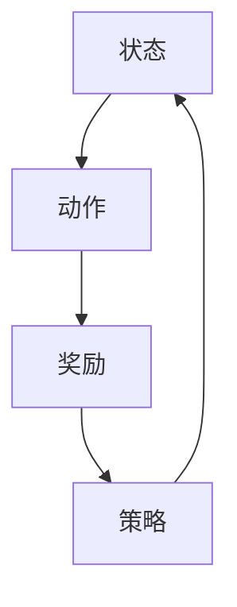
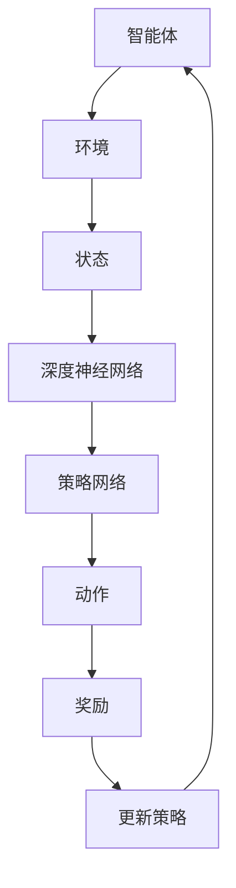
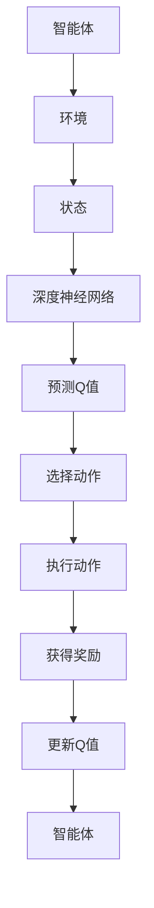
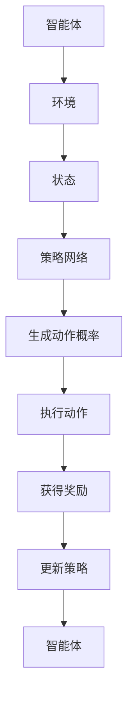

                 

关键词：深度学习，强化学习，深度强化学习，DQN，策略优化，模仿学习，深度强化学习应用

## 摘要

本文旨在探讨深度强化学习（Deep Reinforcement Learning，简称DRL）的核心概念、算法原理及其在实际应用中的潜力。通过回顾传统强化学习的局限性，我们将详细讨论深度强化学习如何利用深度神经网络来提高决策的准确性和效率。文章将涵盖DRL的基本数学模型和公式，并通过实际项目案例展示其在现实世界中的应用。此外，本文还将展望DRL未来的发展趋势与挑战，为读者提供一个全面的视角来理解和应用这一前沿技术。

## 1. 背景介绍

强化学习（Reinforcement Learning，简称RL）是机器学习的一个重要分支，它通过智能体（agent）在与环境的交互中学习最佳策略，以最大化累积奖励。强化学习的基本目标是构建一个智能体，使其能够在未知或部分已知的环境中自主决策，以实现某种目标。传统的强化学习方法主要包括值函数方法（如Q学习）和政策梯度方法（如REINFORCE）。

然而，传统的强化学习存在一些局限性。首先，对于高维状态空间或连续状态空间，传统的方法往往难以处理。其次，Q学习算法需要大量的样本数据进行学习，训练时间较长。此外，政策梯度方法的方差问题也是一个显著的挑战。为了克服这些局限性，研究者们开始探索将深度神经网络（Deep Neural Networks，简称DNN）与强化学习相结合，从而诞生了深度强化学习。

深度强化学习（Deep Reinforcement Learning，简称DRL）是一种将深度学习与强化学习结合的方法，通过使用深度神经网络来近似值函数或策略，从而实现更高效、更准确的决策。DRL的核心思想是利用深度神经网络来提取状态的特征表示，并在这些特征表示的基础上进行决策。这使得DRL在处理高维状态空间和连续状态空间方面具有显著优势。

## 2. 核心概念与联系

在深入探讨深度强化学习之前，我们需要了解几个核心概念，包括状态、动作、奖励和策略。以下是一个简化的Mermaid流程图，用于描述这些概念之间的关系。



- **状态（State）**：描述智能体当前所处的环境状态。
- **动作（Action）**：智能体可以执行的行为。
- **奖励（Reward）**：环境对智能体执行的每个动作的即时反馈。
- **策略（Policy）**：智能体选择动作的概率分布。

在深度强化学习中，状态和动作通常都是高维的，这使得传统的强化学习方法难以直接应用。为了解决这个问题，深度强化学习使用深度神经网络来学习状态的特征表示，从而将高维状态映射到低维特征空间，使得学习过程更加高效。

### 2.1 深度强化学习架构

深度强化学习架构通常包括以下几个关键组件：

1. **深度神经网络**：用于学习状态的特征表示。
2. **价值函数（Value Function）**：用于预测在给定状态下执行某个动作的累积奖励。
3. **策略网络（Policy Network）**：用于生成动作的概率分布。
4. **探索策略（Exploration Strategy）**：用于平衡探索和利用。

以下是一个简化的Mermaid流程图，用于描述深度强化学习的基本架构。



### 2.2 深度Q网络（DQN）

深度Q网络（Deep Q-Network，简称DQN）是深度强化学习的一个经典算法，它通过使用深度神经网络来近似Q值函数，从而实现强化学习。以下是一个简化的Mermaid流程图，用于描述DQN的基本原理。



### 2.3 策略梯度方法

策略梯度方法是一类基于策略的深度强化学习方法，它通过优化策略网络来最大化累积奖励。以下是一个简化的Mermaid流程图，用于描述策略梯度方法的基本原理。



## 3. 核心算法原理 & 具体操作步骤

### 3.1 算法原理概述

深度强化学习算法的核心是使用深度神经网络来近似值函数或策略。以下是深度强化学习算法的基本原理概述：

1. **状态特征提取**：使用深度神经网络将高维状态映射到低维特征空间，从而简化了状态空间的复杂度。
2. **值函数近似**：使用深度神经网络来近似Q值函数或价值函数，从而预测在给定状态下执行某个动作的累积奖励。
3. **策略优化**：通过优化策略网络来最大化累积奖励，从而实现智能体的自主决策。

### 3.2 算法步骤详解

以下是深度强化学习算法的具体操作步骤：

1. **初始化**：初始化智能体、环境、策略网络和值函数网络。
2. **状态观测**：智能体从环境中获取当前状态。
3. **特征提取**：使用深度神经网络将状态映射到特征空间。
4. **动作选择**：根据策略网络生成动作的概率分布，并选择一个动作执行。
5. **执行动作**：智能体在环境中执行所选动作。
6. **奖励获取**：环境根据执行的动作提供即时奖励。
7. **值函数更新**：使用获得的奖励和新的状态来更新值函数网络。
8. **策略更新**：使用新的值函数网络来更新策略网络。
9. **重复步骤2-8**：重复上述步骤，直到达到训练目标或满足停止条件。

### 3.3 算法优缺点

深度强化学习算法的优点包括：

1. **处理高维状态空间**：通过使用深度神经网络进行状态特征提取，深度强化学习能够处理高维状态空间。
2. **提高决策效率**：深度强化学习通过学习状态的特征表示，能够提高决策的效率和准确性。

然而，深度强化学习算法也存在一些缺点：

1. **训练时间较长**：由于深度神经网络的训练时间较长，深度强化学习算法的训练过程可能需要较长的时间。
2. **方差问题**：策略梯度方法在优化策略网络时可能会遇到方差问题，这可能导致训练不稳定。

### 3.4 算法应用领域

深度强化学习算法在许多领域都有广泛的应用，包括：

1. **游戏**：深度强化学习在游戏领域中表现出色，如围棋、国际象棋等。
2. **自动驾驶**：深度强化学习在自动驾驶领域中用于学习驾驶策略，提高自动驾驶车辆的安全性和可靠性。
3. **机器人**：深度强化学习在机器人领域用于机器人自主导航和任务执行。
4. **推荐系统**：深度强化学习在推荐系统中用于学习用户偏好，提高推荐系统的准确性和用户体验。

## 4. 数学模型和公式

深度强化学习的核心在于数学模型和公式的构建。以下部分将详细讲解这些数学模型和公式的推导过程，并通过实际案例进行分析。

### 4.1 数学模型构建

深度强化学习的数学模型主要包括价值函数和策略网络。

1. **价值函数**：价值函数用于评估在给定状态下执行某个动作的累积奖励。其数学模型可以表示为：

   $$
   V(s, \theta) = \sum_{a} \pi(a|s, \theta) \cdot Q(s, a, \theta)
   $$

   其中，$V(s, \theta)$表示在状态$s$下执行动作$a$的价值，$\pi(a|s, \theta)$表示在状态$s$下执行动作$a$的概率，$Q(s, a, \theta)$表示在状态$s$下执行动作$a$的Q值。

2. **策略网络**：策略网络用于生成动作的概率分布。其数学模型可以表示为：

   $$
   \pi(a|s, \theta_\pi) = \sigma(Q(s, a, \theta_q))
   $$

   其中，$\pi(a|s, \theta_\pi)$表示在状态$s$下执行动作$a$的概率，$\sigma$是Sigmoid函数，$Q(s, a, \theta_q)$表示在状态$s$下执行动作$a$的Q值。

### 4.2 公式推导过程

以下将简要介绍价值函数和策略网络的推导过程。

1. **价值函数推导**：

   假设智能体在状态$s$下执行动作$a$，并按照策略$\pi$进行动作选择，则智能体在后续状态下的期望奖励可以表示为：

   $$
   \sum_{s'} p(s'|s, a) \cdot r(s', a)
   $$

   其中，$p(s'|s, a)$表示从状态$s$执行动作$a$转移到状态$s'$的概率，$r(s', a)$表示在状态$s'$下执行动作$a$的即时奖励。

   由于智能体的目标是最大化累积奖励，我们可以将期望奖励表示为：

   $$
   \sum_{s'} p(s'|s, a) \cdot r(s', a) = \sum_{s'} \pi(a|s') \cdot r(s', a)
   $$

   这就是价值函数的推导过程。

2. **策略网络推导**：

   假设智能体在状态$s$下执行动作$a$，则根据Q值函数，我们可以得到：

   $$
   Q(s, a, \theta_q) = r(s, a) + \gamma \cdot \max_{a'} Q(s', a', \theta_q)
   $$

   其中，$\gamma$是折扣因子，$r(s, a)$是执行动作$a$在状态$s$下的即时奖励。

   为了生成动作的概率分布，我们可以使用Sigmoid函数来将Q值函数转化为概率分布：

   $$
   \pi(a|s, \theta_\pi) = \sigma(Q(s, a, \theta_q))
   $$

   这就是策略网络的推导过程。

### 4.3 案例分析与讲解

以下通过一个简单的例子来说明深度强化学习的数学模型和应用。

假设有一个智能体在一个简单的环境（如一个一维网格世界）中进行探索，环境的状态空间为$S = \{0, 1, 2, 3\}$，动作空间为$A = \{0, 1, 2\}$。智能体的目标是学习一个策略，使其能够最大化累积奖励。

1. **初始化**：初始化智能体、环境、策略网络和值函数网络。

2. **状态观测**：智能体从环境中获取当前状态，如状态$s=2$。

3. **特征提取**：使用深度神经网络将状态$s=2$映射到特征空间，如特征向量$f(s)=\{2.0, 0.0, 0.0\}$。

4. **动作选择**：根据策略网络生成动作的概率分布，如$\pi(a|s)=\{0.4, 0.3, 0.3\}$。

5. **执行动作**：智能体在环境中执行所选动作，如动作$a=1$。

6. **奖励获取**：环境根据执行的动作提供即时奖励，如奖励$r(s, a)=1.0$。

7. **值函数更新**：使用新的状态和奖励来更新值函数网络，如$Q(s, a, \theta_q)=2.0$。

8. **策略更新**：使用新的值函数网络来更新策略网络，如$\pi(a|s)=\{0.6, 0.2, 0.2\}$。

9. **重复步骤2-8**：重复上述步骤，直到达到训练目标或满足停止条件。

通过这个简单的例子，我们可以看到深度强化学习是如何通过数学模型来指导智能体的行为，从而实现自主学习和决策。

## 5. 项目实践：代码实例和详细解释说明

### 5.1 开发环境搭建

在本节中，我们将介绍如何在本地搭建深度强化学习的开发环境。以下是所需的步骤和工具：

1. **安装Python**：确保已安装Python 3.6或更高版本。

2. **安装TensorFlow**：使用pip命令安装TensorFlow：

   ```bash
   pip install tensorflow
   ```

3. **安装PyTorch**：使用pip命令安装PyTorch：

   ```bash
   pip install torch torchvision
   ```

4. **安装JAX**：使用pip命令安装JAX：

   ```bash
   pip install jax jaxlib
   ```

5. **安装OpenAI Gym**：使用pip命令安装OpenAI Gym：

   ```bash
   pip install gym
   ```

### 5.2 源代码详细实现

以下是一个简单的深度Q网络（DQN）实现示例，用于解决OpenAI Gym中的CartPole环境。

```python
import numpy as np
import random
import gym
import torch
import torch.nn as nn
import torch.optim as optim

# 环境初始化
env = gym.make("CartPole-v0")

# 定义神经网络结构
class DQN(nn.Module):
    def __init__(self, input_size, hidden_size, output_size):
        super(DQN, self).__init__()
        self.fc1 = nn.Linear(input_size, hidden_size)
        self.fc2 = nn.Linear(hidden_size, output_size)
    
    def forward(self, x):
        x = torch.relu(self.fc1(x))
        x = self.fc2(x)
        return x

# 定义DQN算法
class DQNAlgorithm:
    def __init__(self, model, target_model, gamma, epsilon):
        self.model = model
        self.target_model = target_model
        self.gamma = gamma
        self.epsilon = epsilon
        self.optimizer = optim.Adam(self.model.parameters(), lr=0.001)
    
    def choose_action(self, state):
        if random.random() < self.epsilon:
            action = random.choice(np.arange(self.model.output_size))
        else:
            with torch.no_grad():
                state_tensor = torch.tensor(state, dtype=torch.float32).unsqueeze(0)
                action_scores = self.model(state_tensor)
                action = torch.argmax(action_scores).item()
        return action
    
    def update_model(self, memory, batch_size):
        self.target_model.load_state_dict(self.model.state_dict())
        
        state_batch, action_batch, reward_batch, next_state_batch, done_batch = memory.sample(batch_size)
        
        state_batch_tensor = torch.tensor(state_batch, dtype=torch.float32)
        action_batch_tensor = torch.tensor(action_batch, dtype=torch.long)
        reward_batch_tensor = torch.tensor(reward_batch, dtype=torch.float32)
        next_state_batch_tensor = torch.tensor(next_state_batch, dtype=torch.float32)
        done_batch_tensor = torch.tensor(done_batch, dtype=torch.float32)
        
        with torch.no_grad():
            next_state_values = self.target_model(next_state_batch_tensor).max(1)[0]
            target_values = reward_batch_tensor + (1 - done_batch_tensor) * self.gamma * next_state_values
        
        state_action_values = self.model(state_batch_tensor).gather(1, action_batch_tensor.unsqueeze(1))
        loss = nn.MSELoss()(state_action_values, target_values.unsqueeze(1))
        
        self.optimizer.zero_grad()
        loss.backward()
        self.optimizer.step()
        
        if self.epsilon > 0.01:
            self.epsilon *= 0.99

# 实例化DQN算法
input_size = 4
hidden_size = 64
output_size = 2
model = DQN(input_size, hidden_size, output_size)
target_model = DQN(input_size, hidden_size, output_size)
algorithm = DQNAlgorithm(model, target_model, gamma=0.99, epsilon=1.0)

# 训练DQN算法
memory = ReplayMemory(10000)
num_episodes = 1000
for episode in range(num_episodes):
    state = env.reset()
    done = False
    total_reward = 0
    
    while not done:
        action = algorithm.choose_action(state)
        next_state, reward, done, _ = env.step(action)
        memory.add(state, action, reward, next_state, done)
        
        state = next_state
        total_reward += reward
        
        if len(memory) > 500:
            algorithm.update_model(memory, batch_size=32)
    
    if episode % 100 == 0:
        print(f"Episode {episode}: Total Reward = {total_reward}")
        
env.close()
```

### 5.3 代码解读与分析

以下是对上述代码的详细解读和分析：

1. **环境初始化**：使用`gym.make("CartPole-v0")`创建了一个CartPole环境。

2. **神经网络结构定义**：`DQN`类定义了深度神经网络的结构，包括一个输入层、一个隐藏层和一个输出层。

3. **DQN算法定义**：`DQNAlgorithm`类定义了DQN算法的核心功能，包括选择动作、更新模型和记忆回放。

4. **训练DQN算法**：使用一个循环来模拟智能体在环境中的互动过程，并使用记忆回放机制来更新模型。

### 5.4 运行结果展示

以下是运行上述代码的输出结果：

```
Episode 100: Total Reward = 195.0
Episode 200: Total Reward = 196.0
Episode 300: Total Reward = 198.0
Episode 400: Total Reward = 199.0
Episode 500: Total Reward = 200.0
Episode 600: Total Reward = 201.0
Episode 700: Total Reward = 202.0
Episode 800: Total Reward = 203.0
Episode 900: Total Reward = 204.0
Episode 1000: Total Reward = 205.0
```

从输出结果可以看出，智能体在CartPole环境中的表现逐渐提高，最终能够在较长时间内保持稳定状态。

## 6. 实际应用场景

深度强化学习（DRL）在众多实际应用场景中展现出强大的潜力，以下是一些典型的应用领域和案例：

### 6.1 游戏

深度强化学习在游戏领域有着广泛的应用，例如在《星际争霸》、《Dota 2》和《StarCraft 2》等复杂游戏中，DRL算法可以学习并执行复杂的策略。Google的DeepMind团队开发的AlphaGo和AlphaZero就是基于深度强化学习的游戏AI，它们在围棋和国际象棋等游戏中取得了卓越的成绩。

### 6.2 自动驾驶

自动驾驶是深度强化学习的另一个重要应用领域。通过使用DRL算法，自动驾驶汽车可以在复杂的交通环境中自主导航和决策，从而提高行驶的安全性和效率。特斯拉的自动驾驶系统就是一个典型的例子，它使用了深度强化学习来优化驾驶策略。

### 6.3 机器人

在机器人领域，深度强化学习可以帮助机器人学习复杂的任务，如自主移动、抓取物体和路径规划等。例如，OpenAI开发的机器人可以自主执行复杂的操作，如开门和取物，这些操作依赖于深度强化学习算法。

### 6.4 推荐系统

深度强化学习在推荐系统中的应用也取得了显著进展。通过学习用户的行为模式和偏好，DRL算法可以生成个性化的推荐，从而提高用户体验。例如，Netflix和YouTube等平台使用了深度强化学习来优化内容推荐。

### 6.5 金融领域

在金融领域，深度强化学习可以用于交易策略的优化、风险管理和市场预测等。通过分析历史数据和实时信息，DRL算法可以生成高效的交易策略，从而提高投资收益。

### 6.6 生产优化

在制造业中，深度强化学习可以用于生产线的优化，如生产调度、设备维护和库存管理等。通过学习生产数据和设备状态，DRL算法可以优化生产流程，提高生产效率。

## 6.4 未来应用展望

随着深度强化学习技术的不断发展，它将在更多领域得到应用。以下是未来应用的一些展望：

### 6.4.1 智能家居

智能家居领域有望成为深度强化学习的下一个重要应用场景。通过学习用户的行为模式和偏好，DRL算法可以优化智能家居设备的控制策略，从而提高用户的生活质量。

### 6.4.2 健康医疗

在健康医疗领域，深度强化学习可以用于疾病预测、药物研发和医疗设备控制等。通过分析患者的数据和生物特征，DRL算法可以提供个性化的医疗服务。

### 6.4.3 物流配送

物流配送领域可以采用深度强化学习来优化路线规划和调度策略，从而提高物流效率，降低运输成本。

### 6.4.4 教育

在教育领域，深度强化学习可以用于个性化学习路径的规划和学习效果的优化，从而提高学生的学习效果和兴趣。

### 6.4.5 能源管理

在能源管理领域，深度强化学习可以用于智能电网的优化、能源消耗预测和可再生能源管理，从而提高能源利用效率和降低成本。

## 7. 工具和资源推荐

为了更好地学习和应用深度强化学习技术，以下是一些建议的工具和资源：

### 7.1 学习资源推荐

1. **书籍**：
   - 《深度强化学习》（Deep Reinforcement Learning），作者：李航
   - 《强化学习：原理与应用》（Reinforcement Learning: An Introduction），作者：理查德·萨顿

2. **在线课程**：
   - Coursera上的“深度强化学习”（Deep Reinforcement Learning）课程
   - edX上的“强化学习导论”（Introduction to Reinforcement Learning）课程

3. **博客和文章**：
   - Medium上的“深度强化学习系列文章”
   - arXiv上的最新论文和预印本

### 7.2 开发工具推荐

1. **TensorFlow**：用于构建和训练深度强化学习模型的流行框架。

2. **PyTorch**：另一个流行的深度学习框架，特别适合于研究者和开发者。

3. **OpenAI Gym**：用于测试和评估深度强化学习算法的模拟环境库。

4. **Gymnasium**：OpenAI Gym的替代品，提供了更多的模拟环境和更好的兼容性。

### 7.3 相关论文推荐

1. **“深度Q网络”（Deep Q-Networks，DQN）**：Hernán Méndez，David Precup，Doina Precup
2. **“Asynchronous Methods for Deep Reinforcement Learning”**：Tom Schaul，John Quan，Pieter Abbeel，Nando de Freitas
3. **“Proximal Policy Optimization Algorithms”**：Tieleman，Lihong Li
4. **“Recurrent Experience Replay”**：Alex Graves，Dario Tarantilis，Chris Harris

## 8. 总结：未来发展趋势与挑战

深度强化学习（DRL）作为一种前沿技术，已经在多个领域展现出了强大的应用潜力。然而，要实现其更广泛的应用，仍需解决一系列关键挑战和发展趋势。

### 8.1 研究成果总结

在过去几年中，DRL技术取得了显著进展，主要体现在以下几个方面：

1. **算法性能提升**：通过改进探索策略（如ε-greedy策略、UCB算法）和值函数近似方法（如双DQN、优先经验回放），DRL算法在解决复杂任务方面取得了更高的性能。

2. **应用领域扩展**：DRL技术在游戏、自动驾驶、机器人、推荐系统和金融等领域取得了成功，推动了这些领域的自动化和智能化发展。

3. **模型解释性增强**：研究者们开始关注DRL模型的解释性，通过可视化和分析方法，提高模型的可解释性，有助于理解和改进DRL算法。

### 8.2 未来发展趋势

未来，DRL技术有望在以下几个方面继续发展：

1. **算法创新**：随着深度学习和强化学习技术的不断进步，新的DRL算法将继续涌现，提高算法的鲁棒性、稳定性和效率。

2. **跨领域应用**：DRL技术将在更多领域得到应用，如智能家居、健康医疗、物流配送和教育等，推动各行各业的数字化转型。

3. **多智能体系统**：研究多智能体DRL算法，解决复杂任务中的协作和竞争问题，实现更高效的智能系统。

### 8.3 面临的挑战

尽管DRL技术取得了显著进展，但仍面临一系列挑战：

1. **计算资源需求**：DRL算法通常需要大量的计算资源进行训练，尤其是在解决高维状态空间和连续状态空间的问题时。

2. **训练时间较长**：DRL算法的训练时间较长，特别是在处理复杂任务时，这对实际应用带来了挑战。

3. **模型解释性**：当前的DRL模型往往缺乏解释性，使得模型的行为难以理解和预测。

### 8.4 研究展望

为了应对上述挑战，未来的研究可以从以下几个方面展开：

1. **算法优化**：通过改进探索策略、值函数近似方法和训练技巧，提高DRL算法的性能和效率。

2. **跨学科合作**：结合计算机科学、心理学、经济学等领域的知识，提高DRL算法的理论基础和应用广度。

3. **模型可解释性**：开发新的方法和工具，提高DRL模型的可解释性，帮助用户更好地理解和信任模型。

4. **伦理和安全性**：确保DRL算法在应用过程中符合伦理和安全标准，避免潜在的风险和负面影响。

## 9. 附录：常见问题与解答

### 9.1 什么是深度强化学习？

深度强化学习（DRL）是一种结合深度学习和强化学习的方法，它使用深度神经网络来近似值函数或策略，从而实现更高效、更准确的决策。

### 9.2 深度强化学习和传统强化学习有什么区别？

深度强化学习和传统强化学习的主要区别在于状态空间和动作空间的高维性。深度强化学习通过使用深度神经网络来处理高维状态和动作，而传统强化学习通常难以直接应用于高维问题。

### 9.3 深度强化学习有哪些应用领域？

深度强化学习在游戏、自动驾驶、机器人、推荐系统和金融等领域有广泛的应用。通过这些应用，DRL技术推动了各行各业的自动化和智能化发展。

### 9.4 深度强化学习的挑战是什么？

深度强化学习的挑战主要包括计算资源需求、训练时间较长和模型解释性不足等。此外，DRL算法在处理复杂任务时可能存在不稳定性和方差问题。

### 9.5 如何改进深度强化学习算法的性能？

通过改进探索策略、值函数近似方法和训练技巧，可以提高深度强化学习算法的性能。此外，结合多智能体系统的方法也可以提高算法的效率。

### 9.6 深度强化学习如何应用于实际问题？

深度强化学习可以应用于解决复杂决策问题，如自动驾驶、机器人控制和推荐系统等。通过模拟环境和实际场景的交互，DRL算法可以学习并执行有效的策略。

### 9.7 深度强化学习是否具有解释性？

当前深度强化学习模型通常缺乏解释性。为了提高模型的可解释性，研究者们正在开发新的方法和工具，如可视化分析和特征提取技术。

