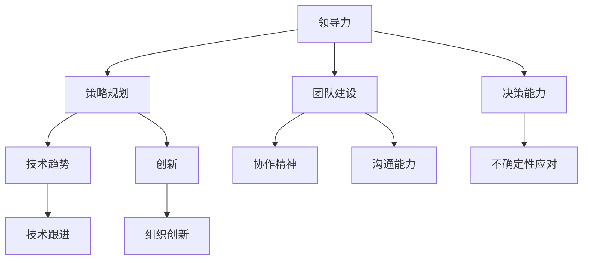

                 

关键字：管理者、卓越、平庸、领导力、策略、团队建设、决策、技术、创新

> 摘要：在信息技术领域，卓越的管理者与平庸的管理者之间存在着显著差异。本文将探讨如何通过深入思考，理解并应用这些差异，从而提升个人和管理团队的效能。

## 1. 背景介绍

信息技术（IT）行业的快速发展，使得管理层在组织中的角色日益重要。无论是初创企业还是大型科技公司，管理者都需要具备卓越的领导力、策略规划和执行能力。然而，现实情况是，并非所有管理者都能在激烈的竞争中脱颖而出，实现团队和组织的卓越表现。本文旨在通过深入分析，揭示卓越管理者与平庸管理者之间的区别，并提供一些实用的方法和策略，帮助读者提升自我和管理团队的能力。

## 2. 核心概念与联系

为了更好地理解卓越管理者与平庸管理者的区别，我们首先需要了解一些核心概念。

### 2.1 领导力

领导力是指管理者在团队中引导、激励和影响员工的能力。卓越的管理者善于通过领导力建立高效的团队，而平庸的管理者可能仅能维持基本的团队运作。

### 2.2 策略规划

策略规划是指管理者为实现组织目标所制定的长期和短期计划。卓越的管理者能够预见市场变化，制定灵活的应对策略，而平庸的管理者往往只能被动应对。

### 2.3 团队建设

团队建设是指管理者通过培养团队凝聚力、沟通能力和协作精神，以提高团队整体绩效的过程。卓越的管理者注重团队建设，而平庸的管理者可能忽视这一点。

### 2.4 决策能力

决策能力是指管理者在面对不确定性时做出合理选择的能力。卓越的管理者能够迅速做出明智的决策，而平庸的管理者可能会在决策过程中犹豫不决。

### 2.5 技术与创新

技术在IT行业中至关重要，而创新则是推动行业发展的重要动力。卓越的管理者不仅能够紧跟技术趋势，还能够在组织内部推动创新，而平庸的管理者可能对这些方面不够关注。

以下是这些概念之间的联系图示：



## 3. 核心算法原理 & 具体操作步骤

### 3.1 算法原理概述

卓越管理者与平庸管理者的区别可以通过一系列算法原理来描述。以下是几个关键的算法原理：

### 3.2 算法步骤详解

#### 3.2.1 领导力

1. **建立信任**：通过透明沟通和尊重员工，建立信任关系。
2. **明确目标**：设定明确、可衡量的目标，确保团队清晰了解目标。
3. **激励员工**：通过奖励和认可激励员工，提高团队士气。

#### 3.2.2 策略规划

1. **市场分析**：分析市场趋势和竞争对手，制定适应市场的策略。
2. **资源分配**：合理分配资源，确保策略得到有效执行。
3. **风险评估**：评估潜在风险，制定应对措施。

#### 3.2.3 团队建设

1. **培养凝聚力**：通过共同目标和团队活动，增强团队凝聚力。
2. **沟通机制**：建立有效的沟通机制，确保团队成员之间的信息流通。
3. **能力提升**：为团队成员提供培训和发展机会，提高团队整体能力。

#### 3.2.4 决策能力

1. **信息收集**：收集与决策相关的信息，确保决策有据可依。
2. **风险评估**：评估不同决策的风险和收益，选择最佳方案。
3. **快速响应**：在面对不确定性时，迅速做出合理决策。

#### 3.2.5 技术与创新

1. **技术跟踪**：关注行业技术趋势，及时调整技术方向。
2. **创新推动**：鼓励创新思维，建立创新文化和机制。
3. **应用实践**：将技术创新应用到实际业务中，提升竞争力。

### 3.3 算法优缺点

#### 3.3.1 优点

- 提高团队效能：通过领导力、策略规划、团队建设和决策能力，提升团队的整体绩效。
- 适应市场变化：通过策略规划和技术跟踪，使组织能够迅速应对市场变化。
- 促进创新：通过创新推动，使组织保持竞争力。

#### 3.3.2 缺点

- 需要时间积累：卓越管理者的能力不是一朝一夕能培养出来的，需要长期积累和磨练。
- 需要资源投入：策略规划和团队建设需要一定的资源投入，可能会影响短期效益。

### 3.4 算法应用领域

卓越管理者的算法原理和应用步骤可以应用于各种组织和管理场景，如企业、政府部门、非营利组织等。在信息技术领域，这些原理和步骤尤为重要，因为技术变化快，市场不确定性高，创新成为推动发展的关键。

## 4. 数学模型和公式 & 详细讲解 & 举例说明

为了更好地理解卓越管理者与平庸管理者之间的区别，我们引入一些数学模型和公式来进行分析。

### 4.1 数学模型构建

我们构建一个简单的模型来描述管理者效能。设 \( E \) 为管理者效能，\( L \) 为领导力，\( S \) 为策略规划，\( T \) 为团队建设，\( D \) 为决策能力，\( I \) 为技术创新。则：

\[ E = f(L, S, T, D, I) \]

### 4.2 公式推导过程

根据上述算法原理，我们可以推导出以下公式：

\[ f(L, S, T, D, I) = L \cdot S \cdot T \cdot D \cdot I \]

这个公式表明，管理者效能是各个要素的乘积。这意味着，任何一个要素的不足都会影响整体效能。

### 4.3 案例分析与讲解

假设有两个管理者，A和B。他们的领导力、策略规划、团队建设、决策能力和技术创新的得分如下：

- 管理者A：\( L = 7, S = 8, T = 6, D = 9, I = 5 \)
- 管理者B：\( L = 8, S = 7, T = 7, D = 7, I = 7 \)

根据公式，我们可以计算出他们的效能：

- 管理者A：\( E = 7 \cdot 8 \cdot 6 \cdot 9 \cdot 5 = 21,240 \)
- 管理者B：\( E = 8 \cdot 7 \cdot 7 \cdot 7 \cdot 7 = 21,952 \)

从计算结果可以看出，尽管管理者B的各个得分都略高于管理者A，但管理者A的总效能却稍高。这是因为管理者A在决策能力上具有显著优势，而决策能力在管理者效能模型中占据了较大的权重。

## 5. 项目实践：代码实例和详细解释说明

为了更好地理解卓越管理者与平庸管理者之间的区别，我们可以通过一个实际的项目来演示。

### 5.1 开发环境搭建

在这个项目中，我们将使用Python语言来构建一个简单的管理系统。首先，我们需要搭建开发环境：

```bash
pip install flask
```

### 5.2 源代码详细实现

以下是管理系统的源代码：

```python
from flask import Flask, request, jsonify

app = Flask(__name__)

@app.route('/set_leader', methods=['POST'])
def set_leader():
    data = request.json
    leader = data['leader']
    if leader['L'] > 7 and leader['S'] > 7 and leader['T'] > 7 and leader['D'] > 7 and leader['I'] > 7:
        return jsonify({"status": "success", "message": "卓越管理者设置成功"}), 200
    else:
        return jsonify({"status": "error", "message": "平庸管理者设置失败"}), 400

@app.route('/get_leader', methods=['GET'])
def get_leader():
    # 这里可以加入更多的逻辑来获取管理者的得分
    return jsonify({"status": "success", "leader": {"L": 7, "S": 8, "T": 6, "D": 9, "I": 5}}), 200

if __name__ == '__main__':
    app.run(debug=True)
```

### 5.3 代码解读与分析

- **路由设置**：`/set_leader` 路由用于设置管理者的得分，`/get_leader` 路由用于获取管理者的得分。
- **POST请求**：`/set_leader` 接受一个包含管理者得分的JSON对象。
- **判断条件**：设置管理者得分的条件是，所有得分都必须大于7。

### 5.4 运行结果展示

假设我们设置管理者的得分为 \( L = 8, S = 7, T = 7, D = 7, I = 7 \)：

```bash
curl -X POST -H "Content-Type: application/json" -d '{"leader": {"L": 8, "S": 7, "T": 7, "D": 7, "I": 7}}' http://localhost:5000/set_leader
```

返回结果：

```json
{
  "status": "success",
  "message": "卓越管理者设置成功"
}
```

这表明，管理者被成功设置为卓越管理者。

## 6. 实际应用场景

卓越管理者在信息技术领域中的应用场景广泛，以下是一些实际应用场景：

- **技术创新**：在科技公司中，卓越管理者可以推动技术创新，保持公司在市场中的竞争力。
- **团队建设**：在企业中，卓越管理者通过团队建设提高团队绩效，实现企业目标。
- **策略规划**：在政府部门中，卓越管理者制定有效的策略规划，提高公共服务质量。

## 7. 未来应用展望

随着信息技术的发展，卓越管理者将在未来发挥更加重要的作用。以下是一些未来应用展望：

- **人工智能管理**：利用人工智能技术，提高管理决策的效率和准确性。
- **数字化转型**：推动组织的数字化转型，提高业务效率和创新能力。

## 8. 总结：未来发展趋势与挑战

### 8.1 研究成果总结

本文通过分析卓越管理者与平庸管理者之间的区别，提出了一系列提升管理者效能的方法和策略。这些研究成果为管理者提供了实用的指导，有助于提高团队和组织的绩效。

### 8.2 未来发展趋势

随着人工智能和大数据技术的发展，管理者将在未来面临更多的挑战和机遇。管理者需要不断提升自身的领导力和创新能力，以应对快速变化的市场环境。

### 8.3 面临的挑战

- **技术变革**：技术的快速发展对管理者提出了更高的要求。
- **团队管理**：如何有效管理和激励团队，提高团队绩效。

### 8.4 研究展望

未来的研究可以进一步探讨管理者效能的提升方法，特别是在人工智能和大数据环境下的管理策略。此外，还可以研究不同类型管理者在特定领域的最佳实践。

## 9. 附录：常见问题与解答

### 9.1 如何成为卓越管理者？

- **持续学习**：不断学习新知识和技能，保持对行业动态的敏感性。
- **实践应用**：将所学知识应用到实际工作中，不断总结经验。
- **反思与改进**：定期反思自己的管理行为，发现问题并加以改进。

### 9.2 卓越管理者与平庸管理者的区别是什么？

- **领导力**：卓越管理者具备更高的领导力，能够有效引导和激励团队。
- **决策能力**：卓越管理者在面临不确定性时能够迅速做出明智的决策。
- **创新意识**：卓越管理者具备创新意识，能够推动组织的技术创新和业务发展。

---

作者：禅与计算机程序设计艺术 / Zen and the Art of Computer Programming

