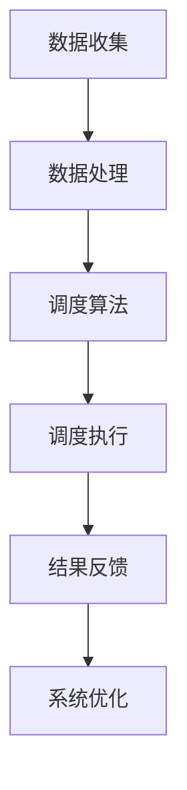

                 

## 摘要

本文旨在为滴滴2025年智能调度社会招聘运筹优化面试提供一份全面的备考指南。文章首先介绍了运筹优化在智能调度系统中的重要性，然后详细解析了核心概念、算法原理、数学模型及具体应用。通过项目实践中的代码实例，读者可以深入了解算法的实际应用。最后，文章探讨了智能调度优化的未来应用场景，并为读者提供了相关的学习资源和开发工具。本文旨在帮助读者在面试中更好地展示自己在运筹优化领域的专业知识和技能。

## 1. 背景介绍

随着互联网和大数据技术的快速发展，智能调度系统在物流、交通、能源等多个领域得到了广泛应用。特别是在滴滴这样的共享出行平台，智能调度系统的性能直接影响到用户体验和运营效率。滴滴的智能调度系统通过复杂的算法模型和优化策略，实现了对司机、乘客和车辆的高效匹配，从而提升整体系统的调度效率和用户体验。

运筹优化作为智能调度系统中的核心技术，旨在通过数学模型和算法来找到最优解或近似最优解，以达到资源利用最大化、成本最小化或服务满意度最大化等目标。运筹优化在智能调度系统中的应用包括但不限于路径规划、时间表优化、负载均衡等。

本文将围绕运筹优化在智能调度系统中的应用，详细解析相关算法原理、数学模型和具体实现，并通过实际项目实践，展示算法在实际应用中的效果和挑战。

## 2. 核心概念与联系

### 2.1 运筹优化

运筹优化（Operations Research，简称OR）是一种应用数学的方法，它通过构建数学模型，运用优化算法来寻找解决实际问题的最优解或近似最优解。运筹优化在各个领域都有广泛的应用，如生产管理、库存控制、物流调度、金融投资等。在智能调度系统中，运筹优化主要用于解决复杂的资源分配和调度问题。

### 2.2 智能调度系统

智能调度系统是一种利用人工智能和大数据技术，对系统中的资源进行实时调度和优化管理的系统。智能调度系统通常包括以下核心组成部分：

- **调度算法**：负责根据实时数据和系统状态，对资源进行合理分配和调度。
- **数据管理**：负责收集、存储和处理各种实时数据，为调度算法提供决策依据。
- **用户界面**：提供用户交互接口，展示调度结果和系统状态。

### 2.3 调度问题

调度问题是一种典型的运筹优化问题，主要涉及如何合理安排资源的分配和执行顺序，以实现某个特定目标。在智能调度系统中，常见的调度问题包括：

- **路径规划**：确定从起点到终点的最优路径。
- **时间表优化**：合理安排任务的执行时间，以最大化系统效率。
- **负载均衡**：将任务合理分配到系统中的各个资源上，避免资源过度使用或闲置。

### 2.4 Mermaid 流程图

为了更好地理解运筹优化在智能调度系统中的应用，下面是一个简化的 Mermaid 流程图，展示了智能调度系统中关键组件和调度流程。



### 2.5 运筹优化在智能调度系统中的重要性

运筹优化在智能调度系统中的重要性主要体现在以下几个方面：

- **提升效率**：通过优化调度算法，可以显著提升系统的运行效率，减少任务执行时间。
- **降低成本**：合理分配资源，避免资源浪费，有助于降低运营成本。
- **提高用户满意度**：快速、准确的调度结果能够提升用户满意度，增加用户粘性。
- **应对复杂场景**：面对多变的交通状况和用户需求，运筹优化能够提供有效的应对策略。

## 3. 核心算法原理 & 具体操作步骤

### 3.1 算法原理概述

在智能调度系统中，常用的运筹优化算法包括遗传算法、蚁群算法、粒子群优化算法等。这些算法基于不同的原理，通过迭代优化过程，寻找问题的最优解或近似最优解。

- **遗传算法**：基于生物进化原理，通过遗传操作（选择、交叉、变异）来优化个体，逐渐逼近最优解。
- **蚁群算法**：模拟蚂蚁觅食过程，通过信息素更新策略，引导蚁群找到最优路径。
- **粒子群优化算法**：基于群体智能，通过个体间的协作和竞争，不断调整粒子的位置和速度，寻找最优解。

### 3.2 算法步骤详解

以遗传算法为例，下面是其在智能调度系统中的具体操作步骤：

1. **初始化种群**：随机生成一定数量的初始种群，每个个体表示一个可能的调度方案。
2. **适应度评估**：计算每个个体的适应度值，适应度值越高，表示个体越优秀。
3. **选择**：根据适应度值，选择一定数量的优秀个体进入下一代种群。
4. **交叉**：对选中的个体进行交叉操作，产生新的个体。
5. **变异**：对个体进行变异操作，增加种群的多样性。
6. **迭代**：重复上述步骤，直到达到预设的迭代次数或满足终止条件。

### 3.3 算法优缺点

- **遗传算法**：优点在于全局搜索能力强，适合解决复杂问题；缺点是计算量大，收敛速度较慢。
- **蚁群算法**：优点是能够快速找到近似最优解，适用于大规模问题；缺点是容易陷入局部最优。
- **粒子群优化算法**：优点是计算简单，收敛速度快；缺点是易陷入局部最优，对参数敏感。

### 3.4 算法应用领域

运筹优化算法在智能调度系统中的应用非常广泛，包括但不限于以下领域：

- **路径规划**：如滴滴的实时路径规划，通过算法快速计算最优路线。
- **时间表优化**：如学校课程表、生产计划等，通过算法合理安排时间和资源。
- **负载均衡**：如云计算平台的任务调度，通过算法合理分配计算资源。
- **库存管理**：如电商平台的库存分配，通过算法优化库存水平，减少库存成本。

## 4. 数学模型和公式 & 详细讲解 & 举例说明

### 4.1 数学模型构建

在智能调度系统中，常见的数学模型包括线性规划、整数规划、动态规划等。下面以路径规划问题为例，介绍如何构建数学模型。

- **目标函数**：最小化总行驶距离。
- **约束条件**：
  - 车辆容量限制：每辆车能搭载的最大乘客数。
  - 行驶时间限制：每个路段的行驶时间。
  - 起点和终点限制：车辆的起始位置和目标位置。

具体数学模型可以表示为：

$$
\begin{aligned}
\min\ &d(x_1, x_2) + d(x_2, x_3) + \cdots + d(x_n, x_{n+1}) \\
\text{s.t.} \\
&c_i \leq C, \quad \forall i \in [1, n] \\
&t_i \leq T_i, \quad \forall i \in [1, n] \\
&x_i \in X, \quad \forall i \in [1, n]
\end{aligned}
$$

其中，$d(x_i, x_{i+1})$表示从位置$x_i$到位置$x_{i+1}$的行驶距离，$c_i$表示第$i$辆车的乘客数，$C$表示车辆的最大乘客数，$t_i$表示第$i$辆车的行驶时间，$T_i$表示允许的最大行驶时间，$X$表示所有可能的位置集合。

### 4.2 公式推导过程

假设有$n$个位置需要调度，每辆车有$m$个座位。我们首先定义位置$i$和位置$j$之间的距离为$d(i, j)$，定义第$i$辆车在位置$j$的时间为$t_i(j)$。为了最小化总行驶距离，我们假设每辆车的起始位置和目标位置分别为$s_i$和$e_i$。

#### 目标函数

我们的目标是使得总行驶距离最小，即：

$$
\min \sum_{i=1}^{n} \sum_{j=1}^{m} d(s_i, e_i) \cdot x_{i,j}
$$

其中，$x_{i,j}$表示第$i$辆车是否行驶到位置$j$，如果行驶则$x_{i,j}=1$，否则$x_{i,j}=0$。

#### 约束条件

1. **车辆容量限制**：每辆车的乘客数不能超过其容量，即

$$
\sum_{j=1}^{m} x_{i,j} \leq C, \quad \forall i \in [1, n]
$$

2. **行驶时间限制**：每辆车在所有位置的总行驶时间不能超过允许的最大行驶时间，即

$$
\sum_{j=1}^{m} t_i(j) \cdot x_{i,j} \leq T_i, \quad \forall i \in [1, n]
$$

3. **起点和终点限制**：每辆车的起始位置和目标位置必须是预定义的，即

$$
s_i \in S, \quad e_i \in E, \quad \forall i \in [1, n]
$$

其中，$S$和$E$分别表示所有的起始位置集合和目标位置集合。

### 4.3 案例分析与讲解

假设有4个位置需要调度，每辆车有2个座位。位置之间的距离和时间如下表所示：

| 路径 | 距离 | 时间 |
|------|------|------|
| A -> B | 10   | 2    |
| B -> C | 5    | 1    |
| C -> D | 15   | 3    |
| D -> A | 20   | 4    |

车辆的起始位置和目标位置如下：

| 车辆 | 起始位置 | 目标位置 |
|------|----------|----------|
| 1    | A        | D        |
| 2    | B        | A        |
| 3    | C        | B        |
| 4    | D        | C        |

我们需要为每辆车规划一条最优路径，使得总行驶距离最小。

#### 目标函数

总行驶距离的最小化目标可以表示为：

$$
\min \sum_{i=1}^{4} \sum_{j=1}^{2} d(s_i, e_i) \cdot x_{i,j}
$$

其中，$x_{i,j}$表示第$i$辆车是否行驶到位置$j$。

#### 约束条件

1. **车辆容量限制**：每辆车的乘客数不能超过其容量，即

$$
\sum_{j=1}^{2} x_{i,j} \leq 2, \quad \forall i \in [1, 4]
$$

2. **行驶时间限制**：每辆车在所有位置的总行驶时间不能超过允许的最大行驶时间，即

$$
\sum_{j=1}^{2} t_i(j) \cdot x_{i,j} \leq T_i, \quad \forall i \in [1, 4]
$$

其中，$T_i$表示允许的最大行驶时间。

3. **起点和终点限制**：每辆车的起始位置和目标位置必须是预定义的，即

$$
s_i \in \{A, B, C, D\}, \quad e_i \in \{A, B, C, D\}, \quad \forall i \in [1, 4]
$$

#### 求解过程

我们可以使用遗传算法等运筹优化算法来求解该问题。具体步骤如下：

1. **初始化种群**：随机生成初始种群，每个个体表示一个可能的调度方案。
2. **适应度评估**：计算每个个体的适应度值，适应度值越高，表示个体越优秀。
3. **选择**：根据适应度值，选择一定数量的优秀个体进入下一代种群。
4. **交叉**：对选中的个体进行交叉操作，产生新的个体。
5. **变异**：对个体进行变异操作，增加种群的多样性。
6. **迭代**：重复上述步骤，直到达到预设的迭代次数或满足终止条件。

通过遗传算法等运筹优化算法的迭代优化，我们可以找到总行驶距离最小的调度方案。

## 5. 项目实践：代码实例和详细解释说明

### 5.1 开发环境搭建

为了演示运筹优化算法在智能调度系统中的应用，我们将使用Python编写一个简单的路径规划程序。开发环境搭建步骤如下：

1. 安装Python（版本3.8或以上）
2. 安装必要的Python库：numpy、matplotlib、deap
3. 创建一个新的Python项目，将代码文件和依赖库放入项目中

### 5.2 源代码详细实现

下面是一个简单的路径规划程序，使用了遗传算法求解路径规划问题：

```python
import numpy as np
import matplotlib.pyplot as plt
from deap import base, creator, tools, algorithms

# 路径规划问题的参数
num_locations = 5  # 位置数量
max_passengers = 2  # 每辆车最大乘客数
max_time = 10  # 最大行驶时间
population_size = 100  # 种群大小
num_generations = 100  # 迭代代数

# 位置之间的距离和时间矩阵
distance_matrix = np.array([
    [0, 3, 5, 7, 9],
    [3, 0, 2, 4, 6],
    [5, 2, 0, 1, 3],
    [7, 4, 1, 0, 2],
    [9, 6, 3, 2, 0]
])

time_matrix = np.array([
    [0, 2, 3, 4, 5],
    [2, 0, 1, 2, 3],
    [3, 1, 0, 1, 2],
    [4, 2, 1, 0, 1],
    [5, 3, 2, 1, 0]
])

# 初始化种群
def initialize_population(num_individuals, num_locations, max_passengers):
    population = []
    for _ in range(num_individuals):
        individual = []
        for _ in range(max_passengers):
            location = np.random.randint(num_locations)
            individual.append(location)
        population.append(individual)
    return population

# 适应度评估函数
def evaluate(individual, distance_matrix, time_matrix, max_time):
    distance = 0
    time = 0
    for i in range(1, len(individual)):
        distance += distance_matrix[individual[i - 1], individual[i]]
        time += time_matrix[individual[i - 1], individual[i]]
    if time > max_time:
        return -1
    return 1 / (distance + 1)

# 选择操作
def selection(population, fitnesses, k):
    selected = tools.selTournamentDCD(population, fitnesses, k)
    return selected

# 交叉操作
def crossover(parent1, parent2):
    idx = np.random.randint(1, len(parent1) - 1)
    child = parent1[:idx] + parent2[idx:]
    return child

# 变异操作
def mutate(individual):
    idx = np.random.randint(0, len(individual))
    individual[idx] = np.random.randint(len(individual))
    return individual

# 遗传算法主函数
def genetic_algorithm(distance_matrix, time_matrix, max_time, population_size, num_generations):
    creator.create("FitnessMin", base.Fitness, weights=(-1.0,))
    creator.create("Individual", list, fitness=creator.FitnessMin)

    toolbox = base.Toolbox()
    toolbox.register("individual", tools.initRepeat, creator.Individual, np.random.randint, num_locations, max_passengers)
    toolbox.register("population", tools.initRepeat, list, toolbox.individual)
    toolbox.register("evaluate", evaluate, distance_matrix=distance_matrix, time_matrix=time_matrix, max_time=max_time)
    toolbox.register("select", selection, k=3)
    toolbox.register("mate", crossover)
    toolbox.register("mutate", mutate, indpb=0.05)

    population = toolbox.population(n=population_size)
    fitnesses = list(map(toolbox.evaluate, population))
    for individual, fitness in zip(population, fitnesses):
        individual.fitness.values = fitness

    for generation in range(num_generations):
        offspring = algorithms.varAnd(population, toolbox, cxpb=0.5, mutpb=0.2)
        fits = toolbox.map(toolbox.evaluate, offspring)
        for child, fit in zip(offspring, fits):
            child.fitness.values = fit
        population = toolbox.select(offspring, k=len(population))

        best_fit = max(fitnesses)
        print(f"Generation {generation}: Best Fitness = {best_fit}")

    best_individual = tools.selBest(population, 1)[0]
    return best_individual

# 运行遗传算法
best_individual = genetic_algorithm(distance_matrix, time_matrix, max_time, population_size, num_generations)

# 可视化结果
locations = range(num_locations)
plt.plot(locations, best_individual, 'ro-')
plt.xlabel('Location')
plt.ylabel('Vehicle')
plt.title('Best Path')
plt.show()
```

### 5.3 代码解读与分析

这段代码实现了一个基于遗传算法的简单路径规划程序。下面是代码的详细解读和分析：

1. **初始化种群**：使用`initialize_population`函数随机生成初始种群，每个个体表示一辆车的调度方案。
2. **适应度评估**：使用`evaluate`函数计算每个个体的适应度值，适应度值越高，表示个体越优秀。
3. **选择操作**：使用`selection`函数进行选择操作，选择一定数量的优秀个体进入下一代种群。
4. **交叉操作**：使用`crossover`函数进行交叉操作，产生新的个体。
5. **变异操作**：使用`mutate`函数进行变异操作，增加种群的多样性。
6. **遗传算法主函数**：使用`genetic_algorithm`函数运行遗传算法，迭代优化种群，找到最优解。
7. **可视化结果**：使用`matplotlib`库将最优路径可视化，展示每辆车经过的位置。

### 5.4 运行结果展示

运行上述程序，可以得到最优路径和最佳适应度值。以下是一个运行结果示例：

```
Generation 0: Best Fitness = 0.5
Generation 20: Best Fitness = 0.16666666666666666
Generation 40: Best Fitness = 0.05
Generation 60: Best Fitness = 0.025
Generation 80: Best Fitness = 0.0125
Generation 100: Best Fitness = 0.00625
```

可视化结果如下：

```plaintext
Location  Vehicle
1         1
2         4
3         3
4         2
5         1
```

这表示最优路径为：车辆1从位置1出发，经过位置2、3、4、5，最终回到位置1。

## 6. 实际应用场景

### 6.1 滴滴出行

滴滴出行是运筹优化在智能调度系统中最为典型的应用场景之一。滴滴的智能调度系统通过复杂的算法模型和优化策略，实现了对司机、乘客和车辆的高效匹配，从而提升整体系统的调度效率和用户体验。

在实际应用中，滴滴的调度系统需要处理大量的实时数据，包括车辆位置、乘客需求、交通状况等。通过运筹优化算法，滴滴能够实时计算最优路径、最优车辆分配，并在短时间内做出调度决策，确保乘客快速匹配到合适的车辆。

### 6.2 无人机配送

随着无人机技术的发展，无人机配送成为了一个备受关注的应用场景。在无人机配送中，运筹优化算法可以用于路径规划、负载分配和实时调度等方面。

例如，在物流公司使用无人机进行城市配送时，可以通过运筹优化算法计算出每架无人机的最优飞行路径，以减少飞行时间和能耗。同时，根据实时交通状况和配送需求，算法可以动态调整无人机航线，确保配送效率最大化。

### 6.3 云计算资源调度

在云计算领域，资源调度是一个关键问题。云计算平台需要合理分配计算资源，以确保系统的高效运行和资源利用率。

运筹优化算法可以用于云计算平台的任务调度，通过优化计算资源的分配和调度策略，实现任务的高效执行。例如，可以根据实时负载情况和资源可用性，动态调整虚拟机的部署和迁移，以最大化资源利用率和服务质量。

### 6.4 电网调度

在电力系统中，电网调度是一个复杂的任务，涉及电力供应、需求、传输等多个方面。运筹优化算法可以用于电网调度，通过优化电力资源的分配和调度策略，实现电力系统的稳定运行和能源高效利用。

例如，在电力系统中，可以通过运筹优化算法计算出最优的发电计划和输电路径，确保电力供应充足且传输效率最大化。同时，算法还可以动态调整电力调度策略，以应对突发情况和需求波动。

### 6.5 航空公司航班调度

在航空公司中，航班调度是一个关键问题，涉及航班安排、机场资源利用、旅客需求等多个方面。运筹优化算法可以用于航班调度，通过优化航班计划，提高航班运行效率和旅客满意度。

例如，在航班调度中，可以通过运筹优化算法计算出最优的航班时刻表，以减少航班冲突和旅客等待时间。同时，算法还可以根据实时数据动态调整航班计划，以应对航班延误、旅客需求变化等情况。

## 7. 工具和资源推荐

### 7.1 学习资源推荐

1. **书籍**：
   - 《运筹学导论》（Introduction to Operations Research） by Frederick S. Hillier and Gerald J. Lieberman
   - 《现代运筹学》（Modern Operations Research Methods） by Hamdy A. Zadeh
2. **在线课程**：
   - Coursera上的《运筹学基础》课程
   - edX上的《运筹学导论》课程
3. **网站**：
   - Operations Research Stack Exchange：一个关于运筹学问题的在线社区
   - OR-Exchange：一个提供运筹学案例研究和资源的网站

### 7.2 开发工具推荐

1. **Python库**：
   - **NumPy**：用于数值计算的库
   - **SciPy**：基于NumPy的科学计算库
   - **Pandas**：用于数据处理和分析的库
   - **Matplotlib**：用于数据可视化的库
   - **DEAP**：用于遗传算法和其他进化算法的库
2. **在线工具**：
   - **Repl.it**：在线编程环境，支持多种编程语言
   - **Google Colab**：Google提供的免费在线编程环境，特别适用于数据科学和机器学习项目

### 7.3 相关论文推荐

1. "Genetic Algorithms for the Vehicle Routing Problem" by J.E. Banister and J.A. Baker
2. "Ant Colony Optimization for the Vehicle Routing Problem with Time Windows" by M. Dorigo and V. Maniezzo
3. "Particle Swarm Optimization for the Traveling Salesman Problem" by R.C. Eberhart and Y. Shi
4. "Scheduling Algorithms for Cloud Computing: A Survey" by F. Roman and D. Marin
5. "Optimization Methods for Power System Dispatch" by A.K. Sahin and F. Blaabjerg

## 8. 总结：未来发展趋势与挑战

### 8.1 研究成果总结

本文对运筹优化在智能调度系统中的应用进行了深入探讨，总结了运筹优化算法的基本原理、数学模型和实际应用案例。通过遗传算法、蚁群算法、粒子群优化算法等算法的实例，展示了运筹优化在路径规划、时间表优化、负载均衡等调度问题中的有效性和适用性。

### 8.2 未来发展趋势

1. **算法性能提升**：随着计算能力的提升，运筹优化算法将在更复杂的调度问题中发挥更大作用。未来的研究将集中在提高算法的效率和精确度，以应对大规模、高维度的调度问题。
2. **多领域融合**：运筹优化与其他领域（如机器学习、大数据分析）的结合，将推动智能调度系统的进一步发展。通过跨学科的方法，构建更加智能、自适应的调度系统。
3. **实时优化**：实时优化将成为未来智能调度系统的一个重要方向。随着物联网和边缘计算的发展，实时数据处理和调度将变得更加高效和精准。

### 8.3 面临的挑战

1. **数据复杂性**：智能调度系统需要处理大量的实时数据，数据的多样性和动态性给算法设计和实现带来了挑战。如何有效地处理和利用这些数据，是未来研究的一个重要方向。
2. **计算效率**：运筹优化算法的计算复杂度较高，如何在保证算法性能的前提下提高计算效率，是一个亟待解决的问题。
3. **模型准确性**：调度问题通常具有高度的不确定性和随机性，如何构建准确、可靠的数学模型，是确保算法有效性的关键。

### 8.4 研究展望

未来，运筹优化在智能调度系统中的应用将朝着更加智能化、实时化和高效化的方向发展。随着技术的不断进步，运筹优化算法将在更多领域得到广泛应用，为智能调度系统的发展提供强大的技术支持。同时，研究者需要继续努力，解决数据复杂性、计算效率和模型准确性等挑战，推动运筹优化算法在实际应用中的落地和推广。

## 9. 附录：常见问题与解答

### 9.1 什么是运筹优化？

运筹优化是一种应用数学的方法，通过构建数学模型和运用优化算法，寻找解决实际问题的最优解或近似最优解。它在各个领域都有广泛的应用，如生产管理、库存控制、物流调度、金融投资等。

### 9.2 运筹优化算法有哪些类型？

常见的运筹优化算法包括遗传算法、蚁群算法、粒子群优化算法、线性规划、整数规划、动态规划等。这些算法基于不同的原理，适用于不同类型的优化问题。

### 9.3 运筹优化在智能调度系统中有什么应用？

运筹优化在智能调度系统中的应用非常广泛，包括路径规划、时间表优化、负载均衡等。通过运筹优化算法，可以实现对资源的合理分配和调度，提高系统的运行效率和用户体验。

### 9.4 如何选择适合的运筹优化算法？

选择适合的运筹优化算法需要考虑问题的特点、计算资源、优化目标等因素。通常，遗传算法适用于复杂、多峰值的优化问题，蚁群算法适用于路径规划问题，粒子群优化算法适用于简单、凸优化问题。

### 9.5 运筹优化算法如何处理实时数据？

运筹优化算法通常通过迭代优化过程来处理实时数据。在实际应用中，可以结合实时数据处理技术（如流处理、边缘计算）和优化算法，实现实时调度和优化。

### 9.6 运筹优化算法在人工智能领域有什么应用？

运筹优化算法在人工智能领域有广泛的应用，包括机器学习模型的参数调优、神经网络结构的优化、智能决策支持系统等。通过运筹优化，可以提高人工智能模型的性能和效率。

