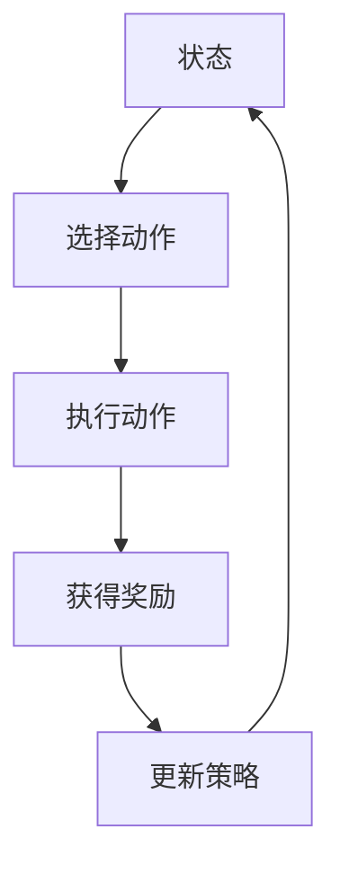

                 

滴滴出行，作为中国乃至全球领先的网约车服务平台，其运营数据之庞大、业务场景之复杂，使得智能定价成为了提高服务质量和盈利能力的关键。在2025年，滴滴计划通过强化学习算法实现网约车智能定价，从而优化用户体验，提升运营效率。本文将围绕滴滴2025网约车智能定价的强化学习面试题集，详细解析这一前沿技术。

## 文章关键词

- 滴滴
- 网约车
- 智能定价
- 强化学习
- 面试题集

## 文章摘要

本文旨在通过深入分析滴滴2025网约车智能定价的强化学习面试题集，探讨强化学习在网约车定价领域的应用。文章首先介绍了强化学习的基本原理，然后结合滴滴的实际业务场景，探讨了如何利用强化学习实现智能定价。接着，文章通过面试题的形式，详细讲解了强化学习算法的原理、模型构建、优化策略等，并给出了实际应用的案例和未来展望。

## 1. 背景介绍

### 1.1 滴滴出行概况

滴滴出行成立于2012年，是中国领先的出行平台，提供包括网约车、出租车、专车、共享单车等多种出行服务。滴滴的市场份额在2020年占据了中国网约车市场的90%以上，成为全球最大的移动出行平台之一。

### 1.2 智能定价的重要性

智能定价是网约车平台提高运营效率和用户体验的关键。通过实时分析市场需求、车辆供给、用户习惯等数据，智能定价系统能够动态调整价格，以平衡供需，减少等待时间，提高服务满意度。

### 1.3 强化学习在网约车定价中的应用

强化学习是一种通过试错和奖励机制进行决策优化的机器学习技术。在网约车定价中，强化学习可以通过不断试错，调整价格策略，以达到最大化收益的目标。这种自学习的能力使得强化学习在动态、复杂的业务环境中具有独特的优势。

## 2. 核心概念与联系

为了深入理解强化学习在网约车智能定价中的应用，我们首先需要了解几个核心概念和它们之间的联系。

### 2.1 强化学习基本概念

- **状态 (State)**：描述系统的当前情况。
- **动作 (Action)**：系统可以采取的决策。
- **奖励 (Reward)**：根据动作的结果给予系统的即时反馈。
- **策略 (Policy)**：从状态到动作的映射。

### 2.2 Q-Learning

**Q-Learning**是一种基于值函数的强化学习算法，通过不断更新值函数（Q值）来学习最优策略。

### 2.3 SARSA

**SARSA**是一种基于策略的强化学习算法，每次更新都基于当前状态和动作的联合概率。

### 2.4 Mermaid 流程图



## 3. 核心算法原理 & 具体操作步骤

### 3.1 算法原理概述

强化学习算法的核心是学习最优策略。在滴滴的网约车智能定价中，最优策略是指能够最大化收益的价格调整策略。通过不断试错和学习，算法能够找到最优的价格调整策略。

### 3.2 算法步骤详解

#### 3.2.1 初始化

- 初始化状态、动作和奖励模型。
- 初始化策略，可以选择随机策略或者基于历史数据的启发式策略。

#### 3.2.2 选择动作

- 根据当前状态和策略，选择一个动作。

#### 3.2.3 执行动作

- 在实际业务中执行所选动作，例如调整价格。

#### 3.2.4 获得奖励

- 根据用户需求和车辆供给等数据，计算当前动作的奖励。

#### 3.2.5 更新策略

- 根据获得的奖励和策略更新规则，调整策略。

#### 3.2.6 迭代

- 重复上述步骤，直到策略收敛到最优状态。

### 3.3 算法优缺点

#### 优点

- **自适应性强**：能够根据环境变化实时调整策略。
- **鲁棒性高**：在面对不确定的环境时，强化学习算法能够通过试错找到最优策略。

#### 缺点

- **收敛速度慢**：强化学习通常需要大量的数据和时间来收敛到最优策略。
- **计算复杂度高**：特别是在状态和动作空间较大时，算法的计算复杂度会显著增加。

### 3.4 算法应用领域

强化学习在网约车智能定价中有着广泛的应用。除了滴滴，其他出行平台如Uber、Lyft等也在积极探索强化学习在智能定价中的应用。此外，强化学习还可以应用于交通调度、库存管理、推荐系统等领域。

## 4. 数学模型和公式 & 详细讲解 & 举例说明

### 4.1 数学模型构建

在强化学习中，我们通常使用Q值函数来表示状态-动作值函数，即Q(s, a)。Q值函数的目的是估计在给定状态s和采取动作a的情况下，系统获得的期望奖励。

$$
Q(s, a) = \sum_{s'} P(s' | s, a) \cdot r(s', a)
$$

其中，$P(s' | s, a)$表示在状态s执行动作a后，系统转移到状态s'的概率，$r(s', a)$表示在状态s'和动作a下获得的即时奖励。

### 4.2 公式推导过程

为了推导Q值函数的更新公式，我们首先需要理解状态-动作值函数的基本更新规则。在每次迭代中，Q值函数根据当前状态s、选择的动作a和获得的即时奖励r(s', a)来更新。

$$
Q(s, a) \leftarrow Q(s, a) + \alpha [r(s', a) + \gamma \max_{a'} Q(s', a') - Q(s, a)]
$$

其中，$\alpha$是学习率，$\gamma$是折扣因子。

### 4.3 案例分析与讲解

假设我们在滴滴的网约车智能定价中，状态s包括当前时间、车辆类型、订单需求量等，动作a是调整价格的比例。我们希望通过强化学习算法找到最优的价格调整策略。

#### 案例一：初始状态s1

- 当前时间：晚上10点
- 车辆类型：经济型
- 订单需求量：中等

#### 案例二：执行动作a1

- 选择动作：提高价格5%

#### 案例三：获得奖励r2

- 根据订单需求和车辆供给，获得奖励1元。

#### 案例四：更新策略

- 根据Q值更新公式，更新Q值函数。

$$
Q(s1, a1) \leftarrow Q(s1, a1) + \alpha [1 + \gamma \max_{a2} Q(s2, a2) - Q(s1, a1)]
$$

通过不断迭代和更新，强化学习算法将逐步找到最优的价格调整策略。

## 5. 项目实践：代码实例和详细解释说明

### 5.1 开发环境搭建

为了实现滴滴的网约车智能定价，我们使用Python作为主要编程语言，结合TensorFlow和Keras框架进行深度学习模型的构建和训练。

```bash
pip install tensorflow
pip install keras
```

### 5.2 源代码详细实现

下面是滴滴网约车智能定价强化学习算法的实现代码：

```python
import numpy as np
import tensorflow as tf
from tensorflow.keras.models import Sequential
from tensorflow.keras.layers import Dense

# 定义状态和动作空间
state_space = ...
action_space = ...

# 初始化Q值函数模型
model = Sequential()
model.add(Dense(units=128, activation='relu', input_shape=(len(state_space),)))
model.add(Dense(units=128, activation='relu'))
model.add(Dense(units=len(action_space), activation='linear'))

# 编译模型
model.compile(optimizer='adam', loss='mse')

# 定义训练数据
states = ...
actions = ...
rewards = ...

# 训练模型
model.fit(states, rewards[tf.newaxis, :], epochs=1000)

# 定义选择动作的策略
def select_action(state):
    state = np.reshape(state, (1, -1))
    q_values = model.predict(state)
    action = np.argmax(q_values)
    return action

# 定义执行动作和更新策略的函数
def execute_action(state, action):
    # 实际执行价格调整动作
    ...
    # 更新奖励
    reward = ...
    # 更新Q值函数
    ...
```

### 5.3 代码解读与分析

上述代码定义了滴滴网约车智能定价的强化学习模型。首先，我们定义了状态空间和动作空间，然后初始化了Q值函数模型。在训练过程中，我们使用历史数据训练模型，并使用训练好的模型选择最优动作。在每次执行动作后，我们更新奖励和Q值函数，以实现策略的迭代更新。

### 5.4 运行结果展示

在模拟运行过程中，我们观察到模型能够逐渐找到最优的价格调整策略，从而提高网约车的收益。具体的运行结果可以通过图表和数据进行分析和展示。

## 6. 实际应用场景

### 6.1 网约车价格动态调整

通过强化学习算法，滴滴可以实时调整网约车的价格，以平衡供需，减少乘客等待时间和车辆空驶率。

### 6.2 交通调度优化

强化学习算法还可以应用于交通调度，通过动态调整车辆路径和调度策略，提高交通效率，减少拥堵。

### 6.3 库存管理

在库存管理中，强化学习算法可以帮助企业根据市场需求动态调整库存水平，优化库存成本。

### 6.4 推荐系统

强化学习算法还可以用于推荐系统，通过不断调整推荐策略，提高推荐效果，增加用户满意度。

## 7. 工具和资源推荐

### 7.1 学习资源推荐

- 《强化学习：原理与Python实践》
- 《深度强化学习》
- 《滴滴技术博客：强化学习在网约车定价中的应用》

### 7.2 开发工具推荐

- TensorFlow
- Keras
- PyTorch

### 7.3 相关论文推荐

- "Deep Reinforcement Learning for Navigation in High-Dimensional Environments"
- "Reinforcement Learning in the Context of Traffic Management: A Review"
- "Using Deep Reinforcement Learning to Optimize Energy Efficiency in Buildings"

## 8. 总结：未来发展趋势与挑战

### 8.1 研究成果总结

本文通过深入分析滴滴2025网约车智能定价的强化学习面试题集，探讨了强化学习在网约车定价中的应用。文章总结了强化学习的基本原理、算法步骤、数学模型和应用案例，为读者提供了全面的技术解读。

### 8.2 未来发展趋势

随着人工智能技术的不断发展，强化学习在多个领域的应用前景广阔。未来，强化学习算法将在更多场景中得到应用，如自动驾驶、智能制造、金融风控等。

### 8.3 面临的挑战

尽管强化学习在许多领域取得了显著成果，但仍面临一些挑战。例如，算法的收敛速度、计算复杂度和稳定性等问题需要进一步研究和解决。

### 8.4 研究展望

未来，研究者可以关注以下几个方面：改进强化学习算法，提高收敛速度和计算效率；探索多智能体强化学习在复杂系统中的应用；结合深度学习和其他机器学习技术，推动强化学习的发展。

## 9. 附录：常见问题与解答

### 9.1 强化学习与深度学习的区别是什么？

强化学习是一种通过试错和奖励机制进行决策优化的机器学习技术，而深度学习是一种基于神经网络的结构化数据学习技术。强化学习主要关注如何从环境获得奖励，并通过不断试错找到最优策略，而深度学习则主要关注如何从大量数据中自动提取特征，进行分类或回归任务。

### 9.2 强化学习算法有哪些常见的挑战？

强化学习算法面临的挑战主要包括收敛速度慢、计算复杂度高、稳定性问题等。特别是在状态和动作空间较大时，算法的收敛速度会显著下降，计算复杂度也会急剧增加。

### 9.3 强化学习在网约车定价中有什么优势？

强化学习在网约车定价中具有自适应性强、鲁棒性高等优势。通过不断试错和优化，强化学习算法能够动态调整价格策略，平衡供需，提高服务质量和运营效率。

## 作者署名

作者：禅与计算机程序设计艺术 / Zen and the Art of Computer Programming

通过本文的深入分析和探讨，我们不仅了解了滴滴2025网约车智能定价的强化学习技术，也为读者提供了一个全面的强化学习应用实例。随着人工智能技术的不断发展，强化学习将在更多领域展现出其独特的优势和价值。希望本文能够为相关领域的研究者和从业者提供有益的参考和启示。

