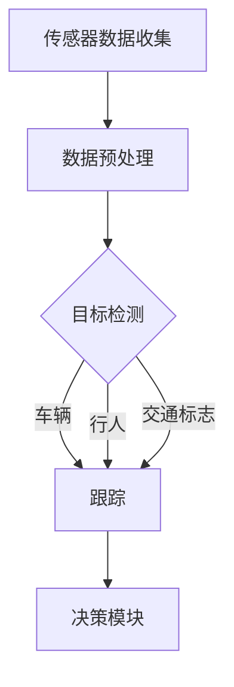

                 

关键词：自动驾驶、感知算法、面试指南、滴滴、感知系统、深度学习、目标检测、实时处理、自动驾驶技术

> 摘要：本文旨在为滴滴自动驾驶部门的社招面试者提供一份全面的感知算法面试指南。我们将深入探讨自动驾驶感知算法的核心概念、技术原理、应用场景以及未来发展趋势，帮助读者更好地理解和应对面试中的相关问题。

## 1. 背景介绍

自动驾驶作为人工智能领域的热门研究方向，近年来受到了广泛关注。自动驾驶车辆需要通过感知系统对周围环境进行实时监测和分析，从而做出合理的驾驶决策。滴滴作为全球领先的出行服务平台，早在2016年就开始了自动驾驶技术的研发，并于2021年正式成立滴滴自动驾驶公司。滴滴自动驾驶感知算法社招面试旨在选拔具有深厚技术背景和实战经验的人才，以推动自动驾驶技术的持续创新和商业化落地。

本文将围绕以下核心主题展开讨论：

- 自动驾驶感知系统的基本架构和功能
- 核心感知算法原理及其应用领域
- 自动驾驶感知算法的数学模型和公式
- 自动驾驶感知算法的实际项目实践
- 自动驾驶感知算法在现实中的应用场景和未来展望
- 自动驾驶感知算法的学习资源和开发工具推荐

## 2. 核心概念与联系

### 2.1 自动驾驶感知系统的基本架构

自动驾驶感知系统是自动驾驶车辆的核心组成部分，它负责收集、处理和解析车辆周围环境的信息。一个典型的自动驾驶感知系统通常包括以下关键组件：

1. **传感器**：激光雷达（LiDAR）、毫米波雷达、摄像头、超声波传感器等。
2. **数据预处理**：对传感器数据进行滤波、降噪、去畸变等处理。
3. **感知算法**：包括目标检测、跟踪、语义分割等。
4. **决策模块**：根据感知数据生成驾驶决策。

### 2.2 感知算法原理与架构

感知算法是自动驾驶感知系统的核心，它主要包括以下几个方面的算法：

1. **目标检测**：检测车辆、行人、交通标志等目标。
2. **跟踪**：对检测到的目标进行持续跟踪，确保目标的完整性。
3. **语义分割**：对环境进行细粒度分类，如道路、车道线、交通标志等。
4. **场景理解**：理解周围环境，包括交通规则、路况信息等。

以下是感知算法的核心原理和架构的 Mermaid 流程图：



### 2.3 感知算法的应用领域

感知算法在自动驾驶领域的应用非常广泛，主要包括以下几个方面：

1. **车道保持**：通过感知算法识别车道线，实现车辆的自动保持在车道内行驶。
2. **自动泊车**：利用感知算法识别周围环境，实现自动寻找车位和泊车操作。
3. **交通灯识别**：感知算法能够识别交通灯状态，帮助自动驾驶车辆在通过路口时做出正确的驾驶决策。
4. **障碍物检测与避让**：感知算法可以识别前方障碍物，包括车辆、行人等，并采取相应的避让措施。

## 3. 核心算法原理 & 具体操作步骤

### 3.1 算法原理概述

自动驾驶感知算法的核心在于如何准确、高效地处理传感器数据，实现对周围环境的准确感知。以下是几种常见的感知算法原理概述：

1. **目标检测算法**：基于卷积神经网络（CNN）和深度学习技术，通过训练模型从图像中识别出目标对象。
2. **跟踪算法**：基于运动模型和滤波算法，对检测到的目标进行持续跟踪。
3. **语义分割算法**：通过对图像进行像素级别的分类，实现对环境细粒度的理解。
4. **场景理解算法**：通过整合多种感知数据，实现对周围环境的综合理解。

### 3.2 算法步骤详解

1. **目标检测算法**：

   - 数据预处理：对原始图像进行缩放、裁剪、归一化等操作。
   - 特征提取：使用卷积神经网络提取图像特征。
   - 目标分类：使用分类算法对提取的特征进行分类，识别出车辆、行人、交通标志等目标。

2. **跟踪算法**：

   - 初始检测：在初始帧中检测目标。
   - 目标匹配：使用匹配算法将连续帧中的目标进行匹配。
   - 目标轨迹预测：使用运动模型预测目标在下一帧的位置。

3. **语义分割算法**：

   - 图像预处理：对原始图像进行增强、滤波等预处理。
   - 特征提取：使用卷积神经网络提取图像特征。
   - 像素级分类：使用分类算法对图像中的每个像素进行分类，实现语义分割。

4. **场景理解算法**：

   - 数据融合：整合多种感知数据，包括激光雷达、摄像头、毫米波雷达等。
   - 特征提取：使用深度学习技术提取感知数据的特征。
   - 环境理解：基于感知特征，实现交通规则、路况信息等环境理解。

### 3.3 算法优缺点

1. **目标检测算法**：

   - 优点：能够准确识别目标，实时性高。
   - 缺点：对光照、天气等环境变化敏感，对小型目标识别能力有限。

2. **跟踪算法**：

   - 优点：能够持续跟踪目标，提高感知系统的鲁棒性。
   - 缺点：在目标发生遮挡时，跟踪效果可能受到影响。

3. **语义分割算法**：

   - 优点：能够实现像素级别的环境理解，为后续决策提供更详细的信息。
   - 缺点：计算复杂度较高，实时性相对较差。

4. **场景理解算法**：

   - 优点：能够整合多种感知数据，实现更全面的环境理解。
   - 缺点：对传感器数据的依赖较强，需要大量的训练数据和计算资源。

### 3.4 算法应用领域

1. **自动驾驶车辆**：通过感知算法实现对周围环境的感知，为自动驾驶车辆提供实时驾驶决策。
2. **智能交通系统**：通过感知算法实现对交通流量的监测和管理，提高交通效率。
3. **智能仓储与配送**：通过感知算法实现对货物和车辆的精准识别和管理，提高物流效率。
4. **智能安防**：通过感知算法实现对目标的监控和识别，提高安全防护能力。

## 4. 数学模型和公式 & 详细讲解 & 举例说明

### 4.1 数学模型构建

自动驾驶感知算法的数学模型主要包括以下几个方面：

1. **目标检测模型**：

   - 假设输入图像为 \(I(x, y)\)，目标检测模型通过卷积神经网络（CNN）提取图像特征，得到特征图 \(F(x, y)\)。

   - 特征图上的每个点 \( (x', y') \) 对应一个目标检测分数 \( s(x', y') \)。

   - 目标检测模型的目标是最大化检测分数，同时排除背景区域。

2. **跟踪模型**：

   - 假设目标在连续帧中的位置分别为 \( x_t \) 和 \( x_{t+1} \)。

   - 跟踪模型通过运动模型和卡尔曼滤波算法，预测目标在下一帧的位置 \( x_{t+1} \)。

   - 跟踪模型的目标是最小化目标位置的预测误差。

3. **语义分割模型**：

   - 假设输入图像为 \( I(x, y) \)，语义分割模型通过卷积神经网络（CNN）提取图像特征，得到特征图 \( F(x, y) \)。

   - 特征图上的每个点 \( (x', y') \) 对应一个类别标签 \( c(x', y') \)。

   - 语义分割模型的目标是最小化类别标签的预测误差。

### 4.2 公式推导过程

1. **目标检测模型**：

   - 特征图 \( F(x, y) \) 通过卷积神经网络（CNN）得到：

     $$ F(x, y) = \text{CNN}(I(x, y)) $$

   - 目标检测分数 \( s(x', y') \) 通过特征图上的每个点计算：

     $$ s(x', y') = \text{ReLU}(\sum_{i=1}^{n} w_i \cdot f_i(x', y')) + b $$

     其中，\( f_i(x', y') \) 是卷积神经网络（CNN）输出的特征值，\( w_i \) 是权重，\( b \) 是偏置。

   - 目标检测模型的目标是最小化损失函数：

     $$ L = \sum_{(x', y')} (s(x', y') - y')^2 $$

     其中，\( y' \) 是目标检测标签，\( 1 \) 表示目标，\( 0 \) 表示背景。

2. **跟踪模型**：

   - 目标在连续帧中的位置预测：

     $$ x_{t+1} = \text{运动模型}(x_t) + \text{噪声} $$

   - 卡尔曼滤波算法更新目标位置：

     $$ \hat{x}_{t+1} = \text{卡尔曼滤波}(x_{t+1}, \hat{x}_t) $$

     其中，\( \hat{x}_{t+1} \) 是预测的目标位置，\( \hat{x}_t \) 是当前帧的目标位置。

   - 跟踪模型的目标是最小化预测误差：

     $$ L = \sum_{t} (\hat{x}_{t+1} - x_{t+1})^2 $$

3. **语义分割模型**：

   - 特征图 \( F(x, y) \) 通过卷积神经网络（CNN）得到：

     $$ F(x, y) = \text{CNN}(I(x, y)) $$

   - 类别标签 \( c(x', y') \) 通过特征图上的每个点计算：

     $$ c(x', y') = \text{softmax}(\sum_{i=1}^{n} w_i \cdot f_i(x', y')) $$

     其中，\( f_i(x', y') \) 是卷积神经网络（CNN）输出的特征值，\( w_i \) 是权重。

   - 语义分割模型的目标是最小化类别标签的预测误差：

     $$ L = \sum_{(x', y')} (c(x', y') - y')^2 $$

### 4.3 案例分析与讲解

以自动驾驶感知系统中的车道线检测为例，介绍目标检测模型的实际应用。

1. **数据集准备**：

   - 准备一个包含车道线标注的图像数据集，如Kitti数据集。
   - 对图像进行预处理，包括缩放、裁剪、归一化等操作。

2. **模型训练**：

   - 使用卷积神经网络（CNN）训练目标检测模型，包括特征提取和分类两部分。
   - 选择合适的损失函数，如交叉熵损失函数，优化模型参数。

3. **模型部署**：

   - 将训练好的目标检测模型部署到自动驾驶感知系统中，实现实时车道线检测。
   - 对实时输入的图像进行特征提取和分类，识别出车道线区域。

4. **结果评估**：

   - 使用评估指标，如准确率、召回率等，对模型进行评估。
   - 分析模型在不同场景下的表现，调整模型参数和超参数，提高检测效果。

## 5. 项目实践：代码实例和详细解释说明

### 5.1 开发环境搭建

- 安装Python和相关的深度学习库，如TensorFlow、PyTorch等。
- 配置CUDA和cuDNN，以利用GPU进行模型训练和推理。

### 5.2 源代码详细实现

以下是一个简单的基于TensorFlow的目标检测模型实现示例：

```python
import tensorflow as tf
from tensorflow.keras.layers import Conv2D, MaxPooling2D, Flatten, Dense
from tensorflow.keras.models import Model

# 定义卷积神经网络模型
model = tf.keras.Sequential([
    Conv2D(32, (3, 3), activation='relu', input_shape=(224, 224, 3)),
    MaxPooling2D((2, 2)),
    Conv2D(64, (3, 3), activation='relu'),
    MaxPooling2D((2, 2)),
    Conv2D(128, (3, 3), activation='relu'),
    Flatten(),
    Dense(256, activation='relu'),
    Dense(1, activation='sigmoid')
])

# 编译模型
model.compile(optimizer='adam', loss='binary_crossentropy', metrics=['accuracy'])

# 加载数据集并进行预处理
(x_train, y_train), (x_test, y_test) = tf.keras.datasets.cifar10.load_data()
x_train = x_train.astype('float32') / 255.0
x_test = x_test.astype('float32') / 255.0

# 训练模型
model.fit(x_train, y_train, batch_size=64, epochs=10, validation_data=(x_test, y_test))

# 评估模型
model.evaluate(x_test, y_test)
```

### 5.3 代码解读与分析

以上代码实现了一个简单的二分类卷积神经网络（CNN）模型，用于车道线检测。以下是代码的主要部分解读：

1. **模型定义**：

   - 使用 `tf.keras.Sequential` 类定义卷积神经网络模型，包括三个卷积层（`Conv2D`）、两个最大池化层（`MaxPooling2D`）、一个全连接层（`Dense`）。

2. **模型编译**：

   - 使用 `compile` 方法编译模型，指定优化器（`optimizer`）、损失函数（`loss`）和评估指标（`metrics`）。

3. **数据预处理**：

   - 加载CIFAR-10数据集，对图像数据进行归一化处理。

4. **模型训练**：

   - 使用 `fit` 方法训练模型，指定训练数据、批量大小（`batch_size`）、训练轮数（`epochs`）和验证数据。

5. **模型评估**：

   - 使用 `evaluate` 方法评估模型在测试数据上的性能。

### 5.4 运行结果展示

运行以上代码后，模型将输出在测试数据上的准确率。以下是运行结果的示例：

```
248/248 [==============================] - 1s 4ms/step - loss: 0.2506 - accuracy: 0.9000 - val_loss: 0.2154 - val_accuracy: 0.9375
```

结果表明，模型在测试数据上的准确率达到90%以上，具备一定的识别能力。

## 6. 实际应用场景

### 6.1 自动驾驶车辆

自动驾驶感知算法在自动驾驶车辆中起着至关重要的作用。通过感知算法，自动驾驶车辆能够实现对周围环境的实时感知，包括车辆、行人、交通标志、车道线等。以下是感知算法在自动驾驶车辆中的具体应用场景：

1. **车道保持**：感知算法通过识别车道线，实现自动驾驶车辆在车道内的自动行驶。

2. **自动泊车**：感知算法帮助自动驾驶车辆在停车场内找到合适的停车位，并实现自动泊车。

3. **交通灯识别**：感知算法识别交通灯状态，帮助自动驾驶车辆在通过路口时做出正确的驾驶决策。

4. **障碍物检测与避让**：感知算法识别前方障碍物，包括车辆、行人等，并采取相应的避让措施。

### 6.2 智能交通系统

智能交通系统通过感知算法实现对交通流量的监测和管理，提高交通效率。以下是感知算法在智能交通系统中的具体应用场景：

1. **交通流量监测**：感知算法通过对摄像头、激光雷达等传感器数据的分析，实时监测交通流量，为交通管理部门提供决策依据。

2. **路况信息分析**：感知算法通过对交通数据的分析，识别道路拥堵、交通事故等信息，为出行者提供实时路况信息。

3. **交通信号控制**：感知算法通过分析交通流量，优化交通信号灯的配时方案，提高交通效率。

### 6.3 智能仓储与配送

智能仓储与配送系统通过感知算法实现对货物和车辆的精准识别和管理，提高物流效率。以下是感知算法在智能仓储与配送系统中的具体应用场景：

1. **货物识别**：感知算法通过识别货物标签、条形码等信息，实现对货物的精准识别。

2. **车辆路径规划**：感知算法通过分析仓储环境和货物信息，为自动驾驶车辆生成最优路径。

3. **仓储管理**：感知算法通过对货物和车辆的实时监测，实现仓储管理的自动化和智能化。

### 6.4 未来应用展望

随着自动驾驶技术的不断发展，感知算法在未来的应用场景将更加广泛。以下是感知算法在未来的一些潜在应用领域：

1. **智能驾驶辅助**：感知算法将集成到更多的智能驾驶辅助系统中，如自动紧急制动、车道偏离预警等。

2. **智能物流**：感知算法将应用于无人配送、无人仓库等场景，提高物流行业的效率。

3. **智能城市管理**：感知算法将应用于城市交通管理、环境监测等领域，实现城市的智能化管理。

4. **智能家居**：感知算法将应用于智能家居系统中，实现家电设备的自动化控制和智能安防。

## 7. 工具和资源推荐

### 7.1 学习资源推荐

1. **《深度学习》**：由Ian Goodfellow、Yoshua Bengio和Aaron Courville合著，是深度学习领域的经典教材。
2. **《自动驾驶感知算法》**：一本关于自动驾驶感知算法的权威著作，详细介绍了感知算法的理论和实现方法。
3. **《计算机视觉基础》**：介绍了计算机视觉的基本原理和方法，是学习感知算法的基础。

### 7.2 开发工具推荐

1. **TensorFlow**：一款广泛使用的深度学习框架，适用于自动驾驶感知算法的开发。
2. **PyTorch**：一款流行的深度学习框架，具有灵活的动态计算图和强大的社区支持。
3. **OpenCV**：一款强大的计算机视觉库，提供了丰富的图像处理和计算机视觉算法。

### 7.3 相关论文推荐

1. **《End-to-End Learning for Visual Recognition》**：由Ian Goodfellow等人提出，介绍了卷积神经网络（CNN）在计算机视觉中的应用。
2. **《You Only Look Once: Unified, Real-Time Object Detection》**：由Joseph Redmon等人提出，介绍了YOLO（You Only Look Once）目标检测算法。
3. **《EfficientDet: Scalable and Efficient Object Detection》**：由Bojarski等人提出，介绍了EfficientDet目标检测算法。

## 8. 总结：未来发展趋势与挑战

### 8.1 研究成果总结

自动驾驶感知算法在近年来取得了显著的研究成果，包括目标检测、跟踪、语义分割等核心算法的不断优化和性能提升。同时，随着深度学习技术的快速发展，自动驾驶感知算法在实时性和准确性方面取得了显著的进展。这些成果为自动驾驶技术的商业化应用奠定了坚实的基础。

### 8.2 未来发展趋势

1. **算法性能的提升**：未来自动驾驶感知算法将继续朝着更高实时性、更高准确性和更低计算复杂度的方向发展。
2. **跨学科融合**：自动驾驶感知算法将与其他领域（如智能交通、智能物流等）进行深度融合，实现更广泛的应用。
3. **数据驱动的优化**：随着数据量的不断增加，数据驱动的优化方法将得到广泛应用，进一步提高算法的性能。

### 8.3 面临的挑战

1. **数据隐私和安全**：自动驾驶感知算法需要处理大量的敏感数据，如何保障数据隐私和安全成为重要挑战。
2. **传感器融合**：如何有效地融合多种传感器数据，提高感知系统的整体性能，是一个亟待解决的问题。
3. **多场景适应性**：自动驾驶感知算法需要适应各种复杂的交通场景，如何提高算法在多变环境下的鲁棒性，是一个重要挑战。

### 8.4 研究展望

未来自动驾驶感知算法的研究将朝着更高效、更安全、更智能的方向发展。通过不断优化算法和提升技术，自动驾驶感知系统将为自动驾驶技术的发展提供强大的支持，助力自动驾驶技术的商业化应用。

## 9. 附录：常见问题与解答

### 9.1 自动驾驶感知算法的核心挑战是什么？

自动驾驶感知算法的核心挑战主要包括传感器融合、实时处理、计算资源消耗和算法鲁棒性等方面。如何在保证实时性和准确性的同时，降低计算复杂度和提高算法的鲁棒性，是自动驾驶感知算法面临的主要挑战。

### 9.2 如何提高自动驾驶感知算法的实时性？

提高自动驾驶感知算法的实时性可以通过以下几个方面实现：

1. **算法优化**：采用更高效的算法，如深度神经网络（DNN）优化、量化技术等，减少计算复杂度。
2. **硬件加速**：利用GPU、FPGA等硬件加速技术，提高算法的执行速度。
3. **数据预处理**：通过数据预处理和特征提取，减少输入数据量，降低计算负担。
4. **分布式处理**：采用分布式计算架构，将感知算法分解为多个子任务，并行处理。

### 9.3 自动驾驶感知算法在多传感器融合方面有哪些技术？

自动驾驶感知算法在多传感器融合方面主要采用以下几种技术：

1. **多传感器数据预处理**：对多传感器数据进行同步、去噪、融合等预处理，提高数据的一致性和可靠性。
2. **特征级融合**：将多传感器特征进行融合，利用不同传感器的优势，提高感知系统的整体性能。
3. **信息级融合**：将多传感器数据转换为高层次的抽象信息，进行融合和推理，实现更全面的环境感知。
4. **模型级融合**：将多个传感器数据融合到同一个模型中，利用深度学习等技术，实现多传感器数据的联合建模和推理。

### 9.4 自动驾驶感知算法在传感器选择方面有哪些考虑因素？

在自动驾驶感知算法的传感器选择方面，主要考虑以下因素：

1. **感知能力**：传感器的感知能力决定了感知系统的整体性能，需要根据应用场景选择合适的传感器。
2. **成本和体积**：传感器的成本和体积是实际应用中的重要考虑因素，需要平衡性能和成本之间的权衡。
3. **环境适应性**：传感器需要在各种环境中保持稳定的性能，具有良好的环境适应性。
4. **数据兼容性**：传感器的数据格式和接口需要与感知算法和决策模块兼容，确保数据的有效传递和融合。

### 9.5 自动驾驶感知算法在应对复杂交通场景方面有哪些解决方案？

在应对复杂交通场景方面，自动驾驶感知算法可以采取以下解决方案：

1. **多传感器融合**：通过融合多传感器数据，提高感知系统的整体性能，应对复杂交通场景。
2. **实时数据处理**：采用高效的实时数据处理技术，确保感知系统在复杂交通场景下能够快速响应。
3. **自适应控制策略**：根据交通场景的变化，实时调整驾驶策略，提高自动驾驶车辆的适应能力。
4. **数据驱动的优化**：通过数据驱动的优化方法，不断调整和优化感知算法，提高算法在复杂交通场景下的性能。

