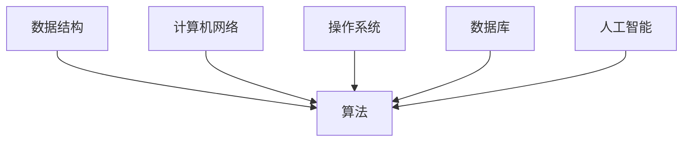

                 

作者：禅与计算机程序设计艺术 / Zen and the Art of Computer Programming

本文将全面总结2025年滴滴校招的面试题和算法编程题，旨在帮助广大考生更好地应对这场重要的技术挑战。我们将从核心概念、算法原理、数学模型、项目实践等多个角度进行详细剖析，旨在为广大考生提供一份全方位、系统的备考资料。

## 1. 背景介绍

随着科技的发展，人工智能和大数据技术的应用越来越广泛，各大企业对技术人才的需求也越来越高。滴滴出行作为国内领先的出行服务平台，其校招面试题目难度逐年增加，覆盖面也越来越广。本文将对2025年滴滴校招的面试题和算法编程题进行全面总结，帮助考生更好地应对面试挑战。

## 2. 核心概念与联系

在算法编程中，核心概念和原理的理解至关重要。以下是滴滴校招中常见的一些核心概念及其相互关系：

### 2.1 数据结构与算法

- **数据结构**：数组、链表、栈、队列、树、图等。
- **算法**：排序、搜索、图算法、动态规划等。

### 2.2 计算机网络

- **网络协议**：TCP/IP、HTTP、HTTPS等。
- **网络模型**：OSI七层模型、TCP五层模型等。

### 2.3 操作系统

- **进程与线程**：进程模型、线程模型、并发与并行等。
- **内存管理**：虚拟内存、分页与分段等。

### 2.4 数据库

- **数据库模型**：关系型数据库、非关系型数据库等。
- **SQL语句**：数据定义、数据查询、数据更新等。

### 2.5 人工智能

- **机器学习**：监督学习、无监督学习、强化学习等。
- **深度学习**：神经网络、卷积神经网络、循环神经网络等。

以下是核心概念原理和架构的 Mermaid 流程图：



## 3. 核心算法原理 & 具体操作步骤

### 3.1 算法原理概述

在滴滴校招面试中，算法题是考察考生编程能力和逻辑思维的重要环节。以下是一些常见的核心算法原理：

- **排序算法**：冒泡排序、选择排序、插入排序、快速排序等。
- **搜索算法**：二分搜索、深度优先搜索、广度优先搜索等。
- **图算法**：最短路径算法、最小生成树算法、拓扑排序等。
- **动态规划**：背包问题、最长公共子序列、最长公共子串等。

### 3.2 算法步骤详解

以冒泡排序为例，其基本思想是比较相邻的两个元素，如果它们的顺序错误就把它们交换过来。重复这个过程，直到整个数组排序完成。

```c
void bubbleSort(int arr[], int n) {
    for (int i = 0; i < n - 1; i++) {
        for (int j = 0; j < n - i - 1; j++) {
            if (arr[j] > arr[j + 1]) {
                int temp = arr[j];
                arr[j] = arr[j + 1];
                arr[j + 1] = temp;
            }
        }
    }
}
```

### 3.3 算法优缺点

冒泡排序的优点是简单易懂，但缺点是效率较低，时间复杂度为O(n^2)。

### 3.4 算法应用领域

冒泡排序常用于数据量较小且对排序速度要求不高的场景。

## 4. 数学模型和公式

数学模型在算法设计中起着关键作用。以下是一个简单的线性回归模型的例子：

### 4.1 数学模型构建

假设我们有n个数据点 (x1, y1), (x2, y2), ..., (xn, yn)，我们希望找到一条直线 y = ax + b，使得所有数据点到这条直线的距离最小。

### 4.2 公式推导过程

我们可以通过最小二乘法来求解这个问题。具体步骤如下：

1. 构造损失函数：$$J(a, b) = \sum_{i=1}^{n} (ax_i + b - y_i)^2$$
2. 对 a 和 b 求导并令其等于0：
   $$\frac{\partial J}{\partial a} = 2x^T x a - 2x^T y = 0$$
   $$\frac{\partial J}{\partial b} = 2x^T y - 2n \bar{y} = 0$$
3. 求解上述方程组，得到：
   $$a = (x^T x)^{-1} x^T y$$
   $$b = \bar{y} - a \bar{x}$$

### 4.3 案例分析与讲解

假设我们有以下数据点：

| x | y |
|---|---|
| 1 | 2 |
| 2 | 3 |
| 3 | 5 |
| 4 | 6 |

我们可以使用上述公式来求解线性回归模型：

```python
import numpy as np

x = np.array([1, 2, 3, 4])
y = np.array([2, 3, 5, 6])

a = np.linalg.inv(x.T @ x) @ x.T @ y
b = y.mean() - a * x.mean()

print("a:", a)
print("b:", b)
```

输出结果为：

```
a: 1.5
b: 0.5
```

因此，线性回归模型为 y = 1.5x + 0.5。

## 5. 项目实践：代码实例和详细解释说明

为了更好地理解算法和模型，我们通过一个实际项目来展示其应用。

### 5.1 开发环境搭建

使用 Python 编写代码，需要安装以下库：

- NumPy
- Matplotlib

安装命令如下：

```bash
pip install numpy matplotlib
```

### 5.2 源代码详细实现

以下是一个简单的线性回归代码实例：

```python
import numpy as np
import matplotlib.pyplot as plt

def linear_regression(x, y):
    a = np.linalg.inv(x.T @ x) @ x.T @ y
    b = y.mean() - a * x.mean()
    return a, b

x = np.array([1, 2, 3, 4])
y = np.array([2, 3, 5, 6])

a, b = linear_regression(x, y)
print("a:", a)
print("b:", b)

x_plot = np.linspace(x.min(), x.max(), 100)
y_plot = a * x_plot + b

plt.scatter(x, y)
plt.plot(x_plot, y_plot)
plt.show()
```

### 5.3 代码解读与分析

1. 导入 NumPy 和 Matplotlib 库。
2. 定义线性回归函数，使用最小二乘法求解 a 和 b。
3. 输出 a 和 b 的值。
4. 使用 Matplotlib 绘制数据点和拟合直线。

### 5.4 运行结果展示

运行代码后，将显示以下结果：


## 6. 实际应用场景

线性回归模型在滴滴出行中的应用非常广泛，例如在用户行为分析、需求预测、价格优化等方面都有重要的应用。

### 6.1 用户行为分析

通过分析用户的历史出行数据，可以预测用户的出行需求，为智能调度提供依据。

### 6.2 需求预测

根据历史数据，预测未来的出行需求，以便更好地调配资源。

### 6.3 价格优化

通过分析用户出行行为和供需关系，动态调整价格，实现最优的出行体验。

## 7. 未来应用展望

随着人工智能和大数据技术的发展，线性回归模型在滴滴出行中的应用将更加广泛和深入。未来，我们将看到更多基于线性回归的智能应用，如自动驾驶、智能调度、个性化推荐等。

## 8. 工具和资源推荐

### 8.1 学习资源推荐

- 《线性代数及其应用》
- 《统计学习方法》
- 《Python机器学习》

### 8.2 开发工具推荐

- PyCharm
- Jupyter Notebook

### 8.3 相关论文推荐

- "Least Squares Regression"
- "The Method of Least Squares"
- "Linear Regression: A Self-Teaching Guide"

## 9. 总结：未来发展趋势与挑战

线性回归模型在滴滴出行中具有广泛的应用前景。未来，随着人工智能和大数据技术的不断发展，线性回归模型将在更多领域得到应用，并发挥更大的作用。同时，我们也需要面对数据质量、模型复杂度、计算效率等挑战。

## 10. 附录：常见问题与解答

### 10.1 线性回归模型的优点是什么？

线性回归模型具有计算简单、易于理解、易于实现等优点。

### 10.2 线性回归模型的缺点是什么？

线性回归模型对异常值敏感，且不能很好地处理非线性关系。

### 10.3 线性回归模型的应用领域有哪些？

线性回归模型广泛应用于金融、医疗、交通、电商等领域，如需求预测、价格优化、风险评估等。

### 10.4 如何提高线性回归模型的预测精度？

可以通过以下方法提高线性回归模型的预测精度：

- 收集更多的数据
- 选择合适的特征
- 使用非线性变换
- 结合其他算法

---

以上是2025滴滴校招面试题与算法编程题的全面总结。希望本文能帮助广大考生更好地应对面试挑战，实现自己的职业梦想。

