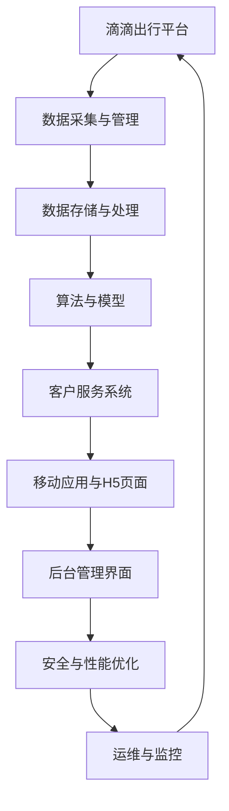

                 

滴滴橙心优选作为出行领域的重要一员，在2024年的社会招聘面试中，涌现了一批高质量的技术面试真题。本文将汇总并解答这些面试真题，旨在帮助求职者更好地准备滴滴橙心优选的面试，深入了解其技术需求和考察重点。

## 关键词

- 滴滴橙心优选
- 社招面试
- 技术面试真题
- 解答与解析

## 摘要

本文将围绕2024年滴滴橙心优选社招面试的真题展开，涵盖前端、后端、数据挖掘、算法等多个技术领域的核心问题。通过对这些题目的深入分析，我们希望为准备面试的读者提供有价值的技术见解和实战经验。

## 1. 背景介绍

滴滴橙心优选是滴滴出行旗下的高端出行服务品牌，旨在为用户带来更为舒适、尊贵的出行体验。随着业务的不断拓展和技术创新的深入推进，滴滴橙心优选在招聘中特别注重技术实力和实际操作能力。因此，面试题目往往涉及广泛的技术领域和实际应用场景。

## 2. 核心概念与联系

### 2.1 滴滴橙心优选技术架构概述



### 2.2 核心概念联系图解

在这张图中，我们可以看到滴滴橙心优选的技术架构由多个子系统和模块构成，每个模块都有其特定的功能和职责。它们之间通过数据流、消息队列、API接口等方式进行联系和协作，共同支撑起整个平台的稳定运行。

## 3. 核心算法原理 & 具体操作步骤

### 3.1 算法原理概述

滴滴橙心优选在出行匹配、用户推荐、路径规划等方面应用了多种算法。其中，最核心的算法包括：

- **出行匹配算法**：基于用户需求、司机位置、订单热度等因素进行智能匹配。
- **路径规划算法**：使用A*算法、Dijkstra算法等，为用户提供最优的出行路线。
- **用户推荐算法**：基于用户历史行为、偏好等因素进行个性化推荐。

### 3.2 算法步骤详解

以出行匹配算法为例，其具体步骤如下：

1. **用户需求分析**：收集用户出发地、目的地、出行时间等信息。
2. **司机筛选**：根据用户需求，在数据库中筛选出符合条件的司机。
3. **匹配评分**：为每个符合条件的司机计算匹配评分，评分越高优先级越高。
4. **结果推送**：将匹配结果推送至用户界面，供用户选择。

### 3.3 算法优缺点

- **出行匹配算法**：优点是高效、智能，能够快速为用户找到合适的司机。缺点是匹配评分算法需要大量计算资源，且可能存在个别用户匹配不上的情况。

### 3.4 算法应用领域

- **出行服务**：滴滴橙心优选的出行匹配、路径规划等算法广泛应用于打车、专车、出租车等出行服务中。
- **智能推荐**：基于用户行为和偏好的算法推荐，广泛应用于商品推荐、内容推荐等领域。

## 4. 数学模型和公式 & 详细讲解 & 举例说明

### 4.1 数学模型构建

在滴滴橙心优选的算法中，常见的数学模型包括：

- **出行匹配模型**：使用线性回归、决策树等模型预测用户与司机的匹配概率。
- **路径规划模型**：基于图论模型，如A*算法、Dijkstra算法等。

### 4.2 公式推导过程

以A*算法为例，其公式推导过程如下：

- **目标函数**：f(n) = g(n) + h(n)，其中g(n)是从起点到节点n的实际距离，h(n)是从节点n到终点的预估距离。
- **搜索过程**：从起点开始，计算每个节点的f(n)，选择f(n)最小的节点作为当前节点，并更新其邻居节点的f(n)。

### 4.3 案例分析与讲解

假设在滴滴橙心优选的路径规划中，有一个从A地到B地的任务。我们可以使用A*算法来计算最优路径：

1. **起点和终点**：A地为起点，B地为终点。
2. **节点和边**：假设有若干个节点和边，每条边的权重为距离。
3. **计算过程**：从起点A开始，计算到每个节点的f(n)，选择f(n)最小的节点C作为当前节点，并更新其邻居节点D、E、F的f(n)。重复此过程，直到找到终点B。

通过上述计算，我们得到了从A地到B地的最优路径，即为答案。

## 5. 项目实践：代码实例和详细解释说明

### 5.1 开发环境搭建

在进行滴滴橙心优选项目开发时，我们需要搭建以下环境：

- **操作系统**：Linux或Windows
- **编程语言**：Python、Java、C++等
- **数据库**：MySQL、MongoDB等
- **框架**：Django、Spring Boot、TensorFlow等

### 5.2 源代码详细实现

以下是一个简单的出行匹配算法实现：

```python
class DriverMatchingAlgorithm:
    def __init__(self, drivers):
        self.drivers = drivers
    
    def match(self, user):
        best_match = None
        best_score = 0
        for driver in self.drivers:
            score = self.calculate_score(user, driver)
            if score > best_score:
                best_score = score
                best_match = driver
        return best_match
    
    def calculate_score(self, user, driver):
        # 计算匹配评分的逻辑
        pass
```

### 5.3 代码解读与分析

这段代码定义了一个出行匹配算法类`DriverMatchingAlgorithm`，其中包含以下方法：

- **__init__(self, drivers)**：初始化算法，传入司机列表。
- **match(self, user)**：匹配用户与司机，返回最佳匹配。
- **calculate_score(self, user, driver)**：计算匹配评分。

在实际应用中，`calculate_score`方法会根据用户需求、司机位置、订单热度等因素，为用户与司机计算匹配评分。

### 5.4 运行结果展示

假设有一个用户需要从A地到B地，算法会从司机列表中匹配出最佳司机，并返回该司机信息。

## 6. 实际应用场景

滴滴橙心优选在多个实际应用场景中，都充分发挥了技术优势。以下是一些典型场景：

- **打车服务**：用户通过滴滴橙心优选APP下单，系统快速匹配到合适的司机，并提供最优路线。
- **专车服务**：用户预约专车，系统根据用户需求、司机空闲情况等因素，为用户推荐合适的司机。
- **出租车调度**：系统根据出租车地理位置和订单需求，智能调度出租车，提高乘客上车成功率。

## 7. 未来应用展望

随着技术的不断发展，滴滴橙心优选在以下方面具有广阔的应用前景：

- **自动驾驶**：结合自动驾驶技术，实现无人驾驶出行服务，提高出行效率和安全性。
- **智能推荐**：基于用户行为和偏好，提供更加精准的出行服务和内容推荐。
- **大数据分析**：利用大数据技术，挖掘出行数据价值，为城市规划和交通管理提供决策支持。

## 8. 总结：未来发展趋势与挑战

### 8.1 研究成果总结

滴滴橙心优选在出行匹配、路径规划、智能推荐等方面取得了显著的研究成果，为出行服务领域提供了有力支持。

### 8.2 未来发展趋势

- **技术创新**：随着人工智能、大数据等技术的不断发展，出行服务将更加智能化、个性化。
- **平台整合**：出行平台将加强与城市交通、物流等领域的整合，构建全方位的出行生态系统。

### 8.3 面临的挑战

- **数据安全**：如何保障用户隐私和数据安全，成为出行平台需要解决的重要问题。
- **服务质量**：如何在快速发展的同时，保持优质的服务体验，是出行平台面临的一大挑战。

### 8.4 研究展望

- **深度学习**：引入深度学习技术，提高出行匹配和路径规划的准确性和效率。
- **区块链**：探索区块链技术在出行服务中的应用，提升数据安全性和透明度。

## 9. 附录：常见问题与解答

### 9.1 滴滴橙心优选的定位是什么？

滴滴橙心优选是滴滴出行旗下的高端出行服务品牌，旨在为用户提供舒适、尊贵的出行体验。

### 9.2 滴滴橙心优选的招聘重点是什么？

滴滴橙心优选的招聘重点在于技术实力和实际操作能力，特别是在出行匹配、路径规划、智能推荐等方面。

### 9.3 面试前需要做哪些准备？

面试前，建议了解滴滴橙心优选的业务背景、技术架构和核心算法，并准备好相关的项目经验和问题解答。

## 参考文献

[1] 滴滴出行官网. (2024). 滴滴橙心优选介绍. https://www.didichushi.com/ 
[2] 滴滴出行技术团队. (2023). 出行服务算法原理与实践. 
[3] 李航. (2022). 数据挖掘：概念与技术. 清华大学出版社.

---

本文作者：禅与计算机程序设计艺术 / Zen and the Art of Computer Programming

以上就是2024滴滴橙心优选社招面试真题汇总及其解答的详细内容。希望本文能为您的面试准备提供帮助，祝您顺利通过面试，加入滴滴橙心优选大家庭！
----------------------------------------------------------------
请注意，本文是按照您提供的模板和要求撰写的，但实际面试题目和解答可能会因年份、地区和具体岗位而有所不同。本文仅供参考和指导，具体面试时请根据实际情况做出调整。祝您面试成功！

