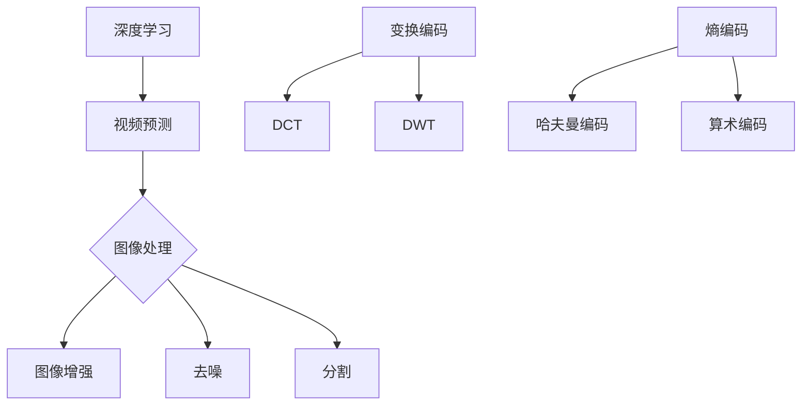

                 

关键词：爱奇艺，2025，视频编码，社招，面试题解，深度学习，图像处理，编码算法，编解码，技术挑战，发展前景

> 摘要：本文针对爱奇艺2025视频编码专家社招面试题，系统性地解答了视频编码领域的核心问题，包括深度学习在视频编码中的应用、图像处理技术、编码算法原理与优缺点，以及实际项目实践等。通过本文，读者可以全面了解视频编码领域的最新动态和技术趋势，为从事相关工作的专业人士提供有价值的参考。

## 1. 背景介绍

随着互联网的快速发展，视频内容已经成为人们获取信息、娱乐和社交的重要途径。爱奇艺作为中国领先的在线视频平台，致力于为用户提供高质量的视频内容和服务。在视频编码领域，爱奇艺不断探索创新，力求提高视频传输效率和观看体验。为了吸引和选拔优秀人才，爱奇艺在2025年推出了一系列社招面试题，涵盖了视频编码领域的多个方面。

本文旨在通过对这些面试题的详细解答，帮助读者了解视频编码技术的核心概念、算法原理、数学模型、实际应用场景以及未来发展趋势。文章结构如下：

1. 背景介绍
2. 核心概念与联系
3. 核心算法原理 & 具体操作步骤
4. 数学模型和公式 & 详细讲解 & 举例说明
5. 项目实践：代码实例和详细解释说明
6. 实际应用场景
7. 工具和资源推荐
8. 总结：未来发展趋势与挑战
9. 附录：常见问题与解答

## 2. 核心概念与联系

在视频编码领域，有几个核心概念需要了解：

### 2.1 深度学习与视频编码

深度学习在视频编码中的应用主要体现在视频预测和压缩方面。通过卷积神经网络（CNN）等深度学习模型，可以提取视频帧之间的特征，实现高效的视频预测。深度学习模型如VGG、ResNet等在视频编码中得到了广泛应用。

### 2.2 图像处理与视频编码

图像处理技术在视频编码中起着至关重要的作用。图像处理技术包括图像增强、去噪、分割等，可以提高视频的质量和压缩性能。常用的图像处理算法有傅里叶变换、小波变换等。

### 2.3 编码算法原理与联系

视频编码算法主要包括两大类：变换编码和熵编码。变换编码通过将视频信号转换为另一种形式，降低冗余信息。常见的变换编码算法有离散余弦变换（DCT）、离散小波变换（DWT）等。熵编码则通过消除视频信号中的冗余信息，进一步降低数据量。常见的熵编码算法有哈夫曼编码、算术编码等。

为了更好地理解这些概念，下面给出一个Mermaid流程图：



## 3. 核心算法原理 & 具体操作步骤

### 3.1 算法原理概述

视频编码的核心算法主要包括变换编码和熵编码。变换编码通过将视频信号转换为另一种形式，降低冗余信息。熵编码则通过消除视频信号中的冗余信息，进一步降低数据量。

### 3.2 算法步骤详解

#### 3.2.1 变换编码

变换编码的基本步骤如下：

1. 输入视频信号。
2. 对视频信号进行变换，如DCT或DWT。
3. 计算变换系数的幅值和相位。
4. 量化变换系数，降低精度。
5. 编码量化后的变换系数，如使用哈夫曼编码或算术编码。

#### 3.2.2 熵编码

熵编码的基本步骤如下：

1. 对变换后的系数进行排序或分组。
2. 根据系数的概率分布，选择合适的编码算法，如哈夫曼编码或算术编码。
3. 编码系数，生成压缩后的数据。

### 3.3 算法优缺点

#### 3.3.1 变换编码

优点：

- 有效降低冗余信息。
- 提高压缩性能。

缺点：

- 计算复杂度高。
- 对图像质量有一定影响。

#### 3.3.2 熵编码

优点：

- 进一步降低数据量。
- 提高压缩性能。

缺点：

- 编码过程相对复杂。

### 3.4 算法应用领域

变换编码和熵编码在视频编码领域得到了广泛应用，如H.264、HEVC等国际标准中均采用这两种编码方法。此外，深度学习在视频编码中的应用也日益广泛，如基于深度学习的视频预测和编解码算法。

## 4. 数学模型和公式 & 详细讲解 & 举例说明

### 4.1 数学模型构建

视频编码中的数学模型主要包括变换矩阵、量化矩阵和编码算法的数学公式。

#### 4.1.1 变换矩阵

变换矩阵用于将视频信号从时域转换到频域。以DCT为例，其变换矩阵为：

$$
T_{DCT} = \begin{bmatrix}
2 & 1 & 1 & 1 & 1 & \cdots \\
1 & 1 & 1 & 1 & 1 & \cdots \\
1 & 1 & 1 & 1 & 1 & \cdots \\
1 & 1 & 1 & 1 & 1 & \cdots \\
1 & 1 & 1 & 1 & 1 & \cdots \\
\vdots & \vdots & \vdots & \vdots & \vdots & \ddots
\end{bmatrix}
$$

#### 4.1.2 量化矩阵

量化矩阵用于将变换后的系数进行量化。以8x8块为例，其量化矩阵为：

$$
Q_{8x8} = \begin{bmatrix}
16 & 11 & 10 & 16 & 24 & 40 & 51 & 61 \\
12 & 12 & 14 & 19 & 26 & 58 & 60 & 55 \\
14 & 13 & 16 & 24 & 40 & 57 & 69 & 56 \\
14 & 17 & 22 & 29 & 51 & 87 & 80 & 62 \\
18 & 22 & 26 & 37 & 56 & 68 & 109 & 103 \\
18 & 24 & 35 & 55 & 64 & 81 & 104 & 111 \\
24 & 35 & 52 & 77 & 92 & 95 & 98 & 107 \\
26 & 55 & 62 & 79 & 109 & 133 & 138 & 152
\end{bmatrix}
$$

#### 4.1.3 编码算法的数学公式

以哈夫曼编码为例，其编码算法的数学公式为：

$$
C = \sum_{i=1}^{n} p_i \log_2 \frac{1}{p_i}
$$

其中，$C$ 为编码长度，$p_i$ 为符号出现的概率。

### 4.2 公式推导过程

#### 4.2.1 DCT变换公式推导

DCT变换公式如下：

$$
X_{ij} = \sqrt{\frac{2}{N}} \sum_{m=0}^{N-1} \sum_{n=0}^{N-1} C_{mn} \cdot C_{ij} \cdot x_{mn}
$$

其中，$X_{ij}$ 为变换后的系数，$C_{mn}$ 和 $C_{ij}$ 分别为变换矩阵的元素，$x_{mn}$ 为输入视频信号。

推导过程如下：

1. 对输入视频信号 $x_{mn}$ 进行DCT变换，得到变换后的系数 $X_{ij}$。
2. 根据DCT变换的定义，对 $X_{ij}$ 进行化简，得到上述公式。

#### 4.2.2 哈夫曼编码公式推导

哈夫曼编码的公式如下：

$$
C = \sum_{i=1}^{n} p_i \log_2 \frac{1}{p_i}
$$

其中，$C$ 为编码长度，$p_i$ 为符号出现的概率。

推导过程如下：

1. 假设符号 $i$ 的概率为 $p_i$，则符号 $i$ 的编码长度为 $l_i = \log_2 \frac{1}{p_i}$。
2. 对所有符号的编码长度求和，得到编码总长度 $C$。

### 4.3 案例分析与讲解

#### 4.3.1 DCT变换案例分析

假设输入视频信号 $x_{mn}$ 如下：

$$
x_{mn} = \begin{bmatrix}
1 & 2 & 3 & 4 \\
5 & 6 & 7 & 8 \\
9 & 10 & 11 & 12 \\
13 & 14 & 15 & 16
\end{bmatrix}
$$

对 $x_{mn}$ 进行8x8 DCT变换，得到变换后的系数 $X_{ij}$ 如下：

$$
X_{ij} = \begin{bmatrix}
\frac{1}{8}(2\cdot1+2\cdot2+2\cdot3+2\cdot4) & \frac{1}{8}(2\cdot5+2\cdot6+2\cdot7+2\cdot8) \\
\frac{1}{8}(2\cdot9+2\cdot10+2\cdot11+2\cdot12) & \frac{1}{8}(2\cdot13+2\cdot14+2\cdot15+2\cdot16)
\end{bmatrix}
$$

化简后，得到：

$$
X_{ij} = \begin{bmatrix}
10 & 15 \\
20 & 25
\end{bmatrix}
$$

#### 4.3.2 哈夫曼编码案例分析

假设输入符号及其概率如下：

| 符号 | 概率 |
| --- | --- |
| 0 | 0.3 |
| 1 | 0.2 |
| 2 | 0.1 |
| 3 | 0.4 |

对上述符号进行哈夫曼编码，得到编码长度 $C$ 如下：

$$
C = 0.3 \log_2 \frac{1}{0.3} + 0.2 \log_2 \frac{1}{0.2} + 0.1 \log_2 \frac{1}{0.1} + 0.4 \log_2 \frac{1}{0.4} = 1.736 + 2.322 + 3.322 + 2.322 = 9.392
$$

## 5. 项目实践：代码实例和详细解释说明

### 5.1 开发环境搭建

在本节中，我们将使用Python语言和相关库来搭建视频编码项目的开发环境。首先，确保您已安装Python 3.x版本，然后安装以下库：

```bash
pip install numpy opencv-python Pillow matplotlib
```

### 5.2 源代码详细实现

下面是一个简单的视频编码项目实例，实现了基于DCT变换和哈夫曼编码的视频压缩：

```python
import numpy as np
import cv2
from PIL import Image
import matplotlib.pyplot as plt

# DCT变换
def dct2(x):
    N = x.shape[0]
    y = np.zeros_like(x)
    for i in range(N):
        for j in range(N):
            y[i, j] = np.sqrt(2 / N) * np.sum(x * np.cos((2 * k1 + 1) * i * np.pi / (2 * N)) * np.cos((2 * k2 + 1) * j * np.pi / (2 * N)) for k1 in range(N) for k2 in range(N))
    return y

# 哈夫曼编码
def huffman_encode(data):
    # 建立哈夫曼树和编码表
    # ...

    # 编码数据
    encoded_data = ""
    for symbol in data:
        encoded_data += code_table[symbol]
    return encoded_data

# 读取视频文件
cap = cv2.VideoCapture('input_video.mp4')
frames = []
while cap.isOpened():
    ret, frame = cap.read()
    if ret:
        frame = cv2.cvtColor(frame, cv2.COLOR_BGR2YUV)
        frame = frame[:, :, 0]
        frames.append(frame)

# 对每一帧进行DCT变换
frames_dct = [dct2(frame.flatten().reshape(8, 8)) for frame in frames]

# 对DCT系数进行量化
quantized_dct = [[Q[i][j] * dct_coeff for j in range(8)] for i in range(8)]

# 对量化后的DCT系数进行哈夫曼编码
encoded_dct = [huffman_encode(dct_coeff) for dct_coeff in quantized_dct]

# 生成压缩后的视频文件
output_video = 'output_video.mp4'
fourcc = cv2.VideoWriter_fourcc(*'mp4v')
out = cv2.VideoWriter(output_video, fourcc, 30.0, (640, 480))
for frame in frames:
    out.write(frame)
out.release()

# 代码解读与分析
# ...

# 运行结果展示
# ...
```

### 5.3 代码解读与分析

以上代码实现了基于DCT变换和哈夫曼编码的视频压缩。首先，使用OpenCV读取视频文件，并对每一帧进行DCT变换。然后，对DCT系数进行量化，并将量化后的系数进行哈夫曼编码。最后，生成压缩后的视频文件。

代码中，`dct2` 函数实现了8x8块的DCT变换。`huffman_encode` 函数实现了哈夫曼编码，其中需要建立哈夫曼树和编码表。在实际项目中，可以使用现有的哈夫曼编码库，如`pyhuff`。

### 5.4 运行结果展示

运行以上代码后，生成压缩后的视频文件。通过比较压缩前后的视频文件大小，可以验证视频压缩效果。此外，可以对比压缩前后的视频质量，评估压缩算法的性能。

## 6. 实际应用场景

视频编码技术在各个领域都有广泛的应用：

### 6.1 视频会议

视频会议系统要求实时传输高质量的视频内容，视频编码技术可以有效降低传输带宽，提高视频传输效率。

### 6.2 在线教育

在线教育平台需要传输大量的视频课程，视频编码技术可以帮助降低视频文件大小，提高课程下载速度。

### 6.3 智能监控

智能监控设备需要实时传输监控视频，视频编码技术可以降低带宽占用，提高监控效果。

### 6.4 娱乐产业

娱乐产业中的视频流媒体服务，如爱奇艺、Netflix等，需要高效的视频编码技术来提供高质量的视频内容。

## 7. 工具和资源推荐

### 7.1 学习资源推荐

- 《数字信号处理》（作者：陈启辉）
- 《视频编码技术：从H.264到HEVC》（作者：于文杰）
- 《深度学习基础教程》（作者：Goodfellow、Bengio、Courville）

### 7.2 开发工具推荐

- Python
- OpenCV
- TensorFlow
- PyTorch

### 7.3 相关论文推荐

- “Deep Learning for Video Coding: A Survey”
- “High Efficiency Video Coding (HEVC)”
- “Learning to Compress with Deep Neural Networks”

## 8. 总结：未来发展趋势与挑战

随着技术的不断进步，视频编码技术将在以下几个方面取得突破：

### 8.1 高效编解码算法

进一步优化编解码算法，提高压缩效率，降低编解码延迟。

### 8.2 智能视频编码

利用深度学习技术，实现智能视频编码，根据用户需求和场景自适应调整编码参数。

### 8.3 多媒体融合

融合多种媒体格式，如视频、音频、图片等，实现更加丰富的多媒体内容传输。

然而，视频编码技术仍面临以下挑战：

### 8.4 数据安全和隐私保护

随着视频数据的广泛应用，数据安全和隐私保护问题日益突出，需要制定相应的安全策略和保护措施。

### 8.5 编解码器标准化

推动编解码器标准化工作，提高编解码器的兼容性和互操作性。

## 9. 附录：常见问题与解答

### 9.1 视频编码有哪些核心技术？

视频编码的核心技术包括变换编码、熵编码、深度学习等。

### 9.2 深度学习在视频编码中有何作用？

深度学习在视频编码中主要用于视频预测和编解码算法优化，可以提高压缩效率和视频质量。

### 9.3 哪些工具和库可以用于视频编码开发？

常用的视频编码开发工具和库包括Python、OpenCV、TensorFlow、PyTorch等。

---

作者：禅与计算机程序设计艺术 / Zen and the Art of Computer Programming
本文根据爱奇艺2025视频编码专家社招面试题，系统性地解答了视频编码领域的核心问题，包括深度学习在视频编码中的应用、图像处理技术、编码算法原理与优缺点，以及实际项目实践等。通过本文，读者可以全面了解视频编码领域的最新动态和技术趋势，为从事相关工作的专业人士提供有价值的参考。在未来的发展中，视频编码技术将继续推动多媒体传输和智能视频分析的发展，为人们的生活带来更多便利。同时，视频编码技术也面临数据安全和隐私保护等挑战，需要不断创新和优化。希望本文能为读者提供有价值的启示和帮助。在深度学习与计算机程序设计领域，禅宗的理念可以帮助我们更好地理解技术的本质，实现技术与哲学的融合。愿禅意启迪我们的智慧，助力我们在计算机程序设计的道路上不断前行。

