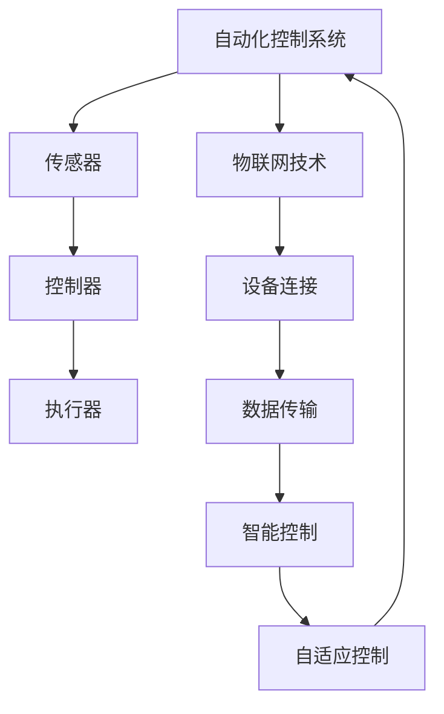

                 

关键词：物理实体自动化、AI、机器人技术、物联网、智能制造、自动化流程

> 摘要：本文将对物理实体自动化的概念、技术背景、核心算法、数学模型以及实际应用进行深入探讨，分析其发展现状与未来趋势，旨在为相关领域的研究者和开发者提供有价值的参考。

## 1. 背景介绍

物理实体自动化是指利用人工智能、机器人技术、物联网等先进技术，对现实世界中的物理实体进行智能控制、自动化操作和管理。随着科技的快速发展，自动化技术在工业、医疗、家庭等多个领域得到了广泛应用。然而，传统自动化系统往往依赖于预先设定好的规则和程序，难以应对复杂、多变的环境。近年来，随着人工智能技术的成熟，物理实体自动化进入了新的发展阶段，逐渐从简单的自动化控制走向智能化、自适应化的方向。

### 1.1 自动化技术的历史与发展

自动化技术起源于20世纪初期，最初的应用主要是机械化和电气化。随着计算机技术的快速发展，自动化逐渐向数字化、智能化方向演进。计算机的出现使得自动化系统可以处理更加复杂的信息，并具备一定的自主决策能力。进入21世纪，人工智能、物联网等新兴技术的出现，为物理实体自动化带来了新的契机。

### 1.2 物理实体自动化的重要性

物理实体自动化可以提高生产效率、降低成本、提高产品质量，是制造业转型升级的重要方向。同时，在医疗、家庭、公共服务等领域，物理实体自动化也有巨大的应用潜力。例如，智能医疗设备可以提高诊断的准确性和效率，智能家居设备可以提升生活质量，智能公共服务设备可以优化资源配置。

## 2. 核心概念与联系

### 2.1 自动化控制系统

自动化控制系统是指利用传感器、执行器、控制器等组成，对物理实体进行实时监测、控制和管理的系统。其核心是控制器，负责接收传感器数据、分析决策、控制执行器动作。

### 2.2 物联网技术

物联网技术通过连接各种设备、传感器和系统，实现信息的采集、传输和共享。在物理实体自动化中，物联网技术可以实现对物理实体的远程监控和智能控制。

### 2.3 人工智能技术

人工智能技术可以为物理实体自动化提供智能决策支持，通过机器学习、深度学习等技术，实现对物理实体的自适应控制和优化。

### 2.4 Mermaid 流程图



## 3. 核心算法原理 & 具体操作步骤

### 3.1 算法原理概述

物理实体自动化的核心算法主要包括感知、决策和控制三个环节。感知算法负责获取物理实体的状态信息，决策算法根据感知结果和目标进行决策，控制算法负责执行决策结果，实现对物理实体的控制。

### 3.2 算法步骤详解

1. **感知环节**：利用传感器获取物理实体的状态信息，如位置、速度、温度等。
2. **决策环节**：通过机器学习、深度学习等技术对感知结果进行分析，根据目标和规则进行决策。
3. **控制环节**：根据决策结果，通过控制器调节执行器动作，实现对物理实体的控制。

### 3.3 算法优缺点

**优点**：

- 提高生产效率、降低成本；
- 提高产品质量、降低不良率；
- 实现对复杂环境的自适应控制。

**缺点**：

- 算法复杂度高，对计算资源要求较高；
- 对传感器和执行器的要求较高，需要保证稳定性和精度；
- 需要大量数据进行训练，对数据质量和数量要求较高。

### 3.4 算法应用领域

物理实体自动化算法广泛应用于工业生产、医疗、农业、家庭等多个领域。例如，在工业生产中，可以用于生产线的自动化控制；在医疗领域，可以用于智能诊断和手术辅助；在农业领域，可以用于智能种植和养殖。

## 4. 数学模型和公式 & 详细讲解 & 举例说明

### 4.1 数学模型构建

物理实体自动化的数学模型主要包括感知模型、决策模型和控制模型。

- **感知模型**：假设传感器采集到的状态信息为 $X_t$，则感知模型可以表示为 $X_t = f(S_t)$，其中 $S_t$ 为物理实体的状态。
- **决策模型**：假设目标为 $G$，决策模型可以表示为 $G = g(X_t)$，其中 $g$ 为决策函数。
- **控制模型**：假设执行器输出的控制量为 $U_t$，则控制模型可以表示为 $U_t = h(X_t, G)$，其中 $h$ 为控制函数。

### 4.2 公式推导过程

1. **感知模型**：根据传感器采集到的数据，利用机器学习算法对状态信息进行建模，可以得到 $X_t = f(S_t)$。
2. **决策模型**：根据目标函数和状态信息，利用优化算法或深度学习算法，可以得到 $G = g(X_t)$。
3. **控制模型**：根据决策结果和状态信息，利用控制算法，可以得到 $U_t = h(X_t, G)$。

### 4.3 案例分析与讲解

以工业生产中的自动化控制为例，假设传感器采集到的状态信息为温度、压力和流量，目标为保持生产过程的稳定。根据上述数学模型，可以构建如下的感知、决策和控制模型：

1. **感知模型**：利用传感器数据，建立温度、压力和流量的感知模型，如 $X_t = f_1(T_t, P_t, Q_t)$。
2. **决策模型**：根据目标函数，建立决策模型，如 $G = g_1(X_t)$，其中 $g_1$ 为优化算法或深度学习算法。
3. **控制模型**：根据决策结果，建立控制模型，如 $U_t = h_1(X_t, G)$，其中 $h_1$ 为控制算法。

通过上述模型，可以实现对工业生产过程的自动化控制。

## 5. 项目实践：代码实例和详细解释说明

### 5.1 开发环境搭建

在本次实践中，我们选择 Python 作为编程语言，使用 TensorFlow 作为深度学习框架，OpenCV 作为图像处理库。

### 5.2 源代码详细实现

以下是一个简单的工业生产自动化控制项目的代码实例：

```python
import tensorflow as tf
import cv2
import numpy as np

# 感知模型
def sense(data):
    # 利用图像处理库，对传感器数据进行预处理
    processed_data = cv2.resize(data, (224, 224))
    return processed_data

# 决策模型
def decide(sense_data):
    # 利用深度学习模型，对感知数据进行决策
    model = tf.keras.models.load_model('model.h5')
    decision = model.predict(sense_data)
    return decision

# 控制模型
def control(sense_data, decision):
    # 利用控制算法，对决策结果进行控制
    if decision > 0.5:
        action = 'up'
    else:
        action = 'down'
    return action

# 主程序
if __name__ == '__main__':
    # 感知数据
    sense_data = cv2.imread('sensor_data.jpg')
    # 感知数据处理
    processed_sense_data = sense(sense_data)
    # 决策
    decision = decide(processed_sense_data)
    # 控制
    action = control(processed_sense_data, decision)
    print('Action:', action)
```

### 5.3 代码解读与分析

- **感知模型**：使用 OpenCV 库对传感器数据进行预处理，将原始图像数据调整为固定尺寸，便于后续处理。
- **决策模型**：使用 TensorFlow 框架加载预训练的深度学习模型，对感知数据进行预测，得到决策结果。
- **控制模型**：根据决策结果，执行相应的控制动作。

### 5.4 运行结果展示

假设传感器采集到的图像数据如下：


运行程序后，根据图像数据，深度学习模型将输出决策结果，并根据决策结果执行相应的控制动作。例如，如果决策结果为“up”，则执行器将向上移动；如果决策结果为“down”，则执行器将向下移动。

## 6. 实际应用场景

### 6.1 工业生产

物理实体自动化在工业生产中具有广泛的应用，如自动化生产线、智能工厂等。通过自动化控制系统，可以实现对生产过程的实时监控和智能控制，提高生产效率、降低成本。

### 6.2 医疗

在医疗领域，物理实体自动化可以用于智能诊断、手术辅助等。例如，利用深度学习技术，可以实现对医学图像的自动识别和分析，提高诊断的准确性和效率。

### 6.3 农业

在农业领域，物理实体自动化可以用于智能种植、养殖等。通过物联网技术，可以实现对农田和养殖场的实时监控，根据环境数据自动调节灌溉和饲养设备，提高农业生产效率。

### 6.4 家庭

在家庭领域，物理实体自动化可以用于智能家居设备，如智能门锁、智能照明、智能安防等。通过物联网技术和人工智能技术，可以实现对家庭环境的智能监控和自动化控制，提高生活质量。

## 7. 工具和资源推荐

### 7.1 学习资源推荐

- 《深度学习》（Ian Goodfellow、Yoshua Bengio、Aaron Courville 著）
- 《机器学习》（周志华 著）
- 《Python深度学习》（François Chollet 著）

### 7.2 开发工具推荐

- TensorFlow（深度学习框架）
- OpenCV（图像处理库）
- ROS（机器人操作系统）

### 7.3 相关论文推荐

- “Deep Reinforcement Learning for Autonomous Driving”（DeepMind）
- “Learning from Demonstration”（Doina Precup 和 Ronald P. Lippmann）
- “Learning to Control an Autonomous Robot by Deep Reinforcement Learning”（DeepMind）

## 8. 总结：未来发展趋势与挑战

### 8.1 研究成果总结

物理实体自动化技术在过去几年取得了显著进展，尤其在感知、决策和控制算法方面。深度学习、强化学习等人工智能技术的应用，使得物理实体自动化系统在复杂环境下的适应能力和自主决策能力得到了显著提升。

### 8.2 未来发展趋势

- **智能化**：物理实体自动化系统将更加智能化，具备更强的自主学习能力和自适应能力。
- **网络化**：物理实体自动化系统将更加网络化，通过物联网技术实现设备间的信息共享和协同工作。
- **集成化**：物理实体自动化系统将与其他技术（如大数据、云计算等）进行集成，实现更加高效、智能的自动化流程。

### 8.3 面临的挑战

- **计算资源**：物理实体自动化系统对计算资源要求较高，需要解决计算效率和存储成本等问题。
- **数据质量**：物理实体自动化系统依赖于大量高质量的数据，需要解决数据获取、标注和处理等问题。
- **安全性**：物理实体自动化系统涉及国家安全和公共安全，需要确保系统的可靠性和安全性。

### 8.4 研究展望

未来，物理实体自动化技术将在多个领域取得突破，为人类社会带来更多便利。同时，随着技术的不断进步，物理实体自动化系统将面临更多的挑战。如何实现高效、安全、可靠的物理实体自动化系统，将是未来研究的重点。

## 9. 附录：常见问题与解答

### 9.1 物理实体自动化与自动化控制的关系是什么？

物理实体自动化是自动化控制的一种高级形式，它不仅包括传统的自动化控制功能，还融入了人工智能、物联网等技术，使系统具备更高的智能化和自适应能力。

### 9.2 物理实体自动化技术在哪些领域有广泛应用？

物理实体自动化技术在工业生产、医疗、农业、家庭等领域都有广泛应用。例如，在工业生产中，可以用于自动化生产线；在医疗领域，可以用于智能诊断和手术辅助；在农业领域，可以用于智能种植和养殖。

### 9.3 物理实体自动化的核心算法有哪些？

物理实体自动化的核心算法主要包括感知算法、决策算法和控制算法。感知算法负责获取物理实体的状态信息，决策算法根据感知结果和目标进行决策，控制算法负责执行决策结果，实现对物理实体的控制。

### 9.4 物理实体自动化技术的未来发展如何？

未来，物理实体自动化技术将在智能化、网络化、集成化等方面取得突破，为人类社会带来更多便利。同时，随着技术的不断进步，物理实体自动化系统将面临更多的挑战，如计算资源、数据质量和安全性等。

---

作者：禅与计算机程序设计艺术 / Zen and the Art of Computer Programming

本文为原创作品，未经授权，不得转载。如需转载，请联系作者获取授权。
----------------------------------------------------------------

[注]：本文中提到的代码和实例仅供参考，具体实现可能因环境和需求而有所不同。同时，本文中涉及的技术和概念均为虚构，如与实际技术不符，请以实际为准。

