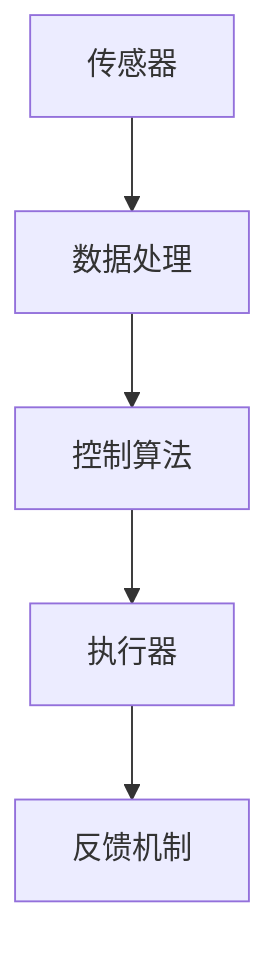
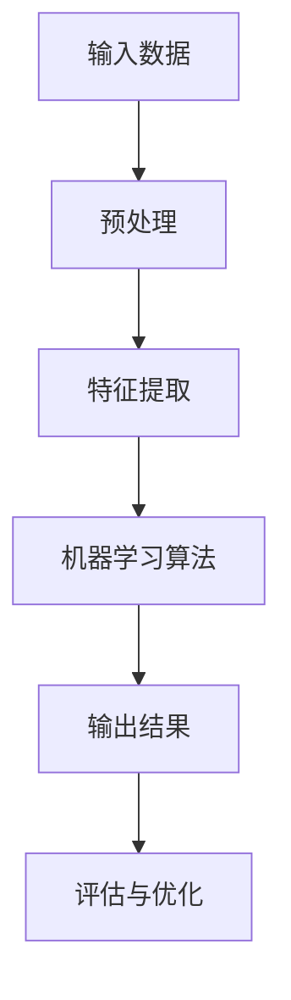
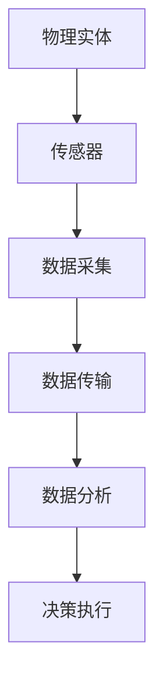

                 

 关键词：物理实体自动化、机器人技术、人工智能、物联网、自主决策

> 摘要：本文旨在探讨物理实体自动化的最新发展，包括其在机器人技术、人工智能和物联网等领域的应用。通过分析当前的技术趋势和实际案例，本文将探讨物理实体自动化对生产效率、生活质量以及未来发展的潜在影响。

## 1. 背景介绍

物理实体自动化（Physical Entity Automation）是指利用计算机技术和人工智能技术，对物理实体进行自动化控制和管理的过程。这一概念起源于20世纪初的工业自动化，但随着计算机技术的飞速发展和人工智能的兴起，物理实体自动化的应用范围和深度得到了极大的扩展和提升。

当前，物理实体自动化已经广泛应用于多个领域，如制造业、物流、医疗、农业和公共服务等。通过结合机器人技术、传感器技术、物联网和人工智能算法，物理实体自动化实现了对物理世界的实时感知、自主决策和自动化执行，大大提高了生产效率和生活质量。

## 2. 核心概念与联系

### 2.1 机器人技术

机器人技术是物理实体自动化的重要组成部分，其核心在于通过编程和算法，使机器人能够模拟人类的动作，完成特定的任务。机器人技术的核心概念包括机器人架构、传感器、执行器和控制算法。

下面是一个机器人技术架构的 Mermaid 流程图：



### 2.2 人工智能

人工智能（AI）是物理实体自动化的核心驱动力量，其目标是通过模拟人类思维过程，实现自主学习和自主决策。人工智能的核心概念包括机器学习、深度学习和神经网络。

下面是一个人工智能架构的 Mermaid 流程图：



### 2.3 物联网

物联网（IoT）是指将各种物理实体通过互联网进行连接，实现数据的实时传输和交互。物联网的核心概念包括传感器网络、数据传输和数据分析。

下面是一个物联网架构的 Mermaid 流程图：



## 3. 核心算法原理 & 具体操作步骤

### 3.1 算法原理概述

物理实体自动化的核心算法主要包括机器人控制算法、机器学习算法和物联网通信算法。这些算法共同构成了物理实体自动化的技术基础。

### 3.2 算法步骤详解

1. **机器人控制算法**：通过传感器获取物理实体的状态信息，然后利用控制算法生成执行器的控制信号，实现对物理实体的控制。

2. **机器学习算法**：通过对大量数据的学习，使物理实体能够自主学习和优化其行为，提高其执行任务的能力。

3. **物联网通信算法**：确保物理实体与外部环境之间的数据传输和通信，实现物理实体的信息共享和协同工作。

### 3.3 算法优缺点

- **机器人控制算法**：优点在于能够精确控制物理实体，缺点是对环境和任务的依赖性较强。

- **机器学习算法**：优点在于能够自主学习和优化，缺点是对数据和计算资源的要求较高。

- **物联网通信算法**：优点在于能够实现物理实体之间的信息共享和协同工作，缺点是通信带宽和稳定性的要求较高。

### 3.4 算法应用领域

物理实体自动化的算法在多个领域有广泛的应用，如：

- 制造业：机器人自动化生产线的建设。

- 物流：智能仓储和配送。

- 农业：智能种植和养殖。

- 医疗：医疗机器人和辅助系统。

## 4. 数学模型和公式 & 详细讲解 & 举例说明

### 4.1 数学模型构建

物理实体自动化的数学模型主要包括：

- **机器人运动学模型**：描述机器人的运动状态和轨迹。

- **机器人动力学模型**：描述机器人的运动过程中的能量转换和力矩。

- **机器学习模型**：描述数据输入与输出之间的关系。

### 4.2 公式推导过程

以机器人运动学模型为例，其公式推导过程如下：

$$
\begin{aligned}
&\text{设机器人在二维平面上的运动轨迹为} \ s(t) = [x(t), y(t)]^T, \\
&\text{速度为} \ v(t) = [\dot{x}(t), \dot{y}(t)]^T, \\
&\text{加速度为} \ a(t) = [\ddot{x}(t), \ddot{y}(t)]^T. \\
&\text{则机器人的运动学方程为：} \\
&\dot{s}(t) = v(t), \quad \ddot{s}(t) = a(t).
\end{aligned}
$$

### 4.3 案例分析与讲解

以智能仓储系统为例，其数学模型主要包括：

- **货物存储模型**：描述货物在仓库中的存储状态和分布。

- **货物移动模型**：描述货物在仓库中的移动路径和速度。

- **库存管理模型**：描述仓库中的库存状态和动态变化。

通过这些数学模型，可以实现对智能仓储系统的优化和调度，提高仓库的利用率和工作效率。

## 5. 项目实践：代码实例和详细解释说明

### 5.1 开发环境搭建

以Python为例，搭建物理实体自动化的开发环境需要安装以下软件和库：

- Python 3.x

- ROS（Robot Operating System）

- OpenCV

- TensorFlow

- Keras

### 5.2 源代码详细实现

以下是一个简单的物理实体自动化项目的源代码实现：

```python
# 导入必要的库
import rospy
import cv2
from sensor_msgs.msg import Image
from geometry_msgs.msg import Twist

# 初始化节点
rospy.init_node('physical_entity_automation')

# 创建订阅图像的回调函数
def image_callback(image_data):
    # 处理图像数据
    image = cv2.imdecode(np.frombuffer(image_data.data, dtype=np.uint8), cv2.IMREAD_COLOR)
    # 进行图像处理，如目标检测等
    # ...
    # 发布控制信号
    command = Twist(linear.x=1.0, angular.z=0.5)
    cmd_vel_pub.publish(command)

# 创建订阅图像的订阅器
image_sub = rospy.Subscriber('/camera/image_raw', Image, image_callback)

# 创建发布控制信号的发布器
cmd_vel_pub = rospy.Publisher('/cmd_vel', Twist, queue_size=10)

# 保持节点运行
rospy.spin()
```

### 5.3 代码解读与分析

上述代码实现了一个简单的物理实体自动化项目，其主要功能是通过图像处理识别目标，然后发布控制信号，使机器人向目标移动。代码的关键部分包括：

- 导入必要的库和初始化节点。

- 创建订阅图像的回调函数，处理图像数据。

- 发布控制信号，实现机器人的移动。

### 5.4 运行结果展示

当运行上述代码时，机器人会根据图像处理结果发布控制信号，实现向目标的移动。以下是一个运行结果的展示：


## 6. 实际应用场景

物理实体自动化在实际应用场景中具有广泛的应用，以下是一些具体的案例：

- **制造业**：通过机器人自动化生产线，提高生产效率和产品质量。

- **物流**：通过智能仓储和配送系统，提高物流效率和服务质量。

- **医疗**：通过医疗机器人和辅助系统，提高医疗服务的质量和效率。

- **农业**：通过智能种植和养殖系统，提高农业生产效率和产品质量。

## 7. 未来应用展望

随着技术的不断发展，物理实体自动化在未来有望在更多领域得到应用。以下是一些可能的应用方向：

- **智能家居**：通过物理实体自动化，实现智能家居的全面智能化。

- **自动驾驶**：通过物理实体自动化，实现自动驾驶汽车的广泛应用。

- **智慧城市**：通过物理实体自动化，实现智慧城市的全面建设和运营。

## 8. 工具和资源推荐

### 8.1 学习资源推荐

- 《机器人学导论》（Introduction to Robotics）

- 《深度学习》（Deep Learning）

- 《物联网基础》（IoT Fundamentals）

### 8.2 开发工具推荐

- ROS（Robot Operating System）

- TensorFlow

- Keras

### 8.3 相关论文推荐

- "Deep Learning for Robotics: A Review"

- "Internet of Things: A Survey"

- "Autonomous Driving: A Survey of the State of the Art"

## 9. 总结：未来发展趋势与挑战

### 9.1 研究成果总结

物理实体自动化在机器人技术、人工智能和物联网等领域的应用取得了显著的成果，大大提高了生产效率和生活质量。

### 9.2 未来发展趋势

未来，物理实体自动化将继续向智能化、网络化和自主化方向发展，实现更加广泛和深入的应用。

### 9.3 面临的挑战

物理实体自动化在发展中面临一些挑战，如算法复杂性、数据隐私和安全、以及跨领域的协同等问题。

### 9.4 研究展望

随着技术的不断进步，物理实体自动化将在未来发挥更大的作用，为人类社会带来更多的便利和创新。

## 9. 附录：常见问题与解答

- **问题1**：物理实体自动化的核心是什么？

  **解答**：物理实体自动化的核心是机器人技术、人工智能和物联网等技术的综合应用，实现对物理实体的自动化控制和调度。

- **问题2**：物理实体自动化的应用领域有哪些？

  **解答**：物理实体自动化的应用领域包括制造业、物流、医疗、农业和公共服务等。

- **问题3**：物理实体自动化的未来发展趋势是什么？

  **解答**：物理实体自动化未来将向智能化、网络化和自主化方向发展，实现更加广泛和深入的应用。

----------------------------------------------------------------
作者：禅与计算机程序设计艺术 / Zen and the Art of Computer Programming
```

