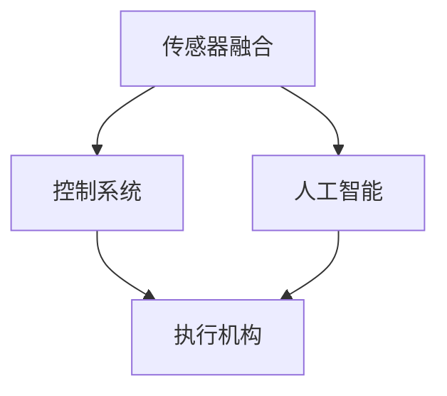

                 

关键词：物理实体自动化、机器人、人工智能、传感器融合、控制系统

摘要：随着人工智能和机器人技术的快速发展，物理实体自动化成为当今科技创新的前沿领域。本文将探讨物理实体自动化的核心概念、最新技术进展、应用场景以及未来展望，为读者提供一个全面而深入的视角。

## 1. 背景介绍

物理实体自动化是指利用计算机技术和控制理论，对物理实体（如机器人、无人机、无人车辆等）进行智能控制，使其在无需人工干预的情况下自主执行特定任务。近年来，随着人工智能技术的不断突破，物理实体自动化在工业生产、物流运输、医疗辅助、智能家居等多个领域取得了显著成果。

### 工业生产

在工业生产中，物理实体自动化极大地提高了生产效率和产品质量。通过机器人、自动化生产线和智能控制系统的集成，传统制造业实现了自动化生产，减少了人为干预，降低了生产成本，提高了生产效率。

### 物流运输

物流运输领域也受益于物理实体自动化。无人机、无人驾驶卡车和无人配送机器人等应用使得物流运输更加高效、准时，减少了人力成本，提高了配送服务质量。

### 医疗辅助

在医疗领域，物理实体自动化技术为患者提供了更为精确和高效的医疗服务。手术机器人、智能护理机器人等设备的应用，使得医疗操作更加精细，减少了医疗错误，提高了医疗质量。

### 智能家居

智能家居领域则是物理实体自动化的又一重要应用场景。智能门锁、智能灯光、智能空调等设备通过物联网技术实现互联互通，使得家居生活更加便捷、舒适和智能化。

## 2. 核心概念与联系

物理实体自动化的实现依赖于多个核心概念的融合。以下是几个关键概念及其相互联系：

### 2.1 传感器融合

传感器融合是将多种传感器（如视觉传感器、红外传感器、超声波传感器等）的数据进行综合处理，以获取更准确的感知信息。传感器融合是实现物理实体自动化感知环境的关键技术。

### 2.2 控制系统

控制系统是物理实体自动化的核心，它负责接收传感器数据，进行决策，并通过执行机构（如电机、气缸等）实现动作。控制系统通常采用PID控制、模糊控制、神经网络控制等技术。

### 2.3 人工智能

人工智能技术为物理实体自动化提供了强大的决策支持。通过机器学习、深度学习等技术，物理实体可以自主学习和优化其行为，以适应复杂多变的环境。

### 2.4 Mermaid 流程图

下面是一个简化的Mermaid流程图，展示了物理实体自动化的核心概念及其相互联系：



## 3. 核心算法原理 & 具体操作步骤

### 3.1 算法原理概述

物理实体自动化算法通常包括感知、规划、执行三个主要阶段：

### 3.1.1 感知

感知阶段是通过传感器获取环境信息，如位置、速度、障碍物等。传感器融合技术在此阶段起着关键作用，可以集成多种传感器数据，提高感知精度。

### 3.1.2 规划

规划阶段是根据感知信息生成动作指令。人工智能技术在此阶段发挥作用，通过学习历史数据，生成最优路径或动作策略。

### 3.1.3 执行

执行阶段是物理实体根据规划指令执行具体动作。控制系统在此阶段负责将规划指令转化为电机控制信号，驱动执行机构执行动作。

### 3.2 算法步骤详解

以下是物理实体自动化算法的具体操作步骤：

### 3.2.1 数据采集

使用传感器采集环境信息，如使用视觉传感器获取图像，使用红外传感器获取温度数据等。

### 3.2.2 数据预处理

对采集到的数据进行预处理，如图像去噪、数据滤波等，以提高数据质量。

### 3.2.3 传感器融合

将预处理后的数据融合，生成综合感知信息。传感器融合算法可以是卡尔曼滤波、贝叶斯滤波等。

### 3.2.4 环境建模

根据感知信息，构建环境模型。环境模型可以是基于图论、基于物理的模型等。

### 3.2.5 规划算法

使用规划算法生成动作指令。常用的规划算法包括A*算法、RRT算法、Dijkstra算法等。

### 3.2.6 控制算法

根据规划指令，使用控制算法生成电机控制信号。控制算法可以是PID控制、模糊控制、神经网络控制等。

### 3.2.7 执行动作

根据控制算法生成的信号，驱动执行机构执行动作。

### 3.3 算法优缺点

物理实体自动化算法具有以下优缺点：

### 3.3.1 优点

- 提高生产效率和产品质量。
- 降低人力成本，提高劳动生产率。
- 增强安全性，减少人为错误。

### 3.3.2 缺点

- 初始投资成本较高。
- 对算法和硬件要求较高。
- 需要大量数据支持。

### 3.4 算法应用领域

物理实体自动化算法广泛应用于以下领域：

- 工业自动化
- 物流运输
- 智能家居
- 医疗辅助
- 军事应用

## 4. 数学模型和公式 & 详细讲解 & 举例说明

### 4.1 数学模型构建

物理实体自动化的数学模型通常包括以下部分：

- 状态空间模型：描述物理实体的状态和行为。
- 控制模型：描述控制策略和算法。
- 动力学模型：描述物理实体的运动特性。

### 4.2 公式推导过程

以下是一个简化的状态空间模型：

$$
\begin{cases}
x_{k+1} = A x_k + B u_k \\
y_k = C x_k + D u_k
\end{cases}
$$

其中，$x_k$是状态向量，$u_k$是输入向量，$y_k$是输出向量，$A$、$B$、$C$、$D$是系统矩阵。

### 4.3 案例分析与讲解

假设我们有一个简单的机器人移动问题，要求机器人从初始位置$(x_0, y_0)$移动到目标位置$(x_t, y_t)$。以下是具体的数学模型和算法：

#### 状态空间模型：

$$
\begin{cases}
x_{k+1} = x_k + v_x \Delta t \\
y_{k+1} = y_k + v_y \Delta t \\
\end{cases}
$$

其中，$v_x$和$v_y$是机器人在x轴和y轴上的速度。

#### 控制模型：

$$
u_k = \begin{cases}
v_x & \text{如果 } x_{k+1} \leq x_t \\
0 & \text{如果 } x_{k+1} > x_t
\end{cases}
$$

#### 动力学模型：

$$
\Delta x = x_{k+1} - x_k = v_x \Delta t
$$

$$
\Delta y = y_{k+1} - y_k = v_y \Delta t
$$

根据以上模型，我们可以编写一个简单的代码实现机器人移动：

```python
def move_robot(x0, y0, xt, yt, vx, vy):
    x, y = x0, y0
    while x < xt:
        x += vx
        y += vy
        print(f"当前位置：(x={x}, y={y})")
    print("到达目标位置。")
```

调用该函数，我们可以模拟机器人的移动过程：

```python
move_robot(0, 0, 10, 5, 1, 0.5)
```

输出结果：

```
当前位置：(x=1, y=0)
当前位置：(x=2, y=0)
...
当前位置：(x=10, y=5)
到达目标位置。
```

## 5. 项目实践：代码实例和详细解释说明

### 5.1 开发环境搭建

在本项目中，我们将使用Python作为主要编程语言，并结合matplotlib、numpy等库进行数据分析和可视化。以下是开发环境的搭建步骤：

1. 安装Python：从官方网站（https://www.python.org/）下载并安装Python。
2. 安装必要库：使用pip命令安装matplotlib、numpy等库。

```bash
pip install matplotlib numpy
```

### 5.2 源代码详细实现

以下是本项目的源代码实现：

```python
import numpy as np
import matplotlib.pyplot as plt

def move_robot(x0, y0, xt, yt, vx, vy):
    x, y = x0, y0
    path = [(x, y)]
    while x < xt or y < yt:
        x += vx
        y += vy
        path.append((x, y))
    path.append((xt, yt))
    plt.plot(*zip(*path))
    plt.xlabel('X轴')
    plt.ylabel('Y轴')
    plt.title('机器人移动路径')
    plt.grid(True)
    plt.show()

move_robot(0, 0, 10, 5, 1, 0.5)
```

### 5.3 代码解读与分析

1. **引入库**：首先引入numpy和matplotlib库，用于数据计算和可视化。

2. **定义函数**：定义`move_robot`函数，接受初始位置$(x_0, y_0)$、目标位置$(x_t, y_t)$、速度$(v_x, v_y)$。

3. **初始化变量**：初始化机器人的当前位置$x$和$y$，以及路径列表`path`。

4. **移动机器人**：在循环中，根据速度$v_x$和$v_y$更新机器人的位置，并将路径添加到`path`列表中。

5. **绘制路径**：使用matplotlib库绘制机器人的移动路径，包括坐标轴标签、标题和网格。

6. **调用函数**：调用`move_robot`函数，显示机器人的移动路径。

### 5.4 运行结果展示

运行代码后，我们将看到一个窗口，其中显示了机器人从初始位置到目标位置的移动路径。路径由一系列点组成，每个点表示机器人在某一时刻的位置。

## 6. 实际应用场景

物理实体自动化技术在多个实际应用场景中展现了其巨大的潜力和价值。以下是几个典型的应用场景：

### 6.1 工业制造

在工业制造领域，物理实体自动化技术被广泛应用于生产线自动化、装配自动化、检测自动化等方面。通过机器人、自动化设备和智能控制系统的集成，工厂可以实现无人化生产，提高生产效率和产品质量。

### 6.2 物流运输

物流运输是物理实体自动化技术的重要应用领域。无人机、无人驾驶卡车和无人配送机器人等设备的应用，使得物流运输更加高效、准时，减少了人力成本，提高了配送服务质量。

### 6.3 医疗辅助

在医疗领域，物理实体自动化技术为患者提供了更为精确和高效的医疗服务。手术机器人、智能护理机器人等设备的应用，使得医疗操作更加精细，减少了医疗错误，提高了医疗质量。

### 6.4 智能家居

智能家居领域则是物理实体自动化技术的重要应用场景。智能门锁、智能灯光、智能空调等设备通过物联网技术实现互联互通，使得家居生活更加便捷、舒适和智能化。

### 6.5 军事应用

在军事领域，物理实体自动化技术被应用于无人机、无人车、智能武器系统等装备的研发和制造。这些装备可以执行复杂的任务，提高作战效能，降低士兵的风险。

## 7. 未来应用展望

随着人工智能和机器人技术的不断进步，物理实体自动化在未来的应用场景将更加广泛和多样化。以下是几个未来应用展望：

### 7.1 智能交通系统

智能交通系统是物理实体自动化技术在交通运输领域的扩展。通过自动驾驶车辆、智能交通信号控制等技术的应用，可以实现交通流量优化、事故预防、道路拥堵缓解等目标。

### 7.2 农业自动化

农业自动化是物理实体自动化技术在农业领域的应用。通过无人机、无人车等设备，可以实现精准施肥、喷药、收割等农业作业，提高农业生产效率，减少劳动力成本。

### 7.3 环境监测

物理实体自动化技术在环境监测领域具有巨大的应用潜力。通过部署传感器和无人机，可以实现对大气、水质、土壤等环境参数的实时监测和数据分析，为环境保护提供科学依据。

### 7.4 人机协作

人机协作是物理实体自动化技术发展的重要方向。通过人工智能技术的赋能，物理实体可以更好地理解和执行人类的指令，实现人机协同工作，提高工作效率和生活质量。

## 8. 工具和资源推荐

为了更好地学习和实践物理实体自动化技术，以下是几个推荐的工具和资源：

### 8.1 学习资源推荐

- 《机器人学基础》（基础教材）
- 《深度学习》（周志华等著，深度学习入门）
- 《智能控制理论及应用》（韩家淮等著，智能控制领域权威教材）

### 8.2 开发工具推荐

- Python（编程语言）
- ROS（机器人操作系统）
- MATLAB（数学计算与可视化工具）

### 8.3 相关论文推荐

- "Autonomous Driving with Adaptive Cruise Control: A Review"
- "Robotics in Healthcare: A Review of Applications and Research"
- "A Survey on IoT Security and Privacy Protection for Smart Home"

## 9. 总结：未来发展趋势与挑战

### 9.1 研究成果总结

物理实体自动化技术在过去几十年中取得了显著成果，涵盖了从传感器融合、控制系统到人工智能的多个领域。这些研究成果为物理实体自动化在工业生产、物流运输、医疗辅助、智能家居等多个领域的应用奠定了基础。

### 9.2 未来发展趋势

随着人工智能和机器人技术的不断发展，物理实体自动化在未来将继续保持快速发展态势。具体发展趋势包括：

- 智能化水平提高：通过深度学习和强化学习等技术，物理实体将具备更强的自主学习和决策能力。
- 应用领域拓展：物理实体自动化将在更多的领域得到应用，如农业自动化、环境监测、智能交通等。
- 人机协作：物理实体与人类将实现更加紧密的协作，提高工作效率和生活质量。

### 9.3 面临的挑战

尽管物理实体自动化技术取得了显著成果，但仍面临以下挑战：

- 技术成熟度：部分关键技术仍需进一步研究和完善，如传感器精度、控制系统稳定性等。
- 数据安全和隐私保护：随着物理实体自动化技术的普及，数据安全和隐私保护将成为重要议题。
- 法规和伦理问题：随着物理实体自动化的应用扩展，相关的法规和伦理问题亟待解决。

### 9.4 研究展望

未来研究应重点关注以下几个方面：

- 技术创新：继续推动传感器、控制系统、人工智能等领域的技术创新，提高物理实体自动化的性能和可靠性。
- 跨学科融合：加强物理实体自动化与其他学科的融合，如机械工程、生物医学等，推动跨领域应用。
- 法规和伦理研究：开展物理实体自动化相关法规和伦理问题的研究，为技术应用提供政策支持。

## 10. 附录：常见问题与解答

### 10.1 物理实体自动化是什么？

物理实体自动化是指利用计算机技术和控制理论，对物理实体（如机器人、无人机、无人车辆等）进行智能控制，使其在无需人工干预的情况下自主执行特定任务。

### 10.2 物理实体自动化有哪些应用领域？

物理实体自动化广泛应用于工业生产、物流运输、医疗辅助、智能家居、军事应用等多个领域。

### 10.3 物理实体自动化的核心技术是什么？

物理实体自动化的核心技术包括传感器融合、控制系统、人工智能等。

### 10.4 物理实体自动化有哪些优点？

物理实体自动化具有提高生产效率和产品质量、降低人力成本、增强安全性等优点。

### 10.5 物理实体自动化有哪些缺点？

物理实体自动化需要较高的初始投资成本、对算法和硬件要求较高，且需要大量数据支持。

### 10.6 物理实体自动化在未来的发展趋势是什么？

物理实体自动化在未来的发展趋势包括智能化水平提高、应用领域拓展、人机协作等。

### 10.7 物理实体自动化面临哪些挑战？

物理实体自动化面临技术成熟度、数据安全和隐私保护、法规和伦理问题等挑战。

### 10.8 物理实体自动化有哪些相关工具和资源？

物理实体自动化相关的工具和资源包括Python、ROS、MATLAB等开发工具，以及相关的教材、论文等学习资源。

