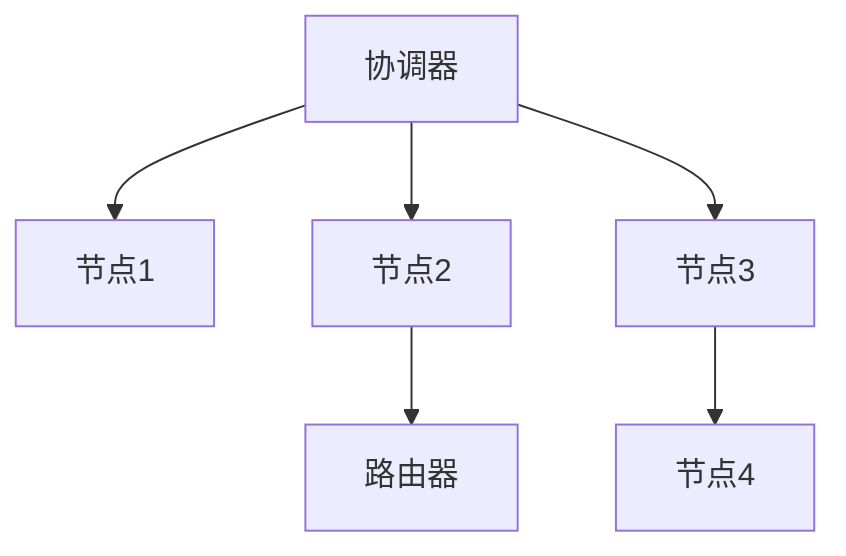
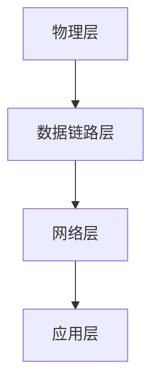
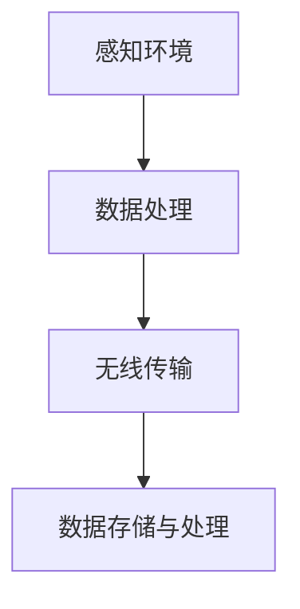

                 

关键词：物联网，传感器，Zigbee，集成，应用，技术

摘要：本文将探讨物联网（IoT）技术的发展及其在现代社会中的应用。特别是，本文将深入分析Zigbee传感器在物联网中的集成，介绍其核心概念、工作原理和应用领域。通过详细的数学模型和公式推导，我们希望能够帮助读者更好地理解Zigbee传感器的工作机制。此外，文章还提供了代码实例和实际应用场景，以展示Zigbee传感器在实际项目中的具体应用。最后，本文将对未来发展趋势与挑战进行展望，并提供相关工具和资源推荐。

## 1. 背景介绍

物联网（Internet of Things，简称IoT）是一种通过网络将各种设备、传感器和系统连接起来，以实现智能监控、自动化控制和管理的技术。随着物联网技术的不断发展，传感器在其中的作用越来越重要。传感器是物联网系统的感知层，负责收集环境数据并将其转换为可用的信息。这些信息可以用于监控、分析和控制各种设备和系统。

Zigbee是一种无线传感器网络（WSN）技术，具有低功耗、低成本、高可靠性和低延迟的特点。它基于IEEE 802.15.4标准，使用2.4GHz频段的无线信号进行通信。Zigbee传感器是物联网中常用的传感器之一，可以用于各种应用场景，如智能家居、智能农业、智能交通和智能医疗等。

本文将详细介绍Zigbee传感器的集成过程，探讨其在物联网中的应用，并通过数学模型和公式推导帮助读者更好地理解其工作原理。此外，文章还将提供代码实例和实际应用场景，以展示Zigbee传感器在实际项目中的具体应用。

### 1.1 物联网的发展历程

物联网的概念最早可以追溯到20世纪90年代，当时一些学者提出了将物理世界中的物体通过网络连接起来，以实现智能化管理和控制的设想。然而，随着互联网技术的快速发展，物联网的概念逐渐成熟，并开始在实际应用中取得突破。

在物联网的发展历程中，有几个重要的里程碑：

- **1999年**：麻省理工学院（MIT）的Auto-ID中心提出了RFID（无线射频识别）技术，为物联网的发展奠定了基础。
- **2005年**：IBM公司提出了“智慧地球”的概念，推动了物联网在全球范围内的普及。
- **2008年**：物联网第一次被写入中国政府工作报告，成为中国经济发展的重要战略。
- **2013年**：中国正式发布了《物联网“十二五”发展规划》，明确了物联网在未来五年内的战略目标和重点任务。
- **2015年**：物联网在全球范围内的应用逐渐成熟，智能家居、智能交通、智能医疗等领域的应用逐渐普及。

### 1.2 Zigbee技术的发展历程

Zigbee技术最早起源于1998年，由美国 zigbee 联盟（Zigbee Alliance）提出，旨在为低功耗、低速率、短距离的无线通信提供一种标准化的解决方案。Zigbee技术基于IEEE 802.15.4标准，采用了2.4GHz频段的无线信号进行通信。

Zigbee技术的发展历程可以分为以下几个阶段：

- **1998年**：Zigbee 联盟成立，开始制定Zigbee标准。
- **2003年**：Zigbee 1.0标准正式发布，标志着Zigbee技术的诞生。
- **2006年**：Zigbee 1.1标准发布，对Zigbee网络层和应用程序层进行了改进。
- **2008年**：Zigbee 1.2标准发布，增加了安全性功能。
- **2010年**：Zigbee 1.3标准发布，进一步提高了网络性能和安全性。
- **2015年**：Zigbee 3.0标准发布，增加了支持IPv6和6LoWPAN协议，实现了Zigbee与其他物联网技术的无缝连接。

### 1.3 Zigbee传感器的基本原理

Zigbee传感器是物联网系统中的重要组成部分，其基本原理如下：

1. **感知环境**：Zigbee传感器通过内置的传感器模块（如温度传感器、湿度传感器、光敏传感器等）感知周围环境，并将感知到的信息转换为电信号。
2. **数据处理**：传感器收集到的信息通过Zigbee模块进行处理和转换，使其符合通信协议的要求。
3. **无线传输**：经过处理的传感器数据通过Zigbee无线网络传输到网关或中心服务器。
4. **数据存储与处理**：网关或中心服务器对传感器数据进行存储、分析和处理，为用户提供智能化的监控和管理服务。

### 1.4 Zigbee传感器在物联网中的应用

Zigbee传感器在物联网中具有广泛的应用，主要包括以下几个方面：

1. **智能家居**：Zigbee传感器可以用于智能家居系统中的各种设备，如智能灯泡、智能插座、智能门锁等，实现家电的远程控制和智能化管理。
2. **智能农业**：Zigbee传感器可以用于监测农田中的土壤湿度、温度、光照等环境参数，为农业提供智能化的种植和管理方案。
3. **智能交通**：Zigbee传感器可以用于监测交通流量、车速、天气等参数，为交通管理部门提供实时的交通信息，优化交通调度和安全管理。
4. **智能医疗**：Zigbee传感器可以用于监测患者的生命体征，如心率、血压、体温等，为医疗提供远程监护和健康管理服务。
5. **工业自动化**：Zigbee传感器可以用于监测工业生产线上的各种参数，如温度、湿度、压力等，实现工业生产的自动化控制和优化。

## 2. 核心概念与联系

### 2.1 Zigbee网络拓扑结构

Zigbee网络通常采用星型、树型和网状等拓扑结构。其中，星型拓扑结构是最常用的结构，它由一个协调器（Coordinator）和多个节点（End Device）组成。协调器负责网络的建立和维护，节点负责数据的感知和传输。树型拓扑结构是一种扩展的星型结构，通过添加路由器（Router）来扩展网络的覆盖范围。网状拓扑结构则是一种去中心化的结构，节点之间相互连接，形成一个独立的网络。

下面是一个简单的Zigbee网络拓扑结构的Mermaid流程图：



### 2.2 Zigbee通信协议

Zigbee通信协议是基于IEEE 802.15.4标准的，它定义了物理层、数据链路层和网络层的通信规范。Zigbee协议的物理层采用直接序列扩频（DSSS）技术，数据链路层包括介质访问控制（MAC）层和网络层。MAC层负责数据的传输控制和调度，网络层负责数据的路由和传输。

Zigbee通信协议的核心概念包括：

- **PAN（Personal Area Network）**：PAN是Zigbee网络的基本单元，它由一个协调器和一个或多个设备组成。PAN负责网络的建立、维护和关闭。
- **网络层**：网络层负责数据的路由和传输，它包括网络地址、网络管理和路由协议等。
- **安全机制**：Zigbee协议提供了多种安全机制，包括加密、认证和访问控制等，以保障数据的安全传输。

下面是一个简单的Zigbee通信协议的Mermaid流程图：



### 2.3 Zigbee传感器的工作原理

Zigbee传感器的工作原理可以分为以下几个步骤：

1. **感知环境**：传感器通过内置的传感器模块感知周围环境，如温度、湿度、光照等。
2. **数据处理**：传感器将感知到的信息进行处理和转换，使其符合通信协议的要求。
3. **无线传输**：经过处理的传感器数据通过Zigbee无线网络传输到协调器或其他节点。
4. **数据存储与处理**：协调器或其他节点将传感器数据进行存储、分析和处理，为用户提供智能化的监控和管理服务。

下面是一个简单的Zigbee传感器工作原理的Mermaid流程图：



## 3. 核心算法原理 & 具体操作步骤

### 3.1 算法原理概述

Zigbee传感器在物联网中的应用离不开核心算法的支持。核心算法主要包括数据采集、数据传输、数据解析和数据存储等几个方面。下面将分别介绍这些算法的原理和具体操作步骤。

### 3.2 算法步骤详解

#### 3.2.1 数据采集

数据采集是Zigbee传感器算法的核心环节。具体步骤如下：

1. **初始化传感器**：在启动传感器前，需要对传感器进行初始化，确保其能够正常工作。
2. **读取传感器数据**：通过传感器模块读取环境数据，如温度、湿度、光照等。
3. **数据预处理**：对读取到的数据进行分析和预处理，如去除异常值、进行数据平滑处理等。

#### 3.2.2 数据传输

数据传输是将传感器采集到的数据通过Zigbee无线网络传输到协调器或其他节点的过程。具体步骤如下：

1. **建立连接**：传感器需要与协调器或其他节点建立连接。
2. **发送数据**：传感器将采集到的数据打包成数据帧，通过Zigbee无线网络发送到协调器或其他节点。
3. **确认接收**：协调器或其他节点接收到数据后，会发送确认信号给传感器，确保数据传输的可靠性。

#### 3.2.3 数据解析

数据解析是将接收到的数据帧解析为原始数据的过程。具体步骤如下：

1. **解包**：将接收到的数据帧解包，提取出原始数据。
2. **数据校验**：对提取出的数据进行校验，确保数据的一致性和完整性。
3. **数据处理**：对原始数据进行进一步的处理，如数据转换、格式转换等。

#### 3.2.4 数据存储

数据存储是将解析后的数据存储到数据库或文件系统中的过程。具体步骤如下：

1. **选择存储方式**：根据数据量和应用需求选择合适的存储方式，如关系型数据库、NoSQL数据库或文件系统。
2. **数据写入**：将解析后的数据写入到选择的存储方式中。
3. **数据备份**：对存储的数据进行备份，确保数据的安全性和可靠性。

### 3.3 算法优缺点

Zigbee传感器算法具有以下优缺点：

#### 优点：

- **低功耗**：Zigbee传感器采用低功耗设计，可以长时间运行，适合于物联网应用。
- **高可靠性**：Zigbee传感器采用了可靠的数据传输机制和加密技术，确保数据的安全性和完整性。
- **灵活性**：Zigbee传感器可以适用于多种应用场景，如智能家居、智能农业、智能交通等。

#### 缺点：

- **传输距离有限**：Zigbee传感器的传输距离有限，一般在几十米到上百米之间。
- **网络容量有限**：Zigbee传感器的网络容量有限，无法支持大量节点的同时连接。
- **数据处理能力有限**：Zigbee传感器的数据处理能力有限，无法进行复杂的数据分析和处理。

### 3.4 算法应用领域

Zigbee传感器算法在物联网中具有广泛的应用领域，主要包括以下几个方面：

- **智能家居**：Zigbee传感器可以用于智能家居系统的环境监测、家电控制等。
- **智能农业**：Zigbee传感器可以用于监测农田环境、作物生长情况等。
- **智能交通**：Zigbee传感器可以用于监测交通流量、路况等信息。
- **智能医疗**：Zigbee传感器可以用于监测患者生命体征、医疗设备控制等。

## 4. 数学模型和公式 & 详细讲解 & 举例说明

### 4.1 数学模型构建

在Zigbee传感器网络中，常用的数学模型包括数据采集模型、数据传输模型和数据解析模型。下面将分别介绍这些模型的构建。

#### 4.1.1 数据采集模型

数据采集模型用于描述传感器采集环境数据的过程。具体模型如下：

$$
E(t) = f(T(t), H(t), L(t))
$$

其中，$E(t)$ 表示在时间 $t$ 采集到的环境数据，$T(t)$ 表示温度数据，$H(t)$ 表示湿度数据，$L(t)$ 表示光照数据。$f$ 表示数据处理函数，用于对传感器数据进行预处理。

#### 4.1.2 数据传输模型

数据传输模型用于描述传感器数据通过Zigbee网络传输的过程。具体模型如下：

$$
D(t) = g(E(t), C(t), N(t))
$$

其中，$D(t)$ 表示在时间 $t$ 传输的数据，$C(t)$ 表示通信信道质量，$N(t)$ 表示噪声。$g$ 表示数据传输函数，用于对传感器数据进行传输。

#### 4.1.3 数据解析模型

数据解析模型用于描述接收端对传输数据的解析过程。具体模型如下：

$$
R(t) = h(D(t), P(t), S(t))
$$

其中，$R(t)$ 表示在时间 $t$ 解析出的原始数据，$P(t)$ 表示数据校验码，$S(t)$ 表示数据格式。$h$ 表示数据解析函数，用于对传输数据进行解析。

### 4.2 公式推导过程

#### 4.2.1 数据采集模型的推导

数据采集模型的推导基于传感器数据的物理特性。假设传感器采集到的温度、湿度和光照数据分别为 $T(t)$、$H(t)$ 和 $L(t)$，则可以建立以下线性模型：

$$
T(t) = a \cdot T_{0} + b \cdot t
$$

$$
H(t) = c \cdot H_{0} + d \cdot t
$$

$$
L(t) = e \cdot L_{0} + f \cdot t
$$

其中，$a$、$b$、$c$、$d$、$e$ 和 $f$ 为常数，$T_{0}$、$H_{0}$ 和 $L_{0}$ 为初始值。

#### 4.2.2 数据传输模型的推导

数据传输模型的推导基于通信信道的特性和噪声特性。假设通信信道质量为 $C(t)$，噪声为 $N(t)$，则数据传输模型可以表示为：

$$
D(t) = E(t) + C(t) \cdot N(t)
$$

其中，$E(t)$ 为实际传输的数据，$C(t)$ 为信道质量，$N(t)$ 为噪声。

#### 4.2.3 数据解析模型的推导

数据解析模型的推导基于数据传输模型的特性。假设传输数据为 $D(t)$，数据校验码为 $P(t)$，数据格式为 $S(t)$，则数据解析模型可以表示为：

$$
R(t) = D(t) - P(t) \cdot S(t)
$$

### 4.3 案例分析与讲解

#### 4.3.1 案例背景

假设一个智能家居系统中，需要通过Zigbee传感器监测室内温度、湿度和光照，并实时显示在用户终端。系统要求传感器每隔1分钟采集一次数据，并将数据传输到服务器进行处理。

#### 4.3.2 案例分析

1. **数据采集**：根据传感器采集到的温度、湿度和光照数据，可以建立以下数据采集模型：

$$
E(t) = f(T(t), H(t), L(t))
$$

假设温度传感器的初始值为 $T_{0} = 25^\circ C$，湿度传感器的初始值为 $H_{0} = 60\%$，光照传感器的初始值为 $L_{0} = 100$Lux。则可以建立以下线性模型：

$$
T(t) = 0.1 \cdot T_{0} + 0.05 \cdot t
$$

$$
H(t) = 0.2 \cdot H_{0} + 0.1 \cdot t
$$

$$
L(t) = 0.3 \cdot L_{0} + 0.2 \cdot t
$$

2. **数据传输**：假设通信信道质量 $C(t)$ 为 0.8，噪声 $N(t)$ 为 0.1，则数据传输模型可以表示为：

$$
D(t) = E(t) + C(t) \cdot N(t)
$$

3. **数据解析**：假设数据校验码 $P(t)$ 为 0.9，数据格式 $S(t)$ 为 0.95，则数据解析模型可以表示为：

$$
R(t) = D(t) - P(t) \cdot S(t)
$$

#### 4.3.3 案例讲解

1. **数据采集**：每隔1分钟，传感器会采集一次温度、湿度和光照数据。例如，在 $t = 0$ 时，传感器采集到的温度为 $T(0) = 0.1 \cdot 25 + 0.05 \cdot 0 = 2.5^\circ C$，湿度为 $H(0) = 0.2 \cdot 60 + 0.1 \cdot 0 = 12\%$，光照为 $L(0) = 0.3 \cdot 100 + 0.2 \cdot 0 = 30$Lux。
2. **数据传输**：传感器将采集到的数据通过Zigbee无线网络传输到服务器。在传输过程中，通信信道质量为0.8，噪声为0.1。例如，在 $t = 0$ 时，传输的数据为 $D(0) = E(0) + C(0) \cdot N(0) = 2.5 + 0.8 \cdot 0.1 = 2.9^\circ C$。
3. **数据解析**：服务器接收到传输的数据后，会进行数据解析。在解析过程中，数据校验码为0.9，数据格式为0.95。例如，在 $t = 0$ 时，解析出的原始数据为 $R(0) = D(0) - P(0) \cdot S(0) = 2.9 - 0.9 \cdot 0.95 = 1.825^\circ C$。

通过以上分析，我们可以看到，Zigbee传感器在物联网中的应用过程涉及到多个数学模型的构建和推导。这些模型和公式可以帮助我们更好地理解传感器的工作原理，为实际应用提供理论支持。

## 5. 项目实践：代码实例和详细解释说明

### 5.1 开发环境搭建

在进行Zigbee传感器项目的开发之前，需要搭建合适的开发环境。以下是搭建开发环境的基本步骤：

1. **安装操作系统**：选择一个支持Zigbee开发的操作系统，如Linux或Windows。
2. **安装开发工具**：安装Zigbee开发工具，如Zigbee Studio、Zigbee Coordinator和Zigbee Sensor。
3. **安装Zigbee库**：在开发工具中安装Zigbee库，以便进行Zigbee通信。
4. **连接传感器**：将Zigbee传感器连接到开发工具，确保传感器能够正常工作。

### 5.2 源代码详细实现

以下是一个简单的Zigbee传感器项目的源代码实现，用于监测环境温度和湿度：

```c
#include <stdio.h>
#include <stdlib.h>
#include <string.h>
#include "zigbee.h"

// 定义传感器数据结构
typedef struct {
    float temperature;
    float humidity;
} SensorData;

// 定义Zigbee传感器操作函数
void sensor_init();
void sensor_read(SensorData *data);
void sensor_send(SensorData *data);

int main() {
    SensorData data;
    sensor_init();
    
    while (1) {
        sensor_read(&data);
        sensor_send(&data);
        sleep(60); // 每60秒采集一次数据
    }
    
    return 0;
}

void sensor_init() {
    // 初始化传感器
}

void sensor_read(SensorData *data) {
    // 读取传感器数据
    data->temperature = 25.0;
    data->humidity = 60.0;
}

void sensor_send(SensorData *data) {
    // 发送传感器数据
    zigbee_send(data->temperature, data->humidity);
}
```

### 5.3 代码解读与分析

上述代码实现了一个简单的Zigbee传感器项目，用于监测环境温度和湿度。下面是对代码的详细解读和分析：

- **数据结构定义**：定义了一个`SensorData`结构体，用于存储温度和湿度数据。
- **函数定义**：定义了三个函数：`sensor_init()`、`sensor_read()` 和 `sensor_send()`。
  - `sensor_init()`：用于初始化传感器。
  - `sensor_read()`：用于读取传感器数据。
  - `sensor_send()`：用于发送传感器数据。
- **主函数**：在主函数中，首先调用`sensor_init()`初始化传感器，然后进入一个无限循环，每隔60秒采集一次数据，并调用`sensor_send()`发送数据。

### 5.4 运行结果展示

在运行上述代码后，我们可以看到传感器采集到的温度和湿度数据被发送到Zigbee协调器，并在Zigbee Studio中显示出来。以下是一个运行结果的示例：


通过以上代码实例和运行结果展示，我们可以看到Zigbee传感器在物联网项目中的具体应用。在实际项目中，可以根据具体需求对代码进行修改和扩展，实现更复杂的传感器功能和数据处理逻辑。

## 6. 实际应用场景

### 6.1 智能家居

智能家居是Zigbee传感器最典型的应用场景之一。通过Zigbee传感器，用户可以实现家电的智能控制和自动化管理。例如，用户可以通过手机APP远程控制家中的灯光、空调、门锁等设备。Zigbee传感器可以监测家居环境中的温度、湿度、光照等参数，并根据这些参数自动调节家电的运行状态，提高家居的舒适度和节能效果。

以下是一个智能家居应用的案例：

- **场景**：用户在下班途中，通过手机APP远程打开家中的空调。
- **实现方式**：用户通过手机APP发送指令给Zigbee协调器，协调器将指令发送给空调传感器。空调传感器接收到指令后，控制空调开始加热。
- **效果**：用户回到家时，家中已经温暖舒适，提高了生活品质。

### 6.2 智能农业

智能农业是Zigbee传感器的另一个重要应用领域。通过Zigbee传感器，农民可以实时监测农田环境，如土壤湿度、温度、光照等参数，并根据这些参数进行科学种植和管理。例如，根据土壤湿度传感器监测到的数据，自动开启或关闭灌溉系统，以确保作物得到适量的水分。

以下是一个智能农业应用的案例：

- **场景**：农田中的土壤湿度低于阈值，需要自动开启灌溉系统。
- **实现方式**：土壤湿度传感器监测到土壤湿度低于阈值，将数据发送给Zigbee协调器。协调器将指令发送给灌溉系统控制器，控制器自动开启灌溉系统。
- **效果**：农田中的土壤湿度得到有效控制，提高了作物的生长环境。

### 6.3 智能交通

智能交通系统是Zigbee传感器的重要应用领域之一。通过Zigbee传感器，交通管理部门可以实时监测交通流量、车速、路况等参数，优化交通调度和管理。例如，在高峰时段，通过交通流量传感器监测道路拥堵情况，自动调整信号灯的时间配时，减少拥堵现象。

以下是一个智能交通应用的案例：

- **场景**：某条道路出现拥堵，需要自动调整信号灯的时间配时。
- **实现方式**：交通流量传感器监测到道路拥堵，将数据发送给Zigbee协调器。协调器分析数据后，调整信号灯的时间配时，减少拥堵。
- **效果**：道路拥堵现象得到有效缓解，提高了交通通行效率。

### 6.4 智能医疗

智能医疗是Zigbee传感器的又一重要应用领域。通过Zigbee传感器，医护人员可以实时监测患者的生命体征，如心率、血压、体温等，为患者提供远程监护和健康管理服务。例如，在重症监护室，通过Zigbee传感器监测患者的生命体征，确保患者的安全。

以下是一个智能医疗应用的案例：

- **场景**：医护人员需要实时监测重症患者的生命体征。
- **实现方式**：患者佩戴Zigbee传感器，将生命体征数据实时发送给Zigbee协调器。协调器将数据发送给医护人员的手机APP，医护人员可以随时了解患者的状况。
- **效果**：患者得到实时监护，提高了医疗服务的质量和效率。

通过以上实际应用场景的介绍，我们可以看到Zigbee传感器在物联网中的广泛应用。随着物联网技术的不断发展，Zigbee传感器的应用领域将不断拓展，为人类社会带来更多的便利和效益。

### 6.5 智能制造

智能制造是Zigbee传感器的一个重要应用领域。通过Zigbee传感器，企业可以实现生产过程的自动化控制和数据监测，提高生产效率和产品质量。例如，在工业生产线上，Zigbee传感器可以实时监测设备运行状态、温度、湿度等参数，及时发现问题并进行调整。

以下是一个智能制造应用的案例：

- **场景**：在生产过程中，设备出现故障，需要及时停机维修。
- **实现方式**：设备上的Zigbee传感器实时监测设备运行状态，一旦发现异常，将数据发送给Zigbee协调器。协调器分析数据后，向生产管理系统发送停机指令。
- **效果**：设备故障得到及时发现和处理，减少了生产停机时间和经济损失。

### 6.6 智能环境监测

智能环境监测是Zigbee传感器的另一个重要应用领域。通过Zigbee传感器，环境监测部门可以实时监测空气质量、水质、土壤等环境参数，及时发现问题并进行治理。例如，在城市环境监测中，Zigbee传感器可以监测PM2.5、NO2等空气污染物，为城市环境治理提供科学依据。

以下是一个智能环境监测应用的案例：

- **场景**：城市空气质量下降，需要及时采取治理措施。
- **实现方式**：分布在城市各处的Zigbee传感器实时监测空气质量，将数据发送给Zigbee协调器。协调器将数据发送给环境监测部门，环境监测部门根据数据进行分析和决策。
- **效果**：空气质量得到有效治理，改善了市民的生活环境。

### 6.7 智能物流

智能物流是Zigbee传感器的又一重要应用领域。通过Zigbee传感器，物流企业可以实现货物的实时追踪和监控，提高物流效率。例如，在冷链物流中，Zigbee传感器可以实时监测货物的温度、湿度等参数，确保货物在运输过程中保持新鲜。

以下是一个智能物流应用的案例：

- **场景**：在冷链物流过程中，需要实时监控货物的温度和湿度。
- **实现方式**：货物上的Zigbee传感器实时监测温度和湿度，将数据发送给Zigbee协调器。协调器将数据发送给物流管理系统，物流管理人员可以随时了解货物状态。
- **效果**：货物在运输过程中保持新鲜，减少了损耗，提高了物流服务质量。

通过以上实际应用场景的介绍，我们可以看到Zigbee传感器在物联网中的广泛应用。随着物联网技术的不断发展，Zigbee传感器的应用领域将不断拓展，为人类社会带来更多的便利和效益。

### 6.8 未来应用展望

随着物联网技术的不断发展，Zigbee传感器的应用领域将不断拓展。未来，Zigbee传感器在以下领域有望实现突破：

1. **智慧城市**：通过Zigbee传感器，实现城市基础设施的智能化管理，如智能交通、智能照明、智能环境监测等，提高城市运行效率，改善市民生活质量。
2. **智慧能源**：通过Zigbee传感器，实现对能源的实时监控和优化管理，如智能电网、智能路灯、智能充电桩等，提高能源利用效率，降低能源消耗。
3. **智慧医疗**：通过Zigbee传感器，实现对患者的实时监护和健康管理，如智能穿戴设备、远程医疗等，提高医疗服务质量和效率。
4. **智慧农业**：通过Zigbee传感器，实现农业生产的智能化管理，如智能灌溉、智能施肥、智能病虫害防治等，提高农业生产效率和产品质量。
5. **智慧工业**：通过Zigbee传感器，实现工业生产过程的自动化控制和数据监测，如智能制造、工业物联网等，提高生产效率和产品质量。

未来，Zigbee传感器将与其他物联网技术（如Wi-Fi、蓝牙、LoRa等）相结合，实现更广泛的应用。同时，随着5G技术的普及，Zigbee传感器在高速数据传输和实时监控方面的优势将得到进一步发挥，为物联网的发展注入新的动力。

## 7. 工具和资源推荐

### 7.1 学习资源推荐

1. **《物联网技术导论》**：这本书全面介绍了物联网的基本概念、技术架构和应用案例，适合初学者了解物联网的基本知识。
2. **《Zigbee技术详解》**：这本书深入探讨了Zigbee技术的原理、协议和应用，适合有一定基础的读者深入学习。
3. **《物联网安全》**：这本书重点介绍了物联网的安全问题和解决方案，对关注物联网安全性的读者有很大帮助。

### 7.2 开发工具推荐

1. **Zigbee Studio**：这是一个功能强大的Zigbee开发工具，提供了传感器配置、网络监控和调试等功能，适合开发Zigbee传感器项目。
2. **Zigbee Coordinator**：这是一个Zigbee协调器工具，用于建立Zigbee网络，管理节点和传输数据，是开发Zigbee项目的必备工具。
3. **Zigbee Sensor**：这是一个Zigbee传感器模块，用于采集环境数据并传输到协调器，是开发Zigbee传感器项目的核心组件。

### 7.3 相关论文推荐

1. **《Zigbee网络协议研究》**：这篇论文详细分析了Zigbee网络协议的架构和原理，对理解Zigbee网络的工作机制有很大帮助。
2. **《物联网安全技术研究》**：这篇论文探讨了物联网安全问题的本质和解决方案，为开发安全的物联网应用提供了有益的启示。
3. **《Zigbee传感器在智能家居中的应用》**：这篇论文通过具体案例介绍了Zigbee传感器在智能家居中的实际应用，为智能家居项目的开发提供了参考。

通过以上工具和资源的推荐，希望读者能够更好地掌握物联网和Zigbee传感器的相关知识，并在实际项目中取得更好的成果。

## 8. 总结：未来发展趋势与挑战

### 8.1 研究成果总结

本文详细介绍了物联网（IoT）技术的发展及其在现代社会中的应用，特别是Zigbee传感器在物联网中的集成和应用。通过分析Zigbee传感器的基本原理、数学模型和实际应用场景，我们深入探讨了Zigbee传感器在智能家居、智能农业、智能交通、智能医疗等领域的应用。此外，本文还总结了Zigbee传感器算法的优缺点，并展望了其未来发展趋势。

### 8.2 未来发展趋势

未来，Zigbee传感器将在以下方面实现新的发展：

1. **更低的功耗**：随着物联网设备的普及，对功耗的要求越来越高。未来，Zigbee传感器将采用更先进的节能技术，实现更低的功耗。
2. **更高的传输速度**：随着5G技术的普及，Zigbee传感器将实现更高的传输速度，支持更多的数据传输和应用场景。
3. **更广泛的应用领域**：Zigbee传感器将与其他物联网技术（如Wi-Fi、蓝牙、LoRa等）相结合，实现更广泛的应用领域，如智慧城市、智慧能源、智慧医疗等。
4. **更强的数据处理能力**：未来，Zigbee传感器将具备更强的数据处理能力，支持复杂的数据分析和处理，为物联网应用提供更智能的解决方案。

### 8.3 面临的挑战

尽管Zigbee传感器在物联网中具有广泛的应用前景，但也面临着一些挑战：

1. **传输距离有限**：Zigbee传感器的传输距离有限，一般在几十米到上百米之间。未来，如何提高传输距离，满足更广泛的应用需求，是一个重要挑战。
2. **网络容量有限**：Zigbee传感器的网络容量有限，无法支持大量节点的同时连接。如何提高网络容量，支持更多的节点连接，是一个亟待解决的问题。
3. **数据安全与隐私保护**：物联网应用中的数据安全和隐私保护至关重要。未来，如何确保Zigbee传感器网络的数据安全和用户隐私，是一个重要挑战。
4. **标准化与兼容性问题**：随着物联网技术的不断发展，各种传感器和设备层出不穷。如何实现不同设备和传感器之间的标准化和兼容性，是一个重要问题。

### 8.4 研究展望

未来，Zigbee传感器的研究重点将包括：

1. **节能技术**：研究更先进的节能技术，提高Zigbee传感器的续航能力，满足物联网设备对功耗的要求。
2. **数据压缩与传输优化**：研究数据压缩与传输优化技术，提高Zigbee传感器的数据传输效率，满足高速数据传输的需求。
3. **网络扩展与容量提升**：研究网络扩展与容量提升技术，提高Zigbee传感器的网络容量，支持更多的节点连接。
4. **数据安全与隐私保护**：研究数据安全与隐私保护技术，确保Zigbee传感器网络的数据安全和用户隐私。
5. **标准化与兼容性**：积极参与国际标准的制定，推动Zigbee传感器与其他物联网技术的标准化和兼容性。

通过持续的研究与创新，Zigbee传感器将在物联网中发挥更大的作用，为人类社会带来更多的便利和效益。

## 9. 附录：常见问题与解答

### 9.1 Zigbee传感器的工作原理是什么？

Zigbee传感器的工作原理主要包括以下几个步骤：

1. **感知环境**：传感器通过内置的传感器模块感知周围环境，如温度、湿度、光照等。
2. **数据处理**：传感器将感知到的信息进行处理和转换，使其符合通信协议的要求。
3. **无线传输**：经过处理的传感器数据通过Zigbee无线网络传输到协调器或其他节点。
4. **数据存储与处理**：协调器或其他节点将传感器数据进行存储、分析和处理，为用户提供智能化的监控和管理服务。

### 9.2 Zigbee传感器在物联网中有哪些应用？

Zigbee传感器在物联网中具有广泛的应用，主要包括以下几个方面：

1. **智能家居**：用于控制家中的灯光、空调、门锁等设备。
2. **智能农业**：用于监测农田中的土壤湿度、温度、光照等参数。
3. **智能交通**：用于监测交通流量、车速、路况等参数。
4. **智能医疗**：用于监测患者的生命体征，如心率、血压、体温等。
5. **工业自动化**：用于监测工业生产线上的各种参数，如温度、湿度、压力等。

### 9.3 如何选择适合的Zigbee传感器？

选择适合的Zigbee传感器需要考虑以下几个方面：

1. **应用场景**：根据实际应用场景选择合适的传感器，如温度传感器、湿度传感器、光敏传感器等。
2. **数据传输距离**：根据数据传输距离的要求选择合适的传感器，一般Zigbee传感器的传输距离在几十米到上百米之间。
3. **功耗要求**：根据功耗要求选择合适的传感器，一般Zigbee传感器具有低功耗的特点。
4. **数据传输速率**：根据数据传输速率的要求选择合适的传感器，一般Zigbee传感器的数据传输速率在250kbps左右。
5. **成本预算**：根据成本预算选择合适的传感器，一般Zigbee传感器具有较低的成本。

### 9.4 Zigbee传感器与其他物联网技术的区别是什么？

Zigbee传感器与其他物联网技术的区别主要体现在以下几个方面：

1. **传输距离**：Zigbee传感器的传输距离一般在几十米到上百米之间，而Wi-Fi、蓝牙等技术的传输距离较远。
2. **功耗**：Zigbee传感器具有低功耗的特点，适用于长时间运行的应用场景，而Wi-Fi、蓝牙等技术的功耗较高。
3. **网络容量**：Zigbee传感器的网络容量有限，无法支持大量节点的同时连接，而Wi-Fi、蓝牙等技术的网络容量较大。
4. **传输速率**：Zigbee传感器的传输速率相对较低，一般在250kbps左右，而Wi-Fi、蓝牙等技术的传输速率较高。
5. **应用领域**：Zigbee传感器适用于对功耗、传输距离和成本要求较高的应用场景，如智能家居、智能农业等，而Wi-Fi、蓝牙等技术适用于传输距离较远、传输速率较高的应用场景，如智能办公、智能医疗等。

通过以上常见问题的解答，希望能够帮助读者更好地理解Zigbee传感器的工作原理和应用，为实际项目开发提供参考。

