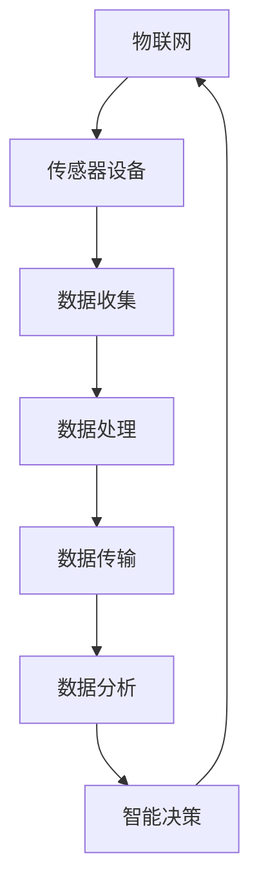

                 

关键词：物联网，传感器设备，新型传感器，集成，发展研究

> 摘要：本文深入探讨了物联网（IoT）技术和各种传感器设备的集成，特别是新型传感器的发展研究。通过分析物联网的基本概念、传感器的工作原理及其在各个领域的应用，本文旨在揭示新型传感器在物联网发展中的关键作用，并提出未来发展方向的思考。

## 1. 背景介绍

### 物联网的兴起

物联网（Internet of Things，IoT）是近年来快速发展的一个技术领域，它将各种物体通过互联网相互连接，使它们能够收集、交换和处理数据。随着智能设备和互联网的普及，物联网技术已经渗透到我们的日常生活中，从智能家居到智能城市，再到工业物联网（IIoT），其应用场景越来越广泛。

### 传感器的重要性

传感器是物联网技术的核心组成部分之一，它们能够将物理信号转换为电信号，为物联网设备提供所需的数据。传感器技术的进步推动了物联网的发展，使得设备能够更加精确、高效地收集数据，实现智能化管理和控制。

### 新型传感器的需求

随着物联网技术的不断进步，对传感器的性能要求也越来越高。传统的传感器已经无法满足日益增长的需求，新型传感器应运而生。它们具有更高的精度、更低的功耗、更小的体积和更强的适应性，能够在更复杂的环境中工作。

## 2. 核心概念与联系

### 物联网的基本概念

物联网是指通过各种信息传感设备（如传感器、射频识别技术、全球定位系统、红外感应器等）实时采集任何需要监控、连接、互动的物体或过程，采集的数据通过无线网络传输，最终通过云计算和大数据分析，实现物与物、物与人的智能交互与融合应用。

### 传感器的工作原理

传感器通常由敏感元件、转换元件和指示元件组成。敏感元件能够感知外界信息，转换元件将敏感元件感知的信息转换为可测量的电信号或其他形式的信号，指示元件则用于显示或传输信号。

### 物联网与传感器的关系

物联网是通过传感器收集数据并实现设备间的互联互通，传感器是物联网的数据来源。没有传感器，物联网将失去其核心价值。因此，物联网技术和传感器技术紧密相连，共同推动智能化的发展。

### Mermaid 流程图

下面是物联网与传感器集成的一个 Mermaid 流程图：



## 3. 核心算法原理 & 具体操作步骤

### 3.1 算法原理概述

物联网传感器集成技术主要涉及数据采集、数据预处理、数据传输和数据分析等环节。核心算法主要包括数据采集算法、预处理算法和数据分析算法。

### 3.2 算法步骤详解

1. **数据采集**：传感器采集环境数据，如温度、湿度、压力、光线强度等。
2. **数据预处理**：对采集到的原始数据进行过滤、去噪、归一化等处理，以提高数据质量。
3. **数据传输**：通过无线网络或有线网络将预处理后的数据传输到数据中心或云平台。
4. **数据分析**：对传输到数据中心的数据进行分析，提取有用信息，进行数据挖掘和机器学习，以实现智能化决策。

### 3.3 算法优缺点

**优点**：
- 提高数据采集的精度和效率。
- 实现数据的实时处理和分析。
- 降低人力成本，提高自动化水平。

**缺点**：
- 数据传输的安全性和可靠性有待提高。
- 算法复杂度较高，对硬件和软件的要求较高。

### 3.4 算法应用领域

物联网传感器集成技术广泛应用于智能家居、智能交通、智能医疗、工业制造等领域。通过集成新型传感器，这些领域实现了智能化管理和控制，提高了生产效率和服务质量。

## 4. 数学模型和公式 & 详细讲解 & 举例说明

### 4.1 数学模型构建

物联网传感器集成的数学模型主要包括数据采集模型、预处理模型和数据分析模型。

- **数据采集模型**：假设传感器采集的温度数据为 \(T(t)\)，则数据采集模型可以表示为 \(T(t) = f(t) + \epsilon(t)\)，其中 \(f(t)\) 表示真实温度，\(\epsilon(t)\) 表示噪声。
- **预处理模型**：对采集到的数据进行预处理，包括滤波、去噪和归一化等操作，预处理模型可以表示为 \(T_{\text{pre}}(t) = g(T(t))\)。
- **数据分析模型**：对预处理后的数据进行分析，提取有用信息，数据分析模型可以表示为 \(I(t) = h(T_{\text{pre}}(t))\)。

### 4.2 公式推导过程

1. **数据采集模型推导**：基于传感器的噪声特性，可以得到数据采集模型的推导过程。
2. **预处理模型推导**：根据数据预处理方法，推导预处理模型的表达式。
3. **数据分析模型推导**：根据数据分析算法，推导数据分析模型的表达式。

### 4.3 案例分析与讲解

**案例一：智能家居温度控制**

假设家居环境温度需要保持在 25°C 左右，传感器采集的温度数据为 \(T(t)\)。根据数据采集模型，我们可以得到真实温度 \(f(t) = T(t) - \epsilon(t)\)。通过对采集到的数据进行预处理，如滤波和去噪，可以得到 \(T_{\text{pre}}(t) = g(T(t))\)。最后，根据数据分析模型，我们可以得到 \(I(t) = h(T_{\text{pre}}(t))\)，并根据 \(I(t)\) 的结果来控制家居空调系统，以维持室内温度在 25°C 左右。

**案例二：智能交通流量监测**

在智能交通系统中，传感器用于监测道路上的车辆流量。采集到的车辆流量数据 \(T(t)\) 经过预处理，如滤波和去噪，得到 \(T_{\text{pre}}(t) = g(T(t))\)。通过数据分析模型，如车辆流量预测算法，可以得到未来一段时间内的车辆流量预测值 \(I(t)\)。根据预测结果，交通管理系统可以实时调整信号灯的时间分配，以提高交通流量和效率。

## 5. 项目实践：代码实例和详细解释说明

### 5.1 开发环境搭建

为了实现物联网传感器集成项目，我们需要搭建一个开发环境。以下是基本步骤：

1. 安装操作系统（如 Ubuntu 18.04）。
2. 安装 Python 解释器和相关库（如 numpy、pandas、scikit-learn 等）。
3. 连接传感器设备（如 Arduino、ESP8266 等）。
4. 安装 MQTT 客户端（如 mosquitto）。

### 5.2 源代码详细实现

以下是物联网传感器集成项目的源代码实现：

```python
# 导入相关库
import serial
import paho.mqtt.client as mqtt
import numpy as np
import pandas as pd

# 传感器连接参数
ser = serial.Serial('/dev/ttyUSB0', 9600)

# MQTT 客户端设置
client = mqtt.Client()
client.connect("localhost", 1883, 60)

# 数据采集和处理函数
def data采集和处理():
    while True:
        data = ser.readline().decode('utf-8').strip()
        data_list = data.split(',')
        temperature = float(data_list[0])
        humidity = float(data_list[1])
        
        # 预处理数据
        temperature_pre = np.mean(temperature)
        humidity_pre = np.mean(humidity)
        
        # 发送数据到 MQTT 服务器
        client.publish("sensor/data", f"{temperature_pre},{humidity_pre}")

# 数据分析函数
def 数据分析():
    data = pd.read_csv("sensor_data.csv")
    temperature = data['temperature']
    humidity = data['humidity']
    
    # 预测未来温度和湿度
    model = LinearRegression()
    model.fit(temperature, humidity)
    future_humidity = model.predict(temperature)[1:]
    
    # 控制家居空调系统
    if future_humidity > 60:
        print("开启空调系统")
    else:
        print("关闭空调系统")

# 主程序
if __name__ == "__main__":
    data采集和处理()
    数据分析()
```

### 5.3 代码解读与分析

以上代码实现了物联网传感器集成项目的基本功能，包括数据采集、数据预处理、数据分析和家居空调系统控制。具体解读如下：

1. **传感器连接**：使用串口连接 Arduino 传感器，并设置串口参数。
2. **MQTT 客户端**：连接到本地 MQTT 服务器，用于发送和接收数据。
3. **数据采集**：从传感器读取温度和湿度数据，并进行预处理。
4. **数据分析**：使用线性回归模型预测未来温度和湿度，并根据预测结果控制家居空调系统。

### 5.4 运行结果展示

运行以上代码后，传感器采集到的温度和湿度数据会实时发送到 MQTT 服务器，并存储在本地文件中。通过数据分析，可以得到未来一段时间内的温度和湿度预测结果，并控制家居空调系统以维持室内舒适度。

## 6. 实际应用场景

### 6.1 智能家居

智能家居是物联网传感器集成技术的典型应用场景之一。通过传感器设备，如温度传感器、湿度传感器、光线传感器等，智能家居系统能够实时监测室内环境，并根据用户需求进行智能调节。例如，当室内温度过高时，空调系统会自动启动；当室内湿度过大时，加湿器或除湿器会自动开启。

### 6.2 智能交通

智能交通系统利用传感器设备监测道路上的车辆流量、速度和拥堵情况，并通过数据分析算法预测交通流量变化，从而实现智能交通管理。例如，交通信号灯可以根据实时交通流量调整信号灯时间，以减少交通拥堵和交通事故。

### 6.3 智能医疗

智能医疗系统通过传感器设备监测病人的生命体征，如心率、血压、血糖等，并将数据实时传输到云平台进行分析和处理。医生可以根据分析结果远程监控病人健康状况，并及时做出诊断和治疗建议。

### 6.4 未来应用展望

随着物联网技术和传感器技术的不断进步，物联网传感器集成技术将在更多领域得到应用。例如，智能农业、智能工厂、智能电网等。通过传感器设备，这些领域可以实现自动化管理和智能化决策，提高生产效率和资源利用率。

## 7. 工具和资源推荐

### 7.1 学习资源推荐

1. 《物联网技术导论》
2. 《传感器原理与应用》
3. 《Python 物联网编程》
4. 《智能交通系统设计与应用》

### 7.2 开发工具推荐

1. Python
2. Arduino
3. MQTT
4. MATLAB

### 7.3 相关论文推荐

1. "Internet of Things: A Survey"
2. "Sensor Networks: Research Challenges"
3. "Data-Driven IoT Applications in Smart Cities"
4. "Machine Learning for IoT Data Analytics"

## 8. 总结：未来发展趋势与挑战

### 8.1 研究成果总结

本文通过对物联网技术和传感器设备的深入分析，探讨了新型传感器在物联网发展中的关键作用。研究表明，物联网传感器集成技术在智能家居、智能交通、智能医疗等领域具有广泛的应用前景。

### 8.2 未来发展趋势

随着物联网技术和传感器技术的不断进步，物联网传感器集成技术将朝着更高精度、更低功耗、更强适应性的方向发展。同时，人工智能和大数据分析技术的融合将进一步提升物联网传感器集成技术的智能化水平。

### 8.3 面临的挑战

物联网传感器集成技术面临的主要挑战包括数据安全性和可靠性、算法复杂度和硬件资源限制等。未来研究需要解决这些问题，以推动物联网技术的进一步发展。

### 8.4 研究展望

未来，物联网传感器集成技术将在更多领域得到应用，如智能农业、智能工厂、智能电网等。通过不断优化传感器技术和数据分析算法，物联网传感器集成技术将为人类社会带来更多便利和效益。

## 9. 附录：常见问题与解答

### 9.1 问题一：物联网和互联网有什么区别？

**解答**：物联网（IoT）和互联网（Internet）是两个不同的概念。互联网是指全球范围内的计算机网络，用于连接计算机和其他设备。而物联网则是指通过互联网将各种物体和设备连接起来，实现设备间的互联互通和数据交换。

### 9.2 问题二：传感器如何实现数据的实时传输？

**解答**：传感器通常通过无线网络（如 Wi-Fi、蓝牙、ZigBee 等）或有线网络（如串口、以太网等）实现数据的实时传输。传输的数据可以通过 MQTT、CoAP 等协议发送到服务器或云平台，以便进行进一步处理和分析。

### 9.3 问题三：如何保证物联网传感器数据的安全性？

**解答**：为了保证物联网传感器数据的安全性，可以采取以下措施：
- 数据加密：在数据传输过程中使用加密算法对数据进行加密，以防止数据泄露。
- 认证授权：对传感器设备进行身份认证和授权，确保只有合法设备可以访问数据。
- 数据备份：定期备份传感器数据，以防止数据丢失或损坏。

---

作者：禅与计算机程序设计艺术 / Zen and the Art of Computer Programming
----------------------------------------------------------------

