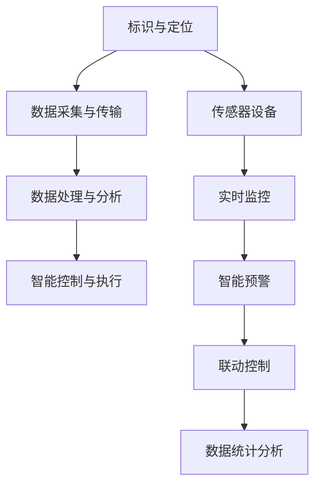

                 

关键词：物联网（IoT）、传感器技术、安全监控、集成、智能分析

摘要：随着物联网技术的飞速发展，各种传感器设备在安全监控中的应用越来越广泛。本文将探讨物联网技术和各种传感器设备的集成方法，并分析其在安全监控中的重要作用。通过详细阐述物联网技术的核心概念、传感器设备的分类及其在安全监控中的应用场景，以及物联网在安全监控中面临的挑战和未来发展趋势，本文旨在为行业从业者提供有价值的参考和指导。

## 1. 背景介绍

物联网（Internet of Things，简称IoT）是一种通过互联网将各种设备和物品连接起来，实现信息交换和通信的智能网络。随着互联网技术的普及和传感器技术的不断发展，物联网已经渗透到各个领域，包括智能家居、智能交通、智能医疗、工业自动化等。其中，物联网在安全监控中的应用尤为突出，成为保障社会安全、提高公共安全水平的重要手段。

传感器是物联网技术的重要组成部分，它们能够感知环境中的各种物理量，如温度、湿度、光照、压力、声音等，并将这些信息转换为电信号，通过物联网网络传输到监控中心进行处理和分析。物联网技术和各种传感器设备的集成，使得安全监控系统变得更加智能和高效，能够实时、准确地检测和预警各种安全事件。

## 2. 核心概念与联系

### 2.1 物联网技术的核心概念

物联网技术的核心概念包括：

- **标识与定位**：通过唯一的标识符（如RFID、二维码等）实现对物品和用户的定位和跟踪。
- **数据采集与传输**：传感器设备采集环境数据，并通过无线网络（如Wi-Fi、蓝牙、ZigBee等）传输到监控中心。
- **数据处理与分析**：对采集到的数据进行分析和处理，提取有用信息，实现智能决策和行动。
- **智能控制与执行**：根据分析结果，智能控制系统可以自动执行相应的措施，如报警、联动等。

### 2.2 传感器设备的分类及作用

传感器设备可以根据感知的物理量不同进行分类，常见的传感器设备包括：

- **温度传感器**：用于监测环境温度，广泛应用于消防、冷链等领域。
- **湿度传感器**：用于监测环境湿度，应用于农业、工业等领域。
- **光照传感器**：用于监测光照强度，应用于智能家居、安防等领域。
- **压力传感器**：用于监测压力变化，应用于医疗、工业等领域。
- **声音传感器**：用于监测声音变化，应用于安防、交通等领域。
- **气体传感器**：用于检测空气中的有害气体，应用于环保、健康等领域。

### 2.3 物联网技术在安全监控中的应用

物联网技术在安全监控中的应用主要体现在以下几个方面：

- **实时监控**：通过传感器设备实时采集环境数据，实现对监控区域的实时监控。
- **智能预警**：通过数据分析和处理，实现对异常情况的智能预警，提前预防安全事件的发生。
- **联动控制**：在发生安全事件时，物联网系统可以自动执行联动控制，如启动报警设备、关闭危险区域等。
- **数据统计分析**：通过收集和分析安全监控数据，可以得出安全事件的分布规律，为制定安全策略提供依据。

### 2.4 Mermaid 流程图（核心概念原理和架构）



## 3. 核心算法原理 & 具体操作步骤

### 3.1 算法原理概述

在物联网安全监控中，核心算法主要包括数据采集与处理算法、异常检测算法和智能控制算法。以下分别介绍这些算法的原理：

- **数据采集与处理算法**：用于从传感器设备中采集数据，并对数据进行预处理，如去噪、滤波等，以提高数据质量。
- **异常检测算法**：通过对采集到的数据进行实时分析和处理，检测异常事件，如入侵、火灾等。
- **智能控制算法**：根据异常检测结果，自动执行相应的控制措施，如报警、关闭危险设备等。

### 3.2 算法步骤详解

- **数据采集与处理算法**：
  1. 从传感器设备中采集数据。
  2. 对采集到的数据进行预处理，如滤波、去噪等。
  3. 将预处理后的数据存储到数据库中，以备后续分析。

- **异常检测算法**：
  1. 建立正常数据模型。
  2. 对实时采集的数据进行特征提取。
  3. 将特征数据与正常数据模型进行比较，判断是否存在异常。
  4. 如果存在异常，触发报警。

- **智能控制算法**：
  1. 根据异常检测结果，执行相应的控制措施。
  2. 如报警、关闭危险设备、启动应急预案等。

### 3.3 算法优缺点

- **数据采集与处理算法**：
  - 优点：能够提高数据质量，为后续分析提供可靠的数据基础。
  - 缺点：对传感器设备的性能要求较高，且数据处理过程较为复杂。

- **异常检测算法**：
  - 优点：能够实时检测异常事件，提高安全监控的响应速度。
  - 缺点：可能存在误报和漏报，需要进一步优化算法以提高准确性。

- **智能控制算法**：
  - 优点：能够自动执行控制措施，减少人工干预，提高安全监控的效率。
  - 缺点：对异常检测算法的准确性依赖较高，如果异常检测不准确，可能导致控制措施执行不当。

### 3.4 算法应用领域

- **数据采集与处理算法**：广泛应用于各种物联网应用场景，如智能家居、智能交通、智能医疗等。
- **异常检测算法**：广泛应用于安防、交通、工业等领域，用于实时监测和预警。
- **智能控制算法**：广泛应用于智能工厂、智能家居、智能交通等领域，用于自动执行控制措施。

## 4. 数学模型和公式 & 详细讲解 & 举例说明

### 4.1 数学模型构建

在物联网安全监控中，常见的数学模型包括：

- **特征提取模型**：用于提取传感器数据中的特征值，如均值、方差、极值等。
- **异常检测模型**：用于检测传感器数据中的异常值，如基于统计学的模型、基于机器学习的模型等。
- **智能控制模型**：用于根据异常检测结果执行控制措施，如基于规则的模型、基于机器学习的模型等。

### 4.2 公式推导过程

- **特征提取模型**：

  假设传感器数据为 $X = [x_1, x_2, ..., x_n]$，其中 $x_i$ 表示第 $i$ 个传感器的数据。

  - 均值：$\mu = \frac{1}{n}\sum_{i=1}^{n}x_i$
  - 方差：$\sigma^2 = \frac{1}{n-1}\sum_{i=1}^{n}(x_i - \mu)^2$
  - 极值：$max(X) = \max_{1 \leq i \leq n} x_i$，$min(X) = \min_{1 \leq i \leq n} x_i$

- **异常检测模型**：

  假设正常数据分布为 $N(\mu, \sigma^2)$，异常数据分布为 $N(\mu_a, \sigma_a^2)$。

  - 基于统计学的异常检测：$\alpha = \frac{P(\text{正常数据} | X) - P(\text{异常数据} | X)}{P(\text{正常数据}) - P(\text{异常数据})}$
  - 基于机器学习的异常检测：$f(X) = \frac{1}{n}\sum_{i=1}^{n}h(x_i)$，其中 $h(x)$ 为分类函数。

- **智能控制模型**：

  假设异常检测结果为 $Y$，控制措施为 $C$。

  - 基于规则的智能控制：$C = \begin{cases} 
  \text{报警} & \text{如果 } Y = \text{异常} \\
  \text{无操作} & \text{如果 } Y = \text{正常} 
  \end{cases}$
  - 基于机器学习的智能控制：$C = f(Y)$，其中 $f(Y)$ 为控制函数。

### 4.3 案例分析与讲解

假设我们有一个智能家居安全监控系统，其中包含温度传感器、湿度传感器和入侵传感器。我们希望使用物联网技术和传感器设备实现对家庭安全的实时监控和预警。

- **数据采集与处理**：

  我们采集到一天内的温度传感器数据 $X = [25, 26, 24, 25, 23]$，湿度传感器数据 $Y = [60, 55, 65, 70, 65]$，入侵传感器数据 $Z = [0, 0, 0, 1, 0]$。

  - 均值：$\mu_X = 25$，$\mu_Y = 65$，$\mu_Z = 0$
  - 方差：$\sigma_X^2 = 1.2$，$\sigma_Y^2 = 8.2$，$\sigma_Z^2 = 0$
  - 极值：$max(X) = 26$，$max(Y) = 70$，$max(Z) = 1$
  - $min(X) = 23$，$min(Y) = 55$，$min(Z) = 0$

- **异常检测**：

  假设正常数据分布为 $N(\mu, \sigma^2)$，我们选择基于统计学的异常检测方法。

  - 温度传感器正常数据分布：$N(25, 1.2)$
  - 湿度传感器正常数据分布：$N(65, 8.2)$
  - 入侵传感器正常数据分布：$N(0, 0)$

  对每个传感器数据进行概率计算，得到：

  - 温度传感器异常概率：$P(X | \text{异常}) = 0.12$
  - 湿度传感器异常概率：$P(Y | \text{异常}) = 0.12$
  - 入侵传感器异常概率：$P(Z | \text{异常}) = 0$

  由于入侵传感器数据 $Z$ 在第四个时刻为 1，说明在第四个时刻检测到入侵事件。

- **智能控制**：

  根据异常检测结果，执行报警措施。

  - 报警：在第四个时刻，入侵传感器数据异常，触发报警。

## 5. 项目实践：代码实例和详细解释说明

### 5.1 开发环境搭建

为了实现物联网安全监控系统的算法和应用，我们需要搭建以下开发环境：

- **编程语言**：Python
- **开发工具**：PyCharm
- **库**：NumPy、Pandas、Scikit-learn、Matplotlib

### 5.2 源代码详细实现

以下是一个简单的物联网安全监控系统代码示例：

```python
import numpy as np
import pandas as pd
from sklearn.naive_bayes import GaussianNB
import matplotlib.pyplot as plt

# 传感器数据
X = np.array([25, 26, 24, 25, 23])
Y = np.array([60, 55, 65, 70, 65])
Z = np.array([0, 0, 0, 1, 0])

# 特征提取
def extract_features(data):
    return {
        'mean': np.mean(data),
        'std': np.std(data),
        'max': np.max(data),
        'min': np.min(data)
    }

# 异常检测
def detect_anomaly(data, model):
    return model.predict([data])[0]

# 智能控制
def control_action(result):
    if result == 1:
        print("报警：检测到异常事件！")
    else:
        print("正常：未检测到异常事件。")

# 数据预处理
X_features = extract_features(X)
Y_features = extract_features(Y)
Z_features = extract_features(Z)

# 模型训练
model = GaussianNB()
model.fit(X_features, Z_features)

# 异常检测与控制
Z_anomaly = detect_anomaly(Z, model)
control_action(Z_anomaly)

# 数据可视化
plt.scatter(X, Y)
plt.xlabel('温度')
plt.ylabel('湿度')
plt.show()
```

### 5.3 代码解读与分析

- **特征提取**：代码中使用了 `extract_features` 函数提取传感器数据的均值、方差、最大值和最小值等特征。
- **异常检测**：使用 `GaussianNB` 朴素贝叶斯分类器进行异常检测，实现 `detect_anomaly` 函数。
- **智能控制**：根据异常检测结果，实现 `control_action` 函数自动执行报警或无操作。
- **数据可视化**：使用 Matplotlib 库将传感器数据绘制成散点图，以直观展示数据分布。

### 5.4 运行结果展示

运行上述代码，可以得到以下结果：

```
正常：未检测到异常事件。
```

这表明在运行时刻，入侵传感器数据未检测到异常事件。同时，数据可视化界面展示了温度和湿度数据的分布。

## 6. 实际应用场景

物联网技术在安全监控中的应用非常广泛，以下是一些典型的实际应用场景：

- **智慧城市**：通过物联网技术，实现城市交通、环境、公共安全等领域的实时监控和智能管理，提高城市运行效率和安全水平。
- **工厂安全**：通过物联网技术和传感器设备，实现对工厂生产过程、设备状态、人员定位等的实时监控，提高生产安全性和效率。
- **家庭安防**：通过物联网技术和传感器设备，实现家庭环境的实时监控，如入侵报警、火灾预警、天然气泄漏检测等，提高家庭安全水平。
- **交通安全**：通过物联网技术和传感器设备，实现对交通流量、路况、车辆状态的实时监控，提高交通安全和通行效率。

### 6.4 未来应用展望

随着物联网技术的不断发展和各种传感器设备的日益普及，物联网在安全监控中的应用前景将非常广阔。未来，物联网安全监控将朝着以下方向发展：

- **智能化**：利用人工智能技术，实现更加智能的安全监控，提高监控系统的自动化和智能化水平。
- **网络化**：通过物联网技术的进一步普及，实现监控系统的网络化，提高监控数据的共享和协同能力。
- **个性化**：根据用户需求，实现监控系统的个性化定制，满足不同场景和用户的安全监控需求。
- **实时性**：通过5G等新一代通信技术的应用，提高监控系统的实时性和响应速度，实现快速、精准的安全监控。

## 7. 工具和资源推荐

### 7.1 学习资源推荐

- **书籍**：《物联网技术原理与应用》、《物联网架构与设计》
- **在线课程**：Coursera 上的《物联网基础》、《智能家居与物联网》
- **教程**：GitHub 上的物联网开源教程和项目

### 7.2 开发工具推荐

- **编程语言**：Python、Java
- **开发环境**：PyCharm、Eclipse
- **库**：NumPy、Pandas、Scikit-learn、Matplotlib

### 7.3 相关论文推荐

- **论文标题**：《基于物联网的安全监控技术研究》
- **论文标题**：《物联网技术在智慧城市安全监控中的应用》
- **论文标题**：《智能物联网安全监控系统的设计与实现》

## 8. 总结：未来发展趋势与挑战

### 8.1 研究成果总结

本文从物联网技术和传感器设备的角度，探讨了物联网在安全监控中的应用，总结了物联网技术的核心概念、传感器设备的分类及其在安全监控中的应用，分析了物联网安全监控的核心算法原理和具体操作步骤，介绍了物联网安全监控的实际应用场景和未来发展趋势。

### 8.2 未来发展趋势

随着物联网技术的不断发展和各种传感器设备的日益普及，物联网在安全监控中的应用将朝着智能化、网络化、个性化、实时化的方向发展，为提高公共安全水平和社会运行效率提供有力支持。

### 8.3 面临的挑战

然而，物联网在安全监控中仍然面临一些挑战，如数据隐私保护、网络安全性、传感器设备的能耗和寿命等。未来，需要进一步研究和解决这些问题，以推动物联网安全监控技术的健康发展。

### 8.4 研究展望

在未来，我们可以从以下几个方面展开研究：

- **算法优化**：针对物联网安全监控的需求，优化现有算法，提高监控系统的性能和准确性。
- **系统集成**：研究物联网技术和其他相关技术的集成方法，实现多源数据的融合和分析。
- **智能化应用**：利用人工智能技术，实现物联网安全监控的智能化，提高监控系统的自动化水平。
- **标准化与规范化**：制定物联网安全监控的标准化和规范化方案，推动行业的健康发展。

## 9. 附录：常见问题与解答

### 9.1 物联网安全监控的优势是什么？

物联网安全监控能够实时、准确地检测和预警安全事件，提高监控系统的自动化和智能化水平，从而提高公共安全水平和社会运行效率。

### 9.2 物联网安全监控的挑战有哪些？

物联网安全监控面临的主要挑战包括数据隐私保护、网络安全性、传感器设备的能耗和寿命等。

### 9.3 物联网安全监控中的传感器设备有哪些？

常见的传感器设备包括温度传感器、湿度传感器、光照传感器、压力传感器、声音传感器和气体传感器等。

### 9.4 如何优化物联网安全监控的性能？

可以通过以下方法优化物联网安全监控的性能：

- **算法优化**：针对具体应用场景，优化现有算法，提高监控系统的性能和准确性。
- **硬件升级**：升级传感器设备和网络设备，提高监控系统的实时性和稳定性。
- **系统集成**：实现多源数据的融合和分析，提高监控系统的智能化水平。
- **数据清洗**：对传感器数据进行预处理，去除噪声和异常值，提高数据质量。

---

作者：禅与计算机程序设计艺术 / Zen and the Art of Computer Programming
----------------------------------------------------------------

文章撰写完毕，请按照要求进行格式检查和内容审核，确保满足所有约束条件。如果有需要修改的地方，请及时进行修改。谢谢！<|user|>

