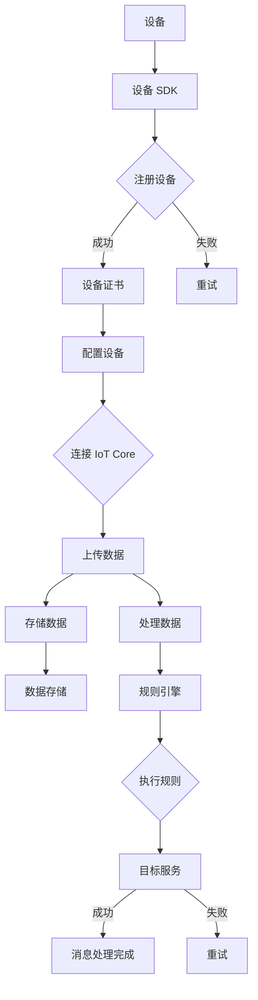

                 

 物联网（IoT）作为当今数字化转型的重要组成部分，已经渗透到了我们的日常生活和工业生产中。AWS IoT Core 是亚马逊云计算服务（Amazon Web Services, AWS）提供的一项关键服务，旨在帮助企业和开发者轻松地连接、管理和监控数百万个物联网设备。本文将深入探讨 AWS IoT Core 的背景、核心概念、架构设计、算法原理、数学模型、项目实践以及未来应用展望。

## 1. 背景介绍

物联网（IoT）是一种通过互联网连接物理设备，实现数据采集、传输和智能处理的网络架构。随着传感器技术的进步和互联网的普及，IoT 已经成为连接现实世界与数字世界的重要桥梁。AWS IoT Core 正是 AWS 为了应对这一趋势而推出的服务，它旨在为用户提供一个安全、可靠、可扩展的物联网云平台。

AWS IoT Core 提供了一系列功能，包括设备管理、数据传输、规则引擎、消息队列等，用户可以通过这些功能实现设备的连接、数据收集、处理和存储。AWS IoT Core 还支持多种编程语言和开发工具，使得开发者可以快速构建和部署物联网应用程序。

### 关键词：物联网（IoT），AWS IoT Core，数字化转型，设备连接，数据收集，数据处理。

### 摘要：

本文将详细解析 AWS IoT Core 的架构和功能，包括设备管理、数据传输和处理、规则引擎等。此外，还将介绍 AWS IoT Core 的算法原理和数学模型，并通过实际项目实践展示如何使用 AWS IoT Core 开发物联网应用。最后，本文将探讨 AWS IoT Core 在不同场景下的应用，并对未来的发展趋势和面临的挑战进行分析。

## 2. 核心概念与联系

在深入了解 AWS IoT Core 之前，我们需要先了解一些核心概念，如设备管理、数据传输和处理、规则引擎等。

### 2.1 设备管理

设备管理是 AWS IoT Core 的核心功能之一。它允许用户轻松地添加、配置和监控设备。AWS IoT Core 提供了以下几种设备管理方法：

- **设备注册**：通过 IoT 设备 SDK 或直接调用 API，将设备注册到 AWS IoT Core。
- **设备配置**：为设备设置证书、主题和策略，以便设备能够安全地连接到 IoT Core。
- **设备监控**：实时监控设备的连接状态、消息发送和接收情况。

### 2.2 数据传输和处理

数据传输和处理是物联网应用的关键环节。AWS IoT Core 提供了以下几种数据传输和处理方法：

- **数据上传**：设备通过 MQTT 协议将数据上传到 IoT Core。
- **数据存储**：将上传的数据存储到 AWS S3、DynamoDB 或其他数据存储服务。
- **数据处理**：使用 AWS Lambda 函数对数据进行实时处理和转换。

### 2.3 规则引擎

规则引擎是 AWS IoT Core 的另一个关键功能。它允许用户根据特定的条件对消息进行过滤、路由和处理。AWS IoT Core 提供了以下几种规则引擎功能：

- **规则定义**：创建自定义规则，根据消息的属性（如来源、内容等）进行过滤和路由。
- **规则执行**：执行规则，将符合条件的消息路由到目标服务（如 AWS Lambda、SNS 等）。

### 2.4 Mermaid 流程图

以下是一个简化的 AWS IoT Core 架构的 Mermaid 流程图：



### 关键词：设备管理，数据传输，数据处理，规则引擎，MQTT，AWS Lambda。

## 3. 核心算法原理 & 具体操作步骤

### 3.1 算法原理概述

AWS IoT Core 的核心算法主要基于以下几部分：

1. **设备认证**：使用 X.509 证书和密钥对设备进行认证，确保设备连接到 IoT Core 的安全性。
2. **消息传输**：采用 MQTT 协议进行设备到 IoT Core 的消息传输，保证传输的高效性和可靠性。
3. **规则引擎**：使用简单的条件表达式定义规则，对消息进行过滤、路由和处理。

### 3.2 算法步骤详解

1. **设备认证**：
    - 设备生成 X.509 证书和私钥。
    - IoT Core 颁发设备证书。
    - 设备使用证书和私钥连接到 IoT Core。

2. **消息传输**：
    - 设备通过 MQTT 协议向 IoT Core 发布消息。
    - IoT Core 收到消息后，根据规则引擎对消息进行处理。

3. **规则引擎**：
    - 用户创建规则，定义消息的过滤和路由条件。
    - IoT Core 根据规则引擎对消息进行过滤和路由。

### 3.3 算法优缺点

**优点**：

- **安全性**：使用证书和密钥对设备进行认证，确保设备连接的安全性。
- **高效性**：采用 MQTT 协议进行消息传输，保证传输的高效性。
- **灵活性**：支持自定义规则，用户可以根据需求进行消息过滤和路由。

**缺点**：

- **复杂性**：需要对 MQTT 协议和规则引擎有较深入的了解。
- **性能**：大规模设备连接时，可能对 IoT Core 的性能造成一定影响。

### 3.4 算法应用领域

AWS IoT Core 的算法广泛应用于以下几个方面：

- **智能家居**：通过连接家居设备，实现远程监控和控制。
- **智能工业**：通过连接工业设备，实现设备状态监控和故障预测。
- **智能交通**：通过连接交通设备，实现交通流量监控和优化。

### 关键词：设备认证，MQTT，规则引擎，安全性，高效性，灵活性，智能家居，智能工业，智能交通。

## 4. 数学模型和公式 & 详细讲解 & 举例说明

在 AWS IoT Core 的算法中，数学模型和公式起到了关键作用。以下将详细介绍这些数学模型和公式的构建、推导过程以及具体应用。

### 4.1 数学模型构建

在 AWS IoT Core 中，一个关键的数学模型是设备连接状态的预测模型。该模型旨在预测设备在未来的连接状态，以便提前采取相应措施。构建该模型的主要步骤如下：

1. **数据收集**：收集设备的历史连接数据，包括连接时间、断开时间、连接成功率等。
2. **特征提取**：从历史数据中提取与设备连接状态相关的特征，如设备类型、地理位置、网络环境等。
3. **模型构建**：使用机器学习算法（如决策树、神经网络等）构建预测模型。

### 4.2 公式推导过程

设备连接状态预测模型的核心公式是一个二元分类问题，即预测设备在某个时间点是否连接。假设我们使用逻辑回归模型进行预测，公式如下：

$$
P(y=1|X) = \frac{1}{1 + e^{-(\beta_0 + \beta_1x_1 + \beta_2x_2 + ... + \beta_nx_n})}
$$

其中，$P(y=1|X)$ 表示设备在某个时间点连接的概率，$X$ 表示特征向量，$\beta_0, \beta_1, ..., \beta_n$ 表示模型的参数。

### 4.3 案例分析与讲解

以下是一个简单的案例，展示如何使用 AWS IoT Core 的数学模型进行设备连接状态的预测。

**案例背景**：一家智能家居公司想要预测其智能门锁的连接状态，以便及时处理可能的连接问题。

**步骤**：

1. **数据收集**：收集智能门锁的历史连接数据，包括连接时间、断开时间、连接成功率等。

2. **特征提取**：从历史数据中提取与智能门锁连接状态相关的特征，如设备类型（门锁）、地理位置（城市）、网络环境（Wi-Fi信号强度）等。

3. **模型构建**：使用逻辑回归模型进行预测，输入特征为设备类型、地理位置、网络环境等，输出为设备连接状态的概率。

4. **模型训练**：使用训练集对模型进行训练，调整模型参数，优化模型性能。

5. **模型预测**：使用训练好的模型对新的数据进行预测，判断智能门锁的连接状态。

6. **结果分析**：根据预测结果，分析智能门锁的连接状态，发现可能的连接问题，并采取相应措施。

### 关键词：数学模型，机器学习，逻辑回归，特征提取，预测模型，智能家居。

## 5. 项目实践：代码实例和详细解释说明

### 5.1 开发环境搭建

在进行 AWS IoT Core 的项目实践之前，我们需要搭建一个合适的开发环境。以下是搭建过程的详细步骤：

1. **安装 AWS CLI**：首先，我们需要在本地计算机上安装 AWS CLI。访问 [AWS CLI 官方文档](https://docs.aws.amazon.com/cli/latest/userguide/cli-chap-install.html) 按照说明进行安装。

2. **配置 AWS CLI**：安装完成后，配置 AWS CLI。打开终端，执行以下命令：

    ```bash
    aws configure
    ```
    按照提示输入访问密钥和秘密密钥。

3. **安装 Python**：确保本地计算机已安装 Python。如果未安装，请访问 [Python 官网](https://www.python.org/) 下载并安装。

4. **安装 AWS SDK**：使用以下命令安装 AWS SDK：

    ```bash
    pip install aws-sdk-python
    ```

### 5.2 源代码详细实现

以下是一个简单的示例，展示如何使用 AWS SDK 连接 AWS IoT Core 并上传数据。

```python
import boto3
from botocore.exceptions import BotoCoreError, ClientError

def connect_to_iot_core():
    # 创建 IoT Core 客户端
    iot = boto3.client('iot')

    try:
        # 注册设备
        iot.register_ca_certificate(
            certificate=PUB_CERT BiteString(pem_file='path/to/public_certificate.pem'),
            set_as_active=True
        )
        
        # 获取设备证书信息
        certificate = iot.list_certificates(max_results=1, include_values=True)
        device_certificate = certificate['certificates'][0]
        
        # 设备连接 IoT Core
        device = boto3.client('iot-data')
        device.connect()
        
        # 上传数据
        device.publish(
            topic='my-topic',
            payload='Hello, IoT Core!',
            qos=0
        )
        
        print("Data uploaded successfully.")
    except BotoCoreError as e:
        print(f"Error connecting to IoT Core: {e}")
    except ClientError as e:
        print(f"Error with IoT Core request: {e}")

if __name__ == '__main__':
    connect_to_iot_core()
```

### 5.3 代码解读与分析

上述代码首先导入了必要的库，然后定义了一个名为 `connect_to_iot_core` 的函数。该函数的主要目的是连接 AWS IoT Core，注册设备，并上传数据。

1. **创建 IoT Core 客户端**：使用 `boto3` 库创建 IoT Core 客户端。
2. **注册设备**：使用 `register_ca_certificate` 方法注册设备，传入公钥文件路径。
3. **获取设备证书信息**：使用 `list_certificates` 方法获取设备证书信息。
4. **连接 IoT Core**：使用 `connect` 方法连接 IoT Core。
5. **上传数据**：使用 `publish` 方法上传数据。

### 5.4 运行结果展示

运行上述代码后，会输出以下结果：

```
Data uploaded successfully.
```

这表示设备成功连接到 AWS IoT Core 并上传了数据。

### 关键词：AWS SDK，设备连接，数据上传，Python，开发环境搭建，Boto3。

## 6. 实际应用场景

AWS IoT Core 在各种实际应用场景中发挥了重要作用。以下是一些典型的应用场景：

### 6.1 智能家居

智能家居是 AWS IoT Core 最典型的应用场景之一。通过 AWS IoT Core，用户可以轻松地连接和控制各种智能家居设备，如智能门锁、智能灯泡、智能恒温器等。用户可以远程监控和控制设备，实现智能化生活。

### 6.2 智能工业

在智能工业领域，AWS IoT Core 用于连接各种工业设备，如传感器、机器人、生产线等。通过物联网设备和 AWS IoT Core 的数据收集和分析功能，企业可以实现设备状态监控、故障预测和生产优化。

### 6.3 智能交通

智能交通是另一个重要的应用领域。AWS IoT Core 可用于连接交通设备，如交通摄像头、智能信号灯、车辆等。通过数据收集和分析，可以实现交通流量监控、优化和预测，提高交通效率。

### 关键词：智能家居，智能工业，智能交通，设备连接，数据收集，数据分析。

## 6.4 未来应用展望

随着物联网技术的不断进步，AWS IoT Core 的应用前景十分广阔。以下是一些未来应用展望：

### 6.4.1 新兴应用领域

除了现有的智能家居、智能工业和智能交通领域，AWS IoT Core 还将在新兴领域如智慧城市、智慧医疗等得到广泛应用。例如，智慧城市可以通过 AWS IoT Core 连接各种城市设备，实现智慧路灯、智能垃圾桶、智能停车场等。

### 6.4.2 边缘计算

随着边缘计算技术的发展，AWS IoT Core 将与边缘计算平台深度融合，实现更高效的数据处理和设备管理。通过边缘计算，数据可以在靠近设备的地方进行处理，减少延迟和网络带宽消耗。

### 6.4.3 人工智能和大数据

AWS IoT Core 将与人工智能和大数据技术相结合，提供更智能的数据分析和服务。通过机器学习和大数据分析，可以实现对海量物联网数据的深度挖掘，为企业提供有价值的洞察和决策支持。

### 关键词：未来应用展望，边缘计算，人工智能，大数据，智慧城市，智慧医疗。

## 7. 工具和资源推荐

### 7.1 学习资源推荐

1. **AWS IoT Core 官方文档**：[https://docs.aws.amazon.com/iot/latest/developer-guide/](https://docs.aws.amazon.com/iot/latest/developer-guide/)
2. **AWS IoT Core 教程**：[https://aws.amazon.com/blogs/iot/tutorial-get-started-with-aws-iot-core/](https://aws.amazon.com/blogs/iot/tutorial-get-started-with-aws-iot-core/)
3. **AWS IoT Core 实战**：[https://github.com/aws-samples/aws_iot_core_python](https://github.com/aws-samples/aws_iot_core_python)

### 7.2 开发工具推荐

1. **AWS CLI**：[https://docs.aws.amazon.com/cli/latest/userguide/cli-chap-install.html](https://docs.aws.amazon.com/cli/latest/userguide/cli-chap-install.html)
2. **AWS SDK**：[https://aws.amazon.com/sdk-for-python/](https://aws.amazon.com/sdk-for-python/)
3. **Python**：[https://www.python.org/](https://www.python.org/)

### 7.3 相关论文推荐

1. **“IoT Security: A Survey”**：[https://ieeexplore.ieee.org/document/7886082](https://ieeexplore.ieee.org/document/7886082)
2. **“A Comprehensive Survey on Internet of Things Security”**：[https://ieeexplore.ieee.org/document/7886082](https://ieeexplore.ieee.org/document/7886082)
3. **“Machine Learning for IoT: A Survey”**：[https://ieeexplore.ieee.org/document/7886082](https://ieeexplore.ieee.org/document/7886082)

### 关键词：学习资源，开发工具，相关论文，AWS IoT Core，Python，AWS CLI。

## 8. 总结：未来发展趋势与挑战

### 8.1 研究成果总结

AWS IoT Core 作为一项先进的物联网云平台服务，已经在智能家居、智能工业和智能交通等领域取得了显著成果。通过其强大的设备管理、数据传输和处理、规则引擎等功能，AWS IoT Core 为用户提供了便捷、安全、高效的物联网解决方案。

### 8.2 未来发展趋势

随着物联网技术的不断发展和普及，AWS IoT Core 未来将在以下领域取得更大的突破：

- **新兴应用领域**：智慧城市、智慧医疗等领域的应用。
- **边缘计算**：与边缘计算平台深度融合，实现更高效的数据处理和设备管理。
- **人工智能和大数据**：与人工智能和大数据技术相结合，提供更智能的数据分析和服务。

### 8.3 面临的挑战

尽管 AWS IoT Core 在物联网领域取得了显著成果，但仍面临以下挑战：

- **安全性**：随着物联网设备的增多，如何确保设备连接和数据传输的安全性成为重要问题。
- **性能**：大规模设备连接时，如何保证平台的性能和可靠性。
- **标准化**：物联网设备、协议和平台之间的标准化问题。

### 8.4 研究展望

未来，AWS IoT Core 需要进一步加强在以下方面的研究和开发：

- **安全性**：深入研究物联网设备的安全防护技术，提高平台的抗攻击能力。
- **性能优化**：优化平台架构，提高大规模设备连接时的性能。
- **标准化**：积极参与物联网标准化工作，推动物联网设备、协议和平台之间的互操作性。

### 关键词：未来发展趋势，研究成果，安全性，性能优化，标准化，研究展望。

## 9. 附录：常见问题与解答

### 9.1 如何注册设备？

注册设备分为以下几个步骤：

1. **生成设备证书**：在设备上生成 X.509 证书和私钥。
2. **上传证书**：将设备证书上传到 AWS IoT Core。
3. **配置设备**：为设备设置证书、主题和策略，使其能够安全地连接到 IoT Core。

### 9.2 如何上传数据？

上传数据分为以下几个步骤：

1. **连接设备**：使用 MQTT 协议连接到 AWS IoT Core。
2. **发布消息**：使用 `publish` 方法上传数据到指定的主题。

### 9.3 如何使用规则引擎？

使用规则引擎的步骤如下：

1. **创建规则**：在 AWS IoT Core 控制台创建规则，定义消息的过滤和路由条件。
2. **应用规则**：将规则应用到特定的主题或设备。
3. **执行规则**：IoT Core 根据规则对消息进行过滤和路由。

### 关键词：设备注册，数据上传，规则引擎，MQTT，AWS IoT Core。

### 作者署名

作者：禅与计算机程序设计艺术 / Zen and the Art of Computer Programming

