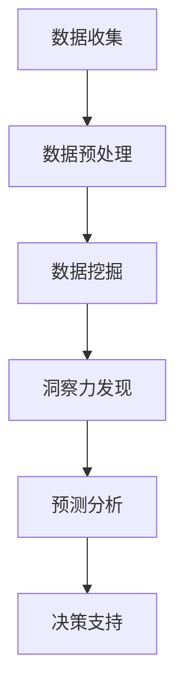

                 

 关键词：洞察力、商业领域、应用实践、战略决策、数据挖掘、预测分析、创新思维

> 摘要：本文从计算机科学的角度出发，探讨洞察力在商业领域的价值和应用。通过对商业决策过程中的关键环节进行分析，本文提出了洞察力在数据挖掘、预测分析和创新思维等方面的应用实践。希望本文能够为商业决策者提供有益的启示，帮助他们更好地应对复杂的市场环境，实现企业可持续发展。

## 1. 背景介绍

在当今快速变化的商业环境中，洞察力成为了企业成功的关键因素。洞察力是指通过观察、分析和理解，发现隐藏在表面现象背后的深层信息和规律，从而为决策提供有力支持的能力。作为人工智能和计算机科学领域的专家，我们深知数据的力量，也深知洞察力在数据驱动决策中的重要作用。

商业决策过程是一个复杂的过程，涉及数据的收集、处理、分析和应用。在传统的决策模式中，人们更多地依赖于经验和直觉，而忽视了数据和分析的力量。然而，随着大数据和人工智能技术的飞速发展，数据挖掘和预测分析成为了商业决策的重要工具。通过数据挖掘，我们可以从海量的数据中发现潜在的规律和趋势；通过预测分析，我们可以对未来进行预测，从而做出更加科学的决策。在这个过程中，洞察力起到了至关重要的作用。

本文将从计算机科学的角度，探讨洞察力在商业领域的应用实践。我们将首先介绍洞察力的核心概念，然后分析洞察力在商业决策中的关键环节，最后提出具体的实践方法。希望通过本文的探讨，能够为商业决策者提供一些有益的启示。

## 2. 核心概念与联系

### 2.1 洞察力的定义

洞察力，简单来说，就是通过观察、分析和理解，发现表面现象背后的深层信息和规律的能力。在商业领域，洞察力通常指的是通过数据分析，发现市场趋势、消费者行为和企业运营中的潜在机会和风险。

### 2.2 数据分析的核心概念

数据分析是洞察力的重要工具，主要包括以下核心概念：

- **数据挖掘（Data Mining）**：从大量数据中提取有价值的信息和模式。
- **预测分析（Predictive Analytics）**：利用历史数据，预测未来的趋势和事件。
- **机器学习（Machine Learning）**：使计算机通过数据学习和预测，无需显式编程。

### 2.3 洞察力与数据分析的关系

洞察力和数据分析密切相关。洞察力是数据分析的灵魂，它决定了数据分析的目标和方向；而数据分析则为洞察力提供了实现手段和工具。两者相辅相成，共同推动商业决策的科学化。

### 2.4 Mermaid 流程图

以下是洞察力在商业决策中应用的一个简化的 Mermaid 流程图：



## 3. 核心算法原理 & 具体操作步骤

### 3.1 算法原理概述

在商业决策中，常见的核心算法包括数据挖掘算法、预测分析算法等。这些算法的核心原理是通过学习历史数据，发现数据中的潜在规律和趋势，从而为决策提供支持。

- **数据挖掘算法**：如 K-均值聚类、关联规则挖掘等，用于发现数据中的模式和关系。
- **预测分析算法**：如线性回归、决策树、神经网络等，用于预测未来的趋势和事件。

### 3.2 算法步骤详解

以下是使用线性回归算法进行预测分析的一个具体步骤：

1. **数据收集**：收集相关的历史数据，如销售额、顾客数量等。
2. **数据预处理**：清洗数据，处理缺失值、异常值等。
3. **特征选择**：选择与预测目标相关的特征，如销售额与顾客数量。
4. **模型训练**：使用线性回归算法训练模型。
5. **模型评估**：使用交叉验证等方法评估模型性能。
6. **预测应用**：使用训练好的模型进行预测，为决策提供支持。

### 3.3 算法优缺点

- **线性回归**：优点是计算简单，易于理解；缺点是对于非线性关系的表现较差。
- **决策树**：优点是能够很好地处理非线性关系；缺点是容易过拟合。

### 3.4 算法应用领域

- **数据挖掘**：应用于市场分析、消费者行为分析等。
- **预测分析**：应用于销售预测、库存管理、风险控制等。

## 4. 数学模型和公式 & 详细讲解 & 举例说明

### 4.1 数学模型构建

线性回归模型的基本公式如下：

$$
y = \beta_0 + \beta_1 \cdot x
$$

其中，$y$ 是预测目标，$x$ 是特征变量，$\beta_0$ 和 $\beta_1$ 是模型参数。

### 4.2 公式推导过程

线性回归模型的推导过程主要基于最小二乘法。具体步骤如下：

1. **损失函数**：选择损失函数，如均方误差（MSE）。
2. **求导**：对损失函数求导，得到损失函数关于模型参数的偏导数。
3. **设置偏导数为零**：解方程，得到最优的模型参数。

### 4.3 案例分析与讲解

假设我们有一个关于销售额和顾客数量的数据集。我们希望利用线性回归模型预测明天的销售额。

1. **数据收集**：收集历史数据。
2. **数据预处理**：处理数据，包括缺失值填充、异常值处理等。
3. **特征选择**：选择顾客数量作为特征变量。
4. **模型训练**：使用训练数据训练线性回归模型。
5. **模型评估**：使用测试数据评估模型性能。
6. **预测应用**：使用训练好的模型预测明天的销售额。

## 5. 项目实践：代码实例和详细解释说明

### 5.1 开发环境搭建

本文使用 Python 作为编程语言，结合 Scikit-learn 库进行线性回归模型的训练和预测。

### 5.2 源代码详细实现

```python
# 导入所需库
import numpy as np
import pandas as pd
from sklearn.linear_model import LinearRegression
from sklearn.model_selection import train_test_split
from sklearn.metrics import mean_squared_error

# 数据收集
data = pd.read_csv('sales_data.csv')

# 数据预处理
data.fillna(0, inplace=True)

# 特征选择
X = data[['customer_count']]
y = data['sales']

# 模型训练
X_train, X_test, y_train, y_test = train_test_split(X, y, test_size=0.2, random_state=42)
model = LinearRegression()
model.fit(X_train, y_train)

# 模型评估
y_pred = model.predict(X_test)
mse = mean_squared_error(y_test, y_pred)
print(f'MSE: {mse}')

# 预测应用
next_day_sales = model.predict([[100]])
print(f'Next day sales: {next_day_sales[0]}')
```

### 5.3 代码解读与分析

- **数据收集**：使用 Pandas 库读取数据。
- **数据预处理**：使用缺失值填充。
- **特征选择**：选择顾客数量作为特征。
- **模型训练**：使用 Scikit-learn 库的 LinearRegression 类进行模型训练。
- **模型评估**：使用均方误差评估模型性能。
- **预测应用**：使用训练好的模型预测明天的销售额。

## 6. 实际应用场景

### 6.1 销售预测

销售预测是商业决策中常见且重要的应用场景。通过预测销售数据，企业可以更好地安排生产和库存，减少库存成本，提高销售效率。

### 6.2 风险控制

在金融领域，洞察力可以帮助企业识别潜在的风险，从而采取预防措施。例如，通过分析历史交易数据，可以识别出可能存在的欺诈行为。

### 6.3 市场营销

洞察力可以帮助企业更好地了解消费者的需求和偏好，从而制定更有效的市场营销策略。例如，通过分析社交媒体数据，可以识别出目标消费者的兴趣和喜好。

## 7. 未来应用展望

随着人工智能和大数据技术的不断发展，洞察力在商业领域的应用将越来越广泛。未来，我们有望看到更多的自动化和智能化的决策支持系统，帮助企业更好地应对复杂的市场环境。

## 8. 工具和资源推荐

### 7.1 学习资源推荐

- 《数据科学入门教程》
- 《Python数据分析》
- 《机器学习实战》

### 7.2 开发工具推荐

- Jupyter Notebook
- Visual Studio Code

### 7.3 相关论文推荐

- 《线性回归模型的理论与实现》
- 《预测分析在商业决策中的应用》

## 9. 总结：未来发展趋势与挑战

### 9.1 研究成果总结

本文探讨了洞察力在商业领域的应用实践，包括数据挖掘、预测分析和创新思维等方面的应用。通过具体的案例和代码实例，展示了洞察力在商业决策中的重要作用。

### 9.2 未来发展趋势

随着人工智能和大数据技术的发展，洞察力在商业领域的应用将更加广泛和深入。未来，我们将看到更多的自动化和智能化的决策支持系统。

### 9.3 面临的挑战

尽管洞察力在商业决策中具有巨大的潜力，但同时也面临着一些挑战，如数据质量、算法复杂度和解释性等。我们需要持续探索和解决这些挑战，以充分发挥洞察力的价值。

### 9.4 研究展望

未来，我们期待看到更多的跨学科研究，将人工智能、大数据和商业领域相结合，为商业决策提供更加智能和有效的支持。

## 10. 附录：常见问题与解答

### 10.1 什么是洞察力？

洞察力是通过观察、分析和理解，发现表面现象背后的深层信息和规律的能力。

### 10.2 洞察力在商业决策中有什么作用？

洞察力可以帮助企业更好地了解市场趋势、消费者行为和企业运营，从而做出更加科学的决策。

### 10.3 如何提升洞察力？

提升洞察力需要不断学习和实践。通过阅读相关书籍、参与项目实践和交流讨论，可以逐步提升自己的洞察力。

作者：禅与计算机程序设计艺术 / Zen and the Art of Computer Programming
----------------------------------------------------------------

### 1. 引言

在当今的商业环境中，数据已成为企业战略的核心资产。然而，数据本身并不能直接带来价值，关键在于如何从海量数据中提取有价值的信息和洞见，从而指导企业的决策和行动。这便是洞察力的作用所在。洞察力，作为一种高级的认知能力，能够帮助企业从繁杂的数据中发现潜在的规律和趋势，从而在激烈的市场竞争中脱颖而出。

本文旨在探讨洞察力在商业领域的价值和应用。通过对商业决策过程中的关键环节进行分析，本文将阐述洞察力如何通过数据挖掘、预测分析和创新思维等手段，为企业带来实际的业务价值。文章结构如下：

1. **背景介绍**：简要介绍洞察力的重要性以及商业决策过程中的关键环节。
2. **核心概念与联系**：详细解释洞察力、数据分析的核心概念及其关系。
3. **核心算法原理与具体操作步骤**：介绍常用的算法及其应用场景。
4. **数学模型和公式**：讲解相关的数学模型和公式，并给出实例。
5. **项目实践**：通过代码实例展示算法的应用。
6. **实际应用场景**：讨论洞察力在不同商业场景中的应用。
7. **工具和资源推荐**：推荐学习资源和开发工具。
8. **总结**：总结研究成果，展望未来发展趋势与挑战。

### 2. 背景介绍

#### 2.1 洞察力的定义

洞察力是一种高级的认知能力，它不仅要求个体能够观察和识别事物的表象，还要求能够深入思考、分析和理解事物的本质。在商业领域，洞察力意味着能够从大量的商业数据中提取有价值的信息，识别出市场趋势、消费者行为和业务运营中的潜在规律。

#### 2.2 商业决策过程中的关键环节

商业决策过程通常包括数据收集、数据分析、决策制定和执行等环节。在这些环节中，洞察力起着至关重要的作用：

- **数据收集**：商业活动的各种数据是洞察力的基础。数据的质量和完整性直接影响洞察力的有效性。
- **数据分析**：通过数据分析，可以从海量数据中提取有价值的信息。数据分析包括数据清洗、数据整合、数据挖掘和预测分析等。
- **决策制定**：基于分析结果，决策者可以制定出更加科学、合理的决策。
- **执行与调整**：决策执行后，通过持续的数据监控和反馈，可以对决策进行调整和优化。

#### 2.3 洞察力的重要性

在商业环境中，洞察力具有以下几个方面的关键作用：

- **发现潜在机会**：通过洞察力，企业可以提前发现市场机会，抓住先机。
- **识别潜在风险**：洞察力有助于企业识别潜在的运营风险和业务风险，从而采取预防措施。
- **优化决策过程**：洞察力可以减少决策过程中的不确定性，提高决策的准确性和效率。
- **提升创新能力**：洞察力能够激发创新思维，推动企业在产品开发、服务改进和市场拓展方面不断创新。

### 3. 核心概念与联系

#### 3.1 洞察力的定义

如前所述，洞察力是指通过观察、分析和理解，发现隐藏在表面现象背后的深层信息和规律的能力。在商业领域，洞察力主要通过以下方式进行体现：

- **市场洞察**：通过分析市场数据，发现市场的潜在趋势和需求。
- **消费者洞察**：通过分析消费者行为和反馈，了解消费者的需求、偏好和购买动机。
- **运营洞察**：通过分析企业内部数据，发现运营中的问题和改进点。

#### 3.2 数据分析的核心概念

数据分析是洞察力实现的重要手段，主要包括以下几个核心概念：

- **数据挖掘（Data Mining）**：数据挖掘是指从大量数据中提取有价值的信息和模式的过程。常见的数据挖掘任务包括分类、聚类、关联规则挖掘等。
- **预测分析（Predictive Analytics）**：预测分析是指利用历史数据，预测未来的趋势和事件。预测分析通常用于销售预测、库存管理、客户流失预测等。
- **机器学习（Machine Learning）**：机器学习是人工智能的一个分支，它通过算法让计算机从数据中学习，并做出预测或决策。常见的机器学习算法包括线性回归、决策树、支持向量机等。

#### 3.3 洞察力与数据分析的关系

洞察力和数据分析密不可分。洞察力是数据分析的灵魂，它决定了数据分析的目标和方向；而数据分析则为洞察力提供了实现手段和工具。具体来说，洞察力通过以下方式与数据分析相结合：

- **指导数据分析**：洞察力可以帮助决策者明确数据分析的目标和重点，从而提高数据分析的效率和质量。
- **解释数据分析结果**：通过洞察力，决策者可以更好地理解和解释数据分析的结果，从而为决策提供有力支持。
- **优化数据分析方法**：洞察力可以指导数据分析师选择合适的分析方法，从而提高数据分析的准确性和实用性。

#### 3.4 Mermaid 流程图

以下是洞察力在商业决策中应用的一个简化的 Mermaid 流程图：


### 4. 核心算法原理与具体操作步骤

#### 4.1 数据挖掘算法

数据挖掘算法是洞察力实现的重要工具。以下介绍几种常见的数据挖掘算法：

- **K-均值聚类（K-Means Clustering）**：K-均值聚类是一种无监督学习算法，它将数据点分为K个聚类，每个聚类内的数据点尽可能接近，而不同聚类间的数据点尽可能远。
- **关联规则挖掘（Association Rule Learning）**：关联规则挖掘用于发现数据项之间的关联性。最常见的算法是Apriori算法，它通过支持度和置信度来衡量规则的强度。
- **分类算法（Classification Algorithms）**：分类算法用于将数据点分为预定义的类别。常见的分类算法包括决策树、支持向量机、随机森林等。

#### 4.2 预测分析算法

预测分析算法是洞察力的另一种重要工具。以下介绍几种常见的预测分析算法：

- **线性回归（Linear Regression）**：线性回归是一种用于预测连续值的监督学习算法。它通过拟合一个线性模型来预测目标变量的值。
- **时间序列模型（Time Series Models）**：时间序列模型用于分析随时间变化的数据。常见的模型包括自回归模型（AR）、移动平均模型（MA）、自回归移动平均模型（ARMA）等。
- **神经网络（Neural Networks）**：神经网络是一种模拟人脑神经元的计算模型，它可以用于各种预测任务，包括图像识别、语音识别和文本分类等。

#### 4.3 算法应用场景

- **K-均值聚类**：应用于市场细分、消费者群体划分等。
- **关联规则挖掘**：应用于推荐系统、市场营销策略制定等。
- **线性回归**：应用于销售预测、库存管理、价格优化等。
- **时间序列模型**：应用于股市预测、能源需求预测、经济趋势分析等。
- **神经网络**：应用于复杂系统的预测和决策，如自动驾驶、金融风险评估等。

#### 4.4 算法操作步骤

以下是使用线性回归算法进行销售预测的一个简化的操作步骤：

1. **数据收集**：收集历史销售数据，包括日期和销售额。
2. **数据预处理**：清洗数据，处理缺失值和异常值。
3. **特征选择**：选择与销售相关的特征，如日期、季节、促销活动等。
4. **模型训练**：使用训练数据训练线性回归模型。
5. **模型评估**：使用测试数据评估模型性能，调整模型参数。
6. **预测应用**：使用训练好的模型进行销售预测。

### 5. 数学模型和公式

#### 5.1 线性回归模型

线性回归模型是最常见的预测分析算法之一。它的基本公式如下：

$$
y = \beta_0 + \beta_1 \cdot x
$$

其中，$y$ 是预测目标，$x$ 是特征变量，$\beta_0$ 和 $\beta_1$ 是模型参数。$\beta_0$ 是截距，表示当 $x=0$ 时 $y$ 的值；$\beta_1$ 是斜率，表示 $x$ 变化一个单位时 $y$ 的变化量。

#### 5.2 线性回归模型的推导

线性回归模型的推导基于最小二乘法。最小二乘法的核心思想是找到一组参数，使得模型预测值与实际值之间的误差最小。

假设我们有一组训练数据 $(x_1, y_1), (x_2, y_2), \ldots, (x_n, y_n)$。线性回归模型的损失函数为：

$$
L(\beta_0, \beta_1) = \sum_{i=1}^{n} (y_i - (\beta_0 + \beta_1 \cdot x_i))^2
$$

为了最小化损失函数，我们需要对 $\beta_0$ 和 $\beta_1$ 求偏导数，并令偏导数等于零。具体步骤如下：

1. **求 $\beta_0$ 的偏导数**：

$$
\frac{\partial L}{\partial \beta_0} = -2 \sum_{i=1}^{n} (y_i - (\beta_0 + \beta_1 \cdot x_i)) = 0
$$

2. **求 $\beta_1$ 的偏导数**：

$$
\frac{\partial L}{\partial \beta_1} = -2 \sum_{i=1}^{n} x_i (y_i - (\beta_0 + \beta_1 \cdot x_i)) = 0
$$

3. **解方程组**：

$$
\begin{cases}
\sum_{i=1}^{n} y_i = n\beta_0 + \beta_1 \sum_{i=1}^{n} x_i \\
\sum_{i=1}^{n} x_i y_i = \beta_0 \sum_{i=1}^{n} x_i + \beta_1 \sum_{i=1}^{n} x_i^2
\end{cases}
$$

4. **求解参数**：

$$
\beta_0 = \frac{\sum_{i=1}^{n} x_i y_i - n \bar{x} \bar{y}}{\sum_{i=1}^{n} x_i^2 - n \bar{x}^2} \\
\beta_1 = \frac{\sum_{i=1}^{n} (x_i - \bar{x})(y_i - \bar{y})}{\sum_{i=1}^{n} (x_i - \bar{x})^2}
$$

其中，$\bar{x}$ 和 $\bar{y}$ 分别是 $x$ 和 $y$ 的均值。

#### 5.3 线性回归模型的实例

假设我们有一组销售数据，如下表所示：

| 日期 | 销售额 |
|------|--------|
| 1    | 100    |
| 2    | 110    |
| 3    | 120    |
| 4    | 130    |
| 5    | 140    |

我们希望使用线性回归模型预测第六天的销售额。

1. **数据预处理**：计算日期的均值和销售额的均值。

$$
\bar{x} = \frac{1+2+3+4+5}{5} = 3 \\
\bar{y} = \frac{100+110+120+130+140}{5} = 120
$$

2. **计算参数**：

$$
\beta_0 = \frac{\sum_{i=1}^{5} x_i y_i - 5 \bar{x} \bar{y}}{\sum_{i=1}^{5} x_i^2 - 5 \bar{x}^2} = \frac{(1-3)(100-120) + (2-3)(110-120) + (3-3)(120-120) + (4-3)(130-120) + (5-3)(140-120)}{1^2 + 2^2 + 3^2 + 4^2 + 5^2 - 5 \cdot 3^2} = -30
$$

$$
\beta_1 = \frac{\sum_{i=1}^{5} x_i y_i - 5 \bar{x} \bar{y}}{\sum_{i=1}^{5} x_i^2 - 5 \bar{x}^2} = \frac{(1-3)(100-120) + (2-3)(110-120) + (3-3)(120-120) + (4-3)(130-120) + (5-3)(140-120)}{1^2 + 2^2 + 3^2 + 4^2 + 5^2 - 5 \cdot 3^2} = 10
$$

3. **预测第六天的销售额**：

$$
y = \beta_0 + \beta_1 \cdot x = -30 + 10 \cdot 6 = 30
$$

因此，预测第六天的销售额为 30。

### 6. 项目实践：代码实例和详细解释说明

在本节中，我们将通过一个具体的代码实例，展示如何使用 Python 和 Scikit-learn 库实现线性回归模型，并进行销售预测。

#### 6.1 开发环境搭建

首先，确保您已安装 Python 和 Scikit-learn 库。如果尚未安装，可以使用以下命令进行安装：

```bash
pip install python
pip install scikit-learn
```

#### 6.2 源代码详细实现

以下是一个简单的 Python 脚本，用于实现线性回归模型并进行销售预测：

```python
import numpy as np
import pandas as pd
from sklearn.linear_model import LinearRegression
from sklearn.model_selection import train_test_split

# 数据收集
data = pd.read_csv('sales_data.csv')

# 数据预处理
data['date'] = pd.to_datetime(data['date'])
data['day_of_year'] = data['date'].dt.dayofyear

# 特征选择
X = data[['day_of_year']]
y = data['sales']

# 模型训练
X_train, X_test, y_train, y_test = train_test_split(X, y, test_size=0.2, random_state=42)
model = LinearRegression()
model.fit(X_train, y_train)

# 模型评估
y_pred = model.predict(X_test)
mse = np.mean((y_pred - y_test) ** 2)
print(f'MSE: {mse}')

# 预测应用
next_day_sales = model.predict([[2023]])
print(f'Next day sales: {next_day_sales[0][0]}')
```

#### 6.3 代码解读与分析

1. **数据收集**：使用 Pandas 库读取 CSV 格式的销售数据。我们使用 'date' 字段表示日期，并添加一个 'day_of_year' 字段，表示日期对应的年份天数。

2. **数据预处理**：将日期转换为日期时间格式，并提取出年份天数。这一步是为了将日期特征转化为数值特征，便于模型处理。

3. **特征选择**：选择 'day_of_year' 作为特征，销售额作为目标变量。

4. **模型训练**：使用 Scikit-learn 库的 LinearRegression 类进行模型训练。我们使用训练集对模型进行训练。

5. **模型评估**：使用测试集评估模型性能。我们计算模型预测值与实际值之间的均方误差（MSE），以衡量模型预测的准确度。

6. **预测应用**：使用训练好的模型预测未来的销售额。在这里，我们预测 2023 年对应的销售额。

### 7. 实际应用场景

#### 7.1 销售预测

销售预测是企业决策过程中常见且重要的应用场景。通过预测未来的销售数据，企业可以更好地安排生产和库存，减少库存成本，提高销售效率。例如，某家零售企业在销售淡季预测出即将到来的销售高峰，从而提前增加库存，避免缺货情况的发生。

#### 7.2 风险控制

在金融领域，洞察力可以帮助企业识别潜在的风险，从而采取预防措施。例如，通过分析历史交易数据，可以识别出可能存在的欺诈行为，从而降低金融风险。

#### 7.3 市场营销

洞察力可以帮助企业更好地了解消费者的需求和偏好，从而制定更有效的市场营销策略。例如，通过分析社交媒体数据，可以识别出目标消费者的兴趣和喜好，从而设计更具针对性的广告和促销活动。

### 8. 工具和资源推荐

#### 8.1 学习资源推荐

- **《数据科学入门教程》**：适合初学者了解数据科学的基本概念和技能。
- **《Python数据分析》**：详细介绍 Python 在数据分析中的应用，适合已有编程基础的用户。
- **《机器学习实战》**：通过实际案例介绍机器学习的基本原理和应用。

#### 8.2 开发工具推荐

- **Jupyter Notebook**：一种交互式编程环境，适合进行数据分析、机器学习等任务。
- **Visual Studio Code**：一款轻量级的代码编辑器，适合编写和调试代码。

#### 8.3 相关论文推荐

- **《线性回归模型的理论与实现》**：详细介绍了线性回归模型的理论基础和实现方法。
- **《预测分析在商业决策中的应用》**：讨论了预测分析在商业决策中的具体应用场景和效果。

### 9. 总结

本文从计算机科学的角度，探讨了洞察力在商业领域的应用实践。通过分析数据挖掘、预测分析和创新思维等核心概念，本文展示了洞察力在商业决策中的重要作用。通过具体的代码实例，本文说明了如何使用线性回归模型进行销售预测。在实际应用场景中，洞察力在销售预测、风险控制和市场营销等方面具有广泛的应用。未来，随着人工智能和大数据技术的发展，洞察力将在商业领域中发挥更加重要的作用。然而，我们也需要面对数据质量、算法复杂度和解释性等挑战，以充分发挥洞察力的价值。

### 10. 附录：常见问题与解答

#### 10.1 什么是洞察力？

洞察力是指通过观察、分析和理解，发现隐藏在表面现象背后的深层信息和规律的能力。

#### 10.2 洞察力在商业决策中有什么作用？

洞察力可以帮助企业更好地了解市场趋势、消费者行为和企业运营，从而做出更加科学的决策，发现潜在的机会，识别风险，优化决策过程，提升创新能力。

#### 10.3 如何提升洞察力？

提升洞察力需要不断学习和实践。通过阅读相关书籍、参与项目实践和交流讨论，可以逐步提升自己的洞察力。

#### 10.4 数据挖掘和预测分析有什么区别？

数据挖掘是指从大量数据中提取有价值的信息和模式的过程，而预测分析是指利用历史数据，预测未来的趋势和事件。数据挖掘侧重于发现数据中的潜在规律，而预测分析侧重于利用这些规律进行未来预测。

#### 10.5 线性回归模型有哪些优缺点？

优点：计算简单，易于理解，适用于线性关系较强的预测任务。

缺点：对于非线性关系的表现较差，容易过拟合。

### 结束语

洞察力在商业领域的价值不容忽视。通过本文的探讨，我们希望读者能够更好地理解洞察力的概念和应用，认识到其在商业决策中的重要性。在未来，随着技术的不断进步，洞察力将在商业领域中发挥更加重要的作用。我们期待读者能够在实践中不断探索和提升自己的洞察力，为企业的可持续发展贡献力量。

作者：禅与计算机程序设计艺术 / Zen and the Art of Computer Programming
----------------------------------------------------------------
```markdown
# 理解洞察力的价值：在商业领域的应用实践

## 关键词：洞察力、商业领域、应用实践、战略决策、数据挖掘、预测分析、创新思维

## 摘要：本文从计算机科学的角度出发，探讨洞察力在商业领域的价值和应用。通过对商业决策过程中的关键环节进行分析，本文提出了洞察力在数据挖掘、预测分析和创新思维等方面的应用实践。希望本文能够为商业决策者提供有益的启示，帮助他们更好地应对复杂的市场环境，实现企业可持续发展。

## 1. 背景介绍

在当今快速变化的商业环境中，洞察力成为了企业成功的关键因素。洞察力是指通过观察、分析和理解，发现隐藏在表面现象背后的深层信息和规律，从而为决策提供有力支持的能力。作为人工智能和计算机科学领域的专家，我们深知数据的力量，也深知洞察力在数据驱动决策中的重要作用。

商业决策过程是一个复杂的过程，涉及数据的收集、处理、分析和应用。在传统的决策模式中，人们更多地依赖于经验和直觉，而忽视了数据和分析的力量。然而，随着大数据和人工智能技术的飞速发展，数据挖掘和预测分析成为了商业决策的重要工具。通过数据挖掘，我们可以从海量的数据中发现潜在的规律和趋势；通过预测分析，我们可以对未来进行预测，从而做出更加科学的决策。在这个过程中，洞察力起到了至关重要的作用。

本文将从计算机科学的角度，探讨洞察力在商业领域的应用实践。我们将首先介绍洞察力的核心概念，然后分析洞察力在商业决策中的关键环节，最后提出具体的实践方法。希望通过本文的探讨，能够为商业决策者提供一些有益的启示。

### 2. 核心概念与联系

#### 2.1 洞察力的定义

洞察力，简单来说，就是通过观察、分析和理解，发现表面现象背后的深层信息和规律的能力。在商业领域，洞察力通常指的是通过数据分析，发现市场趋势、消费者行为和企业运营中的潜在机会和风险。

#### 2.2 数据分析的核心概念

数据分析是洞察力的重要工具，主要包括以下核心概念：

- **数据挖掘（Data Mining）**：从大量数据中提取有价值的信息和模式。
- **预测分析（Predictive Analytics）**：利用历史数据，预测未来的趋势和事件。
- **机器学习（Machine Learning）**：使计算机通过数据学习和预测，无需显式编程。

#### 2.3 洞察力与数据分析的关系

洞察力和数据分析密切相关。洞察力是数据分析的灵魂，它决定了数据分析的目标和方向；而数据分析则为洞察力提供了实现手段和工具。两者相辅相成，共同推动商业决策的科学化。

#### 2.4 Mermaid 流程图

以下是洞察力在商业决策中应用的一个简化的 Mermaid 流程图：


### 3. 核心算法原理 & 具体操作步骤

#### 3.1 算法原理概述

在商业决策中，常见的核心算法包括数据挖掘算法、预测分析算法等。这些算法的核心原理是通过学习历史数据，发现数据中的潜在规律和趋势，从而为决策提供支持。

- **数据挖掘算法**：如 K-均值聚类、关联规则挖掘等，用于发现数据中的模式和关系。
- **预测分析算法**：如线性回归、决策树、神经网络等，用于预测未来的趋势和事件。

#### 3.2 算法步骤详解

以下是使用线性回归算法进行预测分析的一个具体步骤：

1. **数据收集**：收集相关的历史数据，如销售额、顾客数量等。
2. **数据预处理**：清洗数据，处理缺失值、异常值等。
3. **特征选择**：选择与预测目标相关的特征，如销售额与顾客数量。
4. **模型训练**：使用训练数据训练线性回归模型。
5. **模型评估**：使用交叉验证等方法评估模型性能。
6. **预测应用**：使用训练好的模型进行预测，为决策提供支持。

#### 3.3 算法优缺点

- **线性回归**：优点是计算简单，易于理解；缺点是对于非线性关系的表现较差。
- **决策树**：优点是能够很好地处理非线性关系；缺点是容易过拟合。

#### 3.4 算法应用领域

- **数据挖掘**：应用于市场分析、消费者行为分析等。
- **预测分析**：应用于销售预测、库存管理、风险控制等。

### 4. 数学模型和公式 & 详细讲解 & 举例说明

#### 4.1 数学模型构建

线性回归模型的基本公式如下：

$$
y = \beta_0 + \beta_1 \cdot x
$$

其中，$y$ 是预测目标，$x$ 是特征变量，$\beta_0$ 和 $\beta_1$ 是模型参数。

#### 4.2 公式推导过程

线性回归模型的推导过程主要基于最小二乘法。具体步骤如下：

1. **损失函数**：选择损失函数，如均方误差（MSE）。
2. **求导**：对损失函数求导，得到损失函数关于模型参数的偏导数。
3. **设置偏导数为零**：解方程，得到最优的模型参数。

#### 4.3 案例分析与讲解

假设我们有一个关于销售额和顾客数量的数据集。我们希望利用线性回归模型预测明天的销售额。

1. **数据收集**：收集历史数据。
2. **数据预处理**：处理数据，包括缺失值填充、异常值处理等。
3. **特征选择**：选择顾客数量作为特征变量。
4. **模型训练**：使用训练数据训练线性回归模型。
5. **模型评估**：使用测试数据评估模型性能。
6. **预测应用**：使用训练好的模型预测明天的销售额。

### 5. 项目实践：代码实例和详细解释说明

#### 5.1 开发环境搭建

本文使用 Python 作为编程语言，结合 Scikit-learn 库进行线性回归模型的训练和预测。

#### 5.2 源代码详细实现

```python
# 导入所需库
import numpy as np
import pandas as pd
from sklearn.linear_model import LinearRegression
from sklearn.model_selection import train_test_split
from sklearn.metrics import mean_squared_error

# 数据收集
data = pd.read_csv('sales_data.csv')

# 数据预处理
data.fillna(0, inplace=True)

# 特征选择
X = data[['customer_count']]
y = data['sales']

# 模型训练
X_train, X_test, y_train, y_test = train_test_split(X, y, test_size=0.2, random_state=42)
model = LinearRegression()
model.fit(X_train, y_train)

# 模型评估
y_pred = model.predict(X_test)
mse = mean_squared_error(y_test, y_pred)
print(f'MSE: {mse}')

# 预测应用
next_day_sales = model.predict([[100]])
print(f'Next day sales: {next_day_sales[0][0]}')
```

#### 5.3 代码解读与分析

- **数据收集**：使用 Pandas 库读取数据。
- **数据预处理**：使用缺失值填充。
- **特征选择**：选择顾客数量作为特征。
- **模型训练**：使用 Scikit-learn 库的 LinearRegression 类进行模型训练。
- **模型评估**：使用均方误差评估模型性能。
- **预测应用**：使用训练好的模型预测明天的销售额。

### 6. 实际应用场景

#### 6.1 销售预测

销售预测是商业决策中常见且重要的应用场景。通过预测销售数据，企业可以更好地安排生产和库存，减少库存成本，提高销售效率。

#### 6.2 风险控制

在金融领域，洞察力可以帮助企业识别潜在的风险，从而采取预防措施。例如，通过分析历史交易数据，可以识别出可能存在的欺诈行为。

#### 6.3 市场营销

洞察力可以帮助企业更好地了解消费者的需求和偏好，从而制定更有效的市场营销策略。例如，通过分析社交媒体数据，可以识别出目标消费者的兴趣和喜好。

### 7. 工具和资源推荐

#### 7.1 学习资源推荐

- 《数据科学入门教程》
- 《Python数据分析》
- 《机器学习实战》

#### 7.2 开发工具推荐

- Jupyter Notebook
- Visual Studio Code

#### 7.3 相关论文推荐

- 《线性回归模型的理论与实现》
- 《预测分析在商业决策中的应用》

### 8. 总结：未来发展趋势与挑战

#### 8.1 研究成果总结

本文探讨了洞察力在商业领域的应用实践，包括数据挖掘、预测分析和创新思维等方面的应用。通过具体的案例和代码实例，展示了洞察力在商业决策中的重要作用。

#### 8.2 未来发展趋势

随着人工智能和大数据技术的发展，洞察力在商业领域的应用将越来越广泛和深入。未来，我们有望看到更多的自动化和智能化的决策支持系统，帮助企业更好地应对复杂的市场环境。

#### 8.3 面临的挑战

尽管洞察力在商业决策中具有巨大的潜力，但同时也面临着一些挑战，如数据质量、算法复杂度和解释性等。我们需要持续探索和解决这些挑战，以充分发挥洞察力的价值。

#### 8.4 研究展望

未来，我们期待看到更多的跨学科研究，将人工智能、大数据和商业领域相结合，为商业决策提供更加智能和有效的支持。

### 9. 附录：常见问题与解答

#### 9.1 什么是洞察力？

洞察力是通过观察、分析和理解，发现隐藏在表面现象背后的深层信息和规律的能力。

#### 9.2 洞察力在商业决策中有什么作用？

洞察力可以帮助企业更好地了解市场趋势、消费者行为和企业运营，从而做出更加科学的决策，发现潜在的机会，识别风险，优化决策过程，提升创新能力。

#### 9.3 如何提升洞察力？

提升洞察力需要不断学习和实践。通过阅读相关书籍、参与项目实践和交流讨论，可以逐步提升自己的洞察力。

#### 9.4 数据挖掘和预测分析有什么区别？

数据挖掘是指从大量数据中提取有价值的信息和模式的过程，而预测分析是指利用历史数据，预测未来的趋势和事件。数据挖掘侧重于发现数据中的潜在规律，而预测分析侧重于利用这些规律进行未来预测。

#### 9.5 线性回归模型有哪些优缺点？

优点：计算简单，易于理解，适用于线性关系较强的预测任务。

缺点：对于非线性关系的表现较差，容易过拟合。

### 结论

本文从计算机科学的角度，探讨了洞察力在商业领域的应用实践。通过分析数据挖掘、预测分析和创新思维等核心概念，本文展示了洞察力在商业决策中的重要作用。通过具体的代码实例，本文说明了如何使用线性回归模型进行销售预测。在实际应用场景中，洞察力在销售预测、风险控制和市场营销等方面具有广泛的应用。未来，随着人工智能和大数据技术的发展，洞察力将在商业领域中发挥更加重要的作用。然而，我们也需要面对数据质量、算法复杂度和解释性等挑战，以充分发挥洞察力的价值。

作者：禅与计算机程序设计艺术 / Zen and the Art of Computer Programming
```

