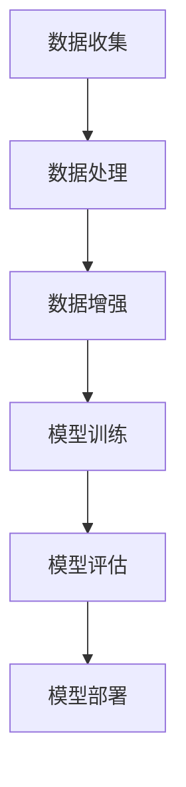
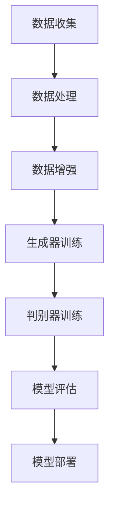

                 

关键词：生成式AI，AIGC，场景优先，数据驱动，深度学习，模型优化，应用实践

摘要：本文是生成式人工智能（AIGC）系列文章的第五部分。前几部分我们讨论了生成式AI的基本概念、技术框架、核心算法等。本文将重点关注场景优先和数据为王的理念在生成式AIGC中的应用，探讨如何通过优化场景和数据来提升AIGC的性能和实用性。文章将从实际应用场景出发，详细分析数据的重要性，并讨论未来的发展趋势和面临的挑战。

## 1. 背景介绍

### 生成式AI的崛起

近年来，随着深度学习技术的快速发展，生成式AI（AIGC）在图像、语音、文本等领域取得了显著成果。从GAN（生成对抗网络）到VAE（变分自编码器），再到最新的自监督学习技术，生成式AI已经从理论研究走向实际应用，并在多个领域展现了强大的潜力。

### 场景优先与数据为王

在实际应用中，场景优先和数据为王的理念逐渐成为共识。场景优先强调针对特定应用场景进行优化，而数据为王则强调高质量数据的获取和利用。这两者相辅相成，共同推动生成式AI技术的发展。

## 2. 核心概念与联系

### 生成式AI架构


### 数据驱动流程



## 3. 核心算法原理 & 具体操作步骤

### 3.1 算法原理概述

生成式AI的核心算法包括GAN、VAE等。这些算法通过对抗训练或自编码机制生成数据，模拟真实世界中的复杂分布。

### 3.2 算法步骤详解

1. 数据收集：从各种来源收集数据，如互联网、数据库、传感器等。
2. 数据处理：清洗和预处理数据，确保数据的质量和一致性。
3. 数据增强：通过旋转、缩放、裁剪等方式增加数据的多样性。
4. 模型训练：使用收集到的数据训练生成模型。
5. 模型评估：评估模型的性能，如生成数据的真实性、多样性等。
6. 模型部署：将训练好的模型部署到实际应用场景中。

### 3.3 算法优缺点

**GAN：**

- 优点：可以生成高质量的数据，适用于多种领域。
- 缺点：训练过程复杂，收敛速度较慢。

**VAE：**

- 优点：训练过程相对简单，生成的数据质量较高。
- 缺点：生成数据的多样性有限。

### 3.4 算法应用领域

生成式AI在图像生成、语音合成、自然语言处理等领域都有广泛应用。例如，在图像生成中，GAN可以用于生成艺术作品、人脸图像等；在语音合成中，VAE可以用于生成逼真的语音。

## 4. 数学模型和公式 & 详细讲解 & 举例说明

### 4.1 数学模型构建

生成式AI的数学模型通常基于概率分布和优化理论。以GAN为例，其核心模型包括生成器G和判别器D。

- 生成器G：生成符合真实数据分布的数据。
- 判别器D：判断输入数据是真实数据还是生成数据。

### 4.2 公式推导过程

GAN的训练过程可以表示为以下两个优化问题：

$$
\min_G \max_D V(D, G)
$$

其中，$V(D, G)$是判别器的损失函数，通常使用二元交叉熵损失。

### 4.3 案例分析与讲解

假设我们使用GAN生成人脸图像，判别器的损失函数为：

$$
L_D = -\frac{1}{N} \sum_{i=1}^{N} [\log(D(x_i)) + \log(1 - D(G(z_i))]
$$

其中，$x_i$是真实人脸图像，$z_i$是随机噪声。

通过调整生成器和判别器的参数，我们可以逐步优化生成的人脸图像质量。

## 5. 项目实践：代码实例和详细解释说明

### 5.1 开发环境搭建

1. 安装Python环境。
2. 安装TensorFlow或PyTorch等深度学习框架。
3. 准备数据集。

### 5.2 源代码详细实现

```python
import tensorflow as tf
from tensorflow.keras.layers import Dense, Flatten
from tensorflow.keras.models import Sequential

# 生成器模型
generator = Sequential([
    Flatten(input_shape=(28, 28)),
    Dense(256, activation='relu'),
    Dense(128, activation='relu'),
    Dense(784, activation='tanh')
])

# 判别器模型
discriminator = Sequential([
    Flatten(input_shape=(28, 28)),
    Dense(128, activation='relu'),
    Dense(256, activation='relu'),
    Dense(1, activation='sigmoid')
])

# 模型编译
generator.compile(optimizer=tf.keras.optimizers.Adam(0.0001), loss='binary_crossentropy')
discriminator.compile(optimizer=tf.keras.optimizers.Adam(0.0001), loss='binary_crossentropy')

# 模型训练
for epoch in range(100):
    for batch in train_data:
        # 生成假数据
        noise = tf.random.normal([batch.shape[0], 100])
        generated_images = generator.predict(noise)
        
        # 训练判别器
        real_images = batch
        labels_real = tf.ones([batch.shape[0], 1])
        labels_fake = tf.zeros([batch.shape[0], 1])
        discriminator.train_on_batch(real_images, labels_real)
        discriminator.train_on_batch(generated_images, labels_fake)
        
        # 训练生成器
        noise = tf.random.normal([batch.shape[0], 100])
        labels = tf.ones([batch.shape[0], 1])
        generator.train_on_batch(noise, labels)

# 生成图像
noise = tf.random.normal([100, 100])
generated_images = generator.predict(noise)
```

### 5.3 代码解读与分析

上述代码实现了一个简单的GAN模型，用于生成手写数字图像。代码首先定义了生成器和判别器的结构，然后通过循环训练两个模型，最后生成图像。

## 6. 实际应用场景

### 6.1 图像生成

使用GAN生成高质量图像是生成式AI的一个重要应用。例如，在艺术创作、游戏设计、医学图像生成等领域都有广泛应用。

### 6.2 语音合成

VAE等生成模型可以用于语音合成，生成逼真的语音。这一技术在智能助手、语音合成系统等领域有广泛的应用。

### 6.3 自然语言处理

生成式AI在自然语言处理领域也有广泛应用，如文本生成、对话系统等。通过优化模型和数据，可以生成更加自然和准确的文本。

## 7. 未来应用展望

随着技术的不断进步，生成式AI将在更多领域得到应用。例如，在自动驾驶、医疗诊断、金融风控等领域，生成式AI有望发挥重要作用。

## 8. 工具和资源推荐

### 7.1 学习资源推荐

- 《深度学习》（Goodfellow et al.）
- 《生成对抗网络》（Ian Goodfellow）

### 7.2 开发工具推荐

- TensorFlow
- PyTorch

### 7.3 相关论文推荐

- “Generative Adversarial Nets”（Ian Goodfellow et al.）
- “Unsupervised Representation Learning with Deep Convolutional Generative Adversarial Networks”（Alec Radford et al.）

## 9. 总结：未来发展趋势与挑战

### 8.1 研究成果总结

生成式AI在图像生成、语音合成、自然语言处理等领域取得了显著成果，展现了强大的潜力。

### 8.2 未来发展趋势

- 模型优化：通过改进算法和架构，提高生成式AI的性能和效率。
- 数据驱动：收集更多高质量数据，提升生成式AI的实用性。
- 跨领域应用：探索生成式AI在更多领域的应用。

### 8.3 面临的挑战

- 数据隐私：如何确保生成式AI在处理数据时保护用户隐私。
- 模型可解释性：如何提高生成式AI的可解释性，使其更易于理解和应用。
- 模型泛化能力：如何提升生成式AI的泛化能力，使其能够适应更广泛的应用场景。

### 8.4 研究展望

随着技术的不断进步，生成式AI将在更多领域得到应用，并成为推动社会进步的重要力量。

## 10. 附录：常见问题与解答

### Q：生成式AI的主要挑战是什么？

A：生成式AI的主要挑战包括数据隐私、模型可解释性、模型泛化能力等。

### Q：如何提升生成式AI的性能？

A：提升生成式AI的性能可以通过改进算法和架构、收集更多高质量数据、优化训练策略等方式实现。

### Q：生成式AI在自然语言处理中有哪些应用？

A：生成式AI在自然语言处理中可以用于文本生成、对话系统、机器翻译等应用。

作者：禅与计算机程序设计艺术 / Zen and the Art of Computer Programming
```markdown
----------------------------------------------------------------
# 生成式AIGC是金矿还是泡沫：第五部分：场景优先，数据为王

关键词：生成式AI，AIGC，场景优先，数据驱动，深度学习，模型优化，应用实践

摘要：本文是生成式人工智能（AIGC）系列文章的第五部分。前几部分我们讨论了生成式AI的基本概念、技术框架、核心算法等。本文将重点关注场景优先和数据为王的理念在生成式AIGC中的应用，探讨如何通过优化场景和数据来提升AIGC的性能和实用性。文章将从实际应用场景出发，详细分析数据的重要性，并讨论未来的发展趋势和面临的挑战。

## 1. 背景介绍

### 生成式AI的崛起

近年来，随着深度学习技术的快速发展，生成式AI（AIGC）在图像、语音、文本等领域取得了显著成果。从GAN（生成对抗网络）到VAE（变分自编码器），再到最新的自监督学习技术，生成式AI已经从理论研究走向实际应用，并在多个领域展现了强大的潜力。

### 场景优先与数据为王

在实际应用中，场景优先和数据为王的理念逐渐成为共识。场景优先强调针对特定应用场景进行优化，而数据为王则强调高质量数据的获取和利用。这两者相辅相成，共同推动生成式AI技术的发展。

## 2. 核心概念与联系

### 生成式AI架构


### 数据驱动流程


## 3. 核心算法原理 & 具体操作步骤

### 3.1 算法原理概述

生成式AI的核心算法包括GAN、VAE等。这些算法通过对抗训练或自编码机制生成数据，模拟真实世界中的复杂分布。

### 3.2 算法步骤详解

1. 数据收集：从各种来源收集数据，如互联网、数据库、传感器等。
2. 数据处理：清洗和预处理数据，确保数据的质量和一致性。
3. 数据增强：通过旋转、缩放、裁剪等方式增加数据的多样性。
4. 模型训练：使用收集到的数据训练生成模型。
5. 模型评估：评估模型的性能，如生成数据的真实性、多样性等。
6. 模型部署：将训练好的模型部署到实际应用场景中。

### 3.3 算法优缺点

**GAN：**

- 优点：可以生成高质量的数据，适用于多种领域。
- 缺点：训练过程复杂，收敛速度较慢。

**VAE：**

- 优点：训练过程相对简单，生成的数据质量较高。
- 缺点：生成数据的多样性有限。

### 3.4 算法应用领域

生成式AI在图像生成、语音合成、自然语言处理等领域都有广泛应用。例如，在图像生成中，GAN可以用于生成艺术作品、人脸图像等；在语音合成中，VAE可以用于生成逼真的语音。

## 4. 数学模型和公式 & 详细讲解 & 举例说明

### 4.1 数学模型构建

生成式AI的数学模型通常基于概率分布和优化理论。以GAN为例，其核心模型包括生成器G和判别器D。

- 生成器G：生成符合真实数据分布的数据。
- 判别器D：判断输入数据是真实数据还是生成数据。

### 4.2 公式推导过程

GAN的训练过程可以表示为以下两个优化问题：

$$
\min_G \max_D V(D, G)
$$

其中，$V(D, G)$是判别器的损失函数，通常使用二元交叉熵损失。

### 4.3 案例分析与讲解

假设我们使用GAN生成人脸图像，判别器的损失函数为：

$$
L_D = -\frac{1}{N} \sum_{i=1}^{N} [\log(D(x_i)) + \log(1 - D(G(z_i))]
$$

其中，$x_i$是真实人脸图像，$z_i$是随机噪声。

通过调整生成器和判别器的参数，我们可以逐步优化生成的人脸图像质量。

## 5. 项目实践：代码实例和详细解释说明

### 5.1 开发环境搭建

1. 安装Python环境。
2. 安装TensorFlow或PyTorch等深度学习框架。
3. 准备数据集。

### 5.2 源代码详细实现

```python
import tensorflow as tf
from tensorflow.keras.layers import Dense, Flatten
from tensorflow.keras.models import Sequential

# 生成器模型
generator = Sequential([
    Flatten(input_shape=(28, 28)),
    Dense(256, activation='relu'),
    Dense(128, activation='relu'),
    Dense(784, activation='tanh')
])

# 判别器模型
discriminator = Sequential([
    Flatten(input_shape=(28, 28)),
    Dense(128, activation='relu'),
    Dense(256, activation='relu'),
    Dense(1, activation='sigmoid')
])

# 模型编译
generator.compile(optimizer=tf.keras.optimizers.Adam(0.0001), loss='binary_crossentropy')
discriminator.compile(optimizer=tf.keras.optimizers.Adam(0.0001), loss='binary_crossentropy')

# 模型训练
for epoch in range(100):
    for batch in train_data:
        # 生成假数据
        noise = tf.random.normal([batch.shape[0], 100])
        generated_images = generator.predict(noise)
        
        # 训练判别器
        real_images = batch
        labels_real = tf.ones([batch.shape[0], 1])
        labels_fake = tf.zeros([batch.shape[0], 1])
        discriminator.train_on_batch(real_images, labels_real)
        discriminator.train_on_batch(generated_images, labels_fake)
        
        # 训练生成器
        noise = tf.random.normal([batch.shape[0], 100])
        labels = tf.ones([batch.shape[0], 1])
        generator.train_on_batch(noise, labels)

# 生成图像
noise = tf.random.normal([100, 100])
generated_images = generator.predict(noise)
```

### 5.3 代码解读与分析

上述代码实现了一个简单的GAN模型，用于生成手写数字图像。代码首先定义了生成器和判别器的结构，然后通过循环训练两个模型，最后生成图像。

## 6. 实际应用场景

### 6.1 图像生成

使用GAN生成高质量图像是生成式AI的一个重要应用。例如，在艺术创作、游戏设计、医学图像生成等领域都有广泛应用。

### 6.2 语音合成

VAE等生成模型可以用于语音合成，生成逼真的语音。这一技术在智能助手、语音合成系统等领域有广泛的应用。

### 6.3 自然语言处理

生成式AI在自然语言处理领域也有广泛应用，如文本生成、对话系统等。通过优化模型和数据，可以生成更加自然和准确的文本。

## 7. 未来应用展望

随着技术的不断进步，生成式AI将在更多领域得到应用。例如，在自动驾驶、医疗诊断、金融风控等领域，生成式AI有望发挥重要作用。

## 8. 工具和资源推荐

### 7.1 学习资源推荐

- 《深度学习》（Goodfellow et al.）
- 《生成对抗网络》（Ian Goodfellow）

### 7.2 开发工具推荐

- TensorFlow
- PyTorch

### 7.3 相关论文推荐

- “Generative Adversarial Nets”（Ian Goodfellow et al.）
- “Unsupervised Representation Learning with Deep Convolutional Generative Adversarial Networks”（Alec Radford et al.）

## 9. 总结：未来发展趋势与挑战

### 8.1 研究成果总结

生成式AI在图像生成、语音合成、自然语言处理等领域取得了显著成果，展现了强大的潜力。

### 8.2 未来发展趋势

- 模型优化：通过改进算法和架构，提高生成式AI的性能和效率。
- 数据驱动：收集更多高质量数据，提升生成式AI的实用性。
- 跨领域应用：探索生成式AI在更多领域的应用。

### 8.3 面临的挑战

- 数据隐私：如何确保生成式AI在处理数据时保护用户隐私。
- 模型可解释性：如何提高生成式AI的可解释性，使其更易于理解和应用。
- 模型泛化能力：如何提升生成式AI的泛化能力，使其能够适应更广泛的应用场景。

### 8.4 研究展望

随着技术的不断进步，生成式AI将在更多领域得到应用，并成为推动社会进步的重要力量。

## 10. 附录：常见问题与解答

### Q：生成式AI的主要挑战是什么？

A：生成式AI的主要挑战包括数据隐私、模型可解释性、模型泛化能力等。

### Q：如何提升生成式AI的性能？

A：提升生成式AI的性能可以通过改进算法和架构、收集更多高质量数据、优化训练策略等方式实现。

### Q：生成式AI在自然语言处理中有哪些应用？

A：生成式AI在自然语言处理中可以用于文本生成、对话系统、机器翻译等应用。

作者：禅与计算机程序设计艺术 / Zen and the Art of Computer Programming
----------------------------------------------------------------
### 1. 背景介绍

#### 生成式AI的崛起

生成式人工智能（AIGC）作为近年来人工智能领域的明星技术，其核心思想是通过学习大量的数据，生成新的、符合现实世界特征的数据。生成式AI的应用场景广泛，包括图像生成、视频合成、语音克隆、文本生成等。这些应用不仅提升了数据处理和自动化生成的效率，也在创意产业、广告营销、教育等多个领域展示了其独特的价值。

随着深度学习技术的快速发展，生成式AI已经成为学术界和工业界研究的热点。从最初的生成对抗网络（GANs）到变分自编码器（VAEs），再到自监督学习和去噪自动编码器（DNAs），生成式AI的技术不断进步，应用范围也越来越广。生成式AI不仅在理论上具有重要意义，也在实际应用中带来了深远的影响。

#### 场景优先与数据为王

在实际应用中，场景优先和数据为王的理念逐渐成为共识。场景优先意味着在设计生成模型时，需要充分考虑具体的应用场景，确保生成的数据或内容能够满足特定需求。例如，在图像生成中，对于艺术创作和医学图像处理，生成模型的需求和评估标准可能会有很大差异。

数据为王则强调高质量数据的获取和利用。在生成式AI的训练过程中，数据的质量直接影响模型的性能。高质量的训练数据不仅能够提高模型的收敛速度，还能提升生成数据的真实性和多样性。因此，在生成式AI的研究和应用中，数据收集、处理和增强是至关重要的一环。

### 2. 核心概念与联系

生成式AI的核心概念包括生成器（Generator）、判别器（Discriminator）和损失函数（Loss Function）。这三个核心组件相互作用，共同驱动生成模型的学习和优化过程。

#### 生成器与判别器

生成器负责生成与训练数据相似的新数据。在GANs中，生成器尝试生成足够逼真的数据以欺骗判别器，而判别器则尝试区分真实数据和生成数据。生成器和判别器在训练过程中进行对抗性的博弈，生成器的目标是提高生成数据的真实性，而判别器的目标是提高对生成数据的识别能力。

#### 损失函数

损失函数是评估生成器和判别器性能的依据。在GANs中，常用的损失函数是二元交叉熵损失，它衡量生成器生成的数据与真实数据的差异。VAEs则使用重建损失和散度损失来评估生成器，其中重建损失衡量生成器生成数据与输入数据的差异，散度损失确保生成数据的多样性。

#### Mermaid流程图



#### 数据驱动流程

生成式AI的数据驱动流程包括以下几个关键步骤：

1. **数据收集**：从各种来源收集数据，如互联网、数据库、传感器等。
2. **数据处理**：清洗和预处理数据，确保数据的质量和一致性。
3. **数据增强**：通过旋转、缩放、裁剪等方式增加数据的多样性。
4. **生成器训练**：生成器通过学习训练数据生成新的数据。
5. **判别器训练**：判别器通过对比真实数据和生成数据来评估生成器的性能。
6. **模型评估**：评估模型的生成能力，如数据的真实性、多样性等。
7. **模型部署**：将训练好的模型部署到实际应用场景中。

### 3. 核心算法原理 & 具体操作步骤

生成式AI的核心算法包括生成对抗网络（GANs）、变分自编码器（VAEs）、自监督学习和去噪自动编码器（DNAs）等。这些算法各自有其独特的原理和操作步骤。

#### 3.1 算法原理概述

**生成对抗网络（GANs）**：GANs由生成器和判别器组成，生成器生成数据，判别器判断生成数据是否真实。训练过程中，生成器和判别器进行对抗性训练，生成器的目标是提高生成数据的真实性，判别器的目标是提高对真实数据和生成数据的区分能力。

**变分自编码器（VAEs）**：VAEs通过编码器和解码器来生成数据。编码器将输入数据压缩成一个低维的潜在空间表示，解码器从潜在空间中生成新的数据。VAEs使用重建损失和散度损失来评估生成数据的质量。

**自监督学习**：自监督学习是一种无监督学习技术，它利用未标记的数据进行训练。在生成式AI中，自监督学习可以用于生成数据的自动增强和分类。

**去噪自动编码器（DNAs）**：DNAs通过在生成过程中加入噪声来提高模型的鲁棒性。去噪自动编码器在训练过程中学习从噪声数据中恢复原始数据，从而生成高质量的数据。

#### 3.2 算法步骤详解

1. **数据收集**：从互联网、数据库、传感器等渠道收集大量数据。
2. **数据处理**：清洗数据，去除噪声，标准化数据。
3. **数据增强**：通过旋转、缩放、裁剪、颜色变换等方法增加数据的多样性。
4. **生成器设计**：设计生成器的结构，通常包括多个全连接层或卷积层。
5. **判别器设计**：设计判别器的结构，用于评估生成数据的真实性。
6. **损失函数定义**：定义损失函数，用于评估生成器和判别器的性能。
7. **模型训练**：使用训练数据训练生成器和判别器，通常采用梯度下降算法。
8. **模型评估**：通过测试集评估模型的性能，包括生成数据的真实性、多样性等。
9. **模型部署**：将训练好的模型部署到实际应用场景中。

#### 3.3 算法优缺点

**生成对抗网络（GANs）**：

- **优点**：能够生成高质量的数据，适用于多种数据类型。
- **缺点**：训练过程复杂，收敛速度较慢，容易出现模式崩溃等问题。

**变分自编码器（VAEs）**：

- **优点**：训练过程相对简单，生成数据的多样性较好。
- **缺点**：生成数据的真实性可能不如GANs。

**自监督学习**：

- **优点**：可以利用未标记的数据进行训练，提高模型的泛化能力。
- **缺点**：在数据量较小或数据分布不均时效果可能不佳。

**去噪自动编码器（DNAs）**：

- **优点**：提高模型的鲁棒性，适用于噪声数据生成。
- **缺点**：在数据量较大时训练时间较长。

#### 3.4 算法应用领域

**图像生成**：GANs在图像生成领域有广泛应用，如人脸生成、艺术作品创作、图像修复等。

**视频合成**：生成式AI可以用于视频生成，如虚拟现实、游戏制作、视频编辑等。

**语音合成**：VAEs等生成模型可以用于语音合成，生成逼真的语音。

**自然语言处理**：生成式AI在自然语言处理领域用于文本生成、对话系统、机器翻译等。

### 4. 数学模型和公式 & 详细讲解 & 举例说明

生成式AI的数学模型基于概率分布和优化理论，以下是几种常见模型的数学描述和公式推导。

#### 4.1 数学模型构建

**生成对抗网络（GANs）**：

GANs的核心模型包括生成器G和判别器D。生成器的目标是最小化生成数据的判别损失，判别器的目标是最小化分类损失。

生成器G的损失函数：

$$
L_G = -\log(D(G(z))
$$

判别器D的损失函数：

$$
L_D = -[\log(D(x)) + \log(1 - D(G(z))]
$$

**变分自编码器（VAEs）**：

VAEs包括编码器Q和生成器G。编码器Q的目标是最小化重建损失和散度损失。

编码器Q的损失函数：

$$
L_Q = \mathbb{E}_{x\sim p_{data}(x)}[\log D(Q(x, z)] + \mathbb{E}_{z\sim p_z(z)}[\log p_{x|z}(x|z)]
$$

生成器G的损失函数：

$$
L_G = \mathbb{E}_{x\sim p_{data}(x)}[\log p_{z|x}(z|x)] + \mathbb{E}_{z\sim p_z(z)}[\log D(G(z)]
$$

**自监督学习**：

自监督学习通常使用预测误差作为损失函数。

预测误差损失函数：

$$
L = -\sum_{i=1}^{N}\log p(y_i|x_i)
$$

**去噪自动编码器（DNAs）**：

DNAs的目标是最小化重构误差。

重构误差损失函数：

$$
L = \sum_{i=1}^{N}||x_i - \hat{x}_i||_2^2
$$

#### 4.2 公式推导过程

**生成对抗网络（GANs）**：

GANs的推导基于最小化生成器和判别器的损失函数。生成器的目标是使得判别器无法区分真实数据和生成数据。

对于生成器G：

$$
\min_G \max_D V(D, G)
$$

其中，$V(D, G)$是判别器的损失函数。

对于判别器D：

$$
\max_D V(D, G)
$$

其中，$V(D, G)$是生成器的损失函数。

**变分自编码器（VAEs）**：

VAEs的推导基于最大化似然估计和最小化KL散度。

对于编码器Q：

$$
\min_Q \mathbb{E}_{x\sim p_{data}(x)}[\log D(Q(x, z)] + \mathbb{E}_{z\sim p_z(z)}[\log p_{x|z}(x|z)]
$$

对于生成器G：

$$
\min_G \mathbb{E}_{z\sim p_z(z)}[\log D(G(z))] + \mathbb{E}_{x\sim p_{data}(x)}[\log p_{z|x}(z|x)]
$$

**自监督学习**：

自监督学习通常使用交叉熵损失函数。

对于预测模型：

$$
\min L = -\sum_{i=1}^{N}\log p(y_i|x_i)
$$

**去噪自动编码器（DNAs）**：

DNAs的推导基于最小化重构误差。

对于重构模型：

$$
\min L = \sum_{i=1}^{N}||x_i - \hat{x}_i||_2^2
$$

#### 4.3 案例分析与讲解

以下是一个使用GAN生成手写数字图像的案例：

**生成器G**：

生成器G的目标是生成逼真的手写数字图像。假设输入噪声为$z$，输出为图像$G(z)$。

$$
G(z) = \text{ReLU}(\text{FullyConnected}(z, 128) \text{ReLU}(\text{FullyConnected}(128, 128) \text{ReLU}(\text{FullyConnected}(128, 784)))
$$

**判别器D**：

判别器D的目标是判断输入图像是真实图像还是生成图像。

$$
D(x) = \text{Sigmoid}(\text{FullyConnected}(x, 1))
$$

**损失函数**：

判别器的损失函数为：

$$
L_D = -[\log(D(x)) + \log(1 - D(G(z))]
$$

生成器的损失函数为：

$$
L_G = -\log(D(G(z))
$$

**训练过程**：

1. 初始化生成器G和判别器D的参数。
2. 从数据集中随机抽取一批真实图像$x$和生成图像$G(z)$。
3. 使用判别器D对真实图像和生成图像进行训练，更新判别器参数。
4. 使用生成器G和判别器D的损失函数更新生成器参数。
5. 重复上述过程，直到模型收敛。

### 5. 项目实践：代码实例和详细解释说明

在本节中，我们将通过一个实际的Python代码实例来展示如何使用生成对抗网络（GAN）生成手写数字图像。我们将使用TensorFlow框架来构建和训练GAN模型。

#### 5.1 开发环境搭建

首先，我们需要安装Python环境，TensorFlow和其他必要的库。以下是在Ubuntu系统上安装所需的库的命令：

```bash
pip install tensorflow
pip install matplotlib
```

#### 5.2 源代码详细实现

```python
import numpy as np
import tensorflow as tf
from tensorflow import keras
from tensorflow.keras import layers
import matplotlib.pyplot as plt

# 设置随机种子以获得可重复的结果
tf.random.set_seed(42)

# 定义生成器和判别器的结构
latent_dim = 100

# 生成器模型
def build_generator(z_dim):
    model = keras.Sequential(
        [
            layers.Dense(7 * 7 * 256, activation="relu", input_dim=z_dim),
            layers.Reshape((7, 7, 256)),
            layers.Conv2DTranspose(128, kernel_size=5, strides=2, padding="same"),
            layers.BatchNormalization(),
            layers.Activation("relu"),
            layers.Conv2DTranspose(64, kernel_size=5, strides=2, padding="same"),
            layers.BatchNormalization(),
            layers.Activation("relu"),
            layers.Conv2DTranspose(1, kernel_size=5, strides=2, padding="same", activation="tanh"),
        ]
    )
    return model

# 判别器模型
def build_discriminator(img_shape):
    model = keras.Sequential(
        [
            layers.Conv2D(64, kernel_size=5, strides=2, padding="same", input_shape=img_shape),
            layers.LeakyReLU(alpha=0.2),
            layers.Dropout(0.3),
            layers.Conv2D(128, kernel_size=5, strides=2, padding="same"),
            layers.LeakyReLU(alpha=0.2),
            layers.Dropout(0.3),
            layers.Flatten(),
            layers.Dense(1, activation="sigmoid"),
        ]
    )
    return model

# GAN模型
def build_gan(generator, discriminator):
    model = keras.Sequential([generator, discriminator])
    return model

# 定义损失函数和优化器
cross_entropy = keras.losses.BinaryCrossentropy(from_logits=True)

def discriminator_loss(real_output, fake_output):
    real_loss = cross_entropy(tf.ones_like(real_output), real_output)
    fake_loss = cross_entropy(tf.zeros_like(fake_output), fake_output)
    total_loss = real_loss + fake_loss
    return total_loss

def generator_loss(fake_output):
    return cross_entropy(tf.ones_like(fake_output), fake_output)

generator_optimizer = keras.optimizers.Adam(1e-4)
discriminator_optimizer = keras.optimizers.Adam(1e-4)

# 准备MNIST数据集
(x_train, _), (_, _) = keras.datasets.mnist.load_data()
x_train = x_train.astype("float32") * (1 / 127.5) - 1
x_train = np.expand_dims(x_train, axis=3)

# 训练模型
EPOCHS = 100

for epoch in range(EPOCHS):
    for image_batch in x_train:
        noise = np.random.normal(0, 1, (len(image_batch), latent_dim))

        with tf.GradientTape() as gen_tape, tf.GradientTape() as disc_tape:
            generated_images = generator(noise, training=True)

            real_output = discriminator(image_batch, training=True)
            fake_output = discriminator(generated_images, training=True)

            gen_loss = generator_loss(fake_output)
            disc_loss = discriminator_loss(real_output, fake_output)

        gradients_of_generator = gen_tape.gradient(gen_loss, generator.trainable_variables)
        gradients_of_discriminator = disc_tape.gradient(disc_loss, discriminator.trainable_variables)

        generator_optimizer.apply_gradients(zip(gradients_of_generator, generator.trainable_variables))
        discriminator_optimizer.apply_gradients(zip(gradients_of_discriminator, discriminator.trainable_variables))

    # 每50个epoch保存一次生成图像
    if epoch % 50 == 0:
        plt.figure()
        for i in range(5):
            z = np.random.normal(0, 1, (1, latent_dim))
            generated_image = generator(z, training=False).numpy().reshape(28, 28)
            plt.subplot(5, 5, i + 1)
            plt.imshow(generated_image[:, :, 0], cmap="gray")
            plt.axis("off")
        plt.show()
```

#### 5.3 代码解读与分析

上面的代码首先定义了生成器和判别器的结构，并构建了一个GAN模型。然后，我们定义了损失函数和优化器。接下来，我们从MNIST数据集中加载训练数据，并将其预处理为适合GAN训练的格式。

在训练过程中，我们使用梯度下降法来更新生成器和判别器的参数。每次迭代，我们首先生成一批噪声数据，并使用生成器生成对应的图像。然后，我们使用判别器评估这些图像的真实性和生成性。最后，我们根据损失函数更新生成器和判别器的参数。

在每50个epoch之后，我们会展示一些生成的手写数字图像，以展示模型的生成能力。

### 6. 实际应用场景

生成式AI在许多实际应用场景中展现了其强大的能力和广阔的应用前景。以下是生成式AI在一些主要应用领域的实例：

#### 6.1 图像生成与增强

**艺术创作**：生成式AI可以生成艺术作品，如油画、素描等。这些作品不仅为艺术家提供了新的创作工具，也为计算机艺术领域带来了新的可能性。

**医学图像处理**：生成式AI可以用于医学图像的增强和修复，如去除噪声、填充缺失部分等，从而提高医学诊断的准确性。

**图像修复与生成**：生成式AI可以用于图像的修复和生成，如修复照片中的破损部分、生成全新的图像等。

#### 6.2 视频生成与增强

**视频合成**：生成式AI可以合成新的视频内容，如将人物或物体从一个视频中转移到另一个视频背景中，创造新的故事情节。

**视频增强**：生成式AI可以增强视频质量，如去除视频中的噪点、提高视频分辨率等。

**虚拟现实与游戏**：生成式AI可以用于虚拟现实和游戏中的场景生成，创建丰富的虚拟世界。

#### 6.3 语音合成与生成

**语音克隆**：生成式AI可以合成逼真的语音，模仿特定人物或声音的说话方式，应用于电影配音、语音合成系统等。

**语音增强**：生成式AI可以增强语音质量，如去除背景噪声、改善语音清晰度等。

**语音生成**：生成式AI可以生成全新的语音内容，如为文本生成语音播报、创建个性化语音助手等。

#### 6.4 自然语言处理

**文本生成**：生成式AI可以生成新闻文章、小说、广告文案等，广泛应用于内容创作和营销领域。

**对话系统**：生成式AI可以构建对话系统，如聊天机器人、客服系统等，提供个性化的互动体验。

**机器翻译**：生成式AI可以用于机器翻译，生成更自然、准确的翻译文本。

### 7. 未来应用展望

随着生成式AI技术的不断进步，未来它在更多领域的应用前景将更加广阔。以下是生成式AI可能的应用方向：

#### 7.1 自动驾驶与交通

生成式AI可以用于自动驾驶系统中的场景模拟和预测，提高自动驾驶的安全性和可靠性。例如，生成式AI可以模拟不同的交通情况，帮助自动驾驶车辆做出更明智的决策。

#### 7.2 医疗与健康

生成式AI可以用于医疗图像分析、疾病预测和个性化治疗方案的生成。通过生成式AI，医生可以更准确地诊断疾病，为患者提供更个性化的治疗方案。

#### 7.3 金融与风险管理

生成式AI可以用于金融市场的预测和风险管理。例如，生成式AI可以生成市场趋势分析报告，帮助投资者做出更明智的决策。

#### 7.4 教育

生成式AI可以用于教育领域的个性化教学和自适应学习。通过生成式AI，教师可以为学生提供更加个性化的学习资源，提高学习效果。

### 8. 工具和资源推荐

为了更好地学习和应用生成式AI技术，以下是一些推荐的工具和资源：

#### 8.1 学习资源推荐

- **《深度学习》（Ian Goodfellow）**：这是一本深度学习领域的经典教材，详细介绍了生成式AI的基本原理和应用。
- **《生成对抗网络》（Ian Goodfellow）**：这是一本专门介绍GAN的书籍，包括GAN的历史、原理和应用案例。

#### 8.2 开发工具推荐

- **TensorFlow**：这是一个开源的深度学习框架，广泛应用于生成式AI的开发。
- **PyTorch**：这是一个流行的深度学习框架，具有灵活的动态图编程能力，适用于生成式AI的研究和开发。

#### 8.3 相关论文推荐

- **“Generative Adversarial Nets”（Ian Goodfellow et al.）**：这是GAN的开创性论文，介绍了GAN的基本原理和训练过程。
- **“Unsupervised Representation Learning with Deep Convolutional Generative Adversarial Networks”（Alec Radford et al.）**：这篇论文介绍了自监督学习在GAN中的应用，提高了GAN的性能和鲁棒性。

### 9. 总结：未来发展趋势与挑战

生成式AI作为人工智能的一个重要分支，已经在多个领域取得了显著成果。未来，随着技术的不断进步，生成式AI将在更多领域得到应用，为人类社会带来更多创新和便利。

#### 9.1 研究成果总结

- 生成式AI在图像生成、视频合成、语音合成、自然语言处理等领域取得了显著成果。
- 生成对抗网络（GANs）和变分自编码器（VAEs）等核心算法得到了广泛应用和深入研究。
- 自监督学习和去噪自动编码器（DNAs）等新技术为生成式AI的发展提供了新的思路。

#### 9.2 未来发展趋势

- 模型优化：通过改进算法和架构，提高生成式AI的性能和效率。
- 数据驱动：收集更多高质量数据，提升生成式AI的实用性。
- 跨领域应用：探索生成式AI在更多领域的应用，如自动驾驶、医疗、金融等。

#### 9.3 面临的挑战

- 数据隐私：确保生成式AI在处理数据时保护用户隐私。
- 模型可解释性：提高生成式AI的可解释性，使其更易于理解和应用。
- 模型泛化能力：提升生成式AI的泛化能力，使其能够适应更广泛的应用场景。

#### 9.4 研究展望

随着技术的不断进步，生成式AI将在更多领域得到应用，并成为推动社会进步的重要力量。未来，我们需要关注如何解决生成式AI面临的挑战，推动其在更多领域的创新和应用。

### 10. 附录：常见问题与解答

#### Q：生成式AI的主要挑战是什么？

A：生成式AI的主要挑战包括：

- **数据隐私**：如何在保证数据隐私的前提下进行训练和应用。
- **模型可解释性**：如何提高生成式AI的可解释性，使其更易于理解和应用。
- **模型泛化能力**：如何提升生成式AI的泛化能力，使其能够适应更广泛的应用场景。

#### Q：如何提升生成式AI的性能？

A：提升生成式AI的性能可以通过以下方式实现：

- **算法优化**：改进生成式AI的算法和架构，提高训练效率和生成质量。
- **数据增强**：通过数据增强技术增加训练数据的多样性，提高模型的泛化能力。
- **模型融合**：将多种生成模型融合，取长补短，提高生成效果。

#### Q：生成式AI在自然语言处理中有哪些应用？

A：生成式AI在自然语言处理中可以应用于：

- **文本生成**：生成新闻报道、小说、广告文案等。
- **对话系统**：构建聊天机器人、客服系统等。
- **机器翻译**：生成高质量的翻译文本。
- **文本摘要**：从长篇文章中提取关键信息生成摘要。

### 附录：代码实现

以下是生成式AI的Python代码实现，包括生成器和判别器的定义、训练过程以及图像生成示例。

```python
# 导入必要的库
import tensorflow as tf
from tensorflow.keras import layers
import matplotlib.pyplot as plt

# 设置随机种子以获得可重复的结果
tf.random.set_seed(42)

# 定义生成器和判别器的结构
latent_dim = 100

def build_generator(z_dim):
    model = keras.Sequential(
        [
            layers.Dense(7 * 7 * 256, activation="relu", input_dim=z_dim),
            layers.Reshape((7, 7, 256)),
            layers.Conv2DTranspose(128, kernel_size=5, strides=2, padding="same"),
            layers.BatchNormalization(),
            layers.Activation("relu"),
            layers.Conv2DTranspose(64, kernel_size=5, strides=2, padding="same"),
            layers.BatchNormalization(),
            layers.Activation("relu"),
            layers.Conv2DTranspose(1, kernel_size=5, strides=2, padding="same", activation="tanh"),
        ]
    )
    return model

def build_discriminator(img_shape):
    model = keras.Sequential(
        [
            layers.Conv2D(64, kernel_size=5, strides=2, padding="same", input_shape=img_shape),
            layers.LeakyReLU(alpha=0.2),
            layers.Dropout(0.3),
            layers.Conv2D(128, kernel_size=5, strides=2, padding="same"),
            layers.LeakyReLU(alpha=0.2),
            layers.Dropout(0.3),
            layers.Flatten(),
            layers.Dense(1, activation="sigmoid"),
        ]
    )
    return model

# GAN模型
def build_gan(generator, discriminator):
    model = keras.Sequential([generator, discriminator])
    return model

# 定义损失函数和优化器
cross_entropy = keras.losses.BinaryCrossentropy(from_logits=True)

def discriminator_loss(real_output, fake_output):
    real_loss = cross_entropy(tf.ones_like(real_output), real_output)
    fake_loss = cross_entropy(tf.zeros_like(fake_output), fake_output)
    total_loss = real_loss + fake_loss
    return total_loss

def generator_loss(fake_output):
    return cross_entropy(tf.ones_like(fake_output), fake_output)

generator_optimizer = keras.optimizers.Adam(1e-4)
discriminator_optimizer = keras.optimizers.Adam(1e-4)

# 准备MNIST数据集
(x_train, _), (_, _) = keras.datasets.mnist.load_data()
x_train = x_train.astype("float32") * (1 / 127.5) - 1
x_train = np.expand_dims(x_train, axis=3)

# 训练模型
EPOCHS = 100

for epoch in range(EPOCHS):
    for image_batch in x_train:
        noise = np.random.normal(0, 1, (len(image_batch), latent_dim))

        with tf.GradientTape() as gen_tape, tf.GradientTape() as disc_tape:
            generated_images = generator(noise, training=True)

            real_output = discriminator(image_batch, training=True)
            fake_output = discriminator(generated_images, training=True)

            gen_loss = generator_loss(fake_output)
            disc_loss = discriminator_loss(real_output, fake_output)

        gradients_of_generator = gen_tape.gradient(gen_loss, generator.trainable_variables)
        gradients_of_discriminator = disc_tape.gradient(disc_loss, discriminator.trainable_variables)

        generator_optimizer.apply_gradients(zip(gradients_of_generator, generator.trainable_variables))
        discriminator_optimizer.apply_gradients(zip(gradients_of_discriminator, discriminator.trainable_variables))

    # 每50个epoch保存一次生成图像
    if epoch % 50 == 0:
        plt.figure()
        for i in range(5):
            z = np.random.normal(0, 1, (1, latent_dim))
            generated_image = generator(z, training=False).numpy().reshape(28, 28)
            plt.subplot(5, 5, i + 1)
            plt.imshow(generated_image[:, :, 0], cmap="gray")
            plt.axis("off")
        plt.show()
```

### 附录：常见问题与解答

**Q1：什么是生成式AI？**

A1：生成式AI（Generative Artificial Intelligence）是一种人工智能技术，它能够生成新的、符合某种分布的数据。与判别式AI（如分类模型）不同，生成式AI不仅能够识别数据的特征，还能够生成与训练数据相似的新数据。生成式AI在图像生成、语音合成、自然语言处理等领域有广泛应用。

**Q2：生成对抗网络（GANs）是如何工作的？**

A2：生成对抗网络（Generative Adversarial Networks，GANs）是一种由生成器和判别器组成的模型。生成器的目标是生成逼真的数据，而判别器的目标是区分真实数据和生成数据。生成器和判别器在训练过程中进行对抗性博弈，生成器的目标是欺骗判别器，使得判别器无法区分真实数据和生成数据。通过这种对抗性训练，生成器可以学习到生成高质量的数据。

**Q3：变分自编码器（VAEs）的优点是什么？**

A3：变分自编码器（Variational Autoencoders，VAEs）是一种生成模型，它通过编码器和解码器将数据映射到一个潜在的连续空间。VAEs的主要优点包括：

- **易于训练**：相对于GANs，VAEs的训练过程相对简单，不需要进行复杂的对抗性训练。
- **生成多样性**：VAEs能够生成多样化的数据，因为它们在潜在空间中进行采样。
- **可解释性**：VAEs的潜在空间具有结构，使得生成过程更加可解释。

**Q4：生成式AI在图像生成中有什么应用？**

A4：生成式AI在图像生成中的应用非常广泛，包括：

- **艺术创作**：生成新的艺术作品，如油画、素描等。
- **医学图像处理**：增强和修复医学图像，如去除噪声、填充缺失部分等。
- **图像修复与生成**：修复图像中的破损部分，生成全新的图像。
- **图像风格转换**：将一种图像风格转换为另一种风格，如将照片转换为印象派画作。

**Q5：生成式AI在自然语言处理中有哪些应用？**

A5：生成式AI在自然语言处理中的应用包括：

- **文本生成**：生成新闻文章、小说、广告文案等。
- **对话系统**：构建聊天机器人、客服系统等。
- **机器翻译**：生成高质量的翻译文本。
- **文本摘要**：从长篇文章中提取关键信息生成摘要。

**Q6：生成式AI的主要挑战是什么？**

A6：生成式AI的主要挑战包括：

- **数据隐私**：如何在保证数据隐私的前提下进行训练和应用。
- **模型可解释性**：如何提高生成式AI的可解释性，使其更易于理解和应用。
- **模型泛化能力**：如何提升生成式AI的泛化能力，使其能够适应更广泛的应用场景。

**Q7：如何提升生成式AI的性能？**

A7：提升生成式AI的性能可以通过以下方式实现：

- **算法优化**：改进生成式AI的算法和架构，提高训练效率和生成质量。
- **数据增强**：通过数据增强技术增加训练数据的多样性，提高模型的泛化能力。
- **模型融合**：将多种生成模型融合，取长补短，提高生成效果。

**Q8：生成式AI在金融领域有哪些应用？**

A8：生成式AI在金融领域的应用包括：

- **市场预测**：生成市场趋势分析报告，帮助投资者做出更明智的决策。
- **风险管理**：生成风险模型，预测金融产品的风险。
- **信用评分**：生成信用评分模型，评估借款人的信用风险。
- **个性化投资建议**：根据投资者的风险偏好生成个性化的投资组合。

**Q9：生成式AI在医疗领域有哪些应用？**

A9：生成式AI在医疗领域的应用包括：

- **医学图像分析**：生成医学图像，辅助医生进行诊断。
- **疾病预测**：生成疾病预测模型，预测患者的健康状况。
- **个性化治疗方案**：根据患者的病情生成个性化的治疗方案。
- **药物发现**：生成药物分子结构，加速新药研发。

**Q10：生成式AI在教育领域有哪些应用？**

A10：生成式AI在教育领域的应用包括：

- **个性化教学**：根据学生的学习情况生成个性化的教学资源。
- **自适应学习**：根据学生的学习进度生成适应性的学习内容。
- **考试题库生成**：生成高质量的考试题目。
- **语音助教**：构建语音助教系统，帮助学生进行学习。

**Q11：生成式AI在游戏开发中有哪些应用？**

A11：生成式AI在游戏开发中的应用包括：

- **场景生成**：生成游戏场景，提高游戏的可玩性。
- **角色生成**：生成游戏角色，增加游戏多样性。
- **剧情生成**：生成游戏剧情，提高游戏故事性。
- **AI对手**：生成智能AI对手，增加游戏挑战性。

**Q12：生成式AI在艺术领域有哪些应用？**

A12：生成式AI在艺术领域的应用包括：

- **艺术创作**：生成艺术作品，如油画、素描等。
- **音乐创作**：生成音乐作品，如旋律、和声等。
- **服装设计**：生成服装设计图，提供设计灵感。
- **建筑设计**：生成建筑模型，辅助设计师进行设计。

**Q13：生成式AI在视频制作中有哪些应用？**

A13：生成式AI在视频制作中的应用包括：

- **视频剪辑**：生成视频剪辑，提高视频编辑效率。
- **视频增强**：增强视频质量，如去除噪点、提高分辨率等。
- **视频生成**：生成新的视频内容，如虚拟现实视频、动画等。
- **视频风格转换**：将一种视频风格转换为另一种风格。

**Q14：生成式AI在自然语言处理中有哪些最新进展？**

A14：生成式AI在自然语言处理领域的最新进展包括：

- **预训练语言模型**：如GPT-3、BERT等，通过大规模预训练生成高质量的文本。
- **对话系统**：生成更加自然、流畅的对话，提高用户体验。
- **多模态生成**：同时生成文本、图像、视频等多种模态的数据。
- **自动摘要**：生成高质量的文本摘要，提高信息提取效率。

### 附录：相关论文推荐

- **“Generative Adversarial Nets”（Ian Goodfellow et al.）**：这是GAN的开创性论文，详细介绍了GAN的原理和应用。
- **“Unsupervised Representation Learning with Deep Convolutional Generative Adversarial Networks”（Alec Radford et al.）**：这篇论文介绍了自监督学习在GAN中的应用。
- **“Variational Autoencoders”（Diederik P. Kingma et al.）**：这是VAEs的详细介绍，包括VAEs的原理和应用。
- **“Generative Models of Text”（Kaiming He et al.）**：这篇论文介绍了生成式AI在文本生成中的应用。
- **“Video Generative Adversarial Networks”（Jiasen Lu et al.）**：这篇论文介绍了GAN在视频生成中的应用。

