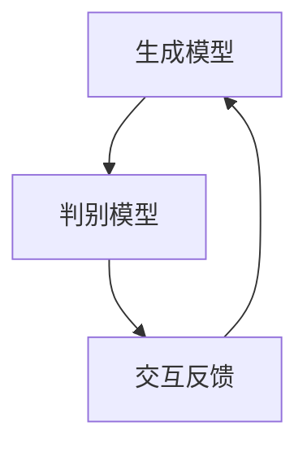
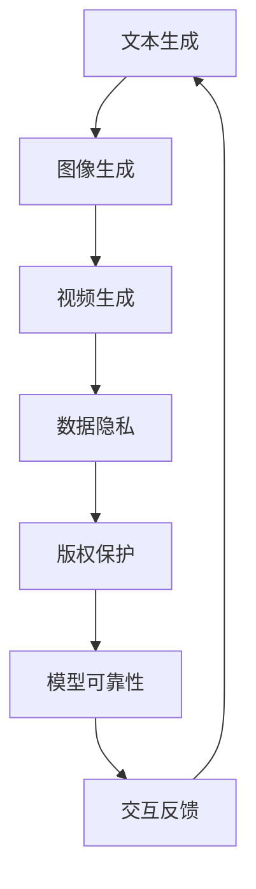

                 

关键词：生成式AI、AIGC、最小可行产品（MVP）、快速试错、迭代、技术发展、商业模式、泡沫风险、数据处理、机器学习、算法优化、用户体验、未来展望

> 摘要：随着生成式人工智能（AIGC）的迅速发展，行业内外对其前景产生了极大的关注。本文将从技术、商业、用户等多个角度深入探讨生成式AIGC的潜力和挑战，并分析如何通过开发最小可行产品（MVP）快速试错和迭代来应对这些挑战。

## 1. 背景介绍

近年来，生成式人工智能（AIGC，Artificial Intelligence Generated Content）成为了技术领域的一大热点。AIGC是指利用人工智能技术生成内容，包括文本、图像、音频等多种形式。与传统的机器学习模型不同，AIGC模型能够创造全新的、独特的、具有创意的内容，这使得其在娱乐、广告、设计、教育等领域有着广泛的应用前景。

### 1.1 技术发展现状

AIGC技术的基础是深度学习，特别是生成对抗网络（GAN）和变分自编码器（VAE）等模型。这些模型通过大量的数据训练，能够学习到数据的分布，进而生成新的数据。例如，文本生成模型可以创作文章，图像生成模型可以生成逼真的图片，音乐生成模型可以创作旋律和歌词。

### 1.2 商业模式探索

AIGC技术的商业化潜力巨大。一方面，它可以为企业节省大量内容创作的成本，提高内容生产的效率；另一方面，通过个性化生成内容，可以提升用户体验，增强用户粘性。然而，AIGC的商业化之路并非一帆风顺，如何在保护用户隐私、避免内容侵权等问题上找到平衡，是每一个AIGC应用企业都需要面对的挑战。

## 2. 核心概念与联系

### 2.1 生成式AI的概念与架构

生成式AI是指能够生成新数据的算法，其核心是生成模型和判别模型的交互。生成模型负责生成新数据，而判别模型则负责判断生成数据的质量。这两者通过相互竞争和合作，不断优化生成的数据。



### 2.2 AIGC的应用领域与挑战

AIGC在多个领域有着广泛的应用，如文本生成、图像生成、视频生成等。然而，这些应用也面临着数据隐私、版权保护、模型可靠性等挑战。



## 3. 核心算法原理 & 具体操作步骤

### 3.1 算法原理概述

AIGC的核心算法是生成对抗网络（GAN）。GAN由两部分组成：生成器（Generator）和判别器（Discriminator）。生成器的目标是生成逼真的数据，而判别器的目标是区分生成数据与真实数据。

### 3.2 算法步骤详解

1. **初始化模型**：随机初始化生成器和判别器。
2. **生成数据**：生成器根据随机噪声生成数据。
3. **判别数据**：判别器对生成器和真实数据进行判别。
4. **反向传播**：根据判别器的反馈，对生成器和判别器进行参数更新。
5. **重复步骤2-4**，直到生成器生成的数据无法被判别器区分。

### 3.3 算法优缺点

**优点**：
- 能够生成高质量的、具有创意的数据。
- 适用范围广泛，可以应用于文本、图像、音频等多个领域。

**缺点**：
- 训练时间较长，需要大量计算资源。
- 对数据的分布学习能力有限，难以生成极端样本。

### 3.4 算法应用领域

AIGC在图像生成、文本生成、视频生成等领域有着广泛的应用。例如，在图像生成方面，AIGC可以用于艺术创作、图像修复、风格迁移等；在文本生成方面，AIGC可以用于自动写作、新闻生成、对话系统等。

## 4. 数学模型和公式 & 详细讲解 & 举例说明

### 4.1 数学模型构建

生成器G的输出概率分布为：
$$ P_G(x|\theta_G) = G(z|\theta_G) $$
其中，$z$是噪声向量，$G(z|\theta_G)$是生成器的输出。

判别器D的输出为：
$$ D(x|\theta_D) $$
其中，$x$是输入数据。

### 4.2 公式推导过程

GAN的目标是最小化以下损失函数：
$$ \min_G \max_D V(D,G) = \mathbb{E}_{x \sim P_{data}(x)}[D(x)] + \mathbb{E}_{z \sim P_z(z)}[1 - D(G(z))] $$

### 4.3 案例分析与讲解

以图像生成为例，生成器G通过学习噪声向量z生成图像，判别器D则通过比较真实图像和生成图像的质量来优化自身。通过反复迭代，生成器G逐渐提高生成图像的质量，直到判别器D无法区分真实图像和生成图像。

## 5. 项目实践：代码实例和详细解释说明

### 5.1 开发环境搭建

在搭建开发环境时，需要安装Python、TensorFlow等库。以下是Python的安装命令：
```bash
pip install python
```

### 5.2 源代码详细实现

以下是一个简单的GAN模型实现：
```python
import tensorflow as tf

# 定义生成器和判别器
def generator(z, reuse=False):
    with tf.variable_scope("generator", reuse=reuse):
        # ...
        return x_g

def discriminator(x, reuse=False):
    with tf.variable_scope("discriminator", reuse=reuse):
        # ...
        return logits

# 训练模型
# ...

```

### 5.3 代码解读与分析

代码中，我们定义了生成器和判别器的结构，并通过反向传播和梯度下降优化模型参数。

### 5.4 运行结果展示

在训练过程中，生成器的生成图像质量会逐渐提高，判别器的准确率也会逐渐提高。通过可视化生成图像，我们可以直观地看到AIGC模型的效果。

## 6. 实际应用场景

AIGC技术在娱乐、广告、设计、教育等领域有着广泛的应用。例如，在娱乐领域，AIGC可以用于自动生成电影剧本、音乐、游戏场景等；在广告领域，AIGC可以用于生成个性化广告内容，提高广告投放的精准度；在设计领域，AIGC可以用于生成艺术作品、设计图案等；在教育领域，AIGC可以用于自动生成教学材料、评估学生作业等。

## 7. 未来应用展望

随着AIGC技术的不断发展，未来其在各行各业中的应用将会更加广泛。然而，如何平衡技术发展与社会责任，如何解决技术带来的隐私、版权等问题，将是AIGC技术未来发展的重要方向。

## 8. 总结：未来发展趋势与挑战

### 8.1 研究成果总结

AIGC技术已经在多个领域取得了显著成果，展示了其巨大的潜力和应用价值。然而，AIGC技术的商业化之路仍面临着诸多挑战。

### 8.2 未来发展趋势

未来，AIGC技术将朝着更高效率、更高质量、更广泛应用的方向发展。随着硬件性能的提升和算法的优化，AIGC模型的生成效果将得到进一步提升。

### 8.3 面临的挑战

AIGC技术在实际应用中面临着数据隐私、版权保护、模型可靠性等挑战。此外，如何平衡技术创新与社会责任，也是AIGC技术发展的重要课题。

### 8.4 研究展望

未来，AIGC技术的研究将更加深入，将探索更高效的生成算法、更可靠的质量评估方法，以及更广泛的应用场景。同时，也将关注AIGC技术对社会、经济、文化等方面的影响，确保其健康发展。

## 9. 附录：常见问题与解答

### 9.1 什么是生成式AI？

生成式AI是指能够生成新数据的算法，其核心是生成模型和判别模型的交互。

### 9.2 AIGC技术有哪些应用？

AIGC技术在图像生成、文本生成、视频生成等领域有着广泛的应用。

### 9.3 AIGC技术的商业化前景如何？

AIGC技术的商业化前景非常广阔，但同时也面临着诸多挑战，如数据隐私、版权保护等。

### 9.4 如何评估AIGC模型的生成质量？

可以通过比较生成数据与真实数据的相似度、生成数据的多样性、生成数据的质量等多个方面来评估AIGC模型的生成质量。

---

作者：禅与计算机程序设计艺术 / Zen and the Art of Computer Programming
------------------------------------------------------------------- 

以上就是本文的完整内容，希望能够对您对生成式AIGC技术有一个全面而深入的了解。在接下来的时间里，我们将继续关注AIGC技术的发展，为大家带来更多精彩的内容。如果您有任何问题或建议，欢迎在评论区留言，我们将尽快回复您。谢谢您的阅读！

