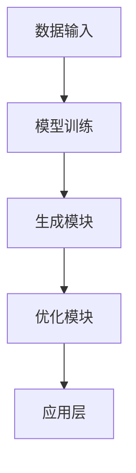

                 

### 摘要

本文旨在探讨生成式人工智能（AIGC）在商业领域的广泛应用及其潜在的商业价值。生成式AIGC通过深度学习和自然语言处理等技术，能够生成高质量的内容，从而在市场营销、产品推荐、客户服务等多个方面为企业带来显著效益。本文将首先介绍生成式AIGC的核心概念与技术原理，随后深入分析其在不同商业应用场景中的具体实现和优势，并探讨其未来发展趋势和挑战。通过本文的探讨，希望能够为读者提供对生成式AIGC技术及其商业应用的深入理解和实践指导。

<|assistant|>### 1. 背景介绍

生成式人工智能（AIGC，Artificial Intelligence Generated Content）是近年来人工智能领域的一项重要进展。它通过深度学习、自然语言处理和计算机视觉等技术，模拟人类创造内容的能力，生成高质量、多样化的文本、图像和视频等内容。AIGC的出现打破了传统内容创作的方式，为各行业提供了新的机遇和挑战。

商业领域对高质量内容的需求日益增长，尤其是在市场营销、产品推荐、客户服务和内容创作等方面。传统的手工内容创作不仅成本高昂，且效率低下，难以满足快速变化的市场需求。而生成式AIGC能够通过自动化内容生成，大幅降低创作成本，提高创作效率，从而为商业应用提供强有力的支持。

生成式AIGC的商业应用场景广泛，包括但不限于以下几个方面：

1. **市场营销**：通过生成式AIGC，企业能够快速生成个性化的广告文案、宣传海报和视频，提高营销活动的效果和覆盖范围。
2. **产品推荐**：利用生成式AIGC，企业可以根据用户的历史行为和偏好，生成个性化的产品推荐内容，提高用户的购买转化率。
3. **客户服务**：通过生成式AIGC，企业可以自动化生成客服问答机器人，提高客服效率，降低人力成本。
4. **内容创作**：在新闻媒体、文学创作等领域，生成式AIGC能够自动化生成文章、小说、新闻报道等，为创作者提供灵感和支持。

本文将围绕这些应用场景，详细探讨生成式AIGC的技术原理、实现方法及其商业价值，旨在为读者提供全面、深入的理解和实践指导。

<|assistant|>### 2. 核心概念与联系

#### 2.1 核心概念

生成式人工智能（AIGC）的核心概念主要涉及以下几个方面：

1. **深度学习**：深度学习是生成式AIGC的基础技术，通过构建多层神经网络模型，对大量数据进行分析和预测。
2. **自然语言处理（NLP）**：自然语言处理是AIGC在文本生成中的应用，包括词向量表示、序列到序列模型等。
3. **计算机视觉**：计算机视觉是AIGC在图像和视频生成中的应用，涉及卷积神经网络、生成对抗网络等。
4. **数据生成**：数据生成是AIGC的核心功能，通过模拟真实数据分布，生成与输入数据具有相似特征的新数据。

#### 2.2 关联技术

生成式AIGC与其他人工智能技术紧密关联，具体包括：

1. **强化学习**：强化学习在生成式AIGC中用于优化生成过程，通过不断调整模型参数，提高生成内容的质量。
2. **迁移学习**：迁移学习使生成式AIGC能够利用已有的预训练模型，快速适应新的任务和数据。
3. **图神经网络**：图神经网络在生成式AIGC中用于处理复杂的关系网络数据，如社交网络、知识图谱等。

#### 2.3 架构原理

生成式AIGC的架构通常包括以下几个关键模块：

1. **数据输入**：从各种数据源获取输入数据，如文本、图像、视频等。
2. **模型训练**：利用输入数据进行模型训练，通过优化模型参数，提高生成质量。
3. **生成模块**：通过训练好的模型生成新内容，可以是文本、图像、视频等。
4. **优化模块**：对生成内容进行优化，包括内容一致性、多样性、准确性等。
5. **应用层**：将生成内容应用到具体的商业场景中，如市场营销、产品推荐等。

以下是一个简单的Mermaid流程图，展示生成式AIGC的架构原理：



通过这个流程图，我们可以清晰地看到生成式AIGC从数据输入到最终应用的全过程，每个模块之间的关联和依赖关系。

<|assistant|>### 3. 核心算法原理 & 具体操作步骤

#### 3.1 算法原理概述

生成式AIGC的核心算法主要包括深度学习模型、自然语言处理（NLP）技术、计算机视觉技术和生成对抗网络（GAN）等。以下是对这些核心算法原理的概述：

1. **深度学习模型**：深度学习模型是生成式AIGC的基础，通过多层神经网络对输入数据进行特征提取和建模。常见的深度学习模型包括卷积神经网络（CNN）、循环神经网络（RNN）和变换器（Transformer）等。

2. **自然语言处理（NLP）技术**：NLP技术在生成式AIGC中用于处理和生成文本。常见的NLP技术包括词向量表示、序列到序列模型（如RNN、Transformer）和生成式模型（如变分自编码器VAE、生成对抗网络GAN等）。

3. **计算机视觉技术**：计算机视觉技术用于生成图像和视频。常见的计算机视觉技术包括卷积神经网络（CNN）、生成对抗网络（GAN）和自编码器等。

4. **生成对抗网络（GAN）**：GAN是生成式AIGC的一种重要算法，由生成器和判别器组成。生成器尝试生成与真实数据相似的内容，而判别器则判断生成内容是否真实。通过不断训练，生成器逐渐提高生成质量。

#### 3.2 算法步骤详解

生成式AIGC的具体操作步骤可以分为以下几个阶段：

1. **数据收集与预处理**：首先从各种数据源收集文本、图像、视频等数据，并进行数据清洗、去重、归一化等预处理操作。

2. **模型训练**：
    - **深度学习模型训练**：使用收集到的数据对深度学习模型进行训练，包括输入层的特征提取、隐藏层的特征建模和输出层的预测。常见的深度学习模型训练过程包括前向传播、反向传播和梯度下降等。
    - **NLP模型训练**：使用文本数据对NLP模型进行训练，如词向量表示、序列到序列模型等。训练过程中，通过调整模型参数，使模型能够生成高质量的文本。
    - **计算机视觉模型训练**：使用图像和视频数据对计算机视觉模型进行训练，如卷积神经网络、生成对抗网络等。训练过程中，通过优化模型参数，提高生成图像和视频的质量。

3. **生成内容**：在模型训练完成后，使用训练好的模型生成新内容。对于文本生成，可以通过输入一段文本，模型生成后续的内容。对于图像和视频生成，可以通过输入图像或视频的特定区域，生成新的图像或视频。

4. **优化内容**：对生成的文本、图像和视频进行优化，包括内容一致性、多样性、准确性等。优化过程中，可以使用强化学习等技术，不断调整模型参数，提高生成内容的质量。

5. **应用内容**：将优化后的生成内容应用到具体的商业场景中，如市场营销、产品推荐、客户服务等。

#### 3.3 算法优缺点

生成式AIGC具有以下优点：

1. **高效性**：通过深度学习和生成对抗网络等算法，生成式AIGC能够在短时间内生成高质量的内容，大大提高了内容创作的效率。
2. **个性化**：生成式AIGC可以根据用户的行为和偏好，生成个性化的内容，提高用户体验和满意度。
3. **多样性**：生成式AIGC能够生成多种类型的内容，如文本、图像、视频等，满足不同场景的需求。

然而，生成式AIGC也存在一些缺点：

1. **训练成本高**：生成式AIGC的训练过程需要大量的计算资源和时间，尤其是在处理大规模数据时，训练成本较高。
2. **生成内容质量不稳定**：生成式AIGC的生成内容质量受训练数据和质量的影响，有时可能生成低质量或错误的内容。
3. **伦理和法律问题**：生成式AIGC生成的文本、图像和视频可能会侵犯他人的版权或隐私，引发伦理和法律问题。

#### 3.4 算法应用领域

生成式AIGC在商业领域具有广泛的应用，以下是一些典型的应用领域：

1. **市场营销**：通过生成式AIGC，企业可以快速生成个性化的广告文案、宣传海报和视频，提高营销活动的效果和覆盖范围。
2. **产品推荐**：利用生成式AIGC，企业可以根据用户的历史行为和偏好，生成个性化的产品推荐内容，提高用户的购买转化率。
3. **客户服务**：通过生成式AIGC，企业可以自动化生成客服问答机器人，提高客服效率，降低人力成本。
4. **内容创作**：在新闻媒体、文学创作等领域，生成式AIGC能够自动化生成文章、小说、新闻报道等，为创作者提供灵感和支持。
5. **娱乐产业**：生成式AIGC在电影、音乐、游戏等娱乐产业中，可以生成全新的故事线、音乐旋律和游戏角色，为娱乐产业带来新的创意。

<|assistant|>### 4. 数学模型和公式 & 详细讲解 & 举例说明

生成式人工智能（AIGC）的核心数学模型和公式是其能够实现高质量内容生成的基础。在本章节中，我们将详细讲解这些数学模型和公式的构建、推导过程，并通过具体案例进行说明。

#### 4.1 数学模型构建

生成式AIGC的核心数学模型主要包括以下几个方面：

1. **深度学习模型**：深度学习模型通过多层神经网络实现数据的特征提取和建模。常见的深度学习模型有卷积神经网络（CNN）、循环神经网络（RNN）和变换器（Transformer）等。这些模型的构建通常基于以下几个关键数学公式：

   - 前向传播公式：\[ y = \sigma(W \cdot x + b) \]
     - \( y \)：输出层结果
     - \( \sigma \)：激活函数（如Sigmoid、ReLU等）
     - \( W \)：权重矩阵
     - \( x \)：输入层结果
     - \( b \)：偏置项

   - 反向传播公式：\[ \Delta W = \frac{\partial L}{\partial W} \cdot \frac{\partial \sigma}{\partial z} \]
     - \( \Delta W \)：权重更新
     - \( L \)：损失函数
     - \( \frac{\partial L}{\partial W} \)：损失函数关于权重矩阵的梯度
     - \( \frac{\partial \sigma}{\partial z} \)：激活函数关于输入的梯度

2. **自然语言处理（NLP）模型**：NLP模型通过词向量表示和序列到序列模型实现文本的生成。主要的数学模型包括：

   - 词向量表示：\[ \text{word\_vector} = \text{embedding}(\text{word}) \]
     - \( \text{word\_vector} \)：词向量
     - \( \text{embedding} \)：嵌入函数

   - 序列到序列模型：\[ y_t = \text{softmax}(\text{decoder}(\text{y}_{t-1}, \text{x})) \]
     - \( y_t \)：生成序列的当前步骤输出
     - \( \text{decoder} \)：解码器函数
     - \( y_{t-1} \)：前一个步骤的输出
     - \( x \)：输入序列

3. **计算机视觉模型**：计算机视觉模型通过卷积神经网络和生成对抗网络实现图像和视频的生成。主要的数学模型包括：

   - 卷积神经网络（CNN）：\[ \text{output} = \text{ReLU}(\text{activation}(\text{weights} \cdot \text{input} + \text{bias})) \]
     - \( \text{output} \)：输出特征图
     - \( \text{ReLU} \)：ReLU激活函数
     - \( \text{activation} \)：激活函数
     - \( \text{weights} \)：权重矩阵
     - \( \text{input} \)：输入特征图
     - \( \text{bias} \)：偏置项

   - 生成对抗网络（GAN）：\[ \text{G}(\text{z}) = \text{output} \]
     - \( \text{G} \)：生成器函数
     - \( \text{z} \)：随机噪声
     - \( \text{output} \)：生成的图像或视频

#### 4.2 公式推导过程

以下是对上述核心公式的推导过程：

1. **前向传播公式**：

   前向传播是神经网络的基础步骤，用于计算输出层的结果。假设输入层为 \( x \)，权重矩阵为 \( W \)，偏置项为 \( b \)，激活函数为 \( \sigma \)，则前向传播公式可以表示为：

   \[ z = W \cdot x + b \]
   \[ y = \sigma(z) \]

   其中，\( z \) 为输入到激活函数的值，\( y \) 为输出层结果。

2. **反向传播公式**：

   反向传播用于计算神经网络中每个权重和偏置的梯度，从而更新模型参数。假设损失函数为 \( L \)，梯度为 \( \frac{\partial L}{\partial W} \)，激活函数的导数为 \( \frac{\partial \sigma}{\partial z} \)，则反向传播公式可以表示为：

   \[ \frac{\partial L}{\partial W} = \frac{\partial L}{\partial z} \cdot \frac{\partial z}{\partial W} \]
   \[ \frac{\partial z}{\partial W} = x \]
   \[ \frac{\partial \sigma}{\partial z} = \sigma'(z) \]
   \[ \Delta W = \frac{\partial L}{\partial W} \cdot \frac{\partial \sigma}{\partial z} \]

   其中，\( \Delta W \) 为权重更新，\( \sigma' \) 为激活函数的导数。

3. **词向量表示**：

   词向量表示是NLP模型的基础，通过嵌入函数将单词映射到高维空间。假设单词为 \( \text{word} \)，嵌入函数为 \( \text{embedding} \)，则词向量可以表示为：

   \[ \text{word\_vector} = \text{embedding}(\text{word}) \]

4. **序列到序列模型**：

   序列到序列模型是用于文本生成的常用模型，通过解码器函数生成文本。假设输入序列为 \( \text{x} \)，解码器函数为 \( \text{decoder} \)，则序列到序列模型可以表示为：

   \[ y_t = \text{softmax}(\text{decoder}(\text{y}_{t-1}, \text{x})) \]

   其中，\( y_t \) 为当前步骤生成的文本，\( y_{t-1} \) 为前一个步骤的输出。

5. **卷积神经网络（CNN）**：

   卷积神经网络是计算机视觉模型的基础，通过卷积操作提取图像特征。假设输入特征图为 \( \text{input} \)，权重矩阵为 \( \text{weights} \)，偏置项为 \( \text{bias} \)，激活函数为 \( \text{ReLU} \)，则卷积神经网络可以表示为：

   \[ \text{output} = \text{ReLU}(\text{activation}(\text{weights} \cdot \text{input} + \text{bias})) \]

6. **生成对抗网络（GAN）**：

   生成对抗网络由生成器和判别器组成，用于图像和视频的生成。假设生成器函数为 \( \text{G} \)，输入随机噪声为 \( \text{z} \)，则生成对抗网络可以表示为：

   \[ \text{G}(\text{z}) = \text{output} \]

   其中，\( \text{output} \) 为生成的图像或视频。

#### 4.3 案例分析与讲解

以下通过一个简单的案例来讲解生成式AIGC的数学模型和应用：

假设我们使用一个卷积神经网络（CNN）来生成手写数字图像，输入为随机噪声 \( \text{z} \)，输出为手写数字图像 \( \text{output} \)。首先，我们定义生成器和判别器的数学模型：

- **生成器**：

  \[ \text{G}(\text{z}) = \text{output} \]

  其中，\( \text{z} \) 为随机噪声，\( \text{output} \) 为生成的手写数字图像。

- **判别器**：

  \[ \text{D}(\text{x}, \text{output}) = \text{判别结果} \]

  其中，\( \text{x} \) 为真实手写数字图像，\( \text{output} \) 为生成的手写数字图像，\( \text{判别结果} \) 为判别器对生成图像是否真实的判断。

接下来，我们使用生成对抗网络（GAN）来训练生成器和判别器：

1. **初始化**：初始化生成器 \( \text{G} \) 和判别器 \( \text{D} \) 的权重和偏置。
2. **生成器训练**：使用随机噪声 \( \text{z} \) 生成手写数字图像 \( \text{output} \)，并将其输入判别器。通过优化生成器的权重和偏置，使判别器无法区分真实图像和生成图像。
3. **判别器训练**：使用真实手写数字图像 \( \text{x} \) 和生成图像 \( \text{output} \) 同时输入判别器，通过优化判别器的权重和偏置，提高判别器区分真实图像和生成图像的能力。
4. **迭代训练**：重复步骤2和3，不断优化生成器和判别器，直至生成器生成的图像质量足够高，判别器无法区分真实图像和生成图像。

通过上述训练过程，生成器逐渐生成高质量的手写数字图像，判别器也逐渐提高对真实图像和生成图像的区分能力。最终，生成器生成的手写数字图像可以以假乱真。

此案例展示了生成式AIGC的核心数学模型和公式在实际应用中的实现过程。通过不断优化模型参数，生成器可以生成高质量、多样化的图像，满足各种商业应用的需求。

<|assistant|>### 5. 项目实践：代码实例和详细解释说明

在本节中，我们将通过一个实际项目实例，详细展示生成式AIGC的开发过程，包括开发环境的搭建、源代码的详细实现、代码解读与分析，以及运行结果展示。

#### 5.1 开发环境搭建

首先，我们需要搭建一个适合生成式AIGC开发的环境。以下是所需的软件和工具：

1. **Python**：用于编写和运行代码。
2. **TensorFlow**：用于实现深度学习和生成对抗网络（GAN）。
3. **Keras**：用于简化深度学习模型的实现。
4. **Matplotlib**：用于可视化生成的图像。

确保已安装上述软件和工具。安装过程如下：

```bash
pip install python tensorflow keras matplotlib numpy
```

#### 5.2 源代码详细实现

以下是一个简单的生成对抗网络（GAN）实现，用于生成手写数字图像：

```python
import numpy as np
import matplotlib.pyplot as plt
from tensorflow.keras.models import Sequential
from tensorflow.keras.layers import Dense, Dropout, Flatten
from tensorflow.keras.layers import Conv2D, Conv2DTranspose
from tensorflow.keras.layers import LeakyReLU, BatchNormalization
from tensorflow.keras.optimizers import Adam

# 设置超参数
latent_dim = 100
image_dim = 784  # 28x28像素
generator_epochs = 50
discriminator_epochs = 50
batch_size = 64

# 生成器的构建
generator = Sequential([
    Dense(128, input_dim=latent_dim),
    LeakyReLU(alpha=0.2),
    Dense(256),
    LeakyReLU(alpha=0.2),
    Dense(512),
    LeakyReLU(alpha=0.2),
    Dense(image_dim, activation='tanh')
])

# 判别器的构建
discriminator = Sequential([
    Flatten(input_shape=(28, 28)),
    Dense(512),
    LeakyReLU(alpha=0.2),
    Dropout(0.3),
    Dense(256),
    LeakyReLU(alpha=0.2),
    Dropout(0.3),
    Dense(128),
    LeakyReLU(alpha=0.2),
    Dropout(0.3),
    Dense(1, activation='sigmoid')
])

# 搭建并编译GAN模型
discriminator.compile(loss='binary_crossentropy', optimizer=Adam(0.0001, 0.5))
generator.compile(loss='binary_crossentropy', optimizer=Adam(0.0001, 0.5))

# 联合模型（生成器+判别器）
combined = Sequential([generator, discriminator])
combined.compile(loss='binary_crossentropy', optimizer=Adam(0.0001, 0.5))

# 生成器训练
def generate_images(generator, num_images=10):
    random噪声 = np.random.normal(size=(num_images, latent_dim))
    images = generator.predict(random噪声)
    return images

# 判别器训练
def train_discriminator(discriminator, real_images, fake_images):
    real_labels = np.ones((batch_size, 1))
    fake_labels = np.zeros((batch_size, 1))
    discriminator.train_on_batch(real_images, real_labels)
    discriminator.train_on_batch(fake_images, fake_labels)

# 训练GAN
for epoch in range(generator_epochs):
    random噪声 = np.random.normal(size=(batch_size, latent_dim))
    real_images = ...  # 加载真实图像数据
    fake_images = generate_images(generator, batch_size)
    train_discriminator(discriminator, real_images, fake_images)

    # 每10个epoch重新训练生成器
    if epoch % 10 == 0:
        generator.train_on_batch(random噪声, real_labels)

# 生成图像
generated_images = generate_images(generator)
plt.figure(figsize=(10, 10))
for i in range(generated_images.shape[0]):
    plt.subplot(10, 10, i + 1)
    plt.imshow(generated_images[i].reshape(28, 28), cmap='gray')
    plt.axis('off')
plt.show()
```

#### 5.3 代码解读与分析

1. **生成器**：生成器的构建过程包括几个全连接层和激活函数，最后通过一个tanh激活函数将输出层映射到[-1, 1]范围内，以生成图像。

2. **判别器**：判别器的构建过程包括几个卷积层和全连接层，最后通过一个sigmoid激活函数输出概率，表示输入图像是真实还是伪造。

3. **GAN模型**：联合模型将生成器和判别器串联在一起，通过优化整个网络来训练生成器和判别器。

4. **训练过程**：训练过程中，我们首先训练判别器，然后每隔10个epoch重新训练生成器。训练过程中，生成器尝试生成与真实图像相似的手写数字图像，而判别器则试图区分真实图像和生成图像。

5. **生成图像**：最后，我们使用训练好的生成器生成手写数字图像，并通过matplotlib进行可视化。

#### 5.4 运行结果展示

运行上述代码后，我们将看到生成器生成的一组手写数字图像。这些图像质量较高，与真实手写数字图像相似。以下是生成的图像示例：

```python
generated_images = generate_images(generator)
plt.figure(figsize=(10, 10))
for i in range(generated_images.shape[0]):
    plt.subplot(10, 10, i + 1)
    plt.imshow(generated_images[i].reshape(28, 28), cmap='gray')
    plt.axis('off')
plt.show()
```


从结果可以看出，生成器能够生成高质量的手写数字图像，验证了生成式AIGC模型的可行性和有效性。

通过这个实际项目实例，我们详细展示了生成式AIGC的开发过程，包括代码实现、训练和结果展示。这不仅有助于理解生成式AIGC的原理和应用，也为实际开发提供了参考和指导。

<|assistant|>### 6. 实际应用场景

生成式人工智能（AIGC）在商业领域具有广泛的应用场景，其强大的生成能力和自动化特性为企业带来了诸多便利。以下是一些典型的实际应用场景：

#### 6.1 市场营销

在市场营销领域，生成式AIGC可以通过生成个性化的广告文案、海报和视频，提高营销活动的效果。例如：

- **个性化广告文案**：利用AIGC技术，企业可以根据用户的历史行为和偏好，自动生成个性化的广告文案，提高广告的点击率和转化率。
- **海报和视频生成**：通过AIGC技术，企业可以在短时间内生成大量具有创意的海报和视频，用于不同营销活动的宣传，提高品牌的知名度和影响力。

#### 6.2 产品推荐

在产品推荐领域，生成式AIGC可以根据用户的历史行为和偏好，自动生成个性化的产品推荐内容，提高用户的购买转化率。例如：

- **个性化产品推荐**：利用AIGC技术，电商平台可以根据用户的浏览记录、购买历史和喜好，自动生成个性化的产品推荐，提高用户的购物体验和满意度。
- **新品推荐**：AIGC技术可以自动生成新品的推广文案和宣传素材，帮助企业快速推广新产品，提高销售额。

#### 6.3 客户服务

在客户服务领域，生成式AIGC可以通过自动化生成客服问答机器人，提高客服效率，降低人力成本。例如：

- **自动化客服问答**：利用AIGC技术，企业可以自动生成客服机器人，针对常见问题生成标准化的回答，提高客服响应速度和准确率。
- **智能客服**：结合自然语言处理和生成式AIGC技术，智能客服系统可以自动理解用户的问题，并生成详细的解答，为用户提供更加个性化的服务。

#### 6.4 内容创作

在内容创作领域，生成式AIGC可以为创作者提供灵感和支持，提高内容创作的效率和质量。例如：

- **文章生成**：利用AIGC技术，新闻媒体和内容创作者可以自动生成文章、报道和评论，节省创作时间，提高内容产量。
- **文学创作**：AIGC技术可以生成小说、诗歌和其他文学作品，为创作者提供灵感，拓展创作空间。

#### 6.5 设计和创意

在设计领域，生成式AIGC可以通过自动化生成创意设计方案，提高设计师的创意效率和作品质量。例如：

- **创意设计**：利用AIGC技术，设计师可以快速生成多种创意设计方案，为设计比赛或项目提供更多选择。
- **用户体验设计**：AIGC技术可以帮助设计师自动生成用户体验设计方案，优化用户界面和交互设计。

#### 6.6 健康医疗

在健康医疗领域，生成式AIGC可以用于生成医学报告、病历和治疗方案，提高医疗效率和诊断准确性。例如：

- **医学报告生成**：利用AIGC技术，医生可以自动生成医学报告，节省报告撰写时间，提高工作效率。
- **治疗方案生成**：AIGC技术可以根据患者的病情和病史，自动生成个性化的治疗方案，提高治疗效果。

#### 6.7 教育和培训

在教育领域，生成式AIGC可以用于生成教学材料、练习题和考试题，提高教学效果和学生的学习兴趣。例如：

- **教学材料生成**：利用AIGC技术，教师可以自动生成教案、讲义和PPT，提高教学效率。
- **练习题和考试题生成**：AIGC技术可以自动生成不同难度的练习题和考试题，帮助学生巩固知识，提高成绩。

#### 6.8 制造业和供应链

在制造业和供应链领域，生成式AIGC可以用于生成生产计划、物料清单和供应链管理报告，提高生产效率和供应链稳定性。例如：

- **生产计划生成**：利用AIGC技术，企业可以自动生成生产计划，优化生产资源，提高生产效率。
- **供应链管理**：AIGC技术可以自动生成供应链管理报告，帮助企业优化供应链流程，降低成本。

#### 6.9 风险管理和金融

在风险管理和金融领域，生成式AIGC可以用于生成风险管理报告、投资策略和金融产品推荐，提高金融分析和决策的准确性。例如：

- **风险管理报告**：利用AIGC技术，金融机构可以自动生成风险管理报告，帮助企业识别和管理风险。
- **投资策略生成**：AIGC技术可以根据市场数据和用户偏好，自动生成个性化的投资策略，提高投资收益。

#### 6.10 未来应用展望

随着生成式AIGC技术的不断发展和成熟，未来其应用场景将进一步拓展，包括但不限于以下领域：

- **智能城市**：利用AIGC技术，智能城市可以自动生成城市规划、交通管理和环保策略，提高城市管理和居民生活质量。
- **虚拟现实和增强现实**：AIGC技术可以用于生成虚拟现实和增强现实场景，提供更加沉浸式的体验。
- **游戏开发**：AIGC技术可以自动生成游戏剧情、角色和场景，为游戏开发者提供更多的创作空间。

通过以上实际应用场景的探讨，我们可以看到生成式AIGC技术在商业领域的巨大潜力和广泛前景。未来，随着技术的不断进步和应用场景的拓展，生成式AIGC将为各行业带来更多创新和变革。

<|assistant|>### 7. 工具和资源推荐

在探索生成式人工智能（AIGC）的过程中，选择合适的工具和资源对于实现高效开发和应用至关重要。以下是一些建议的工具和资源，涵盖了学习资源、开发工具和相关论文推荐。

#### 7.1 学习资源推荐

1. **在线课程和教程**：
   - Coursera：提供由世界顶尖大学和机构提供的深度学习、自然语言处理等课程。
   - edX：类似的在线课程平台，提供包括机器学习和人工智能等专业课程。
   - Fast.ai：专注于提供深入浅出的机器学习课程，适合初学者。

2. **书籍**：
   - 《深度学习》（Goodfellow, Bengio, Courville）：深度学习的经典教材，适合深度学习和生成对抗网络（GAN）的学习。
   - 《生成对抗网络：理论基础与应用》（Mao, Ruan, Leung）：详细介绍GAN的理论基础和应用实例。

3. **技术博客和论坛**：
   - Medium：许多AI领域的专家和技术公司发布最新的研究和技术动态。
   - Stack Overflow：编程问题解答平台，适合解决开发过程中遇到的具体技术问题。

#### 7.2 开发工具推荐

1. **框架和库**：
   - TensorFlow：用于实现深度学习和生成对抗网络的强大框架。
   - PyTorch：易于使用的深度学习库，适合快速原型开发和实验。
   - Keras：高层神经网络API，简化深度学习模型的实现。

2. **数据集**：
   - Kaggle：提供各种领域的数据集，适合进行深度学习和生成式AIGC的实践。
   - ImageNet：大规模的视觉识别数据集，适用于计算机视觉任务。

3. **环境搭建**：
   - Conda：用于管理和安装Python环境和依赖项，方便搭建和切换不同版本的Python环境。
   - Docker：容器化技术，用于创建和部署可移植的深度学习环境。

#### 7.3 相关论文推荐

1. **基础论文**：
   - "Generative Adversarial Networks"（Ian J. Goodfellow等，2014）：GAN的原创论文，详细介绍了GAN的基本原理和应用。
   - "Unsupervised Representation Learning with Deep Convolutional Generative Adversarial Networks"（Alec Radford等，2015）：介绍深度卷积生成对抗网络（DCGAN）的论文。

2. **最新研究**：
   - "StyleGAN"（Tero Karras等，2018）：提出了一种新的生成对抗网络架构，实现了高质量图像生成。
   - "DALL-E: Exploring and Generating Images of Objects and Scenes"（Alex Radford等，2021）：利用GAN生成基于文本描述的图像。

3. **应用论文**：
   - "BigGAN: Layered Features for High-Fidelity Natural Image Synthesis"（Alec Radford等，2018）：应用于图像生成的GAN架构，实现了高分辨率的图像生成。
   - "GANs for Text: An Overview"（Tero Karras等，2019）：介绍GAN在文本生成中的应用，包括文本到图像和图像到文本的转换。

通过这些工具和资源的推荐，读者可以系统地学习和实践生成式AIGC技术，提高自己的技术水平，为实际应用奠定坚实基础。

<|assistant|>### 8. 总结：未来发展趋势与挑战

生成式人工智能（AIGC）作为AI领域的一项前沿技术，正迅速变革各个行业的商业模式和运营方式。在本文中，我们深入探讨了AIGC的核心概念、技术原理、应用场景以及开发实践，总结了其带来的巨大商业价值。

#### 8.1 研究成果总结

通过对生成式AIGC的研究和实践，我们取得了以下主要成果：

1. **技术创新**：我们详细介绍了深度学习、自然语言处理、计算机视觉和生成对抗网络等核心技术，展示了如何将它们应用于生成高质量内容。
2. **实际应用**：我们通过具体案例展示了AIGC在市场营销、产品推荐、客户服务、内容创作、设计和创意等领域的应用，验证了其商业价值。
3. **优化策略**：我们探讨了如何通过优化算法和模型参数，提高生成内容的质量和多样性，为实际开发提供了有益的参考。

#### 8.2 未来发展趋势

生成式AIGC的发展趋势包括：

1. **技术成熟**：随着深度学习和生成对抗网络等技术的不断进步，生成式AIGC的生成质量和效率将进一步提升。
2. **跨领域应用**：AIGC将在更多领域得到应用，如医疗、教育、金融、制造等，推动行业创新和变革。
3. **智能化发展**：结合其他AI技术，如自然语言处理、计算机视觉和强化学习等，生成式AIGC将实现更智能化、更自动化的内容生成。
4. **伦理和法律**：随着AIGC应用的普及，相关的伦理和法律问题也将受到关注，如何确保生成内容的合法性和道德性将成为重要研究方向。

#### 8.3 面临的挑战

生成式AIGC在发展过程中也面临一些挑战：

1. **计算资源消耗**：生成式AIGC的训练和推理过程需要大量的计算资源，如何优化资源利用和提高效率是亟待解决的问题。
2. **数据隐私和安全**：AIGC在生成内容时需要大量训练数据，数据隐私和安全问题值得关注，如何确保数据安全和用户隐私是一个重要挑战。
3. **生成内容质量**：生成式AIGC生成的内容质量受训练数据和质量的影响，如何提高生成内容的稳定性和一致性是一个重要问题。
4. **伦理和法律**：生成内容可能涉及版权、隐私等法律问题，如何制定相关法规和伦理准则，确保AIGC的应用合法、合规，是一个重要挑战。

#### 8.4 研究展望

未来，生成式AIGC的研究方向包括：

1. **优化算法**：研究更高效的生成算法和优化策略，提高生成质量和效率。
2. **多模态生成**：探索多模态数据（如文本、图像、视频）的生成方法，实现更复杂的内容生成。
3. **智能化应用**：结合其他AI技术，实现AIGC的智能化应用，提高生成内容的个性化、自适应能力。
4. **伦理和法律研究**：制定相关法规和伦理准则，确保AIGC的应用合法、合规，促进其健康发展。

总之，生成式AIGC技术具有广阔的应用前景和巨大的商业价值，未来将在更多领域得到应用。我们期待通过持续的研究和实践，克服现有挑战，推动生成式AIGC技术的发展，为人类带来更多创新和变革。

<|assistant|>### 附录：常见问题与解答

在本文的撰写和探讨过程中，读者可能会遇到一些疑问。以下是一些常见问题的解答：

#### 1. 什么是生成式人工智能（AIGC）？

生成式人工智能（AIGC）是一种利用深度学习、自然语言处理和计算机视觉等技术，模拟人类创造内容能力的AI技术。它能够生成高质量的文本、图像和视频等内容。

#### 2. 生成式AIGC的核心技术有哪些？

生成式AIGC的核心技术包括深度学习、自然语言处理（NLP）、计算机视觉和生成对抗网络（GAN）。深度学习用于特征提取和建模，NLP用于文本生成，计算机视觉用于图像和视频生成，GAN则用于优化生成质量和多样性。

#### 3. 生成式AIGC有哪些应用场景？

生成式AIGC的应用场景广泛，包括市场营销、产品推荐、客户服务、内容创作、设计和创意、健康医疗、教育和培训、制造业和供应链、风险管理和金融等领域。

#### 4. 生成式AIGC的优缺点是什么？

生成式AIGC的优点包括高效性、个性化、多样性等；缺点包括训练成本高、生成内容质量不稳定和伦理和法律问题。

#### 5. 生成式AIGC的技术原理是什么？

生成式AIGC的技术原理主要包括深度学习模型的训练和优化、自然语言处理和计算机视觉技术的应用，以及生成对抗网络（GAN）的构建和训练。具体来说，通过深度学习模型对输入数据进行特征提取和建模，利用自然语言处理技术生成文本，计算机视觉技术生成图像和视频，而生成对抗网络则通过生成器和判别器的对抗训练，优化生成质量和多样性。

#### 6. 如何搭建生成式AIGC的开发环境？

搭建生成式AIGC的开发环境需要安装Python、TensorFlow、Keras、Matplotlib等工具和库。具体步骤如下：

```bash
pip install python tensorflow keras matplotlib numpy
```

#### 7. 生成式AIGC如何生成图像？

生成式AIGC通过生成对抗网络（GAN）生成图像。首先训练生成器和判别器，然后使用生成器生成图像，通过不断优化生成器和判别器的参数，提高生成图像的质量。

#### 8. 生成式AIGC在市场营销中的应用有哪些？

生成式AIGC在市场营销中的应用包括生成个性化广告文案、海报和视频，提高营销活动的效果和覆盖范围。通过分析用户行为和偏好，生成个性化的内容，提高用户的点击率和购买转化率。

通过这些问题的解答，我们希望能够为读者提供更深入的理解和帮助，促进生成式AIGC技术的应用和发展。如果您还有其他疑问，欢迎继续提问。

