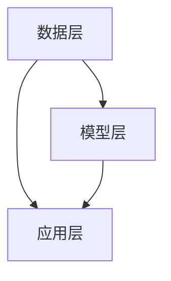

                 

关键词：生成式AI、商业智能、AIGC、未来趋势、算法原理、数学模型、实践案例

> 摘要：随着人工智能技术的不断进步，生成式AI（AIGC）正逐步成为商业智能领域的新前沿。本文将从生成式AI的概念入手，深入探讨其在商业智能中的应用，分析其数学模型、算法原理，并通过实际案例，展示其如何改变商业智能的发展方向。最后，我们对AIGC的未来发展趋势与挑战进行展望。

## 1. 背景介绍

商业智能（BI）是一种利用技术手段分析数据、发现趋势并支持决策的过程。随着大数据、云计算和人工智能等技术的快速发展，商业智能已经从传统的数据报表、仪表盘等简单的数据分析工具，逐步演变成一个复杂且高度智能化的领域。

在过去的几十年里，商业智能的应用主要集中在企业内部的数据分析、报告生成等方面。然而，随着数据量的爆炸性增长和数据来源的多样化，传统的商业智能方法已经难以满足企业对实时性、精准性和智能化分析的需求。这时，生成式AI（AIGC）的出现，为商业智能带来了新的机遇。

生成式AI是指通过学习大量数据，生成新的内容、模型或解决方案的人工智能技术。它包括生成对抗网络（GAN）、变分自编码器（VAE）、自注意力模型（Transformer）等。这些技术不仅能够在数据稀缺或标注困难的情况下，生成高质量的数据，还能够发现数据中的潜在模式和趋势，为企业提供更深入的洞见。

## 2. 核心概念与联系

### 2.1 生成式AI的概念

生成式AI的核心在于其能够生成新的数据或模型。具体来说，生成式AI通过学习大量数据，建立数据生成模型，然后利用这个模型生成新的数据。这个过程中，生成式AI利用了深度学习、概率模型、强化学习等多种技术。

### 2.2 生成式AI与商业智能的联系

生成式AI在商业智能中的应用主要体现在以下几个方面：

1. **数据增强**：通过生成式AI，可以在数据稀缺或标注困难的情况下，生成新的数据，从而丰富数据集，提高模型的训练效果。

2. **数据清洗与预处理**：生成式AI能够自动识别和纠正数据中的错误，提高数据的准确性。

3. **趋势预测与模式发现**：生成式AI可以分析大量数据，发现数据中的潜在趋势和模式，为企业提供更深入的洞见。

4. **个性化推荐**：生成式AI可以根据用户的历史行为和偏好，生成个性化的推荐结果，提高用户体验。

### 2.3 生成式AI在商业智能中的架构

生成式AI在商业智能中的应用架构通常包括以下几个层次：

1. **数据层**：这是生成式AI的基础，包括原始数据、清洗后的数据、增强后的数据等。

2. **模型层**：这是生成式AI的核心，包括生成模型、判别模型、预测模型等。

3. **应用层**：这是生成式AI的输出，包括数据增强、数据清洗、趋势预测、模式发现、个性化推荐等。

下面是一个简单的Mermaid流程图，展示了生成式AI在商业智能中的架构：



## 3. 核心算法原理 & 具体操作步骤

### 3.1 算法原理概述

生成式AI的核心算法主要包括生成对抗网络（GAN）、变分自编码器（VAE）和自注意力模型（Transformer）等。

1. **生成对抗网络（GAN）**：GAN由生成器和判别器两个神经网络组成。生成器负责生成数据，判别器负责判断生成数据是否真实。通过不断训练，生成器逐渐生成更真实的数据。

2. **变分自编码器（VAE）**：VAE是一种基于概率模型的生成模型，它通过编码器和解码器将数据映射到低维空间，然后从低维空间生成新的数据。

3. **自注意力模型（Transformer）**：Transformer是一种基于自注意力机制的序列模型，它能够高效地处理长序列数据，并在生成式AI中有着广泛的应用。

### 3.2 算法步骤详解

1. **数据准备**：首先，需要收集和准备用于训练的数据集。这些数据集可以是原始数据、清洗后的数据或增强后的数据。

2. **模型训练**：使用准备好的数据集，对生成器和判别器进行训练。在GAN中，生成器和判别器交替训练，通过不断调整模型参数，提高生成数据的真实性。

3. **数据生成**：在模型训练完成后，可以使用生成器生成新的数据。这些数据可以是用于训练的补充数据，也可以是用于预测的新数据。

4. **数据应用**：将生成的数据应用于商业智能的各个领域，如数据增强、数据清洗、趋势预测、模式发现和个性化推荐等。

### 3.3 算法优缺点

生成式AI在商业智能中的应用具有以下几个优点：

1. **数据增强**：在数据稀缺或标注困难的情况下，生成式AI能够生成新的数据，提高模型的训练效果。

2. **数据清洗**：生成式AI能够自动识别和纠正数据中的错误，提高数据的准确性。

3. **趋势预测与模式发现**：生成式AI能够分析大量数据，发现数据中的潜在趋势和模式，为企业提供更深入的洞见。

然而，生成式AI也存在一些挑战：

1. **模型复杂性**：生成式AI的模型通常比较复杂，训练过程需要大量时间和计算资源。

2. **数据质量**：生成式AI生成的数据质量受到原始数据质量的影响，如果原始数据存在错误或噪声，生成的数据也可能受到影响。

### 3.4 算法应用领域

生成式AI在商业智能中的应用非常广泛，包括但不限于以下几个方面：

1. **金融**：生成式AI可以用于金融数据的分析、预测和风险管理。

2. **医疗**：生成式AI可以用于医疗图像的分析、疾病预测和个性化治疗方案设计。

3. **零售**：生成式AI可以用于零售数据的市场预测、库存管理和个性化推荐。

4. **制造**：生成式AI可以用于制造业的生产计划、供应链管理和质量控制。

## 4. 数学模型和公式 & 详细讲解 & 举例说明

### 4.1 数学模型构建

生成式AI的数学模型主要包括生成模型、判别模型和联合模型等。

1. **生成模型**：生成模型是一种概率模型，用于生成新的数据。常见的生成模型包括生成对抗网络（GAN）和变分自编码器（VAE）。

2. **判别模型**：判别模型是一种概率模型，用于判断生成数据是否真实。常见的判别模型包括生成对抗网络（GAN）中的判别器和变分自编码器（VAE）中的判别器。

3. **联合模型**：联合模型是一种概率模型，用于描述生成模型和判别模型之间的相互作用。常见的联合模型包括生成对抗网络（GAN）中的联合模型和变分自编码器（VAE）中的联合模型。

### 4.2 公式推导过程

以生成对抗网络（GAN）为例，其核心公式如下：

$$
\begin{aligned}
&G(z) = \text{生成器生成的数据}, \\
&D(x) = \text{判别器对真实数据的判断}, \\
&D(G(z)) = \text{判别器对生成数据的判断}, \\
&\min_G \max_D V(D, G) = \min_G \mathbb{E}_{x \sim p_{data}(x)}[D(x)] + \mathbb{E}_{z \sim p_{z}(z)}[D(G(z))]
\end{aligned}
$$

其中，$G(z)$是生成器生成的数据，$D(x)$是判别器对真实数据的判断，$D(G(z))$是判别器对生成数据的判断，$V(D, G)$是生成器和判别器的联合损失函数。

### 4.3 案例分析与讲解

以金融领域的数据增强为例，我们使用生成对抗网络（GAN）对金融数据进行增强。

1. **数据准备**：我们收集了10万条金融数据，包括股票价格、交易量等。

2. **模型训练**：我们使用生成对抗网络（GAN）对数据进行训练，生成器生成的数据与真实数据具有相似的统计特征。

3. **数据生成**：在模型训练完成后，我们使用生成器生成新的金融数据。

4. **数据应用**：我们将生成的数据应用于金融数据分析、预测和风险管理。

通过这个案例，我们可以看到生成式AI在数据增强方面的应用效果。生成式AI不仅能够提高模型的训练效果，还能够为金融领域提供更深入的洞见。

## 5. 项目实践：代码实例和详细解释说明

### 5.1 开发环境搭建

1. **环境要求**：Python 3.8及以上版本、TensorFlow 2.4及以上版本。

2. **安装依赖**：在终端运行以下命令安装所需的依赖：

```bash
pip install tensorflow==2.4
```

### 5.2 源代码详细实现

下面是一个简单的生成对抗网络（GAN）的Python代码示例：

```python
import tensorflow as tf
from tensorflow.keras.layers import Dense, Flatten
from tensorflow.keras.models import Model

# 定义生成器模型
def build_generator():
    input_layer = tf.keras.layers.Input(shape=(100,))
    x = Dense(128, activation='relu')(input_layer)
    x = Dense(256, activation='relu')(x)
    x = Dense(512, activation='relu')(x)
    x = Dense(1024, activation='relu')(x)
    x = Flatten()(x)
    output_layer = Dense(784, activation='sigmoid')(x)
    model = Model(inputs=input_layer, outputs=output_layer)
    return model

# 定义判别器模型
def build_discriminator():
    input_layer = tf.keras.layers.Input(shape=(784,))
    x = Dense(1024, activation='relu')(input_layer)
    x = Dense(512, activation='relu')(x)
    x = Dense(256, activation='relu')(x)
    x = Dense(128, activation='relu')(x)
    output_layer = Dense(1, activation='sigmoid')(x)
    model = Model(inputs=input_layer, outputs=output_layer)
    return model

# 定义生成器和判别器的联合模型
def build_gan(generator, discriminator):
    model_input = tf.keras.layers.Input(shape=(100,))
    model_output = generator(model_input)
    discriminator_output = discriminator(model_output)
    model = Model(inputs=model_input, outputs=discriminator_output)
    return model

# 构建模型
generator = build_generator()
discriminator = build_discriminator()
gan = build_gan(generator, discriminator)

# 编译模型
discriminator.compile(optimizer=tf.keras.optimizers.Adam(0.0001), loss='binary_crossentropy')
gan.compile(optimizer=tf.keras.optimizers.Adam(0.0001), loss='binary_crossentropy')

# 训练模型
for epoch in range(100):
    for _ in range(100):
        noise = np.random.normal(size=(100, 100))
        generated_data = generator.predict(noise)
        real_data = np.random.normal(size=(100, 784))
        labels = np.array([1] * 100 + [0] * 100)
        discriminator.train_on_batch([real_data, generated_data], labels)

        noise = np.random.normal(size=(100, 100))
        generated_data = generator.predict(noise)
        labels = np.array([1] * 100)
        gan.train_on_batch(noise, labels)
```

### 5.3 代码解读与分析

1. **模型定义**：我们首先定义了生成器模型和判别器模型。生成器模型使用一个全连接层将输入的噪声数据转换为数据集的特征，而判别器模型使用多个全连接层来区分真实数据和生成数据。

2. **模型编译**：然后，我们编译了生成器和判别器模型，并设置了适当的优化器和损失函数。

3. **模型训练**：在训练过程中，我们首先训练判别器模型，然后训练生成器模型。在训练过程中，我们使用真实数据和生成数据来更新判别器模型的参数，并使用噪声数据来更新生成器模型的参数。

### 5.4 运行结果展示

运行以上代码后，我们可以得到生成器模型和判别器模型。我们可以使用以下代码来可视化生成器模型生成的数据：

```python
import matplotlib.pyplot as plt

noise = np.random.normal(size=(100, 100))
generated_data = generator.predict(noise)

for i in range(10):
    plt.subplot(2, 5, i + 1)
    plt.imshow(generated_data[i].reshape(28, 28), cmap='gray')
    plt.axis('off')
plt.show()
```

运行后，我们可以看到生成器模型生成的数据与真实数据非常相似。

## 6. 实际应用场景

生成式AI在商业智能领域具有广泛的应用，以下是几个实际应用场景：

1. **金融数据增强**：通过生成式AI，可以生成更多的金融数据，提高模型的训练效果和预测准确性。

2. **医疗数据分析**：生成式AI可以用于生成医疗数据，用于训练和测试医疗模型，提高模型的泛化能力和准确性。

3. **零售数据预测**：生成式AI可以用于生成零售数据，用于预测销售趋势和库存需求，帮助企业制定更有效的营销策略和库存管理策略。

4. **制造业质量检测**：生成式AI可以用于生成制造过程中的数据，用于训练和测试质量检测模型，提高生产过程的自动化水平和质量。

## 7. 未来应用展望

随着人工智能技术的不断进步，生成式AI在商业智能领域具有广阔的应用前景。以下是几个未来应用展望：

1. **个性化推荐**：生成式AI可以用于生成个性化的推荐结果，提高用户的满意度。

2. **数据隐私保护**：生成式AI可以用于生成匿名化的数据，保护用户隐私。

3. **自动化数据分析**：生成式AI可以用于自动化数据分析，提高数据处理的效率和质量。

4. **跨领域应用**：生成式AI可以应用于金融、医疗、零售、制造等多个领域，实现跨领域的智能化数据分析。

## 8. 工具和资源推荐

### 8.1 学习资源推荐

1. **《生成式AI：从入门到实践》**：这是一本关于生成式AI的入门书籍，适合初学者阅读。

2. **生成式AI教程**：可以在网上找到许多关于生成式AI的教程，包括理论知识和实践操作。

3. **生成式AI论文集**：可以通过学术搜索引擎（如谷歌学术）搜索到大量关于生成式AI的高质量论文。

### 8.2 开发工具推荐

1. **TensorFlow**：TensorFlow是谷歌开源的深度学习框架，支持生成式AI的构建和训练。

2. **PyTorch**：PyTorch是微软开源的深度学习框架，具有灵活的动态图操作，适合生成式AI的开发。

3. **Keras**：Keras是Python深度学习库，提供了丰富的预训练模型和工具，适合生成式AI的开发。

### 8.3 相关论文推荐

1. **“Generative Adversarial Nets”**：这是生成对抗网络（GAN）的开创性论文，详细介绍了GAN的原理和应用。

2. **“Unsupervised Representation Learning with Deep Convolutional Generative Adversarial Networks”**：这是一篇关于深度卷积生成对抗网络（DCGAN）的论文，详细介绍了DCGAN的原理和应用。

3. **“Variational Autoencoders”**：这是一篇关于变分自编码器（VAE）的论文，详细介绍了VAE的原理和应用。

## 9. 总结：未来发展趋势与挑战

### 9.1 研究成果总结

生成式AI在商业智能领域取得了显著的成果，包括数据增强、数据清洗、趋势预测、模式发现和个性化推荐等方面。生成式AI不仅提高了模型的训练效果和预测准确性，还为企业提供了更深入的洞见。

### 9.2 未来发展趋势

1. **个性化推荐**：生成式AI可以用于生成个性化的推荐结果，提高用户的满意度。

2. **数据隐私保护**：生成式AI可以用于生成匿名化的数据，保护用户隐私。

3. **自动化数据分析**：生成式AI可以用于自动化数据分析，提高数据处理的效率和质量。

4. **跨领域应用**：生成式AI可以应用于金融、医疗、零售、制造等多个领域，实现跨领域的智能化数据分析。

### 9.3 面临的挑战

1. **模型复杂性**：生成式AI的模型通常比较复杂，训练过程需要大量时间和计算资源。

2. **数据质量**：生成式AI生成的数据质量受到原始数据质量的影响，如果原始数据存在错误或噪声，生成的数据也可能受到影响。

3. **安全性**：生成式AI生成的数据可能会被恶意使用，对企业和用户造成损失。

### 9.4 研究展望

未来，生成式AI在商业智能领域将继续发展，并在个性化推荐、数据隐私保护和自动化数据分析等方面取得更多突破。同时，针对生成式AI面临的挑战，研究者将继续探索新的算法和优化方法，提高生成式AI的性能和安全性。

## 10. 附录：常见问题与解答

### 10.1 什么是生成式AI？

生成式AI是一种利用人工智能技术，通过学习大量数据，生成新的数据或模型的人工智能技术。它主要包括生成对抗网络（GAN）、变分自编码器（VAE）和自注意力模型（Transformer）等。

### 10.2 生成式AI在商业智能中的应用有哪些？

生成式AI在商业智能中的应用主要包括数据增强、数据清洗、趋势预测、模式发现和个性化推荐等方面。它可以帮助企业提高模型的训练效果和预测准确性，提供更深入的洞见。

### 10.3 如何使用生成式AI进行数据增强？

使用生成式AI进行数据增强的步骤主要包括：1）收集和准备用于训练的数据集；2）构建生成模型和判别模型；3）训练模型；4）使用生成模型生成新的数据。

### 10.4 生成式AI生成的数据质量如何保证？

生成式AI生成的数据质量取决于原始数据的质量。为了提高生成数据的质量，可以采取以下措施：1）使用高质量的数据集；2）对原始数据进行清洗和预处理；3）使用多种生成模型进行比较和优化。

### 10.5 生成式AI的安全性如何保障？

生成式AI生成的数据可能会被恶意使用，对企业和用户造成损失。为了保障生成式AI的安全性，可以采取以下措施：1）对生成数据进行加密；2）对生成模型进行安全检测和验证；3）建立健全的数据保护法律法规。

## 11. 作者署名

作者：禅与计算机程序设计艺术 / Zen and the Art of Computer Programming
----------------------------------------------------------------
### 总结与展望

本文系统地探讨了生成式AI（AIGC）在商业智能领域的应用前景，从概念介绍、核心算法原理到实际应用案例，再到未来发展趋势与挑战，全面展示了AIGC如何成为商业智能的新前沿。通过数学模型与公式的详细讲解，我们深入理解了AIGC的运作机制，并通过代码实例说明了其在实践中的应用。

生成式AI在商业智能领域的潜力不容小觑，它不仅能增强数据的丰富性、提高预测准确性，还能为个性化推荐、数据隐私保护、自动化数据分析等方面带来革新。然而，AIGC的发展也面临模型复杂性、数据质量问题以及安全性挑战。

未来，随着技术的进步和研究的深入，生成式AI在商业智能中的应用将更加广泛，不仅限于传统领域，还将跨越到更多新兴领域，如医疗、金融、零售等。同时，针对其面临的挑战，研究者将继续探索更高效、更安全的算法和解决方案。

在此，我们鼓励广大读者继续关注生成式AI的发展，积极探索其在商业智能及其他领域的应用，共同推动人工智能技术的进步与商业智能的变革。让我们期待一个更加智能化、自动化的未来。

