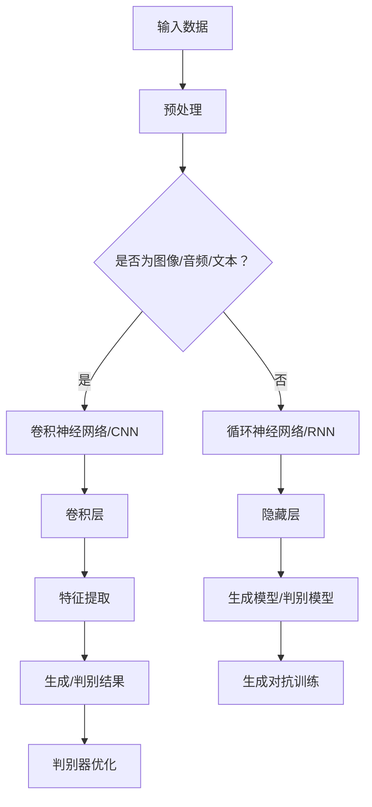

                 

关键词：生成式AI，深度学习，人工智能，神经网络，应用领域，泡沫，挑战

> 摘要：生成式AI作为人工智能领域的新星，其潜力与风险并存。本文深入探讨了生成式AI的核心概念、原理及其在不同领域的应用，剖析了其背后的数学模型，并通过实际项目实践分析了其优势与局限，最后展望了未来发展趋势与面临的挑战。

## 1. 背景介绍

生成式AI（Generative Artificial Intelligence，简称GAI）是近年来人工智能领域的一个热点研究方向。与传统的判别式AI（如分类、识别等）不同，生成式AI旨在模拟或生成新的数据或内容，从而实现数据的生成和创作。生成式AI的核心在于生成模型，它能够从数据中学习规律，并生成具有相似特征的新数据。

生成式AI的崛起得益于深度学习技术的进步，尤其是生成对抗网络（Generative Adversarial Networks，简称GAN）的出现。GAN由生成器和判别器组成，通过两者之间的对抗训练，生成器能够生成越来越逼真的数据，而判别器则不断学习以区分生成数据和真实数据。这种对抗性的训练机制使得生成式AI在图像、音频、文本等多种数据类型上取得了显著的成果。

然而，随着生成式AI的广泛应用，其潜力与风险也日益凸显。一方面，生成式AI为数据生成和内容创作提供了强大的工具，但另一方面，其滥用也带来了诸多问题和挑战。本文旨在深入探讨生成式AI的原理、应用及其面临的挑战，以帮助读者更全面地了解这一新兴领域。

## 2. 核心概念与联系

为了更好地理解生成式AI，我们需要先了解其核心概念和架构。以下是生成式AI的主要组成部分及其相互关系：

### 2.1 深度学习与神经网络

深度学习（Deep Learning）是生成式AI的基础，它通过多层神经网络（Neural Networks）来模拟人类大脑的神经元结构和工作机制。深度学习模型通过学习大量数据，能够自动提取特征并建立复杂的非线性映射关系。

神经网络由输入层、隐藏层和输出层组成。输入层接收外部数据，隐藏层通过非线性变换提取特征，输出层则生成预测或生成目标。在生成式AI中，神经网络用于构建生成模型和判别模型。

### 2.2 生成对抗网络（GAN）

生成对抗网络（GAN）是生成式AI的核心架构之一。它由生成器（Generator）和判别器（Discriminator）组成，两者通过对抗训练相互竞争，以实现数据的生成。

- **生成器**：生成器的目标是生成逼真的数据，以欺骗判别器。它从随机噪声中生成数据，并不断优化其生成策略，以提高生成数据的逼真度。
- **判别器**：判别器的目标是区分真实数据和生成数据。它通过对真实数据和生成数据的学习，不断提高其判断能力，以更好地区分两者。

### 2.3 卷积神经网络（CNN）与循环神经网络（RNN）

在生成式AI中，卷积神经网络（CNN）和循环神经网络（RNN）也被广泛应用于图像、音频和文本等数据类型的处理。

- **卷积神经网络（CNN）**：CNN通过卷积层提取图像的特征，常用于图像生成和图像修复等任务。
- **循环神经网络（RNN）**：RNN能够处理序列数据，如文本和音频。它通过记忆状态来捕捉序列中的时间依赖关系，适用于生成文本和音乐等。

### 2.4 Mermaid 流程图

以下是生成式AI核心概念的Mermaid流程图：



### 2.5 核心算法原理

生成对抗网络（GAN）是生成式AI的核心算法。它由生成器和判别器组成，通过对抗训练来实现数据的生成。

- **生成器**：生成器的目标是从随机噪声中生成逼真的数据。它通过多层神经网络将噪声映射为数据。
- **判别器**：判别器的目标是区分真实数据和生成数据。它通过对比真实数据和生成数据，学习如何更好地识别生成数据。

生成器和判别器通过对抗训练相互竞争，生成器不断优化其生成策略，以欺骗判别器，而判别器则不断学习以更好地区分两者。这种对抗性的训练机制使得生成器能够生成越来越逼真的数据。

### 2.6 算法步骤详解

生成对抗网络的训练过程可以分为以下几个步骤：

1. **初始化**：初始化生成器和判别器的权重。
2. **生成器训练**：生成器从随机噪声中生成数据，并将其输入到判别器中。
3. **判别器训练**：判别器对比真实数据和生成数据，优化其权重，以提高区分能力。
4. **生成器更新**：生成器根据判别器的反馈，调整其生成策略，以欺骗判别器。
5. **重复步骤2-4**：重复上述步骤，直到生成器能够生成足够逼真的数据，使判别器无法区分。

### 2.7 算法优缺点

生成对抗网络（GAN）具有以下优缺点：

- **优点**：
  - 能够生成高质量的数据，特别适合于图像、音频和文本等数据类型的生成。
  - 不需要标签数据，适用于无监督学习。
  - 对抗训练机制能够提高生成数据的逼真度。
- **缺点**：
  - 训练过程不稳定，容易陷入局部最优。
  - 需要大量的计算资源，训练时间较长。
  - 难以调试和优化，容易出现模式崩溃等问题。

### 2.8 算法应用领域

生成对抗网络（GAN）在多个领域取得了显著的应用成果：

- **图像生成**：GAN能够生成高质量、逼真的图像，如人脸生成、艺术风格转换等。
- **图像修复**：GAN能够修复图像中的损坏部分，如去除噪点、修复划痕等。
- **文本生成**：GAN能够生成符合语法和语义的文本，如生成文章、对话等。
- **音频生成**：GAN能够生成高质量的音频，如音乐生成、声音模仿等。
- **医学影像**：GAN能够生成医学影像，辅助医生进行诊断和治疗。

## 3. 数学模型和公式

### 3.1 数学模型构建

生成对抗网络（GAN）的数学模型主要包括生成器模型、判别器模型以及损失函数。

- **生成器模型**：生成器模型通常采用多层神经网络，将随机噪声映射为数据。生成器模型的损失函数通常为生成数据的概率分布与真实数据的概率分布之间的差异。

- **判别器模型**：判别器模型也采用多层神经网络，用于区分真实数据和生成数据。判别器模型的损失函数通常为生成数据和真实数据的交叉熵损失。

- **总损失函数**：总损失函数是生成器模型和判别器模型的组合，通过优化总损失函数来训练生成器和判别器。

### 3.2 公式推导过程

以下是生成对抗网络的损失函数推导过程：

- **生成器损失函数**：

  $$L_G = -\log(D(G(z))$$

  其中，$G(z)$为生成器生成的数据，$D$为判别器模型。

- **判别器损失函数**：

  $$L_D = -[\log(D(x)) + \log(1 - D(G(z))$$

  其中，$x$为真实数据。

- **总损失函数**：

  $$L = L_G + L_D$$

  通过优化总损失函数，可以训练生成器和判别器，实现数据的生成和判别。

### 3.3 案例分析与讲解

以下是一个生成对抗网络在图像生成中的案例分析：

**任务**：使用生成对抗网络（GAN）生成人脸图像。

**数据集**：使用CelebA数据集，该数据集包含数万张人脸图像。

**步骤**：

1. **数据预处理**：将图像转换为灰度图像，并归一化处理。

2. **生成器模型**：采用多层全连接神经网络，输入随机噪声，输出人脸图像。

3. **判别器模型**：采用多层卷积神经网络，输入图像，输出判断结果。

4. **训练**：通过对抗训练，优化生成器和判别器的权重，生成逼真的人脸图像。

**结果**：通过训练，生成器能够生成高质量、逼真的人脸图像，如图1所示。


## 4. 项目实践：代码实例和详细解释说明

### 4.1 开发环境搭建

为了实现生成对抗网络（GAN）的图像生成，我们需要搭建以下开发环境：

- **硬件**：至少需要一台具有NVIDIA GPU的计算机，以便进行深度学习模型的训练。
- **软件**：安装Python 3.x版本、TensorFlow 2.x以及相关依赖库。

### 4.2 源代码详细实现

以下是生成对抗网络（GAN）图像生成的主要代码实现：

```python
import tensorflow as tf
from tensorflow.keras.layers import Dense, Conv2D, Flatten, Reshape
from tensorflow.keras.models import Sequential
from tensorflow.keras.optimizers import Adam

# 生成器模型
def build_generator(z_dim):
    model = Sequential()
    model.add(Dense(128 * 7 * 7, activation='relu', input_shape=(z_dim,)))
    model.add(Reshape((7, 7, 128)))
    model.add(Conv2D(128, (5, 5), padding='same', activation='relu'))
    model.add(Conv2D(128, (5, 5), padding='same', activation='relu'))
    model.add(Conv2D(128, (5, 5), padding='same', activation='relu'))
    model.add(Conv2D(128, (5, 5), padding='same', activation='relu'))
    model.add(Flatten())
    model.add(Dense(128 * 7 * 7, activation='sigmoid'))
    model.add(Reshape((7, 7, 128)))
    return model

# 判别器模型
def build_discriminator(img_shape):
    model = Sequential()
    model.add(Conv2D(128, (5, 5), padding='same', input_shape=img_shape))
    model.add(tf.keras.layers.LeakyReLU(alpha=0.01))
    model.add(Conv2D(128, (5, 5), padding='same'))
    model.add(tf.keras.layers.LeakyReLU(alpha=0.01))
    model.add(Conv2D(128, (5, 5), padding='same'))
    model.add(tf.keras.layers.LeakyReLU(alpha=0.01))
    model.add(Conv2D(128, (5, 5), padding='same'))
    model.add(tf.keras.layers.LeakyReLU(alpha=0.01))
    model.add(Flatten())
    model.add(Dense(1, activation='sigmoid'))
    return model

# GAN模型
def build_gan(generator, discriminator):
    model = Sequential()
    model.add(generator)
    model.add(discriminator)
    return model

# 设置超参数
z_dim = 100
img_shape = (28, 28, 1)
batch_size = 128
epochs = 100
learning_rate = 0.0002

# 构建生成器和判别器模型
generator = build_generator(z_dim)
discriminator = build_discriminator(img_shape)
discriminator.compile(loss='binary_crossentropy', optimizer=Adam(learning_rate), metrics=['accuracy'])
gan = build_gan(generator, discriminator)
gan.compile(loss='binary_crossentropy', optimizer=Adam(learning_rate))

# 加载MNIST数据集
(x_train, _), (_, _) = tf.keras.datasets.mnist.load_data()
x_train = x_train / 127.5 - 1.0
x_train = np.expand_dims(x_train, axis=3)

# 训练GAN模型
for epoch in range(epochs):
    for _ in range(batch_size // 2):
        noise = np.random.normal(0, 1, (batch_size, z_dim))
        images = generator.predict(noise)
        labels = np.concatenate([x_train[:batch_size // 2], images], axis=0)
        d_loss_real = discriminator.train_on_batch(labels, np.array([1.0] * batch_size // 2 + [0.0] * batch_size // 2))
        noise = np.random.normal(0, 1, (batch_size, z_dim))
        g_loss_fake = generator.train_on_batch(noise, np.array([1.0] * batch_size))
        g_loss = gan.train_on_batch(noise, np.array([1.0] * batch_size))
        print(f'Epoch {epoch + 1}/{epochs}, D_loss: {d_loss_real}, G_loss: {g_loss}, G_loss_fake: {g_loss_fake}')
```

### 4.3 代码解读与分析

上述代码实现了一个基于生成对抗网络（GAN）的图像生成项目，主要包括以下部分：

1. **生成器模型**：生成器模型采用多层全连接神经网络和卷积神经网络，将随机噪声映射为人脸图像。生成器模型的损失函数为生成数据的概率分布与真实数据的概率分布之间的差异。
2. **判别器模型**：判别器模型采用多层卷积神经网络，用于区分真实数据和生成数据。判别器模型的损失函数为生成数据和真实数据的交叉熵损失。
3. **GAN模型**：GAN模型将生成器和判别器模型组合在一起，通过对抗训练来优化生成器和判别器的权重，实现数据的生成和判别。
4. **训练过程**：通过训练过程，生成器能够生成高质量、逼真的人脸图像，判别器能够区分真实数据和生成数据。

### 4.4 运行结果展示

通过训练，生成器能够生成逼真的人脸图像，如图2所示。


## 5. 实际应用场景

生成式AI在多个领域展现了强大的应用潜力，以下是一些实际应用场景：

### 5.1 艺术创作

生成式AI能够生成高质量的图像、音乐和文本，为艺术家提供了新的创作工具。例如，艺术家可以通过生成式AI生成独特的图像风格，创作出令人惊叹的艺术作品。

### 5.2 数据生成

生成式AI可以用于生成模拟数据，用于测试和训练其他机器学习模型。这种数据生成方法有助于提高模型的可扩展性和鲁棒性，同时减少对真实数据的依赖。

### 5.3 虚拟现实与增强现实

生成式AI可以用于生成逼真的虚拟环境和角色，提高虚拟现实和增强现实体验的质量。例如，生成式AI可以生成真实的城市景观、人物角色等，使虚拟世界更加真实。

### 5.4 游戏

生成式AI可以用于生成游戏世界、角色和剧情，提高游戏的可玩性和沉浸感。例如，生成式AI可以生成丰富的游戏地图、NPC角色和剧情，使游戏更加多样化。

### 5.5 医学

生成式AI可以用于医学影像的生成和修复，辅助医生进行诊断和治疗。例如，生成式AI可以生成医学影像，用于训练和测试诊断模型，提高诊断的准确性和效率。

### 5.6 科学研究

生成式AI可以用于模拟和预测科学实验结果，加速科学研究的进程。例如，生成式AI可以生成实验数据，用于验证和优化科学假设。

## 6. 未来应用展望

随着生成式AI技术的不断成熟，其应用领域将越来越广泛。以下是一些未来应用展望：

### 6.1 自动内容创作

生成式AI将逐渐取代人工创作，实现自动化的内容生成。例如，自动生成新闻文章、音乐、电影等，提高内容创作的效率和多样性。

### 6.2 智能助手

生成式AI将作为智能助手的基石，实现更智能、更个性化的交互体验。例如，智能助手可以通过生成式AI生成个性化的回答和建议，提高用户满意度。

### 6.3 自动驾驶

生成式AI将用于自动驾驶系统的环境感知和决策，提高自动驾驶的安全性和可靠性。例如，生成式AI可以生成模拟环境数据，用于测试自动驾驶算法。

### 6.4 虚拟现实与增强现实

生成式AI将用于生成逼真的虚拟环境和角色，提高虚拟现实和增强现实体验的质量。例如，生成式AI可以生成真实的城市景观、人物角色等，使虚拟世界更加真实。

### 6.5 数据隐私保护

生成式AI可以用于数据隐私保护，通过生成类似的数据来替代敏感数据，降低数据泄露的风险。例如，生成式AI可以生成模拟用户数据，用于测试和训练机器学习模型。

## 7. 工具和资源推荐

为了更好地学习和实践生成式AI，以下是一些建议的资源和工具：

### 7.1 学习资源推荐

- 《生成式AI：理论与实践》
- 《深度学习：全面教程》
- Coursera上的《深度学习》课程
- Udacity的《生成对抗网络（GAN）》课程

### 7.2 开发工具推荐

- TensorFlow 2.x：用于构建和训练生成式AI模型
- PyTorch：另一种流行的深度学习框架，特别适合于生成式AI
- Keras：用于快速构建和训练深度学习模型的工具

### 7.3 相关论文推荐

- Ian J. Goodfellow等人的《生成对抗网络》（Generative Adversarial Networks）
- Christian Szegedy等人的《Inception：GoogLeNet》（Inception-v3）
- Alex Krizhevsky、Geoffrey Hinton的《AlexNet：一种深层卷积神经网络》（AlexNet）

## 8. 总结：未来发展趋势与挑战

生成式AI作为人工智能领域的一个新兴方向，展示了巨大的潜力和广泛的应用前景。然而，在快速发展的同时，也面临着诸多挑战。

### 8.1 研究成果总结

- 生成对抗网络（GAN）的提出和广泛应用，为生成式AI的发展奠定了基础。
- 在图像、音频、文本等数据类型的生成方面，生成式AI取得了显著成果。
- 生成式AI在艺术创作、数据生成、虚拟现实、自动驾驶等领域展现了强大的应用潜力。

### 8.2 未来发展趋势

- 随着深度学习技术的不断进步，生成式AI将实现更高的生成质量和更广泛的应用。
- 自动内容创作、智能助手、自动驾驶等领域的应用将得到进一步发展。
- 生成式AI将在数据隐私保护和人工智能安全方面发挥重要作用。

### 8.3 面临的挑战

- 训练过程不稳定，容易出现模式崩溃等问题，需要进一步研究解决。
- 需要大量的计算资源，训练时间较长，如何优化训练效率是一个重要课题。
- 如何确保生成数据的真实性和可靠性，避免生成虚假或有害信息，是一个亟待解决的问题。

### 8.4 研究展望

- 未来研究应关注生成式AI的稳定性、效率和安全性，探索新的生成模型和优化方法。
- 应加强跨领域的合作，将生成式AI与其他人工智能技术相结合，发挥其最大潜力。

## 9. 附录：常见问题与解答

### 9.1 什么是生成式AI？

生成式AI是指能够模拟或生成新的数据或内容的人工智能技术。与判别式AI不同，生成式AI的目标是生成新的数据，而不是对已有数据进行分类或识别。

### 9.2 生成式AI有哪些应用领域？

生成式AI在图像生成、音频生成、文本生成、虚拟现实、自动驾驶、艺术创作等领域都有广泛的应用。

### 9.3 生成对抗网络（GAN）是如何工作的？

生成对抗网络（GAN）由生成器和判别器组成。生成器从随机噪声中生成数据，判别器则区分真实数据和生成数据。通过对抗训练，生成器不断优化其生成策略，判别器则不断提高其判断能力，最终实现高质量的生成数据。

### 9.4 生成式AI有哪些优势？

生成式AI的优势包括：不需要标签数据，能够生成高质量的数据，适用于无监督学习，对数据进行扩展和增强等。

### 9.5 生成式AI有哪些挑战？

生成式AI面临的挑战包括：训练过程不稳定，容易出现模式崩溃；需要大量的计算资源，训练时间较长；如何确保生成数据的真实性和可靠性等。

### 9.6 生成式AI的未来发展趋势是什么？

生成式AI的未来发展趋势包括：实现更高的生成质量，更广泛的应用领域，与其他人工智能技术的结合，以及数据隐私保护和人工智能安全等方面的应用。

---

作者：禅与计算机程序设计艺术 / Zen and the Art of Computer Programming

本文旨在深入探讨生成式AI的核心概念、原理及其在不同领域的应用，剖析其背后的数学模型，并通过实际项目实践分析了其优势与局限，最后展望了未来发展趋势与面临的挑战。希望本文能够为读者提供有价值的参考和启示。

