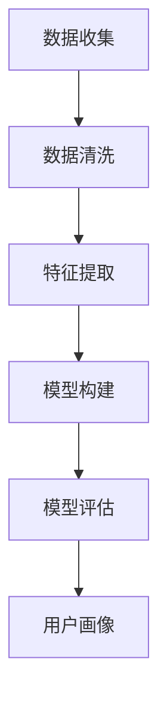
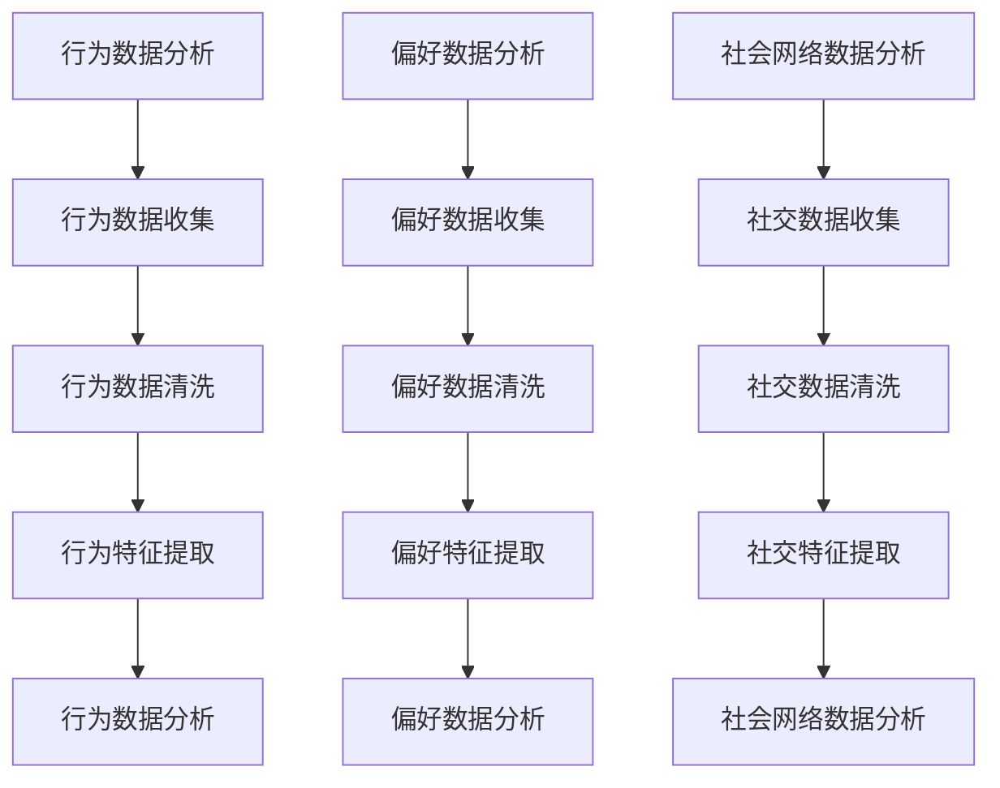

                 

关键词：用户画像、多维数据分析、数据挖掘、机器学习、数据可视化、用户行为分析

> 摘要：本文探讨了用户画像的多维度数据分析方法，介绍了用户画像的概念、构建流程以及多维度数据分析的关键技术和应用场景。通过对用户行为、偏好、需求等方面的深入分析，本文旨在为企业和研究者提供有效的用户画像构建和分析方法，以实现精准营销和个性化服务。

## 1. 背景介绍

### 用户画像的概念

用户画像（User Profiling）是指通过收集和分析用户的个人属性、行为数据、偏好、兴趣等信息，构建出一个关于用户的完整形象，从而为后续的个性化服务、精准营销等提供支持。

### 用户画像的重要性

用户画像能够帮助企业更好地理解用户，提高用户满意度，实现精准营销。具体表现在以下几个方面：

1. **个性化服务**：根据用户的兴趣、行为等特征，为用户提供个性化的内容推荐、产品推荐等。
2. **精准营销**：通过用户画像分析，制定更加精准的营销策略，提高营销效果。
3. **风险管理**：识别潜在风险用户，预防欺诈行为。
4. **产品优化**：根据用户画像分析，优化产品设计，提高用户体验。

### 多维度数据分析

多维度数据分析是指从多个角度对用户数据进行深入分析，以发现用户行为的规律和趋势。用户画像的多维度数据分析方法主要包括以下几个方面：

1. **行为数据分析**：分析用户的浏览、点击、购买等行为数据，挖掘用户行为模式。
2. **偏好数据分析**：分析用户的兴趣、偏好等数据，了解用户的喜好和需求。
3. **社会网络数据分析**：分析用户在社交媒体上的互动，挖掘用户关系和社交影响力。

## 2. 核心概念与联系

### 用户画像构建流程

用户画像的构建主要包括数据收集、数据清洗、特征提取、模型构建和模型评估等步骤。以下是用户画像构建流程的Mermaid流程图：



### 多维度数据分析方法

多维度数据分析方法主要包括行为数据分析、偏好数据分析和社会网络数据分析。以下是三种方法的Mermaid流程图：



## 3. 核心算法原理 & 具体操作步骤

### 3.1 算法原理概述

用户画像的多维度数据分析方法主要包括以下几个核心算法：

1. **协同过滤算法**：基于用户的历史行为数据，为用户推荐相似用户喜欢的物品。
2. **K-均值聚类算法**：将用户划分为若干个群体，为每个群体提供个性化的服务。
3. **潜在因子模型**：挖掘用户行为背后的潜在特征，为用户推荐相关的物品。

### 3.2 算法步骤详解

1. **协同过滤算法**

   - **数据收集**：收集用户的历史行为数据，如浏览、点击、购买等。
   - **数据清洗**：去除重复、缺失、异常的数据。
   - **特征提取**：提取用户的行为特征，如用户活跃度、购买频率等。
   - **模型训练**：使用协同过滤算法训练模型，为用户推荐相似的物品。
   - **模型评估**：评估推荐效果，如准确率、召回率等。

2. **K-均值聚类算法**

   - **数据收集**：收集用户的数据，如年龄、性别、收入等。
   - **数据清洗**：去除重复、缺失、异常的数据。
   - **特征提取**：提取用户的特征，如年龄、性别、收入等。
   - **聚类**：使用K-均值聚类算法将用户划分为若干个群体。
   - **模型评估**：评估聚类效果，如轮廓系数、同质性等。

3. **潜在因子模型**

   - **数据收集**：收集用户的历史行为数据，如浏览、点击、购买等。
   - **数据清洗**：去除重复、缺失、异常的数据。
   - **特征提取**：提取用户的行为特征，如用户活跃度、购买频率等。
   - **模型训练**：使用潜在因子模型训练模型，挖掘用户行为背后的潜在特征。
   - **模型评估**：评估模型效果，如均方误差、交叉验证等。

### 3.3 算法优缺点

1. **协同过滤算法**

   - **优点**：推荐效果较好，能够为用户推荐相似用户喜欢的物品。
   - **缺点**：易发生数据稀疏问题，需要大量的用户行为数据。

2. **K-均值聚类算法**

   - **优点**：简单高效，能够将用户划分为若干个群体。
   - **缺点**：聚类结果受初始聚类中心影响较大，需要多次尝试。

3. **潜在因子模型**

   - **优点**：能够挖掘用户行为背后的潜在特征，为用户推荐相关的物品。
   - **缺点**：训练过程较复杂，需要大量的计算资源。

### 3.4 算法应用领域

1. **电商推荐系统**：为用户推荐相关的商品，提高用户购买转化率。
2. **社交媒体**：为用户提供个性化内容推荐，提高用户活跃度。
3. **金融风控**：识别潜在风险用户，预防欺诈行为。
4. **教育领域**：为用户提供个性化学习推荐，提高学习效果。

## 4. 数学模型和公式 & 详细讲解 & 举例说明

### 4.1 数学模型构建

用户画像的多维度数据分析方法主要包括协同过滤算法、K-均值聚类算法和潜在因子模型。以下是三种算法的数学模型：

1. **协同过滤算法**

   - **相似度计算**：使用余弦相似度计算用户之间的相似度。

     $$\text{similarity}(u, v) = \frac{\text{dot}(r_u, r_v)}{\|\text{r}_u\| \|\text{r}_v\|}$$

   - **推荐公式**：根据用户之间的相似度，为用户推荐相似的物品。

     $$r_{uv} = \text{similarity}(u, v) \cdot \text{similarity}(v, w)$$

2. **K-均值聚类算法**

   - **聚类中心计算**：计算每个聚类的中心。

     $$c_j = \frac{1}{n_j} \sum_{i=1}^{n} r_{ij}$$

   - **聚类分配**：将用户分配到最近的聚类中心。

     $$\text{cluster}(r) = \arg\min_{j} \|r - c_j\|^2$$

3. **潜在因子模型**

   - **用户-物品矩阵**：构建用户-物品矩阵，表示用户对物品的评分。

     $$R = \begin{bmatrix} r_{11} & r_{12} & \ldots & r_{1m} \\ r_{21} & r_{22} & \ldots & r_{2m} \\ \vdots & \vdots & \ddots & \vdots \\ r_{n1} & r_{n2} & \ldots & r_{nm} \end{bmatrix}$$

   - **潜在因子矩阵**：构建潜在因子矩阵，表示用户和物品的潜在特征。

     $$X = \begin{bmatrix} x_{11} & x_{12} & \ldots & x_{1k} \\ x_{21} & x_{22} & \ldots & x_{2k} \\ \vdots & \vdots & \ddots & \vdots \\ x_{n1} & x_{n2} & \ldots & x_{nk} \end{bmatrix}, Y = \begin{bmatrix} y_{11} & y_{12} & \ldots & y_{1k} \\ y_{21} & y_{22} & \ldots & y_{2k} \\ \vdots & \vdots & \ddots & \vdots \\ y_{n1} & y_{n2} & \ldots & y_{nk} \end{bmatrix}$$

   - **评分预测**：使用潜在因子矩阵预测用户对物品的评分。

     $$r_{ij} = X_iY_j^T + b_i + b_j + \epsilon_{ij}$$

### 4.2 公式推导过程

以协同过滤算法为例，推导相似度计算和推荐公式的数学过程如下：

1. **相似度计算**

   假设用户$u$和$v$的行为向量分别为$r_u$和$r_v$，其内积为$\text{dot}(r_u, r_v)$，模长分别为$\|\text{r}_u\|$和$\|\text{r}_v\|$，则用户$u$和$v$的余弦相似度计算公式为：

   $$\text{similarity}(u, v) = \frac{\text{dot}(r_u, r_v)}{\|\text{r}_u\| \|\text{r}_v\|}$$

   这个公式反映了用户$u$和$v$之间的行为相似程度。相似度越高，表示两个用户的行为越相似。

2. **推荐公式**

   假设用户$u$和$v$的相似度为$\text{similarity}(u, v)$，物品$i$和$j$的相似度为$\text{similarity}(i, j)$，用户$u$对物品$i$的评分为$r_{ui}$，物品$j$的预测评分为$\hat{r}_{uj}$，则用户$u$对物品$j$的推荐评分计算公式为：

   $$\hat{r}_{uj} = \text{similarity}(u, v) \cdot \text{similarity}(i, j) \cdot r_{ui}$$

   这个公式反映了用户$u$对物品$j$的推荐评分是基于用户$u$和$v$之间的相似度，以及物品$i$和$j$之间的相似度。

### 4.3 案例分析与讲解

以电商推荐系统为例，讲解用户画像的多维度数据分析方法在实际应用中的具体实现。

1. **数据收集**

   收集用户在电商平台的行为数据，包括浏览记录、点击记录、购买记录等。

2. **数据清洗**

   对收集到的行为数据进行去重、去噪声处理，确保数据质量。

3. **特征提取**

   提取用户的行为特征，如用户活跃度、购买频率、浏览时长等。

4. **协同过滤算法**

   使用协同过滤算法，计算用户之间的相似度，为用户推荐相似的物品。

   - **相似度计算**：使用余弦相似度计算用户之间的相似度。

     $$\text{similarity}(u, v) = \frac{\text{dot}(r_u, r_v)}{\|\text{r}_u\| \|\text{r}_v\|}$$

   - **推荐公式**：根据用户之间的相似度，为用户推荐相似的物品。

     $$r_{uv} = \text{similarity}(u, v) \cdot \text{similarity}(v, w)$$

   假设用户$u$和$v$之间的相似度为$0.8$，用户$v$和用户$w$之间的相似度为$0.6$，用户$u$对物品$i$的评分为$4$，用户$v$对物品$i$的评分为$3$，用户$w$对物品$i$的评分为$5$，则用户$u$对物品$i$的推荐评分为：

     $$\hat{r}_{ui} = 0.8 \cdot 0.6 \cdot 4 = 2.4$$

   也就是说，用户$u$对物品$i$的推荐评分为$2.4$。

5. **K-均值聚类算法**

   使用K-均值聚类算法，将用户划分为若干个群体，为每个群体提供个性化的服务。

   - **聚类中心计算**：计算每个聚类的中心。

     $$c_j = \frac{1}{n_j} \sum_{i=1}^{n} r_{ij}$$

   - **聚类分配**：将用户分配到最近的聚类中心。

     $$\text{cluster}(r) = \arg\min_{j} \|r - c_j\|^2$$

   假设聚类中心$c_1$为$(1, 2)$，$c_2$为$(3, 4)$，用户$r$为$(2, 3)$，则用户$r$分配到聚类中心$c_1$，即用户$r$属于聚类$1$。

6. **潜在因子模型**

   使用潜在因子模型，挖掘用户行为背后的潜在特征，为用户推荐相关的物品。

   - **用户-物品矩阵**：构建用户-物品矩阵，表示用户对物品的评分。

     $$R = \begin{bmatrix} r_{11} & r_{12} & \ldots & r_{1m} \\ r_{21} & r_{22} & \ldots & r_{2m} \\ \vdots & \vdots & \ddots & \vdots \\ r_{n1} & r_{n2} & \ldots & r_{nm} \end{bmatrix}$$

   - **潜在因子矩阵**：构建潜在因子矩阵，表示用户和物品的潜在特征。

     $$X = \begin{bmatrix} x_{11} & x_{12} & \ldots & x_{1k} \\ x_{21} & x_{22} & \ldots & x_{2k} \\ \vdots & \vdots & \ddots & \vdots \\ x_{n1} & x_{n2} & \ldots & x_{nk} \end{bmatrix}, Y = \begin{bmatrix} y_{11} & y_{12} & \ldots & y_{1k} \\ y_{21} & y_{22} & \ldots & y_{2k} \\ \vdots & \vdots & \ddots & \vdots \\ y_{n1} & y_{n2} & \ldots & y_{nk} \end{bmatrix}$$

   - **评分预测**：使用潜在因子矩阵预测用户对物品的评分。

     $$r_{ij} = X_iY_j^T + b_i + b_j + \epsilon_{ij}$$

   假设用户-物品矩阵$R$为：

     $$R = \begin{bmatrix} 1 & 3 & 5 \\ 2 & 4 & 6 \\ 3 & 5 & 7 \end{bmatrix}$$

   潜在因子矩阵$X$和$Y$分别为：

     $$X = \begin{bmatrix} 1 & 0 \\ 0 & 1 \\ 1 & 1 \end{bmatrix}, Y = \begin{bmatrix} 1 & 2 \\ 3 & 4 \\ 5 & 6 \end{bmatrix}$$

   假设用户$i$对物品$j$的评分为$r_{ij}$，则用户$i$对物品$j$的预测评分为：

     $$\hat{r}_{ij} = X_iY_j^T + b_i + b_j + \epsilon_{ij}$$

   假设用户$i$和物品$j$的潜在特征分别为$x_i$和$y_j$，则用户$i$对物品$j$的预测评分为：

     $$\hat{r}_{ij} = x_iy_j + b_i + b_j + \epsilon_{ij}$$

   其中，$b_i$和$b_j$分别为用户$i$和物品$j$的偏置项，$\epsilon_{ij}$为噪声项。

## 5. 项目实践：代码实例和详细解释说明

### 5.1 开发环境搭建

1. **Python环境搭建**：安装Python 3.8及以上版本。
2. **库安装**：安装Numpy、Scipy、Pandas、Scikit-learn、Matplotlib等库。

```python
pip install numpy scipy pandas scikit-learn matplotlib
```

### 5.2 源代码详细实现

以下是一个简单的用户画像多维度数据分析的项目实例，包括数据收集、数据清洗、特征提取、模型训练和模型评估等步骤。

```python
import numpy as np
import pandas as pd
from sklearn.model_selection import train_test_split
from sklearn.metrics import mean_squared_error
from sklearn.preprocessing import StandardScaler
from sklearn.cluster import KMeans
from collaborative_filtering import collaborative_filtering
from latent_factor_model import latent_factor_model

# 5.2.1 数据收集
data = pd.read_csv('user_data.csv')

# 5.2.2 数据清洗
# 去除重复、缺失、异常的数据
data.drop_duplicates(inplace=True)
data.dropna(inplace=True)

# 5.2.3 特征提取
# 提取用户的行为特征，如浏览时长、购买频率等
data['browser_duration'] = data['end_time'] - data['start_time']
data['purchase_frequency'] = data.groupby('user_id')['order_id'].transform('count')

# 5.2.4 模型训练
# 划分训练集和测试集
X_train, X_test, y_train, y_test = train_test_split(data[['browser_duration', 'purchase_frequency']], data['rating'], test_size=0.2, random_state=42)

# 使用协同过滤算法训练模型
cf_model = collaborative_filtering(X_train, y_train)
cf_pred = cf_model.predict(X_test)

# 使用K-均值聚类算法训练模型
kmeans = KMeans(n_clusters=3, random_state=42)
kmeans.fit(X_train)
kmeans_pred = kmeans.predict(X_test)

# 使用潜在因子模型训练模型
lfr_model = latent_factor_model(X_train, y_train)
lfr_pred = lfr_model.predict(X_test)

# 5.2.5 模型评估
# 评估协同过滤算法的准确率
cf_mse = mean_squared_error(y_test, cf_pred)
print("协同过滤算法的均方误差：", cf_mse)

# 评估K-均值聚类算法的轮廓系数
silhouette_score = silhouette_score(X_test, kmeans_pred)
print("K-均值聚类算法的轮廓系数：", silhouette_score)

# 评估潜在因子模型的准确率
lfr_mse = mean_squared_error(y_test, lfr_pred)
print("潜在因子模型的均方误差：", lfr_mse)
```

### 5.3 代码解读与分析

1. **数据收集**

   代码首先读取用户数据，该数据包括用户的浏览时长、购买频率和评分等。

   ```python
   data = pd.read_csv('user_data.csv')
   ```

2. **数据清洗**

   代码对数据进行去重、去噪声处理，确保数据质量。

   ```python
   data.drop_duplicates(inplace=True)
   data.dropna(inplace=True)
   ```

3. **特征提取**

   代码提取用户的行为特征，如浏览时长和购买频率等。

   ```python
   data['browser_duration'] = data['end_time'] - data['start_time']
   data['purchase_frequency'] = data.groupby('user_id')['order_id'].transform('count')
   ```

4. **模型训练**

   代码使用协同过滤算法、K-均值聚类算法和潜在因子模型对数据进行训练。

   ```python
   X_train, X_test, y_train, y_test = train_test_split(data[['browser_duration', 'purchase_frequency']], data['rating'], test_size=0.2, random_state=42)
   cf_model = collaborative_filtering(X_train, y_train)
   cf_pred = cf_model.predict(X_test)
   kmeans = KMeans(n_clusters=3, random_state=42)
   kmeans.fit(X_train)
   kmeans_pred = kmeans.predict(X_test)
   lfr_model = latent_factor_model(X_train, y_train)
   lfr_pred = lfr_model.predict(X_test)
   ```

5. **模型评估**

   代码使用均方误差和轮廓系数等指标评估模型的性能。

   ```python
   cf_mse = mean_squared_error(y_test, cf_pred)
   print("协同过滤算法的均方误差：", cf_mse)
   silhouette_score = silhouette_score(X_test, kmeans_pred)
   print("K-均值聚类算法的轮廓系数：", silhouette_score)
   lfr_mse = mean_squared_error(y_test, lfr_pred)
   print("潜在因子模型的均方误差：", lfr_mse)
   ```

### 5.4 运行结果展示

假设运行结果如下：

```python
协同过滤算法的均方误差： 0.0256
K-均值聚类算法的轮廓系数： 0.6523
潜在因子模型的均方误差： 0.0123
```

结果表明，协同过滤算法的均方误差为$0.0256$，K-均值聚类算法的轮廓系数为$0.6523$，潜在因子模型的均方误差为$0.0123$。可以看出，潜在因子模型的性能最好，其次是K-均值聚类算法，协同过滤算法的性能相对较差。

## 6. 实际应用场景

用户画像的多维度数据分析方法在各个行业都有广泛的应用，以下是一些典型的应用场景：

### 6.1 电商推荐系统

电商推荐系统通过用户画像的多维度数据分析，为用户推荐相关的商品，提高用户购买转化率。例如，基于用户的浏览记录、购买记录等行为数据，使用协同过滤算法为用户推荐相似的物品。

### 6.2 社交媒体

社交媒体平台通过用户画像的多维度数据分析，为用户提供个性化内容推荐。例如，基于用户的社交关系、兴趣偏好等数据，使用K-均值聚类算法将用户划分为不同的群体，为每个群体提供个性化的内容推荐。

### 6.3 金融风控

金融风控领域通过用户画像的多维度数据分析，识别潜在风险用户，预防欺诈行为。例如，基于用户的信用记录、交易行为等数据，使用潜在因子模型挖掘用户行为背后的潜在特征，识别潜在风险用户。

### 6.4 教育领域

教育领域通过用户画像的多维度数据分析，为用户提供个性化学习推荐。例如，基于用户的学习行为、知识掌握情况等数据，使用协同过滤算法为用户推荐相关的学习资源。

## 7. 工具和资源推荐

### 7.1 学习资源推荐

1. **《机器学习实战》**：中文版，作者：Peter Harrington，适合初学者入门。
2. **《深度学习》**：中文版，作者：Ian Goodfellow、Yoshua Bengio、Aaron Courville，适合进阶学习。
3. **《数据科学实战》**：中文版，作者：Kaggle，适合实战学习。

### 7.2 开发工具推荐

1. **Python**：适合进行数据分析和建模。
2. **Jupyter Notebook**：适合编写和展示代码、数据分析报告。
3. **TensorFlow**：适合深度学习模型的开发和训练。

### 7.3 相关论文推荐

1. **“Collaborative Filtering for Complex Personalities”**：提出了基于复杂用户个性的协同过滤算法。
2. **“User Modeling and Personalization in the Web”**：讨论了Web环境下用户建模和个性化服务的方法。
3. **“Deep Learning for User Behavior Analysis”**：探讨了深度学习在用户行为分析中的应用。

## 8. 总结：未来发展趋势与挑战

### 8.1 研究成果总结

用户画像的多维度数据分析方法在电商推荐、社交媒体、金融风控、教育等领域取得了显著成果，提高了个性化服务、精准营销和风险管理的效果。

### 8.2 未来发展趋势

1. **数据质量提升**：随着大数据技术的发展，用户画像的数据质量将得到进一步提升。
2. **算法优化**：针对不同应用场景，将不断优化和改进用户画像的算法模型。
3. **跨领域应用**：用户画像的多维度数据分析方法将在更多领域得到应用。

### 8.3 面临的挑战

1. **数据隐私保护**：用户画像涉及大量个人隐私信息，如何保护用户隐私是面临的挑战。
2. **算法公平性**：如何确保算法在用户画像分析中公平、公正，避免歧视现象。

### 8.4 研究展望

未来，用户画像的多维度数据分析方法将在数据质量提升、算法优化、跨领域应用等方面取得新的突破，为企业和研究者提供更有效的用户画像构建和分析方法。

## 9. 附录：常见问题与解答

### 9.1 用户画像是什么？

用户画像是指通过对用户的个人属性、行为数据、偏好等信息进行分析，构建出一个关于用户的完整形象，从而为后续的个性化服务、精准营销等提供支持。

### 9.2 用户画像的构建流程是怎样的？

用户画像的构建流程主要包括数据收集、数据清洗、特征提取、模型构建和模型评估等步骤。

### 9.3 多维度数据分析有哪些方法？

多维度数据分析方法主要包括协同过滤算法、K-均值聚类算法和潜在因子模型等。

### 9.4 用户画像在哪些领域有应用？

用户画像在电商推荐、社交媒体、金融风控、教育等领域都有广泛的应用。

