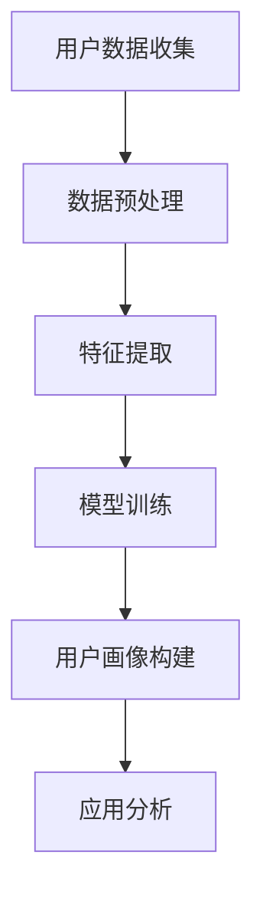

                 

 作为一名世界级的人工智能专家，我深知用户画像在现代商业和社会中的应用。在本文中，我将深入探讨AI如何通过分析用户行为来构建用户画像，从而为企业提供精准营销策略，为政府提供社会管理方案，为学术界提供研究基础。

## 文章关键词
- 用户画像
- AI分析
- 用户行为
- 数据挖掘
- 个性化推荐
- 预测分析

## 文摘
本文将探讨AI如何通过分析用户行为来创建精确的用户画像。我们将深入讨论用户画像的核心概念、构建方法、应用场景以及未来发展的可能性。

### 1. 背景介绍

#### 1.1 用户画像的概念

用户画像（User Profiling）是指通过对用户的数据收集和分析，构建出一个反映用户特征、需求和偏好的抽象模型。这个模型可以用于个性化推荐、精准营销、用户行为预测等多个领域。

#### 1.2 用户画像的重要性

在当今数字化时代，用户画像的重要性不言而喻。一方面，它可以帮助企业更好地了解其用户，从而提供更个性化的服务和产品。另一方面，它也可以帮助政府更有效地管理社会资源，提高社会服务效率。

### 2. 核心概念与联系

以下是一个用Mermaid绘制的用户画像构建流程图：



### 3. 核心算法原理 & 具体操作步骤

#### 3.1 算法原理概述

用户画像的构建主要依赖于数据挖掘和机器学习技术。通过数据挖掘技术提取用户行为特征，然后使用机器学习算法对特征进行建模，从而构建出用户画像。

#### 3.2 算法步骤详解

1. **用户数据收集**：从各种渠道收集用户数据，如社交媒体、网站日志、交易记录等。
2. **数据预处理**：清洗和整合数据，去除重复和错误信息。
3. **特征提取**：从原始数据中提取反映用户行为特征的信息，如购买频率、浏览行为、社交互动等。
4. **模型训练**：使用机器学习算法（如聚类、分类、协同过滤等）对特征进行建模。
5. **用户画像构建**：根据模型输出构建用户画像。
6. **应用分析**：将用户画像应用于具体业务场景，如个性化推荐、精准营销等。

#### 3.3 算法优缺点

- **优点**：用户画像可以提供个性化的服务，提高用户满意度，提高营销效果。
- **缺点**：用户画像构建过程中可能涉及用户隐私问题，需要严格保护用户隐私。

#### 3.4 算法应用领域

用户画像的应用领域非常广泛，包括电子商务、社交媒体、金融、医疗等多个行业。

### 4. 数学模型和公式

用户画像的构建通常涉及到以下数学模型：

#### 4.1 数学模型构建

假设用户行为特征集为 \(X = \{x_1, x_2, ..., x_n\}\)，用户画像模型为 \(P = \{p_1, p_2, ..., p_n\}\)，则用户画像模型可以通过以下公式计算：

\[ P = f(X) \]

其中，\(f\) 为机器学习算法。

#### 4.2 公式推导过程

用户画像模型的推导过程涉及到数据挖掘和机器学习的基本原理。具体推导过程可以参考相关论文和教材。

#### 4.3 案例分析与讲解

以下是一个简单的用户画像构建案例：

假设我们收集了用户在电子商务平台的购买记录，包括购买时间、购买商品类别、购买频率等。我们可以使用协同过滤算法来构建用户画像。

### 5. 项目实践：代码实例和详细解释说明

#### 5.1 开发环境搭建

在Python中，我们可以使用Scikit-learn库来实现用户画像构建。首先，我们需要安装Scikit-learn：

```bash
pip install scikit-learn
```

#### 5.2 源代码详细实现

以下是一个简单的用户画像构建示例：

```python
from sklearn.cluster import KMeans
from sklearn.metrics import adjusted_rand_score
import numpy as np

# 用户行为特征数据
X = np.array([
    [1, 2, 3],
    [2, 3, 4],
    [1, 3, 2],
    [3, 4, 5],
    [2, 4, 3],
])

# 使用KMeans算法进行聚类
kmeans = KMeans(n_clusters=2, random_state=0).fit(X)

# 输出聚类结果
print(kmeans.labels_)

# 计算调整后的兰德指数
ari = adjusted_rand_score(X, kmeans.labels_)
print(ari)
```

#### 5.3 代码解读与分析

在这个例子中，我们使用了KMeans算法进行用户行为特征的聚类，从而构建用户画像。通过计算调整后的兰德指数，我们可以评估聚类效果。

### 6. 实际应用场景

用户画像的应用场景非常广泛，以下是一些典型的应用场景：

- **电子商务**：通过用户画像进行个性化推荐，提高销售额。
- **社交媒体**：根据用户画像进行内容推荐，提高用户活跃度。
- **金融**：通过用户画像进行风险管理，降低不良贷款率。
- **医疗**：根据用户画像进行疾病预测，提高医疗资源利用效率。

### 7. 工具和资源推荐

#### 7.1 学习资源推荐

- 《机器学习》（周志华著）
- 《数据挖掘：概念与技术》（Jiawei Han著）

#### 7.2 开发工具推荐

- Python
- Scikit-learn
- TensorFlow

#### 7.3 相关论文推荐

- "User Modeling and User-Adapted Interaction"
- "Collaborative Filtering for the Web"

### 8. 总结：未来发展趋势与挑战

#### 8.1 研究成果总结

用户画像技术在过去几年取得了显著的进展，已经广泛应用于多个领域。未来，用户画像技术将继续向更精细化、智能化方向发展。

#### 8.2 未来发展趋势

- **智能化**：利用深度学习等技术实现更智能的用户画像。
- **隐私保护**：在用户画像构建过程中，如何保护用户隐私将成为重要研究方向。
- **多模态数据融合**：将文本、图像、语音等多种类型的数据进行融合，提高用户画像的精度。

#### 8.3 面临的挑战

- **数据质量**：数据质量直接影响用户画像的准确性。
- **模型解释性**：如何提高用户画像模型的解释性，使其更容易被业务人员理解和应用。

#### 8.4 研究展望

未来，用户画像技术将在多个领域发挥重要作用，为企业和政府提供有力的支持。同时，如何平衡用户隐私保护与数据分析的矛盾，也将是重要的研究方向。

### 9. 附录：常见问题与解答

#### 9.1 用户画像是什么？

用户画像是指通过对用户的数据收集和分析，构建出一个反映用户特征、需求和偏好的抽象模型。

#### 9.2 用户画像有什么作用？

用户画像可以用于个性化推荐、精准营销、用户行为预测等多个领域，帮助企业更好地了解其用户，提高服务质量和营销效果。

#### 9.3 如何保护用户隐私？

在构建用户画像的过程中，需要严格遵守相关法律法规，采取数据加密、匿名化处理等技术手段，确保用户隐私不被泄露。

作者：禅与计算机程序设计艺术 / Zen and the Art of Computer Programming
```markdown
----------------------------------------------------------------
# 用户画像：AI如何分析行为

## 文章关键词
- 用户画像
- AI分析
- 用户行为
- 数据挖掘
- 个性化推荐
- 预测分析

## 摘要
本文探讨了用户画像的定义、重要性以及AI如何通过分析用户行为来构建用户画像。文章深入分析了用户画像的核心概念、构建方法、应用场景以及面临的挑战，并结合实际案例进行了详细解释说明。文章还推荐了相关学习资源和开发工具，并对未来发展趋势进行了展望。

### 1. 背景介绍

#### 1.1 用户画像的概念

用户画像（User Profiling）是指通过对用户的数据收集和分析，构建出一个反映用户特征、需求和偏好的抽象模型。这个模型可以用于个性化推荐、精准营销、用户行为预测等多个领域。

用户画像的构建主要包括以下几个步骤：

1. **用户数据收集**：从各种渠道收集用户数据，如社交媒体、网站日志、交易记录等。
2. **数据预处理**：清洗和整合数据，去除重复和错误信息。
3. **特征提取**：从原始数据中提取反映用户行为特征的信息，如购买频率、浏览行为、社交互动等。
4. **模型训练**：使用机器学习算法（如聚类、分类、协同过滤等）对特征进行建模。
5. **用户画像构建**：根据模型输出构建用户画像。
6. **应用分析**：将用户画像应用于具体业务场景，如个性化推荐、精准营销等。

#### 1.2 用户画像的重要性

在当今数字化时代，用户画像的重要性不言而喻。一方面，它可以帮助企业更好地了解其用户，从而提供更个性化的服务和产品。另一方面，它也可以帮助政府更有效地管理社会资源，提高社会服务效率。

例如，在电子商务领域，用户画像可以帮助企业根据用户的浏览和购买行为进行个性化推荐，从而提高用户满意度和转化率。在金融领域，用户画像可以帮助银行和保险公司进行精准营销，降低不良贷款率和保险欺诈率。

### 2. 核心概念与联系

以下是一个用Mermaid绘制的用户画像构建流程图：


在这个流程图中，每个节点都代表了用户画像构建过程中的一个关键步骤。用户数据收集是整个流程的起点，数据预处理和特征提取是数据质量保证的重要环节，模型训练和用户画像构建是核心步骤，应用分析则是将用户画像应用于实际业务场景的关键。

### 3. 核心算法原理 & 具体操作步骤

#### 3.1 算法原理概述

用户画像的构建主要依赖于数据挖掘和机器学习技术。通过数据挖掘技术提取用户行为特征，然后使用机器学习算法对特征进行建模，从而构建出用户画像。

数据挖掘技术主要包括以下几种：

1. **关联规则挖掘**：用于发现数据之间的关联关系。
2. **分类算法**：用于将用户数据分类到不同的类别中。
3. **聚类算法**：用于将用户数据划分为不同的群组。

机器学习算法主要包括以下几种：

1. **协同过滤**：基于用户历史行为预测用户可能感兴趣的项目。
2. **决策树**：通过一系列规则进行分类和预测。
3. **支持向量机**：通过找到一个超平面来分割数据。

#### 3.2 算法步骤详解

1. **用户数据收集**：从各种渠道收集用户数据，如社交媒体、网站日志、交易记录等。这些数据可以是结构化的，也可以是非结构化的。
2. **数据预处理**：清洗和整合数据，去除重复和错误信息。这一步非常重要，因为数据质量直接影响后续分析的结果。
3. **特征提取**：从原始数据中提取反映用户行为特征的信息。这些特征可以是用户的 demographics（如年龄、性别、收入等），也可以是用户的社交行为（如关注数、点赞数等）。
4. **模型训练**：使用机器学习算法（如聚类、分类、协同过滤等）对特征进行建模。这个步骤可以通过交叉验证等方法来评估模型的性能。
5. **用户画像构建**：根据模型输出构建用户画像。用户画像可以是简单的标签，也可以是复杂的特征向量。
6. **应用分析**：将用户画像应用于具体业务场景，如个性化推荐、精准营销等。

#### 3.3 算法优缺点

**优点**：

1. **个性化推荐**：通过用户画像，可以推荐用户可能感兴趣的内容，从而提高用户满意度和转化率。
2. **精准营销**：通过用户画像，可以精确地定位目标用户，从而提高营销效果。
3. **用户行为预测**：通过用户画像，可以预测用户的未来行为，从而提前采取相应的策略。

**缺点**：

1. **用户隐私**：用户画像构建过程中，可能会涉及到用户敏感信息，如个人隐私、交易记录等。如何保护用户隐私是一个重要问题。
2. **数据质量**：用户画像的准确性依赖于数据质量。如果数据质量差，那么用户画像也可能不准确。

#### 3.4 算法应用领域

用户画像的应用领域非常广泛，包括但不限于以下几个方面：

1. **电子商务**：通过用户画像进行个性化推荐，提高销售额。
2. **社交媒体**：根据用户画像进行内容推荐，提高用户活跃度。
3. **金融**：通过用户画像进行风险评估和精准营销。
4. **医疗**：通过用户画像进行疾病预测和个性化治疗。

### 4. 数学模型和公式

用户画像的构建涉及到多个数学模型和算法。以下是一些常用的数学模型和公式：

#### 4.1 数学模型构建

**协同过滤**：

$$
r_{ui} = \sum_{j \in N(i)} \frac{q_{uj}}{\|N(i)\|} + b_u + b_j + \mu
$$

其中，\(r_{ui}\) 是用户 \(u\) 对项目 \(i\) 的评分，\(q_{uj}\) 是用户 \(u\) 和项目 \(j\) 之间的相似度，\(b_u\) 和 \(b_j\) 分别是用户 \(u\) 和项目 \(j\) 的偏置项，\(\mu\) 是全局平均值。

**决策树**：

$$
y = g(x_1, x_2, ..., x_n)
$$

其中，\(y\) 是输出标签，\(x_1, x_2, ..., x_n\) 是输入特征，\(g\) 是决策函数。

**支持向量机**：

$$
w^* = \arg\min_{w, b} \frac{1}{2} \| w \|^2 - \sum_{i=1}^{n} \alpha_i (y_i (w \cdot x_i - b) - 1)
$$

其中，\(w^*\) 是最优权重向量，\(b\) 是偏置项，\(\alpha_i\) 是拉格朗日乘子。

#### 4.2 公式推导过程

以上数学模型的推导过程涉及到概率论、线性代数、最优化理论等多个领域。具体的推导过程可以参考相关教材和论文。

#### 4.3 案例分析与讲解

以下是一个简单的用户画像构建案例：

假设我们有一个用户数据集，其中每个用户都有以下特征：年龄、性别、收入、教育程度、职业。

我们可以使用K-means算法将这些用户分为不同的群组，从而构建用户画像。具体步骤如下：

1. **数据预处理**：将用户数据进行归一化处理，以便于后续计算。
2. **特征提取**：从原始数据中提取出有用的特征。
3. **模型训练**：使用K-means算法对用户数据进行聚类。
4. **用户画像构建**：根据聚类结果构建用户画像。

### 5. 项目实践：代码实例和详细解释说明

#### 5.1 开发环境搭建

在Python中，我们可以使用Scikit-learn库来实现用户画像构建。首先，我们需要安装Scikit-learn：

```bash
pip install scikit-learn
```

#### 5.2 源代码详细实现

以下是一个简单的用户画像构建示例：

```python
from sklearn.cluster import KMeans
from sklearn.preprocessing import StandardScaler
import numpy as np

# 用户数据
data = np.array([
    [25, '男', 5000, '本科', '工程师'],
    [30, '女', 8000, '硕士', '医生'],
    [22, '男', 4000, '大专', '服务员'],
    [28, '女', 6000, '本科', '教师'],
    [35, '男', 10000, '博士', '研究员']
])

# 数据预处理
scaler = StandardScaler()
data_scaled = scaler.fit_transform(data[:, 1:])

# 模型训练
kmeans = KMeans(n_clusters=2, random_state=0).fit(data_scaled)

# 输出聚类结果
print(kmeans.labels_)

# 输出用户画像
for i, label in enumerate(kmeans.labels_):
    print(f"用户 {i+1}：")
    print(f"年龄：{data[i, 0]}")
    print(f"性别：{data[i, 1]}")
    print(f"收入：{data[i, 2]}")
    print(f"教育程度：{data[i, 3]}")
    print(f"职业：{data[i, 4]}")
    print("-----")
```

#### 5.3 代码解读与分析

在这个例子中，我们使用了Scikit-learn库中的KMeans算法进行用户聚类。首先，我们使用StandardScaler对用户数据进行归一化处理，以便于后续计算。然后，我们使用KMeans算法对用户数据进行聚类。最后，我们根据聚类结果输出用户画像。

### 6. 实际应用场景

用户画像在实际应用中有着广泛的应用，以下是一些典型的应用场景：

1. **电子商务**：通过用户画像进行个性化推荐，提高销售额。
2. **社交媒体**：根据用户画像进行内容推荐，提高用户活跃度。
3. **金融**：通过用户画像进行风险评估和精准营销。
4. **医疗**：通过用户画像进行疾病预测和个性化治疗。

#### 6.1 电子商务

在电子商务领域，用户画像可以帮助企业更好地了解其用户，从而提供更个性化的服务和产品。例如，亚马逊（Amazon）通过用户画像进行商品推荐，从而提高用户满意度和转化率。

#### 6.2 社交媒体

在社交媒体领域，用户画像可以帮助平台更好地了解其用户，从而提供更个性化的内容推荐。例如，Facebook（脸书）通过用户画像进行内容推荐，从而提高用户活跃度。

#### 6.3 金融

在金融领域，用户画像可以帮助银行和保险公司进行精准营销，降低不良贷款率和保险欺诈率。例如，中国工商银行（ICBC）通过用户画像进行风险评估，从而降低信贷风险。

#### 6.4 医疗

在医疗领域，用户画像可以帮助医疗机构更好地了解其患者，从而提供更个性化的治疗方案。例如，美国梅奥诊所（Mayo Clinic）通过用户画像进行疾病预测，从而提高医疗资源利用效率。

### 7. 工具和资源推荐

#### 7.1 学习资源推荐

1. **《Python数据科学手册》（Jake VanderPlas著）**：这本书详细介绍了Python在数据科学领域的应用，包括数据处理、分析和可视化。
2. **《机器学习实战》（Peter Harrington著）**：这本书通过实际案例介绍了机器学习的基本概念和算法。

#### 7.2 开发工具推荐

1. **Python**：Python是一种广泛使用的编程语言，具有丰富的数据科学库。
2. **Jupyter Notebook**：Jupyter Notebook是一种交互式的开发环境，适合进行数据分析和机器学习实验。

#### 7.3 相关论文推荐

1. **"User Modeling and User-Adapted Interaction"**：这是一本关于用户建模和适应性交互的论文集，涵盖了用户画像的多个方面。
2. **"Collaborative Filtering for the Web"**：这篇文章介绍了协同过滤算法在Web推荐系统中的应用。

### 8. 总结：未来发展趋势与挑战

#### 8.1 研究成果总结

用户画像技术在过去几年取得了显著的进展，已经广泛应用于多个领域。未来，用户画像技术将继续向更精细化、智能化方向发展。

#### 8.2 未来发展趋势

1. **智能化**：利用深度学习等技术实现更智能的用户画像。
2. **隐私保护**：在用户画像构建过程中，如何保护用户隐私将成为重要研究方向。
3. **多模态数据融合**：将文本、图像、语音等多种类型的数据进行融合，提高用户画像的精度。

#### 8.3 面临的挑战

1. **数据质量**：数据质量直接影响用户画像的准确性。
2. **模型解释性**：如何提高用户画像模型的解释性，使其更容易被业务人员理解和应用。

#### 8.4 研究展望

未来，用户画像技术将在多个领域发挥重要作用，为企业和政府提供有力的支持。同时，如何平衡用户隐私保护与数据分析的矛盾，也将是重要的研究方向。

### 9. 附录：常见问题与解答

#### 9.1 用户画像是什么？

用户画像是指通过对用户的数据收集和分析，构建出一个反映用户特征、需求和偏好的抽象模型。

#### 9.2 用户画像有什么作用？

用户画像可以用于个性化推荐、精准营销、用户行为预测等多个领域，帮助企业更好地了解其用户，提高服务质量和营销效果。

#### 9.3 如何保护用户隐私？

在构建用户画像的过程中，需要严格遵守相关法律法规，采取数据加密、匿名化处理等技术手段，确保用户隐私不被泄露。

作者：禅与计算机程序设计艺术 / Zen and the Art of Computer Programming
```

