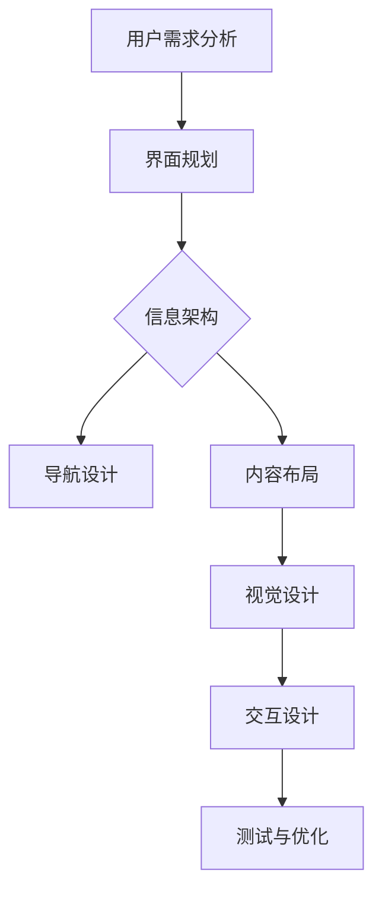

                 

关键词：用户界面设计、人机交互、易用性、用户体验、界面构建、交互设计

> 摘要：本文将探讨用户界面设计的核心概念、方法与技术，分析如何通过设计提升用户友好性和易用性，从而构建高质量的人机交互系统。文章将涵盖用户界面设计的基本原则、设计工具和资源，以及在实际项目中的应用实践和未来展望。

## 1. 背景介绍

用户界面设计（User Interface Design，简称UI设计）是计算机科学与艺术领域的交叉学科，涉及用户与软件之间的交互界面设计。一个优秀的用户界面不仅能够吸引新用户，提高用户满意度，还能提高软件的可用性和生产力。

随着互联网和移动设备的普及，用户界面设计的关注度持续上升。用户的需求变得更加多样和复杂，因此，设计师必须深入了解用户行为和心理，以便为他们提供更直观、更舒适的交互体验。

用户界面设计的目标是简化操作流程，降低用户的学习成本，使软件更容易使用和理解。本文将探讨用户界面设计的关键原则、工具和方法，以帮助读者打造友好易用的人机交互系统。

## 2. 核心概念与联系

### 2.1. 用户界面设计的基本概念

用户界面设计涉及多个核心概念，包括：

- **用户行为学（User Behavior）**：研究用户如何与界面互动，以及他们如何完成特定任务。
- **用户体验（User Experience，简称UX）**：关注用户在使用软件过程中的整体感受和体验。
- **界面元素（Interface Elements）**：如按钮、菜单、表单、图标等，用户通过这些元素与软件交互。
- **响应式设计（Responsive Design）**：使界面在不同设备和屏幕尺寸上都能良好显示。
- **可访问性（Accessibility）**：确保所有用户，包括残障人士，都能使用软件。

### 2.2. 用户界面设计的核心原理

- **易用性（Usability）**：软件是否容易学习、使用和记住。
- **可用性（Accessibility）**：软件能否满足不同用户群体的需求。
- **视觉美观（Visual Appeal）**：界面设计是否吸引人、美观。
- **一致性（Consistency）**：界面元素的使用方式是否一致。
- **反馈（Feedback）**：用户操作后界面给予的即时响应。

### 2.3. 用户界面设计架构图



## 3. 核心算法原理 & 具体操作步骤

### 3.1 算法原理概述

用户界面设计的核心在于理解用户的需求，并据此设计出符合用户行为和认知习惯的交互界面。以下是几个关键步骤：

1. **需求分析**：通过用户调研、访谈等方式，收集用户需求。
2. **界面规划**：根据需求，规划界面布局和功能。
3. **信息架构**：设计界面中的信息层次和导航结构。
4. **内容布局**：确定内容布局，使其直观易用。
5. **视觉设计**：创建界面的视觉元素，提高美观性。
6. **交互设计**：设计用户与界面的交互方式，提高易用性。
7. **测试与优化**：通过用户测试，不断优化界面设计。

### 3.2 算法步骤详解

#### 3.2.1 需求分析

- **用户调研**：通过问卷、访谈等方式，了解用户的需求和偏好。
- **任务分析**：确定用户需要完成的任务，并分析任务流程。
- **用户画像**：根据用户调研结果，创建用户画像。

#### 3.2.2 界面规划

- **草图设计**：绘制界面的初步草图，确定界面布局。
- **原型设计**：使用原型工具（如Figma、Sketch等），制作高保真原型。

#### 3.2.3 信息架构

- **导航设计**：设计界面中的导航结构，确保用户能够轻松找到所需信息。
- **内容布局**：确定内容的布局和呈现方式，提高用户阅读效率。

#### 3.2.4 内容布局

- **信息分层**：将信息按照重要程度进行分层，确保用户能够快速找到所需信息。
- **内容呈现**：使用合适的视觉元素和布局方式，提高内容可读性。

#### 3.2.5 视觉设计

- **色彩搭配**：选择合适的色彩方案，提高界面美观性。
- **图标设计**：设计简洁、直观的图标，提高用户识别速度。

#### 3.2.6 交互设计

- **交互元素设计**：设计按钮、菜单、表单等交互元素，确保用户能够轻松操作。
- **动画与过渡**：使用动画和过渡效果，提高用户交互体验。

#### 3.2.7 测试与优化

- **用户测试**：邀请用户进行测试，收集反馈。
- **数据分析**：分析用户行为数据，优化界面设计。
- **迭代更新**：根据用户反馈和数据分析，不断迭代和优化界面设计。

### 3.3 算法优缺点

#### 优点：

- **提高用户满意度**：通过设计优化，提高用户的使用体验和满意度。
- **降低学习成本**：设计简洁直观，降低用户的学习成本。
- **提高软件价值**：优化用户界面，提高软件的价值和竞争力。

#### 缺点：

- **设计成本高**：用户界面设计需要大量时间和资源。
- **需求变更频繁**：用户需求不断变化，需要持续进行优化。

### 3.4 算法应用领域

用户界面设计广泛应用于各种软件和应用，包括：

- **Web应用**：网站和在线服务。
- **移动应用**：智能手机和平板电脑上的应用。
- **桌面应用**：电脑桌面上的应用程序。
- **嵌入式系统**：如智能家电、车载系统等。

## 4. 数学模型和公式 & 详细讲解 & 举例说明

### 4.1 数学模型构建

用户界面设计中的数学模型主要用于分析用户行为和界面性能。以下是几个关键模型：

- **用户行为模型**：用于预测用户在界面上的操作行为。
- **界面性能模型**：用于评估界面的响应速度和效率。

### 4.2 公式推导过程

#### 用户行为模型：

$$
p = f(u, i)
$$

其中，$p$ 表示用户操作的概率，$u$ 表示用户特征，$i$ 表示界面特征。

#### 界面性能模型：

$$
t = f(r, s)
$$

其中，$t$ 表示界面响应时间，$r$ 表示网络延迟，$s$ 表示界面复杂度。

### 4.3 案例分析与讲解

#### 案例一：优化搜索引擎界面

假设一个搜索引擎的界面存在以下问题：

- **搜索框位置不当**：用户需要多点击几次才能找到搜索框。
- **搜索结果展示复杂**：用户需要花费较长时间浏览大量结果。

通过以下公式优化：

$$
p_{search} = f(u_{location}, i_{clarity})
$$

其中，$p_{search}$ 表示用户进行搜索的概率，$u_{location}$ 表示搜索框的位置，$i_{clarity}$ 表示搜索结果的可读性。

优化方案：

- **调整搜索框位置**：将其放置在界面顶部中央位置。
- **优化搜索结果展示**：采用折叠式展示，提高可读性。

#### 案例二：优化移动应用界面

假设一个移动应用的界面存在以下问题：

- **界面元素过小**：用户在触摸屏上操作时，难以准确点击。
- **导航结构复杂**：用户需要多次点击才能完成简单操作。

通过以下公式优化：

$$
u_{touch} = f(i_{size}, i_{structure})
$$

其中，$u_{touch}$ 表示用户触摸操作的准确率，$i_{size}$ 表示界面元素大小，$i_{structure}$ 表示导航结构。

优化方案：

- **增加界面元素大小**：确保用户在触摸屏上能够轻松点击。
- **简化导航结构**：采用扁平化设计，减少用户点击次数。

## 5. 项目实践：代码实例和详细解释说明

### 5.1 开发环境搭建

为了更好地进行用户界面设计，我们需要搭建一个合适的开发环境。以下是所需工具和软件的推荐：

- **操作系统**：Windows、macOS 或 Linux
- **设计工具**：Figma、Sketch、Adobe XD
- **前端框架**：React、Vue、Angular
- **开发工具**：Visual Studio Code、WebStorm

### 5.2 源代码详细实现

以下是一个简单的React前端示例，用于展示用户界面设计的基本组件：

```jsx
import React from 'react';

const SearchBar = () => {
  return (
    <div className="search-bar">
      <input type="text" placeholder="Search..." />
      <button>Search</button>
    </div>
  );
};

export default SearchBar;
```

### 5.3 代码解读与分析

该示例中，我们创建了一个`SearchBar`组件，用于展示搜索框和搜索按钮。以下是代码的详细解读：

- **组件引入**：引入React库，用于创建和渲染组件。
- **组件定义**：使用函数组件定义`SearchBar`组件。
- **返回值**：返回一个包含输入框和按钮的 JSX 元素。

### 5.4 运行结果展示

运行上述代码后，我们将在浏览器中看到一个简单的搜索界面：


### 5.5 代码优化

为了提高用户界面的易用性，我们可以对代码进行以下优化：

- **输入框大小调整**：确保用户能够轻松输入搜索关键词。
- **按钮样式优化**：使用视觉元素提高按钮的点击辨识度。

## 6. 实际应用场景

### 6.1 企业级应用

企业级应用如CRM系统、ERP系统等，需要提供复杂的功能和丰富的数据。用户界面设计的关键在于：

- **易用性**：确保用户能够轻松操作复杂功能。
- **响应速度**：提高界面的响应速度，减少用户等待时间。
- **个性化**：根据用户角色和权限，提供个性化界面。

### 6.2 消费级应用

消费级应用如社交媒体、电子商务等，需要提供直观、简洁的界面。用户界面设计的关键在于：

- **美观性**：提高界面的美观性，吸引新用户。
- **交互性**：增强用户与界面的交互性，提高用户体验。
- **可访问性**：确保所有用户，包括残障人士，都能使用软件。

### 6.3 移动应用

移动应用需要适应各种设备和屏幕尺寸，提供流畅的交互体验。用户界面设计的关键在于：

- **响应式设计**：确保界面在不同设备和屏幕尺寸上都能良好显示。
- **触摸优化**：确保用户在触摸屏上能够轻松操作。
- **性能优化**：提高界面性能，减少加载时间和延迟。

## 7. 工具和资源推荐

### 7.1 学习资源推荐

- **书籍**：《用户界面设计原则》、《用户体验要素》
- **在线课程**：Coursera、Udemy、edX
- **博客**：Smashing Magazine、A List Apart、UI Movement

### 7.2 开发工具推荐

- **设计工具**：Figma、Sketch、Adobe XD
- **前端框架**：React、Vue、Angular
- **开发工具**：Visual Studio Code、WebStorm

### 7.3 相关论文推荐

- 《The Design of Sites: Patterns for Building Accessible Websites》
- 《Foundations of User Experience Design》
- 《Responsive Web Design》

## 8. 总结：未来发展趋势与挑战

### 8.1 研究成果总结

近年来，用户界面设计领域取得了显著成果，包括：

- **人工智能辅助设计**：利用机器学习技术，为用户提供个性化设计建议。
- **增强现实（AR）与虚拟现实（VR）**：为用户提供沉浸式交互体验。
- **语音交互**：利用自然语言处理技术，提高用户交互效率。

### 8.2 未来发展趋势

未来，用户界面设计将继续向以下方向发展：

- **智能化**：利用人工智能技术，提高设计效率和用户体验。
- **沉浸式体验**：通过AR/VR技术，为用户提供更丰富的交互方式。
- **个性化**：根据用户行为和偏好，提供定制化界面设计。

### 8.3 面临的挑战

用户界面设计领域仍面临以下挑战：

- **技术限制**：现有技术难以满足用户日益复杂的交互需求。
- **隐私保护**：用户界面设计过程中，如何保护用户隐私成为重要议题。
- **文化差异**：全球范围内的用户界面设计需要考虑不同文化背景。

### 8.4 研究展望

未来，用户界面设计研究应关注以下方向：

- **跨领域融合**：将用户界面设计与其他领域（如心理学、社会学）相结合，提高设计质量。
- **用户体验优化**：通过多学科合作，不断优化用户交互体验。
- **可持续性**：关注用户界面设计的环境影响，实现绿色设计。

## 9. 附录：常见问题与解答

### 9.1 什么是用户界面设计？

用户界面设计是指设计软件或应用与用户之间的交互界面，旨在提高用户友好性和易用性。

### 9.2 用户界面设计有哪些基本原则？

用户界面设计的基本原则包括易用性、可用性、视觉美观、一致性和反馈。

### 9.3 如何进行用户界面设计？

进行用户界面设计通常包括以下步骤：需求分析、界面规划、信息架构、内容布局、视觉设计、交互设计和测试与优化。

### 9.4 用户界面设计有哪些工具和资源？

用户界面设计常用的工具和资源包括Figma、Sketch、Adobe XD、React、Vue、Angular等。

### 9.5 用户界面设计有哪些实际应用场景？

用户界面设计广泛应用于企业级应用、消费级应用、移动应用等领域。

## 作者署名

本文作者：禅与计算机程序设计艺术 / Zen and the Art of Computer Programming

[本文结束，感谢您的阅读！]

