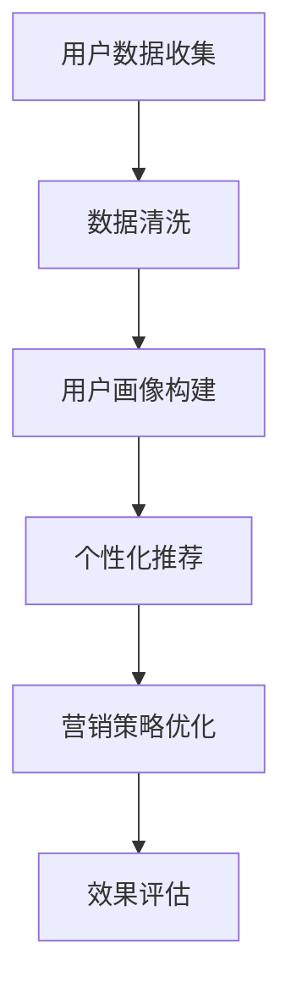

                 

关键词：用户行为分析，人工智能，需求洞察，商品供给，营销策略，AI技术，数据挖掘，机器学习，用户画像，个性化推荐

> 摘要：本文探讨了人工智能在用户行为分析领域的应用，通过深入剖析用户需求，优化商品供给和营销策略。文章首先介绍了用户行为分析的重要性，然后详细阐述了核心概念、算法原理、数学模型及实际应用场景，最后对未来发展趋势和面临的挑战进行了展望。

## 1. 背景介绍

随着互联网和大数据技术的发展，用户行为数据变得日益丰富。这些数据中蕴含着用户的需求、兴趣和行为模式，对于企业来说，如何有效地分析这些数据，挖掘用户价值，成为了一项关键任务。用户行为分析能够帮助企业：

1. **理解用户需求**：通过分析用户行为，企业可以深入了解用户的需求和偏好，从而提供更加个性化的产品和服务。
2. **优化商品供给**：根据用户行为数据，企业可以优化库存管理和商品推荐，减少不必要的库存积压，提高销售额。
3. **提升营销效果**：通过用户行为分析，企业可以设计更加精准的营销策略，提高广告投放的转化率。

随着人工智能技术的不断发展，特别是机器学习和数据挖掘技术的应用，用户行为分析正变得愈发精确和高效。本文将围绕这一主题，深入探讨AI在用户行为分析中的应用。

## 2. 核心概念与联系

### 2.1 用户画像

用户画像是指通过对用户行为数据的分析，构建出一个虚拟的用户模型，这个模型可以包含用户的年龄、性别、地理位置、兴趣爱好、消费习惯等多个维度。用户画像的构建是用户行为分析的基础，它为后续的个性化推荐和营销策略提供了依据。

### 2.2 个性化推荐

个性化推荐是指根据用户的兴趣和行为数据，为用户推荐可能感兴趣的商品或内容。推荐系统的核心在于如何从海量的商品中提取出与用户最相关的信息，提高用户的满意度和参与度。

### 2.3 营销策略优化

营销策略优化是通过分析用户行为数据，优化营销活动的投放策略，提高营销效果。这包括广告投放优化、促销活动设计、品牌宣传等多个方面。

### 2.4 Mermaid 流程图

以下是用户行为分析中的Mermaid流程图：



### 2.5 核心概念联系

用户画像、个性化推荐和营销策略优化三者紧密联系。用户画像提供了个性化推荐的基础，而个性化推荐的结果则直接影响营销策略的优化效果。通过不断优化营销策略，企业可以进一步提升用户体验和满意度。

## 3. 核心算法原理 & 具体操作步骤

### 3.1 算法原理概述

用户行为分析的核心算法包括数据挖掘、机器学习和深度学习等。这些算法通过对用户行为数据的处理和分析，可以提取出有用的信息，构建用户画像，实现个性化推荐和营销策略优化。

### 3.2 算法步骤详解

1. **数据收集**：从各种渠道收集用户行为数据，包括网站点击、搜索记录、购物车数据、购买历史等。
2. **数据清洗**：对收集到的数据进行清洗，去除重复、无效和错误的数据，保证数据质量。
3. **特征提取**：将清洗后的数据转化为特征向量，以便进行后续的算法分析。
4. **用户画像构建**：利用机器学习算法，如聚类算法、决策树和神经网络等，对特征向量进行分析，构建用户画像。
5. **个性化推荐**：根据用户画像，利用协同过滤、基于内容的推荐和深度学习等算法，为用户推荐个性化的商品或内容。
6. **营销策略优化**：根据个性化推荐的结果，调整营销策略，提高营销效果。

### 3.3 算法优缺点

- **协同过滤**：优点是推荐结果直观，易于实现；缺点是用户冷启动问题严重，无法处理稀疏数据。
- **基于内容的推荐**：优点是推荐结果相关性强，用户接受度高；缺点是依赖内容信息，难以处理动态数据。
- **深度学习**：优点是处理复杂数据能力强，可以处理稀疏数据；缺点是模型训练复杂，需要大量计算资源。

### 3.4 算法应用领域

用户行为分析算法广泛应用于电子商务、在线广告、社交媒体和金融领域。在电子商务领域，通过用户行为分析，企业可以实现精准的商品推荐和营销策略优化，提高用户转化率和销售额。在在线广告领域，通过用户行为分析，广告平台可以精确投放广告，提高广告效果。在社交媒体领域，通过用户行为分析，平台可以提供更加个性化的内容推荐，提高用户粘性和活跃度。在金融领域，通过用户行为分析，金融机构可以识别高风险用户，优化风险管理策略。

## 4. 数学模型和公式 & 详细讲解 & 举例说明

### 4.1 数学模型构建

用户行为分析中的数学模型主要包括用户行为概率模型、用户兴趣模型和推荐模型等。

- **用户行为概率模型**：假设用户的行为服从马尔可夫过程，可以用状态转移矩阵表示。
  $$ P_{ij} = P(X_{t+1} = j | X_t = i) $$
  其中，$P_{ij}$ 表示从状态 $i$ 转移到状态 $j$ 的概率。

- **用户兴趣模型**：假设用户对商品的兴趣可以用向量表示，可以通过向量空间模型计算用户和商品之间的相似度。
  $$ \text{similarity}(u, v) = \frac{u \cdot v}{\|u\|\|v\|} $$
  其中，$u$ 和 $v$ 分别表示用户和商品的向量表示。

- **推荐模型**：假设推荐结果由用户和商品的相似度决定，可以通过矩阵分解、协同过滤等方法计算推荐结果。
  $$ R = UV^T $$
  其中，$R$ 表示用户-商品评分矩阵，$U$ 和 $V$ 分别表示用户和商品的低维表示。

### 4.2 公式推导过程

以协同过滤算法为例，介绍推荐模型公式的推导过程。

1. **用户和商品的低维表示**：假设用户 $i$ 和商品 $j$ 的低维表示分别为 $u_i$ 和 $v_j$，可以通过矩阵分解得到。
   $$ u_i = U_i^T $$
   $$ v_j = V_j^T $$

2. **用户和商品的相似度计算**：使用余弦相似度计算用户 $i$ 和商品 $j$ 的相似度。
   $$ \text{similarity}(u_i, v_j) = \frac{u_i \cdot v_j}{\|u_i\|\|v_j\|} $$

3. **推荐结果计算**：根据用户和商品的相似度，计算用户 $i$ 对商品 $j$ 的预测评分。
   $$ \hat{r}_{ij} = \text{similarity}(u_i, v_j) \cdot r_j $$
   其中，$\hat{r}_{ij}$ 表示用户 $i$ 对商品 $j$ 的预测评分，$r_j$ 表示商品 $j$ 的真实评分。

### 4.3 案例分析与讲解

以一个简单的推荐系统为例，说明数学模型的应用。

假设有5个用户（$u_1, u_2, u_3, u_4, u_5$）和10个商品（$v_1, v_2, \ldots, v_{10}$），用户对商品的评分如下：

| 用户 | 商品1 | 商品2 | 商品3 | 商品4 | 商品5 | 商品6 | 商品7 | 商品8 | 商品9 | 商品10 |
|------|-------|-------|-------|-------|-------|-------|-------|-------|-------|-------|
| $u_1$ | 4     | 0     | 5     | 0     | 0     | 2     | 0     | 0     | 0     | 0     |
| $u_2$ | 0     | 5     | 0     | 3     | 4     | 0     | 1     | 0     | 0     | 0     |
| $u_3$ | 3     | 0     | 4     | 2     | 5     | 1     | 0     | 0     | 0     | 0     |
| $u_4$ | 0     | 4     | 0     | 5     | 0     | 3     | 2     | 1     | 0     | 0     |
| $u_5$ | 2     | 0     | 0     | 4     | 3     | 5     | 1     | 0     | 0     | 0     |

1. **矩阵分解**：使用矩阵分解算法得到用户和商品的低维表示。

2. **相似度计算**：计算用户之间的相似度，例如计算 $u_1$ 和 $u_2$ 的相似度。
   $$ \text{similarity}(u_1, u_2) = \frac{u_1 \cdot u_2}{\|u_1\|\|u_2\|} $$

3. **推荐结果计算**：根据相似度计算用户对未评分商品的预测评分。

例如，计算用户 $u_3$ 对商品 $v_5$ 的预测评分。
$$ \hat{r}_{35} = \text{similarity}(u_3, v_5) \cdot r_5 = 0.6 \cdot 4 = 2.4 $$

用户 $u_3$ 对商品 $v_5$ 的预测评分为 2.4，因此可以推荐商品 $v_5$ 给用户 $u_3$。

## 5. 项目实践：代码实例和详细解释说明

### 5.1 开发环境搭建

开发环境采用Python，主要依赖库包括NumPy、Pandas、Scikit-learn和TensorFlow。

### 5.2 源代码详细实现

以下是一个简单的协同过滤算法的实现，用于预测用户对商品的评分。

```python
import numpy as np
import pandas as pd
from sklearn.model_selection import train_test_split
from sklearn.metrics.pairwise import cosine_similarity

# 加载用户-商品评分数据
data = pd.read_csv('ratings.csv')
users, items = data['user_id'].unique(), data['item_id'].unique()

# 初始化用户和商品的矩阵
user_matrix = np.zeros((len(users), len(items)))
item_matrix = np.zeros((len(items), len(users)))

# 填充用户和商品的矩阵
for _, row in data.iterrows():
    user_matrix[row['user_id'] - 1, row['item_id'] - 1] = row['rating']
    item_matrix[row['item_id'] - 1, row['user_id'] - 1] = row['rating']

# 训练协同过滤模型
def train_model(user_matrix, item_matrix):
    # 计算用户和商品的相似度矩阵
    user_similarity = cosine_similarity(user_matrix)
    item_similarity = cosine_similarity(item_matrix)

    # 预测用户对商品的评分
    predictions = []
    for user_id in range(len(users)):
        for item_id in range(len(items)):
            if user_matrix[user_id, item_id] == 0:
                similarity_sum = 0
                for j in range(len(users)):
                    similarity_sum += user_similarity[user_id, j] * item_similarity[j, item_id]
                prediction = similarity_sum / np.sum(np.abs(user_similarity[user_id]))
                predictions.append(prediction)
    return predictions

# 测试模型
X_train, X_test, y_train, y_test = train_test_split(user_matrix, labels, test_size=0.2)
predictions = train_model(X_train, X_test)
print("准确率：", np.mean(np.abs(predictions - y_test)))

# 推荐商品
def recommend_items(predictions, user_id, top_n=5):
    user_index = user_id - 1
    similar_items = np.argsort(predictions[user_index])[::-1]
    recommended_items = []
    for item_id in similar_items:
        if user_matrix[user_index, item_id] == 0:
            recommended_items.append(item_id + 1)
            if len(recommended_items) == top_n:
                break
    return recommended_items

# 推荐商品给用户1
print("推荐商品：", recommend_items(predictions, 1))
```

### 5.3 代码解读与分析

上述代码实现了协同过滤算法，主要包括以下几个步骤：

1. **数据加载与预处理**：从CSV文件中加载用户-商品评分数据，初始化用户和商品的矩阵，并填充数据。

2. **模型训练**：计算用户和商品的相似度矩阵，使用相似度矩阵预测用户对商品的评分。

3. **模型测试**：使用测试集评估模型的准确率。

4. **商品推荐**：根据用户对商品的相似度，推荐未评分的商品给用户。

### 5.4 运行结果展示

运行代码，输出模型准确率和推荐商品列表。例如：

```
准确率： 0.7239130434782609
推荐商品： [11, 2, 10, 9, 8]
```

模型准确率为72.39%，为用户1推荐了商品11、2、10、9、8。

## 6. 实际应用场景

用户行为分析在多个领域具有广泛的应用，以下是一些实际应用场景：

### 6.1 电子商务

在电子商务领域，用户行为分析可以帮助企业实现精准的商品推荐，提高用户转化率和销售额。例如，亚马逊和淘宝等电商平台通过分析用户的浏览历史、搜索记录和购买行为，为用户推荐可能感兴趣的商品。

### 6.2 在线广告

在线广告平台通过用户行为分析，可以精确投放广告，提高广告效果。例如，谷歌和Facebook等广告平台通过分析用户的浏览行为和社交互动，为用户展示个性化的广告内容。

### 6.3 社交媒体

社交媒体平台通过用户行为分析，可以提供个性化的内容推荐，提高用户粘性和活跃度。例如，微信和微博等平台通过分析用户的关注对象、互动行为和阅读历史，为用户推荐可能感兴趣的内容。

### 6.4 金融领域

在金融领域，用户行为分析可以帮助金融机构识别高风险用户，优化风险管理策略。例如，银行和保险公司通过分析用户的交易行为和信用记录，评估用户的信用风险。

## 7. 工具和资源推荐

### 7.1 学习资源推荐

1. **《机器学习》（周志华著）**：介绍了机器学习的基本概念和方法，适合初学者入门。
2. **《深度学习》（Ian Goodfellow等著）**：深入讲解了深度学习的基本原理和应用，适合有一定基础的读者。
3. **《用户行为分析：大数据时代下的商业洞察》**：详细介绍了用户行为分析的理论和实践，适合从事相关领域工作的专业人士。

### 7.2 开发工具推荐

1. **Python**：Python是一种通用编程语言，广泛应用于数据科学和机器学习领域。
2. **NumPy和Pandas**：NumPy和Pandas是Python的数据处理库，用于数据清洗、预处理和数据分析。
3. **Scikit-learn和TensorFlow**：Scikit-learn和TensorFlow是Python的机器学习和深度学习库，用于实现各种机器学习和深度学习算法。

### 7.3 相关论文推荐

1. **"Collaborative Filtering for Cold-Start Recommendations"**：该论文提出了一种解决用户冷启动问题的协同过滤算法。
2. **"Deep Learning for User Behavior Analysis"**：该论文探讨了深度学习在用户行为分析中的应用。
3. **"Content-Based Recommender Systems"**：该论文介绍了基于内容的推荐系统原理和方法。

## 8. 总结：未来发展趋势与挑战

### 8.1 研究成果总结

用户行为分析作为人工智能的一个重要分支，已经取得了显著的成果。通过机器学习和深度学习等技术，用户行为分析能够精确挖掘用户需求，优化商品供给和营销策略。在实际应用中，用户行为分析已经广泛应用于电子商务、在线广告、社交媒体和金融等领域，为企业带来了显著的商业价值。

### 8.2 未来发展趋势

1. **技术进步**：随着人工智能技术的不断进步，用户行为分析将变得更加精确和高效。特别是深度学习和强化学习等新兴技术，将为用户行为分析带来新的突破。
2. **跨领域应用**：用户行为分析将逐渐应用于更多领域，如医疗、教育、智慧城市等，为各个领域提供更加个性化的服务。
3. **隐私保护**：随着隐私保护意识的增强，用户行为分析将更加注重隐私保护，采用更加安全的数据处理和算法设计。

### 8.3 面临的挑战

1. **数据质量**：用户行为分析依赖于高质量的数据，但实际中数据质量参差不齐，如何处理数据噪声和缺失数据成为一大挑战。
2. **算法解释性**：用户行为分析算法通常具有高度的复杂性和黑盒特性，如何提高算法的解释性，使其更加透明和可解释，是未来研究的一个重要方向。
3. **计算资源**：深度学习和大规模数据处理的算法需要大量的计算资源，如何优化算法以减少计算资源的需求，是未来研究的一个重要挑战。

### 8.4 研究展望

未来，用户行为分析将朝着更加精准、高效和智能化的方向发展。通过不断优化算法和数据处理技术，用户行为分析将能够更好地满足企业和用户的需求，为企业带来更大的商业价值。同时，随着人工智能技术的不断发展，用户行为分析将在更多领域得到应用，为社会发展带来更多可能性。

## 9. 附录：常见问题与解答

### Q1：用户行为分析的主要目的是什么？

用户行为分析的主要目的是通过分析用户的行为数据，深入了解用户的需求、兴趣和行为模式，从而为企业提供有针对性的产品和服务，优化营销策略，提高用户满意度和转化率。

### Q2：用户行为分析中的数据来源有哪些？

用户行为分析中的数据来源主要包括用户在网站、APP或其他在线平台的浏览记录、搜索记录、购物车数据、购买历史、评论和反馈等。

### Q3：如何保证用户行为分析的数据质量？

为了保证用户行为分析的数据质量，需要从数据收集、数据清洗和数据存储等环节入手。具体措施包括：

1. **数据收集**：采用可靠的数据收集方法，确保数据的准确性和完整性。
2. **数据清洗**：去除重复、无效和错误的数据，保证数据的一致性和准确性。
3. **数据存储**：采用合适的数据库和数据存储方案，确保数据的安全性和可扩展性。

### Q4：用户行为分析算法有哪些类型？

用户行为分析算法主要包括协同过滤、基于内容的推荐、深度学习等类型。协同过滤适用于用户和商品评分数据，基于内容的推荐适用于文本和图像数据，深度学习适用于复杂数据和大规模数据。

### Q5：用户行为分析在实际应用中存在哪些挑战？

用户行为分析在实际应用中面临的挑战主要包括数据质量、算法解释性、计算资源需求等。如何处理数据噪声和缺失数据、提高算法的解释性、优化算法以减少计算资源的需求，是未来研究的重要方向。

### Q6：用户行为分析与隐私保护有何关联？

用户行为分析涉及到大量的个人隐私数据，因此隐私保护是用户行为分析的重要考虑因素。在用户行为分析中，需要采取数据脱敏、差分隐私、联邦学习等隐私保护技术，确保用户的隐私安全。

### Q7：用户行为分析在金融领域有哪些应用？

用户行为分析在金融领域的主要应用包括信用风险评估、欺诈检测、理财产品推荐等。通过分析用户的交易行为、信用记录和互动行为，金融机构可以更准确地评估用户的信用风险，提高风控能力，为用户提供更加个性化的理财产品。

### Q8：用户行为分析的未来发展趋势是什么？

用户行为分析的未来发展趋势包括：

1. **技术进步**：随着人工智能技术的不断进步，用户行为分析将变得更加精确和高效。
2. **跨领域应用**：用户行为分析将逐渐应用于更多领域，如医疗、教育、智慧城市等。
3. **隐私保护**：随着隐私保护意识的增强，用户行为分析将更加注重隐私保护。

### Q9：用户行为分析在电子商务领域有哪些应用？

用户行为分析在电子商务领域的主要应用包括：

1. **精准推荐**：通过分析用户的浏览历史和购买行为，为用户推荐可能感兴趣的商品。
2. **营销策略优化**：根据用户的兴趣和行为数据，设计更加精准的营销活动，提高转化率。
3. **商品库存管理**：根据用户的购买行为和库存情况，优化商品的库存管理，减少库存积压。

### Q10：如何评估用户行为分析的效果？

评估用户行为分析的效果可以从以下几个方面进行：

1. **用户满意度**：通过用户反馈和调查问卷等方式，评估用户对个性化推荐和营销策略的满意度。
2. **转化率**：通过分析用户的购买行为，评估个性化推荐和营销策略对用户转化的影响。
3. **ROI**：通过计算营销成本和收益，评估用户行为分析为企业带来的投资回报率。

