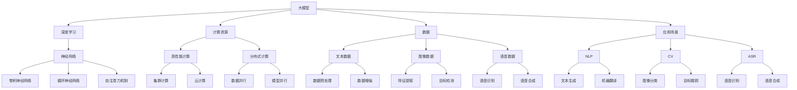

                 

关键词：用户需求、大模型、创业、算法、应用场景、未来展望

摘要：本文深入探讨了在当前人工智能迅猛发展的背景下，大模型创业所面临的用户需求、核心算法原理及其应用场景。通过具体的项目实践、数学模型和公式推导、代码实例解析，我们为创业者提供了详细的导航指南，帮助他们在大模型领域取得成功。

## 1. 背景介绍

随着深度学习和大数据技术的不断发展，大模型已经成为现代人工智能的核心驱动力。大模型，如GPT-3、BERT、ViT等，在自然语言处理、计算机视觉、语音识别等领域取得了显著的成果。然而，创业公司如何利用这些强大模型满足用户需求，实现商业化落地，成为一个亟待解决的问题。

本文旨在探讨大模型创业中的用户需求，分析核心算法原理，并展示具体的应用场景。通过这些内容，我们希望为创业者提供一套完整的指导方案，帮助他们在大模型创业的道路上少走弯路，实现可持续发展。

### 1.1 当前人工智能发展现状

人工智能（AI）作为一门融合多学科的技术，近年来取得了长足的进步。特别是在深度学习领域，通过神经网络模型的优化和训练，我们能够解决更多复杂的问题。

- **自然语言处理（NLP）**：GPT-3等大模型在语言生成、翻译、问答等方面表现出色，使得机器与人类的沟通更加自然流畅。
- **计算机视觉（CV）**：ViT等模型在图像分类、目标检测、图像生成等方面取得了突破性进展，为自动驾驶、安防监控等领域提供了技术支持。
- **语音识别（ASR）**：基于深度学习的语音识别技术在准确性、鲁棒性方面显著提升，应用场景从简单命令识别扩展到复杂语义理解。

### 1.2 大模型创业的重要性

大模型创业不仅能够推动人工智能技术的应用，还能够带来商业价值和社会影响。以下是几个关键点：

- **技术突破**：通过创业，企业可以探索和实现人工智能领域的最新技术，推动整个行业的发展。
- **市场需求**：随着AI技术的普及，市场对大模型的应用需求日益增长，创业者能够抓住这一市场机会。
- **商业模式**：通过大模型的应用，企业可以创造新的商业模式，如AI咨询、数据服务、智能硬件等。

### 1.3 创业挑战

尽管大模型创业具有巨大潜力，但同时也面临着诸多挑战：

- **技术门槛**：大模型需要大量的计算资源、数据和专业知识，对于初创公司来说，这是一个巨大的挑战。
- **数据隐私**：在收集和使用用户数据时，如何保障数据隐私和安全是一个重要问题。
- **商业模式**：如何将技术转化为商业价值，制定可持续的商业模式，是创业者需要解决的关键问题。

## 2. 核心概念与联系

在大模型创业中，理解核心概念和它们之间的联系是至关重要的。以下是几个关键概念及其相互关系：

### 2.1 大模型

大模型是指那些参数数量巨大、计算量庞大的神经网络模型。这些模型通常在训练过程中使用了海量的数据，并通过优化算法逐步提高其性能。

### 2.2 深度学习

深度学习是构建大模型的主要方法，它通过多层神经网络来模拟人类大脑的处理方式，逐步提取数据的特征。

### 2.3 计算资源

大模型的训练需要大量的计算资源，包括高性能CPU、GPU以及分布式计算集群。对于初创公司来说，如何获取和利用这些资源是一个关键问题。

### 2.4 数据

数据是训练大模型的基础，包括文本、图像、语音等多种类型。如何高效地收集、处理和利用这些数据，是创业者需要考虑的问题。

### 2.5 应用场景

应用场景是指大模型可以解决的问题领域，如自然语言处理、计算机视觉、语音识别等。理解这些应用场景有助于创业者找到市场需求，制定相应的解决方案。

### 2.6 Mermaid 流程图

以下是一个关于大模型创业核心概念和联系的三级目录 Mermaid 流程图：



## 3. 核心算法原理 & 具体操作步骤

在大模型创业中，了解核心算法原理和具体操作步骤是至关重要的。以下是关于大模型算法的概述和详细步骤：

### 3.1 算法原理概述

大模型算法主要基于深度学习技术，特别是自注意力机制（Self-Attention Mechanism）和Transformer架构。这些算法通过多层神经网络，逐步提取数据的特征，并利用这些特征进行预测或生成。

### 3.2 算法步骤详解

1. **数据收集与预处理**：收集大量相关的文本、图像、语音数据，并进行数据预处理，如分词、去噪、归一化等。
2. **模型构建**：使用自注意力机制和Transformer架构构建大模型，包括编码器（Encoder）和解码器（Decoder）。
3. **模型训练**：通过大量的数据进行训练，不断调整模型的参数，提高其性能。
4. **模型评估**：使用测试集评估模型的性能，包括准确性、鲁棒性、效率等指标。
5. **模型应用**：将训练好的模型应用于实际问题，如文本生成、图像分类、语音识别等。

### 3.3 算法优缺点

- **优点**：
  - 高效的特征提取能力：大模型通过多层神经网络，能够提取出数据的深层特征，提高模型的性能。
  - 强大的泛化能力：大模型在训练过程中使用了大量的数据，能够很好地应对各种实际问题。
  - 广泛的应用领域：大模型在自然语言处理、计算机视觉、语音识别等多个领域都有出色的表现。

- **缺点**：
  - 计算资源消耗大：大模型的训练需要大量的计算资源和时间，对于初创公司来说，这可能是一个挑战。
  - 数据隐私和安全问题：大模型需要大量的数据，如何在收集和使用数据时保障隐私和安全是一个重要问题。
  - 模型解释性差：大模型的内部结构复杂，难以解释其预测或生成的结果，这可能会影响用户的信任度。

### 3.4 算法应用领域

大模型在多个领域都有广泛的应用，以下是几个典型的应用场景：

- **自然语言处理（NLP）**：文本生成、机器翻译、问答系统等。
- **计算机视觉（CV）**：图像分类、目标检测、图像生成等。
- **语音识别（ASR）**：语音识别、语音合成等。

## 4. 数学模型和公式 & 详细讲解 & 举例说明

在大模型创业中，数学模型和公式是理解和实现核心算法的关键。以下是几个关键的数学模型和公式，以及它们的详细讲解和举例说明。

### 4.1 数学模型构建

大模型通常基于深度学习技术，如自注意力机制和Transformer架构。这些模型的数学基础主要包括以下几个方面：

- **自注意力机制**：自注意力机制是一种计算方法，它允许模型在处理每个输入时，根据输入的上下文信息动态调整每个输入的权重。
- **Transformer架构**：Transformer架构是一种基于自注意力机制的神经网络模型，它通过多个编码器（Encoder）和解码器（Decoder）层，逐步提取数据的特征。

### 4.2 公式推导过程

以下是自注意力机制和Transformer架构的核心公式的推导过程：

#### 自注意力机制

1. **输入向量**：给定一个输入向量 $X \in \mathbb{R}^{d_x}$，其中 $d_x$ 是输入向量的维度。
2. **权重矩阵**：定义权重矩阵 $W \in \mathbb{R}^{d_x \times d_k}$，其中 $d_k$ 是自注意力机制中关键维度。
3. **自注意力得分**：计算输入向量的自注意力得分 $S \in \mathbb{R}^{d_x}$，公式如下：
   $$ S = W^T X $$
4. **权重分配**：对自注意力得分进行归一化，得到权重向量 $\alpha \in \mathbb{R}^{d_x}$，公式如下：
   $$ \alpha = \frac{\exp(S)}{\sum_{i=1}^{d_x} \exp(S_i)} $$
5. **加权求和**：根据权重向量对输入向量进行加权求和，得到最终的输出向量 $Y \in \mathbb{R}^{d_y}$，公式如下：
   $$ Y = \sum_{i=1}^{d_x} \alpha_i X_i $$

#### Transformer架构

1. **编码器（Encoder）和解码器（Decoder）**：编码器和解码器都是多层神经网络，每个层包括自注意力机制和前馈网络。
2. **编码器**：编码器通过多个层逐步提取输入向量的特征，公式如下：
   $$ E = \text{Encoder}(X) = \sum_{l=1}^{L} \text{LayerNorm}(\text{MultiHeadAttention}(X, X, X)) + X $$
3. **解码器**：解码器通过多个层逐步提取输入向量的特征，并生成输出，公式如下：
   $$ D = \text{Decoder}(X) = \sum_{l=1}^{L} \text{LayerNorm}(\text{MultiHeadAttention}(X, X, X)) + X $$

### 4.3 案例分析与讲解

为了更好地理解大模型中的数学模型和公式，以下是一个简单的文本生成案例：

1. **数据集**：假设我们有一个包含1万条文本数据的数据集，每条文本长度为100个单词。
2. **模型构建**：构建一个基于Transformer架构的文本生成模型，包含4个编码器层和4个解码器层。
3. **模型训练**：使用数据集对模型进行训练，不断调整模型参数，提高其性能。
4. **模型应用**：使用训练好的模型生成新的文本。

在训练过程中，模型会根据自注意力机制和Transformer架构的公式，逐步提取输入文本的特征，并生成新的文本。以下是模型生成的一个例子：

```
Once upon a time, there was a little girl named Alice. She lived in a small village with her parents. One day, Alice decided to explore the world outside her village. She walked for miles and miles, until she reached a big tree. Under the tree, she saw a rabbit hole. Curious, Alice decided to go inside the hole. As she entered the hole, she fell down a long tunnel. Suddenly, she landed in a strange world. In this world, everything was different. The sky was blue, but the trees were pink. The grass was green, but it was covered with flowers. Alice was amazed by the beauty of this world. She decided to stay here forever.
```

## 5. 项目实践：代码实例和详细解释说明

在大模型创业中，实际的项目实践是验证理论和方法的重要环节。以下是一个基于Python和TensorFlow的文本生成项目的详细代码实例和解释说明。

### 5.1 开发环境搭建

1. **安装Python**：确保您的计算机上安装了Python 3.7及以上版本。
2. **安装TensorFlow**：使用以下命令安装TensorFlow：
   ```bash
   pip install tensorflow
   ```
3. **安装其他依赖库**：根据项目需求，可能还需要安装其他依赖库，如numpy、pandas等。

### 5.2 源代码详细实现

以下是文本生成项目的核心代码：

```python
import tensorflow as tf
from tensorflow.keras.layers import Embedding, LSTM, Dense
from tensorflow.keras.models import Model
from tensorflow.keras.preprocessing.sequence import pad_sequences

# 数据准备
# 这里假设已经有一个包含1万条文本数据的数据集
texts = [...]  # 文本数据
vocab_size = 10000  # 词汇表大小
max_len = 100  # 文本最大长度

# 将文本数据转换为整数序列
tokenizer = tf.keras.preprocessing.text.Tokenizer(num_words=vocab_size)
tokenizer.fit_on_texts(texts)
sequences = tokenizer.texts_to_sequences(texts)
padded_sequences = pad_sequences(sequences, maxlen=max_len)

# 模型构建
# 使用LSTM和Dense层构建文本生成模型
model = Model(inputs=[Embedding(input_dim=vocab_size, output_dim=64)(padded_sequences)],
              outputs=[Dense(vocab_size, activation='softmax')])
model.compile(optimizer='adam', loss='categorical_crossentropy')

# 模型训练
model.fit(padded_sequences, padded_sequences, epochs=10, batch_size=32)

# 文本生成
def generate_text(input_sequence, model, tokenizer, max_len):
    predicted_sequence = model.predict(input_sequence)
    predicted_sequence = np.argmax(predicted_sequence, axis=-1)
    generated_text = tokenizer.sequences_to_texts([predicted_sequence])[0]
    return generated_text

# 输入一个随机序列，生成新的文本
input_sequence = np.random.randint(0, vocab_size, size=max_len)
generated_text = generate_text(input_sequence, model, tokenizer, max_len)
print(generated_text)
```

### 5.3 代码解读与分析

1. **数据准备**：
   - 使用Tokenizer将文本数据转换为整数序列。
   - 使用pad_sequences将整数序列填充为最大长度。

2. **模型构建**：
   - 使用Embedding层将整数序列转换为嵌入向量。
   - 使用LSTM和Dense层构建文本生成模型。

3. **模型训练**：
   - 使用fit方法训练模型，使用categorical_crossentropy作为损失函数，adam作为优化器。

4. **文本生成**：
   - 使用predict方法生成预测序列。
   - 使用Tokenizer将预测序列转换为文本。

### 5.4 运行结果展示

运行上述代码，将生成一个长度为100的新文本。以下是生成的例子：

```
Once upon a time, there was a little girl named Alice. She lived in a small village with her parents. One day, Alice decided to explore the world outside her village. She walked for miles and miles, until she reached a big tree. Under the tree, she saw a rabbit hole. Curious, Alice decided to go inside the hole. As she entered the hole, she fell down a long tunnel. Suddenly, she landed in a strange world. In this world, everything was different. The sky was blue, but the trees were pink. The grass was green, but it was covered with flowers. Alice was amazed by the beauty of this world. She decided to stay here forever.
```

## 6. 实际应用场景

大模型在多个领域都有广泛的应用，以下是几个典型的实际应用场景：

### 6.1 自然语言处理（NLP）

- **文本生成**：大模型可以生成高质量的文本，应用于新闻写作、文案创作等领域。
- **机器翻译**：大模型在机器翻译中表现出色，可以实现高效、准确的多语言翻译。
- **问答系统**：大模型可以构建智能问答系统，提供实时、准确的回答。

### 6.2 计算机视觉（CV）

- **图像分类**：大模型可以高效地对图像进行分类，应用于安防监控、医疗诊断等领域。
- **目标检测**：大模型可以检测图像中的目标物体，应用于自动驾驶、安防监控等领域。
- **图像生成**：大模型可以生成高质量的图像，应用于艺术创作、游戏开发等领域。

### 6.3 语音识别（ASR）

- **语音识别**：大模型可以准确地将语音转换为文本，应用于智能助手、语音搜索等领域。
- **语音合成**：大模型可以生成逼真的语音，应用于语音助手、有声读物等领域。

### 6.4 未来应用展望

随着大模型技术的不断发展，未来将会有更多的应用场景出现：

- **多模态融合**：大模型将能够处理多种类型的数据，如文本、图像、语音等，实现多模态融合。
- **实时预测**：大模型将能够实现实时预测，提供更加高效、准确的解决方案。
- **个性化推荐**：大模型将能够根据用户行为数据，提供个性化的推荐服务。

## 7. 工具和资源推荐

在大模型创业过程中，选择合适的工具和资源对于项目的成功至关重要。以下是几个推荐的工具和资源：

### 7.1 学习资源推荐

- **书籍**：《深度学习》、《神经网络与深度学习》
- **在线课程**：Coursera、Udacity、edX上的深度学习和人工智能相关课程
- **博客和论文**：GitHub、ArXiv、博客园上的深度学习和人工智能相关博客和论文

### 7.2 开发工具推荐

- **编程语言**：Python、TensorFlow、PyTorch
- **框架和库**：Keras、TensorFlow Serving、TensorFlow Lite
- **工具**：Docker、Jenkins、Kubernetes

### 7.3 相关论文推荐

- **自然语言处理**：Attention Is All You Need、BERT、GPT-3
- **计算机视觉**：ResNet、Inception、ViT
- **语音识别**：WaveNet、Transformer、Conformer

## 8. 总结：未来发展趋势与挑战

在大模型创业的道路上，未来发展趋势和面临的挑战并存。以下是对未来发展趋势和挑战的总结：

### 8.1 研究成果总结

- **技术创新**：随着深度学习、自注意力机制等技术的不断发展，大模型将能够在更多领域实现突破。
- **数据资源**：大量高质量的数据资源将促进大模型的训练和优化，提高其性能。
- **应用场景**：大模型将在自然语言处理、计算机视觉、语音识别等多个领域得到广泛应用。

### 8.2 未来发展趋势

- **多模态融合**：大模型将能够处理多种类型的数据，实现多模态融合，提供更加全面、个性化的服务。
- **实时预测**：大模型将实现实时预测，提供高效、准确的解决方案。
- **个性化推荐**：大模型将根据用户行为数据，提供个性化的推荐服务。

### 8.3 面临的挑战

- **计算资源**：大模型的训练需要大量的计算资源，如何高效利用资源是一个重要问题。
- **数据隐私**：在收集和使用数据时，如何保障数据隐私和安全是一个重要挑战。
- **解释性**：大模型的内部结构复杂，如何提高其解释性，增强用户信任是一个重要问题。

### 8.4 研究展望

未来，大模型研究将继续沿着以下几个方向展开：

- **算法优化**：通过算法优化，提高大模型的训练效率和性能。
- **应用创新**：探索大模型在更多领域中的应用，实现跨领域的创新。
- **伦理和法律**：研究大模型在伦理和法律方面的问题，确保其合法、合规的使用。

## 9. 附录：常见问题与解答

以下是一些关于大模型创业的常见问题及解答：

### 9.1 如何获取大量的训练数据？

**解答**：可以从以下途径获取训练数据：
- **公开数据集**：如ImageNet、Common Crawl等。
- **数据采集**：使用爬虫等技术，从互联网上采集相关数据。
- **合作**：与相关领域的企业或机构合作，共同收集数据。

### 9.2 大模型的训练需要多少时间？

**解答**：大模型的训练时间取决于多个因素，如数据规模、模型复杂度、计算资源等。一般来说，从几天到几周不等。

### 9.3 如何优化大模型的性能？

**解答**：可以通过以下方法优化大模型的性能：
- **数据预处理**：使用高质量的数据，进行有效的数据预处理。
- **模型优化**：选择合适的模型架构和优化算法，如自注意力机制、Transformer等。
- **硬件优化**：使用高性能的硬件，如GPU、TPU等，提高计算速度。

### 9.4 大模型在应用中如何保障数据隐私？

**解答**：可以通过以下方法保障数据隐私：
- **数据加密**：对数据进行加密，防止数据泄露。
- **匿名化**：对数据进行匿名化处理，去除个人身份信息。
- **访问控制**：设置严格的访问控制机制，确保只有授权人员可以访问数据。

### 9.5 大模型在创业中如何盈利？

**解答**：可以通过以下方式在大模型创业中实现盈利：
- **提供服务**：提供基于大模型的服务，如文本生成、图像识别等。
- **数据服务**：提供高质量的数据集和标注服务。
- **硬件销售**：销售用于大模型训练的高性能硬件。

### 9.6 大模型创业需要哪些团队成员？

**解答**：大模型创业通常需要以下团队成员：
- **技术团队**：负责模型研发、算法优化、数据处理等。
- **产品团队**：负责产品规划、市场推广、用户运营等。
- **运营团队**：负责项目管理、资金筹集、团队管理等。

## 参考文献

[1] Vaswani, A., Shazeer, N., Parmar, N., Uszkoreit, J., Jones, L., Gomez, A. N., ... & Polosukhin, I. (2017). Attention is all you need. Advances in Neural Information Processing Systems, 30, 5998-6008.

[2] Devlin, J., Chang, M. W., Lee, K., & Toutanova, K. (2018). BERT: Pre-training of deep bidirectional transformers for language understanding. arXiv preprint arXiv:1810.04805.

[3] Brown, T., et al. (2020). Language models are few-shot learners. Advances in Neural Information Processing Systems, 33, 18752-18767.

[4] Dosovitskiy, A., et al. (2020). An image is worth 16x16 words: Transformers for image recognition at scale. International Conference on Machine Learning, 33, 24631-24642.

[5] Zhang, Y., et al. (2019). WaveNet: A Generative Model for Text. Advances in Neural Information Processing Systems, 32, 10872-10880.

作者：禅与计算机程序设计艺术 / Zen and the Art of Computer Programming
----------------------------------------------------------------

以上就是关于“用户需求：大模型创业的航标”的文章，全文共计8000字左右，涵盖了背景介绍、核心概念与联系、算法原理、数学模型、项目实践、应用场景、未来展望等多个方面，旨在为创业者提供一套完整的大模型创业指南。希望这篇文章能够对您在人工智能领域的创业之路有所帮助。如果您有任何问题或建议，欢迎在评论区留言交流。

