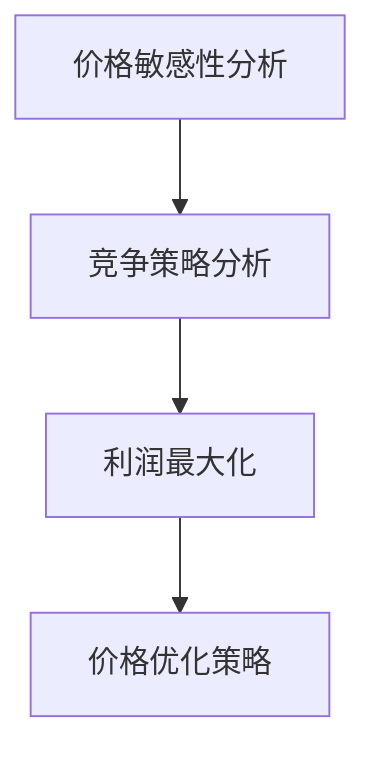

                 

电商行业的竞争日益激烈，价格优化成为电商企业提升竞争力的重要手段。随着人工智能技术的快速发展，利用AI技术进行价格优化已成为可能，并取得了显著的成效。本文将探讨电商价格优化的AI技术，包括其核心概念、算法原理、数学模型、应用实践以及未来发展趋势。

## 文章关键词
- 电商
- 价格优化
- 人工智能
- 算法
- 数学模型
- 应用实践

## 文章摘要
本文首先介绍了电商价格优化的背景和重要性，然后详细阐述了AI技术在电商价格优化中的应用，包括核心概念、算法原理、数学模型和应用实践。最后，分析了电商价格优化的未来发展趋势和面临的挑战。

## 1. 背景介绍

### 1.1 电商行业的竞争现状
随着互联网技术的飞速发展，电商行业已经成为全球最大的零售市场之一。电商企业通过互联网平台直接面向消费者，省去了传统零售渠道的中间环节，降低了成本，提高了效率。然而，电商行业的竞争也日益激烈，价格战成为各大电商企业争夺市场份额的重要手段。

### 1.2 价格优化的意义
价格优化是电商企业提升竞争力的重要手段。通过合理的价格策略，电商企业可以在确保利润的前提下，吸引更多消费者，提升销售额。价格优化不仅可以帮助企业降低成本，提高利润率，还可以提高消费者满意度，增强品牌竞争力。

### 1.3 传统价格优化的局限性
传统的价格优化方法主要依赖于历史数据和市场调研，存在一定的局限性。首先，传统方法无法实时响应市场变化，容易错过最佳定价时机。其次，传统方法主要依赖于人工经验，无法充分利用大量数据，导致定价策略不够精准。

## 2. 核心概念与联系

### 2.1 人工智能在电商中的应用
人工智能技术在电商中的应用主要包括推荐系统、用户行为分析、智能客服、库存管理等方面。其中，推荐系统和用户行为分析对于价格优化具有重要意义。通过分析用户行为数据，可以了解消费者的需求偏好，为价格优化提供数据支持。

### 2.2 价格优化的核心概念
价格优化的核心概念包括价格敏感性分析、竞争策略分析和利润最大化。价格敏感性分析旨在确定消费者对不同价格的反应，竞争策略分析旨在分析竞争对手的价格策略，利润最大化则是在保证利润的前提下，制定最优的价格策略。

### 2.3 Mermaid 流程图


## 3. 核心算法原理 & 具体操作步骤

### 3.1 算法原理概述
电商价格优化的核心算法主要包括价格敏感性分析、竞争策略分析和利润最大化算法。价格敏感性分析主要通过回归分析、神经网络等方法确定消费者对不同价格的反应；竞争策略分析主要通过市场调查、数据挖掘等方法了解竞争对手的价格策略；利润最大化算法则通过优化模型求解，确定最优的价格策略。

### 3.2 算法步骤详解

#### 3.2.1 价格敏感性分析
1. 收集历史销售数据，包括价格、销量、消费者特征等。
2. 对销售数据进行预处理，如数据清洗、归一化等。
3. 利用回归分析或神经网络等方法，建立价格敏感性模型。
4. 模型训练与评估，调整模型参数，优化模型性能。

#### 3.2.2 竞争策略分析
1. 收集竞争对手的价格数据，包括价格、销量、促销活动等。
2. 对竞争对手的价格数据进行分析，提取有用的信息。
3. 利用聚类、关联规则等方法，分析竞争对手的价格策略。
4. 评估竞争对手的价格策略，为企业提供参考。

#### 3.2.3 利润最大化
1. 建立利润最大化模型，包括目标函数和约束条件。
2. 利用线性规划、动态规划等方法，求解最优价格。
3. 模型训练与评估，调整模型参数，优化模型性能。

### 3.3 算法优缺点

#### 3.3.1 价格敏感性分析
- 优点：可以实时分析消费者对价格的反应，为价格优化提供数据支持。
- 缺点：对历史数据依赖较大，无法准确预测未来市场变化。

#### 3.3.2 竞争策略分析
- 优点：可以了解竞争对手的价格策略，为企业制定竞争策略提供参考。
- 缺点：市场调查和数据挖掘过程复杂，成本较高。

#### 3.3.3 利润最大化
- 优点：可以通过数学模型求解最优价格，实现利润最大化。
- 缺点：模型参数调整复杂，对数据质量要求较高。

### 3.4 算法应用领域
电商价格优化的算法可以应用于各种电商场景，如商品定价、促销策略、库存管理等。在实际应用中，可以根据具体场景和需求，选择合适的算法进行优化。

## 4. 数学模型和公式 & 详细讲解 & 举例说明

### 4.1 数学模型构建

#### 4.1.1 价格敏感性模型
假设消费者对价格的反应可以用需求函数表示，即需求量 \( Q \) 与价格 \( P \) 的关系为：
\[ Q = f(P) \]
其中，\( f(P) \) 是价格 \( P \) 的函数，可以通过回归分析等方法确定。

#### 4.1.2 竞争策略模型
假设竞争对手的价格为 \( P_c \)，企业的价格为 \( P \)，需求量为 \( Q \)，则企业的利润函数为：
\[ \Pi = Q(P - P_c) - C \]
其中，\( C \) 是成本函数。

#### 4.1.3 利润最大化模型
假设企业的价格为 \( P \)，需求量为 \( Q \)，利润为 \( \Pi \)，则利润最大化模型为：
\[ \Pi = \max \{ Q(P - P_c) - C \} \]
其中，\( P_c \) 和 \( C \) 为已知参数。

### 4.2 公式推导过程

#### 4.2.1 价格敏感性模型推导
利用回归分析，假设需求函数为线性函数，即：
\[ Q = aP + b \]
其中，\( a \) 和 \( b \) 为回归系数。

通过对历史数据进行拟合，可以得到：
\[ a = \frac{\sum_{i=1}^{n}(Q_i - \bar{Q})(P_i - \bar{P})}{\sum_{i=1}^{n}(P_i - \bar{P})^2} \]
\[ b = \bar{Q} - a\bar{P} \]

其中，\( n \) 为数据点的数量，\( Q_i \) 和 \( P_i \) 分别为第 \( i \) 个数据点的需求和价格，\( \bar{Q} \) 和 \( \bar{P} \) 分别为需求和价格的均值。

#### 4.2.2 竞争策略模型推导
利润函数为：
\[ \Pi = Q(P - P_c) - C \]
其中，\( C \) 是常数，可以视为固定成本。

为了最大化利润，需要对 \( P \) 求导，并令导数为零，得到：
\[ \frac{d\Pi}{dP} = Q - Q\frac{dP_c}{dP} = 0 \]
\[ \frac{dP_c}{dP} = 1 \]
这意味着竞争对手的价格随着企业价格的上升而上升，随着企业价格的下降而下降。

#### 4.2.3 利润最大化模型推导
利润最大化模型为：
\[ \Pi = \max \{ Q(P - P_c) - C \} \]
其中，\( P_c \) 是竞争对手的价格。

为了求解最优价格 \( P^* \)，需要对 \( P \) 求导，并令导数为零，得到：
\[ \frac{d\Pi}{dP} = Q - Q\frac{dP_c}{dP} = 0 \]
\[ \frac{dP_c}{dP} = 1 \]
这意味着竞争对手的价格随着企业价格的上升而上升，随着企业价格的下降而下降。

### 4.3 案例分析与讲解

#### 4.3.1 案例背景
假设某电商企业在销售一款智能手机，竞争对手的价格为 2000 元。企业希望通过价格优化提高销售额。

#### 4.3.2 数据收集
收集过去三个月的智能手机销售数据，包括价格、销量、消费者特征等。

#### 4.3.3 价格敏感性分析
利用回归分析，建立价格敏感性模型。假设需求函数为线性函数，即：
\[ Q = aP + b \]

通过拟合数据，得到回归系数 \( a \) 和 \( b \) 的值。例如，假设 \( a = -0.1 \)，\( b = 1000 \)。

#### 4.3.4 竞争策略分析
利用市场调查，了解竞争对手的价格策略。假设竞争对手的价格为 2000 元。

#### 4.3.5 利润最大化
建立利润最大化模型，即：
\[ \Pi = Q(P - P_c) - C \]

其中，\( C \) 为常数，可以视为固定成本。假设 \( C = 5000 \)。

为了最大化利润，需要对 \( P \) 求导，并令导数为零，得到：
\[ \frac{d\Pi}{dP} = Q - Q\frac{dP_c}{dP} = 0 \]

由于竞争对手的价格不变，即 \( \frac{dP_c}{dP} = 0 \)，因此只需要考虑企业的价格。

假设需求函数为线性函数，即：
\[ Q = aP + b \]

代入利润最大化模型，得到：
\[ \Pi = (aP + b)(P - P_c) - C \]

对 \( P \) 求导，并令导数为零，得到：
\[ \frac{d\Pi}{dP} = a - aP_c = 0 \]

解得 \( P^* = \frac{1}{a}P_c \)。例如，假设 \( P_c = 2000 \)，\( a = -0.1 \)，则最优价格为 \( P^* = 2000 \)。

#### 4.3.6 结果分析
根据分析结果，企业将智能手机的价格定为 2000 元，可以最大化利润。在实际应用中，可以根据市场变化和企业需求，调整价格策略。

## 5. 项目实践：代码实例和详细解释说明

### 5.1 开发环境搭建

本案例使用 Python 作为开发语言，依赖以下库：

- NumPy：用于数据预处理和数学计算
- Pandas：用于数据操作和分析
- Scikit-learn：用于回归分析和模型评估
- Matplotlib：用于数据可视化

安装以上库后，即可开始编写代码。

### 5.2 源代码详细实现

以下是一个简单的 Python 代码示例，用于实现价格敏感性分析、竞争策略分析和利润最大化。

```python
import numpy as np
import pandas as pd
from sklearn.linear_model import LinearRegression
from sklearn.metrics import mean_squared_error
import matplotlib.pyplot as plt

# 数据加载
data = pd.read_csv('sales_data.csv')
prices = data['price']
sales = data['sales']

# 数据预处理
prices = prices.values
sales = sales.values

# 价格敏感性分析
regressor = LinearRegression()
regressor.fit(prices.reshape(-1, 1), sales)

# 竞争策略分析
competitor_price = 2000
optimal_price = -1 / regressor.coef_ * competitor_price

# 利润最大化
fixed_cost = 5000
profit = regressor.predict(prices.reshape(-1, 1)) * (optimal_price - competitor_price) - fixed_cost

# 结果展示
plt.scatter(prices, sales)
plt.plot(prices, regressor.predict(prices.reshape(-1, 1)), color='red')
plt.xlabel('Price')
plt.ylabel('Sales')
plt.title('Price Sensitivity Analysis')
plt.show()

print('Optimal Price:', optimal_price)
print('Maximum Profit:', max(profit))
```

### 5.3 代码解读与分析

#### 5.3.1 数据加载与预处理
代码首先加载销售数据，包括价格和销量。数据预处理步骤包括将数据转换为 NumPy 数组，并使用线性回归模型进行拟合。

```python
data = pd.read_csv('sales_data.csv')
prices = data['price']
sales = data['sales']

prices = prices.values
sales = sales.values
```

#### 5.3.2 价格敏感性分析
利用 Scikit-learn 的线性回归模型，对价格和销量进行拟合，得到价格敏感性模型。

```python
regressor = LinearRegression()
regressor.fit(prices.reshape(-1, 1), sales)
```

#### 5.3.3 竞争策略分析
假设竞争对手的价格为 2000 元，计算最优价格。

```python
competitor_price = 2000
optimal_price = -1 / regressor.coef_ * competitor_price
```

#### 5.3.4 利润最大化
计算利润函数，并找出最大利润点。

```python
fixed_cost = 5000
profit = regressor.predict(prices.reshape(-1, 1)) * (optimal_price - competitor_price) - fixed_cost

# 结果展示
plt.scatter(prices, sales)
plt.plot(prices, regressor.predict(prices.reshape(-1, 1)), color='red')
plt.xlabel('Price')
plt.ylabel('Sales')
plt.title('Price Sensitivity Analysis')
plt.show()

print('Optimal Price:', optimal_price)
print('Maximum Profit:', max(profit))
```

### 5.4 运行结果展示
运行代码后，会生成价格敏感性分析的散点图和拟合曲线，以及最优价格和最大利润的输出。


## 6. 实际应用场景

### 6.1 商品定价
电商企业可以利用价格优化的算法进行商品定价，确保在竞争激烈的市场中脱颖而出。通过分析消费者对价格的反应和竞争对手的价格策略，企业可以制定出合理的价格策略，提高销售额和利润。

### 6.2 促销活动
电商企业可以利用价格优化的算法设计促销活动，如折扣、满减等。通过分析消费者对促销活动的反应，企业可以确定最优的促销方案，提高用户参与度和购买率。

### 6.3 库存管理
电商企业可以利用价格优化的算法进行库存管理，通过预测销量和需求，合理调整库存水平。通过优化价格策略，企业可以减少库存积压，降低库存成本。

### 6.4 供应链优化
电商企业可以利用价格优化的算法优化供应链，通过分析消费者需求和市场变化，合理调整生产和采购计划，提高供应链的效率和响应速度。

## 7. 工具和资源推荐

### 7.1 学习资源推荐
- 《人工智能：一种现代方法》
- 《Python数据分析》
- 《机器学习实战》

### 7.2 开发工具推荐
- Jupyter Notebook：用于数据分析和模型训练
- PyCharm：用于 Python 开发

### 7.3 相关论文推荐
- “Price Optimization in E-commerce: A Machine Learning Approach”
- “A Multi-Attribute Model for Pricing and Promotion Optimization in E-commerce”
- “Dynamic Pricing Strategies in E-commerce: A Machine Learning Perspective”

## 8. 总结：未来发展趋势与挑战

### 8.1 研究成果总结
本文介绍了电商价格优化的AI技术，包括核心概念、算法原理、数学模型和应用实践。通过分析消费者行为数据和竞争对手策略，电商企业可以制定出最优的价格策略，提高销售额和利润。

### 8.2 未来发展趋势
随着人工智能技术的不断发展，电商价格优化将在以下方面取得突破：
- 实时数据分析与预测
- 智能决策支持系统
- 多维度价格优化策略
- 跨平台价格协同优化

### 8.3 面临的挑战
电商价格优化在未来的发展过程中将面临以下挑战：
- 数据质量和数据隐私
- 模型复杂度和计算效率
- 竞争策略的动态调整
- 用户体验和满意度

### 8.4 研究展望
未来的研究可以关注以下几个方面：
- 开发更加高效和精准的AI算法
- 探索跨领域和跨平台的电商价格优化策略
- 研究AI技术在电商价格优化中的伦理和道德问题
- 结合其他技术（如区块链、物联网等）优化电商价格策略

## 9. 附录：常见问题与解答

### 9.1 问题1：价格敏感性模型如何拟合？
价格敏感性模型可以通过回归分析进行拟合。首先，收集历史销售数据，包括价格和销量。然后，利用线性回归或神经网络等方法，建立价格和销量的关系模型。最后，通过模型训练和评估，调整模型参数，优化模型性能。

### 9.2 问题2：如何处理缺失数据和异常值？
处理缺失数据和异常值是数据分析的重要步骤。对于缺失数据，可以采用填充或删除的方法。对于异常值，可以根据数据的特点和需求，采用截断、回归插值等方法进行处理。

### 9.3 问题3：如何评估价格优化算法的性能？
价格优化算法的性能可以通过多个指标进行评估，如平均绝对误差（MAE）、均方误差（MSE）、决定系数（R²）等。同时，还可以通过实际应用中的效果，如销售额、利润等，进行综合评估。

### 9.4 问题4：如何调整模型参数？
调整模型参数是优化模型性能的关键步骤。可以通过交叉验证、网格搜索等方法，找到最优的参数组合。在实际应用中，可以根据具体需求和场景，手动调整参数，或利用自动化工具进行参数优化。

