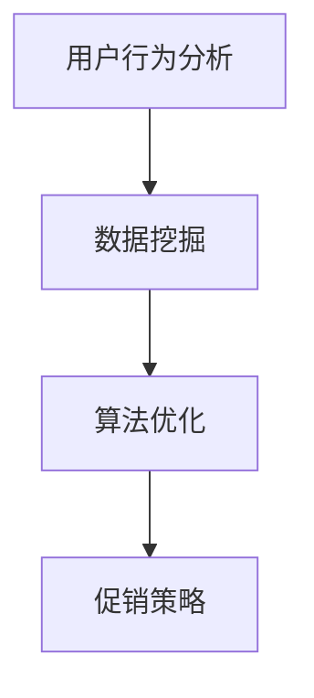

                 

关键词：电商、促销策略、技术、用户行为、数据分析、算法优化

> 摘要：本文将深入探讨电商促销策略的技术应用，通过分析用户行为、数据挖掘、算法优化等方面，阐述如何设计出有效的促销策略来提高用户参与度和销售转化率。

## 1. 背景介绍

随着互联网技术的飞速发展，电商行业经历了巨大的变革。各大电商平台为了争夺市场份额，不断创新促销策略。促销策略的成功与否直接关系到企业的销售额和用户满意度。传统的促销方式如打折、满减、赠品等，虽然在一定程度上能够吸引用户，但难以实现个性化的精准营销。随着大数据和人工智能技术的成熟，电商促销策略逐渐向智能化、个性化和精准化方向发展。

### 1.1 电商行业的现状

电商行业竞争激烈，各大平台不断推出新的促销手段，以吸引更多的用户。然而，促销手段的效果却不尽相同。一些平台通过大数据分析，能够精准地预测用户的购买行为，从而制定出有效的促销策略。而另一些平台则仍然采用传统的促销方式，难以满足用户的个性化需求。

### 1.2 促销策略的重要性

促销策略是电商企业提升销售额和用户满意度的关键。有效的促销策略能够提高用户的参与度和购买意愿，从而提升销售转化率。同时，促销策略还能够提升企业的品牌知名度和用户忠诚度。

## 2. 核心概念与联系

### 2.1 用户行为分析

用户行为分析是电商促销策略的基础。通过对用户的行为数据进行分析，可以了解用户的需求、兴趣和购买习惯。常见的用户行为分析包括用户访问路径分析、页面停留时间分析、点击率分析等。

### 2.2 数据挖掘

数据挖掘是电商促销策略的重要工具。通过数据挖掘技术，可以从海量数据中提取出有用的信息，为促销策略的制定提供依据。常见的数据挖掘技术包括关联规则挖掘、分类算法、聚类算法等。

### 2.3 算法优化

算法优化是电商促销策略的核心。通过对促销策略的算法进行优化，可以提升促销策略的精准度和效果。常见的算法优化方法包括遗传算法、粒子群算法、深度学习等。

下面是核心概念的 Mermaid 流程图：



## 3. 核心算法原理 & 具体操作步骤

### 3.1 算法原理概述

电商促销策略的核心在于如何根据用户行为数据，制定出能够提高用户参与度和购买意愿的促销方案。这需要通过数据挖掘和算法优化技术来实现。

### 3.2 算法步骤详解

1. 用户行为数据收集：首先，需要收集用户的浏览、点击、购买等行为数据。

2. 数据预处理：对收集到的数据进行分析，去除噪声数据，提取有用的特征。

3. 数据挖掘：使用关联规则挖掘、分类算法等数据挖掘技术，分析用户行为数据，提取出用户的兴趣和购买习惯。

4. 算法优化：使用遗传算法、粒子群算法等算法优化技术，对促销策略进行优化。

5. 促销策略制定：根据算法优化结果，制定出个性化的促销策略。

### 3.3 算法优缺点

1. 优点：
   - 提高用户参与度和购买意愿。
   - 精准化营销，降低无效促销成本。
   - 提高销售额和用户满意度。

2. 缺点：
   - 需要大量的数据支持。
   - 算法优化过程复杂，需要专业的技术团队。
   - 需要持续更新和优化，以应对市场的变化。

### 3.4 算法应用领域

电商促销策略的技术应用非常广泛，包括但不限于以下几个方面：

1. 新品推广：通过算法优化，制定出精准的新品推广策略，提高新品的曝光率和销售量。

2. 节日促销：在重大节日如双11、618等，通过算法优化，制定出高效的促销策略，提升销售额。

3. 会员营销：针对会员用户，通过算法优化，制定出个性化的会员优惠策略，提升会员忠诚度。

## 4. 数学模型和公式 & 详细讲解 & 举例说明

### 4.1 数学模型构建

电商促销策略的数学模型主要包括用户行为模型、促销效果模型等。以下是一个简单的用户行为模型：

$$
\text{User\_Behavior} = f(\text{User\_Feature}, \text{Product\_Feature}, \text{Context})
$$

其中，$f$ 表示用户行为预测函数，$\text{User\_Feature}$ 表示用户特征，$\text{Product\_Feature}$ 表示产品特征，$\text{Context}$ 表示上下文信息。

### 4.2 公式推导过程

用户行为模型的推导过程如下：

1. 用户特征提取：从用户的历史行为数据中提取出用户特征，如浏览次数、购买次数、页面停留时间等。

2. 产品特征提取：从产品数据中提取出产品特征，如产品价格、品牌、类别等。

3. 上下文特征提取：从用户行为发生的上下文环境中提取出上下文特征，如时间、季节等。

4. 用户行为预测：使用机器学习算法，训练用户行为预测模型，预测用户下一步的行为。

### 4.3 案例分析与讲解

以一个电商平台的用户购买预测为例，假设我们使用逻辑回归模型来预测用户是否会购买某个产品。以下是具体的实现步骤：

1. 数据收集：收集用户的行为数据，如浏览记录、购买记录等。

2. 数据预处理：对数据进行清洗和归一化处理。

3. 特征提取：提取用户特征和产品特征，如用户性别、年龄、购买历史等。

4. 模型训练：使用逻辑回归算法训练模型。

5. 模型评估：使用验证集评估模型的效果。

6. 预测：使用训练好的模型预测新用户的购买行为。

## 5. 项目实践：代码实例和详细解释说明

### 5.1 开发环境搭建

在本地计算机上安装Python环境，并安装必要的库，如NumPy、Pandas、scikit-learn等。

### 5.2 源代码详细实现

以下是使用Python实现用户行为预测的代码实例：

```python
import numpy as np
import pandas as pd
from sklearn.model_selection import train_test_split
from sklearn.linear_model import LogisticRegression

# 数据加载
data = pd.read_csv('user_behavior.csv')

# 数据预处理
X = data[['age', 'gender', 'purchase_history']]
y = data['will_buy']

# 数据划分
X_train, X_test, y_train, y_test = train_test_split(X, y, test_size=0.2, random_state=42)

# 模型训练
model = LogisticRegression()
model.fit(X_train, y_train)

# 模型评估
accuracy = model.score(X_test, y_test)
print('Model accuracy:', accuracy)

# 预测
new_user = np.array([[25, 1, 10]])
prediction = model.predict(new_user)
print('Will buy:', prediction[0])
```

### 5.3 代码解读与分析

1. 数据加载：使用Pandas库加载用户行为数据。

2. 数据预处理：提取用户特征和标签，并进行划分。

3. 模型训练：使用逻辑回归模型进行训练。

4. 模型评估：使用测试集评估模型的效果。

5. 预测：使用训练好的模型预测新用户的购买行为。

### 5.4 运行结果展示

运行代码后，可以得到模型在测试集上的准确率，以及对新用户的购买预测结果。

## 6. 实际应用场景

### 6.1 新品推广

通过用户行为预测模型，电商平台可以针对潜在购买用户进行新品推广。例如，对于某个新产品的潜在购买用户，平台可以发送个性化的推广邮件或推送信息，从而提高新品的曝光率和销售量。

### 6.2 节日促销

在重大节日如双11、618等，电商平台可以通过用户行为预测模型，制定出针对性的促销策略。例如，对于某些高购买意愿的用户，平台可以提供更大幅度的折扣，从而提升整体销售额。

### 6.3 会员营销

针对会员用户，电商平台可以通过用户行为预测模型，制定出个性化的会员优惠策略。例如，对于某些高消费额的会员用户，平台可以提供额外的优惠券或礼品，从而提升会员忠诚度。

## 7. 工具和资源推荐

### 7.1 学习资源推荐

1. 《Python数据分析基础教程：Numpy学习指南》
2. 《数据挖掘：概念与技术》
3. 《机器学习实战》

### 7.2 开发工具推荐

1. Jupyter Notebook
2. PyCharm
3. Dataquest

### 7.3 相关论文推荐

1. "User Behavior Prediction in E-commerce: A Survey"
2. "Deep Learning for E-commerce Recommendations"
3. "Association Rule Mining for E-commerce Product Recommendations"

## 8. 总结：未来发展趋势与挑战

### 8.1 研究成果总结

通过本文的探讨，我们了解到电商促销策略的技术应用主要包括用户行为分析、数据挖掘、算法优化等方面。这些技术手段能够帮助企业制定出有效的促销策略，提升用户参与度和销售转化率。

### 8.2 未来发展趋势

1. 智能化：随着人工智能技术的不断发展，电商促销策略将更加智能化，能够更好地满足用户的个性化需求。

2. 精准化：数据挖掘和算法优化技术的不断进步，将使得电商促销策略更加精准，降低无效促销成本。

3. 个性化：通过用户行为预测技术，电商促销策略将更加个性化，提高用户的购买意愿和满意度。

### 8.3 面临的挑战

1. 数据隐私：随着用户数据的重要性不断提升，如何保护用户隐私成为了一个重要的挑战。

2. 技术门槛：电商促销策略的技术应用需要专业的技术团队，这对企业来说是一个挑战。

3. 道德和伦理：在制定电商促销策略时，如何平衡商业利益和用户利益，避免过度营销和欺诈行为，也是一个挑战。

### 8.4 研究展望

未来，电商促销策略的技术应用将朝着更加智能化、精准化和个性化的方向发展。研究者可以从以下几个方面展开深入研究：

1. 基于深度学习的技术应用：深度学习技术在用户行为预测和促销策略优化方面具有巨大的潜力。

2. 多模态数据融合：将用户的行为数据、语音数据、视觉数据等多种数据源进行融合，以获得更全面的用户画像。

3. 可解释性：提高算法的可解释性，使得企业能够更好地理解和信任算法的决策过程。

## 9. 附录：常见问题与解答

### 9.1 什么是用户行为分析？

用户行为分析是指通过对用户在电商平台上的一系列活动数据进行分析，了解用户的行为模式、兴趣和需求，从而为电商促销策略的制定提供依据。

### 9.2 数据挖掘有哪些常见技术？

数据挖掘常见的技术包括关联规则挖掘、分类算法、聚类算法、时间序列分析等。

### 9.3 电商促销策略的优化有哪些方法？

电商促销策略的优化方法包括遗传算法、粒子群算法、深度学习等。这些方法可以通过调整促销参数，提高促销策略的效果。

### 9.4 如何保护用户隐私？

在电商促销策略的技术应用中，保护用户隐私至关重要。企业可以通过数据加密、匿名化处理、权限控制等技术手段，确保用户隐私得到保护。

作者：禅与计算机程序设计艺术 / Zen and the Art of Computer Programming
```

