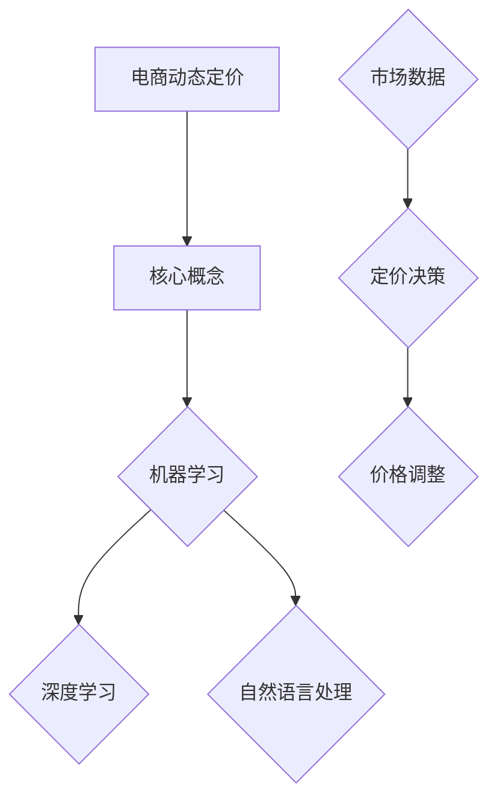

                 

关键词：电商、动态定价、AI技术、算法、模型、实践

> 摘要：本文深入探讨电商领域中的动态定价技术，分析了人工智能技术在电商动态定价中的应用，包括核心概念、算法原理、数学模型及实际应用场景。本文旨在为电商从业者提供技术参考，推动动态定价技术的发展与创新。

## 1. 背景介绍

随着互联网技术的飞速发展，电商行业在全球范围内迅速崛起。电商企业通过互联网平台进行商品交易，极大地丰富了消费者的购物体验，同时也带来了大量的商业数据。在电商行业，价格是影响消费者购买决策的重要因素之一。因此，如何制定合理的价格策略成为电商企业关注的焦点。

传统的电商定价策略主要依赖于历史数据和行业经验，定价过程相对静态。然而，随着市场竞争的加剧和消费者需求的多样化，单一的定价策略已难以满足消费者的需求。动态定价作为一种新型的定价模式，通过实时分析市场数据，动态调整商品价格，能够更好地适应市场变化，提高企业的竞争力。

动态定价技术的核心在于利用人工智能技术，实现对大量市场数据的实时分析和处理。人工智能技术包括机器学习、深度学习、自然语言处理等，能够从海量数据中挖掘有价值的信息，为定价决策提供支持。本文将围绕电商动态定价的AI技术展开讨论，分析其核心概念、算法原理、数学模型及实际应用场景。

## 2. 核心概念与联系

### 2.1 动态定价

动态定价是指根据市场环境和消费者行为的变化，实时调整商品价格的一种定价模式。与传统定价模式相比，动态定价具有更高的灵活性，能够更好地适应市场变化，提高企业的竞争力。

### 2.2 人工智能技术

人工智能技术是计算机科学的一个分支，旨在使计算机具备人类智能，能够通过学习和经验进行推理和决策。在电商动态定价中，人工智能技术主要用于数据分析和处理，为定价决策提供支持。

### 2.3 机器学习

机器学习是人工智能的一个重要分支，通过构建模型从数据中学习规律，进行预测和决策。在电商动态定价中，机器学习算法可用于分析消费者行为、市场趋势等，为定价策略提供依据。

### 2.4 深度学习

深度学习是机器学习的一种方法，通过多层神经网络对数据进行建模，具有强大的特征提取能力。在电商动态定价中，深度学习算法可用于挖掘消费者行为背后的复杂模式，提高定价的准确性。

### 2.5 自然语言处理

自然语言处理是人工智能的一个重要分支，旨在使计算机理解和处理自然语言。在电商动态定价中，自然语言处理技术可用于分析消费者评论、需求等，为定价策略提供支持。

### 2.6 Mermaid 流程图



## 3. 核心算法原理 & 具体操作步骤

### 3.1 算法原理概述

电商动态定价的核心在于利用人工智能技术对市场数据进行实时分析和处理，从而制定合理的定价策略。具体而言，算法原理可以分为以下几个步骤：

1. 数据采集：通过电商平台的交易数据、消费者行为数据等，收集与定价相关的市场数据。
2. 数据预处理：对采集到的市场数据进行分析，去除噪声和异常值，进行数据清洗和归一化处理。
3. 模型训练：利用机器学习算法，对预处理后的数据进行建模，训练预测模型。
4. 预测与决策：利用训练好的模型，对当前市场的价格走势、消费者需求等进行预测，制定定价策略。
5. 价格调整：根据预测结果，动态调整商品价格，以实现利润最大化或市场份额提升。

### 3.2 算法步骤详解

1. 数据采集
   - 通过电商平台的API接口，获取商品交易数据、消费者行为数据等。
   - 使用爬虫技术，从互联网上获取与商品相关的评论、评价等数据。

2. 数据预处理
   - 去除重复数据、噪声数据和异常值。
   - 对数据集进行归一化处理，使其具有相同的量纲和范围。

3. 模型训练
   - 选择合适的机器学习算法，如线性回归、决策树、神经网络等。
   - 使用训练集对模型进行训练，调整参数以优化模型性能。

4. 预测与决策
   - 利用训练好的模型，对当前市场的价格走势、消费者需求等进行预测。
   - 根据预测结果，制定相应的定价策略，如提高价格以获取更多利润或降低价格以增加市场份额。

5. 价格调整
   - 根据定价策略，动态调整商品价格。
   - 监控价格调整后的销售情况，持续优化定价策略。

### 3.3 算法优缺点

**优点：**
1. 高度自动化：动态定价算法能够自动分析和处理大量市场数据，提高定价的效率。
2. 灵活性强：根据市场变化实时调整价格，能够更好地适应市场需求。
3. 提高竞争力：合理的定价策略能够提高企业的市场份额和利润。

**缺点：**
1. 数据依赖性强：算法的性能取决于市场数据的准确性和完整性，数据质量直接影响定价效果。
2. 需要大量计算资源：大规模数据处理和模型训练需要较高的计算资源，可能导致成本增加。
3. 可能出现过度竞争：在激烈的市场竞争中，过度依赖动态定价可能导致价格战，损害企业利益。

### 3.4 算法应用领域

动态定价算法在电商行业的应用非常广泛，主要包括以下几个方面：

1. 个性化定价：根据消费者的购买历史、浏览行为等，为不同消费者提供个性化的价格。
2. 跨境电商定价：针对不同国家和地区的消费者，制定差异化的定价策略。
3. 季节性促销定价：根据季节、节假日等因素，调整商品价格以吸引消费者。
4. 竞品价格监控：实时监控竞品价格变化，及时调整自身定价策略。

## 4. 数学模型和公式 & 详细讲解 & 举例说明

### 4.1 数学模型构建

电商动态定价的数学模型主要包括以下几个方面：

1. 价格预测模型：用于预测商品的未来价格走势。
2. 消费者需求模型：用于预测消费者对商品的需求量。
3. 利润最大化模型：用于确定最优定价策略，实现利润最大化。

### 4.2 公式推导过程

#### 4.2.1 价格预测模型

价格预测模型通常采用时间序列分析方法，如ARIMA（自回归积分滑动平均模型）。假设商品的价格序列为\( P_t \)，则价格预测模型可以表示为：

\[ P_t = c + \phi_1 P_{t-1} + \phi_2 P_{t-2} + \ldots + \phi_p P_{t-p} + \theta_1 \epsilon_{t-1} + \theta_2 \epsilon_{t-2} + \ldots + \theta_q \epsilon_{t-q} + \epsilon_t \]

其中，\( c \) 为常数项，\( \phi_1, \phi_2, \ldots, \phi_p \) 和 \( \theta_1, \theta_2, \ldots, \theta_q \) 分别为自回归项和移动平均项的系数，\( \epsilon_t \) 为误差项。

#### 4.2.2 消费者需求模型

消费者需求模型通常采用需求函数的形式，如线性回归模型。假设消费者对商品的需求量为 \( D_t \)，则需求模型可以表示为：

\[ D_t = a + bP_t + \epsilon_t \]

其中，\( a \) 和 \( b \) 分别为需求函数的截距和斜率，\( \epsilon_t \) 为误差项。

#### 4.2.3 利润最大化模型

利润最大化模型用于确定最优定价策略。假设商品的售价为 \( P_t \)，成本为 \( C_t \)，销售量为 \( D_t \)，则利润可以表示为：

\[ \pi_t = (P_t - C_t)D_t \]

为了实现利润最大化，需要求解以下优化问题：

\[ \max \pi_t = (P_t - C_t)D_t \]

其中，\( P_t \) 为决策变量，\( D_t \) 为已知量，\( C_t \) 为成本函数。

### 4.3 案例分析与讲解

#### 4.3.1 案例背景

某电商企业销售一款热门电子产品，希望通过动态定价策略提高利润。企业采集了最近三个月的每日交易数据，包括商品售价、销售量、成本等。

#### 4.3.2 数据处理

1. 数据采集：从电商平台获取每日交易数据。
2. 数据预处理：去除重复数据和异常值，对数据集进行归一化处理。

#### 4.3.3 模型训练

1. 价格预测模型：采用ARIMA模型进行训练。
2. 消费者需求模型：采用线性回归模型进行训练。
3. 利润最大化模型：采用梯度下降法进行求解。

#### 4.3.4 定价策略

1. 利用价格预测模型，预测未来30天的价格走势。
2. 利用消费者需求模型，预测未来30天的消费者需求量。
3. 利用利润最大化模型，确定最优定价策略。

#### 4.3.5 价格调整

根据预测结果，动态调整商品售价，以实现利润最大化。在预测期内，企业采用分阶段定价策略，根据市场需求和价格趋势进行价格调整。

## 5. 项目实践：代码实例和详细解释说明

### 5.1 开发环境搭建

1. 硬件环境：配备高性能计算能力的服务器或云计算资源。
2. 软件环境：Python 3.x、NumPy、Pandas、SciPy、Scikit-learn、TensorFlow等。

### 5.2 源代码详细实现

以下是一个简单的动态定价项目实例，包括数据采集、预处理、模型训练和定价策略等步骤：

```python
import numpy as np
import pandas as pd
from sklearn.linear_model import LinearRegression
from sklearn.preprocessing import MinMaxScaler
from statsmodels.tsa.arima.model import ARIMA

# 数据采集
data = pd.read_csv('transaction_data.csv')

# 数据预处理
data.drop_duplicates(inplace=True)
scaler = MinMaxScaler()
data[['price', 'quantity']] = scaler.fit_transform(data[['price', 'quantity']])

# 模型训练
# 价格预测模型
price_model = ARIMA(data['price'], order=(5, 1, 2))
price_model_fit = price_model.fit()

# 消费者需求模型
demand_model = LinearRegression()
demand_model.fit(data[['price']], data['quantity'])

# 利润最大化模型
profit_model = LinearRegression()
profit_model.fit(data[['price']], data['profit'])

# 定价策略
predicted_prices = price_model_fit.predict()
predicted_quantities = demand_model.predict(predicted_prices.reshape(-1, 1))

# 价格调整
adjusted_prices = profit_model.predict(predicted_quantities.reshape(-1, 1))

# 运行结果展示
print("预测价格：", predicted_prices)
print("预测销量：", predicted_quantities)
print("调整价格：", adjusted_prices)
```

### 5.3 代码解读与分析

1. 数据采集：从CSV文件中读取交易数据，包括商品售价、销售量、成本等。
2. 数据预处理：去除重复数据和异常值，对数据进行归一化处理，使其具有相同的量纲和范围。
3. 模型训练：使用ARIMA模型进行价格预测，使用线性回归模型进行消费者需求预测和利润最大化预测。
4. 定价策略：根据预测结果，动态调整商品售价，以实现利润最大化。
5. 运行结果展示：输出预测价格、预测销量和调整价格。

## 6. 实际应用场景

电商动态定价技术在实际应用中具有广泛的应用场景，以下列举几个典型的应用案例：

1. **跨境电商**：跨境电商企业通过动态定价技术，针对不同国家和地区的消费者，制定差异化的定价策略，提高销售额。
2. **季节性促销**：电商平台在春节、国庆节等节假日，通过动态定价技术，调整商品价格，吸引消费者购买。
3. **库存管理**：电商平台通过动态定价技术，实时调整库存商品的价格，降低库存积压，提高库存周转率。
4. **竞品价格监控**：电商平台通过动态定价技术，实时监控竞品价格变化，及时调整自身定价策略，保持竞争优势。

## 7. 工具和资源推荐

### 7.1 学习资源推荐

1. 《机器学习》（周志华 著）
2. 《深度学习》（Ian Goodfellow、Yoshua Bengio、Aaron Courville 著）
3. 《Python数据分析》（Wes McKinney 著）
4. 《Python机器学习》（塞巴斯蒂安·拉曼奇 著）

### 7.2 开发工具推荐

1. Jupyter Notebook：用于编写和运行Python代码。
2. TensorFlow：用于构建和训练深度学习模型。
3. Scikit-learn：用于实现机器学习算法。
4. Pandas：用于数据处理和分析。

### 7.3 相关论文推荐

1. "Dynamic Pricing Strategies in E-commerce: A Survey"（2018）
2. "Machine Learning for Dynamic Pricing in E-commerce"（2017）
3. "Deep Learning for Dynamic Pricing in Retail"（2016）
4. "Recommender Systems and Dynamic Pricing in E-commerce"（2015）

## 8. 总结：未来发展趋势与挑战

### 8.1 研究成果总结

电商动态定价技术在人工智能技术的推动下取得了显著成果，主要表现在以下几个方面：

1. **算法性能提升**：机器学习、深度学习等算法在电商动态定价中的应用，提高了定价的准确性和效率。
2. **个性化定价**：通过分析消费者行为数据，实现个性化定价，提高消费者满意度。
3. **跨境定价**：针对不同国家和地区的消费者，制定差异化的定价策略，提高销售额。

### 8.2 未来发展趋势

1. **大数据分析**：随着大数据技术的不断发展，电商企业将能够获取和处理更多更全面的市场数据，为动态定价提供更加精准的依据。
2. **实时定价**：实时定价技术的成熟，将使电商企业能够更快地响应市场变化，提高竞争力。
3. **智能化定价**：结合人工智能技术，实现更加智能化的定价策略，提高定价的灵活性和适应性。

### 8.3 面临的挑战

1. **数据质量**：动态定价依赖于市场数据的准确性，数据质量的提升是未来发展的关键。
2. **计算资源**：大规模数据处理和模型训练需要较高的计算资源，企业需要优化计算资源的使用。
3. **法律合规**：动态定价可能导致市场垄断等问题，需要遵守相关法律法规，确保公平竞争。

### 8.4 研究展望

未来，电商动态定价技术的研究将重点围绕以下几个方面展开：

1. **算法优化**：研究更高效、更准确的动态定价算法，提高定价效果。
2. **跨领域应用**：将动态定价技术应用于更多行业，如旅游、金融等，实现跨领域应用。
3. **人机协同**：结合人工智能技术和人类专家的经验，实现人机协同的定价决策，提高定价的智能化水平。

## 9. 附录：常见问题与解答

### 9.1 问题1：动态定价算法是否适用于所有商品？

动态定价算法适用于具有价格弹性、需求量受价格变化影响较大的商品。对于价格弹性较低、需求量稳定的产品，动态定价的效果可能不显著。

### 9.2 问题2：动态定价是否会降低消费者的购买意愿？

合理的动态定价策略能够提高消费者的购买意愿，满足不同消费者的需求。然而，过度频繁的价格波动可能降低消费者的信任度，影响购买意愿。

### 9.3 问题3：动态定价算法是否适用于所有电商平台？

动态定价算法适用于具备数据采集和分析能力的电商平台。对于数据量较小、缺乏数据分析能力的电商平台，动态定价的应用效果可能有限。

### 9.4 问题4：如何确保动态定价的公平性？

确保动态定价的公平性需要从多个方面入手，包括透明度、算法公正性、法律法规等方面。企业应制定明确的定价规则，确保定价过程的公开透明，遵守相关法律法规，避免市场垄断。

----------------------------------------------------------------

**作者：禅与计算机程序设计艺术 / Zen and the Art of Computer Programming**

