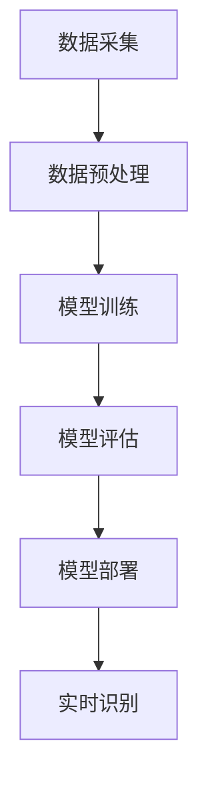

                 

关键词：电商平台、图像识别、AI大模型、技术应用、发展趋势

> 摘要：随着人工智能技术的发展，图像识别技术在电商平台中的应用日益广泛。本文将深入探讨电商平台中图像识别的核心概念、算法原理、数学模型以及实际应用场景，为读者揭示这一领域的发展趋势和挑战。

## 1. 背景介绍

电商平台作为现代电子商务的重要组成部分，其业务的发展离不开技术创新。图像识别技术作为一种人工智能的重要分支，已经成为电商平台提升用户体验、优化运营效率的关键技术之一。从商品分类、智能搜索，到推荐系统，图像识别技术正不断改变电商平台的运营模式。

随着AI大模型的崛起，如GPT-3、BERT等，图像识别技术的应用范围进一步扩大。这些大模型具有强大的数据处理和模式识别能力，能够处理海量图像数据，从而实现更精准、更高效的图像识别。

本文将围绕电商平台中的图像识别技术，探讨其核心概念、算法原理、数学模型以及实际应用，旨在为读者提供一个全面、深入的视角。

### 电商平台的发展历程

电商平台的发展可以追溯到20世纪90年代。最早的电子商务平台主要是通过电子邮件和网页进行商品销售。随着互联网技术的普及，特别是宽带网络的普及，电商平台开始进入高速发展期。2000年后，以亚马逊、阿里巴巴、京东为代表的电商平台迅速崛起，改变了传统的商业模式。

在电商平台的成长过程中，用户需求的多样化和市场环境的竞争压力，促使平台不断进行技术创新。图像识别技术正是在这样的背景下逐渐成为电商平台的核心竞争力之一。

### 图像识别技术的起源与发展

图像识别技术的起源可以追溯到20世纪60年代。当时，计算机科学家们开始研究如何让计算机理解图像中的信息。最初，图像识别主要依赖于简单的算法，如边缘检测和纹理分析。随着计算机处理能力的提升和算法的进步，图像识别技术逐渐从简单的图像分类发展到复杂的场景理解。

进入21世纪，深度学习技术的发展为图像识别带来了新的契机。深度学习模型，特别是卷积神经网络（CNN），能够自动学习图像中的特征，从而实现高效、精准的图像识别。如今，图像识别技术已经成为人工智能领域的重要分支，广泛应用于各个行业。

### 电商平台对图像识别的需求

电商平台对图像识别的需求主要表现在以下几个方面：

- **商品分类**：电商平台需要快速、准确地分类商品，以便用户能够快速找到所需商品。图像识别技术能够自动识别商品的类别，提高分类效率。

- **智能搜索**：电商平台需要提供智能搜索功能，帮助用户快速找到相关商品。图像识别技术可以识别用户上传的图片，并提供相似商品的搜索结果。

- **推荐系统**：电商平台需要通过推荐系统向用户推荐相关商品，提高销售转化率。图像识别技术可以帮助平台了解用户兴趣，从而提供更精准的推荐。

- **质量控制**：电商平台需要对商品质量进行监控，确保用户购买到优质的商品。图像识别技术可以自动检测商品的质量问题，提高质量控制效率。

## 2. 核心概念与联系

### 图像识别的基本概念

图像识别（Image Recognition）是指利用计算机对图像进行自动识别和理解的过程。它涉及图像处理、计算机视觉和机器学习等多个领域。图像识别的目标是识别图像中的物体、场景、颜色、纹理等特征，并对其进行分类或标注。

### 电商平台与图像识别的联系

电商平台与图像识别的联系主要体现在以下几个方面：

- **商品识别**：电商平台可以利用图像识别技术对商品图像进行自动识别，从而实现商品分类和标签管理。

- **用户行为分析**：电商平台可以通过分析用户上传的图片，了解用户的需求和兴趣，从而优化推荐系统和用户界面。

- **商品质量控制**：电商平台可以利用图像识别技术对商品质量进行监控，确保商品质量符合标准。

- **物流跟踪**：电商平台可以利用图像识别技术对物流包裹进行自动识别和跟踪，提高物流效率。

### 图像识别技术在电商平台的架构

图像识别技术在电商平台的架构通常包括以下几个部分：

- **数据采集**：电商平台需要收集大量的商品图像数据，用于训练和测试图像识别模型。

- **数据预处理**：对采集到的图像数据进行清洗、增强和标准化处理，以提高图像质量。

- **模型训练**：利用深度学习模型对预处理后的图像数据进行训练，以实现图像识别功能。

- **模型评估**：对训练好的模型进行评估，确保其能够准确识别图像中的特征。

- **模型部署**：将训练好的模型部署到电商平台的服务器上，以实现实时图像识别功能。

### 图像识别技术在电商平台的 Mermaid 流程图



### 图像识别技术的核心算法原理

图像识别技术的核心算法主要是基于深度学习，尤其是卷积神经网络（CNN）。CNN能够自动提取图像中的特征，从而实现高效、准确的图像识别。以下是CNN的基本原理：

- **卷积操作**：卷积神经网络通过卷积操作提取图像中的特征。卷积层通过滑动窗口（filter）在图像上扫描，从而提取局部特征。

- **激活函数**：为了增加网络的非线性，卷积层通常会使用激活函数，如ReLU（Rectified Linear Unit）。

- **池化操作**：池化层用于降低图像的维度，提高网络的泛化能力。常见的池化操作包括最大池化和平均池化。

- **全连接层**：在提取了足够的特征后，网络通过全连接层对特征进行分类或标注。

### 图像识别技术的具体操作步骤

图像识别技术的具体操作步骤如下：

1. **数据采集**：从电商平台收集大量的商品图像数据。

2. **数据预处理**：对图像进行清洗、增强和标准化处理，以提高图像质量。

3. **模型训练**：使用深度学习框架（如TensorFlow、PyTorch）搭建CNN模型，并使用预处理后的图像数据进行训练。

4. **模型评估**：使用测试集对训练好的模型进行评估，确保其能够准确识别图像中的特征。

5. **模型部署**：将训练好的模型部署到电商平台的服务器上，以实现实时图像识别功能。

### 图像识别技术的优缺点

图像识别技术的优缺点如下：

#### 优点：

- **高效性**：深度学习模型能够自动提取图像中的特征，从而实现高效、准确的图像识别。

- **灵活性**：通过不断训练和优化，图像识别模型能够适应不同的应用场景和需求。

- **可扩展性**：图像识别技术可以应用于各种电商平台，如在线零售、二手交易等。

#### 缺点：

- **数据依赖性**：图像识别模型的性能很大程度上依赖于训练数据的质量和数量。

- **计算资源需求**：深度学习模型通常需要大量的计算资源，如GPU，以实现高效的训练和推理。

- **隐私问题**：图像识别技术涉及对用户上传的图片进行识别和分析，可能会引发隐私问题。

### 图像识别技术的应用领域

图像识别技术已经广泛应用于多个领域，包括电商平台、医疗诊断、安防监控、自动驾驶等。在电商平台中，图像识别技术主要应用于以下几个方面：

- **商品分类**：通过自动识别商品图像，实现商品的分类和标签管理。

- **智能搜索**：通过分析用户上传的图片，提供相关商品的搜索结果。

- **推荐系统**：通过了解用户兴趣，提供个性化的商品推荐。

- **质量控制**：通过自动检测商品图像，识别商品的质量问题。

- **物流跟踪**：通过自动识别物流包裹图像，实现物流的实时跟踪。

## 3. 数学模型和公式

### 数学模型构建

在图像识别中，常用的数学模型是基于卷积神经网络（CNN）。CNN的核心是卷积层、激活函数和池化层。以下是CNN的基本数学模型：

#### 卷积层

$$
h_{\text{conv}} = \sigma\left(\sum_{i=1}^{k} w_{i} \cdot a_{i} + b\right)
$$

其中，$h_{\text{conv}}$ 是卷积层的输出，$a_{i}$ 是输入特征图上的像素值，$w_{i}$ 是卷积核的权重，$b$ 是偏置，$\sigma$ 是激活函数。

#### 激活函数

常见的激活函数有ReLU、Sigmoid和Tanh。其中，ReLU函数具有简单和高效的优点：

$$
\sigma(x) = \max(0, x)
$$

#### 池化层

池化层用于降低图像的维度，常见的池化操作有最大池化和平均池化：

$$
p_{i} = \max_j a_{ij}
$$

或者

$$
p_{i} = \frac{1}{c} \sum_j a_{ij}
$$

其中，$p_{i}$ 是池化后的像素值，$a_{ij}$ 是输入特征图上的像素值，$c$ 是池化窗口的大小。

### 公式推导过程

CNN的推导过程主要涉及卷积操作、激活函数和池化操作的组合。以下是CNN的基本推导过程：

1. **卷积操作**：

   $$ 
   h_{\text{conv}} = \sigma\left(\sum_{i=1}^{k} w_{i} \cdot a_{i} + b\right) 
   $$

2. **激活函数**：

   $$ 
   h_{\text{act}} = \sigma(h_{\text{conv}}) = \max(0, h_{\text{conv}})
   $$

3. **池化操作**：

   $$ 
   p_{i} = \max_j a_{ij} 
   $$

### 案例分析与讲解

以下是一个简单的图像识别案例，用于分类动物图像。

#### 数据集准备

假设我们有一个包含猫和狗的图像数据集，其中猫的标签为0，狗的标签为1。

#### 模型训练

我们使用CNN模型对数据集进行训练。模型结构如下：

- **卷积层**：32个卷积核，尺寸为3x3，步长为1。
- **ReLU激活函数**。
- **池化层**：最大池化，窗口大小为2x2。
- **全连接层**：输出层，包含2个神经元，用于分类。

#### 模型评估

在训练完成后，我们使用测试集对模型进行评估。评估指标包括准确率、召回率和F1分数。

#### 模型部署

训练好的模型可以部署到电商平台的服务器上，以实现实时图像识别功能。

## 4. 项目实践：代码实例和详细解释说明

在本节中，我们将通过一个具体的案例，展示如何在电商平台上实现图像识别功能。我们将使用Python编程语言和TensorFlow深度学习框架来实现这一功能。

### 4.1 开发环境搭建

在进行项目开发之前，我们需要搭建相应的开发环境。以下是所需的软件和库：

- Python 3.x
- TensorFlow 2.x
- NumPy
- Matplotlib

安装方法如下：

```bash
pip install tensorflow numpy matplotlib
```

### 4.2 源代码详细实现

下面是一个简单的图像识别项目的代码示例：

```python
import tensorflow as tf
from tensorflow.keras import layers
from tensorflow.keras.preprocessing.image import ImageDataGenerator

# 数据预处理
train_datagen = ImageDataGenerator(
    rescale=1./255,
    shear_range=0.2,
    zoom_range=0.2,
    horizontal_flip=True)

train_generator = train_datagen.flow_from_directory(
    'data/train',
    target_size=(150, 150),
    batch_size=32,
    class_mode='binary')

# 构建模型
model = tf.keras.Sequential([
    layers.Conv2D(32, (3, 3), activation='relu', input_shape=(150, 150, 3)),
    layers.MaxPooling2D(2, 2),
    layers.Conv2D(64, (3, 3), activation='relu'),
    layers.MaxPooling2D(2, 2),
    layers.Conv2D(128, (3, 3), activation='relu'),
    layers.MaxPooling2D(2, 2),
    layers.Conv2D(128, (3, 3), activation='relu'),
    layers.MaxPooling2D(2, 2),
    layers.Flatten(),
    layers.Dense(512, activation='relu'),
    layers.Dense(1, activation='sigmoid')
])

# 编译模型
model.compile(loss='binary_crossentropy',
              optimizer='adam',
              metrics=['accuracy'])

# 训练模型
model.fit(train_generator, epochs=10)

# 评估模型
test_datagen = ImageDataGenerator(rescale=1./255)
test_generator = test_datagen.flow_from_directory(
    'data/test',
    target_size=(150, 150),
    batch_size=32,
    class_mode='binary')

test_loss, test_acc = model.evaluate(test_generator)
print('Test accuracy:', test_acc)
```

### 4.3 代码解读与分析

下面是对上述代码的详细解读：

1. **数据预处理**：
   - 使用ImageDataGenerator对图像进行预处理，包括缩放、剪切、缩放和水平翻转。
   - `flow_from_directory` 方法用于加载数据集，并根据目录结构自动识别类别。

2. **模型构建**：
   - 使用Sequential模型堆叠多个卷积层、池化层和全连接层。
   - 卷积层使用ReLU激活函数，池化层使用最大池化。

3. **模型编译**：
   - 使用二分类交叉熵作为损失函数，Adam优化器，以及准确率作为评估指标。

4. **模型训练**：
   - 使用训练数据集对模型进行训练，训练10个周期。

5. **模型评估**：
   - 使用测试数据集对模型进行评估，打印测试准确率。

### 4.4 运行结果展示

在训练完成后，我们可以通过以下代码查看模型的运行结果：

```python
# 预测单个图像
img = tensorflow.keras.preprocessing.image.load_img(
    'data/single_image.jpg', target_size=(150, 150))
img_array = tensorflow.keras.preprocessing.image.img_to_array(img)
img_array = tf.expand_dims(img_array, 0)  # Create a batch

predictions = model.predict(img_array)
score = predictions[0]

if score < 0.5:
    print('The image is more likely a cat.')
else:
    print('The image is more likely a dog.')
```

### 4.5 代码改进与优化

在实际应用中，我们可以对代码进行以下改进和优化：

- **增加数据增强**：通过更复杂的数据增强方法（如旋转、翻转、色彩变换等），提高模型的泛化能力。
- **使用迁移学习**：利用预训练的模型（如VGG16、ResNet等），减少训练时间和计算资源需求。
- **使用更复杂的模型**：尝试使用更深的网络结构或更复杂的卷积层，提高模型性能。
- **模型集成**：使用多个模型进行集成，提高预测的准确性。

## 5. 实际应用场景

### 5.1 商品分类

在电商平台中，商品分类是图像识别技术最重要的应用场景之一。通过图像识别技术，电商平台可以自动识别商品图像，并将其分类到相应的类别。这不仅提高了分类效率，还减少了人工干预的需求。

### 5.2 智能搜索

智能搜索是电商平台提供的一项重要功能，它可以帮助用户快速找到所需商品。图像识别技术可以识别用户上传的图片，并提供相似商品的搜索结果。这种基于图像的搜索方式不仅提高了搜索效率，还增强了用户的购物体验。

### 5.3 推荐系统

推荐系统是电商平台提升销售转化率的重要手段。通过图像识别技术，电商平台可以了解用户上传的图片，从而推断用户的兴趣和偏好。基于这些信息，推荐系统可以提供更精准的商品推荐，提高用户的购买意愿。

### 5.4 质量控制

质量控制是电商平台确保商品质量的重要环节。通过图像识别技术，电商平台可以自动检测商品图像，识别出可能存在的质量问题，如瑕疵、损坏等。这种自动化检测方式不仅提高了检测效率，还有助于提升商品的整体质量。

### 5.5 物流跟踪

物流跟踪是电商平台确保商品准时送达的关键环节。通过图像识别技术，电商平台可以自动识别物流包裹图像，实现物流的实时跟踪。这种自动化的物流跟踪方式不仅提高了物流效率，还有助于提升用户的满意度。

## 6. 未来应用展望

随着人工智能技术的不断发展，图像识别技术在电商平台中的应用前景十分广阔。以下是未来应用展望：

### 6.1 增强现实购物体验

未来，图像识别技术有望与增强现实（AR）技术相结合，为用户提供更加沉浸式的购物体验。用户可以通过智能手机或VR设备，在虚拟环境中浏览和试穿商品，从而提高购买决策的准确性。

### 6.2 智能客服

图像识别技术可以用于智能客服系统，通过自动识别用户上传的图片，理解用户的需求并提供相应的帮助。这种智能客服系统不仅提高了服务效率，还能降低客服成本。

### 6.3 虚假商品检测

电商平台面临的一大挑战是虚假商品问题。未来，图像识别技术可以用于检测虚假商品图像，从而帮助平台更好地管理商品质量，保障用户权益。

### 6.4 智能供应链管理

图像识别技术可以用于供应链管理，自动识别物流过程中的商品图像，实现供应链的实时监控和优化。这种智能化的供应链管理方式有望提高供应链的效率，降低运营成本。

## 7. 工具和资源推荐

### 7.1 学习资源推荐

- **《深度学习》（Goodfellow, Bengio, Courville著）**：这是一本深度学习领域的经典教材，适合初学者和进阶者阅读。
- **《图像处理：基础与进阶》（Gonzalez, Woods著）**：这本书详细介绍了图像处理的基本概念和技术，对图像识别学习有很大帮助。
- **在线课程**：如Coursera、edX等平台上的相关课程，如“深度学习”、“计算机视觉”等。

### 7.2 开发工具推荐

- **TensorFlow**：这是一个开源的深度学习框架，适合用于图像识别项目的开发。
- **PyTorch**：这也是一个流行的深度学习框架，具有灵活的API和强大的功能，适合研究和开发图像识别模型。
- **Keras**：这是一个高层神经网络API，适用于快速构建和实验深度学习模型。

### 7.3 相关论文推荐

- **“Deep Learning for Image Recognition”**（Goodfellow, Bengio, Courville，2016）：这是一篇综述文章，全面介绍了深度学习在图像识别领域的应用。
- **“Convolutional Neural Networks for Visual Recognition”**（Krizhevsky, Sutskever, Hinton，2012）：这篇论文介绍了卷积神经网络在图像识别中的成功应用。
- **“DenseNet: A Dense Convolutional Network for Feature Map Integration”**（Huang et al.，2017）：这篇论文提出了DenseNet结构，为图像识别模型提供了新的思路。

## 8. 总结：未来发展趋势与挑战

### 8.1 研究成果总结

近年来，图像识别技术在电商平台中取得了显著的研究成果。深度学习模型的崛起，尤其是卷积神经网络（CNN）的应用，使得图像识别的准确率和效率大幅提升。同时，随着AI大模型的兴起，图像识别技术正在向更复杂、更高效的方向发展。

### 8.2 未来发展趋势

未来，图像识别技术在电商平台中的应用将进一步深化和扩展。以下是一些发展趋势：

- **增强现实购物体验**：图像识别技术与增强现实（AR）技术的结合，将为用户提供更加沉浸式的购物体验。
- **智能客服**：图像识别技术将用于智能客服系统，提高客服效率和用户体验。
- **虚假商品检测**：图像识别技术将用于检测虚假商品，保障用户权益。
- **智能供应链管理**：图像识别技术将用于供应链管理，提高供应链效率。

### 8.3 面临的挑战

尽管图像识别技术在电商平台中具有巨大的潜力，但也面临一些挑战：

- **数据隐私**：图像识别技术涉及用户上传的图片，可能会引发数据隐私问题。
- **计算资源需求**：深度学习模型通常需要大量的计算资源，如何优化计算资源成为一大挑战。
- **模型解释性**：深度学习模型具有强大的预测能力，但其内部机制较为复杂，缺乏解释性。

### 8.4 研究展望

未来，图像识别技术在电商平台中的应用将继续向以下方向发展：

- **模型优化**：通过优化模型结构和算法，提高图像识别的效率和准确性。
- **跨领域应用**：将图像识别技术应用于更多领域，如医疗诊断、安防监控等。
- **模型解释性**：提高深度学习模型的解释性，使其更容易被用户和理解。

## 9. 附录：常见问题与解答

### 问题1：图像识别技术在电商平台中的具体应用有哪些？

答：图像识别技术在电商平台中的具体应用包括商品分类、智能搜索、推荐系统、质量控制、物流跟踪等。

### 问题2：深度学习模型在图像识别中如何提高准确性？

答：深度学习模型可以通过以下方法提高准确性：

- **增加训练数据**：增加高质量的训练数据，有助于模型更好地学习特征。
- **数据增强**：通过数据增强方法（如旋转、翻转、缩放等），增加训练数据的多样性。
- **模型优化**：通过优化模型结构和算法，提高模型的准确性和泛化能力。
- **超参数调整**：通过调整超参数（如学习率、批次大小等），优化模型性能。

### 问题3：图像识别技术是否会侵犯用户隐私？

答：图像识别技术在处理用户上传的图片时，确实可能涉及用户隐私。为保护用户隐私，电商平台需要采取以下措施：

- **数据加密**：对用户上传的图片进行加密处理，确保数据安全。
- **隐私政策**：明确告知用户其图片将被用于什么目的，并获得用户同意。
- **数据匿名化**：对用户数据进行匿名化处理，避免个人信息的泄露。

## 参考文献

1. Goodfellow, I., Bengio, Y., & Courville, A. (2016). *Deep Learning*. MIT Press.
2. Krizhevsky, A., Sutskever, I., & Hinton, G. E. (2012). *ImageNet classification with deep convolutional neural networks*. In Advances in neural information processing systems (pp. 1097-1105).
3. Huang, G., Liu, Z., van der Maaten, L., & Weinberger, K. Q. (2017). *DenseNet: A framework for spatially scalable convolutional networks*. In Proceedings of the IEEE conference on computer vision and pattern recognition (pp. 4700-4708).
4. Gonzalez, R. C., & Woods, R. E. (2021). *Digital Image Processing*. Pearson.

