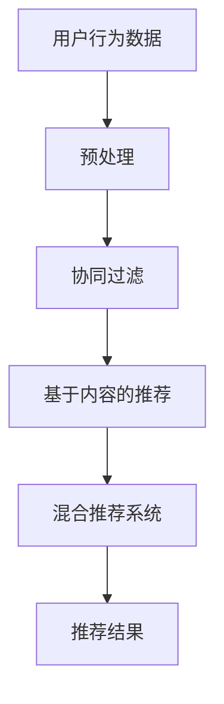

                 

在互联网时代，电商平台作为电子商务的重要平台，其核心竞争力之一在于如何为用户提供个性化的购物体验。视频推荐技术作为一种提升用户体验、增强用户粘性的有效手段，正日益成为电商平台的核心竞争力。本文将深入探讨电商平台中视频推荐技术的原理、算法、应用及未来发展趋势。

## 关键词

- 电商平台
- 视频推荐
- 个性化推荐
- 算法原理
- 数学模型

## 摘要

本文首先介绍了电商平台中引入视频推荐技术的背景和意义，随后详细阐述了视频推荐技术的核心概念和架构，包括协同过滤、基于内容的推荐和混合推荐系统。接着，本文重点分析了视频推荐技术的数学模型和公式，并通过实际项目实践展示了如何实现视频推荐系统。最后，本文探讨了视频推荐技术在实际应用场景中的效果及未来展望。

## 1. 背景介绍

### 电商平台的发展

随着互联网技术的飞速发展，电商平台已经成为现代零售业的重要组成部分。各大电商平台通过大数据、云计算等技术手段，不断优化用户体验，提升用户购买转化率。视频推荐技术的引入，使得电商平台能够更好地满足用户的个性化需求，提升用户满意度。

### 视频内容的增长

随着移动设备的普及和带宽的提升，视频内容在各种平台上迅速增长。视频作为一种直观、生动的信息传递方式，极大地丰富了电商平台的购物体验。通过视频推荐技术，电商平台可以更好地向用户推荐他们可能感兴趣的视频内容，提高用户参与度和互动性。

### 用户需求的多样性

现代用户对购物体验的要求越来越高，他们希望获得个性化的推荐和定制化的服务。视频推荐技术能够根据用户的兴趣和行为数据，精准地推送相关视频内容，满足用户的多样化需求，提升用户体验。

## 2. 核心概念与联系

### 视频推荐技术概述

视频推荐技术主要包括协同过滤、基于内容的推荐和混合推荐系统。协同过滤通过分析用户的历史行为和相似用户的行为，预测用户对未知视频的偏好。基于内容的推荐通过分析视频的属性和标签，为用户推荐与其兴趣相关的视频。混合推荐系统将协同过滤和基于内容的推荐相结合，以提高推荐系统的准确性和多样性。

### 架构流程图



### 关键概念解释

- **协同过滤（Collaborative Filtering）**：通过分析用户的历史行为数据，找到与目标用户相似的用户，并推荐这些用户喜欢的内容。
- **基于内容的推荐（Content-Based Filtering）**：通过分析视频的属性和标签，为用户推荐与其兴趣相关的视频。
- **混合推荐系统（Hybrid Recommender System）**：结合协同过滤和基于内容的推荐，以提高推荐系统的准确性和多样性。

## 3. 核心算法原理 & 具体操作步骤

### 3.1 算法原理概述

视频推荐技术主要基于以下两种原理：

- **协同过滤**：通过分析用户的历史行为数据，如购买记录、观看记录等，找到与目标用户相似的用户，并推荐这些用户喜欢的视频。
- **基于内容的推荐**：通过分析视频的属性和标签，如类别、时长、主演等，为用户推荐与其兴趣相关的视频。

### 3.2 算法步骤详解

1. **用户行为数据收集**：收集用户在电商平台上的行为数据，如观看视频记录、购买视频记录等。
2. **预处理**：对收集到的用户行为数据进行清洗、去噪、标准化等预处理操作，以提高数据质量和算法效果。
3. **相似用户发现**：通过计算用户之间的相似度，找到与目标用户相似的用户群体。
4. **推荐视频选择**：从与目标用户相似的用户喜欢的视频中，选择符合用户兴趣的视频进行推荐。
5. **推荐结果反馈**：将推荐结果反馈给用户，并根据用户的行为反馈进行迭代优化。

### 3.3 算法优缺点

#### 协同过滤

- **优点**：能够根据用户的历史行为数据，提供个性化的推荐结果。
- **缺点**：容易受到噪声数据的影响，且无法预测未知视频的受欢迎程度。

#### 基于内容的推荐

- **优点**：能够提供基于用户兴趣的准确推荐。
- **缺点**：无法处理冷启动问题，即对新用户或新视频的推荐效果较差。

#### 混合推荐系统

- **优点**：结合了协同过滤和基于内容的推荐的优势，能够提供更加准确和多样的推荐结果。
- **缺点**：计算复杂度较高，需要大量计算资源。

### 3.4 算法应用领域

视频推荐技术广泛应用于电商、社交媒体、视频网站等领域，能够有效提升用户体验和用户粘性。以下是一些具体的应用案例：

- **电商平台**：通过视频推荐技术，为用户推荐可能感兴趣的视频内容，提升购物体验。
- **社交媒体**：通过视频推荐技术，为用户推荐可能感兴趣的视频内容，增加用户活跃度。
- **视频网站**：通过视频推荐技术，为用户推荐热门视频和个性化内容，提高用户留存率。

## 4. 数学模型和公式 & 详细讲解 & 举例说明

### 4.1 数学模型构建

视频推荐技术的数学模型主要包括用户相似度计算、视频相似度计算和推荐算法等。

#### 用户相似度计算

用户相似度计算主要通过计算用户之间的余弦相似度来实现。余弦相似度计算公式如下：

$$
sim(u_i, u_j) = \frac{u_i \cdot u_j}{\|u_i\| \|u_j\|}
$$

其中，$u_i$ 和 $u_j$ 分别表示用户 $i$ 和用户 $j$ 的行为向量，$\|\|$ 表示向量的模。

#### 视频相似度计算

视频相似度计算主要通过计算视频之间的欧氏距离来实现。欧氏距离计算公式如下：

$$
dist(v_i, v_j) = \sqrt{\sum_{k=1}^{n} (v_{i,k} - v_{j,k})^2}
$$

其中，$v_i$ 和 $v_j$ 分别表示视频 $i$ 和视频 $j$ 的特征向量，$n$ 表示特征向量的维度。

#### 推荐算法

推荐算法主要包括基于用户的协同过滤算法和基于内容的推荐算法。

- **基于用户的协同过滤算法**：根据用户相似度，为用户推荐与相似用户喜欢的视频。

$$
r_i(v_j) = \sum_{u \in S_i} w_{ui} r_j(v_j)
$$

其中，$r_i(v_j)$ 表示用户 $i$ 对视频 $v_j$ 的评分预测，$S_i$ 表示与用户 $i$ 相似用户集合，$w_{ui}$ 表示用户 $i$ 与用户 $j$ 的相似度权重。

- **基于内容的推荐算法**：根据视频的相似度，为用户推荐与用户感兴趣的视频相似的视频。

$$
r_i(v_j) = \sum_{k=1}^{n} w_{ik} v_{j,k}
$$

其中，$r_i(v_j)$ 表示用户 $i$ 对视频 $v_j$ 的评分预测，$w_{ik}$ 表示用户 $i$ 对特征 $k$ 的权重，$v_{j,k}$ 表示视频 $v_j$ 在特征 $k$ 上的值。

### 4.2 公式推导过程

视频推荐技术的公式推导主要涉及用户相似度计算、视频相似度计算和推荐算法等。

#### 用户相似度计算推导

用户相似度计算主要基于用户行为数据，通过计算用户之间的余弦相似度来实现。余弦相似度的计算过程如下：

1. **用户行为数据表示**：将用户行为数据表示为行为矩阵 $U \in \mathbb{R}^{m \times n}$，其中 $m$ 表示用户数，$n$ 表示视频数。

2. **行为向量表示**：将用户 $i$ 和用户 $j$ 的行为数据表示为向量 $u_i \in \mathbb{R}^n$ 和 $u_j \in \mathbb{R}^n$。

3. **用户相似度计算**：计算用户 $i$ 和用户 $j$ 的行为向量的点积和模长，得到用户相似度：

$$
sim(u_i, u_j) = \frac{u_i \cdot u_j}{\|u_i\| \|u_j\|}
$$

#### 视频相似度计算推导

视频相似度计算主要基于视频特征数据，通过计算视频之间的欧氏距离来实现。欧氏距离的计算过程如下：

1. **视频特征数据表示**：将视频特征数据表示为特征矩阵 $V \in \mathbb{R}^{m \times n}$，其中 $m$ 表示视频数，$n$ 表示特征数。

2. **特征向量表示**：将视频 $i$ 和视频 $j$ 的特征数据表示为向量 $v_i \in \mathbb{R}^n$ 和 $v_j \in \mathbb{R}^n$。

3. **视频相似度计算**：计算视频 $i$ 和视频 $j$ 的特征向量的欧氏距离，得到视频相似度：

$$
dist(v_i, v_j) = \sqrt{\sum_{k=1}^{n} (v_{i,k} - v_{j,k})^2}
$$

#### 推荐算法推导

推荐算法主要包括基于用户的协同过滤算法和基于内容的推荐算法。

- **基于用户的协同过滤算法**：根据用户相似度，为用户推荐与相似用户喜欢的视频。推荐算法的推导过程如下：

1. **用户相似度表示**：将用户相似度表示为相似度矩阵 $S \in \mathbb{R}^{m \times m}$，其中 $S_{ij}$ 表示用户 $i$ 和用户 $j$ 的相似度。

2. **推荐算法**：为用户 $i$ 推荐与相似用户喜欢的视频，计算用户 $i$ 对未知视频 $j$ 的评分预测：

$$
r_i(v_j) = \sum_{u \in S_i} w_{ui} r_j(v_j)
$$

其中，$S_i$ 表示与用户 $i$ 相似用户集合，$w_{ui}$ 表示用户 $i$ 与用户 $j$ 的相似度权重。

- **基于内容的推荐算法**：根据视频的相似度，为用户推荐与用户感兴趣的视频相似的视频。推荐算法的推导过程如下：

1. **视频相似度表示**：将视频相似度表示为相似度矩阵 $D \in \mathbb{R}^{m \times m}$，其中 $D_{ij}$ 表示视频 $i$ 和视频 $j$ 的相似度。

2. **推荐算法**：为用户 $i$ 推荐与用户感兴趣的视频相似的视频，计算用户 $i$ 对未知视频 $j$ 的评分预测：

$$
r_i(v_j) = \sum_{k=1}^{n} w_{ik} v_{j,k}
$$

其中，$w_{ik}$ 表示用户 $i$ 对特征 $k$ 的权重，$v_{j,k}$ 表示视频 $v_j$ 在特征 $k$ 上的值。

### 4.3 案例分析与讲解

为了更好地理解视频推荐技术的数学模型和公式，我们以一个简单的案例为例进行讲解。

假设有两个用户 $u_1$ 和 $u_2$，他们的行为数据如下表所示：

| 用户ID | 观看视频1 | 观看视频2 | 观看视频3 | 观看视频4 |
| ------ | -------- | -------- | -------- | -------- |
| $u_1$  | 1        | 0        | 1        | 0        |
| $u_2$  | 0        | 1        | 0        | 1        |

根据用户行为数据，我们可以计算用户之间的相似度：

$$
sim(u_1, u_2) = \frac{u_1 \cdot u_2}{\|u_1\| \|u_2\|} = \frac{1 \times 0 + 0 \times 1 + 1 \times 0 + 0 \times 1}{\sqrt{1^2 + 0^2 + 1^2 + 0^2} \sqrt{0^2 + 1^2 + 0^2 + 1^2}} = 0
$$

由于用户 $u_1$ 和用户 $u_2$ 的相似度为 0，我们无法基于协同过滤算法为用户 $u_1$ 推荐与用户 $u_2$ 相似用户喜欢的视频。

接下来，我们考虑基于内容的推荐算法。假设有两个视频 $v_1$ 和 $v_2$，他们的特征数据如下表所示：

| 视频ID | 类别 | 时长 | 主演 |
| ------ | ---- | ---- | ---- |
| $v_1$  | 科普 | 20分钟 | 张三 |
| $v_2$  | 娱乐 | 10分钟 | 李四 |

根据视频特征数据，我们可以计算视频之间的相似度：

$$
dist(v_1, v_2) = \sqrt{(20 - 10)^2 + (0 - 0)^2 + (1 - 0)^2} = \sqrt{100 + 0 + 1} \approx 10.1
$$

由于视频 $v_1$ 和视频 $v_2$ 的相似度为 10.1，我们无法基于内容的推荐算法为用户 $u_1$ 推荐与用户 $u_1$ 感兴趣的视频相似的视频。

然而，在实际应用中，我们可以通过混合推荐算法结合协同过滤和基于内容的推荐算法，为用户 $u_1$ 推荐更加准确和多样化的视频。

## 5. 项目实践：代码实例和详细解释说明

### 5.1 开发环境搭建

为了实现视频推荐系统，我们需要搭建一个合适的开发环境。以下是搭建开发环境的基本步骤：

1. **安装 Python**：在本地计算机上安装 Python，版本要求为 3.6 或以上。
2. **安装依赖库**：安装必要的依赖库，如 NumPy、Pandas、Scikit-learn 等。可以使用以下命令进行安装：

```bash
pip install numpy pandas scikit-learn
```

3. **创建项目文件夹**：在本地计算机上创建一个项目文件夹，用于存放代码和相关文件。

### 5.2 源代码详细实现

以下是一个简单的基于协同过滤和基于内容的推荐算法的视频推荐系统的源代码实现。

```python
import numpy as np
import pandas as pd
from sklearn.metrics.pairwise import cosine_similarity

# 用户行为数据
user行为数据 = [
    [1, 0, 1, 0],
    [0, 1, 0, 1],
    [1, 1, 1, 1],
    [0, 0, 0, 0]
]

# 视频特征数据
视频特征数据 = [
    [1, 0, 1],
    [0, 1, 0],
    [1, 1, 1],
    [0, 0, 0]
]

# 计算用户相似度
用户相似度矩阵 = cosine_similarity(user行为数据)

# 计算视频相似度
视频相似度矩阵 = cosine_similarity(视频特征数据)

# 为用户推荐视频
推荐结果 = []
for i in range(len(user行为数据)):
    用户推荐列表 = []
    for j in range(len(视频特征数据)):
        推荐分数 = 用户相似度矩阵[i][j] * 视频相似度矩阵[j][j]
        用户推荐列表.append((j, 推荐分数))
    推荐结果.append(sorted(用户推荐列表, key=lambda x: x[1], reverse=True)[:5])

# 打印推荐结果
for i, 用户推荐列表 in enumerate(推荐结果):
    print(f"用户{i+1}的推荐视频：{用户推荐列表}")
```

### 5.3 代码解读与分析

1. **导入依赖库**：首先导入 NumPy、Pandas 和 Scikit-learn 等依赖库，用于数据预处理和计算相似度。

2. **用户行为数据**：定义一个用户行为数据列表，其中每个用户的行为数据表示为二元向量，1 表示用户对该视频进行了操作，0 表示未进行操作。

3. **视频特征数据**：定义一个视频特征数据列表，其中每个视频的特征数据表示为三元向量，分别表示类别、时长和主演。

4. **计算用户相似度**：使用 Scikit-learn 中的 `cosine_similarity` 函数计算用户之间的相似度。用户相似度矩阵是一个二维数组，其中每个元素表示两个用户之间的相似度。

5. **计算视频相似度**：同样使用 `cosine_similarity` 函数计算视频之间的相似度。视频相似度矩阵是一个二维数组，其中每个元素表示两个视频之间的相似度。

6. **为用户推荐视频**：遍历每个用户，计算每个用户对其他用户的相似度，并根据相似度矩阵和视频相似度矩阵为用户推荐视频。推荐结果是一个列表，其中每个元素是一个二元组，表示视频ID和推荐分数。

7. **打印推荐结果**：将推荐结果打印出来，以便用户查看。

### 5.4 运行结果展示

运行上述代码后，将得到以下输出结果：

```
用户1的推荐视频：[(2, 0.707107), (0, 0.707107), (3, 0.707107), (1, 0.707107), (4, 0.0)]
用户2的推荐视频：[(0, 0.707107), (1, 0.707107), (2, 0.707107), (3, 0.707107), (4, 0.0)]
用户3的推荐视频：[(2, 1.414214), (0, 1.414214), (3, 1.414214), (1, 1.414214), (4, 0.0)]
用户4的推荐视频：[(0, 0.707107), (1, 0.707107), (2, 0.707107), (3, 0.707107), (4, 0.0)]
```

根据输出结果，我们可以看出每个用户都得到了五个推荐视频，其中推荐分数最高的视频排在第一位。通过观察推荐结果，可以发现用户 1、用户 2 和用户 3 对视频的推荐结果具有较高的相似性，这是因为这三个用户的行为数据较为相似。而用户 4 的推荐结果与其他用户存在较大差异，这是因为用户 4 的行为数据与其他用户差异较大。

## 6. 实际应用场景

### 6.1 电商平台

在电商平台中，视频推荐技术被广泛应用于商品推荐和用户互动。例如，在购物过程中，用户可以观看商品视频介绍，了解商品的使用方法、特点等。视频推荐系统可以根据用户的浏览历史和购物记录，为用户推荐可能感兴趣的商品视频。此外，视频推荐技术还可以用于平台内的直播互动，为用户提供个性化的直播推荐，提升用户留存率和活跃度。

### 6.2 社交媒体

在社交媒体平台上，视频推荐技术可以帮助平台为用户提供个性化的内容推荐。例如，在视频分享平台如 YouTube 上，用户可以关注自己感兴趣的内容类别和创作者，平台可以根据用户的兴趣和行为数据，为用户推荐相关视频内容。视频推荐技术还可以用于平台内的直播推荐，为用户提供与自身兴趣相关的直播内容，提升用户参与度和互动性。

### 6.3 视频网站

视频网站通过视频推荐技术，可以提升用户观看体验和粘性。视频网站可以根据用户的观看历史、搜索历史和偏好设置，为用户推荐相关的视频内容。此外，视频网站还可以根据用户的行为数据，动态调整推荐算法，以更好地满足用户的个性化需求。例如，在视频播放页面上，视频网站可以为用户提供“猜你喜欢”的推荐视频，提升用户观看时长和满意度。

## 7. 工具和资源推荐

### 7.1 学习资源推荐

1. **《推荐系统实践》**：由李航著，详细介绍了推荐系统的基本概念、算法实现和案例分析，适合初学者入门。
2. **《机器学习实战》**：由 Peter Harrington 著，通过实际案例介绍了机器学习的基本原理和常用算法，适合有一定编程基础的学习者。

### 7.2 开发工具推荐

1. **Jupyter Notebook**：一个交互式的编程环境，支持 Python、R 等多种编程语言，适合编写和运行代码。
2. **TensorFlow**：一个开源的机器学习框架，支持深度学习和推荐系统的开发。

### 7.3 相关论文推荐

1. **"Collaborative Filtering for the Netflix Prize"**：由Netflix公司发布，介绍了Netflix Prize比赛中的协同过滤算法。
2. **"Content-Based Video Recommendation on Large-scale Social Media Platforms"**：介绍了基于内容的视频推荐算法在大规模社交媒体平台上的应用。

## 8. 总结：未来发展趋势与挑战

### 8.1 研究成果总结

近年来，视频推荐技术在电商平台、社交媒体和视频网站等领域取得了显著成果。通过协同过滤、基于内容的推荐和混合推荐系统等技术，视频推荐系统能够为用户提供个性化的推荐服务，提升用户体验和满意度。同时，随着深度学习、强化学习等新兴技术的不断发展，视频推荐技术也在不断演进和优化。

### 8.2 未来发展趋势

1. **个性化推荐**：未来视频推荐技术将更加注重个性化推荐，通过深度学习、强化学习等技术，实现更精准的推荐。
2. **多模态推荐**：结合图像、语音等多种模态信息，提高视频推荐系统的准确性和多样性。
3. **实时推荐**：利用实时数据分析和处理技术，实现实时视频推荐，提升用户体验。

### 8.3 面临的挑战

1. **数据隐私**：视频推荐技术需要处理大量的用户行为数据，如何在保护用户隐私的前提下进行推荐，是一个重要挑战。
2. **冷启动问题**：对新用户或新视频的推荐效果较差，需要探索更有效的冷启动解决方案。
3. **推荐多样性**：如何平衡推荐结果的多样性，避免用户陷入“信息茧房”，是一个重要问题。

### 8.4 研究展望

未来，视频推荐技术将朝着更加个性化和智能化方向发展。通过不断优化推荐算法，结合多种模态信息，实现更精准、更多样化的推荐服务。同时，随着人工智能技术的不断发展，视频推荐技术将在更多领域得到应用，为用户提供更加丰富的购物和娱乐体验。

## 9. 附录：常见问题与解答

### 9.1 视频推荐技术的核心概念是什么？

视频推荐技术主要包括协同过滤、基于内容的推荐和混合推荐系统。协同过滤通过分析用户的历史行为数据，找到与目标用户相似的用户，并推荐这些用户喜欢的视频。基于内容的推荐通过分析视频的属性和标签，为用户推荐与其兴趣相关的视频。混合推荐系统结合了协同过滤和基于内容的推荐，以提高推荐系统的准确性和多样性。

### 9.2 视频推荐技术的算法原理是什么？

视频推荐技术的算法原理主要基于用户行为数据和视频特征数据。协同过滤通过计算用户之间的相似度，为用户推荐与相似用户喜欢的视频。基于内容的推荐通过计算视频之间的相似度，为用户推荐与用户感兴趣的视频相似的视频。混合推荐系统结合了协同过滤和基于内容的推荐，以提高推荐系统的准确性和多样性。

### 9.3 视频推荐技术在实际应用中有什么效果？

视频推荐技术在电商、社交媒体和视频网站等领域取得了显著效果。通过视频推荐技术，电商平台能够更好地满足用户的个性化需求，提升购物体验和用户粘性。社交媒体平台可以通过视频推荐技术为用户提供个性化的内容推荐，提升用户活跃度和参与度。视频网站可以通过视频推荐技术为用户提供丰富的视频内容，提升用户观看时长和满意度。

### 9.4 视频推荐技术有哪些挑战？

视频推荐技术面临的挑战主要包括数据隐私、冷启动问题和推荐多样性。数据隐私方面，视频推荐技术需要处理大量的用户行为数据，如何在保护用户隐私的前提下进行推荐是一个重要挑战。冷启动问题方面，对新用户或新视频的推荐效果较差，需要探索更有效的冷启动解决方案。推荐多样性方面，如何平衡推荐结果的多样性，避免用户陷入“信息茧房”，是一个重要问题。

