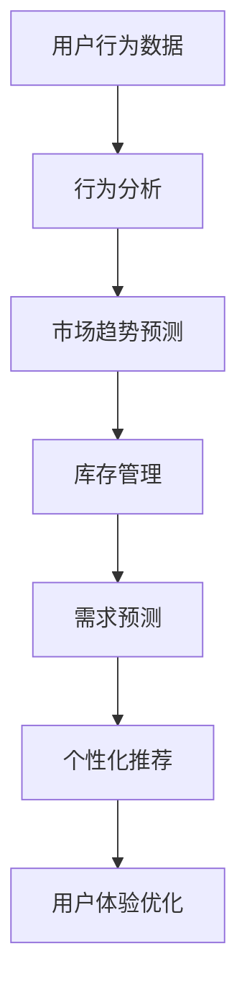
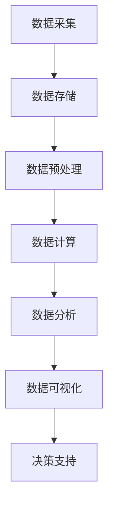

                 

关键词：电商平台、供给能力、大数据分析、应用、优化、预测、推荐、用户行为、供应链管理

> 摘要：本文将探讨大数据分析在电商平台供给能力提升中的应用。通过分析用户行为、市场趋势和供应链数据，电商平台能够实现更精准的库存管理、需求预测和个性化推荐，从而提升供给能力，增强用户满意度。

## 1. 背景介绍

随着互联网和电子商务的快速发展，电商平台已经成为现代商业不可或缺的一部分。然而，如何提升供给能力，满足不断变化的市场需求和用户期望，成为电商平台面临的重要挑战。大数据分析作为一种新兴技术，为电商平台解决这一问题提供了有力的工具。

大数据分析是指对海量数据进行分析和处理，从中提取有价值的信息和知识。在电商平台中，大数据分析可以应用于用户行为分析、市场趋势预测、供应链管理等多个方面，从而提升供给能力。

## 2. 核心概念与联系

### 2.1 大数据分析在电商平台中的应用

在电商平台中，大数据分析的核心应用包括用户行为分析、市场趋势预测、库存管理、需求预测、个性化推荐等。以下是一个简化的 Mermaid 流程图，展示了这些核心应用及其之间的联系。



### 2.2 数据来源与处理

电商平台的数据来源广泛，包括用户行为数据、订单数据、商品数据、供应链数据等。这些数据经过采集、清洗、整合和存储后，可以为大数据分析提供基础。

### 2.3 大数据分析架构

大数据分析通常采用分布式计算架构，如 Hadoop、Spark 等。这种架构可以处理海量数据，并提供高效的计算能力。以下是一个简化的 Mermaid 流程图，展示了大数据分析的基本架构。



## 3. 核心算法原理 & 具体操作步骤

### 3.1 算法原理概述

大数据分析涉及多种算法和技术，包括机器学习、数据挖掘、统计分析等。以下简要介绍几种在电商平台供给能力提升中常用的算法：

- **用户行为分析**：使用聚类分析、关联规则挖掘等算法，分析用户行为模式，挖掘用户偏好。
- **市场趋势预测**：使用时间序列分析、回归分析等算法，预测市场趋势。
- **库存管理**：使用预测模型、优化算法，实现库存的动态调整。
- **需求预测**：使用机器学习、深度学习等算法，预测商品需求。

### 3.2 算法步骤详解

- **用户行为分析**：
  1. 数据采集：收集用户行为数据，如浏览记录、购物车、购买历史等。
  2. 数据清洗：去除重复数据、处理缺失值等。
  3. 数据整合：将不同来源的数据进行整合，形成统一的用户行为数据集。
  4. 数据分析：使用聚类分析、关联规则挖掘等算法，分析用户行为模式。

- **市场趋势预测**：
  1. 数据采集：收集市场数据，如销售额、库存量、促销活动等。
  2. 数据清洗：去除异常值、处理缺失值等。
  3. 数据整合：将不同来源的数据进行整合，形成统一的市场数据集。
  4. 数据分析：使用时间序列分析、回归分析等算法，预测市场趋势。

- **库存管理**：
  1. 数据采集：收集库存数据，如商品数量、库存成本等。
  2. 数据清洗：去除重复数据、处理缺失值等。
  3. 数据整合：将不同来源的数据进行整合，形成统一的库存数据集。
  4. 数据分析：使用预测模型、优化算法，实现库存的动态调整。

- **需求预测**：
  1. 数据采集：收集用户行为数据、市场数据等。
  2. 数据清洗：去除重复数据、处理缺失值等。
  3. 数据整合：将不同来源的数据进行整合，形成统一的需求数据集。
  4. 数据分析：使用机器学习、深度学习等算法，预测商品需求。

### 3.3 算法优缺点

- **用户行为分析**：
  - 优点：能够深入了解用户偏好和行为模式，为个性化推荐提供依据。
  - 缺点：数据量大，计算复杂度高，容易产生过拟合。

- **市场趋势预测**：
  - 优点：能够预测市场变化，指导库存管理和营销策略。
  - 缺点：受历史数据质量影响较大，预测准确性存在一定风险。

- **库存管理**：
  - 优点：能够实现库存的动态调整，降低库存成本。
  - 缺点：对预测模型和优化算法要求较高，实施难度较大。

- **需求预测**：
  - 优点：能够预测商品需求，指导生产和采购。
  - 缺点：受用户行为和市场变化影响较大，预测准确性存在一定风险。

### 3.4 算法应用领域

大数据分析在电商平台中的应用领域广泛，如：

- **个性化推荐**：基于用户行为分析，为用户推荐感兴趣的商品。
- **智能客服**：基于用户行为分析，实现智能化的客户服务。
- **库存优化**：基于库存管理和需求预测，实现库存的动态调整。
- **供应链管理**：基于市场趋势预测和需求预测，优化供应链流程。

## 4. 数学模型和公式 & 详细讲解 & 举例说明

### 4.1 数学模型构建

在电商平台供给能力提升中，常用的数学模型包括：

- **聚类分析**：用于分析用户行为数据，识别用户群体。
- **关联规则挖掘**：用于分析用户行为数据，发现用户偏好。
- **时间序列分析**：用于预测市场趋势。
- **回归分析**：用于预测商品需求。
- **优化算法**：用于库存管理。

### 4.2 公式推导过程

以下简要介绍几个常用的数学模型的公式推导过程：

- **K-Means 算法**：
  - 目标函数：$$J = \sum_{i=1}^{k} \sum_{x \in S_i} d(x, \mu_i)^2$$
    其中，$d(x, \mu_i)$表示$x$到聚类中心$\mu_i$的距离。

- **Apriori 算法**：
  - 支持度：$$support(itemset) = \frac{count(itemset)}{total\_transactions}$$
  - 置信度：$$confidence(association\_rule) = \frac{support(left\_itemset)}{support(right\_itemset)}$$

- **时间序列模型**：
  - ARIMA 模型：$$X_t = \phi_1 X_{t-1} + \phi_2 X_{t-2} + ... + \phi_p X_{t-p} + \theta_1 \epsilon_{t-1} + \theta_2 \epsilon_{t-2} + ... + \theta_q \epsilon_{t-q} + \epsilon_t$$
    其中，$X_t$表示时间序列的当前值，$\epsilon_t$表示随机误差。

- **线性回归模型**：
  - 目标函数：$$J = \sum_{i=1}^{n} (y_i - \beta_0 - \beta_1 x_i)^2$$
    其中，$y_i$表示实际需求，$x_i$表示影响因素。

### 4.3 案例分析与讲解

以某电商平台的用户行为分析为例，说明数学模型的应用。

- **数据采集**：收集用户浏览记录、购物车数据、购买历史等。
- **数据清洗**：去除重复数据、处理缺失值等。
- **数据整合**：将不同来源的数据进行整合，形成统一的用户行为数据集。

- **聚类分析**：
  1. 确定聚类个数$k$：根据平台规模和用户数量，选取合适的聚类个数。
  2. 初始化聚类中心$\mu_i$：随机选择$k$个用户作为初始聚类中心。
  3. 计算用户到聚类中心的距离：$$d(x, \mu_i) = \sqrt{\sum_{j=1}^{n} (x_j - \mu_{ij})^2}$$
  4. 调整聚类中心：$$\mu_i = \frac{\sum_{x \in S_i} x}{|S_i|}$$
  5. 重复步骤3和4，直到聚类中心不再发生变化。

- **关联规则挖掘**：
  1. 确定最小支持度阈值$min\_support$和最小置信度阈值$min\_confidence$。
  2. 计算各个项集的支持度。
  3. 生成关联规则。
  4. 过滤不满足最小支持度和最小置信度的规则。

- **用户偏好分析**：
  1. 对每个用户，计算其浏览记录、购物车和购买历史中的关联规则。
  2. 对每个用户，选取置信度较高的关联规则，分析其偏好。

## 5. 项目实践：代码实例和详细解释说明

### 5.1 开发环境搭建

- **Python 环境**：安装 Python 3.8 及相关依赖库，如 Pandas、Scikit-learn、Numpy 等。
- **数据存储**：使用 MySQL 或其他数据库存储数据。
- **数据分析工具**：使用 Jupyter Notebook 进行数据分析。

### 5.2 源代码详细实现

以下是一个简单的 Python 代码示例，实现用户行为分析。

```python
import pandas as pd
from sklearn.cluster import KMeans
from mlxtend.frequent_patterns import apriori, association_rules

# 读取数据
data = pd.read_csv('user_behavior_data.csv')

# 数据预处理
data = data.drop_duplicates()
data = data.fillna(0)

# 聚类分析
kmeans = KMeans(n_clusters=3, random_state=42)
clusters = kmeans.fit_predict(data)

# 关联规则挖掘
frequent_itemsets = apriori(data, min_support=0.05, use_colnames=True)
rules = association_rules(frequent_itemsets, metric="support", min_threshold=0.1)

# 用户偏好分析
user_preferences = rules.groupby('antecedents')['confidence'].mean()
```

### 5.3 代码解读与分析

- **数据读取与预处理**：使用 Pandas 读取用户行为数据，去除重复数据和缺失值。
- **聚类分析**：使用 K-Means 算法进行聚类，确定用户群体。
- **关联规则挖掘**：使用 Apriori 算法和 mlxtend 库挖掘用户行为数据中的关联规则。
- **用户偏好分析**：计算每个用户的偏好，为个性化推荐提供依据。

### 5.4 运行结果展示

- **用户群体分析**：根据聚类结果，分析不同用户群体的特点。
- **关联规则分析**：列出置信度较高的关联规则，分析用户偏好。
- **用户偏好分析**：展示每个用户的偏好，为个性化推荐提供依据。

## 6. 实际应用场景

### 6.1 个性化推荐

基于用户行为分析，电商平台可以为用户提供个性化推荐，提高用户满意度和购买转化率。

### 6.2 智能客服

通过分析用户行为数据，智能客服系统可以更好地理解用户需求，提供更优质的客服体验。

### 6.3 库存管理

基于库存管理和需求预测，电商平台可以实现库存的动态调整，降低库存成本，提高库存周转率。

### 6.4 供应链管理

通过大数据分析，电商平台可以优化供应链流程，提高供应链效率，降低供应链成本。

## 7. 未来应用展望

随着大数据分析技术的不断发展，未来电商平台供给能力的提升将更加智能化和精细化。以下是一些未来应用展望：

### 7.1 智能预测与决策

利用深度学习和强化学习等技术，实现更精准的市场预测和需求预测，为库存管理和供应链管理提供决策支持。

### 7.2 跨平台整合

将电商平台与其他平台（如社交媒体、线下门店等）进行整合，实现更全面的数据分析和应用。

### 7.3 智能供应链管理

通过物联网和区块链技术，实现供应链的智能化管理，提高供应链透明度和效率。

## 8. 工具和资源推荐

### 8.1 学习资源推荐

- 《大数据分析：技术、方法与应用》
- 《机器学习实战》
- 《深度学习》（Goodfellow et al.）

### 8.2 开发工具推荐

- Python（数据分析、机器学习）
- Jupyter Notebook（交互式数据分析）
- Hadoop（分布式计算）
- Spark（分布式计算）

### 8.3 相关论文推荐

- "Large-scale Parallel K-Means Clustering"
- "eBay's Algorithmic Feedback Loop: Using Big Data to Increase Seller Efficiency"
- "A Survey of Recommender Systems"

## 9. 总结：未来发展趋势与挑战

### 9.1 研究成果总结

大数据分析在电商平台供给能力提升中取得了显著成果，包括个性化推荐、库存管理、需求预测等。

### 9.2 未来发展趋势

未来，大数据分析在电商平台中的应用将更加智能化、精细化，涉及领域将不断拓展。

### 9.3 面临的挑战

数据质量、计算能力、算法优化等方面仍存在挑战，需要不断改进。

### 9.4 研究展望

未来，大数据分析技术将在电商平台供给能力提升中发挥更大的作用，实现更高效、更智能的运营管理。

## 10. 附录：常见问题与解答

### 10.1 大数据分析与数据挖掘的区别是什么？

大数据分析是一种更广泛的概念，它包括数据采集、存储、处理、分析和可视化等多个环节。数据挖掘是大数据分析的一个子领域，主要关注如何从海量数据中提取有价值的信息和知识。

### 10.2 如何保证大数据分析的结果准确性和可靠性？

保证大数据分析的结果准确性和可靠性需要从数据质量、算法选择、模型评估等多个方面进行考虑。数据质量是基础，算法选择要合适，模型评估要全面。

### 10.3 大数据分析对电商平台有哪些影响？

大数据分析可以提高电商平台的供给能力，优化库存管理、需求预测、个性化推荐等，从而提高用户满意度和市场份额。

作者：禅与计算机程序设计艺术 / Zen and the Art of Computer Programming
----------------------------------------------------------------

文章撰写完毕，接下来我们将进行文章的格式化处理，包括 markdown 格式的编写、章节标题的层级结构安排、列表和公式的正确嵌入等，以确保文章的阅读体验和专业性。之后，我们将对文章进行最终的校对和审核，确保内容完整、逻辑清晰、无语法错误，并符合所要求的字数。完成这些步骤后，文章将准备发布。如果您有任何修改意见或需要进一步的工作，请告知。

